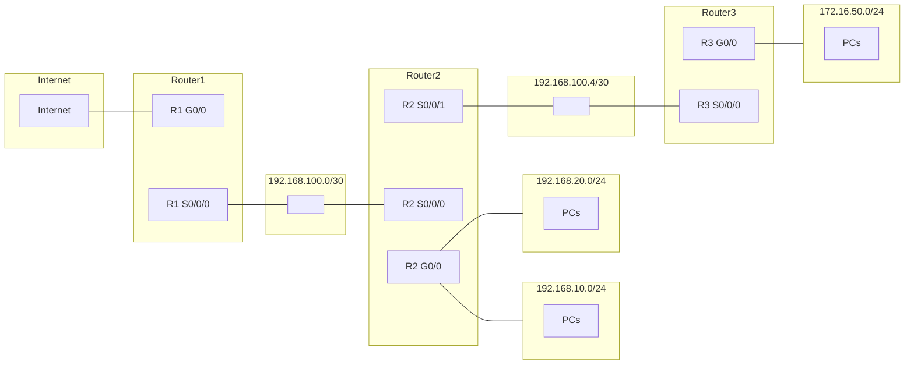
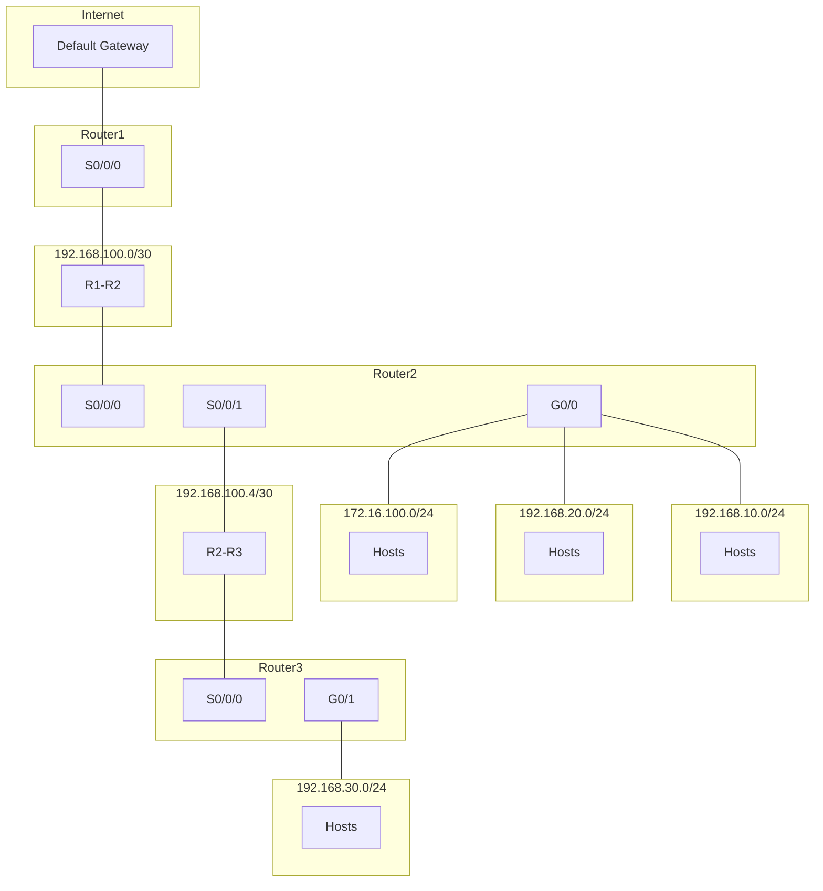
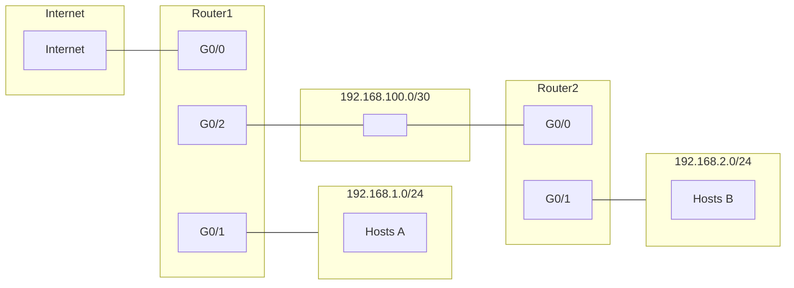
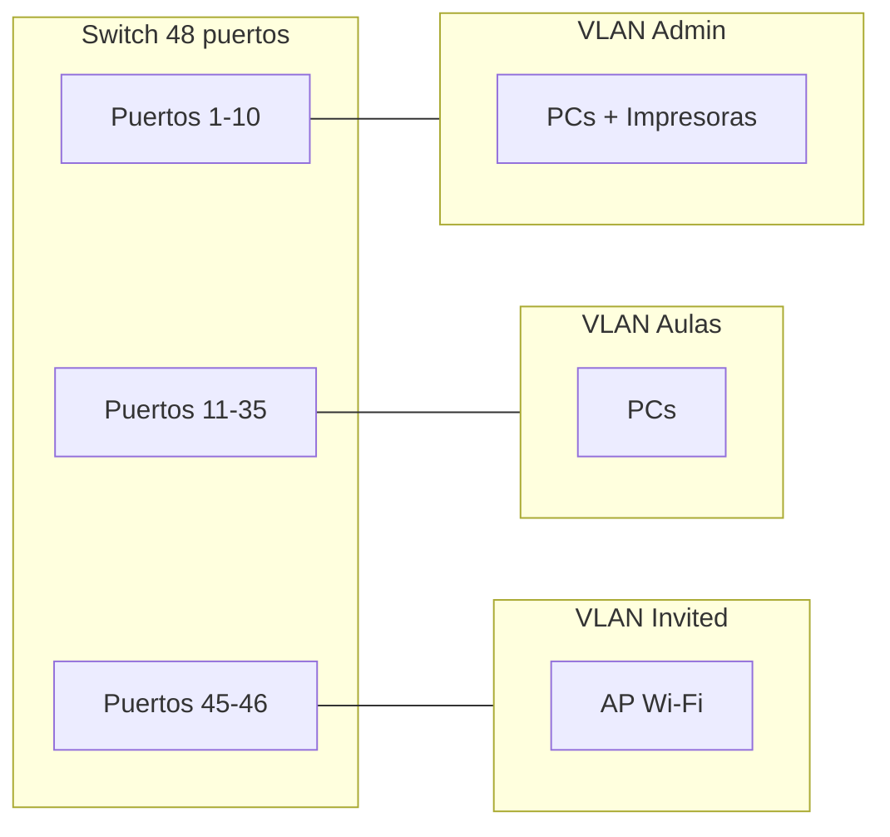
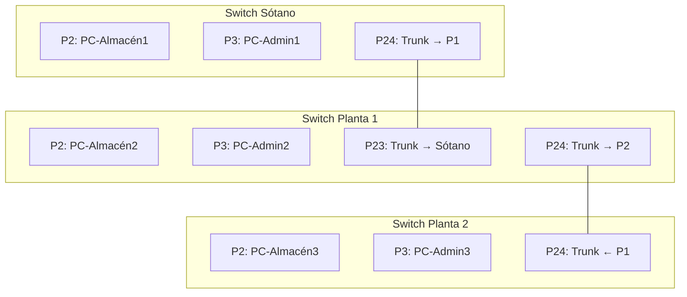
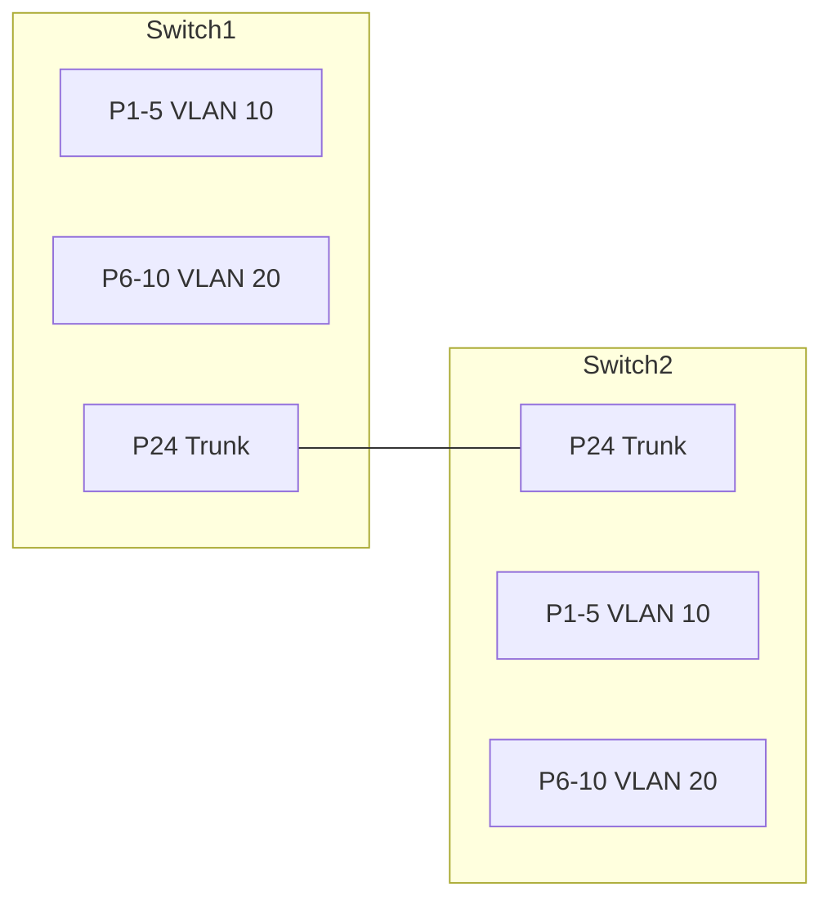
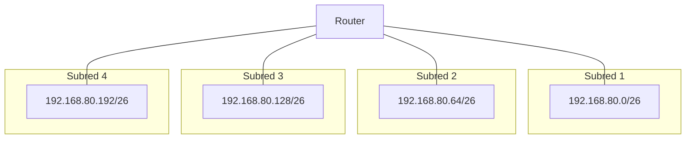
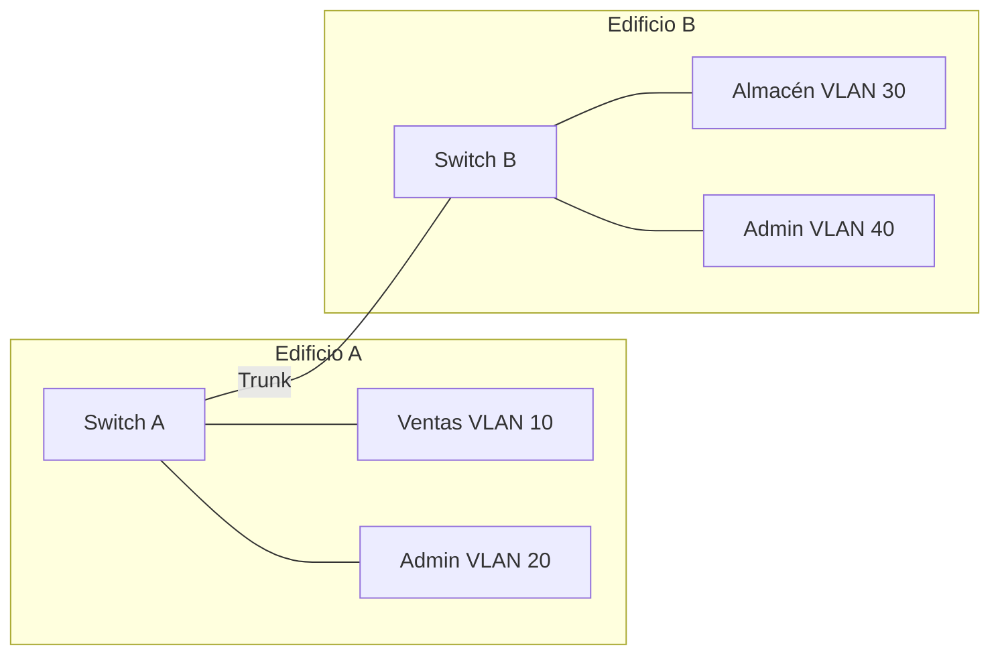

# Examen Unidad 7 – Enrutamiento, Subnetting y VLANs (CLAVE PROFESOR)

!!! warning "Documento interno"
    Este archivo es de uso exclusivo del profesorado. No debe estar accesible al alumnado.

---

## Subnetting

### Actividad 1 – Red 10.0.50.0
Se tiene la red **10.0.50.0** (clase A subneteada en el tercer octeto; máscara por defecto /24 en ese bloque).

1. ¿Qué máscara hay que aplicar para obtener **8 subredes**?
2. ¿Cuántos hosts utilizables tendrá cada subred?
3. Escribe las direcciones de red de las 8 subredes.
4. ¿Cuál es la dirección del nodo con identificador 10 en la subred 3?
5. ¿A qué subred pertenece el host 10.0.50.118?

---

### Actividad 2 – Empresa con 30 redes
A una empresa se le asigna la red **172.16.0.0**. Necesita **30 subredes**.

1. Máscara de subred por defecto (sin dividir).
2. Máscara subneteada para obtener al menos 30 subredes.
3. Direcciones de red de la 1.ª, 2.ª, 15.ª y 30.ª subred.
4. Rango de IP válidas (primera y última) de la subred 15.
5. Dirección de broadcast de la subred 30.

---

### Actividad 3 – Red 192.168.200.0/26
Dada la red **192.168.200.0/26**:

1. Indica dirección de red, broadcast y número de hosts utilizables (sin subdividir).
2. Divídela en **4 subredes** del mismo tamaño. Indica las direcciones de red de las 4 subredes.
3. Para cada una de las 4 subredes: rango de IP válidas (primera y última) y dirección de broadcast.

---

### Actividad 4 – Red 10.10.0.0/22
Dada la red **10.10.0.0/22**:

1. Dirección de red, dirección de broadcast y número de hosts utilizables (sin subdividir).
2. Divídela en **4 subredes** iguales (usando máscara /24). Indica las direcciones de red.
3. ¿A qué subred /24 pertenece el host 10.10.2.50?
4. Indica la primera y última IP válida de la subred que contiene 10.10.3.200.

---

### Actividad 5 – Red 192.168.88.0
Red **192.168.88.0** (clase C).

1. ¿Qué máscara aplicar para **32 subredes**?
2. ¿Cuántos hosts por subred?
3. Nombra las direcciones de red de las subredes 1, 16 y 32.
4. ¿Cuál es la IP del host 7 en la subred 20?
5. El host 192.168.88.211, ¿a qué subred pertenece?

---

## Supernetting

### Actividad 6 – Cuatro sedes
Una empresa tiene 4 sedes con redes: **Sede A** 192.168.12.0/24, **Sede B** 192.168.13.0/24, **Sede C** 192.168.14.0/24, **Sede D** 192.168.15.0/24. Se quiere resumir en una superred.

1. Identifica el octeto que cambia entre las redes.
2. Escribe en binario ese octeto para cada sede.
3. Indica cuántos bits de la izquierda son iguales en los cuatro valores.
4. Calcula la nueva máscara según los bits coincidentes.
5. Escribe la superred resultante (dirección y prefijo CIDR).

---

### Actividad 7 – Ocho departamentos
Ocho redes departamentales: **192.168.32.0/24**, **192.168.33.0/24**, … **192.168.39.0/24**.

1. Identifica el octeto que varía y escríbelo en binario para cada red (solo el octeto que cambia).
2. Cuenta cuántos bits de la izquierda son iguales en los ocho casos.
3. Calcula la máscara de la superred y el prefijo CIDR.
4. Indica la dirección de la superred resultante y el rango total de IP que abarca.

---

### Actividad 8 – Tres redes contiguas
Se agrupan **192.168.100.0/24**, **192.168.101.0/24** y **192.168.102.0/24**.

1. ¿Se pueden agrupar en una superred? Justifica (contigüidad y prefijo).
2. Octeto que varía en binario para las tres redes.
3. Bits coincidentes y nueva máscara.
4. Superred resultante con prefijo CIDR.

---

## Enrutamiento estático

### Actividad 9 – Topología A (tres routers en línea)

Diagrama de la topología:

- **Router1**: G0/0 hacia Internet (ruta por defecto), S0/0/0 hacia Router2 (**192.168.100.0/30**).
- **Router2**: G0/0 **192.168.10.0/24** y **192.168.20.0/24** (dos LANs), S0/0/0 enlace a R1, S0/0/1 enlace a R3 (**192.168.100.4/30**).
- **Router3**: G0/0 **172.16.50.0/24**, S0/0/0 enlace a R2.

**Tareas:**

1. Asigna IP a las interfaces del **Router2** (criterio: primer host válido del segmento para el router).
2. Elabora la **tabla de rutas estáticas del Router2**: red destino, máscara, siguiente salto e interfaz.
3. Justifica qué entradas son conexión directa y cuáles usan siguiente salto.

---

### Actividad 10 – Topología B (misma referencia, tabla Router1)

Usando la **misma topología del tema** (Router1 ↔ Router2 ↔ Router3; enlaces 192.168.100.0/30 y 192.168.100.4/30; Router2 con 172.16.100.0/24; Router3 con 192.168.30.0/24; 192.168.10.0/24 y 192.168.20.0/24; ruta por defecto a Internet):

1. Indica la **IP de la interfaz** del Router1 en el enlace con Router2.
2. Elabora la **tabla de rutas estáticas del Router1** (red destino, máscara, siguiente salto, interfaz) para alcanzar todas las redes y la ruta por defecto.
3. Explica por qué en este diseño todas las rutas no directas del Router1 usan el mismo siguiente salto.

---

### Actividad 11 – Topología C (dos routers)

- Router1: G0/0 hacia Internet, G0/1 con 192.168.1.0/24, G0/2 enlace a R2 (192.168.100.0/30).
- Router2: G0/0 enlace a R1, G0/1 con 192.168.2.0/24.

1. Asigna IP a las interfaces de ambos routers (primer host válido del segmento).
2. Tabla de rutas estáticas del **Router2** para alcanzar 192.168.1.0/24 e Internet (ruta por defecto).
3. ¿Qué siguiente salto usa Router2 para 192.168.1.0/24 y para 0.0.0.0/0?

---

### Actividad 12 – Ruta por defecto y tabla Router3
Con la **topología del tema** (Router1–Router2–Router3, enlaces /30, 192.168.10.0/24, 192.168.20.0/24, 172.16.100.0/24, 192.168.30.0/24, Internet):

1. Indica las **IP de las interfaces del Router3** en cada enlace.
2. Elabora la **tabla de rutas estáticas del Router3** para que toda la red sea alcanzable.
3. Explica qué significa la entrada 0.0.0.0/0 en la tabla del Router3 y qué dirección usas como siguiente salto.

---

## VLANs y diseño lógico

### Actividad 13 – Clínica dental (segmentación)
Una clínica dental tiene un switch de 24 puertos:

- **Recepción:** 2 PCs, 1 impresora, 1 teléfono IP.
- **Consultas:** 6 PCs (uno por gabinete), 2 impresoras.
- **Invitados:** 1 punto de acceso Wi‑Fi para pacientes en sala de espera.

**Tareas:**

1. **Cuadro de planificación:** tabla con columnas: Nombre VLAN, ID, Rango de IPs (subred), Puertos asignados.
2. **Cuestionario:**  
   - ¿Por qué no es recomendable que el Wi‑Fi de invitados comparta VLAN con los PCs de Recepción?  
   - Si un PC de la VLAN "Consultas" hace ping a un PC de la VLAN "Recepción", ¿funcionará sin un router? Justifica.
3. **Esquema:** dibuja el switch y etiqueta qué puertos pertenecen a cada VLAN (por ejemplo, 1–5 para un grupo).

---

### Actividad 14 – Instituto (tres zonas)
Un instituto tiene un switch de 48 puertos:

- **Administración:** 4 PCs, 2 impresoras (puertos 1–10).
- **Aulas:** 20 PCs (puertos 11–35).
- **Invited_Guest:** 1 punto de acceso Wi‑Fi para visitas (puertos 45–46).

1. Propón **3 VLANs** con ID, nombre, subred y puertos.
2. ¿Qué dispositivo se necesita para que Administración y Aulas puedan comunicarse? Justifica.
3. Dibuja un esquema del switch con los puertos asignados a cada VLAN (puedes usar Mermaid o descripción clara).

---

### Actividad 15 – Oficina pequeña (VLANs y subredes)
Oficina con **Recepcion** (3 PCs, 1 impresora), **Contabilidad** (4 PCs) y **WiFi_Visitantes** (1 AP). Red base: **192.168.50.0/24**.

1. Divide la red en **3 subredes** (una por VLAN). Indica máscara, direcciones de red y rango de IP válidas de cada una.
2. Asigna a cada VLAN un ID (10, 20, 30) y nombre.
3. ¿Qué ocurre si dos PCs están en VLANs distintas y no hay router ni switch capa 3? Razona.

---

## Enlaces troncales (Trunk) y Access

### Actividad 16 – Tres plantas (trunk entre switches)
Empresa con tres plantas. En cada planta hay un switch. Conexiones:

- **Switch Sótano:** PC-Almacén1 (puerto 2), PC-Admin1 (puerto 3). Enlace a Planta 1: puerto 24.
- **Switch Planta 1:** PC-Almacén2 (puerto 2), PC-Admin2 (puerto 3). Puerto 23 hacia Sótano, puerto 24 hacia Planta 2.
- **Switch Planta 2:** PC-Almacén3 (puerto 2), PC-Admin3 (puerto 3). Puerto 24 hacia Planta 1.

**Tareas:**

1. Indica qué modo (Access o Trunk) debe tener cada puerto que conecta equipos finales y cada puerto que une switches.
2. Si PC-Almacén1 envía datos a PC-Almacén3, ¿en qué enlaces se transporta la trama con etiqueta VLAN y con qué estándar se etiqueta?
3. Si el puerto 24 del Switch Planta 1 (hacia Planta 2) se configura en modo **Access** para la VLAN de Almacén, ¿podrán comunicarse los PCs de Administración de Planta 1 y Planta 2? Razona.

---

### Actividad 17 – Dos switches con VLAN 10 y 20
Dos switches unidos por un cable. En Switch1: VLAN 10 (puertos 1–5), VLAN 20 (puertos 6–10). En Switch2: VLAN 10 (puertos 1–5), VLAN 20 (puertos 6–10). El enlace entre switches es el puerto 24 de ambos.

1. ¿Qué modo debe tener el puerto 24 en ambos switches? Razona.
2. Un PC en VLAN 10 del Switch1 envía una trama a un PC en VLAN 10 del Switch2. ¿La trama lleva etiqueta 802.1Q al salir del Switch1 por el puerto 24? ¿Y al llegar al Switch2?
3. ¿Puede un host en VLAN 10 del Switch1 comunicarse con un host en VLAN 20 del Switch2 sin router? Justifica.

---

### Actividad 18 – Trunk roto (solo VLAN 1)
Misma topología de tres plantas (Actividad 16). Por error, el puerto troncal entre Planta 1 y Planta 2 se configura como **Access** asignado a la **VLAN 1**.

1. ¿Qué VLANs llegarían a Planta 2 desde Planta 1? Explica.
2. Si en Planta 2 solo existen VLAN 10 (Almacén) y VLAN 20 (Admin), ambas con equipos conectados, ¿qué comunicaciones entre plantas se rompen?
3. ¿Qué configuración correcta debe tener ese puerto para que todo funcione?

---

## Mixtas (subnetting + VLAN o enrutamiento)

### Actividad 19 – Subnetting y tabla de rutas
Red **192.168.80.0/24** dividida en **4 subredes**. Router con 4 interfaces, cada una en una subred distinta (usa la primera IP válida del segmento para el router).

1. Máscara para 4 subredes, direcciones de red y rango de IP válidas de cada una.
2. Asigna a cada interfaz del router una IP y escribe las **4 rutas directas** que tendrá el router (red destino, máscara, interfaz; sin siguiente salto).
3. Dibuja un esquema simple (Mermaid o texto) con el router y las 4 subredes con sus direcciones de red.

---

### Actividad 20 – Resumen: diseño completo
Una empresa tiene **dos edificios**. Edificio A: **Ventas** (6 PCs) y **Admin** (4 PCs). Edificio B: **Almacén** (8 PCs) y **Admin** (4 PCs). Un switch por edificio, unidos por un enlace. Red asignada: **10.20.0.0/22**.

1. Divide **10.20.0.0/22** en **4 subredes** del mismo tamaño (usando máscara /24). Indica las 4 direcciones de red.
2. Asigna una subred a cada grupo (Ventas, Admin edificio A, Almacén, Admin edificio B). Propón IDs de VLAN (10, 20, 30, 40).
3. Dibuja un diagrama con **dos switches** (Edificio A y B), los grupos (VLANs), el enlace entre switches y indica si ese enlace debe ser Access o Trunk y por qué.
4. ¿Qué dispositivo se necesita para que Ventas (Edificio A) pueda comunicarse con Admin (Edificio B)? Justifica.

---

## Criterios de evaluación y puntuación sugerida

| Bloque        | Actividades   | Puntos sugeridos (total 100) |
|---------------|---------------|------------------------------|
| Subnetting    | 1 a 5         | 25 (5 por actividad)        |
| Supernetting  | 6 a 8         | 15 (5 por actividad)        |
| Enrutamiento  | 9 a 12        | 24 (6 por actividad)        |
| VLANs         | 13 a 15       | 15 (5 por actividad)        |
| Trunk/Access  | 16 a 18       | 15 (5 por actividad)        |
| Mixtas        | 19 a 20       | 6 (3 por actividad)        |

**Puntuación sobre 10**

| Bloque        | Actividades   | Puntos (total 10) |
|---------------|---------------|-------------------|
| Subnetting    | 1 a 5         | 2,5              |
| Supernetting  | 6 a 8         | 1,5              |
| Enrutamiento  | 9 a 12        | 2,4              |
| VLANs         | 13 a 15       | 1,5              |
| Trunk/Access  | 16 a 18       | 1,5              |
| Mixtas        | 19 a 20       | 0,6              |

**Criterios de dificultad**

| Nivel   | Criterio |
|---------|----------|
| **Baja**  | Aplicación directa: fórmulas, escribir direcciones, identificar octetos o máscaras. |
| **Media** | Aplicación en contexto: calcular subredes, elaborar tablas de rutas, diseño básico de VLANs. |
| **Alta**  | Razonamiento y justificación: explicar por qué, justificar modo Trunk/Access, diseño completo. |

**Desglose por pregunta y dificultad (sobre 10)**

*Aplicable a los exámenes que tomen actividades del banco; abajo se detalla para Modelo A y Modelo B.*

---

### Modelo A (sobre 10)

| Act | Pregunta | Contenido breve | Dificultad | Puntos |
|-----|----------|-----------------|------------|--------|
| 1   | 1        | Máscara para 8 subredes | Baja  | 0,17 |
| 1   | 2        | Hosts por subred | Baja  | 0,17 |
| 1   | 3        | Direcciones de las 8 subredes | Media | 0,17 |
| 1   | 4        | Nodo 10 en subred 3 | Media | 0,17 |
| 1   | 5        | Subred del host 10.0.50.118 | Media | 0,17 |
| 2   | 1        | Máscara por defecto | Baja  | 0,17 |
| 2   | 2        | Máscara para 30 subredes | Media | 0,17 |
| 2   | 3        | Direcciones 1.ª, 2.ª, 15.ª, 30.ª | Media | 0,17 |
| 2   | 4        | Rango IP subred 15 | Media | 0,16 |
| 2   | 5        | Broadcast subred 30 | Baja  | 0,16 |
| 3   | 1        | Red, broadcast, hosts /22 | Baja  | 0,21 |
| 3   | 2        | Cuatro subredes /24 | Media | 0,21 |
| 3   | 3        | Subred del host 10.10.2.50 | Media | 0,21 |
| 3   | 4        | Primera y última IP subred 10.10.3.x | Media | 0,20 |
| 4   | 1        | Octeto que cambia | Baja  | 0,15 |
| 4   | 2        | Octeto en binario por sede | Baja  | 0,15 |
| 4   | 3        | Bits iguales | Media | 0,15 |
| 4   | 4        | Máscara superred | Media | 0,15 |
| 4   | 5        | Superred CIDR | Media | 0,15 |
| 5   | 1        | Octeto que varía, binario | Baja  | 0,19 |
| 5   | 2        | Bits iguales (8 redes) | Media | 0,19 |
| 5   | 3        | Máscara y prefijo | Media | 0,19 |
| 5   | 4        | Superred y rango IP | Media | 0,18 |
| 6   | 1        | IP interfaces Router2 | Media | 0,33 |
| 6   | 2        | Tabla rutas estáticas Router2 | Alta  | 0,34 |
| 6   | 3        | Justificar directa / siguiente salto | Alta  | 0,33 |
| 7   | 1        | IP interfaces ambos routers | Media | 0,34 |
| 7   | 2        | Tabla rutas Router2 | Alta  | 0,33 |
| 7   | 3        | Siguiente salto 192.168.1.0 y 0.0.0.0 | Alta  | 0,33 |
| 8   | 1        | Cuadro planificación VLANs | Media | 0,25 |
| 8   | 2        | Cuestionario (Wi‑Fi, ping entre VLANs) | Alta  | 0,25 |
| 8   | 3        | Esquema switch y puertos | Media | 0,25 |
| 9   | 1        | Tres VLANs (ID, nombre, subred, puertos) | Media | 0,25 |
| 9   | 2        | Dispositivo para comunicar Admin y Aulas | Alta  | 0,25 |
| 9   | 3        | Esquema switch | Media | 0,25 |
| 10  | 1        | Subnetting 4 subredes y rangos | Media | 0,83 |
| 10  | 2        | IP interfaces y 4 rutas directas | Alta  | 0,84 |
| 10  | 3        | Esquema router y subredes | Media | 0,83 |

**Total Modelo A: 10 puntos.**

---

### Modelo B (sobre 10)

| Act | Pregunta | Contenido breve | Dificultad | Puntos |
|-----|----------|-----------------|------------|--------|
| 1   | 1        | Red, broadcast, hosts /26 | Baja  | 0,28 |
| 1   | 2        | Cuatro subredes iguales | Media | 0,28 |
| 1   | 3        | Rango y broadcast por subred | Media | 0,27 |
| 2   | 1        | Red, broadcast, hosts /22 | Baja  | 0,21 |
| 2   | 2        | Cuatro subredes /24 | Media | 0,21 |
| 2   | 3        | Subred del host 10.10.2.50 | Media | 0,21 |
| 2   | 4        | Primera y última IP 10.10.3.x | Media | 0,20 |
| 3   | 1        | Máscara para 32 subredes | Baja  | 0,17 |
| 3   | 2        | Hosts por subred | Baja  | 0,17 |
| 3   | 3        | Direcciones subredes 1, 16, 32 | Media | 0,17 |
| 3   | 4        | Host 7 en subred 20 | Media | 0,16 |
| 3   | 5        | Subred del host 192.168.88.211 | Media | 0,16 |
| 4   | 1        | Octeto que varía, binario | Baja  | 0,19 |
| 4   | 2        | Bits iguales (8 redes) | Media | 0,19 |
| 4   | 3        | Máscara y prefijo | Media | 0,19 |
| 4   | 4        | Superred y rango IP | Media | 0,18 |
| 5   | 1        | ¿Se pueden agrupar? Justificar | Alta  | 0,19 |
| 5   | 2        | Octeto en binario (3 redes) | Baja  | 0,19 |
| 5   | 3        | Bits coincidentes y máscara | Media | 0,19 |
| 5   | 4        | Superred CIDR | Media | 0,18 |
| 6   | 1        | IP interfaz Router1 | Media | 0,33 |
| 6   | 2        | Tabla rutas estáticas Router1 | Alta  | 0,34 |
| 6   | 3        | Mismo siguiente salto: explicar | Alta  | 0,33 |
| 7   | 1        | IP interfaces Router3 | Media | 0,33 |
| 7   | 2        | Tabla rutas Router3 | Alta  | 0,34 |
| 7   | 3        | Significado 0.0.0.0/0 y siguiente salto | Alta  | 0,33 |
| 8   | 1        | Tres subredes (máscara, red, rango) | Media | 0,25 |
| 8   | 2        | ID y nombre por VLAN | Media | 0,25 |
| 8   | 3        | Dos PCs en VLANs distintas sin router | Alta  | 0,25 |
| 9   | 1        | Modo Access/Trunk por puerto | Media | 0,28 |
| 9   | 2        | Etiqueta VLAN y estándar (802.1Q) | Alta  | 0,28 |
| 9   | 3        | Puerto 24 Access VLAN Almacén: ¿comunicación Admin? | Alta  | 0,27 |
| 10  | 1        | Cuatro subredes /24 desde /22 | Media | 0,63 |
| 10  | 2        | Subred por grupo, IDs VLAN | Media | 0,62 |
| 10  | 3        | Diagrama y Access/Trunk | Alta  | 0,63 |
| 10  | 4        | Dispositivo Ventas–Admin: justificar | Alta  | 0,62 |

**Total Modelo B: 10 puntos.**

Ajustar según el peso que se quiera dar a cada bloque en el examen.
