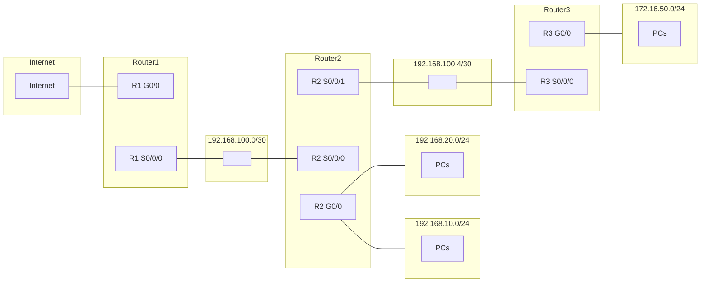
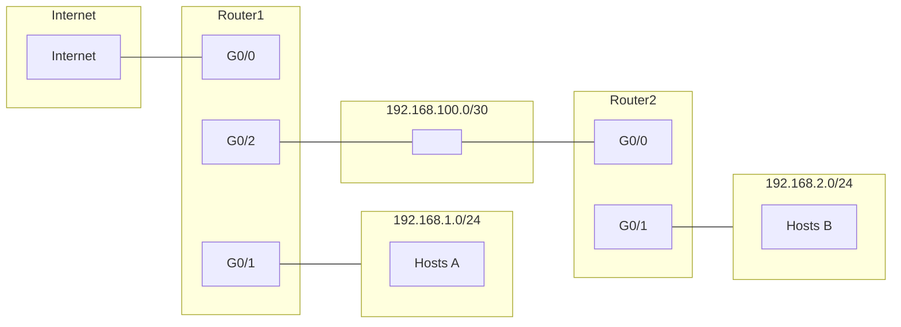
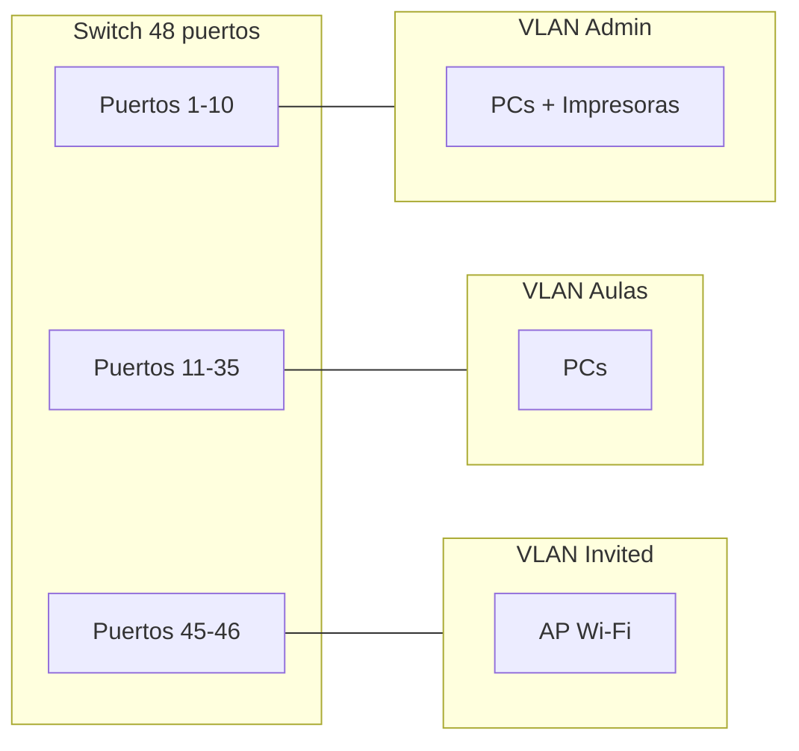
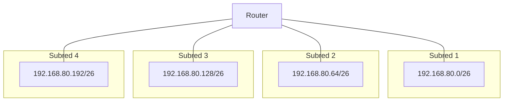

# EXAMEN MODELO A – Unidad 7: Enrutamiento, Subnetting y VLANs

**Módulo:** Redes de Área Local (RAL)  
**Temas:** Enrutamiento, Subnetting, Supernetting y VLANs  
**Curso:** Sistemas Microinformáticos y Redes (SMR)

---

**Nombre y apellidos:** _________________________________________________

**Fecha:** _______________________

---

!!! warning "Documento interno – no publicar"
    Este examen es de uso exclusivo del profesorado. Los archivos en la carpeta Extra no están en la navegación del sitio para el alumnado.

---

## Subnetting (3 actividades)

### Actividad 1 – Red 10.0.50.0 *(1,25 pts)*
Se tiene la red **10.0.50.0** (clase A subneteada en el tercer octeto; máscara por defecto /24 en ese bloque).

1. *(0,17)* ¿Qué máscara hay que aplicar para obtener **8 subredes**?
2. *(0,17)* ¿Cuántos hosts utilizables tendrá cada subred?
3. *(0,17)* Escribe las direcciones de red de las 8 subredes.
4. *(0,17)* ¿Cuál es la dirección del nodo con identificador 10 en la subred 3?
5. *(0,17)* ¿A qué subred pertenece el host 10.0.50.118?

---

### Actividad 2 – Empresa con 30 redes *(1,25 pts)*
A una empresa se le asigna la red **172.16.0.0**. Necesita **30 subredes**.

1. *(0,17)* Máscara de subred por defecto (sin dividir).
2. *(0,17)* Máscara subneteada para obtener al menos 30 subredes.
3. *(0,17)* Direcciones de red de la 1.ª, 2.ª, 15.ª y 30.ª subred.
4. *(0,16)* Rango de IP válidas (primera y última) de la subred 15.
5. *(0,16)* Dirección de broadcast de la subred 30.

---

### Actividad 3 – Red 10.10.0.0/22 *(1,00 pts)*
Dada la red **10.10.0.0/22**:

1. *(0,21)* Dirección de red, dirección de broadcast y número de hosts utilizables (sin subdividir).
2. *(0,21)* Divídela en **4 subredes** iguales (usando máscara /24). Indica las direcciones de red.
3. *(0,21)* ¿A qué subred /24 pertenece el host 10.10.2.50?
4. *(0,20)* Indica la primera y última IP válida de la subred que contiene 10.10.3.200.

---

## Supernetting (2 actividades)

### Actividad 4 – Cuatro sedes *(1,25 pts)*
Una empresa tiene 4 sedes con redes: **Sede A** 192.168.12.0/24, **Sede B** 192.168.13.0/24, **Sede C** 192.168.14.0/24, **Sede D** 192.168.15.0/24. Se quiere resumir en una superred.

1. *(0,15)* Identifica el octeto que cambia entre las redes.
2. *(0,15)* Escribe en binario ese octeto para cada sede.
3. *(0,15)* Indica cuántos bits de la izquierda son iguales en los cuatro valores.
4. *(0,15)* Calcula la nueva máscara según los bits coincidentes.
5. *(0,15)* Escribe la superred resultante (dirección y prefijo CIDR).

---

### Actividad 5 – Ocho departamentos *(1,00 pts)*
Ocho redes departamentales: **192.168.32.0/24**, **192.168.33.0/24**, … **192.168.39.0/24**.

1. *(0,19)* Identifica el octeto que varía y escríbelo en binario para cada red (solo el octeto que cambia).
2. *(0,19)* Cuenta cuántos bits de la izquierda son iguales en los ocho casos.
3. *(0,19)* Calcula la máscara de la superred y el prefijo CIDR.
4. *(0,18)* Indica la dirección de la superred resultante y el rango total de IP que abarca.

---

## Enrutamiento estático (2 actividades)

### Actividad 6 – Tabla del Router2 (tres routers en línea) *(1,00 pts)*

- **Router1**: G0/0 hacia Internet (ruta por defecto), S0/0/0 hacia Router2 (**192.168.100.0/30**).
- **Router2**: G0/0 **192.168.10.0/24** y **192.168.20.0/24** (dos LANs), S0/0/0 enlace a R1, S0/0/1 enlace a R3 (**192.168.100.4/30**).
- **Router3**: G0/0 **172.16.50.0/24**, S0/0/0 enlace a R2.

**Tareas:**

1. *(0,33)* Asigna IP a las interfaces del **Router2** (criterio: primer host válido del segmento para el router).
2. *(0,34)* Elabora la **tabla de rutas estáticas del Router2**: red destino, máscara, siguiente salto e interfaz.
3. *(0,33)* Justifica qué entradas son conexión directa y cuáles usan siguiente salto.

---

### Actividad 7 – Dos routers *(0,75 pts)*

- Router1: G0/0 hacia Internet, G0/1 con 192.168.1.0/24, G0/2 enlace a R2 (192.168.100.0/30).
- Router2: G0/0 enlace a R1, G0/1 con 192.168.2.0/24.

1. *(0,34)* Asigna IP a las interfaces de ambos routers (primer host válido del segmento).
2. *(0,33)* Tabla de rutas estáticas del **Router2** para alcanzar 192.168.1.0/24 e Internet (ruta por defecto).
3. *(0,33)* ¿Qué siguiente salto usa Router2 para 192.168.1.0/24 y para 0.0.0.0/0?

---

## VLANs (2 actividades)

### Actividad 8 – Clínica dental (segmentación) *(0,75 pts)*
Una clínica dental tiene un switch de 24 puertos:

- **Recepción:** 2 PCs, 1 impresora, 1 teléfono IP.
- **Consultas:** 6 PCs (uno por gabinete), 2 impresoras.
- **Invitados:** 1 punto de acceso Wi‑Fi para pacientes en sala de espera.

**Tareas:**

1. *(0,25)* **Cuadro de planificación:** tabla con columnas: Nombre VLAN, ID, Rango de IPs (subred), Puertos asignados.
2. *(0,25)* **Cuestionario:**  
   - ¿Por qué no es recomendable que el Wi‑Fi de invitados comparta VLAN con los PCs de Recepción?  
   - Si un PC de la VLAN "Consultas" hace ping a un PC de la VLAN "Recepción", ¿funcionará sin un router? Justifica.
3. *(0,25)* **Esquema:** dibuja el switch y etiqueta qué puertos pertenecen a cada VLAN (por ejemplo, 1–5 para un grupo).

---

### Actividad 9 – Instituto (tres zonas) *(0,75 pts)*
Un instituto tiene un switch de 48 puertos:

- **Administración:** 4 PCs, 2 impresoras (puertos 1–10).
- **Aulas:** 20 PCs (puertos 11–35).
- **Invited_Guest:** 1 punto de acceso Wi‑Fi para visitas (puertos 45–46).

1. *(0,25)* Propón **3 VLANs** con ID, nombre, subred y puertos.
2. *(0,25)* ¿Qué dispositivo se necesita para que Administración y Aulas puedan comunicarse? Justifica.
3. *(0,25)* Dibuja un esquema del switch con los puertos asignados a cada VLAN (puedes usar Mermaid o descripción clara).

---

## Mixta (1 actividad)

### Actividad 10 – Subnetting y tabla de rutas *(1,00 pts)*
Red **192.168.80.0/24** dividida en **4 subredes**. Router con 4 interfaces, cada una en una subred distinta (usa la primera IP válida del segmento para el router).

1. *(0,83)* Máscara para 4 subredes, direcciones de red y rango de IP válidas de cada una.
2. *(0,84)* Asigna a cada interfaz del router una IP y escribe las **4 rutas directas** que tendrá el router (red destino, máscara, interfaz; sin siguiente salto).
3. *(0,83)* Dibuja un esquema simple (Mermaid o texto) con el router y las 4 subredes con sus direcciones de red.

---

## Resumen de puntuación (sobre 10)

| Actividad | Enunciado breve              | Puntos |
|-----------|------------------------------|--------|
| 1         | Red 10.0.50.0 (8 subredes)   | 1,25   |
| 2         | Empresa 30 redes             | 1,25   |
| 3         | Red 10.10.0.0/22             | 1,00   |
| 4         | Cuatro sedes (superred)      | 1,25   |
| 5         | Ocho departamentos           | 1,00   |
| 6         | Tabla Router2 (tres routers) | 1,00   |
| 7         | Dos routers                  | 0,75   |
| 8         | Clínica dental (VLANs)       | 0,75   |
| 9         | Instituto (tres zonas)       | 0,75   |
| 10        | Subnetting y tabla de rutas  | 1,00   |
|           | **Total**                    | **10** |

---

## CRITERIOS DE CALIFICACIÓN

| Bloque       | Actividades | Puntos (sobre 30) | Puntos (sobre 10) | Valor por actividad |
|--------------|-------------|-------------------|-------------------|---------------------|
| Subnetting   | 1, 2, 3     | 3 × 2,5 = 7,5     | 2,5               | 1: 2,5 \| 2: 2,5 \| 3: 2,5 (30) · 1: 0,83 \| 2: 0,83 \| 3: 0,84 (10) |
| Supernetting | 4, 5        | 2 × 2,5 = 5       | 1,5               | 4: 2,5 \| 5: 2,5 (30) · 4: 0,75 \| 5: 0,75 (10) |
| Enrutamiento | 6, 7        | 2 × 3 = 6         | 2,0               | 6: 3 \| 7: 3 (30) · 6: 1 \| 7: 1 (10) |
| VLANs        | 8, 9        | 2 × 2,5 = 5       | 1,5               | 8: 2,5 \| 9: 2,5 (30) · 8: 0,75 \| 9: 0,75 (10) |
| Mixta        | 10          | 6,5               | 2,5               | 10: 6,5 (30) · 10: 2,5 (10) |
| **Total**    | 10          | **30 puntos**     | **10 puntos**     | — |

**Dificultad por tipo de pregunta**

| Nivel   | Criterio |
|---------|----------|
| **Baja**  | Aplicación directa: fórmulas, escribir direcciones, identificar. |
| **Media** | Aplicación en contexto: calcular subredes, tablas de rutas, diseño básico VLANs. |
| **Alta**  | Razonamiento: explicar, justificar, diseño completo. |

**Puntuación por pregunta y dificultad (sobre 10)**

| Act | Pregunta | Dificultad | Puntos |
|-----|----------|------------|--------|
| 1   | 1        | Baja       | 0,17   |
| 1   | 2        | Baja       | 0,17   |
| 1   | 3        | Media      | 0,17   |
| 1   | 4        | Media      | 0,17   |
| 1   | 5        | Media      | 0,17   |
| 2   | 1        | Baja       | 0,17   |
| 2   | 2        | Media      | 0,17   |
| 2   | 3        | Media      | 0,17   |
| 2   | 4        | Media      | 0,16   |
| 2   | 5        | Baja       | 0,16   |
| 3   | 1        | Baja       | 0,21   |
| 3   | 2        | Media      | 0,21   |
| 3   | 3        | Media      | 0,21   |
| 3   | 4        | Media      | 0,20   |
| 4   | 1        | Baja       | 0,15   |
| 4   | 2        | Baja       | 0,15   |
| 4   | 3        | Media      | 0,15   |
| 4   | 4        | Media      | 0,15   |
| 4   | 5        | Media      | 0,15   |
| 5   | 1        | Baja       | 0,19   |
| 5   | 2        | Media      | 0,19   |
| 5   | 3        | Media      | 0,19   |
| 5   | 4        | Media      | 0,18   |
| 6   | 1        | Media      | 0,33   |
| 6   | 2        | Alta       | 0,34   |
| 6   | 3        | Alta       | 0,33   |
| 7   | 1        | Media      | 0,34   |
| 7   | 2        | Alta       | 0,33   |
| 7   | 3        | Alta       | 0,33   |
| 8   | 1        | Media      | 0,25   |
| 8   | 2        | Alta       | 0,25   |
| 8   | 3        | Media      | 0,25   |
| 9   | 1        | Media      | 0,25   |
| 9   | 2        | Alta       | 0,25   |
| 9   | 3        | Media      | 0,25   |
| 10  | 1        | Media      | 0,83   |
| 10  | 2        | Alta       | 0,84   |
| 10  | 3        | Media      | 0,83   |

Ajustar según el peso que se quiera dar a cada bloque en el examen.
