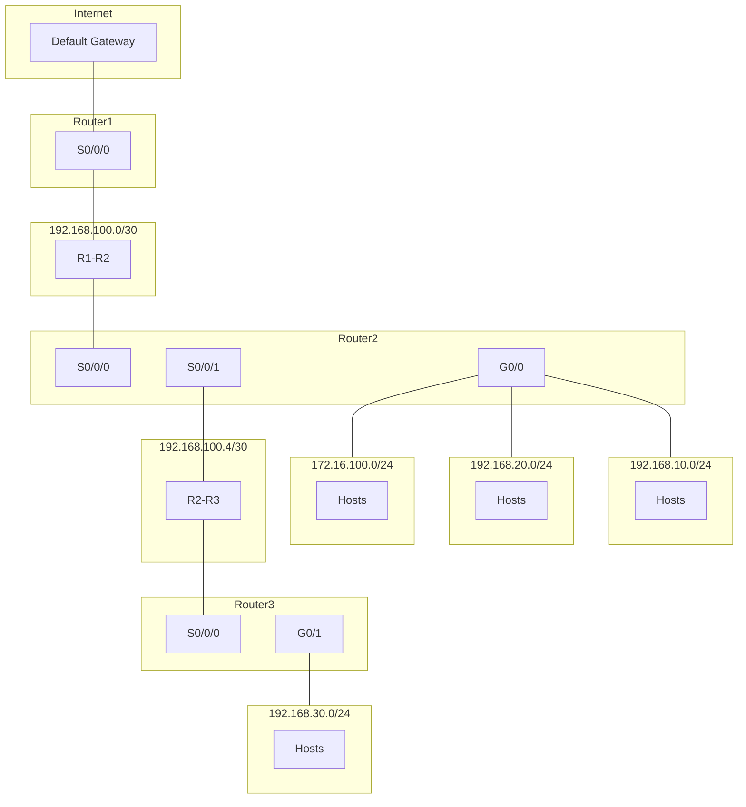
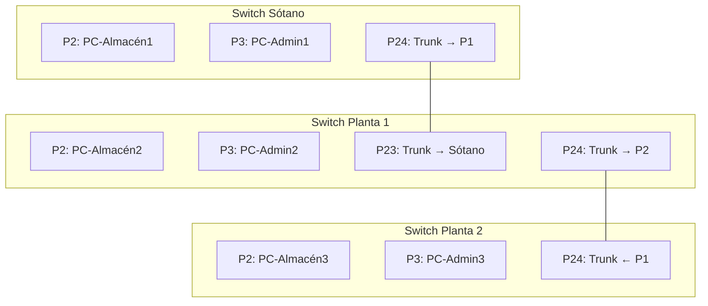
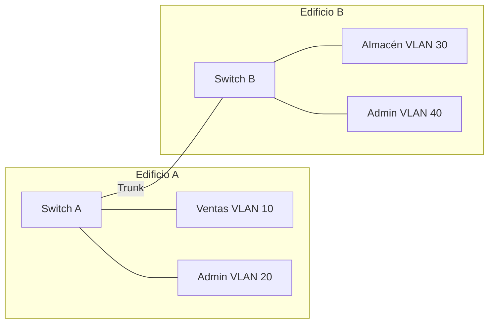

# EXAMEN MODELO B – Unidad 7: Enrutamiento, Subnetting y VLANs

**Módulo:** Redes de Área Local (RAL)  
**Temas:** Enrutamiento, Subnetting, Supernetting y VLANs  
**Curso:** Sistemas Microinformáticos y Redes (SMR)

---

**Nombre y apellidos:** _________________________________________________

**Fecha:** _______________________

---

!!! warning "Documento interno – no publicar"
    Este examen es de uso exclusivo del profesorado. Los archivos en la carpeta Extra no están en la navegación del sitio para el alumnado.

---

## Subnetting (3 actividades)

### Actividad 1 – Red 192.168.200.0/26 *(1,25 pts)*
Dada la red **192.168.200.0/26**:

1. *(0,28)* Indica dirección de red, broadcast y número de hosts utilizables (sin subdividir).
2. *(0,28)* Divídela en **4 subredes** del mismo tamaño. Indica las direcciones de red de las 4 subredes.
3. *(0,27)* Para cada una de las 4 subredes: rango de IP válidas (primera y última) y dirección de broadcast.

---

### Actividad 2 – Red 10.10.0.0/22 *(1,25 pts)*
Dada la red **10.10.0.0/22**:

1. *(0,21)* Dirección de red, dirección de broadcast y número de hosts utilizables (sin subdividir).
2. *(0,21)* Divídela en **4 subredes** iguales (usando máscara /24). Indica las direcciones de red.
3. *(0,21)* ¿A qué subred /24 pertenece el host 10.10.2.50?
4. *(0,20)* Indica la primera y última IP válida de la subred que contiene 10.10.3.200.

---

### Actividad 3 – Red 192.168.88.0 *(1,25 pts)*
Red **192.168.88.0** (clase C).

1. *(0,17)* ¿Qué máscara aplicar para **32 subredes**?
2. *(0,17)* ¿Cuántos hosts por subred?
3. *(0,17)* Nombra las direcciones de red de las subredes 1, 16 y 32.
4. *(0,16)* ¿Cuál es la IP del host 7 en la subred 20?
5. *(0,16)* El host 192.168.88.211, ¿a qué subred pertenece?

---

## Supernetting (2 actividades)

### Actividad 4 – Ocho departamentos *(1,00 pts)*
Ocho redes departamentales: **192.168.32.0/24**, **192.168.33.0/24**, … **192.168.39.0/24**.

1. *(0,19)* Identifica el octeto que varía y escríbelo en binario para cada red (solo el octeto que cambia).
2. *(0,19)* Cuenta cuántos bits de la izquierda son iguales en los ocho casos.
3. *(0,19)* Calcula la máscara de la superred y el prefijo CIDR.
4. *(0,18)* Indica la dirección de la superred resultante y el rango total de IP que abarca.

---

### Actividad 5 – Tres redes contiguas *(1,00 pts)*
Se agrupan **192.168.100.0/24**, **192.168.101.0/24** y **192.168.102.0/24**.

1. *(0,19)* ¿Se pueden agrupar en una superred? Justifica (contigüidad y prefijo).
2. *(0,19)* Octeto que varía en binario para las tres redes.
3. *(0,19)* Bits coincidentes y nueva máscara.
4. *(0,18)* Superred resultante con prefijo CIDR.

---

## Enrutamiento estático (2 actividades)

### Actividad 6 – Tabla del Router1 (tres routers) *(1,25 pts)*
Usando la **misma topología del tema** (Router1 ↔ Router2 ↔ Router3; enlaces 192.168.100.0/30 y 192.168.100.4/30; Router2 con 172.16.100.0/24; Router3 con 192.168.30.0/24; 192.168.10.0/24 y 192.168.20.0/24; ruta por defecto a Internet):

1. *(0,33)* Indica la **IP de la interfaz** del Router1 en el enlace con Router2.
2. *(0,34)* Elabora la **tabla de rutas estáticas del Router1** (red destino, máscara, siguiente salto, interfaz) para alcanzar todas las redes y la ruta por defecto.
3. *(0,33)* Explica por qué en este diseño todas las rutas no directas del Router1 usan el mismo siguiente salto.

---

### Actividad 7 – Tabla del Router3 y ruta por defecto *(1,25 pts)*
Con la **topología del tema** (Router1–Router2–Router3, enlaces /30, 192.168.10.0/24, 192.168.20.0/24, 172.16.100.0/24, 192.168.30.0/24, Internet):

1. *(0,33)* Indica las **IP de las interfaces del Router3** en cada enlace.
2. *(0,34)* Elabora la **tabla de rutas estáticas del Router3** para que toda la red sea alcanzable.
3. *(0,33)* Explica qué significa la entrada 0.0.0.0/0 en la tabla del Router3 y qué dirección usas como siguiente salto.

---

## VLANs (2 actividades)

### Actividad 8 – Oficina pequeña (VLANs y subredes) *(0,75 pts)*
Oficina con **Recepcion** (3 PCs, 1 impresora), **Contabilidad** (4 PCs) y **WiFi_Visitantes** (1 AP). Red base: **192.168.50.0/24**.

1. *(0,25)* Divide la red en **3 subredes** (una por VLAN). Indica máscara, direcciones de red y rango de IP válidas de cada una.
2. *(0,25)* Asigna a cada VLAN un ID (10, 20, 30) y nombre.
3. *(0,25)* ¿Qué ocurre si dos PCs están en VLANs distintas y no hay router ni switch capa 3? Razona.

---

### Actividad 9 – Tres plantas (trunk entre switches) *(0,75 pts)*
Empresa con tres plantas. En cada planta hay un switch. Conexiones:

- **Switch Sótano:** PC-Almacén1 (puerto 2), PC-Admin1 (puerto 3). Enlace a Planta 1: puerto 24.
- **Switch Planta 1:** PC-Almacén2 (puerto 2), PC-Admin2 (puerto 3). Puerto 23 hacia Sótano, puerto 24 hacia Planta 2.
- **Switch Planta 2:** PC-Almacén3 (puerto 2), PC-Admin3 (puerto 3). Puerto 24 hacia Planta 1.

**Tareas:**

1. *(0,28)* Indica qué modo (Access o Trunk) debe tener cada puerto que conecta equipos finales y cada puerto que une switches.
2. *(0,28)* Si PC-Almacén1 envía datos a PC-Almacén3, ¿en qué enlaces se transporta la trama con etiqueta VLAN y con qué estándar se etiqueta?
3. *(0,27)* Si el puerto 24 del Switch Planta 1 (hacia Planta 2) se configura en modo **Access** para la VLAN de Almacén, ¿podrán comunicarse los PCs de Administración de Planta 1 y Planta 2? Razona.

---

## Mixta (1 actividad)

### Actividad 10 – Diseño completo (dos edificios) *(1,00 pts)*
Una empresa tiene **dos edificios**. Edificio A: **Ventas** (6 PCs) y **Admin** (4 PCs). Edificio B: **Almacén** (8 PCs) y **Admin** (4 PCs). Un switch por edificio, unidos por un enlace. Red asignada: **10.20.0.0/22**.

1. *(0,63)* Divide **10.20.0.0/22** en **4 subredes** del mismo tamaño (usando máscara /24). Indica las 4 direcciones de red.
2. *(0,62)* Asigna una subred a cada grupo (Ventas, Admin edificio A, Almacén, Admin edificio B). Propón IDs de VLAN (10, 20, 30, 40).
3. *(0,63)* Dibuja un diagrama con **dos switches** (Edificio A y B), los grupos (VLANs), el enlace entre switches y indica si ese enlace debe ser Access o Trunk y por qué.
4. *(0,62)* ¿Qué dispositivo se necesita para que Ventas (Edificio A) pueda comunicarse con Admin (Edificio B)? Justifica.

---

## Resumen de puntuación (sobre 10)

| Actividad | Enunciado breve                 | Puntos |
|-----------|----------------------------------|--------|
| 1         | Red 192.168.200.0/26 (4 subredes) | 1,25   |
| 2         | Red 10.10.0.0/22                 | 1,25   |
| 3         | Red 192.168.88.0 (32 subredes)   | 1,25   |
| 4         | Ocho departamentos (superred)    | 1,00   |
| 5         | Tres redes contiguas             | 1,00   |
| 6         | Tabla Router1 (tres routers)     | 1,25   |
| 7         | Tabla Router3 y ruta por defecto | 1,25   |
| 8         | Oficina pequeña (VLANs y subredes) | 0,75   |
| 9         | Tres plantas (trunk)             | 0,75   |
| 10        | Diseño completo (dos edificios)  | 1,00   |
|           | **Total**                        | **10** |

---

## CRITERIOS DE CALIFICACIÓN

| Bloque       | Actividades | Puntos (sobre 30) | Puntos (sobre 10) | Valor por actividad |
|--------------|-------------|-------------------|-------------------|---------------------|
| Subnetting   | 1, 2, 3     | 3 × 2,5 = 7,5     | 2,5               | 1: 2,5 \| 2: 2,5 \| 3: 2,5 (30) · 1: 0,83 \| 2: 0,83 \| 3: 0,84 (10) |
| Supernetting | 4, 5        | 2 × 2,5 = 5       | 1,5               | 4: 2,5 \| 5: 2,5 (30) · 4: 0,75 \| 5: 0,75 (10) |
| Enrutamiento | 6, 7        | 2 × 3 = 6         | 2,0               | 6: 3 \| 7: 3 (30) · 6: 1 \| 7: 1 (10) |
| VLANs        | 8, 9        | 2 × 2,5 = 5       | 1,5               | 8: 2,5 \| 9: 2,5 (30) · 8: 0,75 \| 9: 0,75 (10) |
| Mixta        | 10          | 6,5               | 2,5               | 10: 6,5 (30) · 10: 2,5 (10) |
| **Total**    | 10          | **30 puntos**     | **10 puntos**     | — |

**Dificultad por tipo de pregunta**

| Nivel   | Criterio |
|---------|----------|
| **Baja**  | Aplicación directa: fórmulas, escribir direcciones, identificar. |
| **Media** | Aplicación en contexto: calcular subredes, tablas de rutas, diseño básico VLANs. |
| **Alta**  | Razonamiento: explicar, justificar, diseño completo. |

**Puntuación por pregunta y dificultad (sobre 10)**

| Act | Pregunta | Dificultad | Puntos |
|-----|----------|------------|--------|
| 1   | 1        | Baja       | 0,28   |
| 1   | 2        | Media      | 0,28   |
| 1   | 3        | Media      | 0,27   |
| 2   | 1        | Baja       | 0,21   |
| 2   | 2        | Media      | 0,21   |
| 2   | 3        | Media      | 0,21   |
| 2   | 4        | Media      | 0,20   |
| 3   | 1        | Baja       | 0,17   |
| 3   | 2        | Baja       | 0,17   |
| 3   | 3        | Media      | 0,17   |
| 3   | 4        | Media      | 0,16   |
| 3   | 5        | Media      | 0,16   |
| 4   | 1        | Baja       | 0,19   |
| 4   | 2        | Media      | 0,19   |
| 4   | 3        | Media      | 0,19   |
| 4   | 4        | Media      | 0,18   |
| 5   | 1        | Alta       | 0,19   |
| 5   | 2        | Baja       | 0,19   |
| 5   | 3        | Media      | 0,19   |
| 5   | 4        | Media      | 0,18   |
| 6   | 1        | Media      | 0,33   |
| 6   | 2        | Alta       | 0,34   |
| 6   | 3        | Alta       | 0,33   |
| 7   | 1        | Media      | 0,33   |
| 7   | 2        | Alta       | 0,34   |
| 7   | 3        | Alta       | 0,33   |
| 8   | 1        | Media      | 0,25   |
| 8   | 2        | Media      | 0,25   |
| 8   | 3        | Alta       | 0,25   |
| 9   | 1        | Media      | 0,28   |
| 9   | 2        | Alta       | 0,28   |
| 9   | 3        | Alta       | 0,27   |
| 10  | 1        | Media      | 0,63   |
| 10  | 2        | Media      | 0,62   |
| 10  | 3        | Alta       | 0,63   |
| 10  | 4        | Alta       | 0,62   |

Ajustar según el peso que se quiera dar a cada bloque en el examen.
