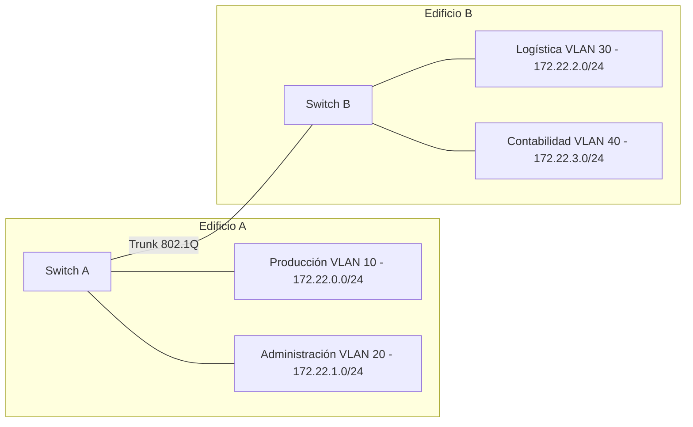

# Examen Unidad 7 – Modelo B (Recuperación) – Soluciones y Puntuaciones

---

## Modelo B Recuperación – Esquema de corrección (sobre 10)

> Referencia de enunciados: `Examen_Enrutamiento_Unidad7_Modelo_B_Recuperacion.md`  
> Los puntos indicados son **máximos**; se puede restar parcialmente según errores.

### Actividad 1 – Red 10.5.100.192/26 *(1,25 pts)*

- **1. Red, broadcast, hosts /26 (0,25 pts)**  
  - Red: **10.5.100.192/26**  
  - Broadcast: **10.5.100.255**  
  - Hosts utilizables: 2^6 − 2 = **62**.
- **2. 4 subredes del mismo tamaño (0,50 pts)**  
  - Se prestan 2 bits → **/28 → 255.255.255.240**.  
  - Redes: **10.5.100.192/28, 10.5.100.208/28, 10.5.100.224/28, 10.5.100.240/28**.
- **3. Rangos y broadcast por subred (0,50 pts)**  

| Subred | Dirección de red  | Rango válido                      | Broadcast       |
|--------|-------------------|-----------------------------------|-----------------|
| S1     | 10.5.100.192/28   | 10.5.100.193 – 10.5.100.206       | 10.5.100.207    |
| S2     | 10.5.100.208/28   | 10.5.100.209 – 10.5.100.222       | 10.5.100.223    |
| S3     | 10.5.100.224/28   | 10.5.100.225 – 10.5.100.238       | 10.5.100.239    |
| S4     | 10.5.100.240/28   | 10.5.100.241 – 10.5.100.254       | 10.5.100.255    |

### Actividad 2 – Red 172.18.4.0/22 *(1,25 pts)*

- **1. Red, broadcast, hosts (0,25 pts)**  
  - Red: **172.18.4.0/22**  
  - Broadcast: **172.18.7.255**  
  - Hosts utilizables: 2^10 − 2 = **1022**.
- **2. 4 subredes /24 (0,25 pts)**  
  - **172.18.4.0/24, 172.18.5.0/24, 172.18.6.0/24, 172.18.7.0/24**.
- **3. Subred de 172.18.6.100 (0,25 pts)**  
  - **172.18.6.0/24**.
- **4. Primera y última IP válida de la subred con 172.18.5.200 (0,25 pts)**  
  - Subred 172.18.5.0/24 → **172.18.5.1 – 172.18.5.254**.

### Actividad 3 – Red 192.168.144.0 *(1,25 pts)*

- **1. Máscara para 8 subredes (0,25 pts)**  
  - 2^3 = 8 → **/27 → 255.255.255.224**.
- **2. Hosts por subred (0,25 pts)**  
  - 2^5 − 2 = **30 hosts utilizables**.
- **3. Redes 1, 4 y 8 (0,50 pts)**  
  - Salto de 32 en el 4.º octeto:  
    - 1.ª: **192.168.144.0/27**  
    - 4.ª: (3 × 32) → **192.168.144.96/27**  
    - 8.ª: (7 × 32) → **192.168.144.224/27**.
- **4. Host 4 en subred 5 (0,25 pts)**  
  - Subred 5: (4 × 32) = 128 → 192.168.144.128/27 → host 4: **192.168.144.132**.
- **5. Subred de 192.168.144.175 (0,25 pts)**  
  - 175 está entre 160 y 191 → **192.168.144.160/27** (subred 6).

### Actividad 4 – Ocho departamentos *(1,00 pt)*

- **1. Octeto variable en binario (0,25 pts)**  
  - 96–103 → 01100000, 01100001, 01100010, 01100011, 01100100, 01100101, 01100110, 01100111.
- **2. Bits iguales (0,25 pts)**  
  - **5 bits comunes** (01100) → /21.
- **3. Máscara y prefijo (0,25 pts)**  
  - **255.255.248.0 (/21)**.
- **4. Superred y rango IP (0,25 pts)**  
  - Superred: **192.168.96.0/21**  
  - Rango: **192.168.96.0 – 192.168.103.255**.

### Actividad 5 – Tres redes contiguas *(1,00 pt)*

- **1. ¿Se pueden agrupar? (0,25 pts)**  
  - **Sí**, son contiguas (180, 181, 182) y tienen el mismo prefijo /24. El bloque resultante /22 abarca también 192.168.183.0/24, que queda reservado aunque no esté en uso.
- **2. Octeto variable en binario (0,25 pts)**  
  - 180: 10110100, 181: 10110101, 182: 10110110.
- **3. Bits coincidentes y máscara (0,25 pts)**  
  - **6 bits comunes** (101101) → /22 → **255.255.252.0**.
- **4. Superred CIDR (0,25 pts)**  
  - **192.168.180.0/22**.

### Actividad 6 – Tabla del Router1 (tres routers) *(1,25 pts)*

- **1. IP interfaz Router1 hacia Router2 (0,25 pts)**  
  - En el enlace 172.16.1.0/30, primera IP válida para R1: **172.16.1.1/30** (R2 usa 172.16.1.2).

- **2. Tabla de rutas estáticas del Router1 (0,75 pts)**  

| Red destino   | Máscara             | Siguiente salto | Interfaz | Tipo        |
|---------------|---------------------|-----------------|----------|-------------|
| 172.16.1.0    | 255.255.255.252 /30 | —               | S0/0/0   | Directa     |
| 192.168.50.0  | 255.255.255.0 /24   | 172.16.1.2      | S0/0/0   | Estática    |
| 192.168.60.0  | 255.255.255.0 /24   | 172.16.1.2      | S0/0/0   | Estática    |
| 172.30.10.0   | 255.255.255.0 /24   | 172.16.1.2      | S0/0/0   | Estática    |
| 192.168.70.0  | 255.255.255.0 /24   | 172.16.1.2      | S0/0/0   | Estática    |
| 0.0.0.0       | 0.0.0.0 /0          | (ISP/Internet)  | G0/0     | Por defecto |

- **3. Mismo siguiente salto (0,25 pts)**  
  - Todas las redes internas (192.168.50.0, 60.0, 172.30.10.0, 192.168.70.0) están **detrás de R2** desde la perspectiva de R1. Por eso todas las rutas no directas usan la misma IP de siguiente salto (**172.16.1.2**, interfaz S0/0/0 de R2): es la única vía hacia el lado interno.

### Actividad 7 – Tabla del Router3 y ruta por defecto *(1,25 pts)*

- **1. IP de interfaces Router3 (0,25 pts)**  
  - S0/0/0 en 172.16.1.4/30: **172.16.1.6/30** (R2 usa 172.16.1.5).  
  - G0/1 en 192.168.70.0/24: **192.168.70.1/24** (primera IP válida).

- **2. Tabla de rutas Router3 (0,75 pts)**  

| Red destino    | Máscara             | Siguiente salto | Interfaz | Tipo        |
|----------------|---------------------|-----------------|----------|-------------|
| 172.16.1.4     | 255.255.255.252 /30 | —               | S0/0/0   | Directa     |
| 192.168.70.0   | 255.255.255.0 /24   | —               | G0/1     | Directa     |
| 192.168.50.0   | 255.255.255.0 /24   | 172.16.1.5      | S0/0/0   | Estática    |
| 192.168.60.0   | 255.255.255.0 /24   | 172.16.1.5      | S0/0/0   | Estática    |
| 172.30.10.0    | 255.255.255.0 /24   | 172.16.1.5      | S0/0/0   | Estática    |
| 0.0.0.0        | 0.0.0.0 /0          | 172.16.1.5      | S0/0/0   | Por defecto |

- **3. Significado 0.0.0.0/0 y siguiente salto (0,25 pts)**  
  - Representa la **ruta por defecto**: cualquier paquete cuyo destino no coincida con otra entrada de la tabla se envía por ella. En R3, el siguiente salto es **172.16.1.5** (interfaz de R2 en el enlace R2‑R3), porque desde R3 la única vía hacia Internet y hacia redes no contempladas explícitamente es a través de R2.

### Actividad 8 – Oficina pequeña *(0,75 pts)*

- **1. 3 subredes de 10.10.100.0/24 (0,25 pts)**  

| VLAN         | Subred              | Máscara               | Rango IP válidas              |
|--------------|---------------------|-----------------------|-------------------------------|
| Ventas       | 10.10.100.0/26      | 255.255.255.192       | 10.10.100.1 – 10.10.100.62    |
| RRHH         | 10.10.100.64/26     | 255.255.255.192       | 10.10.100.65 – 10.10.100.126  |
| WiFi_Visit.  | 10.10.100.128/26    | 255.255.255.192       | 10.10.100.129 – 10.10.100.190 |

- **2. ID y nombre por VLAN (0,25 pts)**  
  - **VLAN 10 → Ventas**, **VLAN 20 → RRHH**, **VLAN 30 → WiFi_Visitantes**.
- **3. PCs en VLANs distintas sin router (0,25 pts)**  
  - **No podrán comunicarse**: las VLANs aíslan el tráfico a nivel de capa 2 (dominios de broadcast separados) y están en subredes IP distintas. Se necesita un **router o switch capa 3** para realizar el enrutamiento inter‑VLAN.

### Actividad 9 – Tres plantas (trunk) *(0,75 pts)*

- **1. Modos Access/Trunk (0,28 pts)**  
  - Puertos a equipos finales (P2 y P3 en cada switch): **Access**, asignados a la VLAN del PC correspondiente.  
  - Enlaces entre switches (Planta Baja‑P1 y P1‑P2 por los puertos 24/23): **Trunk**, para transportar varias VLANs (Ventas y Soporte).

- **2. Trama PC‑Ventas1 → PC‑Ventas3 (0,28 pts)**  
  - La trama se **etiqueta con 802.1Q** al entrar en el trunk de Planta Baja→Planta 1 y se mantiene etiquetada en el trunk Planta 1→Planta 2.  
  - En los puertos Access de los PCs la trama viaja **sin etiquetar** (el switch quita la etiqueta al encaminarla al puerto final).

- **3. Trunk Planta 1 → Planta 2 configurado en Access VLAN Ventas (0,27 pts)**  
  - Solo viajará tráfico de la VLAN Ventas por ese enlace. **Los PCs de Soporte de Planta 1 y Planta 2 no podrán comunicarse**, porque su VLAN deja de propagarse entre ambos switches (el enlace se convierte en un puerto de acceso a una sola VLAN).

### Actividad 10 – Diseño completo (dos edificios) *(1,00 pt)*

- **1. 4 subredes /24 desde 172.22.0.0/22 (0,25 pts)**  
  - **172.22.0.0/24, 172.22.1.0/24, 172.22.2.0/24, 172.22.3.0/24**.

- **2. Subred por grupo + IDs VLAN (0,25 pts)**  

| Grupo                  | VLAN ID | Subred           | Rango válido                  |
|------------------------|---------|------------------|-------------------------------|
| Producción (Edif. A)   | 10      | 172.22.0.0/24    | 172.22.0.1 – 172.22.0.254     |
| Administración (Edif. A)| 20     | 172.22.1.0/24    | 172.22.1.1 – 172.22.1.254     |
| Logística (Edif. B)    | 30      | 172.22.2.0/24    | 172.22.2.1 – 172.22.2.254     |
| Contabilidad (Edif. B) | 40      | 172.22.3.0/24    | 172.22.3.1 – 172.22.3.254     |

- **3. Diagrama + Access/Trunk (0,25 pts)**  
  - Puertos a PCs: **Access** (asignados a su VLAN).  
  - Enlace entre Switch A y Switch B: **Trunk**, porque debe transportar las 4 VLANs (10, 20, 30 y 40) entre edificios.

- **4. Dispositivo Producción–Contabilidad (0,25 pts)**  
  - **Router** (o **switch capa 3** con enrutamiento inter‑VLAN / SVIs) para permitir tráfico entre subredes y VLANs distintas. Sin este dispositivo los dos grupos estarían aislados en capa 2 y en capa 3.

---

Este archivo sirve como guía rápida de corrección con **soluciones numéricas clave** y **puntos máximos por apartado**, manteniendo la escala total de **10 puntos**.
