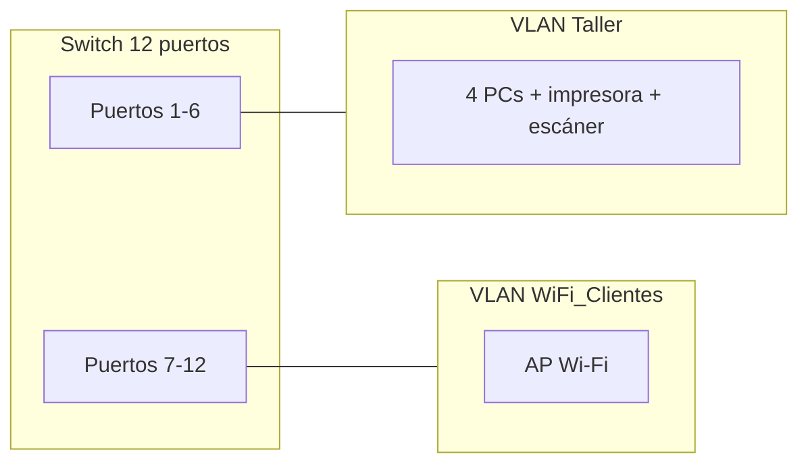

**Examen Convocatoria Extraordinaria 25/26**

**Módulo:** Redes de Área Local (RAL)  
**Curso:** Sistemas Microinformáticos y Redes (SMR)

**Nombre y apellidos:**  
\_\_\_\_\_\_\_\_\_\_\_\_\_\_\_\_\_\_\_\_\_\_\_\_\_\_\_\_\_\_\_\_\_\_\_\_\_\_\_\_\_\_\_\_\_\_\_\_\_

**Fecha:**  
\_\_\_\_\_\_\_\_\_\_\_\_\_\_\_\_\_\_\_\_\_\_\_

---

### Actividad 1 -- Preguntas de desarrollo *(2,00 pts)*

- *(0,50)* Explica las funciones principales de la capa de enlace de datos en el modelo OSI. Indica al menos cuatro funciones.

- *(0,50)* Explica la diferencia entre direcciones IP públicas y privadas. Indica los tres rangos de direcciones IP privadas más utilizados.

- *(0,50)* ¿Qué es el protocolo DHCP y para qué sirve? Indica qué parámetros asigna a los clientes y qué ventajas ofrece frente a la configuración manual. Nombra al menos tres comprobaciones básicas que se realizan para verificar la configuración de red (comandos como `ping`) y explica qué verifica cada una.

- *(0,50)* ¿Qué son el dominio de colisión y el dominio de difusión? Explica qué dispositivos (hub, switch, router) extienden o limitan cada uno.

---

### Actividad 2 -- Subnetting: centro con 8 aulas *(2,00 pts)*

Un centro formativo recibe la red **192.168.150.0/24** y necesita dividirla en **8 subredes** iguales, una para cada aula.

1. *(0,40)* Indica la **máscara de subred por defecto** de la red (sin dividir).

2. *(0,40)* Calcula la **máscara subneteada** necesaria para obtener al menos 8 subredes. Expresa el resultado en notación decimal y en prefijo CIDR.

3. *(0,40)* Escribe las **direcciones de red** de la 1.ª, 2.ª, 5.ª y 8.ª subred.

4. *(0,40)* Para la **subred 5**, indica la **primera** y la **última** dirección IP válida (utilizable por hosts).

5. *(0,40)* Indica la **dirección de broadcast** de la **subred 8**.

---

### Actividad 3 -- Subnetting: red 192.168.88.0/24 *(2,00 pts)*

Dada la red **192.168.88.0/24**:

1. *(0,50)* Sin subdividir, indica la **dirección de red**, la **dirección de broadcast** y el **número de hosts utilizables**.

2. *(0,50)* Divídela en **4 subredes** iguales (utilizando máscara `/26`). Indica las **direcciones de red** de las cuatro subredes.

3. *(0,50)* ¿A qué subred `/26` pertenece el host **192.168.88.190**?

4. *(0,50)* Indica la **primera** y la **última** IP válida de la subred que contiene el host **192.168.88.72**.

---

### Actividad 4 -- Supernetting: cuatro delegaciones *(2,00 pts)*

Una empresa dispone de cuatro delegaciones con las siguientes redes:

| Delegación | Red                |
|------------|--------------------|
| Norte      | 192.168.96.0/24    |
| Centro     | 192.168.97.0/24    |
| Sur        | 192.168.98.0/24    |
| Este       | 192.168.99.0/24    |

Se desea **resumir** las cuatro redes en una única **superred** para simplificar las tablas de enrutamiento.

1. *(0,40)* Identifica el **octeto** que cambia entre las cuatro redes.

2. *(0,40)* Escribe en **binario** ese octeto para cada delegación (solo el octeto que varía).

3. *(0,40)* Indica cuántos **bits de la izquierda** son iguales en los cuatro valores.

4. *(0,40)* Calcula la **nueva máscara** de la superred según los bits coincidentes (notación decimal y prefijo CIDR).

5. *(0,40)* Escribe la **superred resultante** (dirección de red y prefijo CIDR) y **justifica** brevemente por qué esa superred es la mínima que engloba las cuatro delegaciones.

---

### Actividad 5 -- VLANs en un taller mecánico *(2,00 pts)*

Un taller mecánico dispone de un **switch de 12 puertos** con los siguientes equipos:

| Zona            | Equipos conectados                               | Puertos del switch |
|-----------------|--------------------------------------------------|--------------------|
| **Taller**      | 4 PCs, 1 impresora de etiquetas y 1 escáner      | 1–6                |
| **WiFi_Clientes** | 1 punto de acceso Wi‑Fi para la sala de espera  | 7–12               |

**Tareas:**

1. *(0,75)* Diseña **2 VLANs**. Completa una tabla con las columnas: **ID de VLAN**, **Nombre**, **Equipos incluidos** y **Puertos asignados**.

2. *(0,50)* Explica con tus palabras qué es una **VLAN** y qué ventaja aporta la **segmentación lógica** frente a tener todos los equipos en la misma red.

3. *(0,75)* Si un PC de la VLAN **Taller** intenta hacer `ping` a un dispositivo conectado al Wi‑Fi de **WiFi_Clientes**, ¿funcionará sin ningún otro dispositivo intermedio? **Justifica** tu respuesta indicando qué ocurre con el **dominio de difusión**.

---

## Resumen de puntuación (sobre 10)

| Actividad | Enunciado breve                          | Puntos |
|-----------|------------------------------------------|--------|
| 1         | Preguntas de desarrollo                  | 2,00   |
| 2         | Subnetting – 8 subredes (`/24` → `/27`)  | 2,00   |
| 3         | Subnetting – 4 subredes (`/24` → `/26`)  | 2,00   |
| 4         | Supernetting – cuatro delegaciones       | 2,00   |
| 5         | VLANs – taller mecánico (2 VLANs)        | 2,00   |
|           | **Total**                                | **10** |
