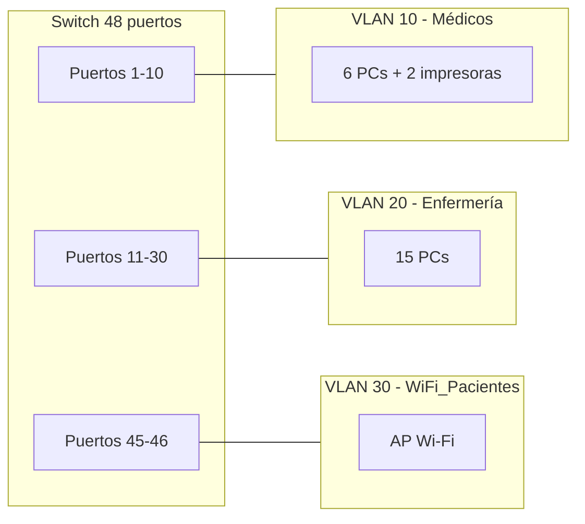

# Examen Pendiente de Redes (Temas 5, 6, 7, 8, 9) – Soluciones y Puntuaciones

!!! warning "Documento interno – no publicar"
    Archivo de uso exclusivo del profesorado. No debe estar accesible al alumnado ni enlazado en la navegación.

---

## Esquema de corrección (sobre 10)

> Referencia de enunciados: `Examen_Redes_Pendientes.docx`  
> Los puntos indicados son **máximos**; se puede restar parcialmente según errores.

### Actividad 1 – Preguntas de desarrollo *(1,00 pt)*

- **1. Funciones principales de la capa de enlace de datos (OSI) (0,25 pts)**  
  Cuatro funciones (basta con cuatro):
  - **Entramado (framing):** delimita el flujo de bits en tramas, marcando inicio y fin de cada una.
  - **Direccionamiento físico (MAC):** identifica origen y destino dentro del mismo enlace mediante direcciones MAC.
  - **Control de acceso al medio (MAC):** regula quién transmite y cuándo para evitar/gestionar colisiones (p. ej. CSMA/CD en Ethernet clásica).
  - **Detección y control de errores:** mediante el campo FCS/CRC se detectan tramas dañadas y se descartan.
  - *(Adicional)* **Control de flujo:** evita que un emisor rápido sature a un receptor lento.

- **2. IP públicas vs privadas y rangos RFC 1918 (0,25 pts)**  
  - **Públicas:** únicas a nivel mundial, **enrutables en Internet**, asignadas por IANA/RIR a través del ISP.
  - **Privadas:** de uso interno en una LAN, **no se enrutan en Internet**; para salir necesitan traducción **NAT/PAT**.
  - **Tres rangos privados (RFC 1918):**

  | Clase | Rango                         | Prefijo CIDR     |
  |-------|-------------------------------|------------------|
  | A     | 10.0.0.0 – 10.255.255.255     | `10.0.0.0/8`     |
  | B     | 172.16.0.0 – 172.31.255.255   | `172.16.0.0/12`  |
  | C     | 192.168.0.0 – 192.168.255.255 | `192.168.0.0/16` |

- **3. DHCP, parámetros, ventajas y comprobaciones (0,25 pts)**  
  - **Qué es:** *Dynamic Host Configuration Protocol*; asigna **automáticamente** la configuración de red a los clientes al conectarse (proceso DORA: Discover, Offer, Request, Ack).
  - **Parámetros que asigna:** **dirección IP**, **máscara de subred**, **puerta de enlace (gateway)** y **servidor(es) DNS** (además del tiempo de concesión o *lease*).
  - **Ventajas frente a la configuración manual:** evita errores de tecleo, impide **direcciones IP duplicadas**, centraliza y agiliza la gestión, y facilita la movilidad de equipos.
  - **Tres comprobaciones básicas (con `ping`):**
    - `ping 127.0.0.1` (loopback): verifica que la **pila TCP/IP local** del equipo funciona.
    - `ping <IP propia>`: verifica que la **tarjeta de red está bien configurada** con su IP.
    - `ping <gateway>`: verifica la **conectividad con el router** dentro de la LAN.
    - *(Adicional)* `ping 8.8.8.8` o `ping <web>`: verifica la **salida a Internet** y, si se hace por nombre, también la **resolución DNS**.

- **4. Dominio de colisión y dominio de difusión (0,25 pts)**  
  - **Dominio de colisión:** conjunto de dispositivos que comparten el mismo medio y cuyas transmisiones pueden **colisionar** entre sí.
  - **Dominio de difusión (broadcast):** conjunto de dispositivos que **reciben los mensajes de difusión** enviados por cualquiera de ellos.

  | Dispositivo | Dominio de colisión                           | Dominio de difusión                              |
  |-------------|-----------------------------------------------|--------------------------------------------------|
  | **Hub**     | **Extiende**: todos los puertos forman uno solo | **Extiende**: todos en el mismo                  |
  | **Switch**  | **Limita**: cada puerto es un dominio distinto  | **Extiende**: uno solo (salvo que se usen VLANs) |
  | **Router**  | **Limita**: cada interfaz es un dominio         | **Limita**: cada interfaz separa los broadcasts  |

### Actividad 2 – Empresa con 8 redes *(1,25 pts)*

Red base: `172.25.0.0` (RFC 1918, clase B). Se necesitan **8 subredes**.

- **1. Máscara por defecto (0,25 pts)**  
  - Clase B (sin subdividir): `/16` ⇒ **`255.255.0.0`**.

- **2. Máscara para ≥ 8 subredes (0,25 pts)**  
  - Cálculo: `8 = 2^3` ⇒ se prestan **3 bits** al campo de host.
  - Nueva máscara: `/16 + 3 = /19` ⇒ **`255.255.224.0`**.

- **3. Dir. red 1.ª, 2.ª, 5.ª y 8.ª (0,25 pts)**  
  - Bits de host: `32 − 19 = 13` ⇒ bloque = `2^(8−3) = 32` en el **3.er octeto**.
  - Fórmula: subred *n* ⇒ tercer octeto = `(n − 1) × 32`.

  | Subred | Cálculo        | Dirección de red    |
  |--------|----------------|---------------------|
  | 1.ª    | `(1−1)×32 = 0` | `172.25.0.0/19`     |
  | 2.ª    | `(2−1)×32 = 32`| `172.25.32.0/19`    |
  | 5.ª    | `(5−1)×32 = 128`| `172.25.128.0/19`  |
  | 8.ª    | `(8−1)×32 = 224`| `172.25.224.0/19`  |

- **4. Rango IP válidas subred 5 (0,25 pts)**  
  - Subred `172.25.128.0/19` cubre el tercer octeto `128–159`.
  - **Primera IP: `172.25.128.1` · Última IP: `172.25.159.254`** (broadcast `172.25.159.255`).

- **5. Broadcast subred 8 (0,25 pts)**  
  - Subred `172.25.224.0/19` ⇒ tercer octeto `224–255` ⇒ **broadcast `172.25.255.255`**.

### Actividad 3 – Red 172.30.0.0/22 *(1,00 pt)*

- **1. Red, broadcast y hosts (0,25 pts)**  
  - `/22` ⇒ máscara `255.255.252.0`. Bloque en el 3.er octeto = `2^(8−6) = 4` (octetos 0–3).
  - Red: **`172.30.0.0`** · Broadcast: **`172.30.3.255`**.
  - Hosts utilizables: `2^(32−22) − 2 = 2^10 − 2 = ` **`1022`**.

- **2. 4 subredes /24 (0,25 pts)**  
  - De `/22` a `/24` ⇒ se toman **2 bits** ⇒ `2^2 = 4` subredes.
  - **`172.30.0.0/24`, `172.30.1.0/24`, `172.30.2.0/24`, `172.30.3.0/24`**.

- **3. Subred de 172.30.2.200 (0,25 pts)**  
  - El 3.er octeto `2` identifica directamente la subred ⇒ **`172.30.2.0/24`** (rango `.1 – .254`).

- **4. Primera y última IP válida de la subred con 172.30.1.75 (0,25 pts)**  
  - El host está en `172.30.1.0/24` ⇒ **primera `172.30.1.1`, última `172.30.1.254`** (broadcast `.255`).

### Actividad 4 – Cuatro sedes *(1,25 pts)*

Sedes: `192.168.40.0/24`, `192.168.41.0/24`, `192.168.42.0/24`, `192.168.43.0/24`.

- **1. Octeto que cambia (0,25 pts)**  
  - Solo varía el **tercer octeto** (40, 41, 42, 43).

- **2. Tercer octeto en binario (0,25 pts)**  

  | Sede | Decimal | Binario    |
  |------|---------|------------|
  | A    | 40      | `00101000` |
  | B    | 41      | `00101001` |
  | C    | 42      | `00101010` |
  | D    | 43      | `00101011` |

- **3. Bits iguales (0,25 pts)**  
  - Coinciden los **6 primeros bits** (`001010`); varían los 2 últimos.

- **4. Máscara superred (0,25 pts)**  
  - Bits comunes en el 3.er octeto: 6 ⇒ prefijo total `16 + 6 = /22`.
  - Máscara decimal: **`255.255.252.0`**.

- **5. Superred resultante (0,25 pts)**  
  - **Superred: `192.168.40.0/22`** (cubre `192.168.40.0 – 192.168.43.255`, exactamente las 4 sedes).

### Actividad 5 – Ocho departamentos *(1,00 pt)*

Redes: `192.168.64.0/24` … `192.168.71.0/24`.

- **1. Octeto variable en binario (0,25 pts)**  

  | Decimal | Binario    |
  |---------|------------|
  | 64      | `01000000` |
  | 65      | `01000001` |
  | 66      | `01000010` |
  | 67      | `01000011` |
  | 68      | `01000100` |
  | 69      | `01000101` |
  | 70      | `01000110` |
  | 71      | `01000111` |

- **2. Bits iguales (0,25 pts)**  
  - Coinciden los **5 primeros bits** (`01000`); los 3 últimos cubren todas las combinaciones de 0 a 7.

- **3. Máscara y prefijo (0,25 pts)**  
  - Prefijo: `16 + 5 = /21` ⇒ máscara **`255.255.248.0`**.

- **4. Superred y rango IP (0,25 pts)**  
  - **Superred: `192.168.64.0/21`** · Rango total: `192.168.64.0 – 192.168.71.255`.

### Actividad 6 – Tabla del Router2 (tres routers en línea) *(1,00 pt)*

Topología: `R1 ↔ R2 ↔ R3`. R1 da salida a Internet (ruta por defecto) y enlaza con R2 por `10.10.10.0/30`. R2 conecta dos LAN (`192.168.30.0/24` y `192.168.40.0/24`) y enlaza con R3 por `10.10.10.4/30`. R3 expone la LAN `172.20.80.0/24`.

- **1. IP interfaces Router2 (0,25 pts)**  
  - Criterio: **primer host válido del segmento para el router**. En los enlaces `/30` solo hay 2 hosts útiles; R1 toma `.1` y R2 `.2`; R3 toma `.6` y R2 `.5`.

  | Interfaz Router2    | Red                | IP/Máscara          |
  |---------------------|--------------------|---------------------|
  | G0/0 (LAN1)         | `192.168.30.0/24`  | `192.168.30.1/24`   |
  | G0/0 (LAN2)         | `192.168.40.0/24`  | `192.168.40.1/24`   |
  | S0/0/0 (enlace R1)  | `10.10.10.0/30`    | `10.10.10.2/30`     |
  | S0/0/1 (enlace R3)  | `10.10.10.4/30`    | `10.10.10.5/30`     |

- **2. Tabla de rutas del Router2 (0,50 pts)**  

  | Red destino     | Máscara/Prefijo       | Siguiente salto | Interfaz salida | Tipo        |
  |-----------------|-----------------------|-----------------|-----------------|-------------|
  | `192.168.30.0`  | `255.255.255.0` `/24` | — *(directa)*   | G0/0            | Directa     |
  | `192.168.40.0`  | `255.255.255.0` `/24` | — *(directa)*   | G0/0            | Directa     |
  | `10.10.10.0`    | `255.255.255.252` `/30`| — *(directa)*  | S0/0/0          | Directa     |
  | `10.10.10.4`    | `255.255.255.252` `/30`| — *(directa)*  | S0/0/1          | Directa     |
  | `172.20.80.0`   | `255.255.255.0` `/24` | `10.10.10.6`    | S0/0/1          | Estática    |
  | `0.0.0.0`       | `0.0.0.0` `/0`        | `10.10.10.1`    | S0/0/0          | Por defecto |

- **3. Justificación directa / siguiente salto (0,25 pts)**  
  - **Directas:** `192.168.30.0/24`, `192.168.40.0/24`, `10.10.10.0/30` y `10.10.10.4/30`, porque están **conectadas físicamente** a interfaces de R2 (se instalan solas al configurar la IP).
  - **Siguiente salto:** `172.20.80.0/24` (LAN de R3) se alcanza a través de `10.10.10.6`, y la ruta por defecto `0.0.0.0/0` (Internet) a través de `10.10.10.1` (R1), porque R2 no toca físicamente esas redes.

### Actividad 7 – Hospital (tres zonas) *(0,75 pts)*

Switch de 48 puertos: Médicos (puertos 1–10), Enfermería (puertos 11–30) y WiFi_Pacientes (puertos 45–46).

- **1. 3 VLANs con ID, nombre, subred y puertos (0,25 pts)**  

  | VLAN ID | Nombre          | Subred           | Rango válido         | Puertos |
  |---------|-----------------|------------------|----------------------|---------|
  | 10      | Médicos         | `10.80.10.0/26`  | `.1 – .62`           | 1–10    |
  | 20      | Enfermería      | `10.80.20.0/26`  | `.1 – .62`           | 11–30   |
  | 30      | WiFi_Pacientes  | `10.80.30.0/27`  | `.1 – .30`           | 45–46   |

  - Justificación: cada VLAN tiene su propia subred y dominio de difusión; el `/26` (62 hosts) cubre con holgura los puestos de Médicos y Enfermería, y un `/27` (30 hosts) basta para el AP de pacientes.

- **2. Dispositivo para comunicar Médicos y Enfermería (0,25 pts)**  
  - Se necesita un **router** o un **switch de capa 3 (multilayer)** que realice **enrutamiento inter‑VLAN** (mediante *router-on-a-stick* o SVIs). Las VLAN aíslan dominios de broadcast en capa 2 y cada una está en una subred distinta; sin un dispositivo de capa 3 que enrute entre las subredes, no hay comunicación.

- **3. Esquema del switch (0,25 pts)**  

  - Diagrama coherente con la tabla: puertos 1–10 → VLAN 10, 11–30 → VLAN 20, 45–46 → VLAN 30.

### Actividad 8 – Tamaño de la trama Ethernet *(0,75 pts)*

Datos útiles = **64 bytes**. Campos de la trama: Preámbulo = 7 B, SDF (SFD) = 1 B, MAC destino = 6 B, MAC origen = 6 B, Longitud/Tipo = 2 B, FCS = 4 B. El campo **Datos + Relleno** debe tener **al menos 46 B**.

- **1. Comprobación del relleno (padding)**  
  - Datos útiles = `64 B`. Como `64 ≥ 46`, **no hace falta relleno**: el campo Datos + Relleno vale `64 B`.

- **2. Suma de todos los campos**  

  | Campo                | Tamaño (B) |
  |----------------------|-----------:|
  | Preámbulo            | 7          |
  | SDF (SFD)            | 1          |
  | MAC destino          | 6          |
  | MAC origen           | 6          |
  | Longitud/Tipo        | 2          |
  | Datos + Relleno      | 64         |
  | FCS                  | 4          |
  | **Total**            | **90**     |

  - Cálculo: `7 + 1 + 6 + 6 + 2 + 64 + 4 = 90 B`.

- **3. Resultado**  
  - **Tamaño total = 90 bytes** (incluyendo Preámbulo y SDF).
  - Nota de cálculo: si se considera únicamente la **trama propiamente dicha** (sin Preámbulo ni SDF, que son la secuencia de sincronización), el tamaño sería `6 + 6 + 2 + 64 + 4 = 82 B`.

### Actividad 9 – TCP vs UDP en escenarios reales *(1,00 pt)*

| Nº | Escenario                       | Protocolo | Justificación breve                                                                | Puntos |
|----|---------------------------------|-----------|-----------------------------------------------------------------------------------|--------|
| 1  | Streaming de TV en directo (IPTV)| **UDP**  | Prioriza la **baja latencia**; reenviar fotogramas atrasados no sirve en directo. | 0,20 |
| 2  | Inicio de sesión SSH            | **TCP**   | Sesión interactiva **fiable y en orden**; SSH funciona sobre TCP (puerto 22).     | 0,20 |
| 3  | Telemetría IoT (dato cada 5 s)  | **UDP**   | Paquetes **pequeños y frecuentes**, baja sobrecarga; si se pierde uno, llega el siguiente. | 0,20 |
| 4  | Página web por HTTPS            | **TCP**   | Requiere **fiabilidad y entrega ordenada** de todos los datos; HTTPS va sobre TCP.| 0,20 |
| 5  | Solicitud DHCP al arrancar      | **UDP**   | El equipo **aún no tiene IP**; se usa broadcast/UDP, sin conexión previa.          | 0,20 |

### Actividad 10 – Abreviación de direcciones IPv6 *(1,00 pt)*

Reglas aplicadas: (1) quitar **ceros a la izquierda** de cada grupo; (2) sustituir **una sola** racha de grupos cero por `::`.

- **a) (0,15 pts)** `2001:0db8:00ab:0000:0000:0000:0000:00c1`  
  - Sin ceros a la izquierda: `2001:db8:ab:0:0:0:0:c1`.
  - Comprimiendo la racha de ceros: **`2001:db8:ab::c1`**.

- **b) (0,15 pts)** `fe80:0000:0000:0000:0000:0000:0000:000a`  
  - Sin ceros a la izquierda: `fe80:0:0:0:0:0:0:a`.
  - Comprimiendo la racha de ceros: **`fe80::a`**.

- **c) (0,15 pts)** `2001:0db8:1234:5678:0000:0000:0000:0001`  
  - Sin ceros a la izquierda: `2001:db8:1234:5678:0:0:0:1`.
  - Comprimiendo la racha de ceros: **`2001:db8:1234:5678::1`**.

- **d) (0,25 pts)** Validez de las representaciones:

  | Dirección              | ¿Válida? | Motivo                                                                                                            |
  |------------------------|----------|-------------------------------------------------------------------------------------------------------------------|
  | `2001:db8:1::g::1`     | **No**   | **Dos motivos:** (1) el carácter `g` **no es un dígito hexadecimal** (solo se permiten `0-9` y `a-f`); (2) aparecen **dos `::`**, y solo se admite **uno** por dirección (de lo contrario sería ambigua). |
  | `fe80::1:0:0:0:1`      | **Sí** (sintácticamente) | Tiene 6 grupos explícitos, así que el `::` representa exactamente 2 grupos cero → 8 grupos en total. Su **forma canónica** (RFC 5952, aplicar `::` a la racha de ceros más larga) sería `fe80:0:0:1::1`. |

---

Este archivo sirve como guía rápida de corrección con **soluciones numéricas clave** y **puntos máximos por apartado**, manteniendo la escala total de **10 puntos**.
