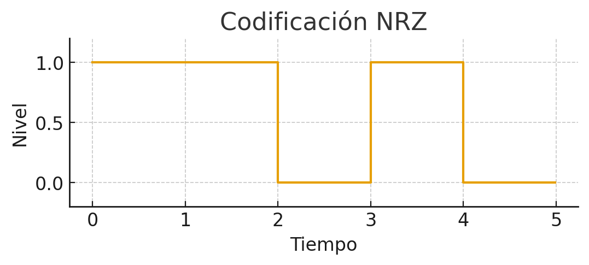
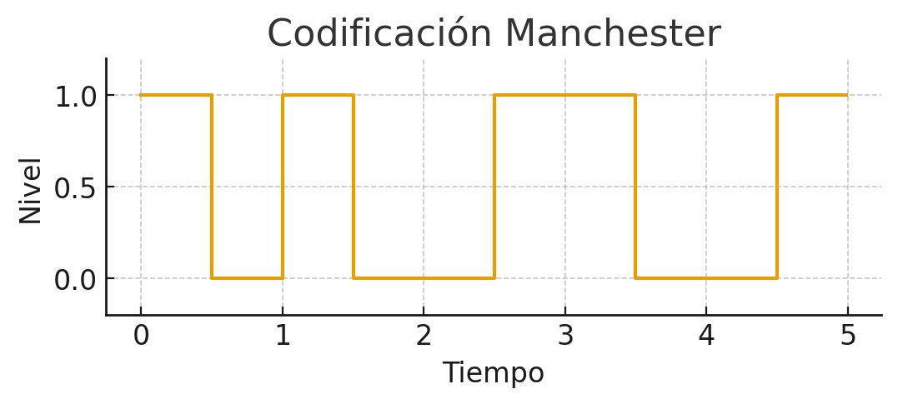
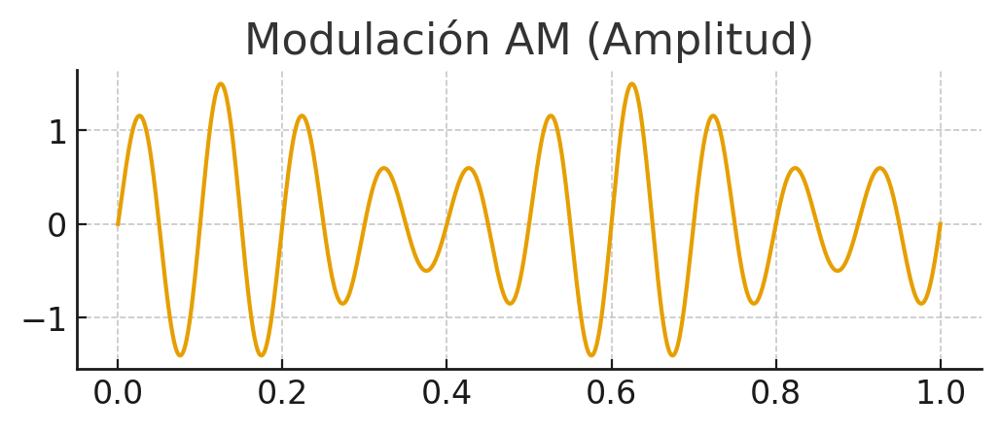
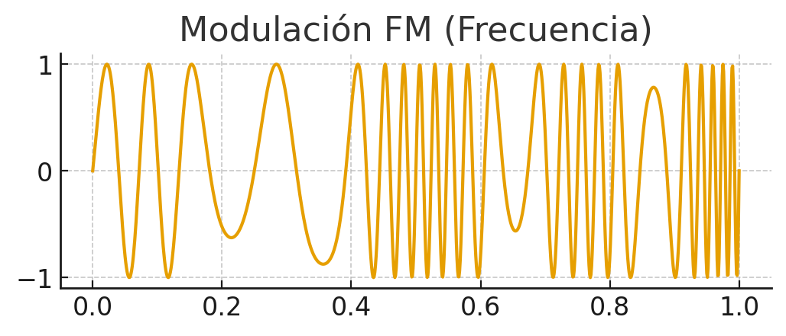

## Transmisión y perturbaciones

**Transmisión**: es el proceso de enviar datos de un punto a otro a través de un medio (cable, fibra, ondas de radio, etc.).  
**Perturbación**: son los problemas o interferencias que pueden afectar a la señal durante su viaje y hacer que llegue distorsionada o con errores.

En este bloque vamos a profundizar en **cómo se transmiten los datos en una red**, qué tipos de transmisión existen, qué técnicas se utilizan y qué problemas pueden aparecer durante la comunicación.

---

## Tipos de transmisión

### Según la naturaleza de la señal

- **Transmisión analógica**  
  - Señal continua en el tiempo.  
  - Se caracteriza por su **amplitud**, **frecuencia** y **fase**.  
  - Ejemplo: voz en una línea telefónica.  
  - Inconveniente: más sensible al ruido.

- **Transmisión digital**  
  - Señal discreta (0 y 1).  
  - Más robusta frente a interferencias.  
  - Ejemplo: datos en Ethernet o WiFi.  
  - Inconveniente: necesita convertir la señal analógica a digital.

  
*Onda continua.*

  
*Onda cuadrada binaria.*

---

### Según el número de señales simultáneas

- **Serie**: los bits viajan uno tras otro por una sola línea. Ejemplo: USB.  
- **Paralelo**: los bits viajan a la vez por varias líneas. Ejemplo: bus de impresora.

  
*Transmisión en serie: los bits viajan uno tras otro.*

  
*Transmisión en paralelo: varios bits viajan al mismo tiempo.*

---

### Según la dirección de transmisión

- **Símplex**: solo se transmite en un sentido (Tx → Rx). Ejemplo: TV por antena.  
- **Half-Dúplex**: se transmite en ambos sentidos, pero no a la vez. Ejemplo: walkie-talkie.  
- **Full-Dúplex**: se transmite y recibe al mismo tiempo. Ejemplo: teléfono móvil.

  
*Modos de transmisión: símplex, half-dúplex y full-dúplex.*

---

## Técnicas de transmisión

### Transmisión digital

- **NRZ**: simple pero problemas de sincronización.  
- **Manchester**: transición en cada bit, muy fiable.  
- **Diferencial Manchester**: robusto frente a errores de fase.

  
*Codificación NRZ.*

  
*Codificación Manchester.*

### Transmisión analógica

- **AM / ASK**: cambia la amplitud. Ejemplo: radio AM.  
- **FM / FSK**: cambia la frecuencia. Ejemplo: radio FM.  
- **PM / PSK**: cambia la fase. Ejemplo: WiFi.

  
*Modulación en amplitud.*

  
*Modulación en frecuencia.*

  
*Modulación en fase.*

---

## Perturbaciones en la transmisión

- **Atenuación**: pérdida de energía.  
- **Distorsión**: la señal se deforma.  
- **Ruido**: interferencias que alteran la señal.  

Tipos de ruido:  
- Térmico  
- Intermodulación  
- Diafonía  
- Impulsivo  

  
*Un ejemplo es cuando acercamos el móvil a altavoces y se oyen ruidos.*

---

## Resumen visual

| Criterio      | Tipos                      | Ejemplo                       |
|---------------|----------------------------|-------------------------------|
| Naturaleza    | Analógica / Digital        | Radio FM / Ethernet           |
| Nº señales    | Serie / Paralelo           | USB / Bus impresora           |
| Dirección     | Símplex / Half / Full      | TV / Walkie / Móvil           |
| Digital       | NRZ, Manchester, Dif. Man. | Ethernet                      |
| Analógica     | AM, FM, PM                 | Radio, Módems, WiFi           |
| Perturbación  | Atenuación, Distorsión, Ruido | Pérdidas / Interferencias |

---

## Conclusión

La transmisión de datos y las perturbaciones son conceptos básicos en redes. Entender cómo se envían los datos y qué problemas pueden surgir permite **diseñar e instalar redes más fiables**, usando el medio adecuado y aplicando las técnicas correctas.
