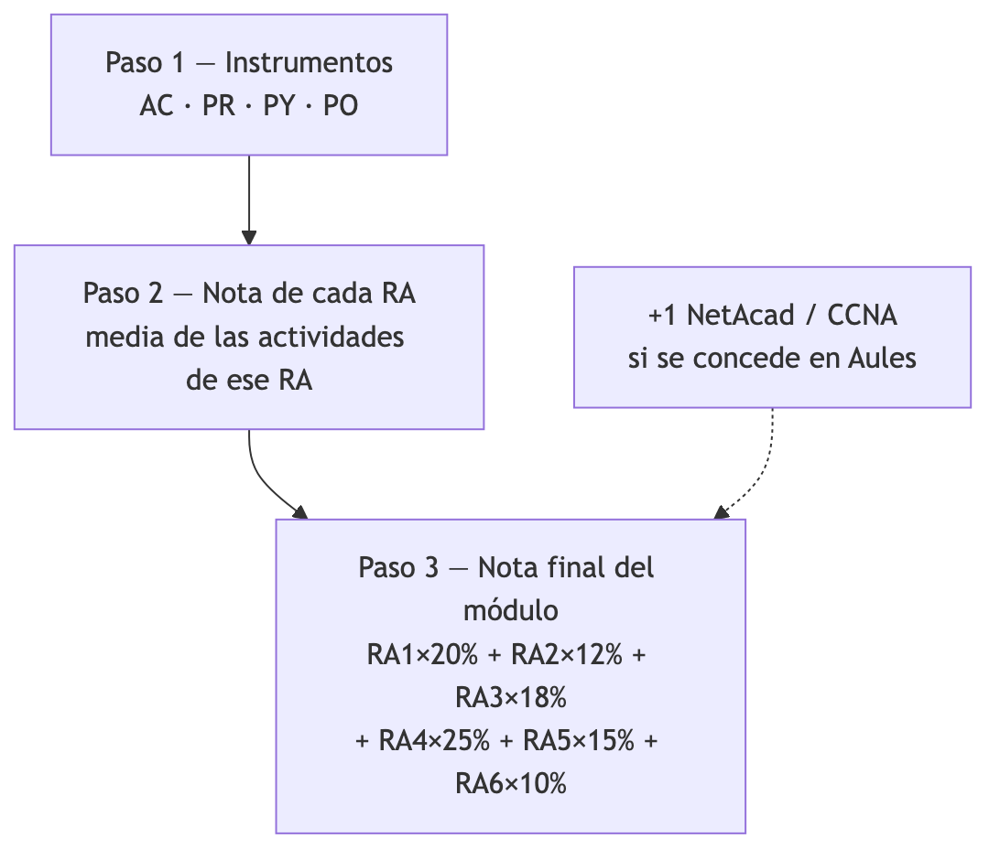
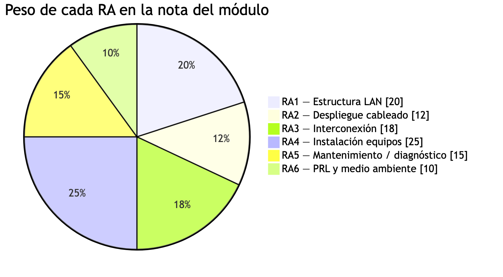
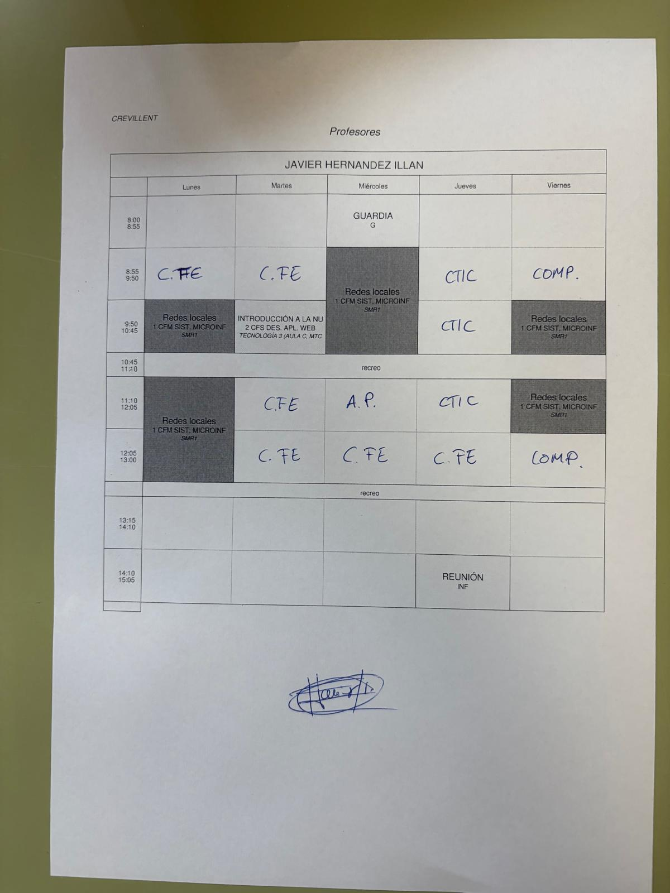

# PROGRAMACIÓN DIDÁCTICA

## REDES DE ÁREA LOCAL

**Código:** 0225  
**Duración del módulo:** 233 horas (**133** en centro + **100** de formación en empresa)  
**Horas semanales en centro:** 7 sesiones × 55 minutos  

**CICLO FORMATIVO DE GRADO MEDIO**  
**SISTEMAS MICROINFORMÁTICOS Y REDES**  
**Primer curso (1SMR)**  

**Profesor:** Javier Hernández Illán  

**CURSO:** 2026/2027  

**Centro:** IES Macià Abela (Crevillent)  
**Departamento de Informática**

---

## Índice

1. Introducción
2. Aportaciones del módulo al desarrollo de competencias
3. Objetivos
4. Contenidos y organización en unidades de programación
5. Metodología
6. Fomento a la lectura
7. Uso didáctico y profesional de las tecnologías
8. Evaluación
9. Desarrollo de las UUPP
10. Medidas de atención a la diversidad
11. Actividades complementarias y extraescolares
12. Formación en la empresa
13. Evaluación de la programación y de la práctica docente
- Anexo A. Matriz de cobertura de criterios de evaluación
- Anexo B. Programación de aula
- Anexo C. Sitio web de apuntes

---

# 1. Introducción

La presente programación didáctica concreta la planificación del módulo profesional **0225 Redes de área local** (1.er curso del CFGM **Sistemas Microinformáticos y Redes**), impartido en el **IES Macià Abela** (Crevillent) en el curso **2026/2027**.

Cómputo: **233 h** (**133** centro + **100** FE). La FE tiene fecha **provisional / aún no fijada**: se prevé en el **2.º trimestre, tras las vacaciones de Navidad**, y **se comunicará cuando el centro la concrete**. La temporalización docente usa el cómputo de **133 h** de centro, pero el calendario real (**7** sesiones/semana) **estira las UP hasta primavera (~mayo)**; ver 4.4 y programación de aula (C3).

Enfoque competencial con referentes en los **RA**. Los **CE** sirven solo para **verificar cobertura**, **sin** calificación criterial (acuerdo JE / departamento). El módulo se vincula a **UC0220_2** («Instalar, configurar y verificar los elementos de la red local según procedimientos establecidos») y aporta la base para caracterizar, desplegar, interconectar, instalar/configurar y mantener redes locales, diagnosticar incidencias y aplicar PRL/protección ambiental.

## 1.1. Características del módulo y concepto de programación didáctica

El módulo es central en el perfil del Técnico en SMR: instalación, configuración y mantenimiento de redes locales en pequeños entornos, con calidad, seguridad y respeto ambiental.

La PD es el nivel de concreción curricular del departamento: qué RA alcanzar, cómo organizar el aprendizaje, con qué recursos, cómo atender la diversidad y cómo evaluar. Datos identificativos:

| Campo | Valor |
| --- | --- |
| Denominación | Redes de área local |
| Código | 0225 |
| Familia profesional | Informática y Comunicaciones |
| Ciclo formativo | Sistemas Microinformáticos y Redes |
| Nivel | Ciclo formativo de grado medio |
| Curso | Primero (1SMR) |
| Duración | 233 h (133 centro + 100 FE) |
| Distribución semanal (centro) | 7 sesiones × 55 min |
| Curso académico | 2026/2027 |
| Profesor | Javier Hernández Illán |

Documento abierto: podrá ajustarse por evaluación inicial, evolución del grupo, FE u organización, respetando currículo y transparencia de calificación, con registro en el departamento.

## 1.2. Entorno

Conforme al RD 659/2023, el currículo debe atender al entorno socioproductivo. El **IES Macià Abela** (Crevillent, Baix Vinalopó) está próximo a Elche y Alicante, con tejido industrial y de servicios (pymes) que demanda digitalización y mantenimiento de redes locales.

Ello justifica prácticas profesionales (cableado estructurado, racks, switches/AP, VLANs, diagnóstico, documentación) y, cuando sea posible, FE y visitas. La oferta de SMR en el centro permite coordinar taller y módulos del ciclo.

## 1.3. Características del alumnado

El alumnado de **1SMR** es heterogéneo (edad, acceso, experiencia, competencia digital, disponibilidad; a veces estudios + trabajo). Las decisiones se basan en **evaluación inicial**, observación y orientación.

Respuesta: actividades graduadas, práctica guiada/autónoma, trabajo cooperativo, refuerzo/ampliación y adaptaciones de acceso, **sin modificar los RA**. Parte del alumnado elige el ciclo de forma voluntaria, lo que favorece la motivación profesional.

## 1.4. Marco legal

Normativa de referencia (selección):

**Estatal:** LOE/LOMLOE; LO 3/2022 de FP; **RD 1691/2007** (título SMR, módulo **0225**); RD 659/2023 (ordenación FP) y calendario de implantación; actualizaciones de títulos de grado medio (p. ej. RD 499/2024) en lo aplicable.

**Autonómica:** **Orden 8/2025** (evaluación FP); Decreto 114/2025 (currículos FP); **Resolución de 16 de julio de 2026** — instrucciones grados D/E curso **2026-2027** (documento **2026_24495_es** / DOGV); resolución de calendario escolar 2026-2027; Decreto 104/2018 y Orden 20/2019 (inclusión); Decreto 252/2019 (centros); currículo autonómico de SMR vigente.

Temporalización alineada al calendario del centro y a la programación de aula (Anexo B).

## 1.5. Propuestas de mejora derivadas del curso anterior

A partir de la experiencia del curso 2025-2026 y de las reflexiones de departamento, se adoptan las siguientes mejoras para 2026-2027:

| Mejora | Aplicación en 2026-2027 | Seguimiento |
| --- | --- | --- |
| Reorganización del temario | **Nueve UP** (T1–T9; tradicionalmente UT), con núcleo enlace/IP/VLAN antes del margen FE | Programación de aula |
| Evaluación | **Referentes = RA**; CE solo para verificar cobertura (sin % de boletín); nota = media ponderada IE→RA→módulo | Sección 8 y Anexo A |
| Itinerario Cisco | Integración **NetAcad / Packet Tracer** (PR303 WLAN, PR603 VLAN/routing) y **+1** opcional en nota final | Temas 3 y 6 |
| Materiales | Publicación progresiva en sitio **MkDocs** de apuntes | Anexo C |
| Entregas | Obligatoriedad de entregas en **Markdown (`.md`)** vía Aules | Secciones 6 y 7 |
| Corrección de vinculación UC | Uso de **UC0220_2** (red local), no UC de montaje de equipos ajenas al módulo | Sección 2 |

---

# 2. Aportaciones del módulo al desarrollo de competencias

## 2.1. Relación con el desarrollo de la competencia general

Según el Real Decreto 1691/2007, la **competencia general** del título consiste en:

> Instalar, configurar y mantener sistemas microinformáticos, aislados o en red, así como redes locales en pequeños entornos, asegurando su funcionalidad y aplicando los protocolos de calidad, seguridad y respeto al medio ambiente establecidos.

El módulo 0225 contribuye de forma directa a dicha competencia general al capacitar al alumnado para caracterizar, desplegar, interconectar, instalar, configurar y mantener redes locales cableadas, inalámbricas o mixtas en pequeños entornos, diagnosticar disfunciones y operar con criterios de calidad, seguridad y protección ambiental.

## 2.2. Relación con las competencias profesionales, personales y sociales

El módulo contribuye especialmente a las siguientes competencias profesionales, personales y sociales del título (letras del RD 1691/2007):

| Código | Competencia |
| --- | --- |
| **d** | Replantear el cableado y la electrónica de redes locales en pequeños entornos y su conexión con redes de área extensa canalizando a un nivel superior los supuestos que así lo requieran. |
| **e** | Instalar y configurar redes locales cableadas, inalámbricas o mixtas y su conexión a redes públicas, asegurando su funcionamiento en condiciones de calidad y seguridad. |
| **f** | Instalar, configurar y mantener servicios multiusuario, aplicaciones y dispositivos compartidos en un entorno de red local, atendiendo a las necesidades y requerimientos especificados. |
| **g** | Realizar las pruebas funcionales en sistemas microinformáticos y redes locales, localizando y diagnosticando disfunciones, para comprobar y ajustar su funcionamiento. |
| **h** | Mantener sistemas microinformáticos y redes locales, sustituyendo, actualizando y ajustando sus componentes, para asegurar el rendimiento del sistema en condiciones de calidad y seguridad. |

Además, el módulo refuerza competencias transversales de trabajo en equipo, documentación técnica, uso seguro de herramientas y responsabilidad profesional en el taller.

## 2.3. Contribución a las competencias para la empleabilidad

### Unidad de competencia asociada

Conforme al BOE del título, el módulo **0225 Redes locales** se asocia a:

> **UC0220_2:** Instalar, configurar y verificar los elementos de la red local según procedimientos establecidos.

Se corrige expresamente la vinculación errónea a **UC0953_2** (montaje de equipos microinformáticos) que pudiera figurar en programaciones anteriores: esa UC no es la referencia de este módulo.

La UC0220_2 se concreta en realizaciones profesionales orientadas a instalar y configurar nodos y elementos de la red local, verificar el funcionamiento según procedimientos y documentar el proceso, en coherencia con los RA1–RA6 del módulo.

### Empleabilidad

Las situaciones de aprendizaje (prácticas de taller, Packet Tracer, NetAcad, proyectos de diagnóstico y documentación) acercan al alumnado a ocupaciones vinculadas a soporte técnico, instalación de redes locales y mantenimiento de infraestructuras TIC en pymes y entornos departamentales.

## 2.4. Contribución de los resultados de aprendizaje a las competencias

| RA | Contribución principal a CP | Observación breve |
| :---: | --- | --- |
| RA1 | d, e | Fundamentos, mapa físico/lógico y topologías |
| RA2 | d, e | Despliegue de cableado y espacios |
| RA3 | d, e, f | Interconexión, conectores y verificación |
| RA4 | e, f | Instalación/configuración (WLAN, protocolos, VLANs) |
| RA5 | g, h | Diagnóstico, mantenimiento e informes |
| RA6 | e, h (calidad/seguridad/ambiente) | PRL y protección ambiental en el taller |

---

# 3. Objetivos

## 3.1. Objetivos generales del ciclo vinculados al módulo

La formación del módulo contribuye a alcanzar, entre otros, los siguientes **objetivos generales** del ciclo (letras del RD 1691/2007):

| Código | Objetivo general |
| --- | --- |
| **d** | Representar la posición de los equipos, líneas de transmisión y demás elementos de una red local, analizando la morfología, condiciones y características del despliegue, para replantear el cableado y la electrónica de la red. |
| **e** | Ubicar y fijar equipos, líneas, canalizaciones y demás elementos de una red local cableada, inalámbrica o mixta, aplicando procedimientos de montaje y protocolos de calidad y seguridad, para instalar y configurar redes locales. |
| **f** | Interconectar equipos informáticos, dispositivos de red local y de conexión con redes de área extensa, ejecutando los procedimientos para instalar y configurar redes locales. |
| **g** | Localizar y reparar averías y disfunciones en los componentes físicos y lógicos para mantener sistemas microinformáticos y redes locales. |
| **h** | Sustituir y ajustar componentes físicos y lógicos para mantener sistemas microinformáticos y redes locales. |

## 3.2. Relación entre objetivos, competencias y resultados de aprendizaje

| OG | CP | RA principales |
| :---: | :---: | :---: |
| d | d | RA1, RA2 |
| e | e | RA2, RA3, RA4 |
| f | e, f | RA3, RA4 |
| g | g | RA5 |
| h | h | RA5, RA6 |

## 3.3. Resultados de aprendizaje

Los RA del módulo (enunciados del RD 1691/2007) y sus **pesos en la calificación** del curso 2026-2027 son:

| Código | Descripción | Peso |
| --- | --- | ---: |
| **RA1** | Reconoce la estructura de redes locales cableadas analizando las características de entornos de aplicación y describiendo la funcionalidad de sus componentes. | **20 %** |
| **RA2** | Despliega el cableado de una red local interpretando especificaciones y aplicando técnicas de montaje. | **12 %** |
| **RA3** | Interconecta equipos en redes locales cableadas describiendo estándares de cableado y aplicando técnicas de montaje de conectores. | **18 %** |
| **RA4** | Instala equipos en red, describiendo sus prestaciones y aplicando técnicas de montaje. | **25 %** |
| **RA5** | Mantiene una red local interpretando recomendaciones de los fabricantes de hardware o software y estableciendo la relación entre disfunciones y sus causas. | **15 %** |
| **RA6** | Cumple las normas de prevención de riesgos laborales y de protección ambiental, identificando los riesgos asociados, las medidas y equipos para prevenirlos. | **10 %** |
| | **Total** | **100 %** |

**Nota metodológica de evaluación** (alineada con Solbes / normativa FP):

- Los **referentes de calificación son los RA** (no los instrumentos aislados ni los trimestres).
- **Nota de cada RA** = **media ponderada** de los **IE** (AC, PR, PY, PO) que evalúan ese RA.
- **Nota final del módulo** = **media ponderada** de los seis RA con pesos **20 / 12 / 18 / 25 / 15 / 10**.
- Los **CE sirven para verificar** que el alumnado ha alcanzado el RA: hay que **cubrir y trazar todos los CE** (Anexo A / matriz), pero **no** se convierten en porcentajes aritméticos de la nota del boletín (se evitan tablas del tipo «CE1 5 %, CE2 10 %…» como sumandos de calificación).
- El diseño de **IE** (más número y más peso sobre los CE más relevantes del perfil profesional) es la forma de **procedimentalizar** la evidencia del RA; **no** es un reparto conceptual / procedimental / actitudinal de la nota.

Referencias:
- [Los referentes para evaluar en FP](https://raulsolbes.com/2025/01/22/los-referentes-para-evaluar-en-fp/) (RA como referentes; CE para identificar el logro; RD 659/2023 art. 18; LO 3/2022 art. 26).
- [Programaciones didácticas para FP: evaluación](https://raulsolbes.com/2025/04/04/programaciones-didacticas-para-fp-evaluacion/).
- Matiz: [Evaluación por competencias en FP](https://raulsolbes.com/2020/05/27/evaluacion-por-competencias-en-fp/) (no dividir la nota en % conceptual/procedimental/actitudinal al evaluar CE).

### Cómo se calcula la nota (figura para Word)



| Paso | Contenido |
| --- | --- |
| **1** | Instrumentos **AC · PR · PY · PO** |
| **2** | Nota de cada **RA** = media (ponderada) de los IE de ese RA |
| **3** | Nota final = **RA1×20 % + RA2×12 % + RA3×18 % + RA4×25 % + RA5×15 % + RA6×10 %** |
| Extra | **+1 NetAcad / CCNA** si se concede en Aules (no sustituye ningún RA) |

### Peso de cada RA (figura para Word)



| RA | Descripción breve | Peso |
| --- | --- | ---: |
| RA1 | Estructura LAN | **20 %** |
| RA2 | Despliegue cableado | **12 %** |
| RA3 | Interconexión | **18 %** |
| RA4 | Instalación equipos | **25 %** |
| RA5 | Mantenimiento / diagnóstico | **15 %** |
| RA6 | PRL y medio ambiente | **10 %** |
| | **Total** | **100 %** |

Representación ASCII de respaldo:

```
RA1 ████████████████████ 20 %
RA2 ████████████ 12 %
RA3 ██████████████████ 18 %
RA4 █████████████████████████ 25 %
RA5 ███████████████ 15 %
RA6 ██████████ 10 %
```

## 3.4. Objetivos transversales y concreción didáctica

Además de los objetivos del título, se trabajan de forma transversal:

- Comunicación técnica escrita (informes, entregas Markdown, documentación de red).
- Trabajo colaborativo y responsabilidad en el uso del taller.
- Uso ético y seguro de las TIC (Aules, NetAcad, herramientas de diagrama y simulación).
- Prevención de riesgos y respeto ambiental en el manipulado de materiales y residuos.
- Autonomía progresiva hacia situaciones próximas a la formación en empresa.

---

# 4. Contenidos y organización en unidades de programación

Conforme al **Decreto 114/2025** (art. 9), el módulo se organiza en unidades de programación (**UP**, tradicionalmente UT). En esta PD las UP coinciden con los **nueve temas** T1–T9.

## 4.1. Contenidos curriculares de soporte

Los contenidos del módulo, según el currículo del título, se agrupan en bloques de soporte que esta programación desarrolla a través de nueve UP (temas):

1. **Caracterización de redes locales:** características, tipos, elementos, topologías, mapa físico.
2. **Despliegue del cableado:** identificación de espacios, armarios, paneles, canalizaciones, medios, conectores, herramientas, pruebas y etiquetado.
3. **Interconexión de equipos:** adaptadores, dispositivos de interconexión cableada e inalámbrica, redes mixtas.
4. **Instalación y configuración de equipos de red:** procedimientos, TCP/IP, direccionamiento IPv4/IPv6, configuración básica, seguridad básica, VLANs.
5. **Resolución de incidencias:** estrategias, monitorización, herramientas de diagnóstico, incidencias físicas y lógicas, informes.
6. **PRL y protección ambiental:** riesgos, EPI, medidas preventivas, residuos y orden/limpieza.

La duración mínima del módulo en el RD es de 130 h; en el cómputo del centro para 2026-27 se trabaja con **233 h** (133 centro + 100 FE), conforme a la organización del ciclo y a la programación de aula.

## 4.2. Criterios de organización y secuenciación

La secuenciación responde a los siguientes criterios:

1. **Progresión de lo general a lo específico:** fundamentos (T1) → medios y cableado (T2–T3) → capas de enlace y red (T4–T5) → enrutamiento/VLAN (T6) → transporte, NAT/IPv6 y cierre diagnóstico/PRL (T7–T9).
2. **Núcleo antes del margen FE:** el bloque enlace / IP / VLAN (T4–T6) y la práctica NetAcad **PR603** se sitúan **antes** del tramo pendiente de FE.
3. **Integración teoría–práctica** en cada tema (AC + PR; PY/PO en hitos).
4. **Alineación con el horario real:** 7 sesiones semanales (lun 3, mié 2, vie 2) de 55 minutos.
5. **Criterio horas↔sesiones:** **1 hora del cómputo de 133 = 1 sesión lectiva de 55 minutos** (decisión de planificación 2026-27).

## 4.3. Bloques de contenido

Las **UP** son los **nueve temas** del curso:

| UP | Título | RA principales |
| ---: | --- | --- |
| T1 | Introducción. Arquitectura de redes | RA1 |
| T2 | Medios de transmisión y capa física | RA2, RA3 |
| T3 | Cableado estructurado y componentes | RA2, RA3, RA4 |
| T4 | Capa de enlace | RA1, RA4 |
| T5 | Capa de red | RA1, RA4 |
| T6 | Enrutamiento, subnetting y VLANs | RA3, RA4 |
| T7 | Capa de transporte | RA4, RA5 |
| T8 | NAT e IPv6 | RA4, RA5 |
| T9 | Servicios, diagnóstico y protección | RA5, RA6 |

### Mapa UP (tema) × RA

| UP | RA1 | RA2 | RA3 | RA4 | RA5 | RA6 |
| --- | :---: | :---: | :---: | :---: | :---: | :---: |
| T1 | X | | | | | |
| T2 | | X | X | | | |
| T3 | | X | X | X | | |
| T4 | X | | | X | | |
| T5 | X | | | X | | |
| T6 | | | X | X | | |
| T7 | | | | X | X | |
| T8 | | | | X | X | |
| T9 | | | | | X | X |
| **Peso** | 20 % | 12 % | 18 % | 25 % | 15 % | 10 % |

## 4.4. Distribución temporal y unidades de programación

Fuente: programación de aula (Anexo B), **C3 — temporalización hasta primavera**.

| Concepto | Valor |
| --- | --- |
| Horas de centro (cómputo) | **133** |
| Horas FE | **100** (provisional; tras Navidad / 2.º trimestre; se comunicará) |
| Total módulo | **233** |
| Horario semanal | **7** × 55 min |
| Equivalencia de cómputo | 1 h curricular = 1 sesión |
| Primera sesión RAL | **11-sep-2026** |
| Cierre orientativo **T9** | **~2027-05-10** (~mayo) |
| Hipótesis C3 | **133 h ≠ fin de clase el 15-feb**; UP repartidas hasta primavera (taller + NetAcad) |

### Tabla T1–T9 (sesiones y fechas orientativas)

| Bloque | Sesiones (plan) | Nº sesión | Fechas lectivas (aprox.) | IE clave |
| --- | ---: | --- | --- | --- |
| **T1** | 18 | S001–S019 | 2026-09-11 → 2026-09-28 | Introducción. Arquitectura · PR101, AC102–104, PR102 |
| **T2** | 18 | S020–S037 | 2026-09-30 → 2026-10-21 | Medios / capa física · **PR201** (crimpado taller), PR202 |
| **T3** | 20 | S038–S057 | 2026-10-23 → 2026-11-13 | Cableado estructurado · **PR301** (taller), **PR304** (fusionadoras), **PR303 NetAcad WLAN**, PR302 |
| **PO1** | 2 | S058–S060 | 2026-11-16 → 2026-11-16 | Prueba objetiva 1.ª evaluación (T1–T3) + devolución |
| **T4** | 14 | S061–S074 | 2026-11-18 → 2026-11-30 | Capa de enlace · PR401, PR402 |
| **T5** | 14 | S075–S088 | 2026-12-02 → 2026-12-14 | Capa de red · PR501 |
| **T6** | 20 | S089–S109 | 2026-12-16 → 2027-01-20 | Enrutamiento / VLAN · PR601, PR602, **PR604** (VLAN taller), **PR603 NetAcad** |
| **PO2** | 2 | S110–S111 | 2027-01-22 → 2027-01-22 | Prueba objetiva 2.ª evaluación (núcleo T4–T6) + devolución |
| **T7** | 18 | S112–S130 | 2027-01-25 → 2027-02-10 | Capa de transporte · PR701, PR702 |
| **T8** | 16 | S131–S146 | 2027-02-12 → 2027-02-26 | NAT e IPv6 · PR801 |
| **T9** | 57 | S147–S203 | 2027-03-01 → 2027-05-10 | Servicios, diagnóstico, PRL · PR901, PR902, PY901, **PO901** + prep./cierre NetAcad-CCNA |

**Sesiones calendario T1–T9 (+ PO):** ~**203**. Cómputo centro: **133 h**. Margen tras T9: ~**7** sesiones (FE / recuperaciones / imprevistos).


---

# 5. Metodología

## 5.1. Principios metodológicos aplicables a la enseñanza en la formación profesional

Aprendizaje significativo, simulación profesional, práctica supervisada en taller y evaluación continua. Prioridades: aprender haciendo; progresión guiado→autónomo; documentación técnica; seguridad y calidad.

## 5.2. Metodologías activas

Prácticas de laboratorio/simulación (PT/NetAcad); proyectos (PY901); trabajo colaborativo; apoyo MkDocs (clase invertida parcial); resolución de problemas de diagnóstico (RA5).

## 5.3. Estrategias de enseñanza-aprendizaje y secuencia didáctica

Secuencia tipo por UP: activación → modelado → práctica guiada (AC/PR) → práctica autónoma → feedback en Aules → síntesis / enlace al hito PO o PY.

## 5.4. Tipo de actividades

| Tipo | Código | Descripción | Escala habitual |
| --- | :---: | --- | --- |
| Actividad de clase | **AC** | Microevidencia de aula | 0–1 |
| Práctica | **PR** | Laboratorio, simulación, NetAcad | 0–10 |
| Proyecto | **PY** | Entregable mayor con rúbrica | 0–30 |
| Prueba objetiva | **PO** | Examen escrito o en ordenador | 0–100 |

Opcionalmente pueden usarse actividades de refuerzo o profundización sin sustituir los IE anteriores. La codificación sigue el patrón *tipo + tema + orden* (p. ej. `PR303` = práctica 03 del Tema 3).

## 5.5. Organización del aula, agrupamientos y roles

- Sesiones en **aula-taller** de redes / informática del ciclo, con puestos individuales o compartidos según la actividad.
- Agrupamientos variables: individual (PO, algunas AC), parejas (cableado, PT), grupo pequeño (montaje de rack / casos).
- Roles rotativos en prácticas de taller (montaje, verificación, documentación, seguridad).
- Cumplimiento de las **normas del taller** del centro (documento canónico del IES y resumen publicado en el sitio de apuntes).

## 5.6. Coordinación intermodular, Proyecto Intermodular y formación en empresa

Coordinación con el equipo de 1SMR (SO, aplicaciones, seguridad). Si el centro desarrolla proyecto intermodular, se alinearán evidencias de red sin duplicar carga. La FE (sección 12) se insertará al fijarse la fecha.

## 5.7. Materiales y recursos didácticos

- Sitio web de apuntes MkDocs: <https://fjavier-hernandez.github.io/ral/>
- Aules (entregas, calificaciones, anuncios).
- Visual Studio Code + Markdown.
- Cisco Packet Tracer y plataforma **NetAcad** (class del curso; el profesor actúa como instructor).
- Herramientas de diagrama: Excalidraw, draw.io / diagrams.net, Dia.
- Material de taller: cableado, conectores, paneles, electrónica de red, herramientas de **crimpado** y comprobación, **fusionadoras** de fibra (y cleaver/protectores), switches gestionables didácticos, EPI según normas del taller.
- Documentación técnica, normas IEEE/ISO de referencia pedagógica y RFCs resumidos cuando proceda.

## 5.8. Planificación del uso de espacios y equipamientos

| Espacio / recurso | Uso principal |
| --- | --- |
| Aula-taller SMR | Docencia ordinaria T1–T9, prácticas de cableado e interconexión |
| Equipos de alumno | Simulación PT, configuración, entregas `.md` |
| Armarios / paneles didácticos | T3 (PR301), T6 (PR604), T9 |
| Fusionadoras / fibra | T3 (**PR304**) |
| NetAcad (online) | PR303, PR603 y preparación CCNA (+1 no sustituye RA) |
| Aules | Entrega y feedback |

---

# 6. Fomento a la lectura

## 6.1. Actividades de lectura y comunicación técnica

Se fomenta la lectura comprensiva de:

- Apuntes y guiones técnicos del sitio MkDocs.
- Hojas de datos y manuales breves de fabricantes (switches, AP, cableado).
- Resúmenes de **RFC** y estándares (selección adaptada al nivel de grado medio).
- Normas de taller y procedimientos de seguridad.

La producción escrita se canaliza mediante **entregas en Markdown (`.md`)** en Aules: informes de práctica, mapas de red, bitácoras de diagnóstico y el proyecto PY901. No se aceptan entregas en PDF como formato ordinario.

## 6.2. Seguimiento, evaluación e inclusión

El seguimiento se realiza a través de las AC/PR/PY que exigen lectura y redacción técnica. Se ofrecen modelos, plantillas y rúbricas claras. Cuando sea preciso, se adaptará el formato de acceso (tamaño de letra, tiempo, apoyos) sin reducir el nivel de exigencia competencial del RA evaluado.

---

# 7. Uso didáctico y profesional de las tecnologías

## 7.1. Finalidad y criterios generales de utilización

Las TIC se usan como medio profesional real (documentación, simulación, entrega, colaboración), no como fin ornamental. Se priorizan herramientas alineadas con el desempeño del técnico en redes locales.

## 7.2. Búsqueda, selección y gestión de información técnica

El alumnado busca, contrasta y cita fuentes técnicas (documentación de fabricante, apuntes del módulo, RFCs). Se trabaja la distinción entre fuentes fiables y contenido no verificado.

## 7.3. Comunicación, entrega y colaboración mediante canales digitales

- **Aules:** canal oficial de entregas y calificaciones.
- Comunicación respetuosa y trazable.
- Trabajo colaborativo cuando la actividad lo requiera, manteniendo la autoría individual exigible.

## 7.4. Software y entornos digitales del módulo

| Recurso | Uso |
| --- | --- |
| Aules | LMS del centro |
| VS Code + Markdown | Redacción de entregas |
| Excalidraw / draw.io / Dia | Diagramas de red |
| Packet Tracer | Simulación LAN |
| NetAcad | Itinerario WLAN/VLAN/CCNA |
| MkDocs (sitio público) | Apuntes y planificación visible |

## 7.5. Uso responsable, seguro, ético y accesible

Se exige:

- Respeto a la privacidad y a los datos personales.
- Uso legítimo de licencias y cuentas NetAcad.
- Integridad académica (sección 8.8).
- Cuidado del equipamiento compartido.
- Preferencia por formatos accesibles (Markdown, contraste, estructura clara).

---

# 8. Evaluación

## 8.1. Principios y organización de la evaluación

La evaluación es **continua, formativa y sumativa**, orientada a comprobar el grado de consecución de los **resultados de aprendizaje**. Los **referentes de calificación son los RA**; los instrumentos (AC, PR, PY, PO) aportan evidencias para calificar cada RA.

**Modelo del curso 2026-27 (acuerdo JE / departamento, alineado con Solbes):**

- **Referentes = RA** (no los IE aislados ni los trimestres).
- **CE = verificación** de que se ha alcanzado el RA: se cubren y trazan todos (Anexo A / matriz), **sin** convertirlos en porcentajes de la nota del boletín.
- **Fórmula:** nota de cada RA = media ponderada de sus IE; nota final = media ponderada de los RA (pesos 20/12/18/25/15/10).
- El diseño de IE procedimentaliza la evidencia del RA (más peso/número sobre CE más relevantes del perfil); **no** es un reparto conceptual/procedimental/actitudinal.

Referencias: [referentes en FP](https://raulsolbes.com/2025/01/22/los-referentes-para-evaluar-en-fp/); [PD y evaluación](https://raulsolbes.com/2025/04/04/programaciones-didacticas-para-fp-evaluacion/); matiz [evaluación por competencias](https://raulsolbes.com/2020/05/27/evaluacion-por-competencias-en-fp/).

## 8.2. Características de la evaluación

- **Inicial:** detección de puntos de partida al inicio de curso / bloques.
- **Procesual:** feedback frecuente en Aules y en taller.
- **Final:** consolidación por RA y calificación del módulo.
- **Transparente:** criterios e instrumentos publicados con antelación razonable.
- **Inclusiva:** adaptaciones de acceso cuando proceda (sección 10).

## 8.3. Referentes, ponderación y trazabilidad curricular

**Referentes de calificación:** los seis **RA** con pesos **20 / 12 / 18 / 25 / 15 / 10** (no los instrumentos ni los trimestres).

**Trazabilidad:** cada IE declara el RA (y los CE trabajados a efectos de cobertura/verificación). La matriz completa CE × actividad se mantiene en:

`[CURSOS]/26_27/[RAL]/Planificacion/matriz_CE_RAL_2026_27.md`

Cobertura verificada: **51/51 CE**. Esa matriz **no** es motor de nota.

## 8.4. Ponderación de los RRAA y CCEE

### Ponderación de RA (sí califica)

| RA | Peso |
| :---: | ---: |
| RA1 | 20 % |
| RA2 | 12 % |
| RA3 | 18 % |
| RA4 | 25 % |
| RA5 | 15 % |
| RA6 | 10 % |

### Ponderación de CE (no califica)

**No se asignan porcentajes de calificación a los CE.** El título 8.4 de la plantilla JE se mantiene a efectos de estructura documental, pero el contenido se adapta al modelo no criterial acordado: los CE se consultan en el Anexo A únicamente como checklist de cobertura.

## 8.5. Procedimientos e instrumentos de evaluación

| Instrumento | Escala | Procedimiento breve |
| --- | --- | --- |
| **AC** | 0–1 | Observación / microtarea de aula |
| **PR** | 0–10 | Práctica de taller o simulación; rúbrica o checklist |
| **PY** | 0–30 | Proyecto con rúbrica |
| **PO** | 0–100 | Prueba objetiva (PO1, PO2, PO901 u otras que se convoquen) |
| **NetAcad / CCNA** | **+1** sobre nota final | Aprovechamiento / certificación según criterio publicado en Aules |

Itinerario NetAcad integrado en calificación ordinaria de prácticas:

- **PR303** (T3): WLAN / AP + módulo NetAcad inalámbrico.
- **PR603** (T6): switching / VLAN + routing básico NetAcad (+ preparación).
- Taller físico (refuerzo **RA4** / interconexión): **PR301** (rack/switch), **PR304** (fusionadoras), **PR604** (VLAN en switch del taller).

El **+1** NetAcad/CCNA se aplica, si procede, sobre la **nota final del módulo**; **no sustituye** ni compensa ningún RA.

## 8.6. Plazo de realización de las convocatorias

Las convocatorias de evaluación se ajustarán al calendario oficial del centro y a las instrucciones de inicio de curso 2026-2027. Los hitos PO1 / PO2 / PO901 se sitúan según la programación de aula (Anexo B). Cualquier cambio se comunicará por Aules y se reflejará en el seguimiento de departamento.

## 8.7. Cálculo de las calificaciones y condiciones de superación

### 8.7.1. Calificación de un criterio de evaluación

**Los CE no se califican de forma aislada ni ponderada.** Se comprueba que cada CE dispone de al menos una evidencia (Anexo A). Un CE puede trabajarse en varias actividades; ello **no** multiplica su peso en la nota.

### 8.7.2. Calificación de un resultado de aprendizaje

Para cada RA:

1. Se consideran los IE que lo evalúan (AC, PR, PY, PO).
2. Se normalizan a una escala común (0–10) cuando sea necesario para el promedio.
3. Se calcula la **media ponderada** de esos IE según los pesos internos que el profesor publique en Aules para el bloque / evaluación.
4. La nota del RA se expresa en escala 0–10 (o equivalente numérico del centro).

**Umbral:** cada RA debe alcanzarse con nota **≥ 5**. Los RA son **no compensables** entre sí.

### 8.7.3. Calificación final del módulo

\[
N_{final} = 0{,}20\,N_{RA1} + 0{,}12\,N_{RA2} + 0{,}18\,N_{RA3} + 0{,}25\,N_{RA4} + 0{,}15\,N_{RA5} + 0{,}10\,N_{RA6}
\]

Si se concede el aprovechamiento NetAcad/CCNA conforme al criterio de Aules:

\[
N_{módulo} = \min(10,\ N_{final} + 1)
\]

(o el tope que establezca la normativa/centro para la calificación numérica final).

Condición de superación ordinaria: **todos los RA ≥ 5** y cumplimiento de los requisitos de evaluación continua / asistencia que establezcan la Orden 8/2025 y las instrucciones del curso.

### 8.7.4. RRAA esenciales, umbrales y compensación

- Todos los RA del módulo se consideran **necesarios** para la superación.
- **No hay compensación** entre RA.
- Umbral por RA: **≥ 5**.

### 8.7.5. Calificaciones parciales y nota informativa de las UUPP

Las evaluaciones parciales (1.ª / 2.ª / 3.ª) tienen carácter **informativo** del progreso, calculado a partir de los IE disponibles hasta la fecha y de los RA trabajados. La calificación final del módulo se determina conforme a 8.7.3 cuando existan evidencias suficientes de todos los RA (incluidas, en su caso, las desarrolladas en FE).

## 8.8. Autoría, integridad académica y uso de inteligencia artificial

El alumnado debe entregar trabajo propio. Se permite el uso de IA como apoyo a la redacción o depuración **si se declara** y no sustituye la comprensión ni la ejecución práctica exigida. El plagio, la copia entre compañeros en pruebas individuales o la entrega de evidencias no realizadas por el alumno/a podrán conllevar la calificación de insuficiente en el IE afectado y, en su caso, las medidas disciplinarias previstas en el centro.

## 8.9. Refuerzo y recuperación durante el proceso ordinario

Durante el curso se ofrecerán oportunidades de refuerzo y recuperación de IE/RA pendientes, priorizando la recuperación temprana tras PO1/PO2 y antes del cierre del bloque de centro. Las condiciones concretas (plazos, instrumentos alternativos equivalentes) se publicarán en Aules, alineadas con la Orden 8/2025 y las instrucciones 2026-27, **sin inventar porcentajes** no establecidos en normativa.

## 8.10. Evaluación final ordinaria y plan de recuperación para evaluación extraordinaria

Quien no supere el módulo en la evaluación final ordinaria podrá acogerse al plan de recuperación / convocatoria extraordinaria conforme a la normativa autonómica y a los acuerdos de centro. El plan especificará RA pendientes e instrumentos equivalentes. Se informará con antelación suficiente.

## 8.11. Alumnado con el módulo pendiente de cursos anteriores

El alumnado con el módulo pendiente seguirá el plan que establezca el departamento (calendario de entregas/pruebas, profesor responsable, criterios de superación por RA). Se mantendrá el modelo no criterial y los pesos de RA del curso vigente, salvo decisión documentada en contrario.

## 8.12. Pérdida del derecho a la evaluación continua

La pérdida del derecho a la evaluación continua se regirá por lo establecido en la **Orden 8/2025**, las instrucciones de inicio de curso **2026-2027** y las normas de organización y funcionamiento del centro. En tal caso, el alumnado será evaluado mediante las pruebas / instrumentos extraordinarios que se determinen, manteniendo como referentes los RA del módulo. No se fijan en esta PD porcentajes de falta de asistencia distintos de los que establezca la normativa o el centro.

## 8.13. Evaluación de los RRAA desarrollados en la empresa

**Acta de acuerdo (actualización de las PD en el marco de la Formación en Empresa)**

**Asunto:** Actualización de las Programaciones Didácticas (PD) en el marco de la Formación en Empresa.  
**Fecha:** 14/07/2026  
**Participantes:** Trino, Javi H.

**Temas tratados**

Se aborda la necesidad de actualizar las Programaciones Didácticas (PD) para adaptarlas a los requisitos derivados de la Formación Profesional con formación en empresa.

Tras el análisis realizado, se acuerda que:

La evaluación y calificación del alumnado corresponde íntegramente al profesorado del módulo, quien deberá emitir la calificación final del 100 % de la nota. Para ello, el profesorado evaluará hasta un 80 % de cada Resultado de Aprendizaje (RA) mediante los instrumentos definidos en la programación didáctica, impartiendo y evaluando los contenidos más significativos que considere necesarios para garantizar la adquisición de los aprendizajes. La valoración de la empresa, mediante el informe de APTO o NO APTO, servirá para validar el desarrollo de la formación en empresa y completar la evaluación del RA hasta el 100 %.

Todos los Resultados de Aprendizaje (RA) de los módulos profesionales deberán estructurarse de manera que el 80 % de su desarrollo y evaluación se realice en el centro educativo, mediante actividades, prácticas, pruebas y otros instrumentos de evaluación establecidos en la programación didáctica.

El 20 % restante estará vinculado a la formación en empresa, conforme a los planes formativos individualizados de cada alumno y empresa colaboradora.

Los planes formativos de las empresas deberán especificar los Resultados de Aprendizaje que realmente se trabajarán en cada entorno productivo, ya que estos pueden variar en función de la actividad desarrollada y de las características de cada empresa.

En aquellos casos en los que determinados Resultados de Aprendizaje, o parte de los mismos, no puedan desarrollarse o evidenciarse durante la estancia en la empresa, el profesorado deberá disponer de un catálogo de actividades de refuerzo o complementarias que permita completar la evaluación de dicho porcentaje.

Estas actividades de refuerzo deberán estar previamente definidas y alineadas con los Resultados de Aprendizaje afectados, garantizando que todo el alumnado pueda alcanzar y demostrar la adquisición de las competencias previstas en el currículo, independientemente de las particularidades de la empresa asignada.

**Conclusiones**

Se considera necesario que los departamentos didácticos revisen y actualicen sus Programaciones Didácticas para reflejar este modelo de evaluación, en el que el profesorado del módulo califica el 100 % de la nota, estructura cada RA con un 80 % en el centro y un 20 % vinculado a la empresa (APTO/NO APTO + planes formativos + catálogo de refuerzo cuando la empresa no cubra evidencias).

**Aplicación en este módulo (provisional):** la FE (**100 h**) **aún no tiene fecha fijada**. Se prevé en el **2.º trimestre, tras las vacaciones de Navidad**, y **se comunicará cuando el centro la concrete**. Hasta entonces no se inventa día concreto ni calendario FE cerrado. Los planes formativos y el catálogo de refuerzo se concretarán al activarse la FE, manteniendo el modelo 80 % centro / 20 % empresa y la calificación íntegra por el profesorado del módulo.

## 8.14. Información, comunicación, revisión y reclamación

Las calificaciones y criterios se comunicarán por los canales oficiales (Aules / procedimientos del centro). El alumnado podrá solicitar aclaraciones al profesor. Las reclamaciones se tramitarán según el procedimiento establecido por la normativa y el IES Macià Abela.

## 8.15. Evaluación de la programación y de la práctica docente

Véase la **sección 13** de esta programación.

---

# 9. Desarrollo de las UUPP

Desarrollo breve (detalle de sesiones en Anexo B; banco de IE en los temas del sitio de apuntes).

| UP | Sesiones / ventana (orient.) | RA | IE clave |
| --- | --- | --- | --- |
| **T1** Introducción / arquitectura | 18 · S001–S019 · 2026-09-11→2026-09-28 | RA1 | AC102–104, PR101, PR102 |
| **T2** Medios y capa física | 18 · S020–S037 · 2026-09-30→2026-10-21 | RA2, RA3 | AC201–204, **PR201**, PR202 |
| **T3** Cableado estructurado | 20 · S038–S057 · 2026-10-23→2026-11-13 | RA2–RA4 | **PR301**, **PR304**, PR302, **PR303** · + **PO1** |
| **T4** Capa de enlace | 14 · S061–S074 · 2026-11-18→2026-11-30 | RA1, RA4 | PR401, PR402 |
| **T5** Capa de red | 14 · S075–S088 · 2026-12-02→2026-12-14 | RA1, RA4 | PR501 |
| **T6** Enrutamiento / VLAN | 20 · S089–S109 · 2026-12-16→2027-01-20 | RA3, RA4 | **PR604**, **PR603** · + **PO2** |
| **T7** Capa de transporte | 18 · S112–S130 · 2027-01-25→2027-02-10 | RA4, RA5 | PR701, PR702 |
| **T8** NAT e IPv6 | 16 · S131–S146 · 2027-02-12→2027-02-26 | RA4, RA5 | PR801 |
| **T9** Servicios / diagnóstico / PRL | 57 · S147–S203 · 2027-03-01→2027-05-10 | RA5, RA6 | PR901–902, PY901, **PO901** + CCNA |

# 10. Medidas de atención a la diversidad

## 10.1. Niveles de respuesta educativa

Marco de inclusión valenciano (Decreto 104/2018 y Orden 20/2019): medidas universales, apoyos ordinarios y, si procede, especializados, con el departamento de orientación.

## 10.2. Medidas universales y Diseño Universal para el Aprendizaje (DUA)

Múltiples formas de representación (MkDocs, diagramas, taller, simulador), de acción/expresión (práctica, diagrama, `.md`, PO) y de implicación (casos, NetAcad, cooperativo, retos graduados). Instrucciones claras, checklists/rúbricas y pasos pequeños.

## 10.3. Tercer nivel de respuesta: apoyos ordinarios adicionales

Ampliación de tiempo si procede; refuerzo y materiales extra; ajuste de agrupamientos; evidencias prácticas equivalentes ante barreras de formato escrito (**sin** rebajar el RA).

## 10.4. Cuarto nivel de respuesta: apoyos especializados adicionales

Según dictámenes / planes individualizados del equipo educativo y orientación, manteniendo los RA como referentes.

## 10.5. Evaluación inclusiva y accesibilidad en el entorno digital

Claridad en Aules y apuntes; guía VS Code + Markdown y plantillas para que el formato `.md` no sea barrera de acceso.

## 10.6. Coordinación, registro y revisión de las medidas

Coordinación con tutor/a y orientación; registro según protocolos del centro; revisión tras evaluación inicial y en sesiones de evaluación.

---

# 11. Actividades complementarias y extraescolares

## 11.1. Objetivos

Acercar al alumnado al entorno profesional de redes locales y a la certificación de base (NetAcad/CCNA).

## 11.2. Actividades previstas

| Actividad | Estado | Observación |
| --- | --- | --- |
| Itinerario **Cisco NetAcad** | Previsto | Integrado en PR303 / PR603 |
| Visitas a empresas / instalaciones | **Provisional** | Según disponibilidad del centro |
| Charlas técnicas / demos | Provisional | Agenda del departamento |

## 11.3–11.5. Integración, evaluación y organización

Vinculación preferente a **RA2–RA5**; si es evaluable, se anunciará IE/RA en Aules. Responsable: profesor del módulo; permisos según protocolo del IES; seguimiento en departamento.

---

# 12. Formación en la empresa

| Concepto | Detalle |
| --- | --- |
| Horas FE | **100 h** |
| Horas centro (cómputo) | **133 h** |
| Total módulo | **233 h** |
| Horario semanal en centro | **7** × **55 min** |
| Fecha FE | **Provisional / no fijada** — tras Navidad (2.º trimestre); **se comunicará** |
| Núcleo antes de FE | **T4–T6** + **PR604/PR603** (+ **PO2** ~2027-01-22) |
| Cierre T9 | **~2027-05-10** (~mayo); 133 h **no** cortan en febrero |
| Margen | ~**7** sesiones tras T9 + posible desplazamiento por FE |

Mientras la FE no tenga fecha concreta:

1. Secuencia T1→T9 en calendario real (ritmo C3 hasta primavera).
2. FE se inserta en 2.º trimestre al comunicarse; puede desplazar T7–T9 **sin** poner T4–T6 después de la FE.
3. Evaluación en empresa según **acta 14/07/2026** (8.13): profesor califica 100 %; 80 % centro / 20 % empresa (APTO–NO APTO + planes + catálogo de refuerzo).

Al fijarse la FE se actualizan este apartado y el Anexo B, sin cambiar pesos RA ni el modelo referentes/CE.


---

# 13. Evaluación de la programación y de la práctica docente

La PD y la práctica docente se revisarán a lo largo del curso mediante:

- Análisis de resultados por RA tras cada evaluación parcial.
- Grado de cumplimiento de la temporalización (cómputo 133 h; calendario hasta primavera / margen FE).
- Adecuación de IE y carga de trabajo del alumnado.
- Uso efectivo de NetAcad y del sitio MkDocs.
- Valoración del modelo no criterial (cobertura CE vs. claridad de calificación).
- Propuestas de mejora para el curso siguiente (memoria de departamento).

Indicadores orientativos: porcentaje de alumnado que supera cada RA, cumplimiento de la matriz 51/51, desviación temporal ±1 semana, y satisfacción / incidencias de taller registradas.

---

# Anexos

## Anexo A. Matriz de cobertura de criterios de evaluación

Cobertura curricular **51/51**. Los CE **verifican** el logro del RA; **no** son porcentajes de la nota del boletín.

### A.1. Resumen por RA

| RA | Nº CE BOE | Cobertura | IE principales (muestra) |
| :---: | :---: | :---: | --- |
| RA1 | 8 | **8/8** | AC102–104, PR101 |
| RA2 | 10 | **10/10** | PR201, PR301, PR302, PR304 |
| RA3 | 7 | **7/7** | PR201, PR301, PR304, PR604 |
| RA4 | 10 | **10/10** | PR301, PR303, PR603, PR604 |
| RA5 | 8 | **8/8** | PR701, PR801, PR902, PY901 |
| RA6 | 8 | **8/8** | AC908, PR201, PR304, PY901 |

**Total:** 51/51 CE cubiertos.

### A.2. Matriz CE × IE (para Word)

| Código CE | Enunciado (BOE) | RA | Tema(s) | Actividades / IE |
| --- | --- | :---: | --- | --- |
| **CE1a** | Se han descrito los principios de funcionamiento de las redes locales. | RA1 | T1, T4, T5, T7, T8 | AC102, AC103, AC104, AC401, AC402, AC403, AC404, AC501, AC502, AC503, AC504, AC505, AC5… |
| **CE1b** | Se han identificado los distintos tipos de redes. | RA1 | T1 | PR101 |
| **CE1c** | Se han descrito los elementos de la red local y su función. | RA1 | T1, T4, T5, T7, T8 | AC102, AC103, AC401, AC403, AC501, AC701, AC707, AC801, PR101, PR102, PR401, PR402, PR5… |
| **CE1d** | Se han identificado y clasificado los medios de transmisión. | RA1 | T1 | AC102 |
| **CE1e** | Se ha reconocido el mapa físico de la red local. | RA1 | T1 | PR101 |
| **CE1f** | Se han utilizado aplicaciones para representar el mapa físico de la red local. | RA1 | T1 | PR101 |
| **CE1g** | Se han reconocido las distintas topologías de red. | RA1 | T1 | AC104, PR101 |
| **CE1h** | Se han identificado estructuras alternativas. | RA1 | T1 | PR101 |
| **CE2a** | Se han reconocido los principios funcionales de las redes locales. | RA2 | T2 | AC204 |
| **CE2b** | Se han identificado los distintos tipos de redes. | RA2 | T2 | AC204 |
| **CE2c** | Se han diferenciado los medios de transmisión. | RA2 | T2, T3 | AC201, AC202, AC203, AC204, PR202, PR304 |
| **CE2d** | Se han reconocido los detalles del cableado de la instalación y su despliegue (categoría, espacios, soportes…). | RA2 | T2, T3 | AC201, AC304, PR202, PR301, PR302 |
| **CE2e** | Se han seleccionado y montado las canalizaciones y tubos. | RA2 | T3 | AC304, PR302 |
| **CE2f** | Se han montado los armarios de comunicaciones y sus accesorios. | RA2 | T3 | AC302, PR301, PR302 |
| **CE2g** | Se han montado y conexionado las tomas de usuario y paneles de parcheo. | RA2 | T3 | AC304, PR301, PR302 |
| **CE2h** | Se han probado las líneas de comunicación entre las tomas de usuario y paneles de parcheo. | RA2 | T2 | PR201 |
| **CE2i** | Se han etiquetado los cables y tomas de usuario. | RA2 | T3 | AC304, PR302 |
| **CE2j** | Se ha trabajado con la calidad y seguridad requeridas. | RA2 | T2, T3 | PR201, PR301, PR302, PR304 |
| **CE3a** | Se ha interpretado el plan de montaje lógico de la red. | RA3 | T3, T6 | AC305, AC601, AC602, AC603, AC604, AC605, AC606, AC607, AC608, PR301, PR302, PR601, PR6… |
| **CE3b** | Se han montado los adaptadores de red en los equipos. | RA3 | T3 | AC301 |
| **CE3c** | Se han montado conectores sobre cables (cobre y fibra) de red. | RA3 | T2, T3 | PR201, PR304 |
| **CE3d** | Se han montado los equipos de conmutación en los armarios de comunicaciones. | RA3 | T3 | AC303, AC305, PR301 |
| **CE3e** | Se han conectado los equipos de conmutación a los paneles de parcheo. | RA3 | T3 | PR301 |
| **CE3f** | Se ha verificado la conectividad de la instalación. | RA3 | T2, T3, T6 | PR201, PR202, PR301, PR304, PR601, PR602, PR603, PR604 |
| **CE3g** | Se ha trabajado con la calidad requerida. | RA3 | T2, T3 | PR201, PR304 |
| **CE4a** | Se han identificado las características funcionales de las redes inalámbricas. | RA4 | T3 | AC301, AC303, PR303 |
| **CE4b** | Se han identificado los modos de funcionamiento de las redes inalámbricas. | RA4 | T3 | AC303, PR303 |
| **CE4c** | Se han instalado adaptadores y puntos de acceso inalámbrico. | RA4 | T3 | AC305, PR303 |
| **CE4d** | Se han configurado los modos de funcionamiento y los parámetros básicos. | RA4 | T3 | PR303 |
| **CE4e** | Se ha comprobado la conectividad entre diversos dispositivos y adaptadores inalámbricos. | RA4 | T3 | PR303 |
| **CE4f** | Se ha instalado el software correspondiente. | RA4 | T3 | PR303 |
| **CE4g** | Se han identificado los protocolos. | RA4 | T4, T5, T6, T7, T8 | AC404, AC506, AC607, AC609, AC701, AC702, AC703, AC707, AC802, AC803, AC804, AC805, AC8… |
| **CE4h** | Se han configurado los parámetros básicos. | RA4 | T4, T5, T6, T7, T8 | AC607, AC706, AC803, AC806, PR402, PR501, PR601, PR602, PR603, PR604, PR801 |
| **CE4i** | Se han aplicado mecanismos básicos de seguridad. | RA4 | T3 | PR303 |
| **CE4j** | Se han creado y configurado VLANS. | RA4 | T6 | AC608, AC609, PR602, PR603, PR604 |
| **CE5a** | Se han identificado incidencias y comportamientos anómalos. | RA5 | T7, T9 | AC705, AC706, AC904, AC906, PR902, PY901 |
| **CE5b** | Se ha identificado si la disfunción es debida al hardware o al software. | RA5 | T7, T8, T9 | AC704, AC808, AC904, PR701, PR801, PR902, PY901 |
| **CE5c** | Se han monitorizado las señales visuales de los dispositivos de interconexión. | RA5 | T9 | AC905, PR902, PY901 |
| **CE5d** | Se han verificado los protocolos de comunicaciones. | RA5 | T7, T8, T9 | AC704, AC705, AC804, AC901, AC902, AC903, AC905, AC906, PR701, PR702, PR801, PR901, PR9… |
| **CE5e** | Se ha localizado la causa de la disfunción. | RA5 | T7, T9 | AC904, AC905, PR701, PR901, PR902, PY901 |
| **CE5f** | Se ha restituido el funcionamiento sustituyendo equipos o elementos. | RA5 | T9 | PR902, PY901 |
| **CE5g** | Se han solucionado las disfunciones software (configurando o reinstalando). | RA5 | T9 | PR902, PY901 |
| **CE5h** | Se ha elaborado un informe de incidencias. | RA5 | T7, T8, T9 | AC907, PR701, PR801, PR901, PR902, PY901 |
| **CE6a** | Se han identificado los riesgos y el nivel de peligrosidad que supone la manipulación de materiales, herramientas, útiles, máquinas y medios de transporte. | RA6 | T9 | AC908, PY901 |
| **CE6b** | Se han operado las máquinas respetando las normas de seguridad. | RA6 | T2, T3, T9 | AC908, PR201, PR304 |
| **CE6c** | Se han identificado las causas más frecuentes de accidentes en la manipulación de materiales, herramientas, máquinas… | RA6 | T9 | AC908 |
| **CE6d** | Se han descrito los elementos de seguridad de las máquinas y los EPI que se deben emplear. | RA6 | T9 | AC908, PY901 |
| **CE6e** | Se ha relacionado la manipulación de materiales, herramientas y máquinas con las medidas de seguridad y protección personal requeridos. | RA6 | T2, T3, T9 | AC908, PR201, PR304, PY901 |
| **CE6f** | Se han identificado las posibles fuentes de contaminación del entorno ambiental. | RA6 | T9 | AC908 |
| **CE6g** | Se han clasificado los residuos generados para su retirada selectiva. | RA6 | T9 | AC908 |
| **CE6h** | Se ha valorado el orden y la limpieza de instalaciones y equipos como primer factor de prevención de riesgos. | RA6 | T9 | AC908, PY901 |

*Mantenimiento digital:* `[RAL]/Planificacion/matriz_CE_RAL_2026_27.md`. Tabla incluida para que el **docx** sea autónomo.

## Anexo B. Programación de aula

### B.1. Horario semanal RAL



| Día | Sesiones × 55 min |
| --- | --- |
| Lunes | 3 |
| Miércoles | 2 |
| Viernes | 2 |
| **Total** | **7** / semana |

### B.2. Temporalización T1–T9 (resumen)

| Bloque | Sesiones (plan) | Nº sesión | Fechas lectivas (aprox.) | IE clave |
| --- | ---: | --- | --- | --- |
| **T1** | 18 | S001–S019 | 2026-09-11 → 2026-09-28 | Introducción. Arquitectura · PR101, AC102–104, PR102 |
| **T2** | 18 | S020–S037 | 2026-09-30 → 2026-10-21 | Medios / capa física · **PR201** (crimpado taller), PR202 |
| **T3** | 20 | S038–S057 | 2026-10-23 → 2026-11-13 | Cableado estructurado · **PR301** (taller), **PR304** (fusionadoras), **PR303 NetAcad WLAN**, PR302 |
| **PO1** | 2 | S058–S060 | 2026-11-16 → 2026-11-16 | Prueba objetiva 1.ª evaluación (T1–T3) + devolución |
| **T4** | 14 | S061–S074 | 2026-11-18 → 2026-11-30 | Capa de enlace · PR401, PR402 |
| **T5** | 14 | S075–S088 | 2026-12-02 → 2026-12-14 | Capa de red · PR501 |
| **T6** | 20 | S089–S109 | 2026-12-16 → 2027-01-20 | Enrutamiento / VLAN · PR601, PR602, **PR604** (VLAN taller), **PR603 NetAcad** |
| **PO2** | 2 | S110–S111 | 2027-01-22 → 2027-01-22 | Prueba objetiva 2.ª evaluación (núcleo T4–T6) + devolución |
| **T7** | 18 | S112–S130 | 2027-01-25 → 2027-02-10 | Capa de transporte · PR701, PR702 |
| **T8** | 16 | S131–S146 | 2027-02-12 → 2027-02-26 | NAT e IPv6 · PR801 |
| **T9** | 57 | S147–S203 | 2027-03-01 → 2027-05-10 | Servicios, diagnóstico, PRL · PR901, PR902, PY901, **PO901** + prep./cierre NetAcad-CCNA |

**Hipótesis C3:** cómputo **133 h** ≠ fin de clase en febrero; cierre orientativo **T9 ~mayo 2027**. FE **provisional** (tras Navidad / 2.º trimestre; se comunicará).

Detalle semanal: `[RAL]/Planificacion/Programacion_aula_RAL_2026_27.md`.

## Anexo C. Sitio web de apuntes

**https://fjavier-hernandez.github.io/ral/**

Banco de IE: temas T1–T9 en el repositorio MkDocs `ral` (`docs/`).

---

*Documento elaborado para el curso 2026/2027 — Departamento de Informática, IES Macià Abela (Crevillent).*  
*Última actualización: 2026-09-16 (C4 — Word: figuras y anexos).*
