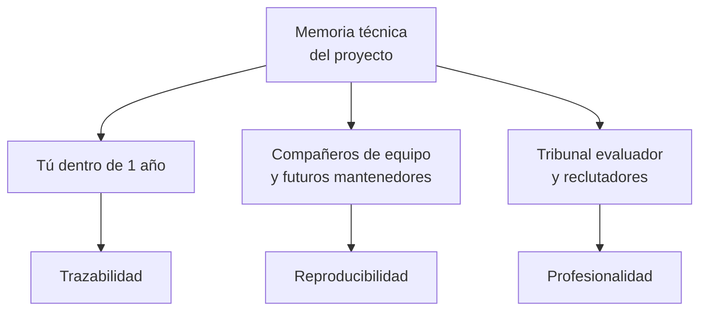
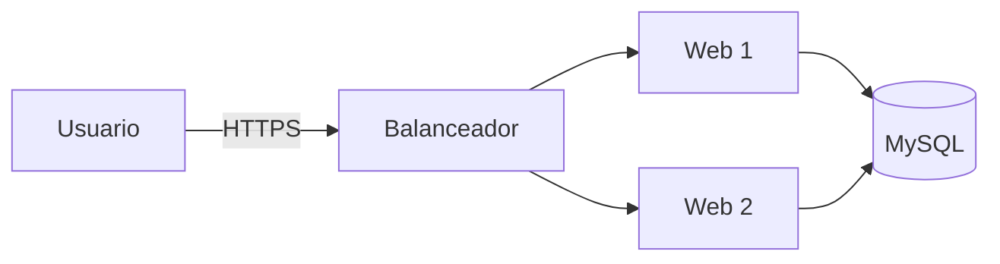
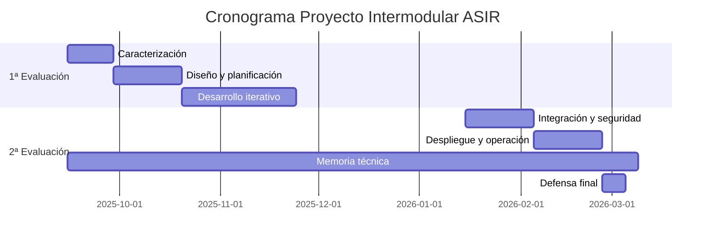
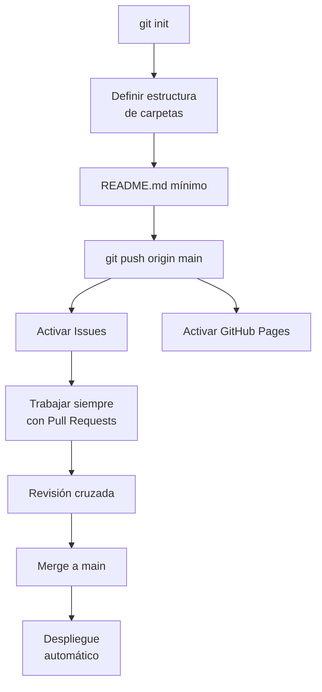
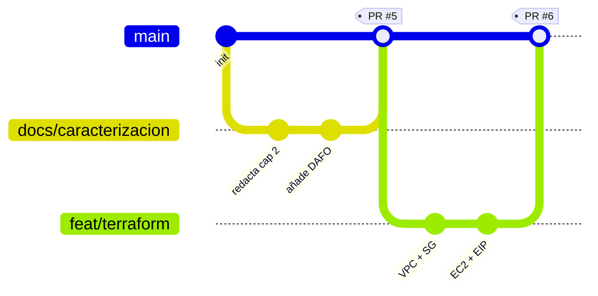
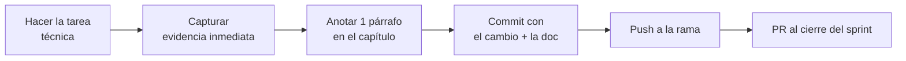

# 7. Documentación técnica y memoria

> En esta unidad transformarás tu proyecto en un **producto documentado, trazable y publicable**. La memoria técnica no es un apéndice opcional: es el **entregable principal de evaluación** y la **carta de presentación profesional** de tu trabajo.
>
> Aprenderás a estructurar una **memoria técnica** completa, mantenerla **viva** durante todo el proyecto y publicarla automáticamente como **sitio web** mediante **MkDocs Material**, **Git** y **GitHub Pages**.
>
> El enfoque es idéntico al de tus referentes reales:
>
> - [Proyecto Intermodular Docker (Ismael, Javier, Jorge)](https://elimpermeable.github.io/Proyecto_Intermodular2ASIR_IJJ/)
> - [Proyecto Intermodular AWS (Alejandro Mariño)](https://alejandromarinyo.github.io/Proyecto-Intermodular/)

Esta unidad de trabajo corresponde principalmente al **Resultado de Aprendizaje RA4** y, de forma transversal, a **RA5**.

!!! tip "Idea clave del tema"
    Una memoria profesional **se construye desde el día 1** del proyecto, no en la última semana. Si has documentado bien los temas 1 a 6, el Tema 7 consiste en **integrar, pulir y publicar**, no en escribir desde cero.

---

## Resultado de aprendizaje

Al finalizar esta unidad, serás capaz de:

- **RA4:** **Documentar, versionar y desplegar** la memoria técnica del proyecto en un repositorio Git público con publicación automática en GitHub Pages mediante MkDocs Material.
- **RA5 (transversal):** **Comunicar** con claridad técnica el proyecto, integrando evidencias, diagramas y trazabilidad de decisiones.

---

## 1. Documentación técnica: por qué y para quién

La documentación profesional de un proyecto TIC tiene **tres audiencias** que debes tener en cuenta a la vez:



| Audiencia | Qué espera | Riesgo si falla |
|-----------|------------|-----------------|
| **Tú mismo en 1 año** | Poder reconstruir el porqué de cada decisión | Olvidar cómo se hizo y perder reusabilidad |
| **Otro alumno / técnico** | Reproducir el despliegue sin preguntarte | Bloqueo total ante cualquier problema |
| **Profesorado / empresa** | Evaluar calidad técnica y comunicativa | Trabajo correcto que **parece** incompleto |

!!! quote "Principio de la documentación profesional"
    "El código documenta el **qué**. La memoria documenta el **por qué**, el **cómo** y el **para quién**."

---

## 2. Estructura recomendada de la memoria técnica

A continuación se propone una estructura **completa y reutilizable**, inspirada en las memorias reales de los proyectos del alumnado de referencia. Está pensada para encajar 1 a 1 con los temas del módulo y con los RA evaluados.

### 2.1. Árbol de carpetas del repositorio

```text
mi-proyecto-intermodular/
├── README.md                       # portada del repositorio
├── LICENSE
├── .gitignore
├── mkdocs.yml                      # configuración del sitio
├── docs/
│   ├── index.md                    # portada de la memoria
│   ├── 01_caracterizacion.md       # Tema 2
│   ├── 02_diseno_planificacion.md  # Tema 3
│   ├── 03_desarrollo.md            # Tema 4
│   ├── 04_integracion_seguridad.md # Tema 5
│   ├── 05_despliegue_operacion.md  # Tema 6
│   ├── 06_documentacion.md         # este propio Tema 7
│   ├── 07_pruebas_evidencias.md
│   ├── 08_conclusiones.md
│   ├── anexos/
│   │   ├── manual_usuario.md
│   │   ├── manual_administrador.md
│   │   ├── incidencias.md
│   │   └── glosario.md
│   ├── diagramas/
│   │   ├── arquitectura.drawio
│   │   └── red.drawio
│   ├── capturas/
│   │   ├── 04_desarrollo/
│   │   ├── 05_integracion/
│   │   └── 06_despliegue/
│   └── stylesheets/
│       └── extra.css
├── code/                           # código del proyecto
│   ├── docker/
│   ├── terraform/
│   └── ansible/
└── .github/
    └── workflows/
        └── deploy.yml              # publicación automática
```

!!! note "Una buena memoria refleja una buena estructura de repositorio"
    Si tu repositorio está organizado, tu memoria saldrá organizada. Si tu repositorio es un caos, ningún sitio bonito lo salvará.

### 2.2. Capítulos obligatorios de la memoria

| Cap. | Título | Contenido mínimo |
|-----:|--------|------------------|
| 1 | **Portada e índice** | Título, autores, módulo, curso, IES, fecha, URL del sitio, URL del repositorio |
| 2 | **Resumen ejecutivo** | 1 página: contexto, problema, solución, resultados, tecnologías |
| 3 | **Caracterización del reto** | Empresa simulada, contexto, problemática, objetivos, interesados, alcance |
| 4 | **Análisis y requisitos** | RF, RNF, RN, DAFO, matriz de trazabilidad por módulos |
| 5 | **Diseño y planificación** | Arquitectura, modelo de datos, EDT/WBS, cronograma, riesgos |
| 6 | **Desarrollo iterativo** | Sprints, decisiones técnicas, pruebas, dificultades y soluciones |
| 7 | **Integración y seguridad** | Endpoints, hardening, copias, validación E2E |
| 8 | **Despliegue y operación** | IaC (Terraform), CM (Ansible), monitorización, manual de operación |
| 9 | **Pruebas y evidencias** | Casos de prueba, capturas, comandos, logs significativos |
| 10 | **Conclusiones** | Objetivos alcanzados, mejoras futuras, lecciones aprendidas |
| 11 | **Anexos** | Manual de usuario, de administrador, incidencias, glosario, bibliografía |

---

## 3. MkDocs Material como soporte de la memoria

MkDocs Material convierte una carpeta de archivos Markdown en un sitio web profesional con búsqueda, navegación, *dark mode* y soporte de diagramas. Es **el estándar de facto** en proyectos técnicos abiertos.

### 3.1. Instalación rápida

```bash
python3 -m venv .venv && source .venv/bin/activate
pip install mkdocs-material
mkdocs new .
mkdocs serve              # http://127.0.0.1:8000
```

### 3.2. `mkdocs.yml` de referencia para tu memoria

```yaml
site_name: Proyecto Intermodular ASIR - Mi Empresa
site_description: Memoria técnica del proyecto intermodular del CFGS ASIR
site_url: https://mi-usuario.github.io/mi-proyecto/
site_author: Equipo ASIR 2025-2026
repo_url: https://github.com/mi-usuario/mi-proyecto
repo_name: mi-usuario/mi-proyecto
edit_uri: edit/main/docs/

nav:
  - Inicio: index.md
  - 1. Caracterización: 01_caracterizacion.md
  - 2. Diseño y planificación: 02_diseno_planificacion.md
  - 3. Desarrollo: 03_desarrollo.md
  - 4. Integración y seguridad: 04_integracion_seguridad.md
  - 5. Despliegue y operación: 05_despliegue_operacion.md
  - 6. Pruebas y evidencias: 07_pruebas_evidencias.md
  - 7. Conclusiones: 08_conclusiones.md
  - Anexos:
      - Manual de usuario: anexos/manual_usuario.md
      - Manual de administrador: anexos/manual_administrador.md
      - Incidencias: anexos/incidencias.md
      - Glosario: anexos/glosario.md

theme:
  name: material
  language: es
  features:
    - navigation.tabs
    - navigation.sections
    - navigation.expand
    - navigation.top
    - toc.follow
    - content.code.copy
    - content.code.annotate
    - search.suggest
    - search.highlight
  palette:
    - media: "(prefers-color-scheme: light)"
      scheme: default
      primary: indigo
      accent: indigo
      toggle:
        icon: material/weather-night
        name: Cambiar a modo oscuro
    - media: "(prefers-color-scheme: dark)"
      scheme: slate
      primary: indigo
      accent: indigo
      toggle:
        icon: material/weather-sunny
        name: Cambiar a modo claro

markdown_extensions:
  - admonition
  - attr_list
  - footnotes
  - md_in_html
  - tables
  - toc:
      permalink: true
      toc_depth: 4
  - pymdownx.details
  - pymdownx.highlight:
      linenums: true
  - pymdownx.inlinehilite
  - pymdownx.superfences:
      custom_fences:
        - name: mermaid
          class: mermaid
          format: !!python/name:pymdownx.superfences.fence_code_format
  - pymdownx.tabbed:
      alternate_style: true
  - pymdownx.tasklist:
      custom_checkbox: true
  - pymdownx.emoji:
      emoji_index: !!python/name:material.extensions.emoji.twemoji
      emoji_generator: !!python/name:material.extensions.emoji.to_svg

plugins:
  - search:
      lang: es
  - tags

extra:
  social:
    - icon: fontawesome/brands/github
      link: https://github.com/mi-usuario/mi-proyecto
    - icon: fontawesome/solid/envelope
      link: mailto:equipo@asir.example
```

### 3.3. Elementos visuales de Material que **debes** dominar

| Elemento | Sintaxis breve | Uso en memoria |
|----------|----------------|----------------|
| Admonitions | `!!! tip "Título"` | Destacar consejos, avisos, advertencias |
| Detalles plegables | `??? note "Click para abrir"` | Comandos largos, logs, salidas extensas |
| Bloques tabulados | `=== "Docker"` | Mostrar dos rutas alternativas (Docker / AWS) |
| Listas de tareas | `- [x]` | Checklists de aceptación |
| Tablas | Markdown estándar | Comparativas, matrices, índices |
| Mermaid | ```` ```mermaid ```` | Diagramas de flujo, secuencia, Gantt |
| Anotaciones de código | `# (1)` + nota | Explicar líneas concretas de un bloque |
| Iconos | `:material-rocket:` | Reforzar visualmente |
| Resaltado de líneas | `linenums="1" hl_lines="3 5"` | Marcar líneas clave de un código |

#### Ejemplos prácticos

!!! info "Bloque admonition `info`"
    Sirve para aportar **contexto adicional** sin interrumpir el flujo principal del texto.

!!! warning "Bloque admonition `warning`"
    Avisa de **errores comunes** o **acciones destructivas** (`terraform destroy`, `rm -rf`).

!!! success "Bloque admonition `success`"
    Documenta el **resultado correcto esperado**, útil tras un comando.

!!! danger "Bloque admonition `danger`"
    Acciones que pueden **comprometer la seguridad** o **borrar datos en producción**.

??? example "Salida de `terraform plan` (click para ver)"

    ```text
    Terraform will perform the following actions:

      # aws_instance.web will be created
      + resource "aws_instance" "web" {
          + ami           = "ami-0a0e..."
          + instance_type = "t3.micro"
          ...
        }

    Plan: 5 to add, 0 to change, 0 to destroy.
    ```

=== "Despliegue Docker"

    ```bash
    cd code/docker
    docker compose up -d
    ```

=== "Despliegue AWS"

    ```bash
    cd code/terraform
    terraform apply -auto-approve
    ansible-playbook -i inventory_aws_ec2.yml site.yml --ask-vault-pass
    ```

---

## 4. Markdown profesional para memorias técnicas

### 4.1. Encabezados y jerarquía

Mantén una jerarquía estricta de encabezados (no salta niveles):

```markdown
# 1. Título de capítulo
## 1.1. Sección
### 1.1.1. Subsección
#### 1.1.1.1. Apartado (raro, evítalo)
```

### 4.2. Código tipado correctamente

````markdown
```bash
sudo apt update && sudo apt upgrade -y
```

```yaml
services:
  web:
    image: nginx:alpine
```

```hcl
resource "aws_instance" "web" { ... }
```

```sql
SELECT id, nombre FROM usuarios WHERE activo = 1;
```
````

!!! warning "Errores frecuentes"
    - Bloques de código **sin lenguaje** (`` ``` ``) → pierde resaltado.
    - Indentar el bloque dentro de una lista **sin línea en blanco** previa → se rompe.
    - Pegar consolas con **prompt `$`** delante (ejemplo: `$ apt update`) → quien copie-pegue copiará también el `$`.

### 4.3. Imágenes y capturas

```markdown
{ width="80%" }
```

Buenas prácticas:

- Carpeta dedicada por capítulo: `docs/capturas/04_desarrollo/`.
- Nombres descriptivos en `snake_case`: `terraform_plan_inicial.png`, **no** `Captura1.png`.
- Tamaño razonable: < 500 KB; usar PNG para diagramas, JPG para fotos.
- Texto alternativo descriptivo: ayuda a accesibilidad y SEO.

### 4.4. Diagramas con Mermaid

Mermaid permite escribir diagramas como texto, versionables en Git.

````markdown

````

Renderizado:


**Tipos de diagrama útiles para tu memoria:**

| Tipo Mermaid | Cuándo usarlo |
|--------------|---------------|
| `flowchart` | Arquitectura, flujos de proceso |
| `sequenceDiagram` | Interacción usuario / sistemas (login, despliegue) |
| `erDiagram` | Modelo de datos |
| `gantt` | Cronograma del proyecto |
| `classDiagram` | Modelos de dominio |
| `stateDiagram-v2` | Estados de un recurso (instancia EC2, pedido...) |

Ejemplo de **Gantt** para la planificación del proyecto:



### 4.5. Tablas comparativas

Las tablas son uno de los recursos más infrautilizados. Úsalas para **decisiones de diseño**:

```markdown
| Opción | Pros | Contras | Decisión |
|--------|------|---------|----------|
| MySQL gestionado (RDS) | Backups y HA gestionados | Coste mayor | ❌ Fuera de presupuesto |
| MySQL en EC2 | Control total | Mantenimiento manual | ✅ Elegida |
| MariaDB en contenedor | Reproducible y portable | Sin HA nativo | ⏭️ Mejora futura |
```

---

## 5. Git y GitHub como soporte documental

### 5.1. Repositorio bien organizado



### 5.2. Convenciones de *commits* (Conventional Commits)

| Prefijo | Cuándo | Ejemplo |
|---------|--------|---------|
| `feat:` | Nueva funcionalidad / sección | `feat(docs): añadir capítulo despliegue` |
| `fix:` | Corrección de error | `fix(ansible): corregir handler reinicio nginx` |
| `docs:` | Solo documentación | `docs(memoria): completar conclusiones` |
| `chore:` | Tareas de mantenimiento | `chore: actualizar mkdocs-material` |
| `refactor:` | Reorganización sin cambio funcional | `refactor(terraform): extraer módulo de red` |
| `style:` | Formato / estilo | `style(md): aplicar prettier` |
| `test:` | Pruebas | `test(ansible): añadir validación idempotencia` |

```bash
git commit -m "docs(memoria): añadir sección de despliegue con Ansible"
```

### 5.3. Ramas y Pull Requests



Flujo recomendado para el equipo:

1. Cada miembro abre una rama por capítulo o por funcionalidad (`docs/desarrollo`, `feat/ansible-backups`).
2. Realiza commits pequeños y descriptivos.
3. Abre un Pull Request describiendo qué incluye y a qué RA contribuye.
4. Otro integrante revisa, comenta y aprueba.
5. Se hace *merge* (o *squash*) a `main`. GitHub Pages se redespliega solo.

### 5.4. Issues y proyecto

- **Issues:** un *issue* por tarea (`Documentar arquitectura`, `Probar restore MySQL`).
- **Labels:** `docs`, `infra`, `security`, `bug`, `enhancement`.
- **Milestones:** vinculados a hitos del cronograma.
- **Project board:** vista Kanban (Backlog / En curso / Revisión / Hecho).
- **Cerrar issues desde commit:** `git commit -m "feat: backup mysql (closes #14)"`.

---

## 6. Publicación automática en GitHub Pages

### 6.1. Opción 1: Comando `mkdocs gh-deploy`

```bash
mkdocs gh-deploy --force
```

Publica el sitio en la rama `gh-pages`. Sencillo pero **manual**.

### 6.2. Opción 2 (recomendada): GitHub Actions

Crea `.github/workflows/deploy.yml`:

```yaml
name: Publicar memoria en GitHub Pages

on:
  push:
    branches: [main]
  workflow_dispatch:

permissions:
  contents: read
  pages: write
  id-token: write

jobs:
  build:
    runs-on: ubuntu-latest
    steps:
      - uses: actions/checkout@v4
      - uses: actions/setup-python@v5
        with:
          python-version: "3.11"
      - run: pip install mkdocs-material
      - run: mkdocs build --strict --site-dir _site
      - uses: actions/upload-pages-artifact@v3
        with:
          path: _site

  deploy:
    needs: build
    runs-on: ubuntu-latest
    environment:
      name: github-pages
      url: ${{ steps.deployment.outputs.page_url }}
    steps:
      - id: deployment
        uses: actions/deploy-pages@v4
```

**Configuración en GitHub:**

1. `Settings` → `Pages` → *Source*: **GitHub Actions**.
2. Cada `git push` a `main` ejecuta el workflow.
3. Tu memoria queda publicada en `https://<usuario>.github.io/<repo>/`.

### 6.3. Verificación del despliegue

- Pestaña **Actions** del repositorio: revisa que la build sea verde.
- URL publicada en `Settings → Pages`.
- Comprobar **enlaces internos** con `mkdocs build --strict` (falla si hay enlaces rotos).

!!! tip "Despliega antes de redactar mucho"
    Activa GitHub Pages **el primer día** del proyecto. Así corriges problemas de configuración cuando aún no tienes 80 páginas escritas.

---

## 7. Plantillas reutilizables

### 7.1. `README.md` profesional del repositorio

````markdown
# Proyecto Intermodular ASIR — [Nombre del reto]

[](https://USUARIO.github.io/REPO/)
[]()
[]()

> Memoria técnica y código del Proyecto Intermodular del CFGS ASIR, curso 2025-26, IES Macià Abela (Crevillent).

## Equipo

- Alumno/a 1 — [@usuario1](https://github.com/usuario1)
- Alumno/a 2 — [@usuario2](https://github.com/usuario2)
- Alumno/a 3 — [@usuario3](https://github.com/usuario3)

## Descripción rápida

Despliegue automatizado de [tipo de solución] para la empresa simulada [nombre], que aporta [valor]. La solución incluye [tecnologías principales: WordPress, Laravel, MySQL, AWS, Docker, Terraform, Ansible…].

## Arquitectura


## Tecnologías

- **Infraestructura:** AWS / Docker
- **IaC:** Terraform
- **Configuración:** Ansible
- **Aplicación:** WordPress, Laravel, MySQL
- **Documentación:** MkDocs Material + GitHub Pages
- **CI/CD:** GitHub Actions

## Cómo levantar el entorno

```bash
git clone https://github.com/USUARIO/REPO.git
cd REPO/code/terraform
terraform init && terraform apply -auto-approve

cd ../ansible
ansible-playbook -i inventory_aws_ec2.yml site.yml --ask-vault-pass
```

## Memoria completa

📘 **[Leer la memoria online](https://USUARIO.github.io/REPO/)**

## Estructura del repositorio

| Carpeta | Contenido |
|---------|-----------|
| `docs/` | Memoria técnica (Markdown + MkDocs) |
| `code/terraform/` | Infraestructura como código |
| `code/ansible/` | Playbooks y roles de configuración |
| `code/docker/` | Stack Docker Compose |
| `.github/workflows/` | Pipelines de despliegue |

## Licencia

CC BY-NC-SA 4.0
````

### 7.2. Plantilla de capítulo de memoria

````markdown
---
title: Capítulo X — Título
description: Resumen del capítulo en 1-2 frases para SEO y previsualización.
---

# X. Título del capítulo

> Resumen ejecutivo del capítulo (3-5 líneas) explicando objetivo, alcance y resultado esperado.

## X.1. Contexto y objetivos

(Por qué este capítulo, qué resuelve, a qué RA contribuye).

## X.2. Decisiones de diseño

| Decisión | Alternativas | Elección | Justificación |
|----------|-------------|----------|---------------|
| ...      | ...         | ...      | ...           |

## X.3. Procedimiento

1. Paso 1
2. Paso 2
3. Paso 3

```bash
# Comando relevante
```

## X.4. Evidencias


## X.5. Verificación

- [ ] Comprobación 1
- [ ] Comprobación 2

## X.6. Problemas encontrados y soluciones

| Problema | Causa | Solución |
|----------|-------|----------|
| ...      | ...   | ...      |

## X.7. Conclusiones del capítulo

(Cierre breve y enlace al siguiente capítulo).
````

### 7.3. Plantilla de manual de usuario

```markdown
# Manual de usuario — [Nombre del sistema]

## 1. Acceso al sistema

- URL: https://miapp.example
- Usuario de prueba: `demo@asir.local` / `Demo1234!`

## 2. Funcionalidades principales

### 2.1. [Funcionalidad A]

**Cómo se usa:**

1. Pulsar en el menú "..."
2. Rellenar los campos...
3. Confirmar.


## 3. Preguntas frecuentes

**¿No puedo iniciar sesión?** Revisa caps lock y, si persiste, contacta al administrador.

## 4. Contacto

soporte@miempresa.example
```

### 7.4. Plantilla de manual de administrador

````markdown
# Manual de administrador

## 1. Despliegue desde cero

(Pasos completos: clonar repo, requisitos, comandos de terraform/ansible).

## 2. Operación diaria

- Comprobar estado: `ansible all -m ping -i inventario`
- Revisar backups: `ls -lh /var/backups/proyecto`
- Logs: `journalctl -u nginx -f`

## 3. Procedimiento de restore

```bash
gunzip -c /var/backups/proyecto/20260101_wp.sql.gz | mysql -u root -p wordpress
```

## 4. Escalado y mantenimiento

- Ampliar disco EBS: ...
- Añadir un nuevo nodo: ...

## 5. Plan de continuidad

(Qué hacer si cae la web, si se pierde el host, si se compromete una cuenta…)
````

### 7.5. Plantilla de registro de incidencias

```markdown
# Registro de incidencias del proyecto

| Fecha | Tipo | Descripción | Causa | Solución | Tiempo (min) | Quién |
|-------|------|-------------|-------|----------|--------------|-------|
| 2026-02-12 | Bug | `terraform apply` falla por límite EIP | Cuenta Educate tiene 5 EIP max | Liberar EIPs antiguas | 25 | Equipo |
| 2026-02-15 | Seguridad | SG 3306 abierto al mundo | Error en `cidr_blocks` | Restringir a `sg-web` | 10 | Alumno 2 |
```

---

## 8. Documentación viva: mantenerla durante todo el proyecto

Una memoria que se redacta la última semana tiene **dos problemas**:

1. **Pérdida de contexto:** ya no recuerdas por qué tomaste aquella decisión.
2. **Calidad baja:** poco tiempo para revisar, pulir, añadir capturas.

**Solución:** integrar la documentación en el flujo diario.



### 8.1. Rituales del equipo

| Ritual | Cuándo | Qué se documenta |
|--------|--------|------------------|
| **Diario** | Cada sesión | 3 líneas: qué hicimos, qué bloquea, próximo paso |
| **Pre-commit** | Antes de `git commit` | ¿He actualizado la sección correspondiente de la memoria? |
| **Cierre de sprint** | Semanal o quincenal | Demo + actualizar capítulo principal + archivar capturas |
| **Retro** | Al cerrar tema | Lecciones aprendidas → capítulo `Incidencias` y `Conclusiones` |

### 8.2. Diario de aprendizaje (RA5)

Archivo `docs/anexos/diario.md`:

```markdown
# Diario de aprendizaje

## 2026-02-10 (Sprint 5)

**Objetivo de hoy:** Levantar EC2 con Terraform.

**Hecho:**
- Creada VPC + subred pública.
- Falla `aws_instance` por AMI inexistente en la región.

**Aprendido:**
- Las AMIs son por región. Hay que usar `data "aws_ami"` con filtros para no hardcodear IDs.

**Próximo paso:** sustituir AMI fija por *data source*.
```

---

## 9. Buenas prácticas de documentación profesional

!!! success "Decálogo del buen documentador"
    1. **Escribe para alguien que no estuvo contigo.** No des por hecho contexto.
    2. **Un párrafo, una idea.** Si un párrafo dura 8 líneas, divídelo.
    3. **Comandos completos y copiables.** Sin `<TU_USUARIO>` sin explicación.
    4. **Capturas con foco.** Recorta lo que no aporta, marca con flechas o cajas.
    5. **Tablas para decisiones.** El texto plano es peor para comparar.
    6. **Diagramas en código.** Mermaid > PNG cuando sea posible (versionable).
    7. **Enlaces internos vivos.** Usa el nombre del fichero, no URLs absolutas.
    8. **Ortografía y consistencia.** Mismo término siempre (no mezcles "BBDD", "DB", "base de datos").
    9. **Cite fuentes.** Documentación oficial, blogs, manuales del aula.
    10. **Revisión cruzada.** Otro miembro lee tu capítulo antes del PR.

### 9.1. Anti-patrones a evitar

| Anti-patrón | Por qué es malo | Mejor |
|-------------|-----------------|-------|
| "Aquí van capturas" sin capturas | Marcador olvidado | Inserta una vacía o `TODO` con fecha límite |
| Bloques de código sin contexto | El lector no sabe qué archivo es | Indica nombre de fichero y carpeta |
| Decisiones sin justificar | Parece arbitrario | Plantilla de tabla "Opción / Pros / Contras / Decisión" |
| Capturas con datos sensibles | Riesgo de fuga | Censura tokens, contraseñas e IPs públicas |
| Memoria como "tutorial" del aula | Aporta poco valor profesional | Foco en **vuestras** decisiones, no en repetir guías |
| `print screen` borroso | Resta credibilidad | Recortes nítidos, PNG, contraste correcto |

---

## 10. Trazabilidad: del requisito a la evidencia

Una memoria profesional permite trazar **un requisito** hasta su **evidencia** pasando por **diseño, desarrollo y prueba**.

| ID req. | Texto | Cap. diseño | Cap. desarrollo | Cap. integración | Evidencia |
|---------|-------|-------------|-----------------|------------------|-----------|
| RF-001 | El usuario puede registrarse | §5.2 | §6.3 | §7.1 | `capturas/07/registro.png` |
| RF-014 | Los datos persisten tras reinicio | §5.3 | §6.5 | §7.4 | `capturas/07/persistencia.png` |
| RNF-002 | Backup diario automático | §5.4 | §6.8 | §8.2 | `capturas/08/backup_cron.png` |
| RS-003 | MySQL no expuesto al exterior | §5.5 | §6.7 | §7.5 | `capturas/07/nmap_3306.png` |

Esta matriz **demuestra** ante el tribunal que cada requisito tiene cierre completo.

---

## 11. Retos guiados

### 11.1. RG701 — Memoria técnica publicada

**Objetivo:** publicar la **memoria completa** del proyecto como sitio web en GitHub Pages, con la estructura del apartado 2 y todos los capítulos al menos en borrador funcional.

**Pasos:**

1. Crear el repositorio en GitHub (público, con `README.md`, `LICENSE`, `.gitignore` para Python).
2. Inicializar MkDocs Material con el `mkdocs.yml` propuesto en §3.2.
3. Configurar GitHub Pages con GitHub Actions (`.github/workflows/deploy.yml`).
4. Estructurar las carpetas `docs/`, `docs/anexos/`, `docs/capturas/`, `docs/diagramas/`.
5. Rellenar el contenido de **al menos los capítulos 1, 2 y 3** con material real del proyecto.
6. Incluir **un diagrama Mermaid** y **una tabla comparativa** en cada capítulo donde aporte.
7. Subir al menos **5 capturas reales** del proyecto.
8. Verificar que `mkdocs build --strict` no produce errores.
9. Verificar que el sitio se publica automáticamente en cada push a `main`.

**Criterios de aceptación:**

- [ ] URL pública accesible y navegable.
- [ ] Búsqueda funcional.
- [ ] Al menos 3 capítulos completos.
- [ ] *Dark mode* operativo.
- [ ] Repositorio con al menos 10 commits significativos repartidos entre el equipo.
- [ ] `README.md` profesional siguiendo la plantilla.

### 11.2. RG702 — Manuales y trazabilidad

**Objetivo:** generar los **manuales de usuario y administrador** y la **matriz de trazabilidad** completa del proyecto.

**Pasos:**

1. Redactar `docs/anexos/manual_usuario.md` siguiendo la plantilla §7.3.
2. Redactar `docs/anexos/manual_administrador.md` siguiendo la plantilla §7.4.
3. Crear la matriz de trazabilidad (§10) con **todos** los requisitos del proyecto.
4. Capturar evidencias específicas para cada requisito crítico.
5. Documentar **incidencias reales** (§7.5) ocurridas durante el desarrollo.
6. Añadir enlaces cruzados entre capítulos para facilitar la navegación.

**Criterios de aceptación:**

- [ ] Manual de usuario probado por una persona ajena al equipo.
- [ ] Manual de administrador suficiente para reproducir el despliegue.
- [ ] Matriz de trazabilidad cubre el 100% de los RF y RNF.
- [ ] Mínimo 5 incidencias documentadas con causa y solución.

---

## 12. Retos abiertos (profundización)

| Código | Reto | Pista |
|--------|------|-------|
| **AP701** | Personalizar el tema con CSS propio (`stylesheets/extra.css`) y favicon corporativo. | Configurar `extra_css` y `theme.favicon`. |
| **AP702** | Plugin `mkdocs-print-site-plugin` para generar un PDF de la memoria. | Útil para el tribunal. |
| **AP703** | Internacionalizar la memoria (ES + EN) con `i18n`. | Solo si os sobra tiempo. |
| **AP704** | Añadir versión multilenguaje en *navigation tabs*. | `plugins: - i18n`. |
| **AP705** | Generar diagramas automáticos con `terraform graph | dot -Tsvg`. | Incrustar SVG en la memoria. |
| **AP706** | Crear plantillas de issues y PR (`.github/ISSUE_TEMPLATE/`). | Mejora la calidad del repositorio. |

---

## 13. Actividades y entregables

<a name="RG701"></a>

* :material-trophy: **RG701**. (RA4 // 20p). **Memoria técnica publicada** en GitHub Pages mediante MkDocs Material, con estructura completa, despliegue automatizado mediante GitHub Actions y mínimo 3 capítulos finalizados.

<a name="RG702"></a>

* :material-trophy: **RG702**. (RA4+RA5 // 10p). **Manuales y trazabilidad**: manual de usuario, manual de administrador, matriz de trazabilidad y registro de incidencias.

**Entregables del Tema 7:**

1. URL pública del sitio MkDocs (GitHub Pages).
2. URL del repositorio GitHub con `code/` y `docs/`.
3. Capturas del workflow Actions en verde.
4. Matriz de trazabilidad completa.
5. Registro de incidencias actualizado.

---

## 14. Checklist final de memoria

### 14.1. Estructura

- [ ] Repositorio público con `README.md`, `LICENSE`, `.gitignore`.
- [ ] `mkdocs.yml` con `site_name`, `repo_url`, `nav`, `theme.material`.
- [ ] Despliegue automático configurado.
- [ ] Carpetas `docs/`, `docs/anexos/`, `docs/capturas/`, `docs/diagramas/`.
- [ ] Plantillas de capítulo usadas consistentemente.

### 14.2. Contenido

- [ ] Capítulos 1-10 con contenido real.
- [ ] Resumen ejecutivo (página 1) escrito.
- [ ] Al menos 1 diagrama Mermaid por capítulo técnico.
- [ ] Al menos 1 tabla comparativa por capítulo donde aplique.
- [ ] Capturas pertinentes en cada paso.
- [ ] Manuales de usuario y administrador completos.
- [ ] Matriz de trazabilidad rellena.
- [ ] Registro de incidencias con al menos 5 entradas.
- [ ] Glosario y bibliografía.

### 14.3. Calidad

- [ ] `mkdocs build --strict` sin errores.
- [ ] Sin enlaces rotos (validado con `mkdocs-htmlproofer-plugin` o manual).
- [ ] Sin imágenes rotas.
- [ ] Sin contraseñas / tokens en capturas o código.
- [ ] Ortografía revisada (corrector + revisión cruzada).
- [ ] Mismo tono y terminología en todo el documento.
- [ ] Licencia indicada en pie de página.

### 14.4. Profesionalidad

- [ ] *Dark mode* y búsqueda funcionando.
- [ ] Pie de página con autoría y fecha.
- [ ] Botón "Edit this page" funcional.
- [ ] Iconos sociales del equipo configurados.
- [ ] Tiempo de carga razonable (< 3s).
- [ ] Funciona en móvil (responsive).

---

## 15. Estructura de la sección "Documentación" en tu memoria

La propia memoria debe **autodescribirse**, dedicando un capítulo a explicar cómo está hecha:

1. **Stack documental:** MkDocs Material, GitHub, GitHub Pages, plugins usados.
2. **Estructura del repositorio:** árbol comentado.
3. **Flujo de trabajo del equipo:** ramas, PR, revisiones, commits.
4. **Publicación automática:** workflow Actions explicado.
5. **Plantillas usadas:** referencia a §7.
6. **Métricas:** nº de capítulos, capturas, diagramas, commits, PR.

---

## 16. Recursos y referencias

### Documentación oficial

- [MkDocs](https://www.mkdocs.org/)
- [Material for MkDocs](https://squidfunk.github.io/mkdocs-material/)
- [Markdown Guide](https://www.markdownguide.org/)
- [Mermaid — Diagramas en texto](https://mermaid.js.org/)
- [GitHub Pages](https://pages.github.com/)
- [GitHub Actions](https://docs.github.com/actions)
- [Conventional Commits](https://www.conventionalcommits.org/)

### Memorias reales del alumnado ASIR (referencias)

- :material-book-open-page-variant: [Proyecto Intermodular Docker (IJJ)](https://elimpermeable.github.io/Proyecto_Intermodular2ASIR_IJJ/) — [Repositorio](https://github.com/elimpermeable/Proyecto_Intermodular2ASIR_IJJ).
- :material-book-open-page-variant: [Proyecto Intermodular AWS (Alejandro Mariño)](https://alejandromarinyo.github.io/Proyecto-Intermodular/) — [Repositorio](https://github.com/AlejandroMarinyo/Proyecto-Intermodular).

### Material del módulo

- [MkDocs — Apuntes del módulo](mkdocs.md)
- [Git — Sistemas de control de versiones](git.md)
- [Tema 6 — Despliegue y operación](06despliegue_operacion.md)

---

## Glosario de términos y acrónimos

- **MkDocs:** generador de sitios estáticos basado en Markdown
- **Material for MkDocs:** tema visual + funcionalidades para MkDocs
- **GitHub Pages:** servicio gratuito de hosting estático sobre repositorios GitHub
- **Markdown:** lenguaje de marcado ligero
- **Mermaid:** sintaxis textual para generar diagramas
- **Admonition:** bloque destacado tipo nota/aviso/tip
- **Conventional Commits:** convención para nombrar commits
- **Pull Request (PR):** solicitud de fusión entre ramas con revisión
- **Issue:** ticket de seguimiento dentro de un repositorio
- **Workflow (Actions):** automatización de pipelines en GitHub
- **Trazabilidad:** capacidad de seguir un requisito a través de diseño, desarrollo, prueba y evidencia
- **RA4 / RA5:** Resultados de Aprendizaje 4 (Documentación) y 5 (Comunicación)

---

## Conclusión y siguientes pasos

Al cerrar este tema deberías tener **un sitio web profesional** que contiene tu proyecto en su totalidad: planificación, código, decisiones, evidencias y manuales. Esa URL será **el producto principal que defenderás** en el Tema 8.

En el [Tema 8](08presentacion_defensa.md) prepararás la **defensa técnica**, las **rúbricas** y los **instrumentos de evaluación** que cerrarán el módulo.
