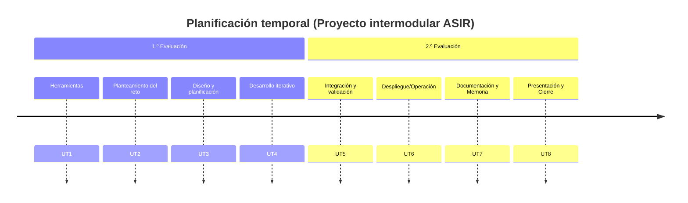

# Proyecto intermodular

En esta página encontrarás la organización docente del **módulo de _Proyecto intermodular_** del CFGS de *Administración de Sistemas Informáticos en Red* (**ASIR**), conforme al marco normativo vigente: [Ley Orgánica 3/2022](https://www.boe.es/buscar/act.php?id=BOE-A-2022-5139), [Real Decreto 659/2023](https://www.boe.es/buscar/doc.php?id=BOE-A-2023-16889), modificaciones de títulos por [RD 500/2024](https://www.boe.es/diario_boe/txt.php?id=BOE-A-2024-10685) y normativa autonómica ([Orden 8/2025](https://dogv.gva.es/es/resultat-dogv?signatura=2025/13083), [Resolución de 17/07/2025](https://dogv.gva.es/datos/2025/07/21/pdf/2025_28562_es.pdf)).  
Se imparte en el [IES Macià Abela](https://portal.edu.gva.es/iesmaciaabela/) de Crevillent.

> El *Proyecto intermodular* se concibe como una experiencia colaborativa entre los distintos módulos del ciclo, orientada a la resolución de proyectos reales, teniendo un **Carácter integrador y por retos.** .

## Competencias profesionales

Las ^^competencias^^ que se trabajan en este módulo son:

- Integrar aprendizajes y evidencias de varios **módulos profesionales** del ciclo mediante retos significativos y reales.
- **Planificar, ejecutar, verificar y documentar** proyectos TIC, aplicando criterios de calidad, seguridad y sostenibilidad (ODS).
- Trabajar de **forma colaborativa**, con reparto de roles, gestión de tareas y resolución de conflictos.
- **Comunicarse con claridad** (oral, escrita y técnica), empleando recursos visuales y soportes digitales.
- **Investigar e innovar**: búsqueda y análisis crítico de información, prototipado y mejora iterativa.
- **Emprendimiento y orientación laboral**: viabilidad, presupuesto y gestión básica del proyecto.

## Objetivos Generales

Los ^^objetivos generales^^ del Proyecto intermodular son:

- Diseñar retos contextualizados en el sector TIC, **cercanos y relevantes** para el alumnado.
- **Seleccionar y aplicar** estrategias, herramientas y tecnologías adecuadas a cada fase del proyecto.
- **Temporalizar** actividades, recursos y entregables, previendo riesgos e imprevistos.
- **Generar evidencias** válidas para evaluar RA y CE de los módulos implicados.
- **Presentar y defender** el proyecto ante audiencia técnica y no técnica, con soporte escrito y visual.

## Resultados de aprendizaje

| Código | Descripción                                                                 | Peso (%) |
|:------:|:-----------------------------------------------------------------------------|:--------:|
| RA1    | **Caracteriza el reto** y el contexto del sector, definiendo alcance y requisitos. | 15 |
| RA2    | **Planifica** actividades, recursos, riesgos y cronograma del proyecto.     | 25 |
| RA3    | **Desarrolla y valida** la solución (iteraciones, pruebas y criterios de aceptación). | 25 |
| RA4    | **Documenta, versiona y despliega** la solución y sus evidencias.           | 20 |
| RA5    | **Comunica y colabora** eficazmente (reuniones, pitch, defensa y retroalimentación). | 15 |

## Unidades de Trabajo

| Unidades de Trabajo (UT)                                  | RA1 | RA2 | RA3 | RA4 | RA5 |
|:----------------------------------------------------------|:---:|:---:|:---:|:---:|:---:|
| **1. Herramientas del proyecto**                          |     |     | X   | X   |     |
| **2. Planteamiento del reto y análisis del contexto**    | X   | X   |     |     | X   |
| **3. Diseño de la solución y planificación**              |     | X   |     |     | X   |
| **4. Desarrollo iterativo y pruebas**                     |     |     | X   | X   |     |
| **5. Integración, seguridad y validación**                |     |     | X   | X   |     |
| **6. Despliegue y operación**                             |     |     | X   | X   |     |
| **7. Documentación técnica y memoria**                      |     |     |     | X   | X   |
| **8. Presentación, defensa y cierre**                      |     |     |     |     | X   |
| **Total**   **Porcentaje**                             | X 15% | X 25% | X 25% | X 20% | X 15% |

## Metodología

El módulo se trabaja como una **simulación profesional sostenida**: cada grupo construye, a lo largo del curso, una infraestructura de TI real para una empresa inspirada en el tejido local de Crevillent. Los pilares ^^metodológicos^^ son:

- **Aprendizaje Basado en Proyectos y Retos** (ABP + ABR), con retos grupales secuenciados y rúbrica propia.
- **Integración intermodular** de los módulos del ciclo ASIR (ASGBD, ASO, IAW, SRI, SAD) en un mismo proyecto.
- **Infraestructuras reales** sobre tecnologías estándar de la industria: **Docker, AWS, Linux, Bind9, Ansible, Terraform, MySQL** y **Nginx**.
- **Trabajo colaborativo** en equipos cooperativos de 2-3 personas, con reparto de roles propios de un departamento de sistemas.
- **Documentación técnica continua** en **Markdown**, versionada en **GitHub** y publicada como sitio web con **MkDocs Material** + **GitHub Pages**.
- **Aules** (Moodle de la GVA) como plataforma de planificación, seguimiento, comunicación y entrega de evidencias.
- **Enfoque DevOps**: control de versiones, *Pull Requests*, integración continua, validación con pruebas e infraestructura como código.

[:material-book-open-page-variant: **Consultar la metodología completa**](Extra/metodologia_asir.md){ .md-button .md-button--primary }

## Evaluación

- **Instrumentos de Evaluación (IE):**

| Instrumento                                   | Icono                                    | Descripción                                                                 | Puntuación      |
|-----------------------------------------------|-------------------------------------------|-----------------------------------------------------------------------------|-----------------|
| Actividades de clase                          | :simple-readdotcv: AC                     | Micro-evidencias, checklists y pequeñas prácticas                           | 3 puntos        |
| Actividades de refuerzo                       | :material-head-question-outline: AR       | Consolidación de CE no alcanzados                                           | 3 puntos        |
| Actividades de profundización                 | :material-shovel: AP                      | Extensión/innovación                                                        | Puntos extra    |
| Prácticas / Trabajo de investigación          | :simple-neutralinojs: PR / :material-test-tube: TI | Sprint reviews, prototipos, pruebas                                         | Sobre 10        |
| Proyectos/Entregables parciales               | :material-calendar: PY                    | Hitos con rúbrica                                                           | Sobre 30        |
| Defensa/presentación final                    | :material-presentation: DF                | Pitch, demo y Q&A (rúbrica específica)                                       | sobre 30               |
| Memoria técnica y portfolio                   | :material-file-document: MT               | Documentación, repositorio y issues                                         |  sobre 60             |
<!-- | Pruebas objetivas                            | :material-pen: PO                         | Cuando proceda                                                              | Sobre 30        | -->

**Cálculo de calificaciones:**  
Media ponderada de los IE asignados a cada RA, comprobando que se cubren todos los CE declarados por los módulos participantes. Todas las calificaciones estarán disponibles en **Aules**.

> **Otros criterios:**

- Seguimiento y tutorización individual y colectiva (actas de reunión, diarios de aprendizaje).
- Originalidad y uso responsable de IA (declaración de uso, fuentes y licencias).
- No dualizable (articulación autonómica del Proyecto intermodular).

## Materiales

- Gestión del proyecto: Planner/Trello, cronograma
- Repositorio: GitHub, GitHub Pages
- Documentación: Markdown, MkDocs
- Infraestructura: LliureX/Ubuntu, Docker, AWS
<!-- - Comunicación: presentaciones, oratoria -->
<!-- - Recursos oficiales:
  - [Innovatec – FP (GVA)](https://ceice.gva.es/es/web/formacion-profesional/innovatec)
  - [LO 3/2022](https://www.boe.es/buscar/act.php?id=BOE-A-2022-5139)
  - [RD 659/2023](https://www.boe.es/buscar/doc.php?id=BOE-A-2023-16889)
  - [RD 500/2024](https://www.boe.es/diario_boe/txt.php?id=BOE-A-2024-10685)
  - [Orden 8/2025 (DOGV)](https://dogv.gva.es/es/resultat-dogv?signatura=2025/13083)
  - [Resolución 17/07/2025 (DOGV)](https://dogv.gva.es/datos/2025/07/21/pdf/2025_28562_es.pdf) -->

*[CFGS]: Ciclo Formativo de Grado Superior  
*[ASIR]: Administración de Sistemas Informáticos en Red  
*[PI]: Proyecto intermodular  
*[RA]: Resultado de aprendizaje  
*[UT]: Unidad de trabajo  
*[IE]: Instrumento de evaluación  
*[CE]: Criterio de evaluación
