# :material-network: CABLEADO ESTRUCTURADO

En esta unidad estudiaremos el **cableado estructurado**, que es el sistema de cableado de telecomunicaciones que proporciona una infraestructura de cableado completa, desde los adaptadores de red hasta los equipos de electrónica más avanzados. Nos enfocaremos en la funcionalidad, características técnicas y aplicaciones de cada componente, así como en su integración dentro del sistema de cableado estructurado.

El cableado estructurado es el conjunto de elementos físicos y lógicos que permiten establecer la conectividad, gestionar el tráfico de datos y proporcionar los servicios necesarios para el funcionamiento eficiente de la red. Dominar estos conceptos es esencial para diseñar, implementar y mantener redes locales robustas y escalables.

El cableado estructurado surge para unificar las infraestructuras de voz, datos y otros servicios (alarmas, control ambiental, CCTV…) bajo un mismo diseño. Fruto de los estándares ANSI/TIA/EIA-568 y 569, el planteamiento persigue:

- Flexibilidad: poder reformar o reorganizar espacios sin rehacer todo el cableado.
- Evolución tecnológica: sustituir equipos obsoletos sin afectar a la red completa.
- Centralización de servicios: alojar en una red común todos los subsistemas del edificio.

!!! info "<strong>Objetivos de la unidad</strong>"
    
    • Identificar y clasificar los diferentes componentes del cableado estructurado 
    • Comprender las funciones y características de cada componente 
    • Aplicar técnicas de instalación y configuración 
    • Diseñar sistemas de distribución eficientes 
    • Evaluar la idoneidad de cada elemento según el entorno
    

## 🔧 COMPONENTES DEL CABLEADO ESTRUCTURADO

El **cableado estructurado** comprende todos los elementos físicos y lógicos necesarios para establecer la conectividad entre dispositivos en una red local. Esta infraestructura incluye los adaptadores de red, equipos de distribución, elementos de conexión y la electrónica que gestiona el tráfico de datos.

En esta unidad analizaremos los componentes fundamentales:

!!! abstract "<strong>Componentes principales</strong>"
    
    **🖥️ Adaptadores de red**: Interfaces de conexión entre equipos y red 
    **🏢 Armarios de distribución**: Centros de cableado y equipamiento 
    **🔌 Paneles de parcheo**: Organización y conexión del cableado 
    **📡 Electrónica de red**: Dispositivos de gestión y conmutación 
    **🌐 Elementos inalámbricos**: Puntos de acceso y repetidores
    

La correcta selección e implementación de estos elementos es crucial para garantizar la escalabilidad, mantenibilidad y rendimiento de la red, cumpliendo con estándares internacionales y mejores prácticas de la industria.

## 📚 Propuesta didáctica

En esta unidad trabajamos los **RA2, RA3 y RA4 de RAL**:

> **RA2.** *Despliega el cableado de una red local interpretando especificaciones y aplicando técnicas de montaje.*
> 
> **RA3.** *Interconecta equipos en redes locales cableadas describiendo estándares de cableado y aplicando técnicas de montaje de conectores.*
> 
> **RA4.** *Instala equipos en red, describiendo sus prestaciones y aplicando técnicas de montaje.*

### 🎯 Criterios de evaluación

#### Criterios de evaluación del RA2

> **CE2a**: *Interpreta las especificaciones del cableado de una red local analizando los requisitos técnicos y aplicando estándares de cableado estructurado.*
> 
> **CE2b**: *Identifica los componentes del sistema de cableado reconociendo medios de transmisión, conectores y equipos de distribución.*
> 
> **CE2c**: *Aplica técnicas de montaje del cableado siguiendo procedimientos de instalación y cumpliendo normativas de seguridad.*
> 
> **CE2d**: *Verifica el funcionamiento del cableado instalado utilizando herramientas de medición y pruebas de conectividad.*

#### Criterios de evaluación del RA3

> **CE3a**: *Describe los estándares de cableado para redes locales identificando las normas TIA/EIA-568 y categorías de cable.*
> 
> **CE3b**: *Identifica los tipos de conectores y su uso analizando conectores RJ, de fibra óptica y coaxiales.*
> 
> **CE3c**: *Aplica técnicas de montaje de conectores realizando terminaciones T568A/T568B y crimpado de conectores.*
> 
> **CE3d**: *Verifica la conectividad de los equipos interconectados realizando pruebas de continuidad y funcionamiento.*

#### Criterios de evaluación del RA4

> **CE4a**: *Describe las prestaciones de los equipos de red analizando características técnicas de switches, routers y puntos de acceso.*
> 
> **CE4b**: *Identifica los componentes de los equipos de red reconociendo interfaces, fuentes de alimentación y sistemas de ventilación.*
> 
> **CE4c**: *Aplica técnicas de montaje de equipos de red instalando en racks y cumpliendo estándares de cableado.*
> 
> **CE4d**: *Verifica el funcionamiento de los equipos instalados realizando pruebas de conectividad y configuración básica.*

### Contenidos

* Adaptadores de red: tipos, características y funcionalidades.
* Armarios de distribución: estructura, componentes y organización.
* Paneles de parcheo: tipos, conexiones y codificación.
* Elementos de conexión: tomas de usuario, latiguillos y soportes.
* Electrónica de red: repetidores, hubs, switches, routers y gateways.
* Puntos de acceso inalámbricos y repetidores.
* Dominios de colisión y difusión.

!!! question "Cuestionario inicial"
    1. ¿Qué es un adaptador de red y cuáles son sus características principales?
    2. ¿Qué elementos se encuentran en el interior de un armario de distribución?
    3. ¿Para qué sirve un panel de parcheo y cómo se organiza?
    4. ¿Cuáles son las diferencias entre un hub y un switch?
    5. ¿Qué funciones realiza un router en una red?
    6. ¿Cómo funciona un punto de acceso inalámbrico?
    7. ¿Qué son los dominios de colisión y difusión?
    8. ¿Cuáles son los tipos de tomas de usuario disponibles?
    9. ¿Qué es la tecnología PoE y para qué se utiliza?

[Soluciones al cuestionario inicial](./soluciones_cuestionario_inicial4.md)

## Programación de Aula (15h)

Esta unidad se imparte en la primera evaluación, con una duración estimada de 15 sesiones lectivas:

| Sesión | Contenidos | Actividades | Criterios trabajados |
|--------|------------|-------------|----------------------|
| 1-2 | Adaptadores de red y NICs | Cuestionario inicial, AC401 | CE4a, CE4b |
| 3-5 | Armarios y paneles de distribución | Actividad AC402, práctica PR403 | CE2a, CE2b, CE4c |
| 6-8 | Electrónica de red básica | Actividad AC404 | CE4a, CE4b, CE4c |
| 9-10 | Routers y gateways | Actividad AC405 | CE4a, CE4b, CE4d |
| 11-12 | Práctica: Instalación de equipos | PR406, PR407 | CE4c, CE4d |
| 13-15 | Repaso y evaluación | Evaluación práctica | Todos los criterios |

---

## 🖥️ Adaptadores de red

El **adaptador de red** (o tarjeta de red) es el elemento que debe tener un equipo para estar conectado a una red. La forma habitual de presentación de este elemento es, precisamente, una tarjeta que se acopla al equipo a través de un slot PCI.

Sin embargo, los adaptadores de red pueden ir conectados al equipo a través de otro tipo de puertos: USB, PCMCIA, etc.

### 🔌 Características del adaptador de red

El modelo típico de adaptador de red suele identificarse por las siglas **NIC** (Network Interface Card, tarjeta de interfaz de red).

Los NIC permiten que los equipos puedan conectarse en diferentes topologías. Los puertos más comunes son para cable de par trenzado (por conexión RJ-45) y para cable coaxial, pero también es posible disponer de tarjetas de red con puerto para fibra óptica, concretamente con conexiones SC, ST o MT-RJ.

Cada NIC tiene su propia identificación, llamada **dirección física** o **dirección MAC**. Es un código de 48 bits que se fija en el momento de la fabricación (similar al número de bastidor de un coche).

Los equipos pueden identificarse en la red por su IP o también por su MAC, lo cual ofrece más seguridad.

### ⚙️ Características técnicas del NIC

Además del tipo de puertos de que disponga, el NIC se caracteriza por:

#### 📡 Modo de transmisión

- **Half-duplex**: el canal de comunicación no se puede utilizar de forma simultánea para emitir y recibir información.
- **Full-duplex**: el canal de comunicación permite la emisión y transmisión de forma simultánea.

#### 🌐 Protocolo de enlace de datos

La gran mayoría de las tarjetas de red utilizan el protocolo **Ethernet** para las comunicaciones, en sus diversas variantes: Ethernet, Fast Ethernet, Gigabit Ethernet y, próximamente, 10-Gigabit Ethernet.

#### ⚡ Velocidad de transmisión

Depende del medio utilizado para la transmisión, el modo y el protocolo empleado. Casi todas las tarjetas de red actuales admiten varias velocidades (10 Mbps, 100 Mbps, 1000 Mbps), que suelen indicarse con su denominación.

Así, una tarjeta 10/100 puede funcionar a dos velocidades y una tarjeta 10/100/1000 (la más típica) a tres.

#### 🔋 Capacidad Wake On LAN

Consiste en la capacidad de la tarjeta de red de encender un equipo de forma remota. Este tipo de tarjetas disponen de unas conexiones que se adaptan a la placa base para que, a través de la tarjeta, puedan transmitirse los impulsos de encendido o de suspensión del equipo.

Esta propiedad es muy apreciada en entornos de red donde se necesita poder acceder a determinados equipos en momentos muy concretos sin que tengan que estar encendidos de forma permanente.

<figure>
  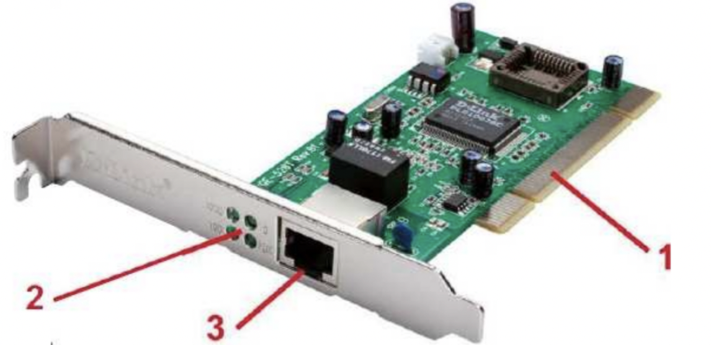
  <figcaption>Elementos de un adaptador de red inalámbrico</figcaption>
</figure>

### 🔗 Tipos de conexiones del adaptador

El número y tipo de conexiones del adaptador es variable. Lo habitual es encontrar una única conexión pero hay variantes en las que se dispone de varias conexiones, como se ve en las imágenes siguientes:

<figure>
  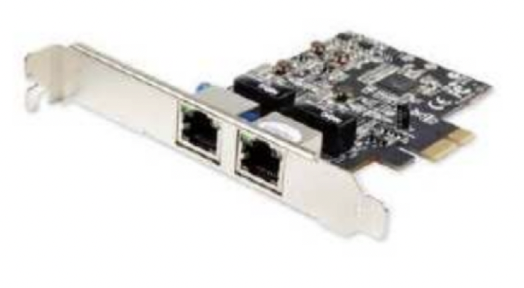
  <figcaption>Adaptador de red con dos salidas RJ-45</figcaption>
</figure>

<figure>
  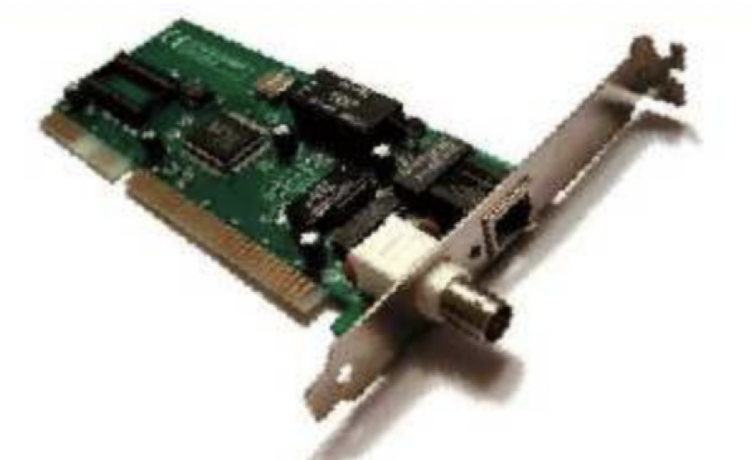
  <figcaption>Adaptador de red con una salida RJ-45 y otra salida coaxial</figcaption>
</figure>

<figure>
  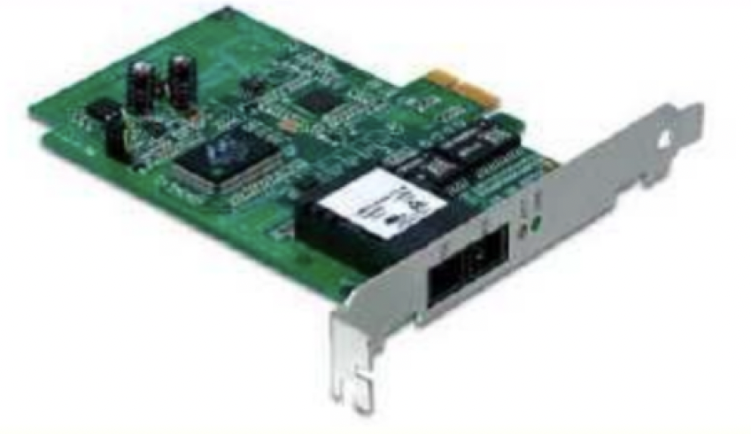
  <figcaption>Adaptador de red con dos salidas de fibra óptica</figcaption>
</figure>

<figure>
  
  <figcaption>Adaptador de red inalámbrico con tres antenas</figcaption>
</figure>

### 💡 Luces testigo

Las luces de testigo varían de un modelo a otro. Cuando hay una, si está fija significa que hay conexión con otro equipo, y si parpadea indica actividad de comunicación.

Cuando hay varias, se destinan a diversos fines: indicar la velocidad de transmisión, el modo de transmisión, etc.

---

## 🏢 Armario de distribución

Como ya hemos comentado, el cableado de una red se centraliza en puntos de distribución a diferente nivel. Estos puntos están constituidos por uno o más armarios de distribución, también llamados **racks**.

El rack recibe todo el cableado de la zona. En el interior del armario, se ubican:

- **Los paneles de parcheo**, donde se conecta el cableado que entra y sale del armario.
- **La electrónica de red**, que se utiliza para aplicar una configuración lógica a los equipos que a ella se conectan.
- **Elementos de suministro eléctrico**, que se encargan de proporcionar electricidad a la electrónica de red y al sistema de ventilación del armario.
- **Accesorios varios**, como pueden ser elementos para ordenar los cables, bandejas para colocar equipamiento portátil, etc.

### 🏗️ Estructura del armario

El armario de distribución, por lo general, tiene esta apariencia:

<figure>
  
  <figcaption>Vista frontal de un armario de distribución</figcaption>
</figure>

La parte delantera es una puerta, habitualmente de cristal o un material transparente, que permita visualizar el contenido del armario sin necesidad de abrirlo.

Tanto las paredes como la puerta y el techo son desmontables, lo que significa que pueden colocarse o no, según las circunstancias. Así, por ejemplo, si quieren colocarse dos armarios juntos, puede obviarse la pared común a ambos para comunicarlos.

Por otro lado, el suelo y el techo pueden tener una abertura para pasar por ella el cableado.

### 📏 Estándar de 19 pulgadas

El interior del armario tiene cuatro bastidores que forman un armazón de exactamente **19 pulgadas** de anchura. Esta medida es estándar y universal, de forma que todos los accesorios y la electrónica diseñados para armarios tienen esta anchura. Este tipo de productos se dice que son **rackeables**.

Los bastidores tienen agujeros practicados cada **5 cm**. Esta distancia se denomina **unidad U**, de manera que la altura de un armario se mide en unidades U: un armario de 40 U, por ejemplo, tendría 41 agujeros en cada bastidor con una longitud útil de 40 x 5 cm.

Los elementos que son rackeables también se miden en unidades U. Por ejemplo, un switch de 2 U o un panel de parcheo de 4 U.

El armazón de bastidores tiene un cable de conexión a tierra para eliminar la carga electrostática que pudiera generarse.

### 📊 Clasificación por tamaño

#### Racks menores de 12 U

Se utilizan en instalaciones de pequeñas redes o como distribuidores en habitáculos donde hay pocos equipos. Por sus dimensiones, suelen fijarse a la pared, aunque en la mayoría pueden instalarse unas ruedas para colocarlos en el suelo y poder desplazarlos.

<figure>
  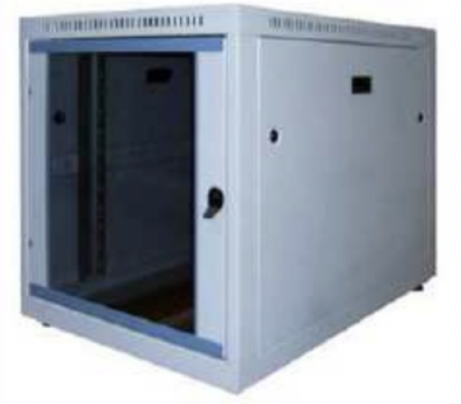
  <figcaption>Rack pequeño para instalaciones domésticas o pequeñas oficinas</figcaption>
</figure>

#### Racks entre 12 U y 25 U

Se usan para redes de tamaño medio. Ideales para distribuidores principales o de planta. Pueden fijarse a la pared, o colocarse en el suelo con unas ruedas por si fuera necesario desplazarlos.

<figure>
  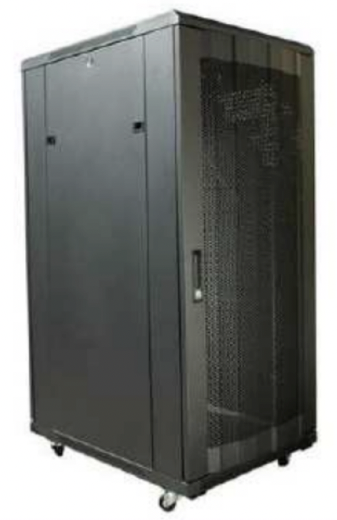
  <figcaption>Rack mediano para redes de tamaño medio</figcaption>
</figure>

#### Racks de más de 24 U

Se emplean en redes de tamaño medio o grande como distribuidores de planta o principales.

Suelen incorporar sistema de ventilación, alimentación, filtros de aire, etc. Por sus dimensiones, son armarios de suelo.

<figure>
  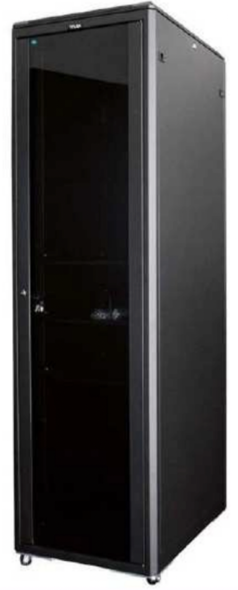
  <figcaption>Rack grande para centros de datos y redes empresariales</figcaption>
</figure>

---

## 🔌 Panel de parcheo

El **panel de parcheo** (patch panel) es uno de los elementos que se colocan en el rack donde se conectan los cables de par trenzado, que entran y salen del mismo.

La finalidad del panel de parcheo es organizar las líneas de entrada y de salida que confluyen en el armario.

### 📋 Características del panel

El panel de parcheo típicamente ocupa **1 U** y dispone de **24 tomas** que pueden venir incorporadas en el mismo o en módulos, que pueden ser individuales o estar divididos en grupos de 4.

<figure>
  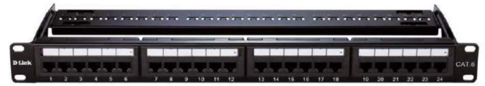
  <figcaption>Panel de parcheo de 24 tomas RJ-45</figcaption>
</figure>

También hay paneles de parcheo compuestos, que tienen dos o más filas de tomas, pudiendo tener 48, 72 o 96 tomas.

<figure>
  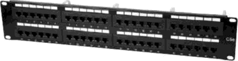
  <figcaption>Panel de parcheo de 48 tomas para grandes instalaciones</figcaption>
</figure>

<figure>
  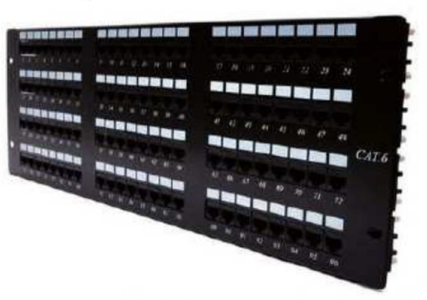
  <figcaption>Panel de parcheo de 96 tomas</figcaption>
</figure>

### 🏷️ Sistema de codificación

Como ya veremos más adelante, las tomas del panel de parcheo se identifican mediante una codificación (números, letras, colores, etc.), que se corresponderá con la toma que hay al otro lado del cable que está conectado a él. De esta manera, por ejemplo, visualizando los paneles de parcheo se pueden identificar claramente todas las tomas de red de una zona, una planta o incluso un edificio completo.

### 🔧 Tipos de conexiones

Las conexiones más simples de un panel de parcheo son rosetas, con un adaptador especial para el panel.

Cuando las conexiones vienen en formato modular, que es lo más habitual, en lugar de rosetas se utilizan unas regletas modulares con un sistema de código de colores similar al de las rosetas.

Los paneles de parcheo también pueden ser de fibra óptica. Van montados en cajones rackeables, en cuyo interior los cables multifibra distribuyen los diferentes hilos a las correspondientes tomas del panel.

<figure>
  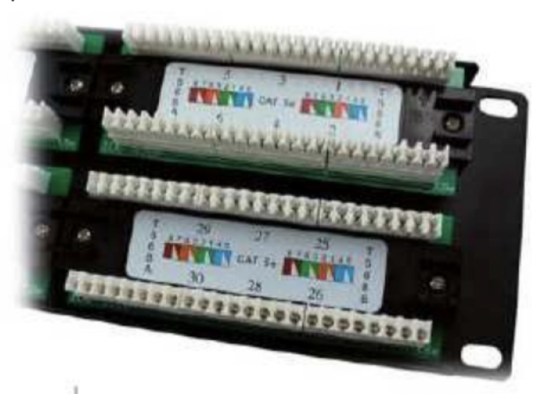
  <figcaption>Detalle de la parte trasera del panel de parcheo, donde se aprecia la numeración y código de colores de cada conexión.</figcaption>
</figure>

---

## 🔗 Elementos de conexión y guiado

Ya hemos comentado que los puestos de usuario de una red son el punto desde el que parte la conexión hacia el armario de distribución. Estos puestos de usuario disponen de un punto de conexión llamado **toma de usuario**, **toma de telecomunicaciones** o, de forma común, **roseta** (por contener una conexión de este tipo en su interior).

### 📍 Toma de usuario (TO)

Las tomas de usuario, abreviadas con las siglas **TO**, pueden ofrecer al usuario una o más conexiones a la red. Las más simples constan de una única conexión (de datos) pero cada vez es más habitual que cada usuario tenga al menos dos tomas: una para voz y otra para datos.

Una toma de usuario consta de una o más conexiones RJ-45 hembra en su interior, junto con una carátula donde se soportan.

<figure>
  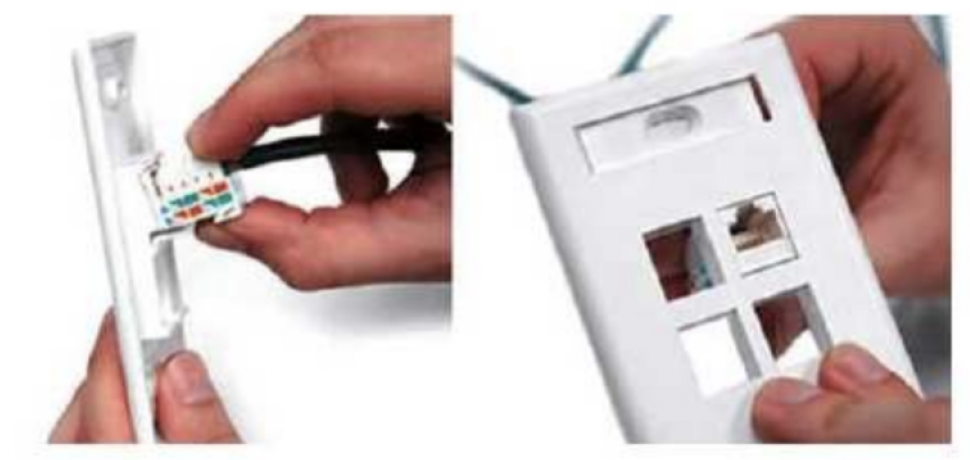
  <figcaption>Detalle de la instalación de una conexión hembra RJ-45 en una toma de usuario</figcaption>
</figure>

### 🏠 Tipos de tomas de usuario

Las tomas de usuario pueden ser de tres tipos:

#### 🖼️ De superficie

- La caja se fija a la pared mediante tirafondos.
- El cableado llega mediante canaleta y se recibe a través de cualquiera de las paredes laterales, que tienen orificios pretroquelados.
- Se utiliza en redes con canalización externa.
- 
<figure>
  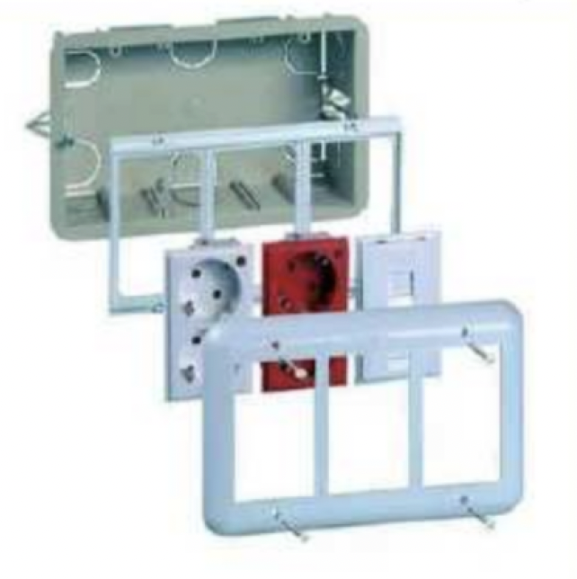
  <figcaption>Toma de usuario de superficie con fijación a pared</figcaption>
</figure>

#### 🔲 Empotrables

- La caja va encastrada en un agujero que se hace en la pared.
- El cableado llega mediante canaladura interna de la pared y se recibe a través de cualquiera de las paredes laterales, que tienen orificios pretroquelados.

<figure>
  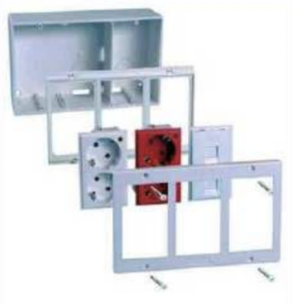
  <figcaption>Toma de usuario empotrable en pared</figcaption>
</figure>

#### 🏢 De suelo

- Similar a la caja empotrable, pero ubicada en suelo técnico.
- El cableado llega a través de bandejas subterráneas o canaladuras.
- Muy utilizado en lugares donde se necesita ubicar tomas de red pero no hay paredes cerca.

<figure>
  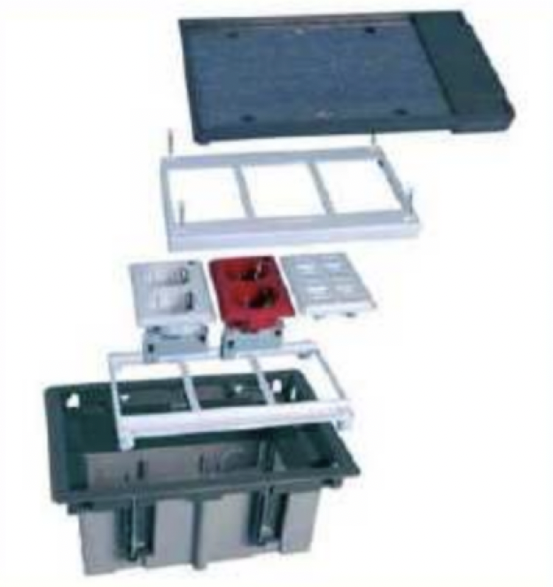
  <figcaption>Toma de usuario para suelo técnico</figcaption>
</figure>

### 🔌 Latiguillos

Para conectar las líneas que unen las TO con los armarios se utilizan unos cables llamados **latiguillos**.

Salvo que se especifique lo contrario, entenderemos que el latiguillo es de cable de par trenzado, con conectores RJ-45 en ambos extremos. Sin embargo, también hay latiguillos de otro tipo de cable, como coaxial o fibra óptica.

Se utilizan latiguillos en dos situaciones:

- Para conectar el equipo a la toma de usuario.
- Para derivar la conexión desde un panel de parcheo a otro lugar que, o bien es otro panel de parcheo, o electrónica de red.

<figure>
  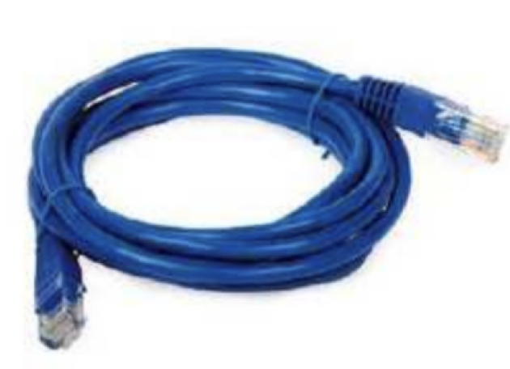
  <figcaption>Latiguillo de cable UTP con conectores RJ-45</figcaption>
</figure>

Los latiguillos pueden fabricarse manualmente o comprarse ya hechos, de medidas concretas. Los de fabricación casera se utilizan cuando se necesitan cables de longitudes que no se ajustan a las de los comercializados. Las medidas más habituales de estos son 0,5 m, 1 m y 2 m.

A partir del cable de par trenzado de categoría 6, por norma, no se permite la fabricación casera de latiguillos, sean de la longitud que sean.

Todo el cableado de la red, tanto los latiguillos como los cables que van de TO a armario, las líneas que conectan los armarios de un edificio, o incluso de varios, se conduce a través de soportes de guiado.

Estos soportes pueden ser muy diversos, en función del tipo de medio por el que deban atravesar los cables, las vulnerabilidades a las que se sometan, etc. De forma general, los soportes de guiado son:

#### 📦 Canalizaciones

Que pueden ser internas o externas, mediante tubo, canaleta u otro material. Se emplean para dirigir grupos pequeños de cable por paredes y suelos.

<figure>
  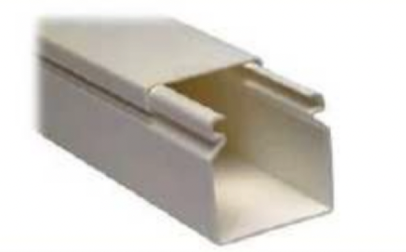
  <figcaption>Canalizaciones internas y externas para cableado de red</figcaption>
</figure>

#### 🏗️ Bandejas de guiado

Se colocan en techos o suelos técnicos. Actúan como carreteras sobre las que van grupos de cables provenientes de diferentes canalizaciones. Se emplean como troncales en plantas de edificios y para guiar el cableado vertical del edificio.

<figure>
  
  <figcaption>Bandejas de guiado para cableado horizontal y vertical</figcaption>
</figure>

#### 🔗 Guías de cables

Se ubican en los bastidores del armario de distribución, e incluso en la parte trasera de algunos modelos de paneles de parcheo. Ayudan a organizar los mazos de cables que entran y salen del armario.

<figure>
  
  <figcaption>Guías para conducir los cables ordenadamente por el rack</figcaption>
</figure>

#### 📋 Pasahilos

Es un elemento rackeable (ocupa 1U) que se utiliza de forma conjunta con el resto de elementos del armario para organizar los grupos de cables de los paneles de parcheo y de la electrónica de red.

<figure>
  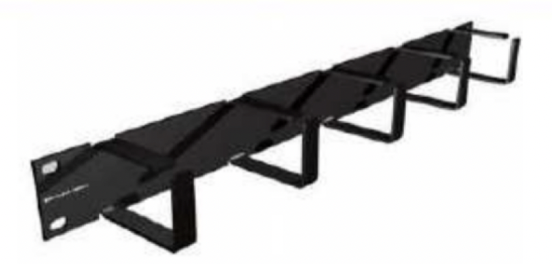
  <figcaption>El pasa hilos organiza cables en 1U</figcaption>
</figure>

## ⚙️ Electrónica de red

Se entiende por **electrónica de red** cualquier dispositivo hardware que permite la interconexión y comunicación entre ordenadores u otros equipos, dirigiendo el tráfico de datos entre ellos. Los elementos más habituales son **repetidores, hubs, switches, routers, pasarelas y puntos de acceso inalámbrico**.

Es común que esta electrónica se concentre en los armarios de distribución, pero según la necesidad pueden instalarse en cualquier punto de la red.

A continuación repasamos los principales dispositivos.

### 📡 Repetidor

El **repetidor** es uno de los elementos más sencillos de la electrónica de red. Trabaja en la **capa 1** del modelo OSI y su función es regenerar y amplificar la señal para que llegue con la misma intensidad al siguiente tramo.

**Características principales**

- No interpreta direcciones ni protocolos: simplemente vuelve a emitir la señal recibida.
- Resulta útil cuando existen tramos largos de cableado o zonas con mala cobertura inalámbrica.
- Incrementa el dominio de colisión porque replica todo lo que recibe.

**Clasificación básica**

- **Repetidor cableado**: se instala en un punto intermedio del cable para regenerar la señal (por ejemplo, en tramos de cobre muy largos).
- **Repetidor inalámbrico**: capta la señal Wi-Fi y la vuelve a emitir para ampliar la cobertura; suele integrarse en puntos de acceso.

### 🔗 Concentrador (Hub)

El **concentrador** (hub) trabaja en la **capa 1** del modelo OSI y replica toda la información que recibe por un puerto hacia el resto. Fue la solución más sencilla para ampliar redes Ethernet en sus inicios.

**Características principales**

- Dominios de colisión: todos los equipos conectados comparten el mismo medio, lo que provoca colisiones cuando dos hablan a la vez.
- No analiza direcciones ni filtra tráfico: cualquier trama llega a todos los puertos.
- Velocidades habituales: 10 Mb/s (Ethernet) y 100 Mb/s (Fast Ethernet).

**Clasificación básica**

- **De sobremesa**: 4 a 8 puertos, usados antiguamente en oficinas pequeñas.
- **Rackeables**: 16, 24 o más puertos, hoy prácticamente en desuso.

!!! note "Uso residual"
    Los hubs se usan solo en prácticas o laboratorios donde interesa observar colisiones o depurar tráfico.

### 🔄 Conmutador (Switch)

El **switch** opera en la **capa 2** del modelo OSI. Aprende qué dirección MAC hay en cada puerto y reenvía las tramas únicamente al destino correcto, reduciendo colisiones y mejorando el rendimiento.

**Características principales**

- Tabla de direcciones MAC autogestionada.
- Permite trabajar en modo full-duplex, con canales de envío y recepción simultáneos.
- Velocidades mixtas: 10/100/1000 Mb/s, y modelos con puertos de fibra para troncales.
- Versiones **no gestionables** (configuración automática) y **gestionables** (permiten VLAN, estadísticas, etc., en niveles más avanzados).

**Clasificación básica**

- **De sobremesa**: 5 u 8 puertos, sin ventilación, para puestos cercanos.
- **Rackeables**: 24, 48 o más puertos RJ-45; pueden incluir módulos de fibra.
- **Con PoE**: alimentan puntos de acceso, cámaras IP u otros dispositivos a través del cable de red.

<figure>
  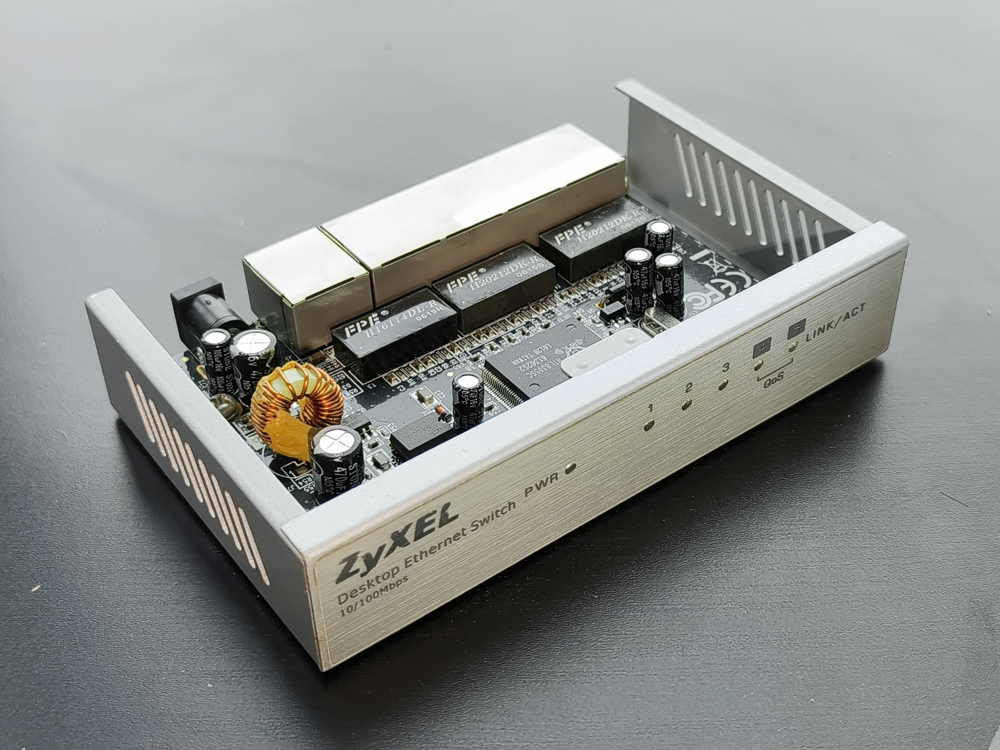
  <figcaption>Switch de sobremesa con autoswitching 10/100/1000 Mb/s.</figcaption>
</figure>

Cuando se necesita alimentar equipos como puntos de acceso o cámaras IP, se puede recurrir a la tecnología **PoE (Power over Ethernet)**, que envía alimentación eléctrica por el mismo cable de red.

<figure>
  
  <figcaption>Ejemplo de dispositivo alimentado mediante PoE.</figcaption>
</figure>

En redes medianas es habitual conectar varios switches entre sí formando topologías en estrella o en cadena, y utilizar puertos específicos “uplink” para enlazarlos.

!!! note "Bridge o puente"
    El bridge fue el precursor del switch: une dos segmentos de red y decide qué tramas deben cruzar analizando direcciones MAC. Hoy esa función suele venir integrada en los switches o en puntos de acceso inalámbricos.

### 🌐 Enrutador (Router)

El **router** funciona en la **capa 3** y permite que varias redes se comuniquen entre sí, tomando decisiones basadas en direcciones IP.

**Características principales**

- Mantiene tablas de rutas para decidir el camino de los paquetes.
- Puede realizar funciones adicionales como NAT, servidor DHCP o filtrado básico.
- Dispone de interfaces variadas (Ethernet, fibra, puertos serie, telefonía).

**Clasificación básica**

- **Routers SoHo**: orientados a hogar y pequeña oficina, con Wi-Fi integrado y configuración sencilla.
- **Routers empresariales o rackeables**: mayor rendimiento, múltiples módulos de expansión y fuentes redundantes.

<figure>
  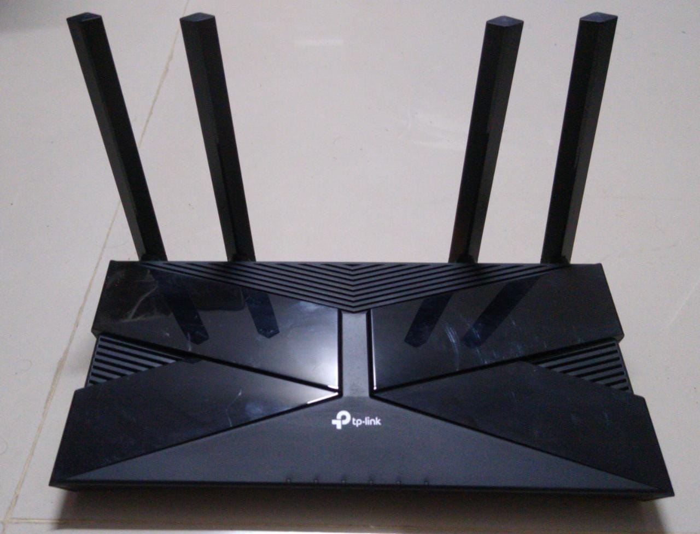
  <figcaption>Router SoHo con conectividad Ethernet y Wi-Fi.</figcaption>
</figure>

### 🚪 Pasarela (Gateway)

La **pasarela** (gateway) es la puerta de enlace entre redes que pueden usar protocolos distintos. Además, suele agrupar servicios de seguridad.

**Características principales**

- Traduce protocolos o formatos de datos diferentes.
- Integra cortafuegos, proxy o VPN para asegurar las comunicaciones.
- Se coloca normalmente en la frontera entre la red interna y el exterior.

**Clasificación básica**

- **Pasarelas independientes**: pocos puertos, pensados para oficinas pequeñas.
- **Pasarelas modulares** (rackeables): permiten añadir tarjetas de expansión, múltiples enlaces WAN y funciones avanzadas.

<figure>
  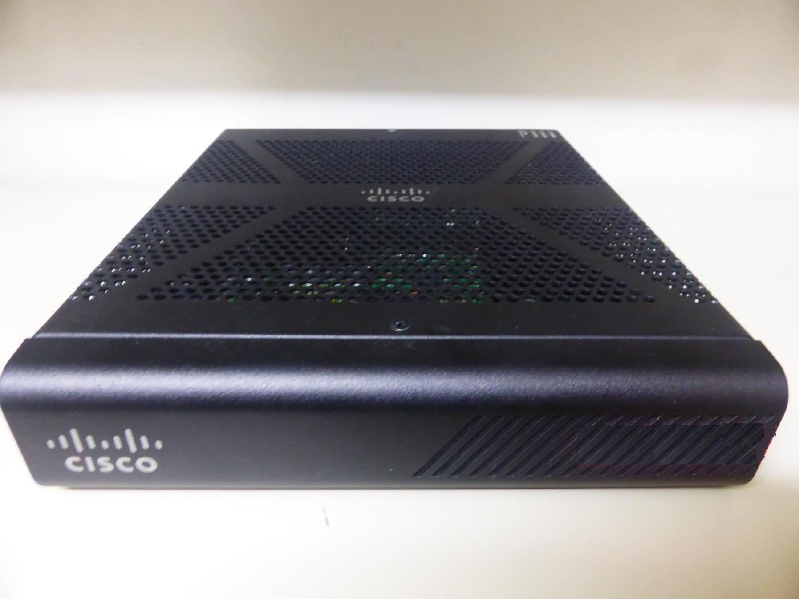
  <figcaption>Gateway con cortafuegos y conexión a varias redes.</figcaption>
</figure>

### 📶 Punto de acceso (Access Point)

El **punto de acceso** amplía la red cableada ofreciendo conectividad Wi-Fi. Controla el acceso de los dispositivos inalámbricos.

**Características principales**

- Soporta distintos tipos de wifi (2,4 GHz, 5 GHz, Wi-Fi 5/6, etc.).
- Puede alimentarse con PoE para facilitar su instalación en techos o paredes.
- Gestiona la autenticación y la distribución de canales.

**Modos de funcionamiento**

- **Punto de acceso**: enlaza clientes Wi-Fi con la red cableada.
- **Repetidor**: aumenta la cobertura enlazando con otro AP.
- **Bridge inalámbrico**: une dos redes cableadas mediante un enlace Wi-Fi dedicado.

**Clasificación básica**

- **Interior**: diseño compacto, cobertura en aulas u oficinas.
- **Exterior**: carcasa sellada y antenas específicas para patios o enlaces entre edificios.

<figure>
  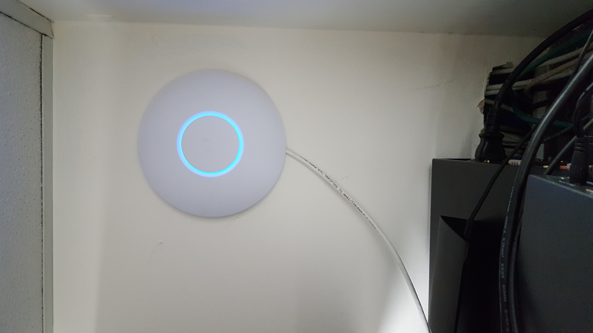
  <figcaption>Punto de acceso para interiores.</figcaption>
</figure>

<figure>
  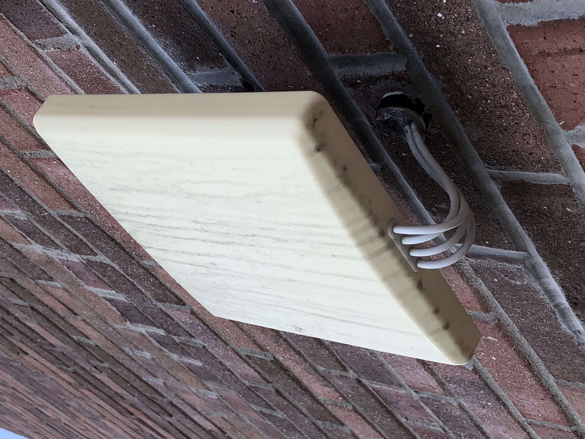
  <figcaption>Punto de acceso exterior con protección frente a la intemperie.</figcaption>
</figure>

---

## 📚 Normativa y estándares

### 📖 Estándares relevantes

Los principales estándares que regulan el diseño y la instalación del cableado estructurado son los publicados por ANSI/TIA/EIA y sus equivalentes internacionales.

**Familia ANSI/TIA/EIA**

- **ANSI/TIA/EIA-568**: define los requisitos del cableado para telecomunicaciones en edificios comerciales (categorías, topologías y pruebas).
- **ANSI/TIA/EIA-569**: describe los espacios y canalizaciones necesarios para alojar la infraestructura de red.
- **ANSI/TIA/EIA-570**: adapta el cableado estructurado a viviendas y pequeños comercios.
- **ANSI/TIA/EIA-606**: establece la administración, etiquetado y documentación de la red.
- **ANSI/TIA/EIA-607** (J-STD-607): especifica el sistema de conexión a tierra en instalaciones de telecomunicaciones.
- **ANSI/TIA/EIA-942**: define la infraestructura de telecomunicaciones para centros de datos.

### 🏗️ Diseño e implementación

El desarrollo e instalación de un sistema de cableado estructurado se basa en el cumplimiento de estándares internacionales de referencia, previamente mencionados, entre los que sobresalen:

- **ANSI/TIA/EIA-568C**: características del cableado y pruebas.
- **ANSI/TIA/EIA-569C**: dimensiones y requisitos de espacios y canalizaciones.

El diseño del cableado estructurado se fundamenta en tres principios esenciales:

1. Los edificios cambian con el tiempo; la red debe ser flexible para poder adaptarse.
2. La tecnología avanza, por lo que los dispositivos deben poder sustituirse sin rediseños globales.
3. Conviene centralizar los servicios de voz, datos, vídeo, alarmas, etc., en una única infraestructura.

El estándar **ANSI/TIA/EIA-569** identifica seis bloques dentro de la red:

El sistema de cableado estructurado se compone de una serie de elementos funcionales, cada uno con un papel específico en la infraestructura de red. Estos elementos aseguran que la red sea flexible, escalable y fácilmente mantenible, permitiendo la transmisión eficiente de datos, voz y otros servicios.

**Elementos funcionales del sistema:**

- **Área de trabajo (Work Area):** zona donde se encuentran los usuarios y los dispositivos finales.
- **Subsistema horizontal:** conecta las áreas de trabajo con el distribuidor de planta.
- **Distribuidor de planta (FD):** punto central de conexión en cada planta del edificio.
- **Subsistema vertical (Backbone):** enlaza los distintos distribuidores de planta con el distribuidor de edificio.
- **Distribuidor de edificio (BD):** agrupa el cableado principal y gestiona la interconexión de plantas.
- **Subsistema de campus y distribuidor de campus (CD):** conecta diferentes edificios dentro de un mismo recinto.

<figure>
  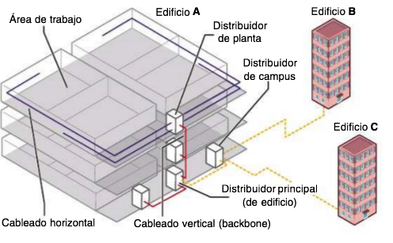
  <figcaption>Ejemplo de arquitectura de sistema de cableado estructurado conectando diferentes edificios (distribuidor de campus), mostrando el cableado horizontal, vertical (backbone), áreas de trabajo y los distintos distribuidores.</figcaption>
</figure>

A continuación se detallan las características y funciones de cada uno de estos elementos funcionales del cableado estructurado:

#### 🧑‍💻 Área de trabajo (Work Area)

El **área de trabajo** es la zona donde se encuentran los equipos del usuario (ordenador, teléfono, impresora, etc.). Cada área está dotada de tomas de telecomunicaciones (TO) que permiten conectar estos dispositivos al subsistema horizontal.

- Se recomienda disponer de al menos **tres tomas** por puesto; una para voz, otra para datos y una adicional de reserva.
- El cable de latiguillo que enlaza el equipo con la TO no debe superar los **5 m** y ha de cumplir la misma categoría que el resto del tendido.
- El estándar considera un área de trabajo tipo de **10 m²** (aprox. 3 × 3 m), aunque puede adaptarse a la distribución real de la sala.
- Las tomas deben ir claramente etiquetadas y registradas para facilitar el mantenimiento y los cambios de puesto.
- Es aconsejable prever puntos de alimentación eléctrica próximos y ordenados para evitar cruces con los cables de red.

<figure>
  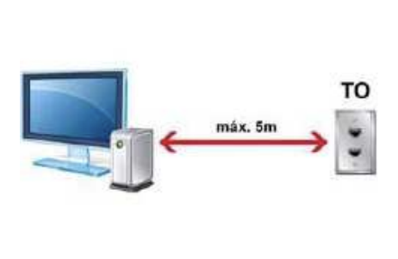
  <figcaption>Distancia máxima entra la estación de trabajo y la TO.</figcaption>
</figure>

### 🧭 Subsistema horizontal

El **subsistema horizontal** agrupa los elementos que conectan las áreas de trabajo con el distribuidor de planta.

- Emplea cableado de par trenzado (cat. 6 o superior) y, en casos específicos, cable de fibra hasta el puesto (por ejemplo, en laboratorios o cuando se requiere blindaje especial).
- La longitud máxima del tendido horizontal, desde la TO hasta el panel del FD, es de **90 m** (sumando un máximo de 5 m adicionales de latiguillos en cada extremo se obtiene el límite de 100 m de la norma).
- Puede incluir un **punto de consolidación** para flexibilizar reubicaciones frecuentes. Este punto debe situarse al menos a 15 m del FD y sirve como punto intermedio donde se conectan las acometidas finales hacia las zonas de trabajo.
- En instalaciones donde se prevean cambios constantes de disposición, se pueden emplear **cubiertas modulares** o cajas de consolidación que agrupen varias TO.

**Canalizaciones horizontales habituales**:

- **Canalización bajo suelo**: conducciones planificadas durante la obra; requiere registros o cajas accesibles.
- **Suelo técnico o sobreelevado**: paneles desmontables bajo los cuales discurren bandejas. Facilita ampliaciones sin obra.
- **Techo técnico o bandejas vistas**: usado para derivar ramales hacia distintas zonas; fácil de mantener.
- **Canaleta superficial**: solución rápida para oficinas y aulas; permite añadir tomas con facilidad.
- **Canalización empotrada**: roza o pared con cámara, ofreciendo un acabado oculto.

<figure>
  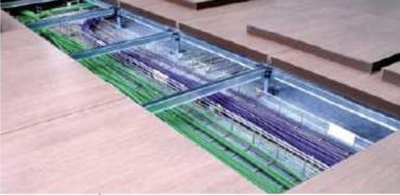
  <figcaption>Ejemplos de canalización: suelo técnico.</figcaption>
</figure>

<figure>
  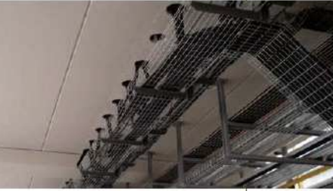
  <figcaption>Ejemplo de bandejas metálicas tipo malla instaladas bajo techo para canalización de cables de red.</figcaption>
</figure>

#### 🗂️ Distribuidor de planta (FD)

El **distribuidor de planta** centraliza el cableado horizontal de cada nivel del edificio. Allí convergen los cables provenientes de las áreas de trabajo y se alojan los equipos necesarios para dar servicio a la planta.

- Puede consistir en un **rack** individual o en una **sala de telecomunicaciones (TR)** completa, en función de la magnitud de la instalación.
- Debe ubicarse de modo que ningún cable horizontal supere los 90 m hasta la toma de usuario. Si esto no fuera posible, será necesario añadir distribuidores secundarios.
- En redes que lo requieran, la sala TR puede albergar equipamiento activo (switches, paneles de parcheo, elementos de alimentación, bandejas y guías de cable, etc.).

Recomendaciones para la sala TR:

- Dimensión mínima de **3 × 3 m**, con altura suficiente para trabajar cómodamente.
- Buena ventilación y, si la carga térmica lo exige, sistema de climatización independiente.
- Canalización preferente mediante **suelo técnico** o bandejas accesibles que permitan añadir o modificar cableados sin obras.
- Puerta de acceso de 86 × 190 cm que abra hacia fuera, sin cierre desde el interior, y control de acceso para personal autorizado.
- Sellado de los pasos de cable con material ignífugo y disponibilidad de tomas eléctricas dedicadas (UPS, bases múltiples, etc.).

<figure>
  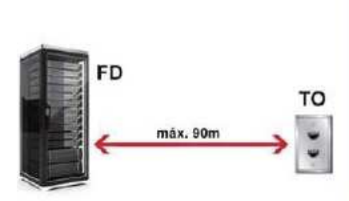
  <figcaption>Ejemplo de distribución de racks y elementos en una sala de telecomunicaciones.</figcaption>
</figure>

#### 🏢 Distribuidor de edificio (BD)

El **distribuidor de edificio** recoge todos los distribuidores de planta del edificio. Suele ubicarse en la planta baja o en la superior, escogiendo la posición que permita un tendido vertical más directo. Siempre que sea posible, conviene evitar sótanos con riesgo de inundación o salas sin ventilación.

- El BD puede compartir sala con el FD de la planta donde se ubica, dimensionando el espacio para alojar racks, canalizaciones y las verticales que llegan desde otras plantas.
- Debe respetarse lo indicado para las salas de telecomunicaciones: acceso controlado, climatización, suelos o bandejas adecuadas y pasos sellados con material ignífugo.
- Si la planta del BD dispone de puestos de trabajo, éstos se cablean desde la misma sala, actuando el BD también como FD de esa planta.

#### 🪜 Subsistema vertical (Backbone)

El **backbone** enlaza cada distribuidor de planta con el BD mediante canalizaciones dedicadas:

- Los cables deben discurrir por bandejas, tubos o canaletas exclusivos para telecomunicaciones. No pueden compartir bajantes con otros servicios (saneamiento, ascensores, conductos de evacuación, etc.).
- El trazado puede incluir tramos horizontales auxiliares si la arquitectura lo exige, siempre guiados por bandejas suspendidas o canaletas protegidas.
- Puede utilizarse **par trenzado** (subordinado a la distancia máxima de 100 m entre equipos) o **fibra óptica** para cubrir mayores recorridos. Con fibra monomodo la norma permite hasta 300 m, y normas como ISO/IEC 11801 amplían a 500 m.
- Es recomendable repetir la ubicación de la sala de telecomunicaciones en cada planta para que el backbone discurra por la misma vertical y simplificar mantenimiento.

<figure>
  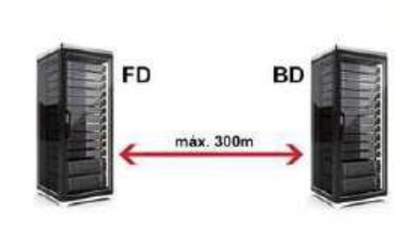
  <figcaption>Distancia máxima recomendada entre el distribuidor de planta (FD) y el distribuidor de edificio (BD): 300 m usando fibra monomodo.</figcaption>
</figure>

#### 🏫 Distribuidor y subsistema de campus (CD)

El **distribuidor de campus (CD)** es el punto central de la red cuando existen varios edificios. Normalmente se ubica en la misma sala donde está el distribuidor de edificio (BD) del edificio principal, de manera que el troncal de cada edificio llegue a una única sala de telecomunicaciones. Por tratarse del núcleo de la red, conviene reforzar las medidas de seguridad (control de acceso, climatización, protección frente a inundaciones) y prever espacio suficiente para servidores comunes, cortafuegos o equipos de monitorización.

El **subsistema de campus** enlaza cada distribuidor de edificio con el CD. Para el tendido se pueden utilizar:

- **Fibra óptica** para la red de datos (lo más habitual por las distancias y el ancho de banda requerido).
- **Par trenzado** para servicios de voz o telefonía tradicional.
- **Coaxial** para circuitos cerrados de televisión u otras señales especializadas.

Las canalizaciones exteriores se realizan preferentemente bajo suelo, utilizando tubos de PVC o similares protegidos contra humedad y roedores. Es recomendable:

- Soterrar los tubos al menos **90 cm** bajo la superficie.
- Instalar **arquetas de registro** cada 50 m aproximadamente, para facilitar el mantenimiento.
- Situar una arqueta de entrada al edificio a menos de 1 m de la fachada y conducir el cableado hasta la sala de telecomunicaciones por el recorrido más directo.

Cuando las distancias son grandes o se requiere redundancia, puede planificarse más de un recorrido de campus para disponer de enlaces de respaldo entre edificios.

#### ⚡ Conexión a tierra del sistema

El estándar ANSI/TIA/EIA-607 establece que todas las instalaciones de telecomunicaciones dispongan de una red de tierra dedicada, con los siguientes elementos:

- **TMGB (Telecommunications Main Grounding Busbar)**: barra principal situada en la sala del BD. Desde ella parte el conductor que se conecta al electrodo de tierra del edificio.
- **TGB (Telecommunications Grounding Busbar)**: barras secundarias ubicadas en cada sala de telecomunicaciones. Funcionan como punto de unión entre la TMGB y los equipos de la sala.
- **TEBC (Telecommunications Equipment Bonding Conductor)**: conductor que enlaza cada rack o equipo con la TGB o TMGB correspondiente.
- **TBB (Telecommunications Bonding Backbone)**: troncal de enlace que une todas las TGB con la TMGB. Debe discurrir por un recorrido directo, sin empalmes, dimensionado para soportar posibles corrientes de fallo.
- **GEC (Grounding Electrode Conductor)**: conexión al electrodo de tierra (pica o sistema enterrado) que disipa a tierra las corrientes derivadas.

Recomendaciones adicionales:

- Las barras deben ser de cobre (mínimo 6 mm de espesor) y tener longitud suficiente para todos los conductores previstos, dejando margen de crecimiento.
- Los conductores se identifican y etiquetan, usando color verde o verde/amarillo según normativa eléctrica.
- Los pasos de cable a través de paredes y suelos se sellan con material ignífugo y, siempre que sea posible, se sigue el recorrido más corto desde el TMGB al punto de conexión a tierra del edificio.

<figure>
  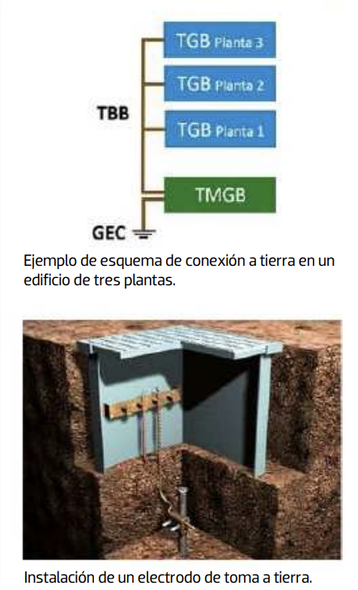
  <figcaption>Ejemplo de esquema de conexión a tierra en un edificio de tres plantas.</figcaption>
</figure>

<figure>
  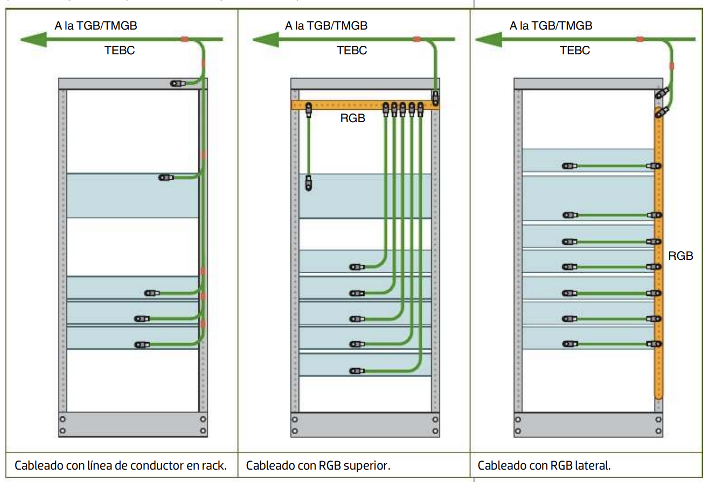
  <figcaption>Instalación de un rack de toma a tierra.</figcaption>
</figure>

---

## 🛠️ Actividades

!!! tip "<strong>Formato de entrega</strong>"
    Para la entrega de las actividades, genera un documento con la práctica descrita a continuación. Deberás crear un archivo PDF con el siguiente formato de nombre: <strong>ACXXX.pdf o PRXXX.pdf</strong>, donde las X representan el número de la actividad. Una vez finalizada la práctica, sube el archivo a Aules (antes de la fecha de vencimiento) para su calificación.

* :simple-readdotcv: **AC401**. (RA4 // CE4a, CE4b // 1-3p). Investiga y documenta las características de los adaptadores de red. Elabora una tabla comparativa con diferentes tipos de NIC, sus velocidades, modos de transmisión y aplicaciones típicas.

* :simple-readdotcv: **AC402**. (RA2 // CE2a, CE2b // 1-3p). Investiga y documenta los componentes de un armario de distribución. Elabora un informe que incluya:

    - Estructura y dimensiones del armario
    - Componentes internos y su función
    - Sistema de unidades U y estándar 19 pulgadas
    - Tipos de racks según tamaño y aplicación

* :simple-readdotcv: **AC403**. (RA4 // CE4a, CE4b // 1-3p). Compara las características de diferentes elementos de electrónica de red. Elabora una tabla que incluya:

    - Repetidores, hubs, switches, routers y gateways
    - Capa del modelo OSI en la que operan
    - Funciones principales y aplicaciones
    - Ventajas y desventajas de cada uno

* :simple-readdotcv: **AC404**. (RA2 // CE2a, CE2b // 1-3p). Analiza los elementos de conexión y guiado del cableado estructurado. Documenta:

    - Tipos de tomas de usuario (superficie, empotrables y de suelo) y sus aplicaciones
    - Características y recomendaciones de uso de los latiguillos
    - Sistemas de guiado del cableado (canalizaciones, bandejas, guías y pasahilos)
    - Criterios de selección y buenas prácticas de instalación

* :simple-readdotcv: **AC405**. (RA4 // CE4a, CE4b // 1-3p). Elabora una ficha técnica comparativa de la electrónica de red estudiada (hub, switch, router, gateway y punto de acceso). Incluye para cada dispositivo:

    - Capa del modelo OSI en la que opera y funciones principales.
    - Escenarios de uso recomendados y limitaciones conocidas.
    - Ventajas e inconvenientes desde el punto de vista de rendimiento, seguridad y mantenimiento.
    - Ejemplos de equipamiento actual disponibles en el mercado (referencias o gamas).

* :simple-readdotcv: **AC406**. (RA4 // CE4a, CE4d // 1-3p). Diseña una propuesta teórica de electrónica de red para un centro educativo de dos edificios. Tu entregable debe incluir:

    - Justificación del dispositivo seleccionado para cada punto clave (switch de armario, router de salida, gateway de seguridad, puntos de acceso interiores/exteriores).
    - Diagrama lógico simplificado que muestre cómo se interconectan los equipos y qué función cumple cada uno.
    - Explicación de cómo cada dispositivo contribuye a la disponibilidad, seguridad y escalabilidad de la red.
    - Tabla con los principales parámetros operativos (ancho de banda, número de puertos, tecnologías inalámbricas soportadas, alimentación).

* :simple-neutralinojs: **PR407**. (RA2, RA3, RA4 // CE2a, CE2b, CE2c, CE3a, CE3b, CE4a, CE4c, CE4d // 1-18p). **Proyecto: Cableado estructurado en Packet Tracer**. Despliega el cableado estructurado completo de una oficina bancaria utilizando Cisco Packet Tracer. Deberás diseñar la infraestructura, realizar todas las conexiones y elaborar un inventario de materiales con presupuesto detallado.

    Consulta la práctica completa en: [Práctica 4.1 - Cableado Estructurado en Packet Tracer](practica_cableado_estructurado_packet_tracer.md)

* :simple-neutralinojs: **RG408**. (RA2 // CE2a, CE2c // 1-10p). **Reto grupal: Proyecto de cableado estructurado**. Diseña y documenta la arquitectura de cableado del **aulario sur del IES Macià Abela** siguiendo la normativa del apartado anterior. Trabajaréis en equipos y deberéis presentar un dossier completo y una exposición final.

> 🏢 **Contexto del proyecto**
>
>  - Centro educativo con dos plantas y aulas polivalentes.
>  - Necesita integrar voz, datos, Wi-Fi y servicios comunes (impresoras, proyectores, CCTV básico).
>  - El aulario debe conectarse al edificio principal mediante el subsistema de campus.
>
> 🧑‍🤝‍🧑 **Tareas del equipo**
>
> 1. Levantar un plano funcional del edificio (zonas, aulas, armarios, enlace al campus).
> 2. Elaborar el esquema de cableado en [Excalidraw](https://excalidraw.com/) con los elementos funcionales: áreas de trabajo, subsistema horizontal, distribuidores (FD, BD, CD) y backbone.
> 3. Justificar la selección de estándares, medios físicos y canalizaciones empleadas.
> 4. Definir la sala de telecomunicaciones (TR) y el equipamiento previsto (paneles, switches, alimentación, tierra).
> 5. Proponer un plan básico de ampliación y mantenimiento (reserva de cables, crecimiento, protección).
>
> 🧰 **Herramientas recomendadas**
>
>  - [Excalidraw](https://excalidraw.com/) para el diagrama.
>  - [Packet Tracer](https://www.netacad.com/courses/packet-tracer) para simular y validar el diseño de red.
>  - Documentos colaborativos (Drive, Aules) para el dossier.
>
> 📄 **Entregables**
>
>  - Dossier en PDF (10-15 páginas) con memoria técnica, plano funcional, tablas de materiales y justificaciones.
>  - Diagrama en Excalidraw (enlace y captura) integrado en el dossier.
>  - Presentación oral (5 minutos) con los puntos clave del diseño.
>
> 📋 **Criterios de evaluación (30 puntos)**
>
> | Criterio | Descripción | Puntos |
> |---|---|---|
> | Análisis del escenario | Identifica correctamente necesidades y condicionantes del aulario sur. | 0-6 |
> | Diseño del cableado | Coherencia del esquema Excalidraw con los elementos funcionales y la normativa. | 0-8 |
> | Justificación técnica | Argumenta la elección de estándares, medios, canalizaciones y equipamiento. | 0-8 |
> | Plan de ampliación y mantenimiento | Incluye reservas, protección, crecimiento y mantenimiento básico. | 0-4 |
> | Presentación y documentación | Claridad del dossier y exposición, integración del diagrama. | 0-4 |

<!-- 

* :simple-readdotcv: **AC405**. (RA4 // CE4a, CE4b // 1-3p). Analiza los dominios de colisión y difusión en redes. Elabora un informe que incluya:
    - Definición y características de cada dominio
    - Dispositivos que extienden o limitan cada dominio
    - Impacto en el rendimiento de la red
    - Estrategias para optimizar el tráfico de red

!!! tip "<strong>CONCLUSIÓN</strong>"
    El cableado estructurado es fundamental para el funcionamiento eficiente de cualquier sistema de comunicaciones. Conocer las características, funciones y aplicaciones de cada componente nos permite diseñar e implementar redes locales robustas, escalables y adaptadas a las necesidades específicas de cada entorno. La correcta selección e instalación de estos elementos garantiza el rendimiento óptimo y la facilidad de mantenimiento del sistema. -->