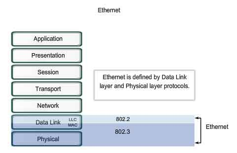
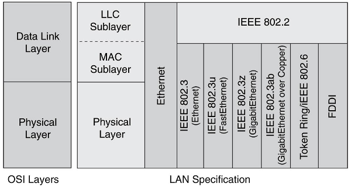
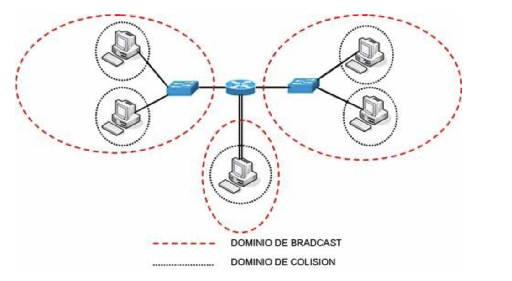
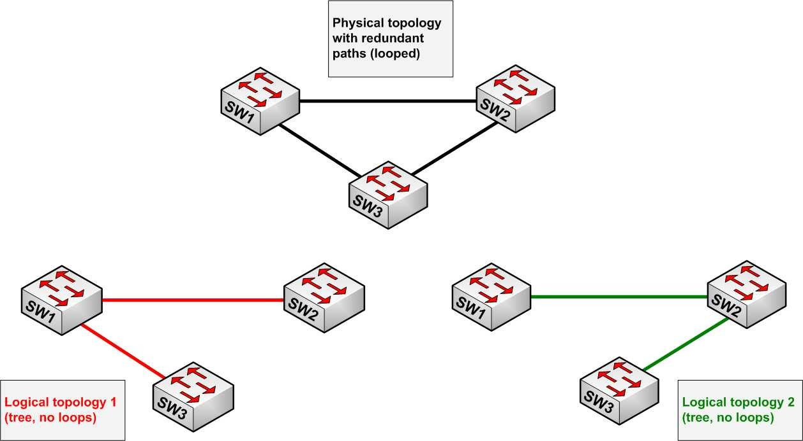
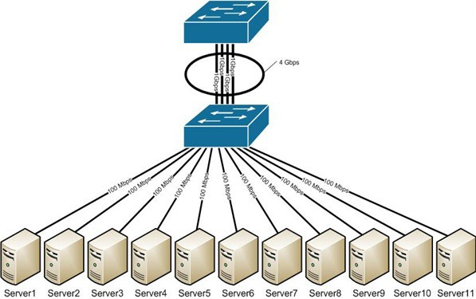
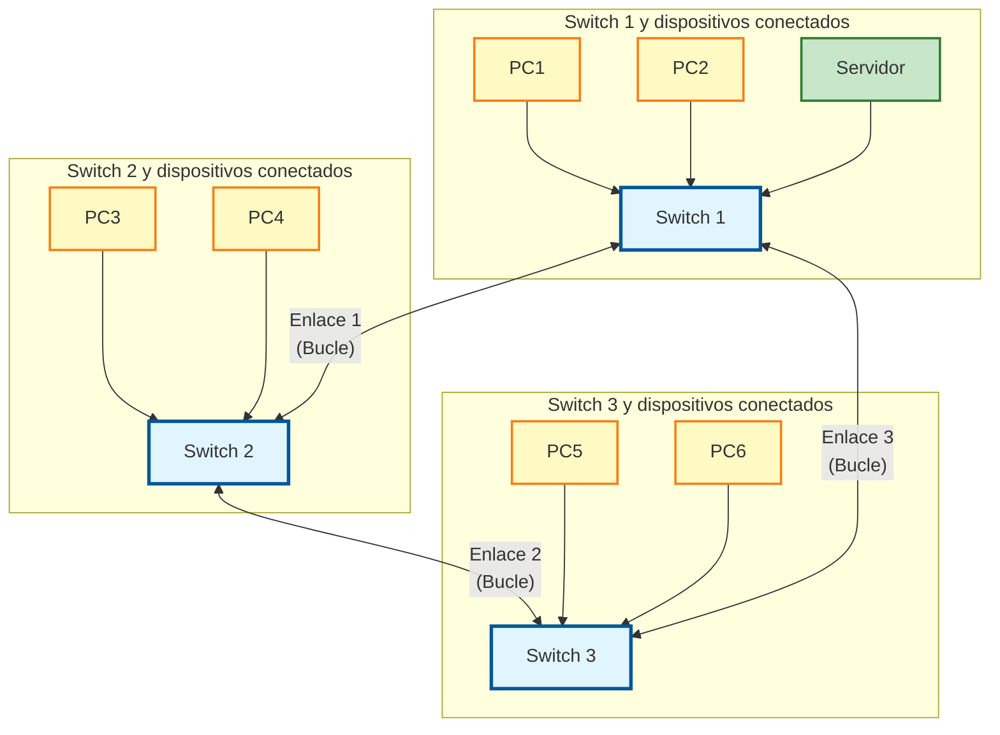

# :material-link: CAPA DE ENLACE DE DATOS

La **capa de enlace de datos** es el nivel 2 del modelo OSI y se encarga de establecer una comunicación libre de errores entre dos dispositivos conectados directamente. Esta capa organiza los bits que llegan de la capa física en bloques de información llamados **tramas**, gestiona el acceso al medio compartido y controla el flujo de datos entre equipos.

En esta unidad estudiaremos cómo funciona la capa de enlace en redes Ethernet, cómo se estructuran las tramas, cómo se detectan y corrigen errores, y cómo los switches gestionan el tráfico de red mediante direcciones MAC.

!!! info "<strong>Objetivos de la unidad</strong>"
    
    • Comprender las funciones principales de la capa de enlace de datos 
    • Identificar la estructura de las tramas Ethernet 
    • Conocer los mecanismos de control de acceso al medio 
    • Entender el funcionamiento de los switches y su aprendizaje de direcciones MAC 
    • Aplicar conceptos de dominios de colisión y difusión 
    • Conocer protocolos avanzados como STP y VLANs
    

## 📚 Propuesta didáctica

En esta unidad trabajamos los **RA1 y RA4 de RAL**:

> **RA1.** *Reconoce la estructura de redes locales cableadas analizando las características de entornos de aplicación y describiendo la funcionalidad de sus componentes.*
> 
> **RA4.** *Instala equipos en red, describiendo sus prestaciones y aplicando técnicas de montaje.*

### 🎯 Criterios de evaluación

#### Criterios de evaluación del RA1

* **CE1a**: Se han descrito los principios de funcionamiento de las redes locales.
* **CE1c**: Se han descrito los elementos de la red local y su función.

#### Criterios de evaluación del RA4

* **CE4a**: Se han descrito las prestaciones de los equipos de red analizando características técnicas de switches, routers y puntos de acceso.
* **CE4b**: Se han identificado los componentes de los equipos de red reconociendo interfaces, fuentes de alimentación y sistemas de ventilación.

### Contenidos

* Funciones de la capa de enlace de datos.
* Subcapas LLC y MAC.
* Estructura de tramas Ethernet (IEEE 802.3).
* Detección de errores: CRC.
* Control de acceso al medio compartido.
* Funcionamiento de switches y aprendizaje de direcciones MAC.
* Dominios de colisión y difusión.
* Protocolos avanzados: STP, VLANs, EtherChannel.

!!! question "Cuestionario inicial"
    1. ¿Qué función cumple la capa de enlace de datos en el modelo OSI?
    2. ¿Qué son las subcapas LLC y MAC y para qué sirven?
    3. ¿Qué es una trama Ethernet y qué campos contiene?
    4. ¿Cómo funciona el CRC para detectar errores en las tramas?
    5. ¿Qué diferencia hay entre un hub y un switch en cuanto al manejo de tramas?
    6. ¿Qué es una dirección MAC y cómo la utiliza un switch?
    7. ¿Qué son los dominios de colisión y difusión?
    8. ¿Para qué sirve el protocolo STP (Spanning Tree Protocol)?
    9. ¿Qué es una VLAN y qué ventajas ofrece?

---

## 🔧 Conceptos generales

La **capa de enlace de datos** se sitúa en el **nivel 2** del modelo OSI. Su misión principal es establecer una línea de comunicación libre de errores que pueda ser utilizada por la capa inmediatamente superior: la capa de red.

<figure style="align: center;">
    
    <figcaption style="text-align: center;">La capa de enlace de datos en el modelo OSI</figcaption>
</figure>

Como el nivel físico opera con bits, la capa de enlace tiene que:

- **Montar bloques de información** llamados **tramas**
- **Dotarles de una dirección de capa de enlace** (Dirección MAC)
- **Gestionar la detección o corrección de errores**
- **Ocuparse del control de flujo** entre equipos (para evitar que un equipo más rápido desborde a uno más lento)

### 📊 Subcapas de la capa de enlace

En redes Ethernet, esta capa se subdivide en dos subcapas:

#### 🔹 Subcapa de enlace lógico (LLC - Logical Link Control)

- Se recoge en la norma **IEEE 802.2**
- Es común para todos los tipos de redes (Ethernet, Wi-Fi, WiMAX, etc.)
- **Proporciona al nivel de red una interfaz uniforme**, independiente de la tecnología de acceso al medio
- Se encarga de la gestión de errores y control de flujo a nivel lógico
- En la práctica, suele estar implementada en el driver de la tarjeta de red (controlador de la NIC)

#### 🔹 Subcapa de acceso al medio (MAC - Medium Access Control)

- Es la subcapa **más cercana al nivel físico**
- Se encarga de **arbitrar el uso del medio** cuando este está compartido entre más de dos equipos
- **Empaqueta los datos en tramas** junto con la información de direccionamiento y detección de errores
- **Desempaqueta tramas** recibidas
- Forma parte de la propia tarjeta de comunicaciones
- Gestiona el acceso al medio compartido mediante protocolos como CSMA/CD

<figure style="align: center;">
    
    <figcaption style="text-align: center;">División de la capa de enlace en subcapas LLC y MAC</figcaption>
</figure>

### 🎯 Funciones principales

Además de la **formación de tramas**, el nivel de enlace se ocupa de:

- **Segmentación y agrupación**: dividir datos grandes en tramas o agrupar datos pequeños
- **Sincronización de octeto y carácter**: asegurar que el receptor interprete correctamente los datos
- **Delimitación de trama**: identificar dónde comienza y termina cada trama
- **Tratamiento de errores**: eliminar tramas erróneas, solicitar retransmisiones, descartar tramas duplicadas
- **Control de flujo**: adecuar el flujo de datos entre emisores rápidos y receptores lentos
- **Control de acceso al medio**: cuando varios equipos comparten el mismo medio físico
- **Recuperación de fallos**: gestionar situaciones de error en la comunicación
- **Gestión y coordinación de la comunicación**: organizar el intercambio de datos entre dispositivos

---

## 📦 Estructura de las tramas

### 🔷 Trama Ethernet (IEEE 802.3)

La trama Ethernet es la unidad básica de transmisión en la capa de enlace. Su estructura está definida por el estándar IEEE 802.3.

<figure style="align: center;">
    
    <figcaption style="text-align: center;">Estructura de una trama Ethernet IEEE 802.3</figcaption>
</figure>

#### Campos de la trama

**Preámbulo** (7 bytes):

- Patrón de sincronización: `10101010` repetido 7 veces
- Permite que el receptor sincronice su reloj con el emisor

**SDF - Start Frame Delimiter** (1 byte):

- Delimitador de comienzo de trama: `10101011`
- Indica que comienza la información útil

**Direcciones MAC** (6 bytes cada una):

- **Dirección MAC destino**: indica a qué dispositivo va dirigida la trama
- **Dirección MAC origen**: identifica el dispositivo que envía la trama
- Formato: `F2:3E:C1:8A:B1:01` (notación hexadecimal, 12 dígitos hex = 48 bits)
- Cada tarjeta de red posee un identificador único grabado en su memoria ROM (equivalente a un DNI)
- Los primeros 3 bytes identifican al fabricante (OUI - Organizationally Unique Identifier)
  - En el OUI hay 2 bits importantes:
    - **Bit de Unicast (0) o Multicast (1)**: indica si la dirección es para un solo dispositivo o para varios
    - **Bit de Globales (0) o Locales (1)**: indica si la dirección es globalmente única o configurada localmente
- Los últimos 3 bytes identifican la tarjeta específica (NIC - Network Interface Card)
- Dirección especial: `FF:FF:FF:FF:FF:FF` (broadcast - para todos los dispositivos)

**Etiqueta VLAN** (4 bytes, opcional):

- Indica la pertenencia a una VLAN o prioridad según IEEE P802.1p

**Longitud/Tipo** (2 bytes):

- Si el valor es < 1536: indica la longitud de los datos
- Si el valor es ≥ 1536: indica el tipo de protocolo de capa superior (por ejemplo, 0x0800 para IP)

**Datos + Relleno** (46-1500 bytes):

- Trama mínima de 64 bytes (512 bits = 51,2 μs)
- Como Tx ≥ 2Tp: Datos+Relleno ≥ 46 bytes (esto significa que, para poder detectar colisiones en el modo half-duplex clásico, la trama debe ser lo suficientemente grande para que la señal pueda recorrer todo el cable, ir y volver, antes de que termine de transmitirse; por eso se exige un tamaño mínimo de 46 bytes en el campo de datos+relleno)
- Trama máxima: 1500 bytes de datos

**FCS - Frame Check Sequence** (4 bytes):

- **CRC-32** (Cyclic Redundancy Check)
- Polinomio generador de orden 33
- Permite detectar errores en la transmisión

**IFG - Inter-Frame Gap** (12 bytes):

- Intervalo de espera de 96 bits antes de empezar a transmitir
- Se realiza siempre, incluso si el medio está libre

### 🔍 Detección de errores: CRC

La **comprobación de redundancia cíclica (CRC)** es un código de detección de errores usado frecuentemente en redes digitales para detectar cambios accidentales en los datos.

**Funcionamiento:**

1. El emisor calcula un valor CRC basado en el contenido de la trama
2. Este valor se añade al final de la trama (campo FCS)
3. El receptor recalcula el CRC con los datos recibidos
4. Si los valores coinciden: la trama es correcta
5. Si no coinciden: la trama tiene errores y se descarta

**Ventajas del CRC:**

- ✅ Implementación sencilla en hardware
- ✅ Muy efectivo para detectar errores causados por ruido
- ✅ Detecta errores de múltiples bits
- ✅ No requiere mucho espacio adicional (solo 4 bytes)

**Limitaciones:**

- ⚠️ El CRC **detecta** errores pero **no los corrige**
- ⚠️ Si se detecta un error, la trama se descarta y el protocolo de capa superior debe solicitar la retransmisión

<!-- <figure style="align: center;">
    
    <figcaption style="text-align: center;">Ejemplo de cálculo CRC: información a transmitir y polinomio generador</figcaption>
</figure> -->

---

## 🔄 Segmentación y agrupación

### 📏 Segmentación

La segmentación surge cuando una trama es excesivamente larga. En este caso, se debe dividir en tramas más pequeñas para facilitar su transmisión y procesamiento.

**Motivos para segmentar:**

- Limitar el tamaño máximo de trama (1500 bytes en Ethernet)
- Facilitar la retransmisión en caso de error (solo se retransmite la trama errónea)
- Permitir la multiplexación de datos de diferentes aplicaciones

### 📦 Agrupación (Bloque)

Si las tramas son excesivamente cortas, se implementan técnicas de agrupación que consisten en concatenar varios mensajes cortos de nivel superior en una única trama de la capa de enlace más larga.

**Ventajas de la agrupación:**

- Mejora la eficiencia de la transmisión
- Reduce la sobrecarga de cabeceras
- Optimiza el uso del ancho de banda

---

## 📡 Uso del medio compartido

Cuando varios equipos comparten el mismo medio físico (por ejemplo, un cable o un medio inalámbrico), es necesario establecer reglas para evitar conflictos. Existen diferentes métodos de control de acceso al medio:

### 🔹 Basados en particionado de canal

La multiplexación divide el canal de forma fija entre varios usuarios:

**TDM (Time Division Multiplexing - Multiplexación por división de tiempo)**:

- Cada usuario tiene asignado un intervalo de tiempo específico
- Ejemplo: telefonía tradicional

**FDM (Frequency Division Multiplexing - Multiplexación por división de frecuencia)**:

- Cada usuario tiene asignada una frecuencia específica
- Ejemplo: radio FM (cada emisora en una frecuencia)

### 🔹 Basados en toma de turnos

En estos métodos, los dispositivos esperan su turno para transmitir.

#### Polling (Protocolo de sondeo)

- Se designa un nodo como **maestro** que dirige los turnos
- Para transmitir, un nodo debe recibir permiso del nodo central mediante un mensaje de sondeo
- El permiso va pasando continuamente de estación en estación
- Cada estación puede transmitir cuando recibe el permiso y encuentra el medio libre

#### Token Passing (Protocolo de paso de testigo)

- No hay ningún nodo maestro
- Existe una trama especial de pequeño tamaño llamada **testigo (token)** que circula entre los nodos según un orden preestablecido
- Un nodo puede transmitir cuando tiene el testigo
- Mientras no lo tenga, debe esperar
- Este método ha sido ampliamente utilizado en redes con topología en anillo (como Token Ring)

### 🔹 Basados en acceso aleatorio

En este método, los equipos compiten por el uso del medio cuando necesitan transmitir.

#### ALOHA

- Los dispositivos transmiten cuando lo necesitan
- Esperan confirmación
- Si no la reciben, retransmiten tras un tiempo aleatorio

#### CSMA (Carrier Sense Multiple Access)

- Los dispositivos **escuchan el medio** antes de transmitir (detección de portadora)
- Solo transmiten si el medio está libre
- Si detectan señal, esperan a que termine

#### CSMA/CD (Carrier Sense Multiple Access with Collision Detection)

Es el protocolo utilizado en Ethernet tradicional para gestionar el acceso al medio compartido.

**Funcionamiento:**

1. **Carrier Sense (Detección de portadora)**: Antes de transmitir, el equipo escucha si hay señal en el medio
2. **Multiple Access (Acceso múltiple)**: Si el medio está libre, puede transmitir
3. **Collision Detection (Detección de colisiones)**: Si detecta una colisión, detiene la transmisión
4. **Backoff**: Espera un tiempo aleatorio antes de reintentar

**Problema de las colisiones:**

- Cuando dos equipos transmiten simultáneamente, las señales se interfieren
- Ambas tramas se corrompen y deben retransmitirse
- Reduce la eficiencia de la red

**Solución con switches:**

Los switches modernos eliminan las colisiones creando dominios de colisión separados para cada puerto, permitiendo comunicaciones full-duplex.

#### CSMA/CA (Carrier Sense Multiple Access with Collision Avoidance)

Utilizado principalmente en redes inalámbricas (Wi-Fi).

**Funcionamiento:**

1. **Carrier Sense (Detección de portadora)**: Escucha el medio antes de transmitir
2. **Multiple Access (Acceso múltiple)**: Varios nodos comparten el mismo medio
3. **Collision Avoidance (Prevención de colisiones)**: Para prevenir colisiones se recurre a una compleja organización del tiempo que permite evitar que dos o más miembros de una red comiencen la transmisión a la vez
4. Si los datos se superponen, se reconoce el problema y se inicia de nuevo el envío

!!! tip "<strong>Diferencia clave</strong>"
    
    <strong>CSMA/CD</strong> detecta colisiones después de que ocurran (usado en Ethernet cableado). 
    <strong>CSMA/CA</strong> intenta evitar colisiones antes de que ocurran (usado en Wi-Fi).
    

  <iframe src="https://www.youtube.com/embed/CpSe2mk_5-I" 
          style="position: absolute; top: 0; left: 0; width: 100%; height: 100%;" 
          frameborder="0" 
          allow="accelerometer; autoplay; clipboard-write; encrypted-media; gyroscope; picture-in-picture" 
          allowfullscreen 
          title="YouTube video player"></iframe>

  Video explicativo en español sobre el funcionamiento del protocolo CSMA/CD en Ethernet y su comparación con CSMA/CA en redes inalámbricas.

---

## 🔄 Conmutación de tramas

La conmutación de tramas consiste en utilizar una topología física en estrella en la que un switch o conmutador redirige el tráfico al enlace concreto en el que se encuentra el destinatario.

### 🎯 Funcionamiento básico de los switches

Un **switch** es un dispositivo de capa 2 que aprende las direcciones MAC de los dispositivos conectados a cada puerto y reenvía las tramas únicamente al puerto destino correcto.

**Proceso de aprendizaje:**

1. Cuando el switch recibe una trama, examina la dirección MAC origen
2. Asocia esa dirección MAC con el puerto por el que llegó
3. Almacena esta información en una tabla (tabla de direcciones MAC)
4. Cuando recibe una trama con una dirección MAC destino conocida, la envía solo al puerto correspondiente
5. Si la dirección destino es desconocida o es broadcast, envía la trama a todos los puertos (excepto al de origen)

**Ventajas frente a hubs:**

- ✅ Elimina colisiones al crear dominios de colisión separados
- ✅ Mejora el rendimiento al no inundar todos los puertos
- ✅ Permite comunicaciones full-duplex
- ✅ Mayor seguridad (el tráfico no es visible en todos los puertos)

### 📊 Dominios de colisión y difusión

**Dominio de colisión:**

- Conjunto de dispositivos cuyas tramas pueden colisionar entre sí
- Un hub extiende el dominio de colisión
- Un switch crea un dominio de colisión por puerto

<figure style="text-align: center;">
    
    <figcaption>Visualización de los dominios de colisión y difusión en una red con hubs, switches y router.</figcaption>
</figure>

**Dominio de difusión (broadcast domain):**

- Conjunto de dispositivos que reciben tramas de broadcast
- Un switch extiende el dominio de difusión
- Un router limita el dominio de difusión

<figure style="text-align: center;">
    
    <figcaption style="text-align: center;">Ejemplo visual de dominios de colisión y difusión en una red con hubs, switches y un router.</figcaption>
</figure>

  <iframe src="https://www.youtube.com/embed/I7lpHcrpebY" 
          style="position: absolute; top: 0; left: 0; width: 100%; height: 100%;" 
          frameborder="0" 
          allow="accelerometer; autoplay; clipboard-write; encrypted-media; gyroscope; picture-in-picture" 
          allowfullscreen 
          title="YouTube video player - Dominios de colisión y difusión"></iframe>

<figcaption style="text-align: center; font-style: italic;">Vídeo recomendado: explicación sobre los dominios de colisión y difusión en redes.</figcaption>

---

## 🌳 Protocolo Spanning Tree (STP)

### 🎯 Problema: Bucles en la red

Cuando se conectan varios switches entre sí formando bucles (para redundancia), pueden producirse problemas graves:

- **Bucles de tráfico infinito**: Las tramas circulan indefinidamente por la red
- **Inundación de broadcast**: Las tramas de broadcast se multiplican exponencialmente
- **Saturación de la red**: El ancho de banda se consume completamente
- **Tablas MAC inestables**: Las direcciones MAC cambian constantemente

### ✅ Solución: STP

El **Spanning Tree Protocol (STP)** transforma una red física con forma de malla (que tiene bucles) en una red lógica en forma de árbol (libre de bucles).

**Funcionamiento básico:**

1. Los switches se comunican mediante mensajes **BPDU** (Bridge Protocol Data Units)
2. Se elige un **switch raíz** (root bridge) mediante un algoritmo
3. Se calculan las rutas más cortas desde cada switch hasta el raíz
4. Se bloquean los puertos que crearían bucles
5. Si un enlace activo falla, se activa automáticamente uno de los bloqueados

<figure style="align: center;">
    
    <figcaption style="text-align: center;">El algoritmo STP transforma una red física con bucles en una red lógica en forma de árbol</figcaption>
</figure>

**Ventajas:**

- ✅ Elimina bucles manteniendo redundancia
- ✅ Activa automáticamente rutas alternativas si falla el enlace principal
- ✅ Transparente para los usuarios finales

**Variantes:**

- **RSTP (Rapid Spanning Tree Protocol)**: Convergencia más rápida (segundos en lugar de minutos)
- **MSTP (Multiple Spanning Tree Protocol)**: Permite múltiples árboles para diferentes VLANs

---

## 🔗 Agregación de enlaces (EtherChannel)

### 🎯 Concepto

El **EtherChannel** (también llamado Port Trunking o Link Aggregation) permite combinar varios enlaces físicos en un enlace lógico único de mayor ancho de banda.

**Características:**

- ✅ Aumenta el ancho de banda entre switches
- ✅ Proporciona redundancia (si un enlace falla, los demás siguen funcionando)
- ✅ Es una solución escalable
- ✅ Puede usarse entre switches o entre un switch y un servidor

<figure style="align: center;">
    
    <figcaption style="text-align: center;">EtherChannel combina varios enlaces físicos en un enlace lógico de mayor ancho de banda</figcaption>
</figure>

**Modos de configuración principales:**

**Mode ON**:

- Configuración manual sin negociación
- Todos los puertos se activan manualmente
- No utiliza ningún protocolo

**PAgP (Port Aggregation Protocol)**:

- Protocolo propietario de Cisco
- El switch negocia con el otro extremo qué puertos deben activarse

**LACP (Link Aggregation Control Protocol)**:

- Protocolo abierto (IEEE 802.3ad y 802.3ax)
- Estándar de la industria
- Recomendado para equipos de diferentes fabricantes

---

## 🏷️ VLANs (Virtual LANs)

### 🎯 Concepto

Una **VLAN (Virtual LAN)** es un método para crear redes lógicas independientes dentro de una misma red física. Varias VLANs pueden coexistir en un único switch físico.

**Características principales:**

- ✅ Reduce el tamaño del dominio de difusión
- ✅ Mejora la seguridad al aislar segmentos de red
- ✅ Facilita la administración de la red
- ✅ Permite separar departamentos lógicamente sin cambiar el cableado físico

**Ejemplo práctico:**

En una empresa, podemos tener:

- **VLAN 10**: Departamento de Ventas
- **VLAN 20**: Departamento de Administración
- **VLAN 30**: Departamento de IT

Aunque todos estén conectados al mismo switch físico, no pueden comunicarse entre sí a menos que haya un router que interconecte las VLANs.

**Ventajas:**

- **Seguridad**: Los departamentos están aislados
- **Rendimiento**: Reduce el tráfico de broadcast
- **Flexibilidad**: Fácil reorganización sin cambiar cables
- **Escalabilidad**: Fácil añadir nuevos usuarios a una VLAN

---

## 📡 Protocolos de enlace

### LAN cableadas

Los principales protocolos para redes locales cableadas son:

- **Ethernet o Ethernet DIX**: El protocolo Ethernet original
- **Ethernet II o Ethernet DIX-II**: Versión compatible con el estándar IEEE 802.3
- **IEEE 802.3**: Estándares internacionales basados en Ethernet. Utiliza CSMA/CD
- **IEEE 802.3u**: Fast Ethernet (100 Mbps)
- **IEEE 802.3bp**: Gigabit Ethernet (1000 Mbps)
- **Token Ring (IEEE 802.5)**: Topología física en estrella, pero funciona internamente como un anillo. Utiliza el protocolo de paso de testigo
- **FDDI**: Protocolo de acceso al medio de doble anillo de fibra óptica

### LAN inalámbricas

Los principales protocolos para redes locales inalámbricas son:

- **Wi-Fi**: Familia de estándares IEEE 802.11 (802.11a, 802.11b, 802.11g, 802.11n, 802.11ac, 802.11ax)
- **Bluetooth**: Estándares IEEE 802.15

!!! tip "<strong>Dispositivos de la capa de enlace</strong>"
    
    Los principales dispositivos que operan en la capa de enlace son: 
    • <strong>Puentes (Bridges)</strong>: Conectan segmentos de red 
    • <strong>Conmutadores (Switches)</strong>: Dispositivos de capa 2 que conmutan tramas 
    • <strong>Puntos de acceso inalámbricos (Access Points)</strong>: Permiten conexión Wi-Fi
     -->

---

## 🛠️ Actividades

!!! tip "<strong>Formato de entrega</strong>"
    Para la entrega de las actividades, genera un documento con la práctica descrita a continuación. Deberás crear un archivo PDF con el siguiente formato de nombre: <strong>ACXXX.pdf o PRXXX.pdf</strong>, donde las X representan el número de la actividad. Una vez finalizada la práctica, sube el archivo a Aules (antes de la fecha de vencimiento) para su calificación.

* :simple-readdotcv: **AC501**. (RA1 // CE1a, CE1c // 1-3p). Investiga y documenta la estructura de una trama Ethernet IEEE 802.3. Elabora un esquema detallado que incluya:

    - Todos los campos de la trama y su tamaño en bytes
    - Función de cada campo
    - Ejemplo práctico de una trama con valores hexadecimales
    - Explicación del proceso de encapsulación

* :simple-readdotcv: **AC502**. (RA1 // CE1a, CE1c // 1-3p). Investiga y explica los conceptos de **segmentación y agrupación** en la capa de enlace de datos. Elabora un informe que incluya:

    - Definición de segmentación y motivos para segmentar tramas
    - Ventajas y desventajas de la segmentación
    - En qué situaciones se utiliza la agrupación (bloque)
    - Ejemplos prácticos de segmentación y agrupación en redes Ethernet
    - Relación de ambos conceptos con la eficiencia y el rendimiento de la red

* :simple-readdotcv: **PR503**. (RA1 // CE1a, CE1c, CE5d // 1-10p). Identificación de dominios de colisión y difusión en diferentes topologías de red.  
Como futuro técnico en *Sistemas Microinformáticos y Redes*, debes ser capaz de identificar y analizar los dominios de colisión y difusión en redes locales.  
En esta práctica individual, trabajarás con diferentes diagramas de red para identificar visualmente todos los dominios de colisión y difusión, aplicando los conocimientos sobre el funcionamiento de hubs, switches y routers.

> 📋 **Contenido de la práctica**

- Ejercicios con imágenes de redes para identificar dominios de colisión y difusión
- Análisis de diferentes topologías: redes con hubs, switches y routers
- Comparación del comportamiento de diferentes dispositivos de interconexión
- Tabla comparativa Hub vs Switch vs Router
- Análisis de redes complejas con múltiples dispositivos

> 📄 **Más información**

Consulta la práctica completa en: [PR503 - Identificación de Dominios de Colisión y Difusión](PR503.md)

<!-- 

* :simple-readdotcv: **AC502**. (RA4 // CE4a, CE4b // 1-3p). Analiza el funcionamiento de los switches y su aprendizaje de direcciones MAC. Elabora un documento que incluya:

    - Proceso de aprendizaje de direcciones MAC
    - Diferencia entre tabla de direcciones MAC y tabla de enrutamiento
    - Qué ocurre con tramas de broadcast y multicast
    - Comparación entre switch no gestionable y gestionable
    - Ejemplos de comandos para ver la tabla MAC en un switch

* :simple-readdotcv: **AC504**. (RA1 // CE1a, CE1c // 1-3p). Investiga sobre los dominios de colisión y difusión. Elabora un informe que incluya:

    - Definición de dominio de colisión y dominio de difusión
    - Qué dispositivos extienden o limitan cada dominio
    - Impacto en el rendimiento de la red
    - Estrategias para optimizar el tráfico de red
    - Ejemplos prácticos con diferentes topologías

* :simple-readdotcv: **AC505**. (RA4 // CE4a, CE4b // 1-3p). Investiga sobre el protocolo STP (Spanning Tree Protocol). Elabora un documento que incluya:

    - Problema que resuelve el STP
    - Funcionamiento básico del algoritmo
    - Conceptos de switch raíz, puerto raíz y puerto designado
    - Diferencia entre STP, RSTP y MSTP
    - Ventajas y limitaciones del protocolo

* :simple-readdotcv: **AC506**. (RA4 // CE4a, CE4b // 1-3p). Investiga sobre las VLANs y su implementación en redes locales. Elabora un informe que incluya:

    - Concepto y ventajas de las VLANs
    - Tipos de puertos en un switch (acceso y troncal)
    - Protocolo 802.1Q para etiquetado de VLANs
    - Configuración básica de VLANs
    - Casos de uso prácticos en entornos empresariales-->

* :simple-cisco: **PR504**. (RA1, RA4 // CE1a, CE1c, CE4a, CE4b // 1-10p).  
Como futuros técnicos en *Sistemas Microinformáticos y Redes*, el alumnado debe aprender a **configurar y gestionar switches** mediante la simulación práctica.  
En esta actividad individual, deberás utilizar **Cisco Packet Tracer** para configurar switches, analizar tablas MAC y observar el funcionamiento del protocolo STP.

> 🏢 **Escenario**

- **Red local**: 3 switches interconectados formando un bucle
- **PCs**: 6 equipos cliente conectados a los switches
- **Servidor**: 1 servidor central conectado a la red

**Visualización del escenario de red:**

> 🛠️ **Tareas**

1. **Configurar switches básicos**:

   - Verificar tablas de direcciones MAC
   - Observar el aprendizaje automático de direcciones
   - Analizar el comportamiento con tramas broadcast

2. **Observar STP (Spanning Tree Protocol)**:

   - Conectar switches formando un bucle físico
   - Verificar qué puertos se bloquean automáticamente por STP
   - Identificar el switch raíz y los puertos designados
   - Simular la caída de un enlace y observar la reconvergencia del protocolo

3. **Documentar resultados**:

   - Capturas de pantalla de tablas MAC
   - Capturas de pantalla del estado de los puertos (bloqueados/forwarding)
   - Explicación del funcionamiento observado
   - Análisis de ventajas e inconvenientes del STP

> 🧰 **Herramientas**

- [Cisco Packet Tracer](packetracer.md)
- Aules

<!-----

!!! tip "<strong>CONCLUSIÓN</strong>"
    La capa de enlace de datos es fundamental para el funcionamiento de las redes locales. Comprender cómo se estructuran las tramas, cómo funcionan los switches y cómo se gestiona el acceso al medio compartido nos permite diseñar, implementar y mantener redes eficientes y seguras. Los protocolos avanzados como STP y las VLANs permiten crear redes más robustas y flexibles adaptadas a las necesidades de cada organización.-->

