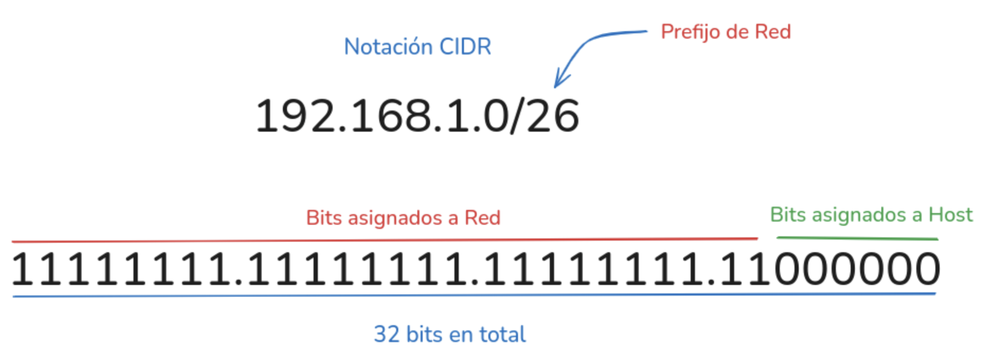
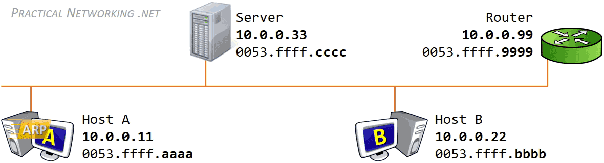
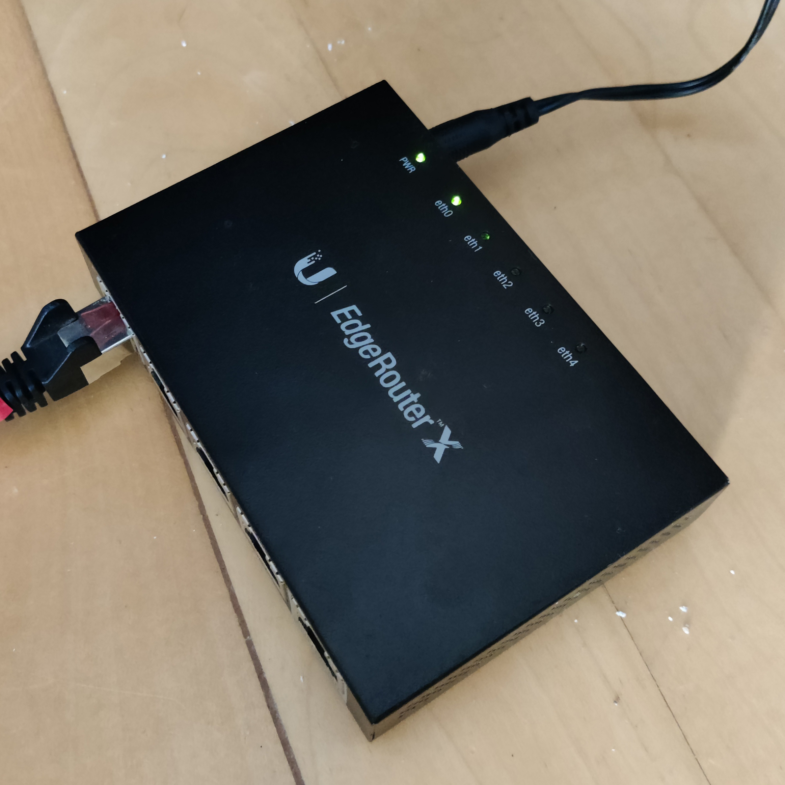

# :material-router-network: CAPA DE RED

La **capa de red** es el nivel 3 del modelo OSI y se encarga del control de la subred. Su principal función es el **encaminamiento** (routing), es decir, determinar la ruta más adecuada para que los paquetes de datos lleguen a su destino a través de diferentes redes.

En esta unidad estudiaremos cómo funciona la capa de red, qué son las direcciones IP, cómo se encaminan los paquetes, los protocolos ARP e ICMP, y cómo funcionan los routers que interconectan diferentes redes.

!!! info "<span style='font-size: 1.3em;'><strong>Objetivos de la unidad</strong></span>"
    <span style="font-size: 1.2em;">
    • Comprender las funciones principales de la capa de red<br>
    • Conocer el modelo TCP/IP y sus capas<br>
    • Entender el direccionamiento IP: clases, máscaras, subredes y CIDR<br>
    • Conocer los protocolos ARP e ICMP<br>
    • Identificar los componentes y funcionamiento de los routers<br>
    • Aplicar conceptos de encaminamiento y configuración de clientes
    </span>

## 📚 Propuesta didáctica

En esta unidad trabajamos los **RA1 y RA4 de RAL**:

> **RA1.** *Reconoce la estructura de redes locales cableadas analizando las características de entornos de aplicación y describiendo la funcionalidad de sus componentes.*
> 
> **RA4.** *Instala equipos en red, describiendo sus prestaciones y aplicando técnicas de montaje.*

### 🎯 Criterios de evaluación

#### Criterios de evaluación del RA1

* **CE1a**: Se han descrito los principios de funcionamiento de las redes locales.
* **CE1c**: Se han descrito los elementos de la red local y su función.

#### Criterios de evaluación del RA4

* **CE4a**: Se han descrito las prestaciones de los equipos de red analizando características técnicas de switches, routers y puntos de acceso.
* **CE4b**: Se han identificado los componentes de los equipos de red reconociendo interfaces, fuentes de alimentación y sistemas de ventilación.

### Contenidos

* Funciones de la capa de red.
* Modelo TCP/IP y sus capas.
* Direccionamiento IP: clases, máscaras, subredes y CIDR.
* Protocolo IP y fragmentación.
* Protocolo ARP.
* Protocolo ICMP.
* Routers: componentes, tipos de conexiones y proceso de arranque.
* Configuración de clientes en red.

!!! question "Cuestionario inicial"
    1. ¿Qué función cumple la capa de red en el modelo OSI?
    2. ¿Qué es el protocolo TCP/IP y para qué sirve?
    3. ¿Qué es una dirección IP y cómo se representa?
    4. ¿Cuál es la diferencia entre una dirección IP pública y privada?
    5. ¿Qué es una máscara de red y para qué sirve?
    6. ¿Qué es CIDR y qué ventajas ofrece?
    7. ¿Para qué sirve el protocolo ARP?
    8. ¿Qué es un router y cuál es su función principal?

---

## 📖 Conceptos generales

### 🌐 Internet: una red de redes

Internet es una red global que conecta muchas redes diferentes entre sí, usando distintas tecnologías. No depende del tipo de ordenador, sistema operativo ni del tipo de red, ya que permite que equipos muy variados, como un servidor Unix y un PC con Windows, puedan comunicarse sin problemas. Para conseguir esto, utiliza protocolos estándar y un sistema de interconexión que funciona en cualquier plataforma o red, facilitando el intercambio de información entre todo tipo de dispositivos y sistemas.

La familia de protocolos que hace posible que **Internet** funcione como una auténtica **red de redes** es la conocida como **TCP/IP**. Es importante destacar que nos referimos a una **familia de protocolos** porque engloba a numerosos protocolos diferentes, aunque a menudo, para simplificar, hablemos simplemente de TCP/IP.

### 🔗 La familia de protocolos TCP/IP

A continuación se muestran los principales protocolos de la familia TCP/IP:

| **Protocolo** | **Nombre completo** | **Ejemplo de uso** |
|---------------|----------------------|----------------------------|
| **HTTP**      | HyperText Transfer Protocol | Acceder a una página web con "http://www.ejemplo.com" |
| **HTTPS**     | HyperText Transfer Protocol Secure | Realizar compras seguras en "https://www.tiendaonline.com" |
| **FTP**       | File Transfer Protocol | Subir archivos a un servidor con FileZilla usando FTP |
| **SMTP**      | Simple Mail Transfer Protocol | Envío de correos electrónicos desde un cliente como Outlook |
| **POP3**      | Post Office Protocol v3 | Descargar e-mails de un servidor a tu ordenador con Thunderbird |
| **IMAP**      | Internet Message Access Protocol | Consultar correos almacenados en el servidor desde varios dispositivos |
| **DNS**       | Domain Name System | Traducir "www.google.com" a una dirección IP |
| **DHCP**      | Dynamic Host Configuration Protocol | Obtener automáticamente la IP al conectarse a una red WiFi |
| **TELNET**    | Telnet | Acceder remotamente a la consola de un router antiguo usando Telnet |
| **SSH**       | Secure Shell | Administrar un servidor Linux de forma segura por terminal |
| **TCP**       | Transmission Control Protocol | Descargar un archivo grande de forma fiable mediante una conexión web |
| **UDP**       | User Datagram Protocol | Realizar una videollamada o jugar online, donde la velocidad es prioritaria |
| **IP**        | Internet Protocol | Encaminamiento de paquetes entre distintos ordenadores a través de Internet |
| **ARP**       | Address Resolution Protocol | Asignar una dirección MAC a una IP para enviar un paquete dentro de una LAN |
| **ICMP**      | Internet Control Message Protocol | Comprobar la conectividad con "ping www.ejemplo.com" |
| **IGMP**      | Internet Group Management Protocol | Entrar en un grupo de transmisión multimedia (multicast) en una red local |
| **Ethernet**  | Ethernet (a nivel de acceso a red) | Conectar un PC a la red local mediante un cable de red RJ45 |

Estos protocolos permiten la comunicación e interacción entre diferentes dispositivos en la red TCP/IP.


| **Capa**                   | **Protocolos / Tecnologías principales**               |
|----------------------------|------------------------------------------------------|
| Capa de aplicación         | HTTP, SMTP, FTP, TELNET, etc.                        |
| Capa de transporte         | UDP, TCP                                             |
| Capa de red                | IP, ARP, ICMP, IGMP                                  |
| Capa de acceso a la red    | Ethernet, Token Ring, etc.                           |
| Capa física                | cable coaxial, par trenzado, etc.                    |

A continuación, profundizaremos en las características y funciones de la capa de red dentro del modelo TCP/IP.


#### 🔹 Capa de red

La **capa de red** define la forma en que un mensaje se transmite a través de distintos tipos de redes hasta llegar a su destino. El principal protocolo de esta capa es el **IP** aunque también se encuentran a este nivel los protocolos **ARP**, **ICMP** e **IGMP**. Esta capa proporciona el direccionamiento IP y determina la ruta óptima a través de los encaminadores (routers) que debe seguir un paquete desde el origen al destino.

---

## 🌐 Concepto de capa de red

### 🎯 Funciones principales

La capa de red se ocupa del **control de la subred**. Las principales funciones de este nivel son:

#### 🔹 Encaminamiento (Routing)

La principal función es la del **encaminamiento**, es decir, el tratamiento de cómo elegir la ruta más adecuada para que el bloque de datos del nivel de red (paquete) llegue a su destino. Cada destino está identificado unívocamente en la subred por una dirección IP.

#### 🔹 Tratamiento de la congestión

Otra función importante es el **tratamiento de la congestión**. Cuando hay muchos paquetes en la red, unos obstruyen a los otros generando cuellos de botella en los puntos más sensibles. Un sistema de gestión de red avanzado evitará o paliará estos problemas de congestión.

Entre el emisor y el receptor se establecen comunicaciones utilizando protocolos determinados. El mismo protocolo debe estar representado tanto en el emisor como en el receptor.

### 🔗 Redes físicas vs. redes lógicas

El concepto de red está relacionado con las **direcciones IP** que se configuren en cada ordenador, **no con el cableado**. Es decir, si tenemos varias redes dentro del mismo cableado solamente los ordenadores que pertenezcan a una misma red podrán comunicarse entre sí.

Para que los ordenadores de una red puedan comunicarse con los de otra red es necesario que existan **routers** que interconecten las redes. Un **router** o encaminador no es más que **un ordenador con varias direcciones IP, una para cada red**, que permita el tráfico de paquetes entre sus redes.

### 📦 Datagramas IP

La capa de red se encarga de **fragmentar cada mensaje en paquetes de datos** llamados **datagramas IP** y de enviarlos de forma independiente a través de la red de redes. Cada datagrama IP incluye un campo con la dirección IP de destino. Esta información se utiliza para enrutar los datagramas a través de las redes necesarias que los hagan llegar hasta su destino.

!!! tip "<span style='font-size: 1.2em;'><strong>Dato interesante</strong></span>"
    <span style="font-size: 1.1em;">
    Cada vez que visitamos una página web o recibimos un correo electrónico es habitual atravesar un número de redes comprendido entre 10 y 20, dependiendo de la distancia de los hosts. El tiempo que tarda un datagrama en atravesar 20 redes (20 routers) suele ser inferior a 600 milisegundos.
    </span>

---

## 🔢 Direccionamiento IP

### 🎯 Concepto de dirección IP

La dirección IP es el **identificador de cada host dentro de su red de redes**. Cada host conectado a una red tiene una dirección IP asignada, la cual debe ser distinta a todas las demás direcciones que estén vigentes en ese momento en el conjunto de redes visibles por el host.

En el caso de Internet, **no puede haber dos ordenadores con 2 direcciones IP (públicas) iguales**. Pero sí podríamos tener dos ordenadores con la misma dirección IP siempre y cuando pertenezcan a redes independientes entre sí (sin ningún camino posible que las comunique).

**Las direcciones IP están formadas por 4 bytes (32 bits)**. Se suelen representar de la forma a.b.c.d donde cada una de estas letras es un número comprendido **entre el 0 y el 255**. Por ejemplo la dirección IP del servidor de IBM (www.ibm.com) es 129.42.18.99.

Las direcciones IP se pueden representar

| Representación  | Rango mínimo                              | Rango máximo                                   |
|-----------------|-------------------------------------------|------------------------------------------------|
| Decimal         | **0.0.0.0**                               | **255.255.255.255**                            |
| Binario         | **00000000.00000000.00000000.00000000**   | **11111111.11111111.11111111.11111111**        |

Las tres direcciones siguientes representan a la misma máquina (podemos utilizar una calculadora científica para realizar las conversiones).

- decimal: 128.10.2.30
- hexadecimal: 80.0A.02.1E
- binario: 10000000.00001010.00000010.00011110

!!! tip "<span style='font-size: 1.2em;'><strong>Video explicativo</strong></span>"
    <span style="font-size: 1.1em;">
    Video sobre el concepto de la dirección IP, tipos, clases y máscaras de subred.
    </span>

<div style="position: relative; padding-bottom: 56.25%; height: 0; overflow: hidden; margin-top: 1em; margin-bottom: 1em;">
  <iframe src="https://www.youtube.com/embed/Fu7Ajbna4xE" 
          style="position: absolute; top: 0; left: 0; width: 100%; height: 100%;" 
          frameborder="0" 
          allow="accelerometer; autoplay; clipboard-write; encrypted-media; gyroscope; picture-in-picture" 
          allowfullscreen 
          title="Video explicativo sobre direcciones IP"></iframe>
</div>

<p style="text-align: center; font-size: 1.1em; margin-top: 0.5em;">
  Video explicativo en español sobre direcciones IP y su funcionamiento.
</p>


### 📊 Clasificación de direcciones IP

Las direcciones IP se clasifican según diferentes criterios:

#### 🔹 Por visibilidad: Públicas vs. Privadas

**Direcciones IP públicas**:

- Son visibles en todo Internet
- Un ordenador con una IP pública es accesible (visible) desde cualquier otro ordenador conectado a Internet
- Para conectarse a Internet es necesario tener una dirección IP pública

**Direcciones IP privadas (reservadas)**:

- Son visibles únicamente por otros hosts de su propia red o de otras redes privadas interconectadas por routers
- Se utilizan en las empresas para los puestos de trabajo
- Los ordenadores con direcciones IP privadas pueden salir a Internet por medio de un router (o proxy) que tenga una IP pública
- Sin embargo, desde Internet **no se puede acceder** a ordenadores con direcciones IP privadas
- Las direcciones privadas más utilizadas son:

  | Rango                          | Clase    | Notas                  |
  |--------------------------------|----------|------------------------|
  | **10.0.0.0/8**                 | Clase A  | Privada                |
  | **172.16.0.0 – 172.31.255.255**| Clase B  | Privada                |
  | **192.168.0.0/16**             | Clase C  | Privada                |

#### 🔹 Por asignación: Estáticas vs. Dinámicas

**Direcciones IP estáticas (fijas)**:

- Un host que se conecte a la red con dirección IP estática siempre lo hará con una misma IP
- Las direcciones IP públicas estáticas son las que utilizan los servidores de Internet con objeto de que estén siempre localizables por los usuarios de Internet
- Estas direcciones hay que contratarlas
- Son útiles para servidores, impresoras de red o equipos que necesiten estar siempre accesibles

**Direcciones IP dinámicas**:

- Un host que se conecte a la red mediante dirección IP dinámica, cada vez lo hará con una dirección IP distinta
- Las direcciones IP públicas dinámicas son las que se utilizan en las conexiones a Internet mediante un módem
- Los proveedores de servicios de Internet (ISP) tienen un rango de direcciones IP públicas que van asignando a sus clientes de forma dinámica
- Cuando un cliente se conecta, se le asigna una IP del rango disponible
- Cuando se desconecta, esa IP vuelve al rango disponible para asignarse a otro cliente
- Se obtienen mediante el protocolo DHCP (Dynamic Host Configuration Protocol)

<figure style="width:100%;margin:1.5em 0;">
  <iframe width="100%" height="400" src="https://www.youtube.com/embed/iHJnqDR5sF8" title="Clases de direcciones IP (video explicativo)" frameborder="0" allowfullscreen loading="lazy"></iframe>
  <figcaption style="text-align:center;font-style:italic;margin-top:0.5em;">
    Vídeo: Clases de direcciones IP (YouTube, duración 8:53)
  </figcaption>
</figure>


### 📊 Clases de direcciones IPv4

Las direcciones IPv4 se dividen tradicionalmente en **clases** según el número de redes y hosts que pueden direccionar:

| Clase    | Rango                          | Máscara por defecto  | Bits de red          | Bits de host        | Redes posibles           | Hosts por red          | Uso                                                      |
|----------|-------------------------------|----------------------|----------------------|---------------------|--------------------------|------------------------|----------------------------------------------------------|
| **A**    | 1.0.0.0 - 126.255.255.255     | 255.0.0.0 (/8)       | 8 bits (1er octeto)  | 24 bits             | 126 (2⁷-2)               | 16.777.214 (2²⁴-2)     | Grandes organizaciones o países                          |
| **B**    | 128.0.0.0 - 191.255.255.255   | 255.255.0.0 (/16)    | 16 bits (2 octetos)  | 16 bits             | 16.384 (2¹⁴)             | 65.534 (2¹⁶-2)         | Empresas medianas y grandes                              |
| **C**    | 192.0.0.0 - 223.255.255.255   | 255.255.255.0 (/24)  | 24 bits (3 octetos)  | 8 bits              | 2.097.152 (2²¹)           | 254 (2⁸-2)             | Pequeñas empresas y redes domésticas                     |
| **D**    | 224.0.0.0 - 239.255.255.255   | —                    | —                    | —                   | —                        | —                      | Multicast (comunicación a grupos de hosts)               |
| **E**    | 240.0.0.0 - 255.255.255.255   | —                    | —                    | —                   | —                        | —                      | Reservadas para uso experimental o futuro                |

<figure style="width: 100%; margin: 0;">
    
    <figcaption style="text-align: center;">Gráfico: Ejemplo de clases de direcciones IPv4</figcaption>
</figure>

### 🔍 Direcciones especiales

| Dirección            | Descripción                                                                   |
|----------------------|-------------------------------------------------------------------------------|
| 127.0.0.1 (localhost)| Dirección de loopback, utilizada para referirse al propio equipo              |
| 0.0.0.0              | Dirección no especificada                                                     |
| 255.255.255.255      | Dirección de broadcast limitado (todos los hosts de la red local)             |
| 127.0.0.0/8          | Red de loopback, utilizada para pruebas de conectividad local                 |

<figure style="width: 100%; margin: 0;">
  
  <figcaption style="text-align: center;">Clases de direcciones IP - gráfico</figcaption>
</figure>

### 🏛️ ¿Quién reparte las direcciones IP?

Las direcciones IP públicas están gestionadas por diferentes organismos:

- **IANA (Internet Assigned Numbers Authority)**: Autoridad máxima que gestiona el espacio de direcciones IP a nivel mundial
- **ICANN (Internet Corporation for Assigned Names and Numbers)**: Coordina el sistema de nombres de dominio e IP a nivel mundial
- **RIRs (Regional Internet Registries)**: Organizaciones regionales que asignan direcciones IP a los ISP de cada región:
  - **ARIN** (América del Norte)
  - **RIPE NCC** (Europa, Oriente Medio, Asia Central)
  - **APNIC** (Asia-Pacífico)
  - **LACNIC** (América Latina y Caribe)
  - **AfriNIC** (África)

---

## 🎭 Máscara de red y subredes

### 🎯 Concepto de máscara de red

La **máscara de red** (subnet mask) es un número de 32 bits que se utiliza para identificar qué parte de una dirección IP corresponde a la **red** y qué parte corresponde al **host**. La máscara de red permite determinar si dos hosts están en la misma red.

**Funcionamiento**:

- Los bits en **1** en la máscara indican que esa posición corresponde a la **red**
- Los bits en **0** indican que esa posición corresponde al **host**

**Ejemplo**:

| Elemento      | Valor                                   | Notas                                        |
|---------------|-----------------------------------------|----------------------------------------------|
| **Dirección IP**    | `192.168.1.100`                         | Dirección de ejemplo                         |
| **Máscara de red**  | `255.255.255.0`<br>(binario: `11111111.11111111.11111111.00000000`) | Indica que los primeros 24 bits son de red   |
| **Dirección de red**| `192.168.1.0`                         | Primeros 24 bits corresponden a la red       |
| **Parte host**      | `100` (últimos 8 bits)                 | Identificador único dentro de la subred      |

!!! tip "<span style='font-size: 1.2em;'><strong>Video explicativo</strong></span>"
    <span style="font-size: 1.1em;">
    Video sobre el concepto de máscara de red y subredes, con ejemplos sobre cómo funcionan y cómo calcularlas.
    </span>

<div style="position: relative; padding-bottom: 56.25%; height: 0; overflow: hidden; margin-top: 1em; margin-bottom: 1em;">
  <iframe src="https://www.youtube.com/embed/EhMI71bKSJ0" 
          style="position: absolute; top: 0; left: 0; width: 100%; height: 100%;" 
          frameborder="0" 
          allow="accelerometer; autoplay; clipboard-write; encrypted-media; gyroscope; picture-in-picture" 
          allowfullscreen 
          title="Video explicativo sobre máscaras de red y subredes"></iframe>
</div>

<p style="text-align: center; font-size: 1.1em; margin-top: 0.5em;">
  Video explicativo en español sobre máscaras de red y subredes.
</p>


---

## 📊 CIDR (Classless Inter-Domain Routing)

### 🎯 Concepto de CIDR

**CIDR (Classless Inter-Domain Routing)** es un método de asignación de direcciones IP y enrutamiento que **no depende de las clases tradicionales** (A, B, C). Fue introducido para hacer un uso más eficiente del espacio de direcciones IPv4, que se estaba agotando.

A diferencia del sistema basado en clases, donde el tamaño de las redes era fijo y podía generar un gran desperdicio de direcciones, CIDR permite dividir el espacio de direcciones en bloques mucho más flexibles y adaptados a las necesidades reales de cada red. 

Esto se logra utilizando una notación de prefijo (por ejemplo, `/24` o `/16`) que indica cuántos bits corresponden a la parte de red de una dirección IP. Gracias a CIDR, los proveedores de servicios de Internet y las organizaciones pueden asignar solo la cantidad exacta de direcciones necesarias, facilitando la administración y mejorando la eficiencia del enrutamiento global.

<figure style="width: 90%; margin: 0 auto;">
  
  <figcaption style="text-align: center;">
    <strong>Ejemplo de notación CIDR:</strong> <br>
    <span style="font-size: 1.1em;">192.168.1.0/<strong>26</strong> representa una red con 26 bits asignados a la parte de red (en rojo) y 6 bits para hosts (en verde).<br>
    En binario, la máscara se expresa como <code>11111111.11111111.11111111.11000000</code> (32 bits en total).</span>
  </figcaption>
</figure>


### 🔢 Notación CIDR

En CIDR, una dirección IP se representa junto con el número de bits que forman la parte de red, separados por una barra:

**Formato**: `dirección_ip/prefijo`

**Ejemplos**:

| Dirección CIDR        | Prefijo | Significado                                                 |
|-----------------------|---------|-------------------------------------------------------------|
| `192.168.1.0/24`      |   24    | Los primeros 24 bits corresponden a la parte de red         |
| `10.0.0.0/8`          |    8    | Los primeros 8 bits corresponden a la parte de red          |
| `172.16.0.0/16`       |   16    | Los primeros 16 bits corresponden a la parte de red         |

**Equivalencia con máscaras**:

| Prefijo CIDR | Máscara decimal          | Máscara binaria                  | Nº direcciones |
|--------------|-------------------------|----------------------------------|---------------|
| /8           | 255.0.0.0               | 11111111.00000000.00000000.00000000 | 16.777.216    |
| /16          | 255.255.0.0             | 11111111.11111111.00000000.00000000 | 65.536        |
| /24          | 255.255.255.0           | 11111111.11111111.11111111.00000000 | 256           |
| /26          | 255.255.255.192         | 11111111.11111111.11111111.11000000 | 64            |
| /28          | 255.255.255.240         | 11111111.11111111.11111111.11110000 | 16            |

### ✅ Ventajas de CIDR

**Uso eficiente del espacio de direcciones**:

- Permite asignar exactamente el número de direcciones necesarias
- Evita desperdiciar direcciones (no hay que usar toda una clase)

**Agregación de rutas (superredes)**:

- Permite agrupar múltiples redes en una sola entrada en la tabla de enrutamiento
- Simplifica las tablas de routing en los routers
- Reduce el tamaño de las tablas de enrutamiento de Internet

**Flexibilidad**:

- No está limitado a los tamaños fijos de las clases tradicionales
- Permite crear subredes de cualquier tamaño

## 🗂️ Tabla de equivalencias CIDR

A continuación se muestra una tabla de referencia rápida para asociar el número de direcciones, bits, prefijos y máscaras de subred en formato decimal, útil para planificar y calcular subredes de forma eficiente.

<!-- | IPs totales | Bits host | Prefijo CIDR | Máscara decimal         |
|-------------|-----------|--------------|-------------------------|
|      1      |     0     | /32          | 255.255.255.255         |
|      2      |     1     | /31          | 255.255.255.254         |
|      4      |     2     | /30          | 255.255.255.252         |
|      8      |     3     | /29          | 255.255.255.248         |
|     16      |     4     | /28          | 255.255.255.240         |
|     32      |     5     | /27          | 255.255.255.224         |
|     64      |     6     | /26          | 255.255.255.192         |
|    128      |     7     | /25          | 255.255.255.128         |
|    256      |     8     | /24          | 255.255.255.0           |
|    512      |     9     | /23          | 255.255.254.0           |
|   1024      |    10     | /22          | 255.255.252.0           |
|   2048      |    11     | /21          | 255.255.248.0           |
|   4096      |    12     | /20          | 255.255.240.0           |
|   8192      |    13     | /19          | 255.255.224.0           |
|  16384      |    14     | /18          | 255.255.192.0           |
|  32768      |    15     | /17          | 255.255.128.0           |
|  65536      |    16     | /16          | 255.255.0.0             |
| 131072      |    17     | /15          | 255.254.0.0             |
| 262144      |    18     | /14          | 255.252.0.0             |
| 524288      |    19     | /13          | 255.248.0.0             |
|1048576      |    20     | /12          | 255.240.0.0             |
|2097152      |    21     | /11          | 255.224.0.0             |
|4194304      |    22     | /10          | 255.192.0.0             |
|8388608      |    23     | /9           | 255.128.0.0             |
|16777216     |    24     | /8           | 255.0.0.0               | -->

> Fuente: RIPE NCC  
> 

[Enlace oficial a la documentación de CIDR (IETF RFC 4632)](https://datatracker.ietf.org/doc/html/rfc4632)


Esta tabla te ayudará rápidamente a identificar la máscara correspondiente a cualquier prefijo CIDR, y viceversa. Muy útil en ejercicios de subnetting y supernetting.

---

## 📐 Métodos sencillos de cálculo de subredes

Para configurar correctamente una red, necesitamos saber calcular varios parámetros importantes. A continuación veremos métodos sencillos y prácticos para realizar estos cálculos sin necesidad de convertir a binario.

### 🎯 Cálculo con máscaras estándar (clases A, B, C)

Este método es el más sencillo y funciona cuando usamos máscaras por defecto de las clases tradicionales.

#### 🔹 Clase C (máscara 255.255.255.0 o /24)

**Ejemplo:** IP `192.168.1.100` con máscara `255.255.255.0`

**Pasos:**

1. **Dirección de red**: Copiamos los 3 primeros octetos y ponemos el último en 0

   - Resultado: `192.168.1.0`

2. **Dirección de broadcast**: Copiamos los 3 primeros octetos y ponemos el último en 255

   - Resultado: `192.168.1.255`

3. **Primera IP válida**: Dirección de red + 1

   - Resultado: `192.168.1.1`

4. **Última IP válida**: Dirección de broadcast - 1

   - Resultado: `192.168.1.254`

5. **Número de hosts**: 2^8 - 2 = 256 - 2 = **254 hosts**

#### 🔹 Clase B (máscara 255.255.0.0 o /16)

**Ejemplo:** IP `172.16.50.100` con máscara `255.255.0.0`

**Pasos:**

1. **Dirección de red**: Copiamos los 2 primeros octetos y ponemos los últimos 2 en 0

   - Resultado: `172.16.0.0`

2. **Dirección de broadcast**: Copiamos los 2 primeros octetos y ponemos los últimos 2 en 255

   - Resultado: `172.16.255.255`

3. **Primera IP válida**: `172.16.0.1`

4. **Última IP válida**: `172.16.255.254`

5. **Número de hosts**: 2^16 - 2 = 65.536 - 2 = **65.534 hosts**

#### 🔹 Clase A (máscara 255.0.0.0 o /8)

**Ejemplo:** IP `10.5.20.100` con máscara `255.0.0.0`

**Pasos:**

1. **Dirección de red**: Copiamos el primer octeto y ponemos los últimos 3 en 0

   - Resultado: `10.0.0.0`

2. **Dirección de broadcast**: Copiamos el primer octeto y ponemos los últimos 3 en 255

   - Resultado: `10.255.255.255`

3. **Primera IP válida**: `10.0.0.1`

4. **Última IP válida**: `10.255.255.254`

5. **Número de hosts**: 2^24 - 2 = 16.777.216 - 2 = **16.777.214 hosts**

<!-- ### 🎯 Método 2: Cálculo con máscaras no estándar (subnetting)

Cuando usamos máscaras que no son las estándar, necesitamos un método más preciso. Vamos a ver el método del "salto de red" o "incremento".

#### 📊 Tabla de valores de máscara

Primero, necesitamos conocer estos valores clave:

| Bits de host | Máscara (último octeto) | Incremento | Hosts por red |
|--------------|-------------------------|------------|---------------|
| 8 bits       | 255.255.255.0 (0)       | 1          | 254           |
| 7 bits       | 255.255.255.128 (128)   | 128        | 126           |
| 6 bits       | 255.255.255.192 (192)   | 64         | 62            |
| 5 bits       | 255.255.255.224 (224)   | 32         | 30            |
| 4 bits       | 255.255.255.240 (240)   | 16         | 14            |
| 3 bits       | 255.255.255.248 (248)   | 8          | 6             |
| 2 bits       | 255.255.255.252 (252)   | 4          | 2             |
| 1 bit        | 255.255.255.254 (254)   | 2          | 0 (no válida) |

#### 🔢 Ejemplo práctico: IP 192.168.1.100 con máscara 255.255.255.224 (/27)

**Paso 1: Identificar el incremento**

- Máscara: `255.255.255.224` → El último octeto es 224
- Según la tabla, 224 corresponde a un incremento de **32**

**Paso 2: Calcular la dirección de red**

- Tomamos el último octeto de la IP: `100`
- Dividimos por el incremento: `100 ÷ 32 = 3,125`
- Tomamos la parte entera: `3`
- Multiplicamos: `3 × 32 = 96`
- Dirección de red: `192.168.1.96`

**Paso 3: Calcular la dirección de broadcast**

- Dirección de red: `192.168.1.96`
- Sumamos el incremento: `96 + 32 = 128`
- Restamos 1: `128 - 1 = 127`
- Dirección de broadcast: `192.168.1.127`

**Paso 4: Calcular el rango de hosts**

- Primera IP válida: `192.168.1.97` (red + 1)
- Última IP válida: `192.168.1.126` (broadcast - 1)

**Paso 5: Calcular número de hosts**

- Bits de host: 5 (32 - 27 = 5)
- Fórmula: 2^5 - 2 = 32 - 2 = **30 hosts**

#### 🔢 Ejemplo práctico: IP 10.20.50.75 con máscara 255.255.255.240 (/28)

**Paso 1: Identificar el incremento**

- Máscara: `255.255.255.240` → Incremento de **16**

**Paso 2: Calcular la dirección de red**

- Último octeto: `75`
- `75 ÷ 16 = 4,6875` → parte entera: `4`
- `4 × 16 = 64`
- Dirección de red: `10.20.50.64`

**Paso 3: Calcular la dirección de broadcast**

- `64 + 16 - 1 = 79`
- Dirección de broadcast: `10.20.50.79`

**Paso 4: Calcular el rango de hosts**

- Primera IP válida: `10.20.50.65`
- Última IP válida: `10.20.50.78`

**Paso 5: Calcular número de hosts**

- Bits de host: 4 (32 - 28 = 4)
- 2^4 - 2 = 16 - 2 = **14 hosts**

### 🎯 Método 3: Cálculo rápido con notación CIDR

Cuando trabajamos con notación CIDR (ejemplo: `/24`, `/27`, `/28`), podemos usar este método rápido:

#### 📋 Pasos generales:

1. **Identificar bits de red y host:**

   - Prefijo CIDR = bits de red
   - Bits de host = 32 - prefijo CIDR

2. **Calcular número de hosts:**

   - Hosts = 2^(bits de host) - 2

3. **Calcular incremento:**

   - Incremento = 2^(bits de host)

4. **Calcular dirección de red:**

   - Dividir el último octeto relevante entre el incremento
   - Multiplicar la parte entera por el incremento

5. **Calcular broadcast:**

   - Broadcast = dirección de red + incremento - 1

#### 🔢 Ejemplo: 192.168.10.154/26

**Datos:**

- Prefijo: `/26` → 26 bits de red, 6 bits de host
- Incremento: 2^6 = 64
- Hosts: 2^6 - 2 = 64 - 2 = **62 hosts**

**Cálculo de dirección de red:**

- Último octeto: `154`
- `154 ÷ 64 = 2,40625` → parte entera: `2`
- `2 × 64 = 128`
- Dirección de red: `192.168.10.128`

**Cálculo de broadcast:**

- `128 + 64 - 1 = 191`
- Dirección de broadcast: `192.168.10.191`

**Rango de hosts:**

- Primera IP: `192.168.10.129`
- Última IP: `192.168.10.190`

### 💡 Trucos y consejos prácticos

#### ✅ Reglas rápidas para recordar:

1. **Dirección de red siempre termina en múltiplo del incremento:**

   - Si incremento = 32 → red termina en 0, 32, 64, 96, 128, 160, 192, 224
   - Si incremento = 16 → red termina en 0, 16, 32, 48, 64, 80, 96, 112, 128, 144, 160, 176, 192, 208, 224, 240

2. **Dirección de broadcast siempre es una menos que el siguiente múltiplo:**

   - Si red = 192.168.1.96 e incremento = 32 → broadcast = 192.168.1.127 (96 + 32 - 1)

3. **Primera IP válida siempre es red + 1**

4. **Última IP válida siempre es broadcast - 1**

5. **Número de hosts siempre es potencia de 2 menos 2:**

   - /24 → 2^8 - 2 = 254
   - /25 → 2^7 - 2 = 126
   - /26 → 2^6 - 2 = 62
   - /27 → 2^5 - 2 = 30
   - /28 → 2^4 - 2 = 14
   - /29 → 2^3 - 2 = 6
   - /30 → 2^2 - 2 = 2 -->

#### ⚠️ Errores comunes a evitar:

1. **No usar la dirección de red ni broadcast para hosts**

   - ❌ Incorrecto: Asignar `192.168.1.0` o `192.168.1.255` a un equipo
   - ✅ Correcto: Usar `192.168.1.1` hasta `192.168.1.254`

2. **No olvidar restar 2 al calcular hosts**

   - ❌ Incorrecto: 2^8 = 256 hosts
   - ✅ Correcto: 2^8 - 2 = 254 hosts

3. **Verificar que la IP esté en el rango correcto**

   - Si calculas red `192.168.1.96` e incremento `32`, las IPs válidas son 97-126
   - La IP `192.168.1.100` SÍ está en el rango
   - La IP `192.168.1.130` NO está en el rango (pertenece a otra subred)

### 🧮 Ejemplo práctico: Cálculo de dirección de red, broadcast y hosts

Vamos a ver un ejemplo práctico y sencillo para calcular todos los parámetros de una subred. Este tipo de cálculos son fundamentales para configurar correctamente una red.

#### 📋 Datos del ejemplo

Supongamos que tenemos un ordenador con la siguiente configuración:

- **Dirección IP**: `192.168.1.100`
- **Máscara de subred**: `255.255.255.0` (equivalente a `/24` en notación CIDR)

#### 🔢 Paso 1: Identificar la clase y la máscara

- La dirección `192.168.1.100` pertenece a la **clase C** (empieza por 192)
- La máscara `255.255.255.0` significa que los primeros **24 bits** identifican la red
- Los últimos **8 bits** identifican los hosts

#### 🎯 Paso 2: Calcular la dirección de red

La **dirección de red** es la primera dirección de la subred. Se obtiene poniendo todos los bits de host en **0**.

**Cálculo:**

- IP: `192.168.1.100`
- Máscara: `255.255.255.0`
- Dirección de red: `192.168.1.0` (último octeto en 0)

**Explicación sencilla:** Todos los equipos que tengan IPs desde `192.168.1.1` hasta `192.168.1.254` pertenecen a la misma red, que se identifica como `192.168.1.0`.

#### 📢 Paso 3: Calcular la dirección de broadcast

La **dirección de broadcast** es la última dirección de la subred. Se obtiene poniendo todos los bits de host en **1**.

**Cálculo:**

- Dirección de broadcast: `192.168.1.255` (último octeto en 255)

**Explicación sencilla:** Esta dirección se utiliza para enviar un mensaje a **todos los equipos** de la red a la vez.

#### 💻 Paso 4: Calcular el rango de direcciones IP válidas para hosts

Las direcciones IP válidas para asignar a equipos son todas las que están **entre** la dirección de red y la de broadcast.

**Cálculo:**

- **Primera IP válida**: Dirección de red + 1 = `192.168.1.0 + 1` = `192.168.1.1`
- **Última IP válida**: Dirección de broadcast - 1 = `192.168.1.255 - 1` = `192.168.1.254`

**Rango de hosts:** `192.168.1.1` a `192.168.1.254`

#### 🔢 Paso 5: Calcular el número de hosts disponibles

Para calcular cuántos equipos podemos conectar en esta red:

**Fórmula:** 2^n - 2

Donde:

- **n** = número de bits de host (en este caso, 8 bits)
- Se restan 2 porque la dirección de red y la de broadcast no se pueden asignar a equipos

**Cálculo:**

- 2^8 - 2 = 256 - 2 = **254 hosts**

#### 📊 Resumen del ejemplo

| Concepto | Valor | Explicación |
|----------|-------|-------------|
| **Dirección IP del equipo** | `192.168.1.100` | IP que tiene configurada nuestro ordenador |
| **Máscara de subred** | `255.255.255.0` o `/24` | Indica que 24 bits son para la red |
| **Dirección de red** | `192.168.1.0` | Primera dirección de la subred |
| **Dirección de broadcast** | `192.168.1.255` | Última dirección de la subred |
| **Primera IP válida** | `192.168.1.1` | Primera dirección que podemos asignar a un equipo |
| **Última IP válida** | `192.168.1.254` | Última dirección que podemos asignar a un equipo |
| **Número de hosts** | **254 equipos** | Cantidad máxima de dispositivos que podemos conectar |

#### 💡 Ejemplo práctico en un aula

Imagina que en un aula de informática queremos configurar una red:

- **Red asignada**: `192.168.1.0/24`
- **Router (puerta de enlace)**: `192.168.1.1` (primera IP válida)
- **PCs del aula**: `192.168.1.2` hasta `192.168.1.50` (49 ordenadores)
- **Impresoras**: `192.168.1.51` hasta `192.168.1.53` (3 impresoras)
- **Servidor**: `192.168.1.100` (nuestro ejemplo)
- **Resto disponible**: hasta `192.168.1.254` (para futuras ampliaciones)

Todas estas direcciones pertenecen a la misma red y pueden comunicarse entre sí directamente, sin necesidad de router.

---


<!-- ### 📏 Subnetting (División en subredes)

El **subnetting** consiste en dividir una red grande en **subredes más pequeñas** para aprovechar mejor el espacio de direcciones y organizar mejor la red.

**Motivos para crear subredes**:
- Organizar la red de forma lógica (por departamentos, plantas, etc.)
- Reducir el tráfico de broadcast (cada subred es un dominio de broadcast)
- Mejorar la seguridad (aislar segmentos de red)
- Optimizar el uso de direcciones IP

**Ejemplo de subnetting**:
Si tenemos la red `192.168.1.0/24` (256 direcciones) y queremos crear 4 subredes:
- Podemos usar una máscara `/26` (255.255.255.192)
- Esto nos da 4 subredes de 64 direcciones cada una:
  - Subred 1: `192.168.1.0/26` (hosts: 1-62)
  - Subred 2: `192.168.1.64/26` (hosts: 65-126)
  - Subred 3: `192.168.1.128/26` (hosts: 129-190)
  - Subred 4: `192.168.1.192/26` (hosts: 193-254)

### 🔀 Superredes (Supernetting)

Una **superred** (supernet) es la agrupación de varias redes contiguas en una única red más grande mediante CIDR. Esto permite reducir el número de entradas en las tablas de enrutamiento.

**Ejemplo**:
Si tenemos las redes:
- `192.168.0.0/24`
- `192.168.1.0/24`
- `192.168.2.0/24`
- `192.168.3.0/24`

Podemos agruparlas en una superred: `192.168.0.0/22` -->


## 📦 Protocolo IP

### 🎯 Características del protocolo IP

El **Protocolo IP (Internet Protocol)** es el protocolo principal de la capa de red. Es responsable de enrutar paquetes desde el origen hasta el destino a través de múltiples redes.

**Características principales**:

#### 🔹 No orientado a conexión

IP es un protocolo **no orientado a conexión** (connectionless). Esto significa que:

- No establece una conexión antes de enviar los datos
- Cada paquete se envía independientemente
- Los paquetes pueden seguir rutas diferentes para llegar al mismo destino

#### 🔹 No fiable

IP es un protocolo **no fiable** (unreliable). Esto significa que:

- No garantiza que los paquetes lleguen a su destino
- No garantiza que lleguen en orden
- No garantiza que lleguen sin duplicados
- No notifica al emisor si un paquete se pierde

La fiabilidad debe ser proporcionada por protocolos de capas superiores (como TCP) si es necesaria.

#### 🔹 Basado en "mejor esfuerzo" (Best Effort)

IP hace su "mejor esfuerzo" para entregar los paquetes, pero no garantiza la entrega.

### 📦 Formato del datagrama IP

Un **datagrama IP** tiene la siguiente estructura:

**Campos principales**:

1. **Versión** (4 bits): Versión del protocolo IP (actualmente IPv4 o IPv6)
2. **Longitud de cabecera** (4 bits): Longitud de la cabecera IP en palabras de 32 bits
3. **Tipo de servicio** (8 bits): Indica la calidad de servicio deseada
4. **Longitud total** (16 bits): Longitud total del datagrama (cabecera + datos)
5. **Identificador** (16 bits): Identificador único para fragmentación
6. **Banderas** (3 bits): Controlan la fragmentación
7. **Desplazamiento de fragmento** (13 bits): Posición del fragmento en el datagrama original
8. **TTL (Time To Live)** (8 bits): Contador que se decrementa en cada router; cuando llega a 0, el paquete se descarta
9. **Protocolo** (8 bits): Indica el protocolo de capa superior (TCP=6, UDP=17, ICMP=1)
10. **Checksum de cabecera** (16 bits): Verificación de integridad de la cabecera
11. **Dirección IP origen** (32 bits): IP del emisor
12. **Dirección IP destino** (32 bits): IP del receptor
13. **Opciones** (variable): Campos opcionales (poco utilizados)
14. **Datos** (variable): Datos de capas superiores


<figure style="width: 100%; margin: 0;">
    
    <figcaption style="text-align: center;">Figura: Formato de un datagrama IP con sus campos principales.</figcaption>
</figure>


### ✂️ Fragmentación

La **fragmentación** es el proceso de dividir un datagrama IP en fragmentos más pequeños cuando el tamaño del datagrama es mayor que el **MTU** de un enlace por el que debe pasar.

#### 📏 ¿Qué es el MTU?

El **MTU (Maximum Transmission Unit)** es el **tamaño máximo** que puede tener el payload (carga útil) de una trama de la capa de acceso a la red al enviarse por una interfaz. En la práctica, el MTU incluye la cabecera IP, la cabecera de la capa de transporte (TCP/UDP) y los datos de la aplicación; no se cuenta la cabecera ni la cola de la trama de capa 2.

El tamaño del MTU **depende del protocolo de capa 2** que se utilice. Algunos valores habituales:

| Protocolo (capa 2) | MTU típico |
|--------------------|------------|
| Ethernet           | 1500 bytes |
| PPPoE              | 1492 bytes |
| Algunos enlaces WAN | 576–1500 bytes |

!!! tip "¿Por qué limitar el tamaño?"
    Si las tramas son demasiado grandes en un enlace con errores, al perder una trama hay que retransmitir muchos datos y se pierde eficiencia. Si son demasiado pequeñas, los dispositivos deben procesar muchas cabeceras. El MTU se elige para lograr un equilibrio de **eficiencia** en cada tecnología. En Ethernet es habitual usar **1500 bytes**.

#### 🔄 ¿Cuándo se fragmenta?

- Cuando un router debe enviar un datagrama por una interfaz cuyo **MTU es menor** que el tamaño del datagrama, el router **fragmenta** el datagrama en varios **paquetes** (fragmentos) que caben en ese MTU.
- Si más adelante hay otro enlace con MTU aún menor, esos fragmentos pueden **volver a fragmentarse** en el siguiente router.
- **Solo el dispositivo destino final** puede reensamblar los fragmentos en el datagrama original; los routers intermedios no reensamblan, solo reenvían o vuelven a fragmentar si hace falta.

#### 📋 Proceso general de la fragmentación

1. El dispositivo que envía el datagrama determina la interfaz de salida (según el enrutamiento).
2. Se **compara el tamaño del datagrama** con el **MTU de esa interfaz**. Si el datagrama es mayor que el MTU, se procede a fragmentar.
3. Se generan varios **paquetes** (fragmentos), cada uno con su propia cabecera IP.
4. Los fragmentos se envían de forma independiente y pueden seguir rutas distintas.
5. **Solo el host destino** reensambla todos los fragmentos en el datagrama original.

!!! tip "Nota"
    En la fragmentación se suele llamar **datagrama** al mensaje original antes de fragmentar, y **paquete** o **fragmento** a cada trozo resultante. Solo el **primer fragmento** lleva la cabecera de la capa de transporte (TCP o UDP); el resto solo llevan cabecera IP y datos.

#### 🔧 Campos de la cabecera IP usados en la fragmentación

1. **Identificador (Identification)** — 16 bits
  
  - Identifica de forma única el datagrama original. **Todos los fragmentos del mismo datagrama llevan el mismo valor** para que el destino sepa cuáles unir.

2. **Banderas (Flags)** — 3 bits

  - Primer bit: reservado (no se usa, suele ser 0).  
  - **DF (Don't Fragment)**: si vale 1, el datagrama **no debe fragmentarse**. Si un router no puede enviarlo sin fragmentar (por el MTU), lo **descarta** y puede enviar un mensaje de error (ICMP) al origen.  
  - **MF (More Fragments)**: si vale 1, indica que **hay más fragmentos**; si vale 0, es el **último fragmento** del datagrama.

3. **Desplazamiento de fragmento (Fragment Offset)** — 13 bits
  
  - Indica la **posición** de los datos de este fragmento dentro del datagrama original. Se expresa en **unidades de 8 bytes**, lo que permite direccionar hasta 65535 × 8 bytes. Con esto el destino sabe en qué orden colocar cada fragmento al reensamblar.

!!! note "Resumen"
    Con el **Identificador** se agrupan los fragmentos del mismo datagrama; con **MF** se sabe si faltan más; con el **Fragment Offset** se reconstruye el datagrama en el orden correcto.

---

## 🔍 Protocolo ARP (Address Resolution Protocol)

### 🎯 ¿Qué es ARP?

**ARP (Address Resolution Protocol)** es un protocolo de capa de red (nivel 3 OSI) que permite a un host obtener la **dirección MAC** (capa 2) asociada a una **dirección IP** dentro de una red local (LAN). Opera en la capa de enlace de datos a la hora de enviar la trama: su función es **mapear direcciones IP (lógicas) a direcciones MAC (físicas)**.

ARP solo funciona en redes que utilizan difusión (broadcast), como Ethernet. Sin ARP, un equipo no podría enviar tramas a otro en la misma red, porque la capa 2 trabaja con direcciones MAC y la capa 3 con direcciones IP.

### 📋 Características de ARP

- **Mapeo de direcciones**: Traduce IP → MAC para que la trama pueda enviarse por la red local.
- **Tipos de mensajes**: Utiliza **solicitudes ARP (ARP Request)** y **respuestas ARP (ARP Reply)**.
- **Caché ARP**: Mantiene una tabla donde guarda temporalmente las correspondencias IP-MAC para no repetir consultas.

### 🔄 Proceso de ARP

Cuando un dispositivo quiere enviar datos a otro en la **misma red**, necesita en primer lugar su **IP** (para la capa 3) y su **MAC** (para la capa 2). ARP se encarga de descubrir la MAC asociada a esa IP:

1. **Solicitud ARP (ARP Request)**  
   El host origen envía un mensaje **por broadcast** (dirección MAC destino `FF:FF:FF:FF:FF:FF`) preguntando: *«¿Qué dispositivo tiene la IP X.X.X.X?»*

2. **Respuesta ARP (ARP Reply)**  
   Solo el dispositivo con esa IP responde **en unicast** indicando: *«Yo tengo esa IP y mi dirección MAC es XX:XX:XX:XX:XX:XX»*.

3. **Actualización de la caché**  
   El solicitante guarda la relación IP-MAC en su **tabla ARP** para usarla en envíos futuros sin repetir la consulta.

4. **Envío de los datos**  
   A partir de ese momento, el host puede enviar la **trama IP** con la dirección MAC destino correcta.

De esta forma, los dispositivos van construyendo sus tablas ARP: cada entrada asocia una IP con una MAC, de modo que no tienen que repetir el proceso de descubrimiento cada vez que envían un paquete al mismo destino.

### 📋 Ejemplo de funcionamiento

Cuando una máquina necesita comunicarse con otra en una red, necesita conocer en primera instancia su IP para poder enviar el paquete a su destino, pero en la capa 2 del modelo OSI, utiliza direcciones MAC. El protocolo ARP entra en juego en este momento, dado que envía los mensajes pertinentes para averiguar la dirección MAC asociada a una IP concreta.



!!! note "Funcionamiento básico de ARP"
    Cuando un dispositivo necesita comunicarse con otro en la red local, envía un mensaje ARP por broadcast preguntando qué equipo tiene la IP de destino. Solo el dispositivo que posee esa IP responde, identificándose y proporcionando su dirección MAC.

De esta forma, los dispositivos en la red van construyendo sus tablas ARP, donde cada entrada hace corresponder una IP con su MAC, de tal forma que si tuvieran que volver a enviar mensajes a esas máquinas, ya no necesitan pasar por el proceso de averiguación de direcciones MAC.

### 🧪 Ejemplo ARP: Comunicación entre PC y Portátil

Supuesto: Las tablas ARP y MAC están vacías, pero todos los dispositivos tienen IP asignada correctamente. Se desea enviar un mensaje desde **PC** a **Portátil2**, ambos en la misma red.

---

#### 🔁 Paso 1: PC → Portátil2

##### ARP Request (PC pregunta por la MAC de Portátil2)

| MAC Origen | MAC Destino           | IP Origen | IP Destino     |
|------------|------------------------|-----------|----------------|
| MAC de PC  | FF:FF:FF:FF:FF:FF (Broadcast) | IP de PC  | IP de Portátil2 |

---

##### ARP Reply (Portátil2 responde con su MAC)

| MAC Origen      | MAC Destino | IP Origen     | IP Destino |
|-----------------|-------------|---------------|------------|
| MAC de Portátil2 | MAC de PC   | IP de Portátil2 | IP de PC   |

---

##### Trama IP (PC envía datos a Portátil2)

| MAC Origen | MAC Destino      | IP Origen | IP Destino     |
|------------|------------------|-----------|----------------|
| MAC de PC  | MAC de Portátil2 | IP de PC  | IP de Portátil2 |

---

#### 🔁 Paso 2: Portátil2 → PC

##### ARP Request (Portátil2 pregunta por la MAC de PC)

| MAC Origen      | MAC Destino           | IP Origen     | IP Destino |
|-----------------|------------------------|---------------|------------|
| MAC de Portátil2 | FF:FF:FF:FF:FF:FF (Broadcast) | IP de Portátil2 | IP de PC   |

---

##### ARP Reply (PC responde con su MAC)

| MAC Origen | MAC Destino      | IP Origen | IP Destino     |
|------------|------------------|-----------|----------------|
| MAC de PC  | MAC de Portátil2 | IP de PC  | IP de Portátil2 |

---

##### Trama IP (Portátil2 responde al mensaje)

| MAC Origen      | MAC Destino | IP Origen     | IP Destino |
|-----------------|-------------|---------------|------------|
| MAC de Portátil2 | MAC de PC   | IP de Portátil2 | IP de PC   |

---

### 💡 Notas

- Las tablas ARP de ambos dispositivos se actualizan durante el proceso.
- Los switches actualizan sus tablas MAC al recibir tramas con nuevas direcciones.
- El enrutador **no participa**, ya que es una comunicación local (misma subred).

### ⚠️ Limitaciones de ARP

- Solo funciona dentro de la **misma red local** (mismo dominio de broadcast).
- No puede resolver direcciones IP de otras redes.
- Para comunicarse con hosts en otras redes se usa la **puerta de enlace (router)**; en ese caso, ARP se usa para obtener la MAC del router en la interfaz de la red local.

### 🔒 Seguridad: ARP Spoofing

**ARP Spoofing** es una vulnerabilidad en la que un atacante envía mensajes ARP falsos para asociar su MAC a la IP de otro dispositivo (por ejemplo, la del router o de un equipo de la red). Así puede interceptar o redirigir el tráfico. En redes sensibles se utilizan mecanismos como **ARP inspection** o listas estáticas para mitigar este riesgo.

---

## 📡 Protocolo ICMP (Internet Control Message Protocol)

### 🎯 ¿Qué es ICMP?

**ICMP (Internet Control Message Protocol)** es un protocolo utilizado para enviar mensajes de **control y error** entre hosts y routers en una red IP. Aunque ICMP se encuentra en la capa de red, se considera parte del protocolo IP.


### 📋 Funciones principales

ICMP se utiliza para:

1. **Informar sobre errores**: Notificar cuando un paquete no puede ser entregado
2. **Diagnóstico de red**: Herramientas como `ping` y `traceroute` usan ICMP
3. **Control de flujo**: Avisar a un emisor cuando debe reducir la velocidad de envío

### 🔧 Mensajes ICMP comunes

#### 🔹 Echo Request / Echo Reply (Ping)

- **Echo Request**: Se envía para verificar si un host está activo
- **Echo Reply**: Respuesta del host indicando que está activo
- Herramienta: `ping` usa estos mensajes

**Ejemplo**:
```bash
ping 8.8.8.8
```
Esto envía mensajes ICMP Echo Request a la dirección 8.8.8.8 (servidor DNS de Google)

#### 🔹 Destination Unreachable

- Se envía cuando un router o host no puede entregar un paquete
- Puede indicar: red inalcanzable, host inalcanzable, puerto inalcanzable, etc.

#### 🔹 Time Exceeded

- Se envía cuando el TTL de un paquete llega a cero
- También se usa por `traceroute` para descubrir la ruta

#### 🔹 Redirect

- Un router informa a un host de que hay una ruta mejor para llegar a un destino

### 🔧 Herramientas que usan ICMP

- **ping**: Verifica conectividad y latencia
- **traceroute** / **tracert**: Muestra la ruta que siguen los paquetes
- **pathping**: Combina ping y traceroute

---

##  Routers

### 🎯 Concepto

Un **router** —también conocido como **enrutador o encaminador** de paquetes— es un dispositivo que proporciona conectividad a **nivel de red** o nivel tres en el modelo OSI. Su función principal consiste en enviar o encaminar paquetes de datos de una red a otra, es decir, **interconectar subredes**, entendiendo por subred un conjunto de máquinas IP que se pueden comunicar sin la intervención de un encaminador.

<figure style="align: center;">
    
    <figcaption style="text-align: center;">Ejemplo de router doméstico (SOHO)</figcaption>
</figure>

### 🔌 Tipos de conexiones

Los tres tipos básicos de conexiones de un router son:

#### 🔹 Interfaces LAN

Las **interfaces LAN** permiten que el router pueda conectarse a la red de área local. Esto es por lo general algún tipo de Ethernet. Sin embargo, podría haber alguna otra tecnología LAN tales como Token Ring o modo de transferencia asíncrono (ATM).

#### 🔹 Interfaces WAN

Las conexiones de **red de área amplia (WAN)** proporcionan conexiones a través de un proveedor de servicio a un sitio lejano o con Internet. Estos pueden ser conexiones en serie o cualquier número de otras interfaces WAN. Con algunos tipos de interfaces WAN, se requiere un dispositivo externo, para conectar el router a la conexión local del proveedor de servicios. Con otros tipos de conexiones WAN, el router puede estar conectado directamente al proveedor de servicios.

#### 🔹 Puertos de gestión

La función de los **puertos de gestión** es diferente de las demás conexiones. Las conexiones LAN y WAN proporcionan conexiones de red a través del cual se transmiten los paquetes. El puerto de gestión proporciona una conexión basada en texto para la configuración y solución de problemas del enrutador. Las interfaces de administración comunes son la consola y el puerto auxiliar. Estos son puertos serie asíncronos EIA-232. Se conectan a un puerto de comunicaciones en un ordenador. El equipo debe ejecutar un programa de emulación de terminal para proporcionar una sesión basada en texto con el router. A través de esta sesión el administrador de red puede administrar el dispositivo.

<figure style="align: center;">
    
    <figcaption style="text-align: center;">Ejemplo de router con interfaces LAN y WAN visibles</figcaption>
</figure>

<!-- ### 💾 Almacenamiento

Un router contiene varios tipos de memoria, cada una con un propósito específico:

#### 🔹 ROM (Read Only Memory)

La **memoria de solo lectura (ROM)** se utiliza para almacenar de forma permanente el código de diagnóstico de inicio (Monitor de ROM). Las tareas principales de la ROM son:

- El diagnóstico del hardware durante el arranque del router
- La carga del software IOS de Cisco desde la memoria flash a la RAM

Algunos routers también tienen una versión más básica del IOS que puede usarse como fuente alternativa de arranque. Las memorias ROM **no se pueden borrar**. Sólo pueden actualizarse reemplazando los chips de ROM.

#### 🔹 RAM (Random Access Memory)

La **memoria de acceso aleatorio (RAM)** se usa para:

- La información de las tablas de enrutamiento
- El caché de conmutación rápida
- La configuración actual (running-config)
- Las colas de paquetes

En la mayoría de los routers, la RAM proporciona espacio de tiempo de ejecución para el software IOS de Cisco y sus subsistemas. Por lo general, la RAM se divide de forma lógica en memoria del procesador principal y memoria compartida de entrada/salida (I/O). El contenido de la RAM **se pierde cuando se apaga la unidad**.

#### 🔹 Memoria Flash

La **memoria flash** se utiliza para almacenar una imagen completa del software IOS de Cisco. Normalmente el router adquiere el IOS por defecto de la memoria flash. Estas imágenes pueden actualizarse cargando una nueva imagen en la memoria flash. El IOS puede estar comprimido o no. En la mayoría de los routers, una copia ejecutable del IOS se transfiere a la RAM durante el proceso de arranque.

#### 🔹 NVRAM (Non-Volatile RAM)

La **memoria de acceso aleatorio no volátil (NVRAM)** se utiliza para guardar la configuración de inicio (startup-config). En algunos dispositivos, la NVRAM se implementa utilizando distintas memorias de solo lectura programables, que se pueden borrar electrónicamente (EEPROM). Estos dispositivos retienen sus contenidos cuando se apaga la unidad.

<figure style="align: center;">
    
    <figcaption style="text-align: center;">Componentes de almacenamiento en un router</figcaption>
</figure>

### ⚡ Proceso de arranque de un router

El proceso de arranque está conformado por cuatro etapas principales:

#### 1️⃣ Ejecución de la POST

La **prueba de autocomprobación de encendido (POST)** es un proceso común que ocurre en casi todas las computadoras durante el arranque. El proceso de POST se utiliza para probar el hardware del router. Cuando se enciende el router, el software en el chip de la ROM ejecuta el POST. Durante esta autocomprobación, el router ejecuta diagnósticos desde la ROM a varios componentes de hardware, entre ellos la CPU, la RAM y la NVRAM. Después de completarse la POST, el router ejecuta el programa bootstrap.

#### 2️⃣ Carga del programa bootstrap

Después de la POST, el **programa bootstrap** se copia de la ROM a la RAM. Una vez en la RAM, la CPU ejecuta las instrucciones del programa bootstrap. La tarea principal del programa bootstrap es ubicar al IOS y cargarlo en la RAM.

#### 3️⃣ Ubicación y carga del IOS

El **IOS** normalmente se almacena en la memoria flash, pero también puede almacenarse en otros lugares como un servidor TFTP (Trivial File Transfer Protocol). Si no se puede encontrar una imagen IOS completa, se copia una versión más básica del IOS de la ROM a la RAM. Esta versión del IOS se usa para ayudar a diagnosticar cualquier problema y puede usarse para cargar una versión completa del IOS en la RAM. Algunos de los routers más antiguos ejecutan el IOS directamente desde la memoria flash, pero los modelos actuales copian el IOS en la RAM para que la CPU lo ejecute.

#### 4️⃣ Ubicación y carga del archivo de configuración

Después de cargar el IOS, el programa bootstrap busca en la NVRAM el archivo de configuración de inicio, conocido como **startup-config**. El archivo contiene los parámetros y comandos de configuración previamente guardados, entre ellos:

- Direcciones de interfaz
- Información de enrutamiento
- Contraseñas
- Cualquier otra configuración guardada por el administrador de red

Si el archivo de configuración de inicio, **startup-config**, se encuentra en la **NVRAM**, se copia en la RAM como el archivo de configuración en ejecución, **running-config**. A partir de aquí podemos conectar al router y según la plataforma y el IOS, el router podrá realizar diferentes tareas. -->

---

## ⚙️ Configuración de clientes

### 📋 Parámetros necesarios

Para que un cliente pueda conectarse a una red IP, necesita configurar los siguientes parámetros:

1. **Dirección IP**: Identificador único del host en la red
2. **Máscara de red (Subnet Mask)**: Identifica la parte de red y host de la IP
3. **Puerta de enlace (Gateway)**: Dirección IP del router que conecta la red local con otras redes
4. **Servidores DNS**: Direcciones IP de los servidores DNS que resuelven nombres de dominio a direcciones IP

### ⚙️ Configuración automática: DHCP

**DHCP (Dynamic Host Configuration Protocol)** es un protocolo que permite asignar automáticamente los parámetros de red a los clientes. El servidor DHCP proporciona:

- Dirección IP
- Máscara de red
- Puerta de enlace
- Servidores DNS

**Ventajas**:

- Facilita la administración de la red
- Evita conflictos de direcciones IP
- Permite reutilizar direcciones IP cuando los clientes se desconectan

### 🔧 Configuración manual

Cuando se configura manualmente, el administrador debe introducir todos los parámetros:

**En Windows**:

- Panel de Control → Redes e Internet → Centro de redes y recursos compartidos
- Cambiar configuración del adaptador → Propiedades → Protocolo de Internet versión 4 (TCP/IPv4)

**En Linux**:

- Archivo `/etc/network/interfaces` o mediante `nmcli` (NetworkManager)
- Comandos `ip addr add` e `ip route add`

### ✅ Comprobaciones básicas

Para verificar que la configuración es correcta, se deben realizar las siguientes comprobaciones en orden:

1. **ping localhost** (127.0.0.1): Verifica que el stack TCP/IP funciona
2. **ping IP local**: Verifica que la interfaz de red funciona
3. **Ver tabla de rutas**: Confirma que hay una ruta por defecto
4. **ping puerta de enlace**: Verifica conectividad con el router
5. **ping a IP externa** (ej: 8.8.8.8): Verifica conectividad con Internet
6. **ping a un nombre de dominio** (ej: www.google.com): Verifica que el DNS funciona

**Ejemplo de comandos**:

```bash
# Windows
ping 127.0.0.1
ping 192.168.1.1
ping 8.8.8.8
ping www.google.com

# Linux
ping 127.0.0.1
ping 192.168.1.1
ping 8.8.8.8
ping www.google.com
```

#### 🛰️ Ejemplo de `dig -x` (consulta inversa DNS)

La herramienta `dig` permite realizar consultas DNS. El parámetro `-x` sirve para realizar una consulta inversa: dado una dirección IP, nos dice el nombre de dominio asociado (si existe).

**Ejemplo de uso:**

```bash
dig -x 8.8.8.8
```

**Salida esperada (parte relevante):**
```
;; ANSWER SECTION:
8.8.8.8.in-addr.arpa.  123 IN PTR dns.google.
```

Esto indica que la dirección IP `8.8.8.8` corresponde a `dns.google.` (según el DNS inverso). Si una IP no tiene un registro PTR asociado, la respuesta estará vacía o indicará que no existe.

**Nota:**  
`dig -x` es útil para verificar el nombre asociado a una IP en configuraciones de red, servicios de correo electrónico, auditorías, etc.


---

## 📝 Actividades

!!! tip "<span style='font-size: 1.4em;'><strong>Formato de entrega</strong></span>"
    <span style="font-size: 1.3em;">Para la entrega de las actividades, genera un documento con la práctica descrita a continuación. Deberás crear un archivo PDF con el siguiente formato de nombre: <strong>ACXXX.pdf o PRXXX.pdf</strong>, donde las X representan el número de la actividad. Una vez finalizada la práctica, sube el archivo a Aules (antes de la fecha de vencimiento) para su calificación.</span>

<a name="ficha-repaso"></a>

* :material-book-open-variant: **Ficha de repaso para el examen**. [Consulta la ficha de repaso para preparar el examen de Capa de Enlace y Capa de Red (resúmenes de conceptos, fórmulas y ejercicios de práctica)](ficha_repaso_examen_enlace_red.md)

<a name="AC601"></a>

* :simple-readdotcv: **AC601**. (RA1 // CE1a, CE1c // 1-3p). Identifica las partes de una dirección IPv4 y calcula máscaras de subred. Elabora un documento que incluya:

    - Dada la dirección `192.168.10.45/24`, indica:
        - ¿Cuál es la dirección de red?
        - ¿Cuál es la dirección de broadcast?
        - ¿Cuántos hosts puede tener esta subred?
        - ¿Cuáles son las direcciones IP válidas para hosts?
    - Realiza cálculos similares con al menos 3 direcciones más con diferentes prefijos CIDR
    - Explica el proceso paso a paso para calcular cada apartado

<a name="AC602"></a>

* :simple-readdotcv: **AC602**. (RA1 // CE1a, CE1c // 1-3p). Uso de CIDR y tablas de prefijos. Elabora un informe que incluya:

    - Crea varios bloques IPv4 con prefijos `/24`, `/16`, `/8` e indica:
        - Número de direcciones IP totales de cada bloque
        - Número de direcciones IP válidas para hosts (descontando red y broadcast)
        - Ejemplo de dirección de red y broadcast para cada prefijo

    <!-- - Agrupa los siguientes bloques consecutivos para formar una superred CIDR:
        - `192.168.0.0/24`
        - `192.168.1.0/24`
        - `192.168.2.0/24`
        - `192.168.3.0/24` -->

    - Explica las ventajas de usar CIDR frente a las clases tradicionales

<!-- <a name="AC603"></a>

* :simple-readdotcv: **AC603**. (RA4 // CE4a, CE4b // 1-3p). Configuración básica de routers. Elabora un documento que incluya:

    - Indica los pasos que debes seguir para tener acceso a un router cuando te lo dan para configurarlo
    - Explica los diferentes métodos de acceso a un router (consola, telnet, SSH, interfaz web)
    - Describe los parámetros básicos que se deben configurar en un router

<a name="AC604"></a>

* :simple-readdotcv: **AC604**. (RA4 // CE4a, CE4b // 1-3p). Manual de configuración de router. Elabora un manual que incluya:

    - Visita la página [http://www.tp-link.com/en/support/emulators/](http://www.tp-link.com/en/support/emulators/) y elige 1 router
    - Explica las distintas opciones de estado y configuración de las que dispone el router elegido
    - Incluye capturas de pantalla de las diferentes secciones de configuración
    - Describe la función de cada opción principal

<a name="AC605"></a>

* :simple-readdotcv: **AC605**. (RA4 // CE4a, CE4b // 1-3p). Configuración de router ADSL. Elabora un documento que incluya:

    - Hemos contratado un ADSL con PepePhone. Realiza la configuración del router con los siguientes parámetros obligatorios (en la sección WAN):
        - ATM PVC VPI: 0
        - ATM PVC VCI: 33
        - PROTOCOLO DE RED: PPPoE
        - MODO DE ENCAPSULACIÓN: LLC
        - USER NAME (PPP): pepephone@pepephone
        - Password NAME (PPP): pepephone (o puedes dejarlo vacío)
    - Explica qué significa cada parámetro
    - Indica qué otros parámetros adicionales podrían ser necesarios -->

<a name="AC603"></a>

* :simple-readdotcv: **AC603**. (RA1 // CE1a, CE1c // 1-3p). Validación de direcciones IPv4. Elabora un documento que incluya:

    - De las siguientes direcciones IPv4, identifica cuáles son inválidas y explica por qué:
        1. 1.1.1.1
        2. 2.2.2.200
        3. 200.260.0.3
        4. 4.4.4.4.4
        5. 5.0.0.300
        6. 256.244.244.4
        7. 700.1000.100
        8. 0.0.0.0
        9. 255.255.255.255
    - Explica las reglas para validar una dirección IPv4
    - Indica qué valores son válidos para cada octeto de una dirección IP

<a name="AC604"></a>

* :simple-readdotcv: **AC604**. (RA1 // CE1a, CE1c // 1-3p). Direcciones IPv4 especiales. Elabora un informe que incluya:

    - Para cada una de las siguientes direcciones, indica qué significado tienen:
        1. 127.0.0.1

        <!-- 2. 127.1.1.0
        2. 127.127.127.127
        3. 127.3.3.4 -->

        4. 0.0.0.0
        5. 255.255.255.255
        6. 10.255.255.255
        7. 192.168.1.255
        8. 172.16.255.255
        9.  10.0.0.0
        10. 172.16.0.0
        11. 192.168.0.0
    - Explica cuándo se utiliza cada tipo de dirección especial
    - Indica qué direcciones son de loopback, broadcast o dirección de red

<a name="AC605"></a>

* :simple-readdotcv: **AC605**. (RA1 // CE1a, CE1c // 1-3p). Direcciones IP reservadas y máscaras. Elabora un documento que incluya:

    - Para las siguientes direcciones, indica la máscara por defecto y si son o no reservadas para redes privadas:
        1. 127.0.0.1
        2. 8.8.8.8
        3. 10.2.2.2
        4. 169.254.254.254
        5. 169.254.3.2
        6. 192.168.1.254
        7. 172.16.55.55
        8. 10.0.0.1
        9. 2.2.3.0
        10. 2.1.0.0
        11. 172.16.1.0
        12. 192.168.0.1
        13. 198.164.2.3
        14. 1.0.0.1
    - Explica qué son las direcciones APIPA (169.254.x.x) y cuándo se utilizan
    - Indica los rangos de direcciones IP privadas según RFC 1918

<a name="AC606"></a>

* :simple-readdotcv: **AC606**. (RA1 // CE1a, CE1c // 1-3p). Redes privadas. Elabora un informe que incluya:

    - ¿Cuántas redes privadas de clase A tenemos? ¿Cuántos equipos tiene cada una?
    - ¿Cuántas redes privadas de clase B tenemos? ¿Cuántos equipos tiene cada una?
    - ¿Cuántas redes privadas de clase C tenemos? ¿Cuántos equipos tiene cada una?
    - Explica por qué se reservaron estos rangos para uso privado
    - Indica las ventajas de usar direcciones IP privadas en redes locales

<!-- <a name="AC610"></a>

* :simple-readdotcv: **AC610**. (RA1 // CE1a, CE1c // 1-3p). Direcciones IPv6. Elabora un documento que incluya:

    - De las siguientes direcciones IPv6, identifica cuáles son inválidas para Unicast global y explica por qué:
        1. 2001:0db8:85a3:0000:0000:8a2e:0370:7334
        2. 2001:db8:85a3:8d3:1319:8a2e:370:7348
        3. 2001::1
        4. 2001:af:3::1
        5. 2001:0:0:0:0:0:0:1
        6. 2001::12a6::1
        7. 2002::3:abcd:2
        8. 3333:ffff::1
        9. 3777:ada:fea::34
    - Explica el formato de las direcciones IPv6
    - Indica qué es la notación abreviada con "::" y cuándo se puede usar

<a name="AC611"></a>

* :simple-readdotcv: **AC611**. (RA1 // CE1a, CE1c // 1-3p). EUI-64 y EUI-64 modificado. Elabora un informe que incluya:

    - Busca información acerca de qué es el EUI-64 y el EUI-64 modificado
    - Para la siguiente dirección MAC (00:11:22:33:44:55), calcula:
        - Su EUI-64
        - Su EUI-64 modificado
    - Explica el proceso paso a paso para realizar cada conversión
    - Indica para qué se utiliza el EUI-64 modificado en IPv6

<a name="AC612"></a>

* :simple-readdotcv: **AC612**. (RA1 // CE1a, CE1c // 1-3p). Direcciones IPv6 de enlace local. Elabora un documento que incluya:

    - ¿Cuál es la dirección MAC de tu tarjeta de red?
    - Basándote en la dirección MAC de tu tarjeta, calcula la dirección IPv6 automática de enlace local (fe80::/10)
    - Explica qué es una dirección IPv6 de enlace local y para qué se utiliza
    - Indica las diferencias entre direcciones IPv6 de enlace local y direcciones IPv6 globales

<a name="AC613"></a>

* :simple-readdotcv: **AC613**. (RA1 // CE1a, CE1c // 1-3p). Direcciones IPv6 globales unicast. Elabora un informe que incluya:

    - ¿Cuál es la dirección MAC de tu tarjeta de red?
    - Basándote en la dirección MAC de tu tarjeta, calcula la dirección IPv6 automática global unicast (2001::/32)
    - Explica qué es una dirección IPv6 global unicast
    - Indica cómo se asignan las direcciones IPv6 globales y qué organismos las gestionan

<a name="AC614"></a>

* :simple-readdotcv: **AC614**. (RA4 // CE4a, CE4b // 1-3p). Balanceo de carga en routers. Elabora un documento que incluya:

    - En un instituto tenemos 2 líneas ADSL de distintos proveedores, cada una con su router. Si realizamos balanceo de carga, ¿cuáles serán los beneficios obtenidos?
    - Explica qué es el balanceo de carga y cómo funciona
    - Indica qué tipos de balanceo de carga existen
    - Describe las ventajas e inconvenientes de implementar balanceo de carga en una red -->

<!-- <a name="AC603"></a>

* :simple-readdotcv: **AC603**. (RA1 // CE1a, CE1c // 1-3p). Simulación ARP y tablas ARP. Elabora un documento que incluya:

    - Diseña una red pequeña con 4 equipos, asignando IPs y direcciones MAC ficticias
    - Simula una comunicación entre ellos:
        - ¿Quién hace una petición ARP y a quién?
        - ¿Cómo se construyen las tablas ARP en cada equipo?
        - ¿Qué ocurre cuando un equipo necesita comunicarse con otro por primera vez?
    - Explica el formato de los mensajes ARP (petición y respuesta)
    - Indica cómo se puede consultar la tabla ARP en diferentes sistemas operativos

<a name="AC604"></a>

* :simple-readdotcv: **AC604**. (RA4 // CE4a, CE4b // 1-3p). Configuración práctica de red en clientes. Elabora un informe que incluya:

    - Configura manual de IP, máscara, puerta de enlace y DNS en un sistema Linux o Windows
    - Realiza todas las comprobaciones básicas (ping localhost, IP local, gateway, IP externa, DNS)
    - Capturas de pantalla de:
        - La configuración realizada
        - Los resultados de cada comprobación (ping, tabla de rutas, etc.)
    - Explica qué significa cada resultado de las comprobaciones
    - Compara la configuración manual vs. automática (DHCP)

<a name="PR605"></a>

* :simple-cisco: **PR605**. (RA1, RA4 // CE1a, CE1c, CE4a, CE4b // 1-10p).  
Como futuros técnicos en *Sistemas Microinformáticos y Redes*, el alumnado debe aprender a **configurar y gestionar routers** mediante la simulación práctica.  
En esta actividad individual, deberás utilizar **Cisco Packet Tracer** para configurar routers básicos, analizar tablas de enrutamiento y observar el funcionamiento del protocolo IP y ARP.

> 🏢 **Escenario**

- **Red local 1**: 2 PCs conectados a un switch (192.168.1.0/24)
- **Router**: 1 router interconectando dos redes
- **Red local 2**: 2 PCs conectados a otro switch (192.168.2.0/24)

> 🛠️ **Tareas**

1. **Configurar interfaces de router**:
   - Asignar direcciones IP a las interfaces del router
   - Configurar direcciones IP estáticas en los PCs
   - Verificar la conectividad entre redes

2. **Observar el enrutamiento**:
   - Verificar las tablas de enrutamiento en el router
   - Analizar cómo se encaminan los paquetes entre redes
   - Realizar pruebas de conectividad entre PCs de diferentes redes

3. **Analizar protocolo ARP**:
   - Observar las tablas ARP en los PCs
   - Capturar y analizar mensajes ARP durante la comunicación
   - Explicar cómo ARP resuelve direcciones MAC dentro de la misma red

4. **Documentar resultados**:
   - Capturas de pantalla de las configuraciones
   - Capturas de pantalla de las tablas de enrutamiento
   - Capturas de pantalla de las tablas ARP
   - Explicación del funcionamiento observado
   - Análisis de ventajas e inconvenientes

> 🧰 **Herramientas**

- [Cisco Packet Tracer](packetracer.md)
- Aules

---

!!! tip "<span style='font-size: 1.4em;'><strong>CONCLUSIÓN</strong></span>"
    <span style="font-size: 1.3em;">La capa de red es fundamental para el funcionamiento de Internet y las redes de datos. Comprender cómo se estructuran las direcciones IP (clases, máscaras, CIDR), cómo funcionan los protocolos ARP e ICMP, y cómo se encaminan los paquetes a través de la red de redes nos permite diseñar, implementar y mantener redes eficientes y escalables. Los routers son los dispositivos clave que permiten la interconexión de diferentes redes, convirtiendo Internet en una verdadera red de redes.</span> -->
