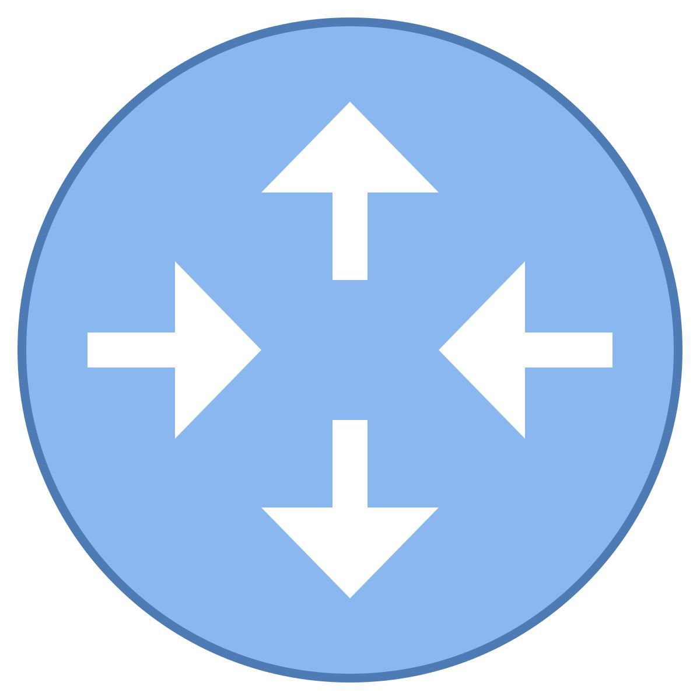
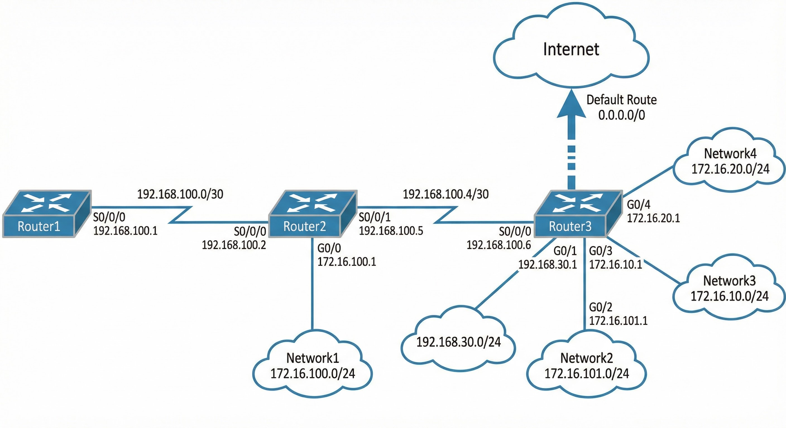
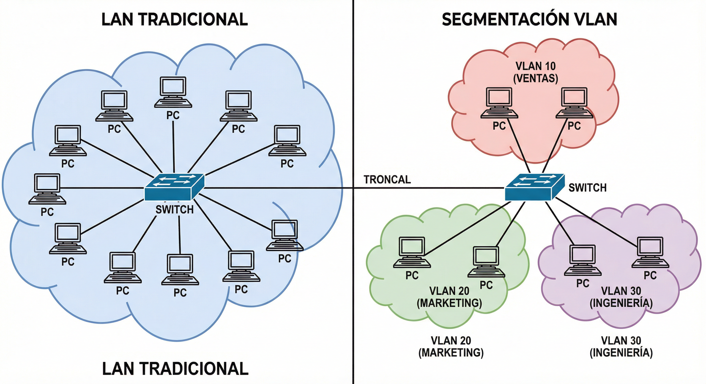
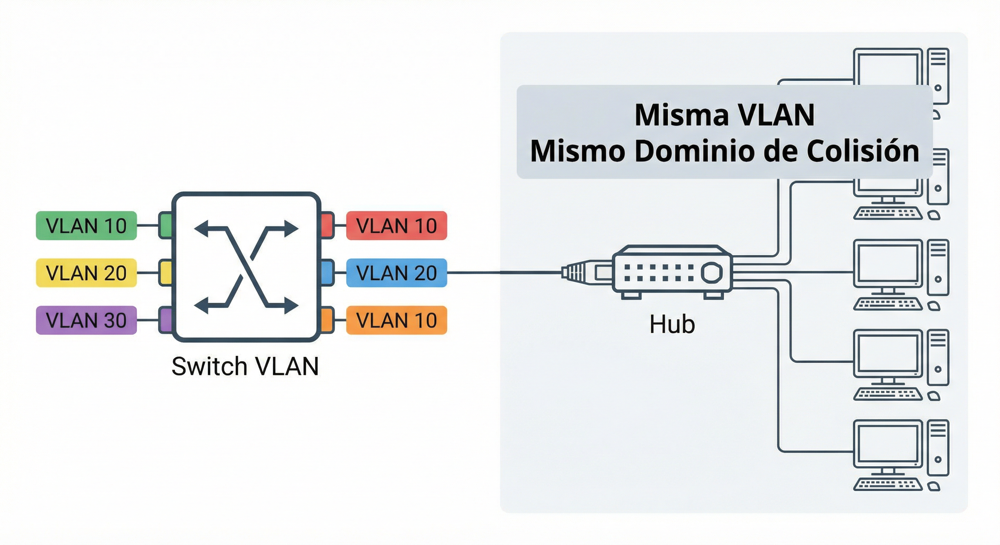

#  ENRUTAMIENTO, SUBNETTING Y VLANs

En esta unidad se trabajan tres bloques relacionados con la organización y el encaminamiento en redes: la **división en subredes (subnetting)** y la **agregación en superredes (supernetting)** para un mejor uso de las direcciones IP; el **enrutamiento** (estático y dinámico) como proceso que permite que los paquetes lleguen a su destino a través de varios routers; y las **VLANs** (redes locales virtuales) para segmentar la red de forma lógica.

!!! info "<span style='font-size: 1.3em;'><strong>Objetivos de la unidad</strong></span>"
    <span style="font-size: 1.2em;">
    • Comprender subnetting y supernetting y su utilidad<br>
    • Conocer los tipos de enrutamiento (estático y dinámico)<br>
    • Entender la tabla de enrutamiento y el proceso de encaminamiento<br>
    • Conocer protocolos de enrutamiento interior y exterior<br>
    • Definir VLANs y sus ventajas<br>
    • Diferenciar puertos de acceso y troncales y el etiquetado 802.1Q
    </span>

## 📚 Propuesta didáctica

En esta unidad se trabajan los **RA1 y RA4 de RAL**:

> **RA1.** *Reconoce la estructura de redes locales cableadas analizando las características de entornos de aplicación y describiendo la funcionalidad de sus componentes.*
> 
> **RA4.** *Instala equipos en red, describiendo sus prestaciones y aplicando técnicas de montaje.*

### 🎯 Criterios de evaluación

#### Criterios de evaluación del RA1

* **CE1a**: Se han descrito los principios de funcionamiento de las redes locales.
* **CE1c**: Se han descrito los elementos de la red local y su función.

#### Criterios de evaluación del RA4

* **CE4a**: Se han descrito las prestaciones de los equipos de red analizando características técnicas de switches, routers y puntos de acceso.
* **CE4b**: Se han identificado los componentes de los equipos de red reconociendo interfaces, fuentes de alimentación y sistemas de ventilación.

### Contenidos

* Subnetting: división de una red en subredes más pequeñas.
* Supernetting: agrupación de redes contiguas (CIDR).
* Enrutamiento estático y dinámico.
* Tabla de enrutamiento y proceso de encaminamiento.
* Ruta por defecto. Protocolos IGP y EGP.
* VLANs: concepto, tipos, ventajas.
* Puertos de acceso y troncales. Etiquetado IEEE 802.1Q.

!!! question "Cuestionario inicial"
    1. ¿Qué es dividir una red en subredes (subnetting) y para qué sirve?
    2. ¿Qué es una superred y qué ventaja tiene?
    3. ¿Qué diferencia hay entre enrutamiento estático y dinámico?
    4. ¿Qué es la tabla de enrutamiento de un router?
    5. ¿Qué es una VLAN y qué ventajas aporta?
    6. ¿Qué es un puerto troncal (trunk) en un switch?

---

## 📐 Subnetting (división en subredes)

En redes de computadoras, una **subred** es un **rango de direcciones lógicas**. Cuando una red se vuelve muy grande, conviene dividirla en subredes para reducir el tamaño de los dominios de broadcast y hacer la red más manejable desde el punto de vista administrativo (por ejemplo, controlando el tráfico entre subredes mediante ACL).

<!-- *Fuente: [¿Qué son las subredes? – Marcos Ruiz](https://marcosruiz.github.io/posts/subredes/)* -->

### 🎯 Concepto y motivos

El **subnetting** consiste en **dividir una red en subredes más pequeñas** tomando **bits prestados** de la parte de host y usándolos para identificar subredes. La máscara de subred se hace más larga (prefijo CIDR mayor).

**Motivos para crear subredes:**

- Reducir el tamaño de los dominios de broadcast.
- Hacer la red más manejable y poder controlar el tráfico entre subredes.

### ✅ Ventajas de hacer subredes

- **Reduce el tamaño de las tablas de enrutamiento:** menos rutas que almacenar y consultar.
- **Evita difusiones innecesarias:** en redes con muchos equipos, el broadcast puede ralentizar la red; con subredes se limita el alcance.
- **Aumenta las opciones de seguridad:** se pueden aplicar firewalls y restricciones por subred.
- **Simplifica la administración:** por ejemplo, aplicar políticas por departamento (cada uno en una subred).
- **Controla el crecimiento:** planificar cuántas subredes y cuántos hosts por subred (máscara adecuada).

### ⚠️ Desventaja

- **Se pierden direcciones** utilizables para hosts (la dirección de red y la de broadcast de cada subred no se asignan a equipos).

### 🔢 Ejemplo de subdivisión: 8 subredes

A una compañía se le asigna la red **192.168.0.0** (clase C: 254 hosts con máscara /24). Decide dividirla en **8 subredes**.

- Se **toman prestados 3 bits** de la porción de host → máscara **/27** (255.255.255.224 en decimal; en binario los últimos 8 bits son `11100000`).
- **Número de subredes:** 2³ = **8**.
- **Direcciones por subred:** 2⁵ = 32; **hosts asignables por subred:** 32 − 2 = **30** (la primera es la dirección de subred, la última el broadcast).
- **Incremento** de una subred a la siguiente en el último octeto: **32**.

| Subred   | Dirección de red | Rango IP utilizables      | Broadcast    |
|----------|------------------|---------------------------|--------------|
| 1        | 192.168.0.0      | 192.168.0.1 – 192.168.0.30  | 192.168.0.31  |
| 2        | 192.168.0.32     | 192.168.0.33 – 192.168.0.62 | 192.168.0.63  |
| 3        | 192.168.0.64     | 192.168.0.65 – 192.168.0.94 | 192.168.0.95  |
| 4        | 192.168.0.96     | 192.168.0.97 – 192.168.0.126| 192.168.0.127 |
| 5        | 192.168.0.128    | 192.168.0.129 – 192.168.0.158 | 192.168.0.159 |
| 6        | 192.168.0.160    | 192.168.0.161 – 192.168.0.190 | 192.168.0.191 |
| 7        | 192.168.0.192    | 192.168.0.193 – 192.168.0.222 | 192.168.0.223 |
| 8        | 192.168.0.224    | 192.168.0.225 – .254       | 192.168.0.255 |

### 📋 Direcciones reservadas

- En **cada subred** (y en la red sin dividir) **no se asignan** la primera dirección (identifica la subred) ni la última (broadcast de la subred).
- La **RFC 950** (en desuso) indicaba no usar la primera y la última subred; actualmente, por escasez de direcciones, suele usarse todo el rango.

### 🧮 Cálculos paso a paso

Para resolver ejercicios de subnetting de forma sistemática se pueden seguir estos pasos:

1. **Número de bits a prestar (para obtener al menos N subredes)**  
   Buscar el menor número de bits *b* tal que 2^b ≥ N.  
   *Ejemplo:* para **30 subredes**, 2⁴ = 16 no basta; 2⁵ = 32 ≥ 30 → hacen falta **5 bits prestados**.

2. **Nueva máscara (prefijo CIDR)**  
   Prefijo nuevo = prefijo base + bits prestados.  
   Con red /24: 24 + 5 = **/29** (32 subredes). Con red /16 (ej. 172.16.0.0): 16 + 5 = **/21**.

3. **Incremento entre direcciones de red**  
   Incremento = 2^(bits de host restantes en el octeto que varía).  
   En **/24** con 5 bits prestados: 8 − 5 = 3 bits de host → incremento = 2³ = **8** (en el último octeto).  
   En **172.16.0.0/21** el octeto que varía es el tercero; 8 − 5 = 3 → incremento **8** en el tercer octeto (172.16.0.0, 172.16.8.0, 172.16.16.0, …).

4. **Dirección de red de la subred k**  
   Subred 1 = red base. Subred *k* = red base + (k − 1) × incremento (aplicado en el octeto que varía).

5. **Rango de IP y broadcast**  
   Primera IP válida = dirección de red + 1. Última IP válida = broadcast − 1. Broadcast = siguiente dirección de red − 1 (o bien: red + T − 1, con T = tamaño del bloque = 2^(bits de host)).

6. **¿A qué subred pertenece una IP?**  
   En el octeto que varía, con incremento *I*: valor_red_octeto = (valor del octeto ÷ I) × I (división entera). La dirección de red de la subred es la que tiene ese octeto igual a valor_red_octeto.  
   *Ejemplo:* 172.16.0.0/21, incremento 8. IP 172.16.118.50 → tercer octeto 118 → (118 ÷ 8) × 8 = 112 → subred **172.16.112.0/21**.

Puedes practicar estos cálculos en la [ficha de repaso para el examen](ficha_repaso_examen_enrutamiento.md).

### 📋 Resumen

- **Subnetting** = tomar una red y dividirla en varias subredes con **máscara más larga** (más bits de red; bits “prestados” al host).
- **Incremento** entre direcciones de red = 2^(bits de host restantes).
- **Subredes** = 2^(bits prestados). **Hosts por subred** = 2^(bits de host) − 2.

!!! tip "<span style='font-size: 1.2em;'><strong>Vídeo explicativo</strong></span>"
    <span style="font-size: 1.1em;">
    Vídeo sobre subredes y subnetting.
    </span>

<div style="position: relative; padding-bottom: 56.25%; height: 0; overflow: hidden; margin-top: 1em; margin-bottom: 1em;">
  <iframe src="https://www.youtube.com/embed/SHbBso63X38"
          style="position: absolute; top: 0; left: 0; width: 100%; height: 100%;"
          frameborder="0"
          allow="accelerometer; autoplay; clipboard-write; encrypted-media; gyroscope; picture-in-picture"
          allowfullscreen
          title="Vídeo explicativo sobre subredes"></iframe>
</div>

<p style="text-align: center; font-size: 1.1em; margin-top: 0.5em;">
  Vídeo explicativo sobre subredes y división en subredes.
</p>

---

## 🔀 Supernetting (superredes / resumen de rutas)

### 🎯 Concepto

El **Supernetting** es el **proceso inverso al Subnetting**. En lugar de dividir una red en trozos más pequeños, **agrupamos varias redes pequeñas en una sola red mayor**, llamada **superred**. Así se reduce el número de entradas en la tabla de enrutamiento y se simplifica el encaminamiento (agregación de rutas).

### 🎯 ¿Para qué sirve? (Objetivo técnico)

- **Reducción de tablas de enrutamiento:** El router no tiene que almacenar muchas rutas si puede usar una sola que las agrupe (por ejemplo, una ruta en lugar de diez).
- **Ahorro de CPU y RAM:** Menos rutas implican búsquedas más rápidas en la tabla.
- **Estabilidad:** Si una red pequeña falla o cambia de estado (“flap”), el router no tiene que anunciar tantos cambios; la “superruta” puede seguir activa y el impacto se limita.

### 📋 Reglas de oro para hacer Supernetting

Para poder agrupar redes en una superred, deben cumplirse dos requisitos:

1. **Contigüidad:** Las redes deben ser **consecutivas** (por ejemplo, 192.168.0.0, 192.168.1.0, 192.168.2.0, 192.168.3.0). No se pueden saltar números.
2. **Mismo prefijo:** Deben **compartir los bits de mayor peso** (los de la izquierda) en su representación binaria.

### 🔢 Ejemplo práctico (paso a paso)

Queremos resumir estas 4 redes en una sola:

- Red A: 192.168.0.0/24  
- Red B: 192.168.1.0/24  
- Red C: 192.168.2.0/24  
- Red D: 192.168.3.0/24  

**Paso 1 – Pasar a binario el octeto que cambia (el 3.º):**

| Decimal | Binario (8 bits) |
|---------|------------------|
| 0       | 000000**00**     |
| 1       | 000000**01**     |
| 2       | 000000**10**     |
| 3       | 000000**11**     |

**Paso 2 – Contar los bits que coinciden:**  
Los primeros **6 bits** del tercer octeto son idénticos en las cuatro redes (000000). Los 2 últimos bits varían.

**Paso 3 – Ajustar la máscara:**  
La máscara original era /24 (8+8+8 bits de red). Como hemos “retrocedido” 2 bits para que coincidan (solo 6 bits de red en el tercer octeto), restamos: 24 − 2 = **22**.

**Resultado:** La superred es **192.168.0.0/22** (abarca desde 192.168.0.0 hasta 192.168.3.255).

### 📊 Tabla comparativa: Subnetting vs. Supernetting

| Característica   | Subnetting              | Supernetting                    |
|------------------|-------------------------|---------------------------------|
| **Acción**       | Dividir una red grande  | Agrupar redes pequeñas         |
| **Máscara (CIDR)** | El número **aumenta** (ej. /24 → /27) | El número **disminuye** (ej. /24 → /22) |
| **Se usa en…**   | LAN (redes locales, empresa) | WAN / Internet / ISP            |


---

## 🌐 Enrutamiento IPv4

El **enrutamiento** es el proceso por el que se **elige la ruta** que deben seguir los paquetes para ir desde el origen hasta el destino en una red IP. Es fundamental para la interconexión de redes y para el funcionamiento de Internet.

### 🔹 Tipos de enrutamiento

#### Enrutamiento estático

- Las rutas se **configuran manualmente** en el router.
- Adecuado para redes pequeñas o topologías estables.
- **Ventajas:** bajo consumo de recursos, control total sobre las rutas.
- **Inconvenientes:** no se adapta solo a los cambios; si falla un enlace o se añade una red, hay que tocar la configuración.

#### Enrutamiento dinámico

- Los routers **intercambian información** mediante **protocolos de enrutamiento** y construyen sus tablas automáticamente.
- Se adapta a cambios en la topología (enlaces caídos, nuevas redes).

| Protocolo | Nombre completo               | Tipo / Principio                      | Ámbito de uso                |
|-----------|------------------------------|----------------------------------------|------------------------------|
| **RIP**   | Routing Information Protocol | Basado en número de saltos            | IGP, redes pequeñas/medianas |
| **OSPF**  | Open Shortest Path First     | Basado en coste (estado de enlace)     | IGP, redes medianas/grandes  |
| **EIGRP** | Enhanced Interior Gateway Routing Protocol | Híbrido (Cisco)              | IGP, redes Cisco             |
| **BGP**   | Border Gateway Protocol      | Entre sistemas autónomos (Internet)    | EGP, Internet                |

### 📋 Tabla de enrutamiento

La **tabla de enrutamiento** es la estructura donde el router guarda las rutas que conoce. Cada entrada suele incluir:

- **Red destino** (y máscara).
- **Siguiente salto (next hop):** dirección del siguiente router o “directo” si la red está conectada al propio router.
- **Interfaz de salida.**
- **Métrica** (coste de la ruta), si aplica.

#### 🗂️ Ejemplo de tabla de enrutamiento

Supongamos que un router tiene la siguiente tabla de enrutamiento:

| Red de destino    | Máscara        | Siguiente salto       | Interfaz    | Métrica |
|-------------------|---------------|-----------------------|-------------|---------|
| 192.168.1.0       | 255.255.255.0 | — (directamente conectada) | eth0        | 0       |
| 192.168.2.0       | 255.255.255.0 | 192.168.1.2           | eth0        | 1       |
| 10.0.0.0          | 255.0.0.0     | 192.168.2.1           | eth1        | 2       |
| 0.0.0.0           | 0.0.0.0       | 192.168.1.254         | eth0        | 10      |

- **192.168.1.0/24** está directamente conectada a la interfaz `eth0`.
- Para llegar a **192.168.2.0/24** se reenvía el tráfico al router en `192.168.1.2`.
- Para el tráfico hacia **10.0.0.0/8** se usa el siguiente salto `192.168.2.1` por `eth1`.
- La última fila es la **ruta por defecto**, que envía todo lo que no coincida con rutas anteriores al gateway `192.168.1.254`.

Este formato puede verse también con el comando `ip route show` en Linux:

```bash
$ ip route show
192.168.1.0/24 dev eth0 proto kernel scope link src 192.168.1.1
192.168.2.0/24 via 192.168.1.2 dev eth0
10.0.0.0/8 via 192.168.2.1 dev eth1
default via 192.168.1.254 dev eth0
```

### 🔄 Proceso de enrutamiento

1. El router recibe un paquete IP.
2. Consulta la **tabla de enrutamiento** con la dirección de destino.
3. Elige la **ruta más específica** (prefijo más largo que coincida).
4. Reenvía el paquete por la **interfaz** correspondiente hacia el siguiente salto.

### 🛤️ Ruta por defecto (default route)

La **ruta por defecto** se usa cuando **no hay ninguna ruta más específica** para el destino. Suele enviar todo el tráfico “desconocido” hacia un único router (por ejemplo, el del proveedor de Internet).

- Se representa como **0.0.0.0/0** (cualquier destino).
- En Linux, por ejemplo: `ip route add default via 192.168.1.1`

### 📊 Protocolos de enrutamiento: IGP y EGP

| Tipo | Siglas | Protocolos típicos | Ámbito |
|------|--------|--------------------|--------|
| **IGP** (Interior Gateway Protocol) | IGP | RIP, OSPF, EIGRP | Dentro de un mismo sistema autónomo |
| **EGP** (Exterior Gateway Protocol) | EGP | BGP | Entre sistemas autónomos (p. ej. Internet) |

### 💻 Comandos básicos (Linux)

Algunos comandos útiles para ver y gestionar rutas:

```bash
# Ver la tabla de enrutamiento
ip route show

# Añadir ruta estática
ip route add 192.168.2.0/24 via 192.168.1.1 dev eth0

# Eliminar una ruta
ip route del 192.168.2.0/24
```

### 📚 Ejemplo: tabla de rutas estáticas

Se pide indicar la **tabla de rutas del Router3** para que toda la red se comunique correctamente. Los enlaces entre routers usan redes **/30** (dos hosts utilizables) del rango de una clase C (**192.168.100.0/24**). Las direcciones IP de cada interfaz están dentro del rango de la red a la que están conectadas. La topología y las IP asignadas en cada interfaz son:



**Tabla de rutas estáticas del Router3:**

| Red destino    | Máscara         | Siguiente salto | Interfaz              |
|----------------|-----------------|-----------------|------------------------|
| 192.168.30.0   | 255.255.255.0   | * (Directo)     | G0/1: 192.168.30.1     |
| 192.168.100.4  | 255.255.255.252 | * (Directo)     | S0/0/0: 192.168.100.6 |
| 192.168.100.0  | 255.255.255.252 | 192.168.100.5   | S0/0/0                 |
| 172.16.100.0   | 255.255.255.0   | 192.168.100.5   | S0/0/0                 |
| 192.168.10.0   | 255.255.255.0   | 192.168.100.5   | S0/0/0                 |
| 192.168.20.0   | 255.255.255.0   | 192.168.100.5   | S0/0/0                 |
| 0.0.0.0        | 0.0.0.0         | 192.168.100.5   | S0/0/0                 |

!!! note "Nota"
    - Router3 tiene **conexión directa** únicamente con:
        - **192.168.30.0/24** a través de la interfaz **G0/1**
        - **192.168.100.4/30** a través de la interfaz **S0/0/0** (enlace a Router2)
    - Para acceder al **resto de redes**, Router3 utiliza como **siguiente salto** la dirección **192.168.100.5** (interfaz de Router2 en ese enlace).
    - La entrada **0.0.0.0/0** en la tabla es la **ruta por defecto**:
        - Se usa para reenviar tráfico dirigido a Internet o a cualquier destino sin ruta más específica configurada.

---

## 🏷️ VLANs (redes locales virtuales)

En ocasiones es necesario que una red pueda **filtrar los paquetes** para que la información generada por unos hosts no sea visible por otros dentro de la misma LAN. Esto se consigue definiendo **LAN virtuales o VLAN**. Cabe destacar:

=== "¿Qué es una VLAN?"

    - **VLAN** (Virtual LAN): método para crear **redes lógicas independientes** dentro de una misma red física.
    - Pueden coexistir **varias VLANs** en un solo switch o infraestructura física.
    - La información generada en cada VLAN sólo es recibida por los hosts de esa VLAN, no por toda la red física.

=== "¿Para qué se usan las VLAN?"

    - Reducir el **dominio de difusión**.
    - Mejorar la **seguridad** aislando el tráfico.
    - Organizar la red por funciones o departamentos.  
      <small>Ejemplo: departamentos que no deben comunicarse directamente por la LAN, aunque puedan hacerlo mediante router o switch capa 3.</small>



### 🔹 Características de las VLAN

- Crear una **topología virtual independiente** de la topología física.
- **Agrupar a los usuarios** en grupos de trabajo flexibles, modificables desde la configuración del switch.
- Funcionan en los **niveles 2 y 3 del modelo OSI**.
- La comunicación **entre VLANs** requiere **enrutamiento de capa 3** (router o switch de capa 3).
- **Controlar el tamaño de los dominios de difusión (broadcast)**: cada VLAN define un dominio de difusión distinto.
- **Aumentar la seguridad**: separar la red en grupos que no compartan información entre sí.
- **Eficiencia del ancho de banda**: menos paquetes broadcast, uso más eficiente.
- **Flexibilidad**: hosts del mismo switch pueden estar en VLANs distintas; hosts de distintos switches pueden pertenecer a la misma VLAN.

### 🔹 Tráfico VLAN: tagged / untagged (Access y Trunk)

- **Tráfico sin etiquetar (untagged) / Puerto de acceso (Access):** el puerto pertenece a **una sola VLAN**; las tramas que salen hacia el equipo final **no llevan etiqueta VLAN**. Es el modo habitual para conectar PCs, impresoras o puntos de acceso. Por defecto suele usarse la **VLAN 1**.
- **Tráfico etiquetado (tagged) / Puerto troncal (Trunk):** por el puerto circula tráfico de **varias VLANs**; las tramas llevan **etiqueta VLAN** (por ejemplo, IEEE 802.1Q) para que el otro switch o el router sepa a qué VLAN pertenece cada trama. Se usa en enlaces entre switches o entre switch y router.

### 🔹 Switches, routers y hubs con VLAN

**Switches y VLAN:** La infraestructura VLAN se reparte entre varios switches conectados entre sí por enlaces de mayor capacidad (**backbone o troncal**). Cada VLAN tiene un identificador; las tramas de los usuarios se **etiquetan** con ese identificador en el switch (capa 2), las tramas etiquetadas atraviesan el backbone y, al salir del backbone, el switch **elimina el identificador**.


**Routers y VLAN:** Las VLANs son dominios de difusión separados; los equipos de **distintas VLANs no se comunican directamente** a nivel lógico y necesitan un **router**. Lo habitual es que cada VLAN corresponda a una subred y la comunicación entre VLANs se haga a través del router.

<!-- **Hubs y VLAN:** Para reducir costes se pueden usar hubs: el hub se conecta a **un puerto** de un switch con VLAN, y varios equipos al hub. **Todos los usuarios conectados al mismo hub pertenecen a la misma VLAN** y al mismo dominio de colisión (comparten el ancho de banda de ese puerto del switch).

 -->

### ✅ Ventajas

- **Reconfiguración** sin tocar cables: basta con cambiar la asignación de puertos o políticas.
- **Seguridad:** aislamiento entre departamentos o grupos.
- **Rendimiento:** dominios de broadcast más pequeños.
- **Organización:** la red se estructura por función o departamento, no solo por ubicación física.

### 🔌 Tipos de puertos en un switch

- **Puertos de acceso (access):** se conectan a **equipos finales** (PC, impresora). Por ellos **solo circula tráfico de una VLAN**; las tramas no llevan etiqueta VLAN hacia el equipo.
- **Puertos troncales (trunk):** enlazan **switch con switch** o **switch con router**. Por ellos circula tráfico de **varias VLANs**; las tramas van **etiquetadas** para indicar a qué VLAN pertenecen.

### 🔗 Enlaces troncales (trunk)

Un **enlace troncal** es un enlace que **transporta varias VLANs** usando un mismo cable (o un enlace lógico). Sirve para interconectar dos switches llevando todas las VLANs, conectar un switch a un router (o switch de capa 3) para enrutar entre VLANs y, en algunos casos, conectar un servidor con NIC que soporte trunking. Varias VLANs comparten un único enlace físico; cada trama lleva una **etiqueta (VLAN ID)** para que el otro switch o el router sepa a qué VLAN pertenece.

!!! tip "<span style='font-size: 1.2em;'><strong>Vídeo: ¿Qué es un enlace troncal?</strong></span>"
    <span style="font-size: 1.1em;">
    Vídeo sobre enlaces troncales (trunk) y etiquetado VLAN entre switches.
    </span>

<div style="position: relative; padding-bottom: 56.25%; height: 0; overflow: hidden; margin-top: 1em; margin-bottom: 1em;">
  <iframe src="https://www.youtube.com/embed/n8j9UcDsV2g"
          style="position: absolute; top: 0; left: 0; width: 100%; height: 100%;"
          frameborder="0"
          allow="accelerometer; autoplay; clipboard-write; encrypted-media; gyroscope; picture-in-picture"
          allowfullscreen
          title="Vídeo explicativo sobre enlace troncal y VLAN"></iframe>
</div>

<p style="text-align: center; font-size: 1.1em; margin-top: 0.5em;">
  Vídeo explicativo sobre enlaces troncales (trunk) y VLANs.
</p>

### 🏷️ Etiquetado: IEEE 802.1Q

Para distinguir el tráfico de cada VLAN en un enlace troncal, las tramas se **etiquetan**. El estándar más usado es **IEEE 802.1Q** (también llamado *dot1q*).

- Se **inserta un campo de 4 bytes** en la trama Ethernet con el **identificador de VLAN (VLAN ID)**.
- Al modificar la trama, el **FCS (CRC)** debe **recalculase**; el switch lo hace automáticamente antes de enviar la trama por el trunk.
- 802.1Q es un estándar abierto, compatible entre equipos de distintos fabricantes.

### 🔹 VLAN nativa

En un puerto troncal, las tramas suelen ir **etiquetadas**. Si el switch recibe en ese puerto **tramas sin etiqueta**, las asocia a la **VLAN nativa** configurada en el puerto. Ambos extremos del enlace troncal deben usar la **misma VLAN nativa**. En muchos equipos (por ejemplo Cisco) la VLAN nativa por defecto es la **VLAN 1**.

---

## 📝 Actividades

!!! tip "<span style='font-size: 1.4em;'><strong>Formato de entrega</strong></span>"
    <span style="font-size: 1.3em;">Para la entrega de las actividades, genera un documento con la práctica descrita a continuación. Deberás crear un archivo PDF con el siguiente formato de nombre: <strong>ACXXX.pdf o PRXXX.pdf</strong>, donde las X representan el número de la actividad. Una vez finalizada la práctica, sube el archivo a Aules (antes de la fecha de vencimiento) para su calificación.</span>

<a name="ficha-repaso"></a>

* :material-book-open-variant: **Ficha de repaso para el examen**. [Consulta la ficha de repaso para preparar el examen de Enrutamiento, Subnetting y VLANs (resúmenes de conceptos, fórmulas y ejercicios de práctica)](ficha_repaso_examen_enrutamiento.md)

<a name="AC701"></a>

* :simple-readdotcv: **AC701**. (RA1 // CE1a, CE1c // 1-3p). Actividad subredes – Red 194.168.100.0. Si tenemos una red de tipo C **194.168.100.0**:
    1. ¿Qué máscara hay que aplicarle para dividirla en 16 subredes totales?
    2. ¿Cuántos nodos podrán contener cada una de esas 16 subredes?
    3. ¿Cuáles serían los nombres (direcciones de red) de las subredes?
    4. ¿Cuál sería la dirección IP del nodo con identificador 4 de cada una de estas subredes?
    5. ¿A qué subred pertenece el nodo cuya dirección IP es 194.168.100.107?
    <!-- Consulta la [actividad resuelta de subredes (194.168.100.0)](https://marcosruiz.github.io/posts/actividad-resuelta-subredes/) para comprobar tus resultados. Fuente: [¿Qué son las subredes? – Actividad resuelta](https://marcosruiz.github.io/posts/subredes/#actividad-resuelta). -->

<a name="AC702"></a>

* :simple-readdotcv: **AC702**. (RA1 // CE1a, CE1c // 1-3p). Actividad subredes – Empresa X. La empresa X necesita crear **25 redes**; el proveedor de Internet le dio la IP **192.168.9.0**. Elabora un documento que incluya:
    1. Máscara de subred por defecto (red sin dividir).
    2. Máscara de subred subneteada para obtener al menos 25 subredes.
    3. Direcciones de los PCs en la 1.ª, 2.ª, 3.ª y 4.ª subred (ejemplo: primera y última IP válida de cada una).
    4. Dirección del router en cada una de esas cuatro subredes (normalmente la primera IP válida o la última).
    <!-- Fuente: [¿Qué son las subredes? – Actividad](https://marcosruiz.github.io/posts/subredes/#actividad-1). -->

<a name="AC703"></a>

* :simple-readdotcv: **AC703**. (RA1 // CE1a, CE1c // 1-3p). Actividad subredes – Red /22. Dada la red **192.168.0.0/22**:
    1. Indica la dirección de red, la dirección de broadcast y el número de hosts utilizables (sin dividir en subredes).
    2. Divide esta red en **4 subredes** del mismo tamaño (usando máscara /24). Indica las direcciones de red de las 4 subredes.
    3. Para cada una de las 4 subredes, indica el rango de IP válidas para hosts (primera y última) y la dirección de broadcast.

<a name="AC704"></a>

* :simple-readdotcv: **AC704**. (RA1 // CE1a, CE1c // 1-3p). Actividad subredes – Red /23. Dada la red **192.168.4.0/23**:
    1. Indica la dirección de red, la dirección de broadcast y el número de hosts utilizables (sin dividir en subredes).
    2. Divide esta red en **2 subredes** del mismo tamaño (usando máscara /24). Indica las direcciones de red de las 2 subredes y el rango de IP válidas para hosts de cada una.
    3. ¿A qué subred /24 pertenecería el host con IP 192.168.5.100?

<a name="AC705"></a>

* :simple-readdotcv: **AC705**. (RA1 // CE1a, CE1c // 1-3p). Supernetting – Cuatro departamentos. Imagina que trabajas en una empresa con 4 departamentos en el mismo edificio, cada uno con su propia red: **Ventas** 172.16.16.0/24, **RRHH** 172.16.17.0/24, **Sistemas** 172.16.18.0/24, **Dirección** 172.16.19.0/24. El router central está colapsado y te piden resumir estas 4 redes en una sola (supernetting). Sigue los pasos: 

    - Identifica el octeto que cambia entre las redes.
    - Pásalo a binario (solo ese octeto para cada red).
    - Busca cuántos bits de la izquierda son iguales en los cuatro valores.
    - Calcula la nueva máscara según los bits coincidentes.
    - Indica la superred resultante, escribiendo su dirección y el prefijo CIDR.

<a name="AC706"></a>

* :simple-readdotcv: **AC706**. (RA1 // CE1a, CE1c // 1-3p). Supernetting – Cuatro plantas. Imagina que en un edificio hay 4 plantas y cada una tiene su propia red: **Planta 0** 192.168.4.0/24, **Planta 1** 192.168.5.0/24, **Planta 2** 192.168.6.0/24, **Planta 3** 192.168.7.0/24.

    - Identifica el octeto que varía entre las redes.
    - Escribe en binario ese octeto para cada planta.
    - Señala cuántos bits de la izquierda son iguales en los cuatro casos.
    - Calcula la nueva máscara de red según los bits coincidentes.
    - Indica la dirección de la superred resultante y el prefijo CIDR.

<a name="AC707"></a>

* :simple-readdotcv: **AC707**. (RA1 // CE1a, CE1c // 1-3p). Enrutamiento estático – Tabla del Router2. Partiendo de la **misma topología del ejemplo** de este tema (Router1 ↔ Router2 ↔ Router3, enlaces entre routers en **192.168.100.0/30** y **192.168.100.4/30**, Router2 conectado a Network1 **172.16.100.0/24**, Router3 a **192.168.30.0/24**, redes 192.168.10.0/24 y 192.168.20.0/24 y ruta por defecto hacia Internet):
    1. Indica las **IP de las interfaces** del Router2 en cada enlace (según el criterio del ejemplo).
    2. Elabora la **tabla de rutas estáticas del Router2**: red destino, máscara, siguiente salto e interfaz de salida para que toda la red sea alcanzable.
    3. Justifica qué entradas son conexión directa y cuáles usan un siguiente salto, e indica qué dirección IP usas como siguiente salto hacia Router3.

<a name="AC708"></a>

* :simple-readdotcv: **AC708**. (RA1 // CE1a, CE1c // 1-3p). Enrutamiento estático – Tabla del Router1. Partiendo de la **misma topología del ejemplo** (Router1 conectado solo a Router2 por **192.168.100.0/30**, y Router2 a Router3 por **192.168.100.4/30**, con el resto de redes e Internet detrás de Router2 y Router3):
    1. Indica la **IP de la interfaz** del Router1 en el enlace con Router2.
    2. Elabora la **tabla de rutas estáticas del Router1** (red destino, máscara, siguiente salto, interfaz) para que pueda alcanzar todas las redes y la ruta por defecto.
    3. Explica por qué en este diseño todas las rutas no directas del Router1 usan el mismo siguiente salto.

<a name="AC709"></a>

* :simple-readdotcv: **AC709**. (RA1 // CE1a, CE1c // 1-3p). **Actividad 3: Diseño lógico y segmentación – Clínica dental.**  
  **Contexto:** Una clínica dental pequeña quiere segmentar su red para separar datos sensibles del resto del tráfico. Disponen de un switch de 24 puertos donde conectarán:
  - **Recepción:** 2 PCs, 1 impresora y 1 teléfono IP.
  - **Consultas:** 6 PCs (uno por gabinete) y 2 impresoras.
  - **Invitados:** 1 punto de acceso Wi-Fi para que los pacientes usen Internet en la sala de espera.  
  **Tareas a realizar en papel:**
  - **Cuadro de planificación:** Crea una tabla con 4 columnas: Nombre VLAN, ID (Número), Rango de IPs (Subred) y Puertos asignados.
  - **Cuestionario de diseño:**  
    1. ¿Por qué no es recomendable que el Wi-Fi de invitados comparta VLAN con los PCs de Recepción?  
    2. Si un PC de la VLAN "Consultas" intenta hacer ping a un PC de la VLAN "Recepción", ¿funcionará sin un router? Justifica.
  - **Esquema:** Dibuja el switch y etiqueta qué puertos pertenecen a cada grupo (por ejemplo, del 1 al 5 para un grupo).

<a name="AC710"></a>

* :simple-readdotcv: **AC710**. (RA1 // CE1a, CE1c // 1-3p). **Actividad 4: El enlace troncal entre tres plantas.**  
  **Contexto:** La empresa tiene tres plantas (Sótano, Planta 1 y Planta 2). Hay un switch en cada planta. El Sótano y la Planta 1 se unen por un cable; la Planta 1 y la Planta 2 por otro. En todas las plantas hay equipos de **Almacén** y de **Administración**.  
  **Esquema:**
  - **Switch Sótano:** PC-Almacén1 (Puerto 2), PC-Admin1 (Puerto 3). Enlace hacia Planta 1: Puerto 24.
  - **Switch Planta 1:** PC-Almacén2 (Puerto 2), PC-Admin2 (Puerto 3). Puerto 23 hacia Sótano, Puerto 24 hacia Planta 2.
  - **Switch Planta 2:** PC-Almacén3 (Puerto 2), PC-Admin3 (Puerto 3). Enlace desde Planta 1: Puerto 24.  
  **Tareas a realizar en papel:**
  - **Configuración de puertos:** Indica qué modo (Access o Trunk) debe tener cada uno de los puertos que conectan equipos finales (los de los PCs) y cada uno de los puertos que unen los switches (enlaces entre plantas).
  - **El camino de la trama:** Si PC-Almacén1 envía datos a PC-Almacén3, ¿en qué enlaces se transportará la trama con etiqueta VLAN y con qué estándar se etiqueta?
  - **Resolución de problemas:** Si el puerto 24 del Switch Planta 1 (hacia Planta 2) se configura en modo Acceso para la VLAN de Almacén, ¿podrán comunicarse entre sí los PCs de Administración de la Planta 1 y de la Planta 2? Razona la respuesta.


