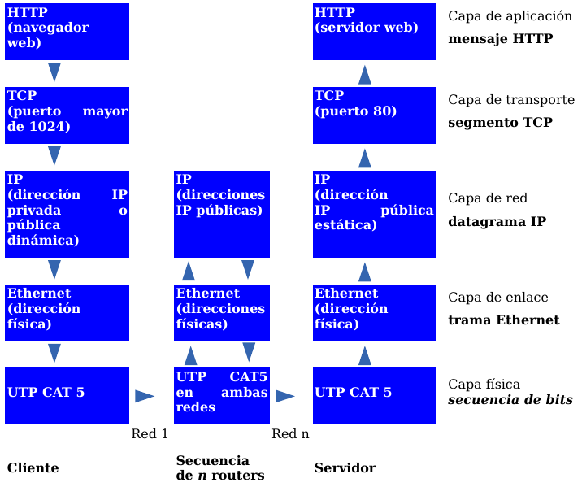
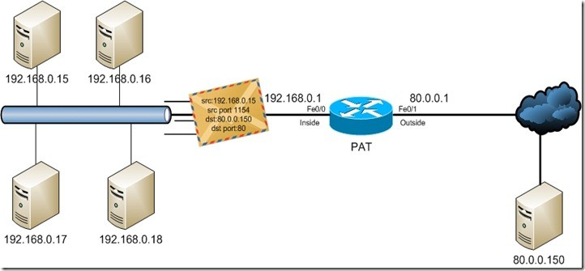
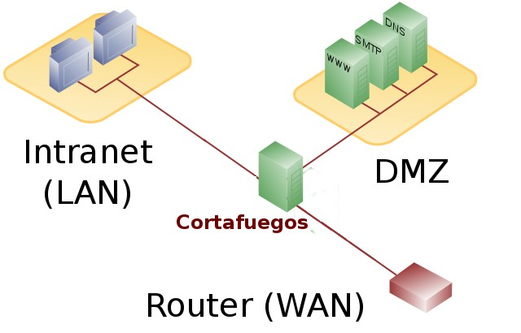
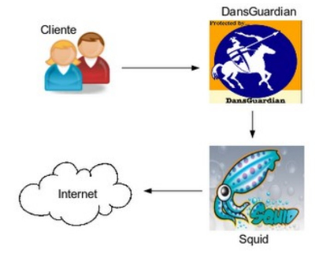
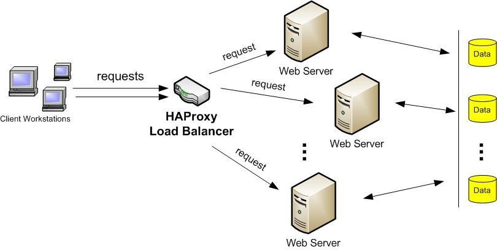

#  CAPA DE TRANSPORTE

En esta unidad estudiamos la **capa de transporte** del modelo TCP/IP y OSI. Esta capa es la que **conecta las aplicaciones con la red**, usando **puertos** y **sockets** para identificar qué programa envía y recibe los datos, y protocolos como **UDP** y **TCP** para transportar la información entre ordenadores.

Además, veremos conceptos muy relacionados con la seguridad y el rendimiento de las redes modernas: **NAT**, **cortafuegos**, **proxy‑caché**, **balanceadores de carga** y **VPN**.

!!! info "<span style='font-size: 1.3em;'><strong>Objetivos de la unidad</strong></span>"
    <span style="font-size: 1.2em;">
    • Entender el papel de la capa de transporte en el modelo TCP/IP y OSI.<br>
    • Comprender qué son los puertos y los sockets y por qué son necesarios.<br>
    • Distinguir entre los tipos de puertos (bien conocidos, registrados y efímeros).<br>
    • Conocer y comparar los protocolos de transporte UDP y TCP.<br>
    • Identificar usos típicos de UDP y TCP en aplicaciones reales.<br>
    • Reconocer qué es NAT, PAT, un cortafuegos, un proxy‑caché, un balanceador de carga y una VPN a nivel básico.
    </span>

## 📚 Propuesta didáctica

En esta unidad se trabajan principalmente los **RA1 y RA4 de RAL**:

> **RA1.** *Reconoce la estructura de redes locales cableadas analizando las características de entornos de aplicación y describiendo la funcionalidad de sus componentes.*
>
> **RA4.** *Instala equipos en red, describiendo sus prestaciones y aplicando técnicas de montaje.*

### 🎯 Criterios de evaluación

#### Criterios de evaluación del RA1

* **CE1a**: Se han descrito los principios de funcionamiento de las redes locales.
* **CE1c**: Se han descrito los elementos de la red local y su función.

#### Criterios de evaluación del RA4

* **CE4a**: Se han descrito las prestaciones de los equipos de red analizando características técnicas de switches, routers y puntos de acceso.
* **CE4c**: Se han identificado los servicios de comunicaciones disponibles en una red local.

### Contenidos

* Capa de transporte en el modelo TCP/IP y OSI.
* Puertos y sockets. Identificación de aplicaciones en la red.
* Tipos de puertos: bien conocidos, registrados y efímeros.
* Protocolo UDP: características, formato de segmento y usos.
* Protocolo TCP: características, formato de segmento, ventana deslizante y establecimiento/cierre de conexión.
* Comparación UDP vs TCP y ejemplos de aplicaciones.
* NAT (Network Address Translation) y PAT (Port Address Translation).
* Herramientas `netstat` y `nmap` para ver puertos abiertos.
* Cortafuegos de red y políticas (restrictiva / permisiva).
* Proxy‑caché y proxy transparente.
* Balanceadores de carga y VPN a nivel básico.

!!! question "Cuestionario inicial"
    1. ¿Para qué sirve la capa de transporte en una red TCP/IP?
    2. ¿Qué diferencia hay entre una **dirección IP** y un **puerto**?
    3. ¿Qué es un **socket**? Pon un ejemplo.
    4. ¿En qué se diferencian UDP y TCP?
    5. ¿Por qué crees que usamos TCP para descargar archivos y, en cambio, muchas aplicaciones de voz usan UDP?
    6. ¿Qué función cumple un cortafuegos en una red?

---

## 🚚 La capa de transporte en el modelo TCP/IP

Los programas de capa de aplicación (navegador web, cliente de correo, juego online, etc.) generan datos que deben intercambiarse entre un **host origen** y un **host destino**. La **capa de transporte** es responsable de las **comunicaciones lógicas entre las aplicaciones** que se ejecutan en distintos ordenadores.



La capa de transporte:

- **Recibe datos** de la capa de aplicación.
- Los **segmenta** en partes más pequeñas (segmentos o datagramas).
- Añade un **encabezado** (cabecera) con información de **puertos** y control.
- Entrega esos segmentos a la capa de red (IP) para que los envíe.
- En el destino, **reensambla** los segmentos y los entrega a la aplicación correcta.

Los dos protocolos más importantes de esta capa son:

- **UDP (User Datagram Protocol)** – Protocolo de datagrama de usuario.
- **TCP (Transmission Control Protocol)** – Protocolo de control de transmisión.

Cada uno ofrece un tipo de servicio diferente, como veremos más adelante.

### Responsabilidades de la capa de transporte

La capa de transporte se encarga de:

- **Multiplexar conversaciones:** permite que varias aplicaciones se comuniquen a la vez por la misma red.
- **Identificar aplicaciones:** usando **puertos** para saber qué programa envía/recibe.
- **Segmentar y reensamblar datos:** trocea la información y la vuelve a unir al llegar.
- **Seguir conversaciones individuales:** incluso aunque haya muchos flujos de datos al mismo tiempo.

---

## 🎯 Puertos y sockets

Cuando establecemos una conexión de red, no basta con saber qué **IP origen** y qué **IP destino** participan. En cada equipo hay **muchas aplicaciones** que pueden estar conectándose a la red a la vez. Para distinguirlas se usan los **puertos**.

Un **puerto** es:

- Un **número entre 0 y 65535** que identifica una aplicación (o servicio) dentro de un host.
- Va incluido en la cabecera de transporte (UDP o TCP).

Así, cuando un paquete viaja por la red, incluye:

- **IP origen** y **IP destino** → identifican los equipos.
- **Puerto origen** y **Puerto destino** → identifican las aplicaciones en esos equipos.

### Socket: combinación IP:puerto

Al conjunto **IP + puerto** lo llamamos **socket**. Se escribe:

> `IP:puerto`

Por ejemplo:

- `145.34.210.89:4578`
- `192.168.1.10:80`

Una conexión en Internet se establece realmente entre **dos sockets**:

> `IP_origen:puerto_origen  ↔  IP_destino:puerto_destino`

Esto hace que cada conexión quede **unívocamente identificada**.

### Vídeo: ¿Qué es un puerto y un socket?

!!! tip "<span style='font-size: 1.2em;'><strong>Vídeo: puertos y sockets</strong></span>"
    <span style="font-size: 1.1em;">
    Vídeo del curso de redes desde 0 donde se explica de forma muy visual qué es un puerto, qué es un socket y cómo se establece una conexión entre cliente y servidor.
    </span>

<div style="position: relative; padding-bottom: 56.25%; height: 0; overflow: hidden; margin-top: 1em; margin-bottom: 1em;">
  <iframe src="https://www.youtube.com/embed/-7DiO35rbN8"
          style="position: absolute; top: 0; left: 0; width: 100%; height: 100%;"
          frameborder="0"
          allow="accelerometer; autoplay; clipboard-write; encrypted-media; gyroscope; picture-in-picture"
          allowfullscreen
          title="Vídeo explicativo sobre puertos y sockets"></iframe>
</div>

<p style="text-align: center; font-size: 1.1em; margin-top: 0.5em;">
  Vídeo explicativo sobre puertos, sockets y conexiones cliente‑servidor.
</p>

---

## 🔢 Tipos de puertos

Un ordenador dispone de **65536 puertos** (de 0 a 65535). Se suelen clasificar en tres grandes grupos:

| Tipo de puerto                 | Rango         | Uso principal                                                                           |
|--------------------------------|--------------:|-----------------------------------------------------------------------------------------|
| **Bien conocidos (Well‑Known)** | 0 – 1023      | Servicios estándar del sistema (HTTP, HTTPS, FTP, SSH, DNS, SMTP, etc.).               |
| **Registrados (Registered)**   | 1024 – 49151  | Aplicaciones y servicios de usuario (juegos, VoIP, bases de datos, etc.).             |
| **Dinámicos / Privados (Ephemeral)** | 49152 – 65535 | Puertos temporales asignados por el SO a aplicaciones cliente.                          |

### Ejemplos de puertos bien conocidos

Algunos puertos importantes (TCP/UDP):

| Puerto / Protocolo | Servicio                                        |
|--------------------|-------------------------------------------------|
| **20/tcp**         | FTP – Datos                                    |
| **21/tcp**         | FTP – Control                                  |
| **22/tcp**         | SSH, SCP, SFTP                                 |
| **23/tcp**         | Telnet                                         |
| **25/tcp**         | SMTP – Correo saliente                         |
| **53/tcp, 53/udp** | DNS – Resolución de nombres                    |
| **67/udp, 68/udp** | BOOTP/DHCP – Asignación dinámica de IP         |
| **69/udp**         | TFTP                                           |
| **80/tcp**         | HTTP – Web                                     |
| **110/tcp**        | POP3 – Correo entrante                         |
| **143/tcp**        | IMAP4 – Correo entrante                        |
| **443/tcp**        | HTTPS – Web segura                             |
| **993/tcp**        | IMAP4 sobre SSL                                |
| **995/tcp**        | POP3 sobre SSL                                 |

Conocer estos puertos te ayudará a **interpretar salidas de `netstat`** o **reglas de cortafuegos**.

---

## 📦 Protocolo UDP

El **UDP (User Datagram Protocol)** es un protocolo de transporte **muy sencillo** que proporciona una comunicación básica entre aplicaciones. UDP es:

- **No orientado a conexión:** no establece una conexión previa; simplemente envía los mensajes.
- **No fiable:** los datagramas se pueden perder, duplicar o llegar desordenados.


### Campos principales de un segmento UDP

La cabecera UDP tiene solo **4 campos** (8 bytes en total):

- **Puerto origen (16 bits)** – puerto UDP del remitente (opcional).
- **Puerto destino (16 bits)** – puerto UDP del receptor.
- **Longitud (16 bits)** – longitud total del mensaje UDP (cabecera + datos).
- **Suma de verificación (16 bits)** – verificación de errores (opcional).

Detrás de la cabecera van los **datos** que envía la aplicación.

### ¿Cuándo usar UDP?

UDP es adecuado para aplicaciones donde:

- Se necesita **baja latencia** y rapidez, aunque se pierdan algunos datos.
- Reenviar datos perdidos sería peor que perderlos (por ejemplo, video/voz en directo).

Ejemplos típicos:

- **Streaming de audio y vídeo en directo.**
- **Videollamadas, VoIP.**
- **Juegos online en tiempo real.**
- Algunos protocolos sencillos como **DNS** o **TFTP**.

---

## 📦 Protocolo TCP

El **TCP (Transmission Control Protocol)** es un protocolo de transporte:

- **Orientado a conexión:** antes de enviar datos, establece una **conexión** entre origen y destino.
- **Fiable:** garantiza que los datos llegan **sin errores, sin duplicados y en orden**.


### Campos principales de un segmento TCP

Entre los campos más importantes:

- **Puerto origen (16 bits)** y **Puerto destino (16 bits)** – identifican las aplicaciones.
- **Número de secuencia (32 bits)** – número del primer byte de datos del segmento.
- **Número de acuse de recibo (ACK) (32 bits)** – siguiente byte que se espera recibir.
- **HLEN** – longitud de la cabecera.
- **Bits de código (flags)** – indican el propósito del segmento:
  - **SYN** – sincronización de números de secuencia (inicio de conexión).
  - **ACK** – acuse de recibo válido.
  - **FIN** – petición de cierre de conexión.
  - **RST, PSH, URG** – otros usos más avanzados.
- **Ventana (16 bits)** – tamaño de ventana de recepción (control de flujo).
- **Suma de verificación** – control de errores.
- **Puntero de urgencia** y **Opciones**, si se usan.

### Establecimiento y cierre de conexión (three‑way handshake)

Para establecer una conexión TCP se usa un **intercambio en tres pasos (3‑way handshake)**:

1. El cliente envía un segmento con **SYN=1** indicando su número de secuencia inicial.
2. El servidor responde con **SYN=1, ACK=1**, aceptando y enviando su propio número de secuencia.
3. El cliente envía un último segmento con **ACK=1** confirmando.

Solo entonces se empiezan a enviar datos.

Para **cerrar la conexión**, se usa una variación en la que:

1. Un extremo envía **FIN** para indicar que no tiene más datos.
2. El otro responde con **ACK** y, cuando está listo, envía su propio **FIN**.
3. El primero responde con **ACK** final.

### Fiabilidad y ventana deslizante

TCP proporciona fiabilidad usando:

- **Números de secuencia** → para saber qué bytes se han recibido.
- **ACK (acuses de recibo)** → el receptor confirma lo recibido.
- **Temporizadores y retransmisión** → si no llega un ACK a tiempo, se reenvía.
- **Ventana deslizante** → el emisor puede enviar varios segmentos sin esperar a cada ACK, mejorando el rendimiento.

### Características clave de TCP

TCP:

1. **Controla el flujo**: adapta la velocidad de envío para no desbordar al receptor.
2. **Entrega en orden**: reordena los segmentos si llegan fuera de orden.
3. **Garantiza la entrega**: retransmite lo que se pierde.
4. **Establece una sesión**: mantiene el estado de la comunicación hasta que se cierra.

---

## ⚖️ Comparación TCP vs UDP

| Característica              | **TCP**                                           | **UDP**                                             |
|----------------------------|---------------------------------------------------|-----------------------------------------------------|
| Tipo de protocolo          | Orientado a conexión                              | No orientado a conexión                             |
| Fiabilidad                 | Sí: confirma, reordena y retransmite              | No: mejor esfuerzo                                  |
| Control de flujo           | Sí                                                | No                                                  |
| Cabecera                   | Más grande (más campos)                           | Muy pequeña (4 campos)                              |
| Sobrecarga (CPU/ancho de banda) | Mayor                                         | Menor                                               |
| Orden de los datos         | Garantizado                                       | No garantizado                                      |
| Aplicaciones típicas       | Web (HTTP/HTTPS), correo, FTP, SSH, etc.          | Streaming, VoIP, juegos online, DNS, etc.          |

### Vídeo: comparación TCP vs UDP

!!! tip "<span style='font-size: 1.2em;'><strong>Vídeo: TCP vs UDP</strong></span>"
    <span style="font-size: 1.1em;">
    Vídeo con una explicación visual de las diferencias entre TCP y UDP, útil para entender en qué situaciones es mejor usar cada uno.
    </span>

<div style="position: relative; padding-bottom: 56.25%; height: 0; overflow: hidden; margin-top: 1em; margin-bottom: 1em;">
  <iframe src="https://www.youtube.com/embed/cA9ZJdqzOoU"
          style="position: absolute; top: 0; left: 0; width: 100%; height: 100%;"
          frameborder="0"
          allow="accelerometer; autoplay; clipboard-write; encrypted-media; gyroscope; picture-in-picture"
          allowfullscreen
          title="Vídeo comparativo TCP vs UDP"></iframe>
</div>

<p style="text-align: center; font-size: 1.1em; margin-top: 0.5em;">
  Vídeo comparativo entre TCP y UDP.
</p>

---

## 🔍 Herramientas para ver puertos: netstat y nmap

### `netstat`: ver puertos abiertos en nuestro equipo

`netstat` es una herramienta de terminal que permite ver las **conexiones y puertos** que tiene abiertos nuestro equipo.

Opciones habituales:

- **`-a`** – Muestra todas las conexiones.
- **`-n`** – Muestra los números de puerto.
- **`-p`** – Muestra el programa o aplicación que usa el puerto.
- **`-t`** – Puertos TCP (Linux).
- **`-u`** – Puertos UDP (Linux).
- **`-l`** – Solo puertos en modo escucha.

Ejemplos:

```bash
# Windows
netstat -na

# Linux
netstat -punta
```

### `nmap`: ver puertos abiertos en otro equipo

`nmap` es una herramienta muy potente que permite **escanear puertos** de otros equipos en la red (o en Internet).

Ejemplo básico:

```bash
nmap 192.168.1.1
```

Esto mostrará qué puertos están abiertos en el host `192.168.1.1`. `nmap` tiene muchas más opciones para realizar distintos tipos de escaneos.

---

## 🌉 NAT y PAT en la capa de transporte

**NAT (Network Address Translation)** es una técnica que permite que muchos equipos de una red privada salgan a Internet usando **pocas direcciones IP públicas** (a menudo solo una).



### Funcionamiento básico de NAT

- Los equipos internos usan **direcciones IP privadas** (no enrutables en Internet).
- El router con NAT **cambia la IP origen** de los paquetes que salen a Internet por su **IP pública**.
- Mantiene una **tabla de traducciones** para saber a qué equipo interno pertenece cada conexión.
- Al recibir las respuestas de Internet, el router **revierte la traducción** y reenvía al host interno correcto.

Como efecto secundario, las conexiones **iniciadas desde Internet hacia dentro** suelen estar bloqueadas, lo que actúa como un pequeño **cortafuegos**.

### Tipos de NAT

- **NAT estático:** mapeo 1 a 1 entre una IP privada y una IP pública.
- **NAT dinámico:** varias IP privadas comparten un conjunto de IP públicas.

### PAT (Port Address Translation) o NAT sobrecargado

La forma más utilizada hoy en día es **PAT** (también llamado **NAT de sobrecarga**):

- Muchos equipos internos comparten **una sola IP pública**.
- El router traduce no solo la dirección IP, sino también el **puerto origen**, creando entradas únicas en la tabla de traducciones.

Esto explica por qué en casa **varios dispositivos** pueden navegar a Internet al mismo tiempo usando la **misma IP pública**.

---

## 🧱 Cortafuegos (firewalls)

Un **cortafuegos** o **firewall** es un elemento (software, hardware o combinación) que **bloquea el acceso no autorizado** a una red o equipo, permitiendo las comunicaciones autorizadas.



Podemos distinguir:

- **Cortafuegos personales:** instalados en un equipo (PC, portátil).
- **Cortafuegos de red:** protegen una red completa (por ejemplo, en la salida a Internet).

Muchos cortafuegos se colocan junto a una **DMZ (zona desmilitarizada)** donde se ubican los servidores accesibles desde Internet (web, correo, etc.).

### Políticas básicas del cortafuegos

Hay dos políticas típicas:

- **Política restrictiva:** se deniega todo el tráfico excepto el que está **explícitamente permitido**.
- **Política permisiva:** se permite todo excepto lo que está **explícitamente denegado**.

La política restrictiva suele ser **más segura**, aunque requiere más trabajo de configuración.

Ejemplos de cortafuegos en Linux:

- `iptables` / `nftables`
- UFW (Uncomplicated Firewall)

---

## 🧩 Proxy‑caché y proxy transparente

Un **proxy** es un servidor intermediario que hace las peticiones en nombre de los equipos de la red. Cuando hablamos de proxy web:

- Los navegadores envían sus peticiones HTTP/HTTPS al proxy.
- El proxy las reenvía a Internet.
- Puede **guardar en caché** las respuestas para acelerar futuras peticiones.



Ventajas principales:

- **Aumenta la velocidad** (respuestas desde caché).
- **Ahorra ancho de banda**.
- Puede aplicar **filtros de contenido** (bloquear webs, categorías, etc.).
- Puede actuar como una **capa extra de seguridad**.

### Proxy transparente

Normalmente, para usar un proxy, es necesario **configurarlo en el navegador**. Un **proxy transparente** combina un proxy con un cortafuegos de forma que:

- El firewall **intercepta** el tráfico (por ejemplo, al puerto 80).
- Lo **redirige automáticamente** al proxy.
- El usuario no necesita configurar nada y a menudo **ni sabe** que está pasando por un proxy.

Es habitual usar un proxy transparente con **Squid** (caché) y **Dansguardian** (filtrado de contenido).

---

## ⚖️ Balanceadores de carga

El **balanceo de carga** distribuye el trabajo (tráfico de red, peticiones web, etc.) entre varios recursos para:

- **Aumentar el rendimiento.**
- **Evitar sobrecargas** en un único equipo o enlace.
- Mejorar la **disponibilidad** (si uno falla, los demás siguen funcionando).

Existen dos tipos principales:

1. **Balanceo en el lado cliente (multihoming):**
   - Una organización tiene **dos o más enlaces a Internet**.
   - El router reparte las sesiones (navegación, correo, etc.) entre los distintos enlaces.
2. **Balanceo en el lado servidor:**
   - Varios **servidores web** (por ejemplo) atienden a los clientes.
   - Un **balanceador de carga** reparte las peticiones entre ellos.



Un balanceador de carga suele funcionar como un **proxy inverso** que decide a qué servidor enviar cada petición.

---

## 🔐 VPN y tunneling

Una **VPN (Virtual Private Network)** permite extender de forma **segura** una red privada a través de Internet:

- Una VPN crea un **túnel cifrado** entre dos puntos (equipo‑empresa, sede‑sede, etc.).
- Dentro de ese túnel viajan los datos como si los equipos estuvieran **en la misma red local**.

Tipos básicos:

- **VPN de acceso remoto:** un usuario se conecta desde casa u otra ubicación a la red de la empresa.
- **VPN punto a punto:** conecta dos sedes de una empresa entre sí.

El **tunneling** consiste en **encapsular un protocolo dentro de otro**, por ejemplo encapsular paquetes IP privados dentro de paquetes IP públicos que viajan por Internet.

Ejemplos de tecnologías VPN:

- **IPsec**
- **SSL/TLS**
- **OpenVPN**

---

## 📝 Actividades

!!! tip "<span style='font-size: 1.4em;'><strong>Formato de entrega</strong></span>"
    <span style="font-size: 1.3em;">Para la entrega de las actividades, genera un documento con la práctica descrita a continuación. Deberás crear un archivo PDF con el siguiente formato de nombre: <strong>AC8XX.pdf</strong>, donde las X representan el número de la actividad. Una vez finalizada la práctica, sube el archivo a Aules (antes de la fecha de vencimiento) para su calificación.</span>

<a name="ficha-repaso"></a>

* :material-book-open-variant: **Ficha de repaso para el examen**. [Consulta la ficha de repaso para preparar el examen de la Capa de Transporte (resúmenes de conceptos, fórmulas y ejercicios de práctica)](ficha_repaso_tema_8_transporte.md)

<a name="AC801"></a>

* :simple-readdotcv: **AC801**. (RA1 // CE1a, CE1c // 1‑3p). **Puertos y sockets – Cuestionario tras el vídeo.**  
  Visualiza el vídeo sobre puertos y sockets enlazado en este tema y contesta:

  1. ¿Cada pestaña de cada navegador tiene un número de puerto diferente? Explica por qué.
  2. ¿Qué analogía utiliza el vídeo para explicar la arquitectura cliente‑servidor?
  3. Define con tus palabras qué es un **socket** y pon un ejemplo.
  4. ¿Puede haber dos servidores web en el mismo host físico? ¿Cómo se distinguirían?

<a name="AC802"></a>

* :simple-readdotcv: **AC802**. (RA1 // CE1a, CE1c // 1‑3p). **Tipos de puertos.**  
  Elabora una tabla con tres columnas: **Tipo de puerto**, **Rango numérico** y **Ejemplos de servicios**. Debe incluir al menos:

  - 5 ejemplos de puertos bien conocidos.
  - 3 ejemplos de puertos registrados.
  - 2 ejemplos de usos típicos de puertos efímeros.
  Añade una breve explicación de por qué los puertos bien conocidos solo los puede abrir el sistema o un administrador.

<a name="AC803"></a>

* :simple-readdotcv: **AC803**. (RA1 // CE1a, CE1c // 1‑3p). **UDP vs TCP – Elección de protocolo.**  
  Para cada una de estas aplicaciones, indica qué protocolo de transporte usarías (**UDP o TCP**) y justifica tu elección:

  1. Descarga de un archivo ISO de una distribución de Linux.
  2. Videollamada entre dos usuarios.
  3. Consulta DNS.
  4. Juego online de disparos en primera persona.
  5. Acceso remoto seguro a un servidor (tipo SSH).

<a name="AC804"></a>

* :simple-readdotcv: **AC804**. (RA4 // CE4a, CE4c // 1‑3p). **Observando puertos con `netstat`.**  
  En un equipo con Windows o Linux:

  1. Abre un navegador y entra en varias páginas web (al menos 3).
  2. Ejecuta `netstat -na` (Windows) o `netstat -punta` (Linux) y captura la salida (captura de pantalla o copia de texto).
  3. Localiza al menos 3 conexiones **establecidas** a puertos remotos 80 o 443 y anota:
     - IP local y puerto local.
     - IP remota y puerto remoto.
  4. Comenta qué tipo de puertos son los puertos locales que ves (bien conocidos, registrados o efímeros).

<a name="AC805"></a>

* :simple-readdotcv: **AC805**. (RA4 // CE4a, CE4c // 1‑3p). **Escaneando puertos con `nmap`.**  
  En una red de aula (o en un laboratorio virtual) donde tengas permisos para hacerlo:
  
  1. Escoge un host de destino (por ejemplo, el router del aula o una máquina de práctica) e identifica su dirección IP.
  2. Ejecuta un escaneo básico con `nmap` indicando la IP del host: `nmap IP_DESTINO`.
  3. Anota al menos 5 puertos que aparezcan como **abiertos** o **filtrados** y qué servicio se indica para cada uno.
  4. Explica por qué es importante pedir permiso antes de escanear equipos que no son tuyos y en qué contextos `nmap` es una herramienta útil (administración de sistemas, auditoría, etc.).

<a name="AC806"></a>

* :simple-readdotcv: **AC806**. (RA1, RA4 // CE1a, CE1c, CE4a // 1‑3p). **NAT y PAT en una red doméstica.**  
  Dibuja el esquema de una red doméstica típica con:

  - 3 dispositivos (PC, portátil, móvil) en una red privada `192.168.1.0/24`.
  - Un router que hace NAT/PAT y se conecta a Internet con una IP pública.
  Explica:

  1. Qué IP tiene cada dispositivo interno.
  2. Qué IP ve un servidor web de Internet cuando accedes desde cualquiera de los dispositivos.
  3. Por qué el router necesita traducir también los **puertos origen** (PAT).

<a name="AC807"></a>

* :simple-readdotcv: **AC807**. (RA1 // CE1a, CE1c // 1‑3p). **Diseño básico de cortafuegos.**  
  Imagina que administras la red de un pequeño instituto con salida a Internet mediante un cortafuegos de red.  
  Redacta una propuesta de **política restrictiva**, indicando:

  - Qué tipo de tráfico saliente permitirías (HTTP/HTTPS, correo, DNS, etc.).
  - Qué tipo de tráfico entrante permitirías (por ejemplo, acceso a un servidor web público del centro).
  - Al menos 3 ejemplos de tráfico que **bloquearías** y por qué.

<a name="AC808"></a>

* :simple-readdotcv: **AC808**. (RA1 // CE1a, CE1c // 1‑3p). **Proxy transparente y filtrado de contenido.**  
  A partir del esquema de Squid + Dansguardian visto en este tema:

  1. Explica con tus palabras qué ventaja tiene un **proxy transparente** frente a uno que requiera configuración manual en cada navegador.
  2. Propón al menos 3 categorías de webs que bloquearías en el proxy‑caché de un centro educativo y justifica tu decisión.
  3. Indica un posible inconveniente de usar filtrado de contenido demasiado estricto.

<a name="AC809"></a>

* :simple-readdotcv: **AC809**. (RA1 // CE1a, CE1c // 1‑3p). **Balanceo de carga y alta disponibilidad.**  
  Piensa en un servicio web muy utilizado (por ejemplo, la web de un gran comercio electrónico):

  1. Explica por qué puede ser necesario usar un **balanceador de carga** delante de varios servidores web.
  2. Describe una situación en la que el balanceador detecta que un servidor ha caído y qué hace en ese caso.
  3. Indica dos ventajas y un posible inconveniente de usar balanceadores de carga.

<a name="AC810"></a>

* :simple-readdotcv: **AC810**. (RA1 // CE1a, CE1c // 1‑3p). **VPN de acceso remoto.**  
  Supón que trabajas en una empresa que permite el **teletrabajo** mediante una VPN de acceso remoto:

  1. Explica el recorrido que seguiría el tráfico cuando te conectas desde tu casa al servidor de ficheros de la empresa usando la VPN.
  2. Indica qué ventajas tiene usar una VPN frente a acceder directamente a los servicios internos de la empresa sin cifrado.
  3. Menciona un ejemplo de software de VPN que podría utilizarse.

