# :material-swap-horizontal:{ .lg .middle } NAT Y PROTOCOLO IPv6

En el [tema 8 – Capa de transporte](08transporte.md) ya vimos una **introducción breve** a NAT y PAT, y en el [tema 6 – Capa de red](06red.md) ya vimos una **introducción breve** a las direcciones IPv4, su estructura y sus limitaciones. En esta unidad se profundiza en los conceptos de NAT y PAT, así como en la transición hacia IPv6:

- Se amplían los **tipos**, **terminología** y **ejemplos** de NAT y PAT.
    - **NAT (Network Address Translation)**:
        - Permite que muchas máquinas con **direcciones IP privadas** accedan a Internet utilizando **una o pocas IP públicas**.
        - El **PAT** (traducción de puertos) es la forma más habitual de NAT en routers domésticos.

- El protocolo IPv6 se explica en profundidad, adaptando el nivel de detalle a los objetivos de SMR.
    - **Protocolo IPv6**:
        - Es el sucesor de IPv4.
        - Usa direcciones mucho más largas y ofrece un espacio de direccionamiento enorme.
        - Incluye mecanismos para **convivir** con IPv4 durante el periodo de transición.

!!! info "<strong>Objetivos de la unidad</strong>"
    
    • Explicar por qué existen las direcciones privadas y qué aporta el NAT. 
    • Distinguir NAT estático, NAT dinámico y PAT (NAT con sobrecarga). 
    • Usar la terminología local/global e interna/externa en contextos sencillos. 
    • Describir el formato de las direcciones IPv6 y las reglas para acortarlas. 
    • Interpretar notación con prefijo (/64, /48, etc.) en IPv6. 
    • Conocer tipos de dirección IPv6 (unicast, anycast, multicast) y algunas direcciones especiales. 
    • Nombrar mecanismos de coexistencia IPv4/IPv6 (pila dual, túneles, traducción).
    

## 📚 Propuesta didáctica

En esta unidad se trabajan principalmente los **RA1, RA4 y RA5 de RAL**:

> **RA1.** *Reconoce la estructura de redes locales cableadas analizando las características de entornos de aplicación y describiendo la funcionalidad de sus componentes.*
>
> **RA4.** *Instala equipos en red, describiendo sus prestaciones y aplicando técnicas de montaje.*
>
> **RA5.** *Mantiene una red local interpretando recomendaciones de los fabricantes de hardware o software y estableciendo la relación entre disfunciones y sus causas.*

### 🎯 Criterios de evaluación

#### Criterios de evaluación del RA1

* **CE1a**: Se han descrito los principios de funcionamiento de las redes locales.
* **CE1c**: Se han descrito los elementos de la red local y su función.

#### Criterios de evaluación del RA4

* **CE4a**: Se han descrito las prestaciones de los equipos de red analizando características técnicas de switches, routers y puntos de acceso.
* **CE4c**: Se han identificado los servicios de comunicaciones disponibles en una red local.

#### Criterios de evaluación del RA5

* **CE5b**: Se han aplicado procedimientos para verificar el funcionamiento de la red local.

### Contenidos

* Direcciones IPv4 privadas (RFC 1918) y necesidad del NAT.
* NAT: concepto, **enmascaramiento IP** y dispositivo habitual (router).
* Terminología: local interna/global interna, local externa/global externa.
* NAT estático, NAT dinámico y PAT (puertos, tabla de traducción).
* Limitaciones del NAT y relación con IPv6.
* IPv6 frente a IPv4: tamaño de dirección y número de direcciones.
* Formato hexadecimal, grupos de 16 bits, reglas de abreviatura (`::`, ceros a la izquierda).
* Prefijo de red en IPv6 (`/n`).
* Unicast, anycast y multicast; direcciones especiales (`::1`, `::/128`, ULA `fc00::/7`).
* Coexistencia: pila dual, túneles, traducción (NAT-PT u otros mecanismos).

!!! question "Cuestionario inicial"
    1. ¿Por qué no basta con dar una IP pública a cada móvil y ordenador del planeta?
    2. ¿Qué diferencia hay entre **IP privada** e **IP pública**?
    3. ¿Qué hace un router con NAT cuando un PC de la LAN visita una web?
    4. ¿Crees que sin NAT el agotamiento de IPv4 habría llegado antes?
    5. ¿Cuántos bits tiene una dirección IPv4 y cuántos una IPv6?
    6. ¿Para qué sirve la notación `::` en una dirección IPv6?

---

## 🌐 NAT y direcciones privadas

No hay **suficientes direcciones IPv4 públicas** para asignar una única a cada dispositivo. Por eso las redes locales usan con frecuencia **direcciones IPv4 privadas**, definidas en la **RFC 1918**. Es muy probable que tu equipo tenga una IP de estos rangos:

| Clase   | Rango de direcciones privadas     | Prefijo (CIDR) | Nº de redes |
|---------|-----------------------------------|----------------|-------------|
| Clase A | 10.0.0.0 – 10.255.255.255        | 10.0.0.0/8     | 1 red       |
| Clase B | 172.16.0.0 – 172.31.255.255      | 172.16.0.0/12  | 16 redes    |
| Clase C | 192.168.0.0 – 192.168.255.255    | 192.168.0.0/16 | 256 redes   |

Las direcciones privadas sirven **dentro** de una organización o sitio para que los dispositivos se comuniquen en la LAN. **No se enrutan en Internet** como únicas globales: para salir hacia Internet hay que **traducir** la IP privada a una IP **pública**. Eso lo hace el **NAT**.

**NAT** (*Network Address Translation*) **conserva direcciones IPv4 públicas**: la red interna usa privadas y solo al salir se usan públicas. Además, **oculta** las IP internas hacia el exterior, lo que se percibe como una capa extra de privacidad (no es un sustituto de un cortafuegos bien configurado, pero cambia lo que ve el host remoto).

Sin NAT, el agotamiento del espacio IPv4 habría sido aún más crítico antes del año 2000. La solución a largo plazo al límite de IPv4 y a algunas limitaciones del NAT es **IPv6**.

!!! tip "<strong>Vídeo introductorio sobre NAT</strong>"
    
    Vídeo recomendado como repaso antes de seguir: NAT, puerta de enlace y tráfico entre LAN e Internet.
    

  <iframe src="https://www.youtube.com/embed/HeZWcZmrQUY"
          style="position: absolute; top: 0; left: 0; width: 100%; height: 100%;"
          frameborder="0"
          allow="accelerometer; autoplay; clipboard-write; encrypted-media; gyroscope; picture-in-picture"
          allowfullscreen
          title="Vídeo introductorio sobre NAT"></iframe>

  Vídeo introductorio (preguntas sobre el vídeo: puerta de enlace, NAT, IPs privadas, etc.).

!!! tip "<strong>Vídeo complementario</strong>"
    
    Segundo vídeo de apoyo sobre el mismo bloque de ideas.
    

  <iframe src="https://www.youtube.com/embed/YgcBCTfnx6U"
          style="position: absolute; top: 0; left: 0; width: 100%; height: 100%;"
          frameborder="0"
          allow="accelerometer; autoplay; clipboard-write; encrypted-media; gyroscope; picture-in-picture"
          allowfullscreen
          title="Vídeo complementario sobre NAT e IPs privadas"></iframe>

  Vídeo complementario sobre NAT y direccionamiento.

<!-- *Contenido ampliado a partir de: [NAT estático, NAT dinámico y PAT – Marcos Ruiz](https://marcosruiz.github.io/posts/nat/) (CC BY 4.0).* -->

---

## 🔧 ¿Qué es el NAT y cómo funciona?

El uso principal del NAT es **ahorrar direcciones IPv4 públicas**: dentro de la red se usan **privadas** y hacia fuera el router ofrece una o varias **públicas** desde su **pool NAT** (conjunto de IPs públicas configuradas).

La traducción de direcciones también se llama **enmascaramiento IP**. Hace falta un dispositivo que traduzca en **ambos sentidos**; en la práctica, casi siempre un **router** (o firewall con funciones de NAT).

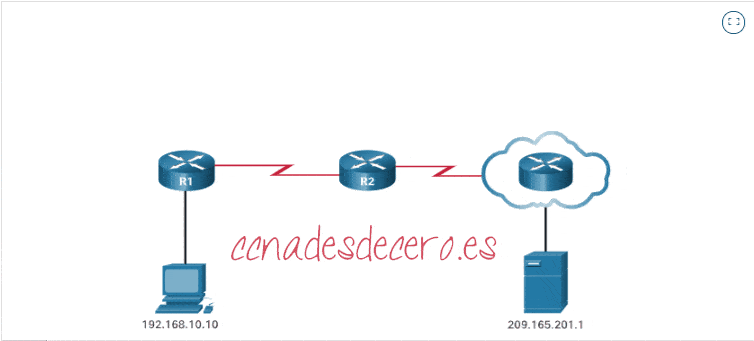

### Terminología NAT (local/global, interna/externa)

Cuando interviene el NAT, una misma comunicación se describe con **cuatro tipos** de dirección IPv4:

| Tipo | Idea sencilla |
|------|----------------|
| **Local interna** | IP **privada** del host **dentro** de la LAN (la que NAT traduce como origen). |
| **Global interna** | IP **pública** que el router asigna/muestra **hacia fuera** por ese host. |
| **Local externa** | Cómo el host interno **ve** al destino (a veces coincide con la global externa). |
| **Global externa** | IP **pública** real del destino en Internet. |

La terminología se aplica **desde el punto de vista del dispositivo cuya dirección traduce el NAT**:

- **Interna** → el equipo **traducido** (suele ser el origen en conexiones salientes).
- **Externa** → el **destino** u otro equipo no traducido por este NAT.
- **Local** → dirección tal como se ve en el **lado privado** de la red.
- **Global** → dirección tal como se ve en el **lado público** (Internet).

**Ejemplo (esquema típico de estudio):** una PC tiene **local interna** `192.168.10.10`. Al salir a un servidor web, para Internet el tráfico parece proceder de una **global interna** pública (p. ej. `209.165.200.226`). El servidor web tiene la misma IP pública como **local externa** y **global externa** desde el punto de vista de la PC.

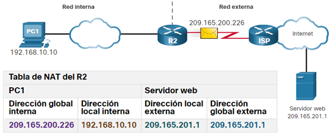

---

## 📂 Tipos de NAT

Existen **tres** modalidades habituales:

1. **NAT estático** (mapeo fijo 1 a 1).
2. **NAT dinámico** (pool público; asignación según demanda).
3. **PAT** (*Port Address Translation*), también llamado **NAT con sobrecarga** (muchos hosts internos, pocas o una sola IP pública; se usan **puertos**).

!!! tip "<strong>Vídeo: tipos de NAT</strong>"
    
    Repaso visual de NAT estático, dinámico y PAT.
    

  <iframe src="https://www.youtube.com/embed/RixJRiG2J9M"
          style="position: absolute; top: 0; left: 0; width: 100%; height: 100%;"
          frameborder="0"
          allow="accelerometer; autoplay; clipboard-write; encrypted-media; gyroscope; picture-in-picture"
          allowfullscreen
          title="Vídeo sobre tipos de NAT"></iframe>

  Vídeo sobre NAT estático, NAT dinámico y PAT.

### NAT estático

Es una correspondencia **fija** entre una IP privada y una pública, configurada por el administrador. Sirve para **servidores** o servicios que deben ser **alcanzables siempre** desde Internet con la misma IP pública (por ejemplo, una web en la DMZ o acceso SSH a una máquina concreta).

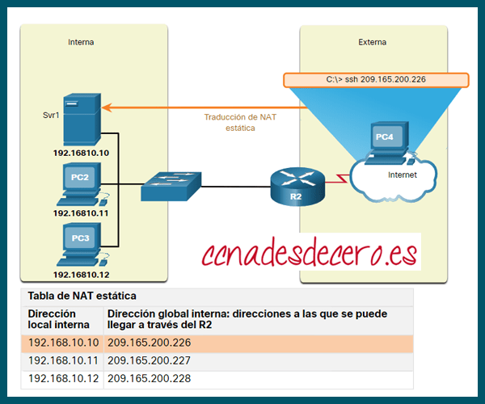

**Condición:** hace falta **tantas IP públicas** como asignaciones simultáneas 1:1 que necesites para esos hosts.

!!! tip "<strong>Vídeo: configurar NAT estática</strong>"
    
    Enlace de apoyo al artículo de NAT estática (CCNA desde cero).
    

  <iframe src="https://www.youtube.com/embed/dV9jK4g1uyw"
          style="position: absolute; top: 0; left: 0; width: 100%; height: 100%;"
          frameborder="0"
          allow="accelerometer; autoplay; clipboard-write; encrypted-media; gyroscope; picture-in-picture"
          allowfullscreen
          title="Vídeo sobre configuración de NAT estática"></iframe>

  Vídeo sobre configuración de NAT estática.

### NAT dinámico

Se usa un **pool** de direcciones públicas. Cuando un host interno inicia tráfico hacia fuera, el router le asigna **una IP pública libre** del pool. También exige **suficientes públicas** para las sesiones que deban estar activas a la vez (cada host que salga “consume” una pública mientras dure el uso según la implementación).

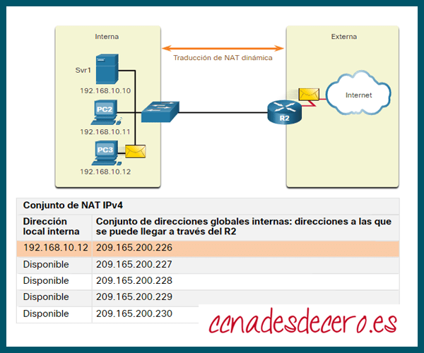

!!! tip "<strong>Vídeo: NAT dinámica</strong>"
    
    Enlace de apoyo al artículo de NAT dinámica (CCNA desde cero).
    

  <iframe src="https://www.youtube.com/embed/rge-SwOx6Dg"
          style="position: absolute; top: 0; left: 0; width: 100%; height: 100%;"
          frameborder="0"
          allow="accelerometer; autoplay; clipboard-write; encrypted-media; gyroscope; picture-in-picture"
          allowfullscreen
          title="Vídeo sobre NAT dinámica"></iframe>

  Vídeo sobre configuración de NAT dinámica.

### PAT (NAT con sobrecarga)

**PAT** traduce **direcciones y puertos** (TCP/UDP). Muchos hosts con IP privada comparten **una** (o pocas) IP públicas; cada sesión se distingue por la combinación **IP pública + puerto**. Es lo habitual en el **router de casa**: el **ISP** da una IP al router y toda la familia navega a la vez.

El cliente elige un **puerto origen** para la sesión; el router NAT puede **conservarlo** o, si ya está en uso, asignar **el primer puerto libre** del rango que corresponda (0–511, 512–1023 o 1024–65535, según el caso).

| | **NAT (estático/dinámico “puro”)** | **PAT** |
|--|-------------------------------------|---------|
| Mapeo | Uno a uno entre IP privada y pública (por host activo). | Una IP pública (o pocas) para **muchos** hosts; intervienen los **puertos**. |
| Traducción | Solo direcciones IPv4. | Direcciones IPv4 **y** puertos TCP/UDP de origen (y estado de la sesión). |
| Uso típico | Empresas con varias públicas; servicios fijos. | Hogar, oficinas pequeñas, la mayoría de salidas a Internet. |

**ISP** (*Internet Service Provider*) es el **proveedor de Internet** que te asigna la conexión y, en muchos casos, la IP pública del router.

#### Ejemplo sencillo de enmascaramiento

- **CLIENTE:** IP `10.1.1.5`, máscara de red grande (red clase A privada `10.0.0.0/8`).
- **ROUTER (gateway):** `10.1.1.1` en LAN; en WAN recibe del ISP la pública **213.97.2.12**.
- El cliente tiene **ruta por defecto** hacia el router. Si pide una web a un servidor remoto, el paquete sale al router; el router **sustituye** la IP origen por **213.97.2.12** y ajusta el puerto si hace falta. La respuesta vuelve al router y este **reescribe** de nuevo hacia `10.1.1.5` y el puerto correcto. El cliente no “ve” el NAT: es **transparente**.

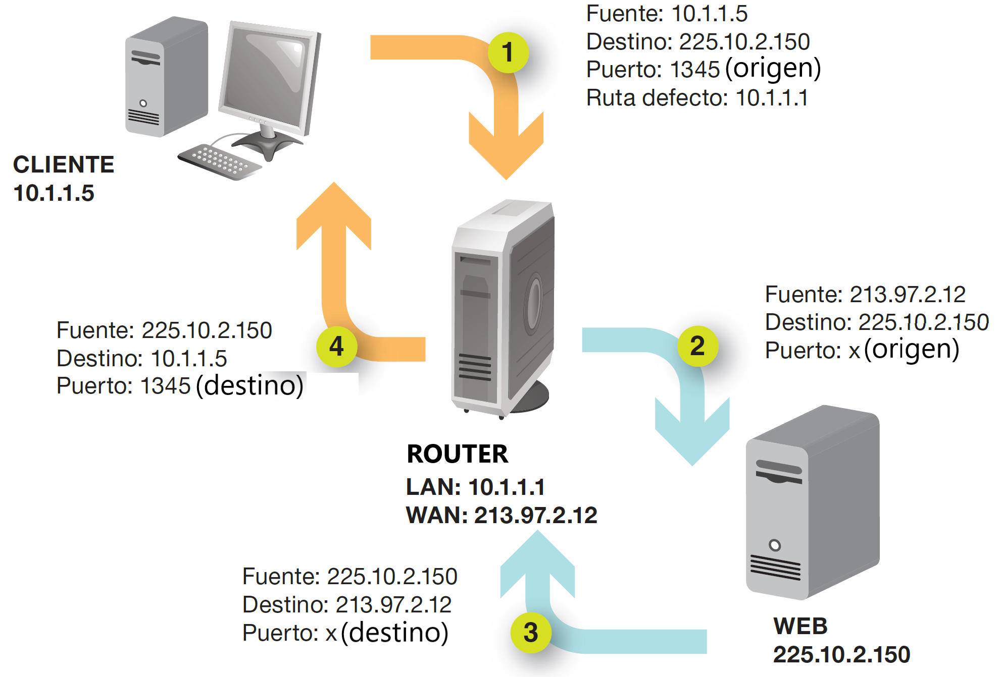

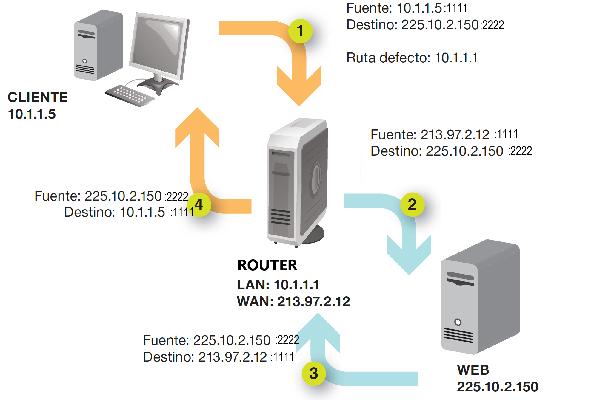

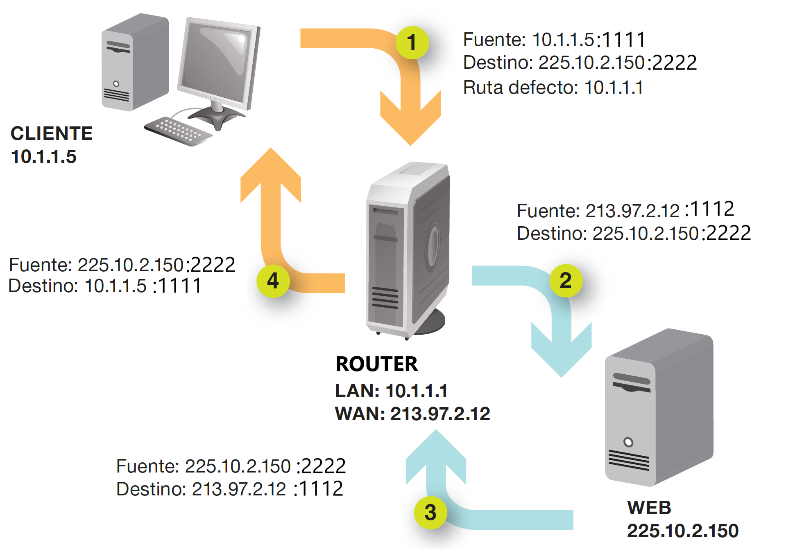

!!! tip "<strong>Vídeo: configurar PAT</strong>"
    
    Vídeo de apoyo para configuración de PAT / NAT sobrecargado.
    

  <iframe src="https://www.youtube.com/embed/I6MLqzfy6BI"
          style="position: absolute; top: 0; left: 0; width: 100%; height: 100%;"
          frameborder="0"
          allow="accelerometer; autoplay; clipboard-write; encrypted-media; gyroscope; picture-in-picture"
          allowfullscreen
          title="Vídeo sobre configuración de PAT"></iframe>

  Vídeo sobre configuración de PAT (NAT con sobrecarga).

!!! note "NAT y “capa 4”"
    Para decidir a qué sesión interna pertenece un paquete de vuelta, el router con **PAT** debe mirar **puertos** (y estado), información de la **capa de transporte**. Eso **no** convierte al router en un “switch de capa 4” completo, pero sí implica un comportamiento más sofisticado que un simple reenvío solo por IP.

---

## 🌍 Protocolo IPv6

**IPv6** (*Internet Protocol version 6*) está pensado para **sustituir a IPv4**. Las direcciones IPv4 tienen **32 bits** (232 ≈ 4.294 millones de direcciones), insuficientes para todos los dispositivos y redes del mundo. En **febrero de 2011** la **IANA** asignó el último bloque grande de IPv4 a **APNIC** (región Asia–Pacífico), lo que aceleró la adopción de IPv6.

| Característica | **IPv4** | **IPv6** |
|----------------|----------|----------|
| Tamaño de la dirección | 32 bits | **128 bits** |
| Notación habitual | Decimal punteada (4 octetos) | **Hexadecimal** en 8 grupos de 16 bits |
| Número aproximado de direcciones | 2^32 | 2^128 (un número enorme) |

IPv6 multiplica por un factor astronómico el espacio de direcciones; en la práctica se espera que **casi todos los dispositivos puedan tener direcciones públicas únicas**, reduciendo la **necesidad de NAT** tal como lo conocemos en IPv4.

!!! tip "<strong>Vídeo: introducción a IPv6</strong>"
    
    Vídeo en español con visión general de IPv6 (complemento a la lectura; el artículo de referencia enlaza también materiales de [CCNA desde cero](https://ccnadesdecero.com/curso/ipv6/)).
    

  <iframe src="https://www.youtube.com/embed/fM-5M93EQak"
          style="position: absolute; top: 0; left: 0; width: 100%; height: 100%;"
          frameborder="0"
          allow="accelerometer; autoplay; clipboard-write; encrypted-media; gyroscope; picture-in-picture"
          allowfullscreen
          title="Vídeo introductorio sobre IPv6"></iframe>

  Vídeo introductorio sobre IPv6 en español.

---

### Formato de una dirección IPv6

- Son **128 bits** → **16 bytes**.
- Se escriben como **8 grupos** de **4 dígitos hexadecimales** separados por **`:`**.
- Cada grupo son **16 bits** (4 hex × 4 bits = 16).

Ejemplo completo:

`2001:0db8:3c4d:0015:0000:0000:1a2f:1a2b`

### Cómo acortar (abreviar) una dirección IPv6

**Regla 1 – Quitar ceros a la izquierda** en cada grupo de 4 hex.  
Ejemplo: `2001:0002:0003:0003:0006:0005:0006:0007` → `2001:2:3:3:6:5:6:7`.

**Regla 2 – Un solo `::` para muchos ceros seguidos**  
Toda una cadena de **grupos consecutivos de ceros** se puede sustituir por **`::`**. **Solo puede haber un `::`** en la misma dirección (si hubiera dos, sería ambiguo).

Ejemplos:

- `FE00:0:0:1:0:0:0:56` → `FE00:0:0:1::56`
- `2001:db8:3c4d:15:0:d234:3eee:0` → `2001:db8:3c4d:15:0:d234:3eee::`

Comprobaciones rápidas (sí/no) para practicar el formato:

- `9999::9999` → **válida** (sintaxis correcta).
- `hhhh::hhhh` → **no** (no son dígitos hex válidos).
- `9999:::9999` → **no** (tres puntos seguidos).
- `FE00::1::56` → **no** (dos `::`).
- `FE00::` → **válida** (abrevia ceros al final).

---
### Estructura General de una Dirección IPv6

La estructura de la dirección se divide en tres partes principales:

| Prefijo de red | Subred | ID de interfaz |
|----------------|--------|----------------|
| Global Prefix  | Subnet ID | Interface ID |
| GGGG:GGGG:GGGG | SSSS   | XXXX:XXXX:XXXX:XXXX |

> **Tamaños de prefijo comunes en IPv6**

| Prefijo | Equivalente IPv4 | Uso típico | Capacidad |
|---------|------------------|------------|-----------|
| `/128`  | Dirección host   | Interface única | 1 dirección |
| `/64`   | Subred estándar  | Por cada enlace LAN/WAN | 18.4 quintillones direcciones |
| `/56`   | Bloque mediano   | ISPs a clientes residenciales | 256 subredes /64 |
| `/48`   | Bloque empresarial | Empresas medianas/grandes | 65,536 subredes /64 |
| `/32`   | Bloque ISP       | Asignación a proveedores | 65,536 subredes /48 |

---
### Prefijo de red en IPv6

Como en IPv4 con CIDR, en IPv6 se usa **`/n`**: los **primeros n bits** identifican la parte de red.

Ejemplo: 

`2010:abcd:ef12::/48` abarca desde  
`2010:abcd:ef12:0000:0000:0000:0000:0000` hasta  
`2010:abcd:ef12:ffff:ffff:ffff:ffff:ffff`.

En diseño real de IPv6 suele pensarse en tres bloques:

1. **Prefijo global** (normalmente **/48** o **/56**)  
   Lo asigna el ISP o el registro correspondiente.  
   - `/48`: habitual en empresa (permite muchísimos enlaces `/64`).  
   - `/56`: frecuente en residencial (también permite muchos enlaces `/64`).  
   - `/64`: tamaño típico de un enlace concreto.

2. **Parte interna de organización** (dentro del bloque recibido)  
   Se usa para estructurar la red por sedes, zonas o servicios de forma jerárquica.

3. **ID de interfaz** (**64 bits**)  
   Identifica el equipo dentro del enlace. Puede configurarse manualmente o generarse automáticamente (por ejemplo con SLAAC).

La **longitud de prefijo** es la idea equivalente a la máscara en IPv4, pero aplicada a direcciones de 128 bits.

---

## 🎯 Tipos de direcciones IPv6

- **Unicast:** identifica **una** interfaz; el paquete va a un solo destino.
- **Anycast:** una dirección que puede estar en **varias** interfaces; el enrutamiento entrega al **más cercano** (útil para balanceo y redundancia).
- **Multicast:** identifica un **grupo** de interfaces; el tráfico llega a varios suscriptores (idea parecida a multicast en IPv4).

Las direcciones **global unicast** son las IPv6 “públicas” routables en Internet, análogas a las IPv4 públicas.

**¿Hay IPv6 “privadas”?**  
Existen direcciones **ULA** (*Unique Local Address*, rango **`fc00::/7`**) con uso parecido a las privadas de IPv4, pero el diseño de IPv6 prioriza **routabilidad global** y subredes `/64` en el acceso.

### Direcciones especiales (unicast)

- **Loopback:** `::1` (equivalente a `127.0.0.1` de IPv4). También se puede escribir `0:0:0:0:0:0:0:1`.
- **Indefinida:** `::/128` (aún no se conoce la dirección).
- **ULA:** `fc00::/7` (similar concepto a RFC 1918, con matices de uso).

La **IANA** reparte bloques enormes a los **RIR** (registros regionales); las organizaciones reciben prefijos mucho más grandes que en IPv4.

---

## 🔀 Coexistencia de IPv4 e IPv6

Hoy conviven **las dos familias** en Internet. Los mecanismos habituales son:

### Pila dual (*dual stack*)

Cada nodo tiene **IPv4 e IPv6** a la vez: dos pilas, dos tablas de encaminamiento. Es **muy extendido** y relativamente sencillo de desplegar, pero duplica gestión y consumo de recursos en los equipos.

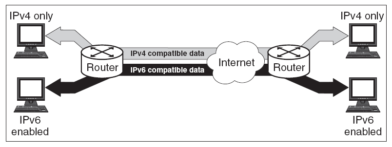

### Túneles

Permiten llevar **IPv6 por redes IPv4** (o al revés en otros diseños) **encapsulando** paquetes dentro de otro protocolo.

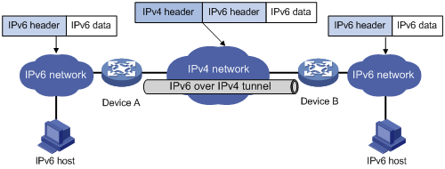

### Traducción

Cuando un extremo **solo IPv4** debe hablar con otro **solo IPv6**, hace falta un **dispositivo que traduzca** cabeceras y, a veces, protocolos. Un ejemplo histórico/conceptual es **NAT-PT**; existen otras técnicas y relays.

La transición completa es **lenta**; durante **años** seguirán conviviendo IPv4 e IPv6. La adopción medida en clientes (por ejemplo, estadísticas de Google u otros informes) ayuda a ver la tendencia.

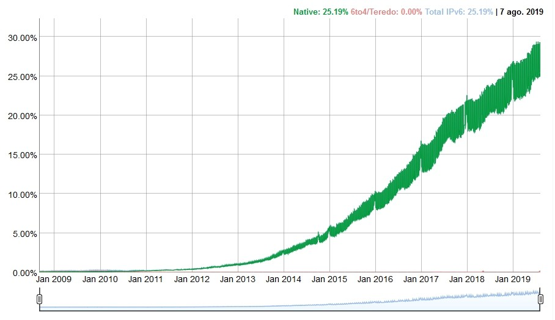

---

## 📚 Bibliografía y fuentes

<!-- * [NAT estático, NAT dinámico y PAT – Marcos Ruiz](https://marcosruiz.github.io/posts/nat/) (CC BY 4.0).
* [Protocolo IPv6 – Marcos Ruiz](https://marcosruiz.github.io/posts/protocolo-ipv6/) (CC BY 4.0). -->
* RFC 1918 – direccionamiento privado en IPv4.
* Materiales complementarios citados en los artículos (p. ej. [CCNA desde cero – IPv6](https://ccnadesdecero.com/curso/ipv6/)).

Las figuras descargadas en `docs/imagenes/` proceden de los artículos de Marcos Ruiz. El título usa **iconos Material** (traducción / intercambio y dígito 6 para IPv6), integrados vía extensión `pymdownx.emoji` de MkDocs Material.

---

## 📝 Actividades

!!! tip "<strong>Formato de entrega</strong>"
    Para la entrega de las actividades, genera un documento con la práctica descrita a continuación. Deberás crear un archivo PDF con el siguiente formato de nombre: <strong>AC9XX.pdf o PR9XX.pdf</strong>, donde las X representan el número de la actividad. Una vez finalizada la práctica, sube el archivo a Aules (antes de la fecha de vencimiento) para su calificación.

* :material-book-open-variant: **Ficha de repaso para el examen**. [Consulta la ficha de repaso para preparar el examen de NAT e IPv6 (resúmenes de conceptos, fórmulas y ejercicios de práctica)](ficha_repaso_tema_9_nat_ipv6.md)

* :simple-readdotcv: **AC901**. (RA1 // CE1a, CE1c // 1–3p). **RFC 1918 y tu equipo.**  
  Indica la dirección IP de tu PC en el aula o en casa (o de un equipo de prueba), su máscara o prefijo y si es **privada** o **pública**. Localiza en qué fila de la tabla RFC 1918 caería si es privada. Explica en dos o tres frases por qué esas direcciones **no se enrutan en Internet** tal cual.

* :simple-readdotcv: **AC902**. (RA1 // CE1a, CE1c // 1–3p). **Terminología NAT.**  
  En un esquema donde una PC `192.168.1.20` sale a Internet y el router muestra la pública `203.0.113.50`, completa una tabla con cuatro filas: **local interna**, **global interna**, **local externa** y **global externa** para el tráfico hacia un servidor web `93.184.216.34`. Explica quién es el “dispositivo traducido” desde el punto de vista del NAT.

* :simple-readdotcv: **AC903**. (RA1 // CE1a, CE1c // 1–3p). **Comparar NAT estático, dinámico y PAT.**  
  Elabora una tabla con tres columnas: **Tipo**, **Cuándo se usa** y **Limitación principal** (en especial, cuántas IP públicas hacen falta). Pon **un ejemplo real o de aula** para cada tipo.

* :simple-readdotcv: **AC904**. (RA4 // CE4a, CE4c // 1–3p). **PAT en la práctica.**  
  Tres dispositivos en `192.168.0.0/24` abren a la vez HTTP (puerto destino 80) hacia el mismo servidor. Explica por qué **no basta** con traducir solo las IP si los tres usan el mismo puerto origen 49152. ¿Qué añade el router a la tabla de NAT para diferenciar las sesiones?

* :simple-cisco: **PR905**. (RA1, RA4, RA5 // CE1a, CE1c, CE4a, CE4c, CE5b // 1–10p).  
  **Configuración en Packet Tracer: NAT estático, NAT dinámico y PAT.**  
  Como futuros técnicos de SMR, debes ser capaz de configurar un router para realizar traducción de direcciones en tres modos distintos y verificar el resultado con comandos de monitorización.

> 🏢 **Escenario de práctica**

- **Router R1** con una interfaz hacia la LAN y otra hacia la WAN/ISP.
- **LAN interna**: red privada `192.168.10.0/24` con:
  - `PC-Admin` (host administrativo).
  - `PC-Aula1` y `PC-Aula2` (clientes de usuario).
  - `SRV-Interno` (servidor interno que se publicará con NAT estático).
- **WAN/Internet simulada**: red pública de laboratorio (por ejemplo `209.165.200.224/27`) con un **Server-Web** externo para pruebas.
- Se trabajará en tres fases: NAT estático → NAT dinámico → PAT.

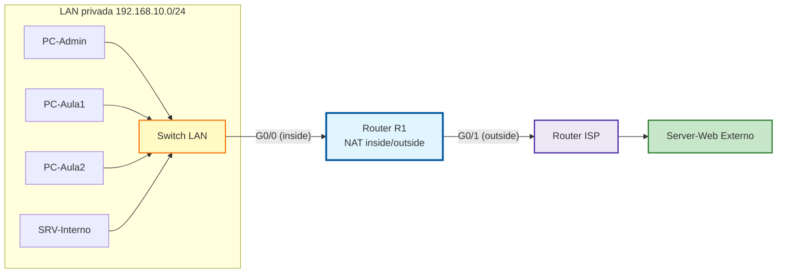

**Tareas obligatorias**

1. **Direccionamiento y conectividad base**

   - Asigna IPs y puerta de enlace a todos los hosts.
   - Configura interfaces de R1 (`inside` y `outside`).
   - Verifica conectividad local con `ping`.

2. **Fase A: NAT estático**

   - Publica `SRV-Interno` con una IP pública fija.
   - Prueba acceso desde la parte externa al servidor interno.
   - Comandos de verificación (según vídeos):  
     `show ip nat translations` y `show ip nat statistics`.

!!! tip "<strong>Vídeo práctica: Packet Tracer 6.4.5 — Configurar NAT estática</strong>"
    
    Resolución paso a paso del laboratorio de Packet Tracer para la **Fase A** (NAT estático).
    

  <iframe src="https://www.youtube.com/embed/5-YefRKAhG4"
          style="position: absolute; top: 0; left: 0; width: 100%; height: 100%;"
          frameborder="0"
          allow="accelerometer; autoplay; clipboard-write; encrypted-media; gyroscope; picture-in-picture"
          allowfullscreen
          title="Vídeo práctica Packet Tracer 6.4.5 - Configurar NAT estática"></iframe>

  Vídeo práctica: Packet Tracer 6.4.5 — Configurar NAT estática (Fase A).

3. **Fase B: NAT dinámico**

   - Crea una ACL para la red interna.
   - Crea un **pool** de IPs públicas.
   - Asocia ACL y pool para NAT dinámico.
   - Verifica cuántos hosts salen simultáneamente según el tamaño del pool.

!!! tip "<strong>Vídeo práctica: Packet Tracer 6.5.6 — Configuración de NAT dinámica</strong>"
    
    Resolución paso a paso del laboratorio de Packet Tracer para la **Fase B** (NAT dinámico con pool).
    

  <iframe src="https://www.youtube.com/embed/wr7vMcanHME"
          style="position: absolute; top: 0; left: 0; width: 100%; height: 100%;"
          frameborder="0"
          allow="accelerometer; autoplay; clipboard-write; encrypted-media; gyroscope; picture-in-picture"
          allowfullscreen
          title="Vídeo práctica Packet Tracer 6.5.6 - Configuración de NAT dinámica"></iframe>

  Vídeo práctica: Packet Tracer 6.5.6 — Configuración de NAT dinámica (Fase B).

4. **Fase C: PAT (NAT con sobrecarga)**

   - Configura PAT usando la interfaz de salida de R1.
   - Genera tráfico simultáneo desde `PC-Admin`, `PC-Aula1` y `PC-Aula2` al servidor externo.
   - Comprueba en la tabla NAT que se distinguen sesiones por puerto.

!!! tip "<strong>Vídeo práctica: Packet Tracer — Configuración de PAT (NAT con sobrecarga)</strong>"
    
    Resolución paso a paso del laboratorio de Packet Tracer para la **Fase C** (PAT / NAT overload).
    

  <iframe src="https://www.youtube.com/embed/LSMWBSK3w6s"
          style="position: absolute; top: 0; left: 0; width: 100%; height: 100%;"
          frameborder="0"
          allow="accelerometer; autoplay; clipboard-write; encrypted-media; gyroscope; picture-in-picture"
          allowfullscreen
          title="Vídeo práctica Packet Tracer - Configuración de PAT"></iframe>

  Vídeo práctica: Packet Tracer — Configuración de PAT / NAT con sobrecarga (Fase C).

5. **Comandos mínimos a usar y capturar en el informe**

   - `show run | section nat`
   - `show access-lists`
   - `show ip nat translations`
   - `show ip nat statistics`
   - `clear ip nat translation *` (entre fases, para limpiar pruebas)

6. **Conclusión técnica (obligatoria)**

   - Explica con tus palabras la diferencia práctica entre NAT estático, NAT dinámico y PAT.
   - Indica qué opción usarías en:  
     a) publicación de un servidor interno,  
     b) salida de muchos equipos de aula a Internet con una sola IP pública.

* :simple-readdotcv: **AC906**. (RA1 // CE1a, CE1c // 1–3p). **Abreviar IPv6.**  
  Escribe la forma **abreviada** correcta de:

  1. `2001:0db8:00aa:0000:0000:0000:00cd:00ef`
  2. `fe80:0000:0000:0000:0202:b3ff:fe1e:8329`
  3. `fc00:0000:0000:0000:0000:0000:0000:0001`

  Indica además si `2001:db8::1::2` es válida y por qué.

* :simple-readdotcv: **AC907**. (RA1 // CE1a, CE1c // 1–3p). **Prefijo /64.**  
  Dada la dirección `2001:db8:acad:1::100/64`, escribe el **prefijo de red** en notación corta y el rango completo del bloque en forma desarrollada (primera y última dirección del prefijo, sin entrar en detalles de subredes más finas).

* :simple-readdotcv: **AC908**. (RA1 // CE1a, CE1c // 1–3p). **Unicast, anycast y multicast.**  
  Define con tus palabras los tres tipos. Propón **un caso de uso** para multicast y **uno** para anycast (por ejemplo, servicios duplicados en varios centros de datos).

<!-- 

* :simple-readdotcv: **AC909**. (RA1 // CE1a, CE1c // 1–3p). **Direcciones especiales.**  
  Explica qué es `::1`, qué es `::/128` y para qué sirve el bloque ULA `fc00::/7`. ¿Por qué en IPv6 se dice que el NAT “de masas” deja de ser tan necesario como en IPv4?

* :simple-readdotcv: **AC910**. (RA4 // CE4a, CE4c // 1–3p). **Pila dual vs túnel.**  
  Resume en viñetas **ventajas** e **inconvenientes** de la pila dual frente a un túnel IPv6-in-IPv4 en una sede que aún tiene solo tránsito IPv4 hacia el ISP.

* :simple-readdotcv: **AC911**. (RA5 // CE5b // 1–3p). **Comprobaciones en el aula o en casa.**  
  En un equipo con Windows o Linux (con permiso y en red autorizada):

  1. Anota si tienes dirección **IPv4** y **IPv6** en la interfaz activa (comandos tipo `ipconfig` / `ip -br a`).
  2. Indica si ves una dirección **link-local** IPv6 (suele empezar por `fe80:`).
  3. Redacta un párrafo sobre qué harías si un compañero “no tiene IPv6” pero el proveedor sí lo anuncia (idea general: comprobar router, pila dual, reinicios; sin necesidad de capturas reales si no hay acceso). -->
