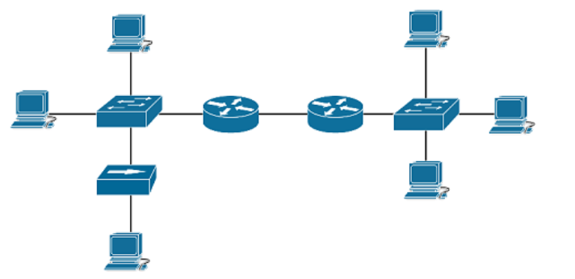
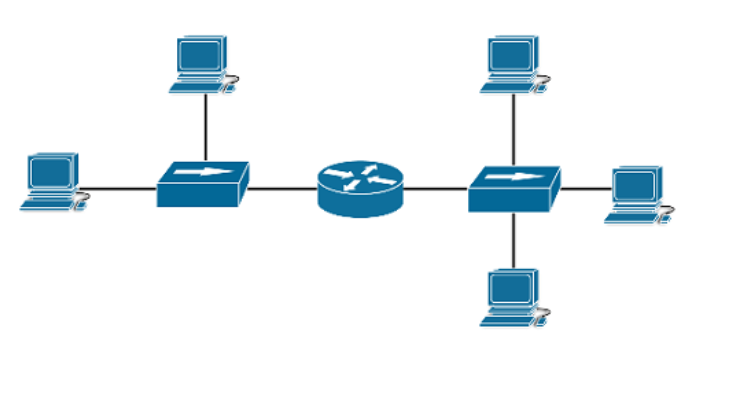

# 🔍 PRÁCTICA 5.3: IDENTIFICACIÓN DE DOMINIOS DE COLISIÓN Y DIFUSIÓN

Esta práctica tiene como objetivo que los alumnos identifiquen y analicen correctamente los diferentes dominios de colisión y difusión en diversas topologías de red mediante preguntas tipo test, aplicando los conocimientos adquiridos sobre el funcionamiento de hubs, switches y routers en la segmentación de redes.

## 📚 Propuesta didáctica

En esta práctica trabajamos el **RA1 de RAL**:

> **RA1.** *Reconoce la estructura de redes locales cableadas analizando las características de entornos de aplicación y describiendo la funcionalidad de sus componentes.*

### 🎯 Criterios de evaluación trabajados

* **CE1a**: Se han descrito los principios de funcionamiento de las redes locales.
* **CE1c**: Se han descrito los elementos de la red local y su función.
* **CE5d**: Se han identificado los dominios de colisión y difusión en diferentes topologías de red.

### 🎯 Objetivos de la práctica

* Identificar correctamente los dominios de colisión en diferentes topologías de red.
* Identificar correctamente los dominios de difusión (broadcast) en diferentes topologías de red.
* Diferenciar el comportamiento de hubs, switches y routers respecto a los dominios.
* Analizar el impacto de diferentes dispositivos en la segmentación de la red.
* Aplicar el conocimiento teórico mediante preguntas tipo test.

---

## 📋 Instrucciones

**Instrucciones:** Subraya la respuesta correcta para cada pregunta. En las preguntas que indiquen múltiples opciones correctas, marca todas las opciones válidas.

**Conceptos clave a recordar:**

- **Dominio de colisión**: Conjunto de dispositivos cuyas tramas pueden colisionar entre sí al transmitir simultáneamente.
  - Los **hubs** extienden el dominio de colisión (todos los dispositivos conectados a un hub comparten un dominio de colisión).
  - Los **switches** crean un dominio de colisión por puerto (cada puerto del switch tiene su propio dominio de colisión).
  - Los **routers** separan dominios de colisión (cada interfaz del router es un dominio de colisión independiente).

- **Dominio de difusión (broadcast domain)**: Conjunto de dispositivos que reciben tramas de broadcast.
  - Los **hubs** extienden el dominio de difusión.
  - Los **switches** extienden el dominio de difusión (todos los puertos de un switch están en el mismo dominio de difusión).
  - Los **routers** limitan el dominio de difusión (cada interfaz del router es un dominio de difusión independiente).

---

## 📝 Ejercicios

### Pregunta 1

**¿Cuál de las siguientes situaciones hacen que PC3 se encuentre en el mismo dominio de colisión que PC1?**

a) PC3 está conectada al mismo switch que PC1

b) PC3 está separada de PC1 al utilizar un switch

c) PC3 está separada de PC1 al utilizar un hub

d) PC3 está conectada a una interfaz de un router y PC1 se encuentra en otra interfaz del mismo router

---

### Pregunta 2

**¿Cuáles de las siguientes situaciones hacen que PC3 se encuentre en otro dominio de broadcast que PC1? (2 opciones)**

a) PC3 está separada de PC1 a través de un hub

b) PC3 se conecta al mismo switch que PC1

c) PC3 está separada de PC1 por un bridge

d) PC3 está en otra red lógica que PC1

e) PC3 se encuentra separada de PC1 por un switch

f) PC3 está separada de PC1 por un router

---

### Pregunta 3

Observa la siguiente topología de red:

<figure style="text-align: center;">
    
    <figcaption>Topología 1: Red con Switches y Routers</figcaption>
</figure>

**¿Cuántos dominios de broadcast y de colisión existen en la imagen?**

a) 3 dominios broadcast, 3 dominios colisión

b) 2 dominios broadcast, 3 dominios colisión

c) 1 dominio broadcast, 2 dominios colisión

d) 3 dominios broadcast, 8 dominios colisión

e) 8 dominios broadcast, 3 dominios colisión

f) Ninguna de las anteriores

---

### Pregunta 4

Observa la siguiente topología de red:

<figure style="text-align: center;">
    
    <figcaption>Topología 2: Red con múltiples Switches y Routers</figcaption>
</figure>

**¿Cuántos dominios de broadcast y de colisión existen en la imagen?**

a) 3 dominios broadcast, 9 dominios colisión

b) 9 dominios broadcast, 3 dominios colisión

c) 3 dominios broadcast, 10 dominios colisión

d) 2 dominios broadcast, 10 dominios colisión

e) 0 dominios broadcast, 3 dominios colisión

f) Ninguna de las anteriores

---

### Pregunta 5

Observa la siguiente topología de red (si no hay imagen específica, usa la topología 1):

<figure style="text-align: center;">
    
    <figcaption>Topología 3: Red con Switches y Router</figcaption>
</figure>

**¿Cuántos dominios de broadcast y de colisión existen en la imagen?**

a) 2 dominios broadcast, 2 dominios colisión

b) 2 dominios broadcast, 7 dominios colisión

c) 7 dominios broadcast, 2 dominios colisión

d) 3 dominios broadcast, 3 dominios colisión

e) 7 dominios broadcast, 7 dominios colisión

f) Ninguna de las anteriores

---

### Pregunta 6

**¿Qué afirmaciones son ciertas? (3 opciones)**

a) Los switches disminuyen el número de dominios de colisiones

b) Los routers disminuyen el número de dominios de colisiones

c) Los routers aumentan el número de dominios de colisiones

d) Los switches aumentan el número de dominios de colisiones

e) Los bridges disminuyen el número de dominios de colisiones

f) Los bridges aumentan el número de dominios de colisiones

---

### Pregunta 7

**¿Qué afirmación es incorrecta?**

a) Los hubs aumentan el número de dominios de broadcast

b) Los routers aumentan el número de dominios de colisiones

c) Los routers aumentan el número de dominios de broadcast

d) Cada interfaz del router es un dominio de broadcast y un dominio de colisión

e) Los switches aumentan el número de dominios de colisiones

---

<!-- ## 📊 Criterios de evaluación

### 🎯 Evaluación técnica

| Criterio | Puntuación | Descripción |
|----------|------------|-------------|
| **Identificación correcta de dominios** | 50% | Respuestas correctas a preguntas sobre dominios de colisión y difusión |
| **Comprensión teórica de dispositivos** | 30% | Respuestas correctas a preguntas teóricas sobre hubs, switches y routers |
| **Análisis de topologías** | 20% | Correcta identificación de dominios en diagramas de red |

**Total: 18 puntos**

**Distribución de puntos:**
- Preguntas 1-2: 2 puntos cada una (total: 4 puntos)
- Preguntas 3-5: 3 puntos cada una (total: 9 puntos)
- Preguntas 6-7: 2.5 puntos cada una (total: 5 puntos)

---

## 📋 Formato de entrega

### 📄 Documento requerido

Elabora un documento PDF con el siguiente contenido:

1. **Portada** con:
   - Nombre y apellidos del alumno/a
   - Curso y grupo
   - Fecha de entrega
   - Título: "PR503 - Identificación de Dominios de Colisión y Difusión"

2. **Respuestas:**
   - Todas las preguntas respondidas subrayando o marcando claramente la opción elegida
   - Para preguntas con múltiples opciones correctas, marcar todas las opciones válidas
   - Justificación breve (opcional pero recomendado) para las preguntas de diagramas

### 📝 Nombre del archivo

Guardar el documento como: `PR503_apellido_nombre.pdf`

---

## 💡 Recomendaciones

- **Lee cuidadosamente cada pregunta** antes de responder
- **Analiza los diagramas** contando cuidadosamente cada dominio
- **Recuerda las reglas fundamentales:**
  - Hub = un dominio de colisión por hub, extiende difusión
  - Switch = un dominio de colisión por puerto, extiende difusión
  - Router = separa tanto colisiones como difusiones
  - Bridge = similar al switch (aumenta dominios de colisión)
- **Para preguntas con múltiples opciones correctas**, asegúrate de marcar todas las opciones válidas
- **Revisa tus respuestas** antes de entregar

---

## ⏰ Cronograma de trabajo

| Sesión | Actividad | Duración |
|--------|-----------|----------|
| **1** | Repaso de conceptos y preguntas 1-3 | 1 hora |
| **2** | Preguntas 4-5 (análisis de diagramas) | 1 hora |
| **3** | Preguntas 6-7 (teoría) y revisión | 1 hora |
| **4** | Revisión final y entrega | 1 hora |

---

## 📚 Conceptos clave a demostrar

### 🔴 Dominios de colisión
- Definición y características
- Comportamiento con hubs, switches y routers
- Impacto en el rendimiento de la red

### 🔵 Dominios de difusión
- Definición y características
- Comportamiento con hubs, switches y routers
- Estrategias para limitar broadcasts

### 🔌 Dispositivos de red
- **Hub**: Capa 1, extiende colisiones y difusiones
- **Switch/Bridge**: Capa 2, segmenta colisiones, extiende difusiones
- **Router**: Capa 3, segmenta colisiones y difusiones

---

## ✅ Checklist de entrega

Antes de entregar, verifica que incluyas:

- [ ] Portada con datos del alumno/a
- [ ] Todas las preguntas respondidas (subrayadas o marcadas)
- [ ] Todas las opciones correctas marcadas en preguntas con múltiples respuestas
- [ ] Justificaciones para preguntas de diagramas (recomendado)
- [ ] Documento en formato PDF con nombre correcto (PR503_apellido_nombre.pdf)

---

## 🎓 Competencias desarrolladas

### 🔧 Competencias técnicas
- Identificación de dominios de colisión y difusión
- Comprensión del funcionamiento de dispositivos de red
- Análisis de topologías de red
- Aplicación de conceptos teóricos a casos prácticos

### 🤝 Competencias transversales
- Análisis crítico
- Comprensión lectora
- Pensamiento lógico
- Trabajo metodológico

---

!!! tip "<strong>CONSEJO FINAL</strong>"
    Esta práctica te ayudará a comprender cómo los diferentes dispositivos afectan la estructura de una red. Presta especial atención a las diferencias entre hubs, switches y routers, y practica contando dominios en diferentes topologías antes de responder. -->
