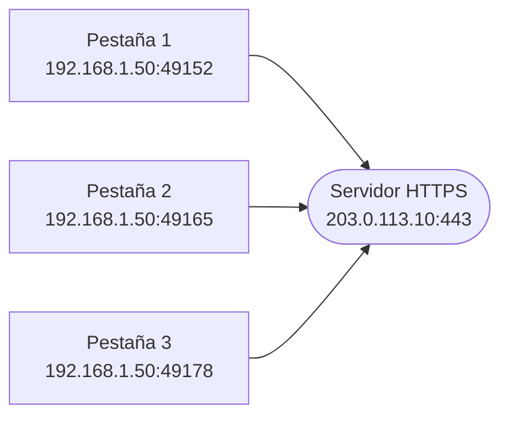
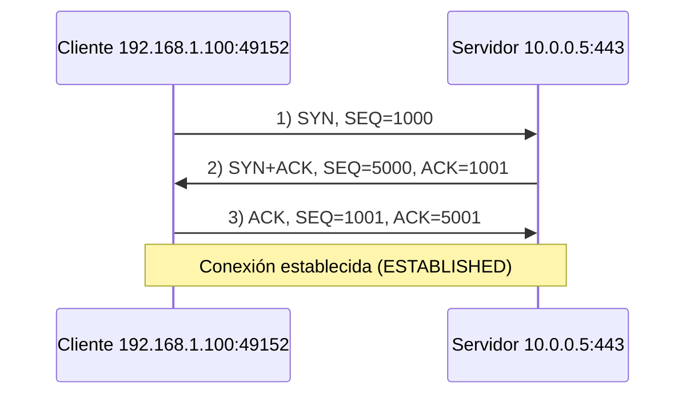
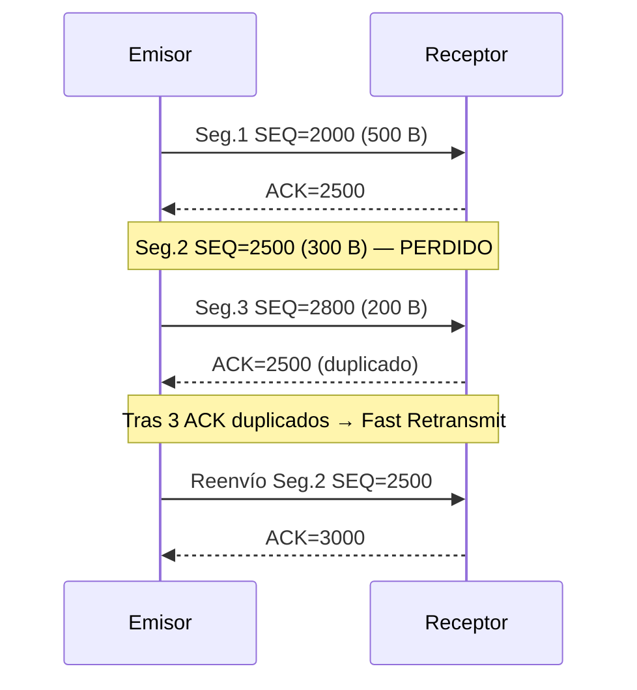
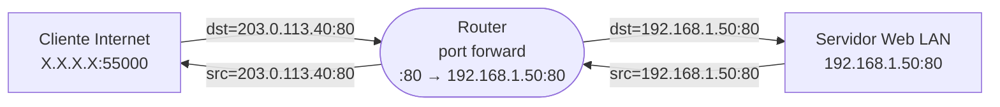

# Soluciones de la ficha de repaso - Tema 8 (Capa de Transporte)

**Módulo:** Redes de Área Local (RAL)  
**Curso:** Sistemas Microinformáticos y Redes (SMR)

Este documento contiene la **resolución paso a paso** de todas las actividades planteadas en la [ficha de repaso del tema 8](../ficha_repaso_tema_8_transporte.md).

---

## Actividad 1 – Clasificación de puertos

> **Puerto:** número de **16 bits** (0–65535) que identifica una aplicación dentro de un host. Se clasifica por rangos:
>
> - **Bien conocidos:** 0–1023 → servicios estándar.
> - **Registrados:** 1024–49151 → aplicaciones de usuario.
> - **Efímeros (dinámicos):** 49152–65535 → asigna el SO al cliente al abrir una conexión.

Aplicando ese criterio:

| Puerto | Tipo | Servicio asociado |
|------:|------|-------------------|
| 22 | Bien conocido | SSH / SCP / SFTP (administración remota segura) |
| 25 | Bien conocido | SMTP (envío de correo) |
| 53 | Bien conocido | DNS (resolución de nombres) |
| 80 | Bien conocido | HTTP (web sin cifrar) |
| 443 | Bien conocido | HTTPS (web cifrada con TLS) |
| 1234 | Registrado | sin servicio estándar (uso de aplicación de usuario) |
| 3306 | Registrado | MySQL (base de datos) |
| 8080 | Registrado | HTTP alternativo / proxy |
| 49200 | Efímero | puerto dinámico de cliente |
| 60000 | Efímero | puerto dinámico de cliente |

**Idea clave:** los puertos ≤ 1023 los reserva el SO para servicios fijos (suelen requerir privilegios de administrador). Los efímeros son temporales y solo viven mientras dura la conexión del cliente.

---

## Actividad 2 – Sockets en una sesión HTTPS

> **Socket:** par `IP:puerto` que identifica un extremo de la comunicación.  
> **Conexión:** queda identificada por la **5-tupla** `(protocolo, IP_orig, puerto_orig, IP_dest, puerto_dest)`.

**1. Sockets cliente** (uno por pestaña: IP del PC + puerto efímero asignado por el SO):

- Pestaña 1: `192.168.1.50:49152`
- Pestaña 2: `192.168.1.50:49165`
- Pestaña 3: `192.168.1.50:49178`

**2. Socket servidor** (HTTPS escucha en el mismo puerto bien conocido para todos): `203.0.113.10:443`. Es **común** a las tres conexiones.

**3. ¿Cómo distingue el servidor las tres pestañas?** Aunque comparten IP origen, IP destino y puerto destino, **el puerto origen es distinto** en cada pestaña. Por tanto la 5-tupla es diferente y permite **desmultiplexar** correctamente cada flujo:

| Conexión | 5-tupla identificativa |
|---|---|
| 1 | (TCP, 192.168.1.50, **49152**, 203.0.113.10, 443) |
| 2 | (TCP, 192.168.1.50, **49165**, 203.0.113.10, 443) |
| 3 | (TCP, 192.168.1.50, **49178**, 203.0.113.10, 443) |

> **Multiplexación / desmultiplexación:** la capa de transporte usa los puertos para mezclar (en el emisor) y separar (en el receptor) datos de varias aplicaciones que comparten la misma interfaz de red.

---

## Actividad 3 – Multiplexación en un equipo

Solución tipo (los puertos efímeros son válidos porque están en 49152–65535):

| Protocolo | Socket local | Socket remoto | Aplicación |
|-----------|--------------|---------------|------------|
| TCP | `192.168.1.20:49200` | `172.16.0.5:22` | SSH al servidor A |
| TCP | `192.168.1.20:49210` | `203.0.113.20:443` | HTTPS pestaña 1 al servidor B |
| TCP | `192.168.1.20:49211` | `203.0.113.20:443` | HTTPS pestaña 2 al servidor B |
| UDP | `192.168.1.20:50001` | `203.0.113.99:3478` | VoIP al servidor C |

**¿Por qué las dos pestañas HTTPS no pueden compartir puerto origen?** La 5-tupla `(protocolo, IP_orig, puerto_orig, IP_dest, puerto_dest)` debe ser **única** en todo el sistema. Las dos pestañas comparten 4 de los 5 elementos (mismo PC, mismo servidor, mismo puerto 443, mismo TCP); si encima compartieran el puerto origen, las tuplas serían **idénticas** y ni el SO ni el servidor podrían saber a qué pestaña entregar cada paquete de respuesta. Por eso el SO asigna a cada nueva conexión un **puerto efímero distinto**.

---

## Actividad 4 – Elección TCP vs UDP

> **TCP:** orientado a conexión, fiable (retransmite lo perdido), entrega en orden. Penaliza un poco la latencia.  
> **UDP:** sin conexión, no fiable, entrega lo más rápido posible. Cabecera de solo 8 B.

| Caso | Protocolo | Justificación |
|------|-----------|---------------|
| 1. Descarga ISO 4 GB por FTP | **TCP** | Imprescindible que lleguen **todos** los bytes en orden y sin errores; el tiempo no es crítico. |
| 2. Videollamada en directo | **UDP** | Prioriza **baja latencia**; una retransmisión llegaría tarde y rompería la conversación. Se toleran pequeñas pérdidas. |
| 3. Consulta DNS a `8.8.8.8` | **UDP** | Mensajes cortos (pregunta/respuesta) y baja latencia. Solo se usa TCP si la respuesta supera 512 B o en transferencias de zona. |
| 4. Correo SMTP de 5 KB | **TCP** | El correo debe llegar íntegro y en orden; SMTP usa TCP/25 por diseño. |
| 5. Shooter online | **UDP** | Necesita **mínima latencia**; si se pierde un paquete con la posición, ya llegará la siguiente actualización. |
| 6. Telemetría IoT (1 lectura/s) | **UDP** | Mensajes cortos y periódicos; si se pierde una muestra, la siguiente la sustituye. Ahorra batería y cabeceras. |
| 7. Transferencia bancaria HTTPS | **TCP** | Se exige fiabilidad y orden. HTTPS se monta sobre TCP/443 (TLS necesita un canal fiable). |
| 8. TFTP de arranque | **UDP** | TFTP (UDP/69) está diseñado sobre UDP: cabecera mínima y mecanismo propio de retransmisión sencillo. |

**Regla práctica:** si **un solo byte que falte arruina** la información (archivo, transacción, comando), usa TCP. Si **cada paquete tiene poca vida útil** (vídeo, voz, juego en directo, telemetría), UDP.

---

## Actividad 5 – Three-way handshake

> **ISN (Initial Sequence Number):** número de secuencia inicial que cada extremo elige aleatoriamente al abrir la conexión.  
> **SEQ:** posición del primer byte de datos del segmento.  
> **ACK:** siguiente byte que el receptor espera recibir (acuse cumulativo).  
> Durante el handshake, **el flag SYN consume 1 número de secuencia** aunque no transporte datos.

Con `ISN_cliente = 1000` e `ISN_servidor = 5000`:

| Paso | Origen → Destino | Flags | SEQ | ACK |
|:----:|------------------|-------|----:|----:|
| 1 | Cliente → Servidor | **SYN** | 1000 | — |
| 2 | Servidor → Cliente | **SYN, ACK** | 5000 | 1001 |
| 3 | Cliente → Servidor | **ACK** | 1001 | 5001 |

Razonamiento paso a paso:

1. El cliente pide abrir la conexión y propone su ISN: `SEQ = 1000`.
2. El servidor responde con su propio ISN (`SEQ = 5000`) y reconoce el SYN del cliente: `ACK = ISN_cliente + 1 = 1001` (el SYN consume un número de secuencia).
3. El cliente reconoce el SYN del servidor: `ACK = 5000 + 1 = 5001`. Su `SEQ` ya ha avanzado a `1001`.

**Primer segmento con datos del cliente** tras el handshake: viajará con `SEQ = 1001` (siguiente byte a enviar después de que el SYN haya consumido el 1000).

---

## Actividad 6 – Números de secuencia TCP

> **Regla:** `SEQ_siguiente = SEQ_actual + bytes_de_datos`. El **ACK cumulativo** es el **número del siguiente byte** que se espera recibir, no del último recibido.

**1. Cálculo de los SEQ:**

| Segmento | SEQ inicial | Bytes | Rango de bytes ocupados |
|---|---:|---:|---|
| 1 | 2000 | 500 | 2000 – 2499 |
| 2 | 2500 | 300 | 2500 – 2799 |
| 3 | 2800 | 200 | 2800 – 2999 |

Se obtiene `SEQ_2 = 2000 + 500 = 2500` y `SEQ_3 = 2500 + 300 = 2800`.

**2. ACK si llegan los tres correctamente:** el último byte recibido es el **2999**, así que el receptor pide el **siguiente**: `ACK = 3000`.

**3. Si se pierde el segmento 2 y llegan el 1 y el 3:**

- Tras recibir el segmento 1 → `ACK = 2500` (espera el byte 2500, primer byte del seg. 2).
- Tras recibir el segmento 3 → **no** puede avanzar el ACK porque le falta el hueco 2500–2799. Devuelve **otra vez** `ACK = 2500` → es un **ACK duplicado**.

**4. ¿Se reenvía todo el flujo?** **No.** TCP solo retransmite el **segmento perdido** (el 2). Cuando el emisor recibe **tres ACK duplicados**, activa el **fast retransmit** y reenvía el seg. 2 sin esperar al timeout. Al llegar, el receptor completa el hueco y devuelve `ACK = 3000`.

---

## Actividad 7 – Segmentación de un fichero

Datos: archivo = 24 000 B; MTU = 1 500 B; cabeceras IP + TCP = 20 + 20 = 40 B.

> **MTU:** mayor tamaño (en bytes) que admite la trama del enlace.  
> **MSS:** mayor cantidad de **datos de aplicación** que cabe en un segmento TCP (sin contar cabeceras).

**1. MSS:**

`MSS = MTU − cab_IP − cab_TCP = 1 500 − 20 − 20 = 1 460 bytes`.

**2. Número de segmentos:**

`n = ⌈ 24 000 / 1 460 ⌉ = ⌈ 16,438 ⌉ = 17 segmentos`.

**3. Bytes del último segmento:**

- Los 16 primeros transportan `16 × 1 460 = 23 360 B`.
- Quedan `24 000 − 23 360 = 640 B` para el segmento 17.

**4. ¿Hay que reenviar todo si se pierde el segmento 5?** **No.** TCP es fiable **byte a byte**: el receptor seguirá emitiendo ACKs duplicados pidiendo el primer byte del segmento 5 (los segmentos 6, 7… que llegan se almacenan en el buffer fuera de orden). Tras 3 ACK duplicados (o un timeout), el emisor aplica **fast retransmit** y **solo retransmite el segmento 5**. El resto del flujo no se vuelve a enviar.

---

## Actividad 8 – Ventana deslizante

> **rwnd (receive window):** bytes libres que tiene el receptor en su buffer; los anuncia en cada ACK.  
> **Bytes en vuelo:** datos enviados que aún no han sido confirmados con ACK.

**1.** Con `rwnd = 8 KB` y segmentos de 1 KB, el emisor puede tener como máximo `8 KB / 1 KB = 8 segmentos` en vuelo sin recibir ningún ACK.

**2.** Tras confirmar 3 KB y anunciar `rwnd = 4 KB`, el emisor puede tener hasta `4 KB` adicionales sin ACK → puede mandar **4 segmentos nuevos** (los nº 4, 5, 6 y 7) y luego deberá esperar.

**3.** Si la aplicación receptora no lee los datos, el buffer se va llenando → la `rwnd` anunciada en cada ACK **disminuye**. Cuando llega a `rwnd = 0`, el emisor se **detiene** (situación de *zero window*) y solo enviará pequeños sondeos periódicos hasta que el receptor anuncie `rwnd > 0`.

**4. Control de flujo vs control de congestión:**

| Mecanismo | Lo impone | Para no saturar… | Variable |
|---|---|---|---|
| **Control de flujo** | el **receptor** | su propio buffer | `rwnd` |
| **Control de congestión** | el **emisor** | la **red** entre los dos extremos | `cwnd` |

En cada momento, los bytes en vuelo permitidos son `min(rwnd, cwnd)`.

---

## Actividad 9 – Pérdidas y reacción del emisor

**1. Significado de un ACK duplicado:** el receptor ha recibido un segmento **fuera de orden** (le falta uno anterior) y vuelve a pedir el byte que aún no ha llegado. Tres ACK duplicados con el mismo número indican con alta probabilidad que **el segmento cuyo byte se está reclamando se ha perdido**, aunque los posteriores sí han llegado.

**2. Reacción ante 3 ACK duplicados → Fast Retransmit + Fast Recovery:**

- El emisor **reenvía inmediatamente** el segmento perdido sin esperar al timeout.
- `cwnd` se **reduce a la mitad** (no a 1 MSS) y `ssthresh` se ajusta a ese nuevo valor.
- Se entra en **fast recovery**: la red sigue funcionando, así que el emisor evita volver a *slow start*.

**3. Reacción ante timeout** (no llega ningún ACK): se asume **congestión severa** (la red puede estar muy saturada o incluso caída).

> **`ssthresh` (slow start threshold):** umbral que separa las dos fases de crecimiento de `cwnd`.
>
> - Mientras `cwnd < ssthresh` → fase de **slow start**: `cwnd` **se duplica** cada RTT (crecimiento *exponencial*, muy rápido).
> - Cuando `cwnd ≥ ssthresh` → fase de **congestion avoidance**: `cwnd` **aumenta en 1 MSS** por RTT (crecimiento *lineal*, prudente).
>
> En otras palabras, `ssthresh` marca el punto en el que el emisor deja de "acelerar a fondo" y empieza a "acelerar con cuidado".

Pasos concretos tras el timeout:

1. **`ssthresh ← cwnd / 2`**: se guarda como nuevo umbral la **mitad de la ventana que estábamos usando justo antes de la pérdida**. La idea es: "esa ventana era demasiado grande para la red, así que la próxima vez que lleguemos a la mitad de ese valor ya iremos con pies de plomo".
2. **`cwnd ← 1 MSS`**: la ventana de congestión se reinicia al mínimo (1 segmento). El emisor vuelve a empezar como si la conexión fuese nueva.
3. **Slow start** otra vez: `cwnd` crece exponencialmente (1 → 2 → 4 → 8 …) hasta alcanzar el nuevo `ssthresh`.
4. A partir de ese umbral se pasa a **congestion avoidance** y `cwnd` ya solo crece de 1 en 1 MSS por RTT.

**Ejemplo numérico.** Supón que en el momento del timeout `cwnd = 16 MSS`:

- `ssthresh = 16 / 2 = 8 MSS`.
- `cwnd` baja a `1 MSS`.
- Slow start: `1 → 2 → 4 → 8` (aquí `cwnd` ya iguala a `ssthresh`).
- A partir de `8 MSS` se entra en congestion avoidance: `8 → 9 → 10 → 11 …`, sumando 1 MSS por RTT.

Así se consigue **recuperar capacidad rápidamente al principio** pero **frenar antes de volver al valor que provocó la pérdida**.

**Comparación rápida:**

| Evento | Diagnóstico | Reacción de `cwnd` |
|---|---|---|
| 3 ACK duplicados | pérdida puntual, la red sigue viva | `cwnd ← cwnd / 2` (fast recovery) |
| Timeout | congestión grave o ruta caída | `cwnd ← 1 MSS` (slow start) |

---

## Actividad 10 – Interpretación de `netstat`

> **`LISTENING`** → puerto local abierto a la espera de conexiones (servicio).  
> **`ESTABLISHED`** → conexión TCP en curso entre dos sockets.  
> Si el puerto local es **bien conocido** (≤ 1023), el equipo está **ofreciendo** ese servicio. Si es **efímero**, el equipo es **cliente** de una conexión saliente.

| Línea | Tipo | Explicación |
|---|---|---|
| `TCP 192.168.1.10:49800 → 142.250.190.14:443 ESTABLISHED` | **Saliente** (cliente) | Puerto local efímero (49800) → destino 443 = **HTTPS** (servidor de Google). |
| `TCP 192.168.1.10:49821 → 52.84.229.23:443 ESTABLISHED` | **Saliente** (cliente) | Puerto local efímero → 443 = **HTTPS** (rango típico de CloudFront/AWS). |
| `TCP 192.168.1.10:22 → 0.0.0.0:0 LISTENING` | **Servicio** del equipo | Puerto 22 en escucha → el equipo ofrece **SSH**. `0.0.0.0:0` indica "cualquier IP/puerto remoto". |
| `TCP 192.168.1.10:49850 → 10.0.0.7:3306 ESTABLISHED` | **Saliente** (cliente) | Destino 3306 → cliente de un **servidor MySQL** interno. |
| `UDP 192.168.1.10:5353 *:*` | **Servicio** UDP | Puerto 5353/UDP = **mDNS** (descubrimiento de servicios en LAN, "Bonjour"/Avahi). |

**Resumen:**

- Servicios que ofrece el equipo: **SSH (22/TCP)** y **mDNS (5353/UDP)**.
- Puertos efímeros usados como cliente: **49800, 49821, 49850**.
- Conexiones TCP salientes deducidas: dos a HTTPS (443) y una a MySQL (3306).

---

## Actividad 11 – Reglas de cortafuegos (política restrictiva)

> **Política restrictiva:** todo lo que no esté permitido explícitamente queda **denegado**. Las reglas se procesan **en orden**: la primera coincidencia decide la acción.

**1. Tabla de reglas:**

| Orden | Dirección | Origen | Destino | Protocolo/puerto | Acción |
|:----:|-----------|--------|---------|------------------|--------|
| 1 | Saliente | `192.168.0.0/24` | any | TCP/80 (HTTP) | Permitir |
| 2 | Saliente | `192.168.0.0/24` | any | TCP/443 (HTTPS) | Permitir |
| 3 | Saliente | `192.168.0.0/24` | `8.8.8.8` | UDP/53 (DNS) | Permitir |
| 4 | Saliente | `192.168.0.0/24` | `8.8.8.8` | TCP/53 (DNS) | Permitir |
| 5 | Entrante | any | `192.168.0.10` | TCP/22 (SSH) | Permitir |
| 6 | Ambas | any | any | any | **Denegar (log)** |

> En cortafuegos *stateful*, el tráfico de retorno (`ESTABLISHED, RELATED`) se permite automáticamente, así que no hace falta una regla simétrica para cada una.

**2. ¿Por qué cerrar con un `deny any any` explícito?**

- **Claridad:** documenta la intención del administrador y no depende de la política por defecto del fabricante.
- **Auditoría:** permite **registrar** (log) los intentos denegados → útil para detectar intrusiones o errores de configuración.
- **Robustez:** si en el futuro alguien cambia la política por defecto, el comportamiento del firewall no se altera.

**3. ¿Funciona FTP con esta política?** **No.** FTP usa TCP/21 (control) y TCP/20 o un puerto dinámico (datos) según el modo. Ninguno está permitido, así que el tráfico cae en la regla 6 y se deniega. Para usarlo habría que añadir reglas para TCP/21 y, según el modo (activo / pasivo), TCP/20 o un rango de puertos altos del servidor (los firewalls modernos suelen incluir un *helper* de FTP que abre dinámicamente los puertos de datos).

---

## Actividad 12 – Port forwarding y NAT (introducción al tema 9)

> **PAT (NAT con sobrecarga):** el router crea entradas en su tabla de traducción **al ver el paquete saliente** del cliente interno. Sin entrada previa, no sabe a quién entregar el tráfico entrante.  
> **Port forwarding (NAT estático parcial):** entrada **fija** en la tabla NAT que asocia un `IP_pública:puerto` → `IP_interna:puerto`, configurada manualmente.

**1. Problema sin configurar nada:** el primer paquete viene de Internet hacia `IP_pública:80`. El router **no tiene** ninguna entrada en su tabla PAT para ese socket público (porque ningún host interno ha iniciado la conversación). Sin saber a qué IP privada entregar el paquete, el router lo **descarta**.

**2. Regla de port forwarding necesaria:**

| IP pública:puerto (fuera) | Protocolo | IP interna:puerto (dentro) |
|---|---|---|
| `203.0.113.40:80` | TCP | `192.168.1.50:80` |

Con esta regla, todo paquete TCP que llegue con destino `203.0.113.40:80` se reescribe como destino `192.168.1.50:80` y se entrega al servidor interno.

**3. Socket destino que escribe el navegador en Internet:** `http://203.0.113.40:80` (o, equivalentemente, `http://203.0.113.40/`). El cliente solo conoce la IP **pública** del router; la traducción al servidor interno la hace el router de forma transparente.

---

*Documento de soluciones de la [ficha de repaso del tema 8 (Capa de Transporte)](../ficha_repaso_tema_8_transporte.md).*
