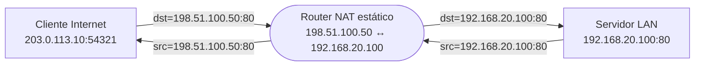
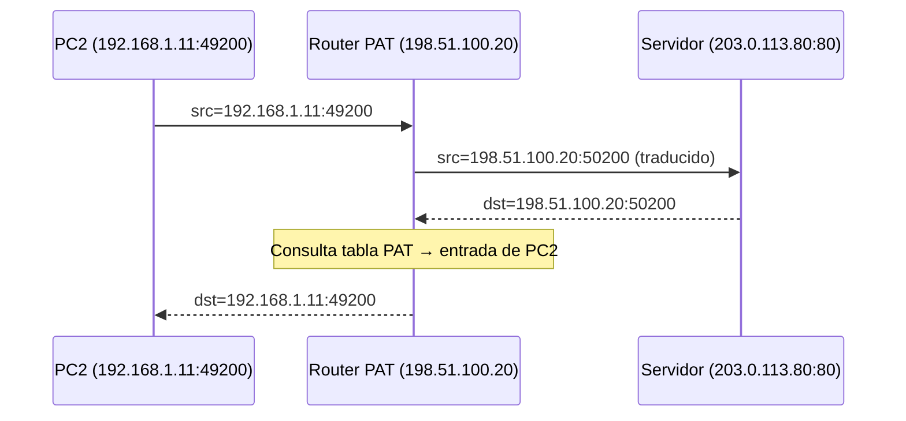
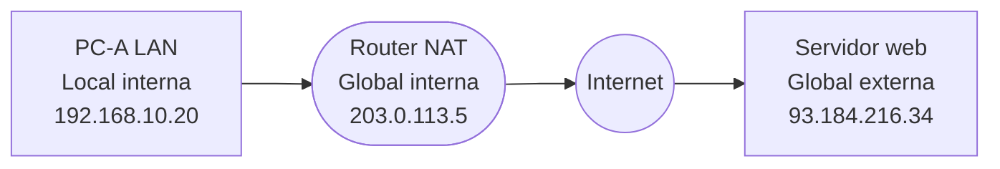
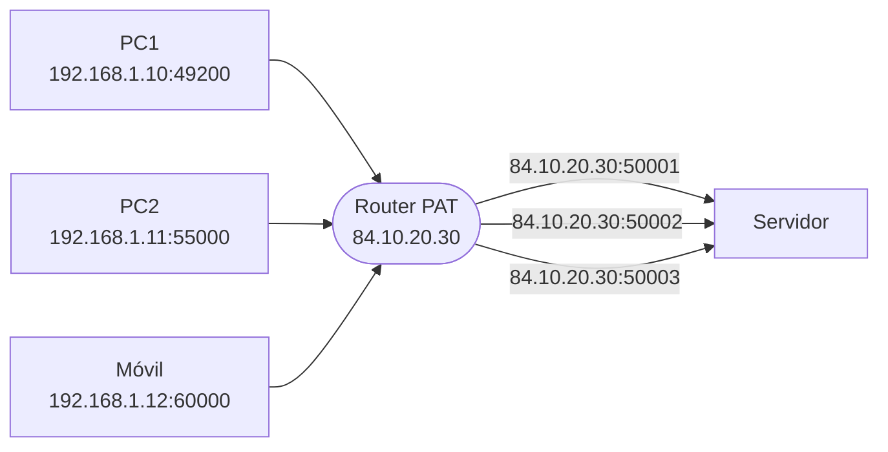

# Soluciones de la ficha de repaso - Tema 9 (NAT e IPv6)

**Módulo:** Redes de Área Local (RAL)  
**Curso:** Sistemas Microinformáticos y Redes (SMR)

Este documento contiene la **resolución paso a paso** de todas las actividades planteadas en la [ficha de repaso del tema 9](../ficha_repaso_tema_9_nat_ipv6.md).

---

## Actividad 1 – Identificar privadas y públicas (RFC 1918)

> **RFC 1918** define los rangos de IPv4 **privados** (no enrutables en Internet): `10.0.0.0/8`, `172.16.0.0/12` (= `172.16.0.0 – 172.31.255.255`) y `192.168.0.0/16`. Cualquier IPv4 fuera de esos rangos (y de los reservados especiales) se considera **pública**.

Para clasificar cada IP, basta con compararla con los tres bloques privados:

| IP | Tipo | Rango (si privada) | Comentario |
|----|------|--------------------|------------|
| `10.25.100.5` | **Privada** | `10.0.0.0/8` | Cualquier IP que empiece por `10.` es privada de clase A. |
| `172.15.0.1` | **Pública** | — | Segundo octeto **15 < 16** → fuera del rango `172.16–172.31`. |
| `172.16.0.1` | **Privada** | `172.16.0.0/12` | Primera IP del bloque B privado. |
| `172.31.255.254` | **Privada** | `172.16.0.0/12` | Aún dentro de `172.16–172.31`, por tanto privada. |
| `172.32.0.1` | **Pública** | — | Segundo octeto **32 > 31** → ya fuera del rango privado. |
| `192.168.10.1` | **Privada** | `192.168.0.0/16` | Típica de red doméstica. |
| `192.169.1.1` | **Pública** | — | Solo `192.168/16` es privada; `192.169` ya no. |
| `8.8.8.8` | **Pública** | — | DNS público de Google. |
| `100.64.0.1` | **No es RFC 1918** | — | Pertenece a `100.64.0.0/10` reservado para **CGNAT** (RFC 6598): no se enruta en Internet, pero **no** es de las tres privadas clásicas. |
| `203.0.113.50` | **Pública** | — | `203.0.113.0/24` es **TEST-NET-3** (documentación, RFC 5737); a efectos de RFC 1918 cuenta como pública. |

**Truco mental:** para `172.x.y.z`, mira el segundo octeto. Si está entre **16 y 31** (ambos incluidos) → privada. Si no → pública.

---

## Actividad 2 – NAT estático

> **NAT estático:** mapeo **fijo 1:1** entre una IP privada y una IP pública. El router reescribe **solo la IP** correspondiente al lado traducido; los puertos no cambian.

Mapeo configurado: `198.51.100.50 (pública) ↔ 192.168.20.100 (privada)`.



**a) Cliente → Servidor (petición):**

| Punto de observación | IP origen | Pto orig | IP destino | Pto dest |
|----------------------|-----------|----------|------------|----------|
| Fuera del router (Internet) | `203.0.113.10` | `54321` | **`198.51.100.50`** | `80` |
| Dentro del router (LAN) | `203.0.113.10` | `54321` | **`192.168.20.100`** | `80` |

**b) Servidor → Cliente (respuesta):**

| Punto de observación | IP origen | Pto orig | IP destino | Pto dest |
|----------------------|-----------|----------|------------|----------|
| Dentro del router (LAN) | **`192.168.20.100`** | `80` | `203.0.113.10` | `54321` |
| Fuera del router (Internet) | **`198.51.100.50`** | `80` | `203.0.113.10` | `54321` |

**Campos que modifica el router:**

- Sentido **Internet → LAN:** reescribe **solo la IP destino** (de la pública a la privada del servidor).
- Sentido **LAN → Internet:** reescribe **solo la IP origen** (de la privada a la pública publicada).
- Los **puertos** y las direcciones del cliente **no cambian**: NAT estático puro no toca puertos.

---

## Actividad 3 – Tabla PAT con colisión de puerto

> **PAT (NAT con sobrecarga):** una sola IP pública es compartida por muchos hosts internos. El router traduce **IP + puerto** para que cada sesión tenga un socket público **único**.

Tabla de traducciones del router (IP pública `198.51.100.20`):

| PC | Socket interno | Socket público (traducido) | Socket remoto | Protocolo |
|----|----------------|-----------------------------|----------------|-----------|
| PC1 | `192.168.1.10:49200` | **`198.51.100.20:49200`** | `203.0.113.80:80` | TCP |
| PC2 | `192.168.1.11:49200` | **`198.51.100.20:50200`** | `203.0.113.80:80` | TCP |
| PC3 | `192.168.1.12:50001` | **`198.51.100.20:50001`** | `203.0.113.80:443` | TCP |

> Para PC1 el router puede mantener el puerto original (49200) porque está libre en el lado público. Cuando llega PC2 también con 49200, ese puerto público ya está ocupado por PC1 → el router elige el **primer puerto libre** (en este ejemplo, 50200). PC3 usa otro puerto distinto, así que no hay colisión.

**1. ¿Por qué no basta con traducir solo la IP en PC1 y PC2?** Si el router solo cambiara la IP, ambas conexiones quedarían con el **mismo socket público** `198.51.100.20:49200 ↔ 203.0.113.80:80`. La 5-tupla sería idéntica para las dos sesiones, así que cuando el servidor respondiera, el router **no sabría** a qué host interno entregar el paquete (¿PC1 o PC2?). Cambiar el puerto de una de las sesiones (PC2 → 50200) garantiza que cada sesión tiene un socket público distinto.

**2. Respuesta del servidor al PC2:**

- Llega al router con destino `198.51.100.20:50200`.
- El router busca esa entrada en su tabla PAT y encuentra que corresponde al socket interno `192.168.1.11:49200`.
- Reescribe el destino con esos valores y reenvía el paquete a PC2.



---

## Actividad 4 – Terminología NAT

> Convención NAT (Cisco): **interna/externa** indica de qué lado del router está el equipo; **local/global** indica cómo se ve la dirección dentro o fuera del NAT.

Escenario: PC-A (`192.168.10.20`) → router NAT (pública `203.0.113.5`) → servidor web (`93.184.216.34:80`).

| Término | Dirección | Explicación |
|---------|-----------|-------------|
| **Local interna** | `192.168.10.20` | IP **privada** del PC-A en la LAN (origen real del tráfico). |
| **Global interna** | `203.0.113.5` | IP **pública** que el router muestra hacia Internet en nombre del PC-A. |
| **Local externa** | `93.184.216.34` | Cómo ve el PC-A al servidor (en este escenario coincide con la global externa, no hay NAT del lado externo). |
| **Global externa** | `93.184.216.34` | IP **pública real** del servidor en Internet. |



**Preguntas:**

1. **Dispositivo traducido:** el **PC-A**. El NAT cambia su dirección, por eso es el "interno" y se le aplican las dos calificaciones: **local** (su IP en la LAN) y **global** (lo que se ve desde Internet).
2. El servidor ve como origen **`203.0.113.5`** (la IP pública del router), **no** la IP privada del PC-A. Razones: las IPs privadas RFC 1918 **no se enrutan** en Internet y, además, el NAT las **oculta** (proporciona aislamiento).

---

## Actividad 5 – Dimensionado de pool NAT

**1. Opción A (NAT dinámico 1:1, pool de 8 públicas):** solo **8 PCs** pueden estar saliendo a Internet **a la vez**. Cuando los 8 mapeos están ocupados, el noveno host debe **esperar** a que se libere una IP (por timeout de inactividad o cierre de la sesión).

**2. Opción B (PAT con 1 pública):** el límite teórico lo da el **número de puertos disponibles** en la IP pública. Cada socket público es `IP:puerto` y el puerto es un campo de 16 bits → ~65 000 puertos. Como los puertos bien conocidos suelen reservarse, en la práctica quedan **≈ 64 000 sesiones** simultáneas posibles, mucho más que las 40 que requieren los PCs (cada PC puede abrir varias conexiones a la vez).

**3. Red doméstica:** **Opción B (PAT)**. Razón: el ISP típicamente entrega **una sola IP pública IPv4** al router, y PAT permite que todos los dispositivos de la casa salgan simultáneamente compartiendo esa IP. NAT dinámico 1:1 sería inviable: necesitaría un pool de IPs públicas que el ISP no proporciona.

---

## Actividad 6 – Abreviar direcciones IPv6

> **Reglas de abreviatura:**  
> 1. Quitar los **ceros a la izquierda** de cada grupo (`0db8` → `db8`, `0001` → `1`).  
> 2. Sustituir la **secuencia más larga de grupos `0000` consecutivos** por `::` (solo un `::` por dirección).

| Nº | Dirección completa | Forma abreviada | Idea clave |
|---|---------------------|-----------------|---|
| a | `2001:0db8:0000:0000:0000:0000:0000:0001` | **`2001:db8::1`** | 6 grupos cero seguidos → un solo `::`. |
| b | `fe80:0000:0000:0000:abcd:ef01:2345:6789` | **`fe80::abcd:ef01:2345:6789`** | 3 grupos cero al principio → `::`. Los hexa de la derecha ya no tienen ceros que quitar. |
| c | `2001:0abc:0000:0001:0000:0000:0000:0002` | **`2001:abc:0:1::2`** | Hay dos rachas de ceros: una de 1 grupo (posición 3) y otra de 3 grupos (5–7). El `::` se aplica a la **más larga**. |
| d | `0000:0000:0000:0000:0000:0000:0000:0000` | **`::`** | Dirección "todo ceros" (no especificada). |
| e | `fc00:0db8:0000:1234:0000:0000:0000:cdef` | **`fc00:db8:0:1234::cdef`** | La racha más larga es la de la derecha (3 grupos). El cero suelto del centro se deja como `0`. |

**Análisis de las que pudieran ser inválidas:**

| Nº | Dirección | ¿Válida? | Motivo |
|---|-----------|:--------:|--------|
| f | `2001:db8::1::5` | **No** | Aparecen **dos `::`** → la dirección sería ambigua (no sabríamos cuántos grupos cero representa cada uno). Solo se permite **un** `::`. |
| g | `2001:db8:gggg::1` | **No** | `gggg` no es hexadecimal: solo se permiten dígitos **0–9** y letras **a–f** (en mayúsculas o minúsculas). |
| h | `fe80::abcd:0:0:1` | **Sí** | Equivale a `fe80:0000:0000:0000:abcd:0000:0000:0001`. Aquí el `::` cubre la racha de ceros más larga (3 grupos al principio); los ceros sueltos del final se dejan como `0`. |

---

## Actividad 7 – Expandir direcciones IPv6

> Para expandir: rellenar cada grupo a **4 dígitos** con ceros a la izquierda y sustituir el `::` por **tantos grupos `0000`** como falten para llegar a **8 grupos** en total.

| Nº | Forma abreviada | Grupos explícitos | Ceros que añade `::` | Forma completa |
|---|------------------|---:|---:|----------------|
| a | `::1` | 1 (`1`) | 7 | `0000:0000:0000:0000:0000:0000:0000:0001` |
| b | `2001:db8::` | 2 (`2001`, `db8`) | 6 | `2001:0db8:0000:0000:0000:0000:0000:0000` |
| c | `fe80::1234:5:6:7` | 5 (`fe80`, `1234`, `5`, `6`, `7`) | 3 | `fe80:0000:0000:0000:1234:0005:0006:0007` |
| d | `ff02::2` | 2 (`ff02`, `2`) | 6 | `ff02:0000:0000:0000:0000:0000:0000:0002` |

---

## Actividad 8 – Tipos de dirección IPv6

| Nº | Dirección | Tipo | Observación |
|---|-----------|------|-------------|
| a | `::1` | **Loopback** | `::1/128`. Equivalente a `127.0.0.1` en IPv4. |
| b | `fe80::1` | **Link-local** | Rango `fe80::/10`. **Solo válida en el enlace**, no se enruta. Cada interfaz IPv6 la genera automáticamente. |
| c | `fc00:abcd::10` | **ULA** | Rango `fc00::/7` (uso privado, equivalente IPv6 de RFC 1918). |
| d | `2001:db8:acad::1` | **Global unicast** | Pertenece a `2000::/3`. El subprefijo `2001:db8::/32` está reservado para **documentación** (RFC 3849) y no se usa en Internet real. |
| e | `ff02::1` | **Multicast** | `ff00::/8`. `ff02::1` = "**todos los nodos** del enlace". |
| f | `::` | **Indefinida (no especificada)** | `::/128`. La usa un host como origen mientras todavía no tiene IP propia (p. ej. al pedir DHCPv6). |
| g | `fd12:3456:789a::1` | **ULA** | `fd00::/8` ⊂ `fc00::/7`. En la práctica casi todas las ULA empiezan por `fd` (el bit local vale 1). |
| h | `ff02::2` | **Multicast** | `ff02::2` = "**todos los routers** del enlace". |

<!-- ---

## Actividad 9 – Prefijo /64

> **Prefijo `/64`:** los primeros **64 bits** identifican la red; los **64 bits restantes** identifican la interfaz dentro de esa red. Es el tamaño **estándar** de una subred IPv6 en una LAN.

Dirección dada: `2001:db8:acad:1234::100/64`.

```text
| 64 bits de PREFIJO DE RED       | 64 bits de IDENTIFICADOR DE INTERFAZ  |
| 2001 : 0db8 : acad : 1234       | 0000 : 0000 : 0000 : 0100             |
```

1. **Prefijo de red (abreviado):** `2001:db8:acad:1234::/64`.
2. **Rango completo del bloque /64:**
    - Primera: `2001:0db8:acad:1234:0000:0000:0000:0000`
    - Última:  `2001:0db8:acad:1234:ffff:ffff:ffff:ffff`
3. **Bits del identificador de interfaz:** `128 − 64 = 64 bits`.
4. **Número de direcciones:** `2^64 ≈ 1,8 · 10^19` direcciones (más de lo que caben elevando IPv4 al cuadrado).

---

## Actividad 10 – Subnetizar un /48 en /64

> Para subnetizar un `/n` en `/m` (con `m > n`) se dispone de `m − n` bits para identificar subredes → `2^(m−n)` subredes posibles.

Bloque del ISP: `2001:db8:abcd::/48`.

1. **Bits disponibles para subredes:** `64 − 48 = 16 bits` → caben **`2^16 = 65 536` subredes /64**.

2. Las **8 primeras subredes /64** (variando el cuarto grupo de `0000` a `0007`):

    | Nº | Subred /64 | Forma sin abreviar (cuarto grupo) |
    |---|-------------|---|
    | 1 | `2001:db8:abcd::/64` | `…:abcd:0000::/64` |
    | 2 | `2001:db8:abcd:1::/64` | `…:abcd:0001::/64` |
    | 3 | `2001:db8:abcd:2::/64` | `…:abcd:0002::/64` |
    | 4 | `2001:db8:abcd:3::/64` | `…:abcd:0003::/64` |
    | 5 | `2001:db8:abcd:4::/64` | `…:abcd:0004::/64` |
    | 6 | `2001:db8:abcd:5::/64` | `…:abcd:0005::/64` |
    | 7 | `2001:db8:abcd:6::/64` | `…:abcd:0006::/64` |
    | 8 | `2001:db8:abcd:7::/64` | `…:abcd:0007::/64` |

3. **Total de subredes /64** posibles con ese `/48`: `2^16 = 65 536`.

---

## Actividad 11 – Bloque residencial /56

Prefijo delegado por el ISP: `2001:db8:cafe:ab00::/56`.

1. Bits disponibles para subredes `/64`: `64 − 56 = 8` → **`2^8 = 256` subredes /64**.

2. Las 4 primeras subredes `/64`:

    | Nº | Subred /64 |
    |---|-------------|
    | 1 | `2001:db8:cafe:ab00::/64` |
    | 2 | `2001:db8:cafe:ab01::/64` |
    | 3 | `2001:db8:cafe:ab02::/64` |
    | 4 | `2001:db8:cafe:ab03::/64` |

    > Cambia el byte bajo del cuarto grupo (`ab00`, `ab01`, …, `abff`); los 56 primeros bits están fijos.

3. **LAN doméstica única:** el router le asigna el primer `/64` (por ejemplo `2001:db8:cafe:ab00::/64`). Un solo `/64` ya tiene `2^64` direcciones, suficiente con creces para cualquier hogar.

---

## Actividad 12 – IPv4+PAT vs IPv6 nativo

**1. IPv4 públicas necesarias:** **una sola** (`84.10.20.30`). La técnica que lo hace posible es **PAT** (NAT con sobrecarga): el router traduce cada sesión cambiando `IP_privada:puerto_origen` por `IP_pública:puerto_traducido` único.

**2. IP origen vista por el servidor en IPv4:** **siempre** `84.10.20.30` (la pública del router). Las distingue por el **puerto público** que el router asigna a cada sesión: cada combinación `IP_pública:puerto` apunta a un dispositivo distinto en la tabla PAT.



**3. IPv6 nativo:** el router delega del bloque `2001:db8:cafe::/56` un `/64` a la LAN, y cada dispositivo configura **su propia dirección IPv6 global** dentro de ese `/64` (mediante SLAAC o DHCPv6). El servidor verá como origen la **IP global real** del dispositivo. **No hace falta NAT:** en IPv6 hay direcciones de sobra.

**4. Ventaja para conexiones entrantes:**

- Con **IPv4 + PAT:** las conexiones iniciadas desde Internet **no** tienen entrada en la tabla PAT y se descartan. Hay que abrir manualmente *port forwarding* por cada servicio que se quiera publicar.
- Con **IPv6:** cada dispositivo tiene IP pública propia y es **directamente alcanzable**. El control de acceso lo realiza el **firewall** (no la traducción), lo que es más simple y transparente.

**5. Dos mecanismos de coexistencia IPv4/IPv6:**

- **Pila dual (dual-stack):** cada equipo (router y hosts) habla **IPv4 e IPv6 a la vez**. Es la opción preferida cuando toda la infraestructura soporta ambos protocolos; hoy es lo más común.
- **Túneles** (p. ej. **6in4**, **6to4**): encapsulan paquetes **IPv6 dentro de IPv4** para atravesar redes que solo admiten IPv4. Útil si el ISP solo da IPv4 y se quiere ofrecer IPv6 a la red interna.
- (Tercera opción mencionable: **traducción NAT64/DNS64**, cuando un extremo solo habla IPv6 y el otro solo IPv4.)

---

*Documento de soluciones de la [ficha de repaso del tema 9 (NAT e IPv6)](../ficha_repaso_tema_9_nat_ipv6.md).* -->
