# Soluciones – Ficha de repaso Enrutamiento, Subnetting y VLANs

Estas soluciones corresponden a las actividades de la [ficha de repaso para el examen](../ficha_repaso_examen_enrutamiento.md). Resuelve primero las actividades en papel y luego comprueba aquí tus resultados.

---

## Subnetting

### Actividad 1 – Red 10.0.50.0

1. **Máscara para 8 subredes:** 8 = 2³ → 3 bits prestados. Prefijo 24 + 3 = **/27** (255.255.255.224).
2. **Hosts por subred:** 32 − 27 = 5 bits de host → 2⁵ − 2 = **30 hosts**.
3. **Direcciones de red (incremento 32 en el último octeto):** 10.0.50.0, 10.0.50.32, 10.0.50.64, 10.0.50.96, 10.0.50.128, 10.0.50.160, 10.0.50.192, 10.0.50.224.
4. **Nodo 10 en subred 3:** Subred 3 = 10.0.50.64. Primera IP válida 10.0.50.65; nodo identificador 10 = 10.0.50.65 + 9 = **10.0.50.74**.
5. **¿A qué subred pertenece 10.0.50.118?** Último octeto 118 → (118 ÷ 32) × 32 = 96 → subred **10.0.50.96/27**.

---

### Actividad 2 – Empresa con 30 redes

1. **Máscara por defecto:** **/16** (255.255.0.0).
2. **Máscara subneteada:** 2⁵ = 32 ≥ 30 → 5 bits prestados → **/21** (255.255.248.0).
3. **Direcciones de red (incremento 8 en tercer octeto):** 1.ª 172.16.0.0, 2.ª 172.16.8.0, 15.ª 172.16.112.0, 30.ª 172.16.232.0.
4. **Rango subred 15 (172.16.112.0):** Primera **172.16.112.1**, última **172.16.119.254**.
5. **Broadcast subred 30:** **172.16.239.255**.

---

### Actividad 3 – Red 192.168.200.0/26

1. **Sin subdividir:** Red 192.168.200.0, broadcast 192.168.200.63, hosts = 2⁶ − 2 = **62**.
2. **4 subredes:** 2 bits prestados → /28. Direcciones de red: 192.168.200.0, 192.168.200.16, 192.168.200.32, 192.168.200.48.
3. **Rangos y broadcast:**

| Subred | Primera IP | Última IP | Broadcast |
|--------|------------|-----------|-----------|
| 192.168.200.0 | 192.168.200.1 | 192.168.200.14 | 192.168.200.15 |
| 192.168.200.16 | 192.168.200.17 | 192.168.200.30 | 192.168.200.31 |
| 192.168.200.32 | 192.168.200.33 | 192.168.200.46 | 192.168.200.47 |
| 192.168.200.48 | 192.168.200.49 | 192.168.200.62 | 192.168.200.63 |

---

### Actividad 4 – Red 10.10.0.0/22

1. **Sin subdividir:** Red 10.10.0.0, broadcast 10.10.3.255, hosts = 2¹⁰ − 2 = **1022**.
2. **4 subredes /24:** 10.10.0.0/24, 10.10.1.0/24, 10.10.2.0/24, 10.10.3.0/24.
3. **10.10.2.50** → subred **10.10.2.0/24**.
4. **Subred de 10.10.3.200:** 10.10.3.0/24. Primera IP **10.10.3.1**, última **10.10.3.254**.

---

### Actividad 5 – Red 192.168.88.0

1. **32 subredes:** 2⁵ = 32 → 5 bits prestados → **/29** (255.255.255.248).
2. **Hosts por subred:** 2³ − 2 = **6**.
3. **Incremento 8.** Subred 1: 192.168.88.0; subred 16: 192.168.88.120; subred 32: 192.168.88.248.
4. **Host 7 en subred 20:** Red subred 20 = 192.168.88.152 (19×8=152). Primera IP 192.168.88.153; host 7 = **192.168.88.159**.
5. **192.168.88.211:** 211 ÷ 8 = 26 (entero) → 26×8 = 208 → subred **192.168.88.208/29**.

---

## Supernetting

### Actividad 6 – Cuatro sedes

1. **Octeto que cambia:** el tercero (12, 13, 14, 15).

2. **Octeto en binario (8 bits):**

| Sede | Decimal (3.º octeto) | Binario |
|------|---------------------|---------|
| A | 12 | 0000**1100** |
| B | 13 | 0000**1101** |
| C | 14 | 0000**1110** |
| D | 15 | 0000**1111** |

3. **Bits iguales por la izquierda:** 6 bits (000011).
4. **Nueva máscara:** 24 − 2 = **/22**.
5. **Superred:** **192.168.12.0/22**.

---

### Actividad 7 – Ocho departamentos

1. **Octeto que varía:** el tercero.

2. **Tercer octeto en binario:**

| Red | 3.º octeto | Binario (8 bits) |
|-----|------------|------------------|
| 192.168.32.0/24 | 32 | 001**00000** |
| 192.168.33.0/24 | 33 | 001**00001** |
| 192.168.34.0/24 | 34 | 001**00010** |
| 192.168.35.0/24 | 35 | 001**00011** |
| 192.168.36.0/24 | 36 | 001**00100** |
| 192.168.37.0/24 | 37 | 001**00101** |
| 192.168.38.0/24 | 38 | 001**00110** |
| 192.168.39.0/24 | 39 | 001**00111** |

3. **Bits iguales por la izquierda:** 5 bits (00100).
4. **Prefijo y superred:**

| Concepto | Valor |
|----------|-------|
| Prefijo CIDR | /21 (24 − 3) |
| Superred | 192.168.32.0/21 |
| Rango total | 192.168.32.0 – 192.168.39.255 |

---

### Actividad 8 – Tres redes contiguas

1. **¿Se pueden agrupar?** Sí: son **contiguas** (100, 101, 102) y comparten **prefijo** en binario.

2. **Tercer octeto en binario:**

| Red | 3.º octeto | Binario (8 bits) |
|-----|------------|------------------|
| 192.168.100.0/24 | 100 | 0110**0100** |
| 192.168.101.0/24 | 101 | 0110**0101** |
| 192.168.102.0/24 | 102 | 0110**0110** |

3. **Resumen del cálculo:**

| Concepto | Valor |
|----------|-------|
| Bits coincidentes por la izquierda | 6 |
| Nueva máscara | /22 (24 − 2) |
| Superred | 192.168.100.0/22 |

---

## Enrutamiento estático

### Actividad 9 – Tabla del Router2 (tres routers)

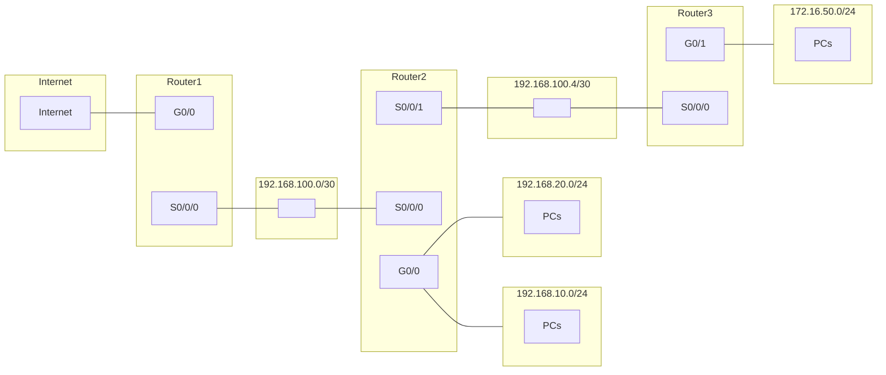

1. **IP interfaces Router2:**

| Router | Interfaz | IP | Red / Enlace |
|--------|----------|-----|--------------|
| Router2 | S0/0/0 | 192.168.100.1 | 192.168.100.0/30 (con R1) |
| Router2 | S0/0/1 | 192.168.100.5 | 192.168.100.4/30 (con R3) |
| Router2 | G0/0 | 192.168.10.1, 192.168.20.1 | 192.168.10.0/24, 192.168.20.0/24 |

2. **Tabla Router2 (ejemplo con G0/0 para ambas LANs):**

| Red destino | Máscara | Siguiente salto | Interfaz |
|-------------|---------|-----------------|----------|
| 192.168.10.0 | /24 | directo | G0/0 |
| 192.168.20.0 | /24 | directo | G0/0 |
| 192.168.100.0 | /30 | directo | S0/0/0 |
| 192.168.100.4 | /30 | directo | S0/0/1 |
| 172.16.50.0 | /24 | 192.168.100.6 | S0/0/1 |
| 0.0.0.0 | /0 | 192.168.100.1 | S0/0/0 |

3. **Conexión directa:** las redes conectadas a sus interfaces (192.168.10.0/24, 192.168.20.0/24, 192.168.100.0/30, 192.168.100.4/30). **Siguiente salto:** 172.16.50.0/24 vía 192.168.100.6 (Router3); ruta por defecto vía 192.168.100.1 (Router1).

---

### Actividad 10 – Tabla del Router1

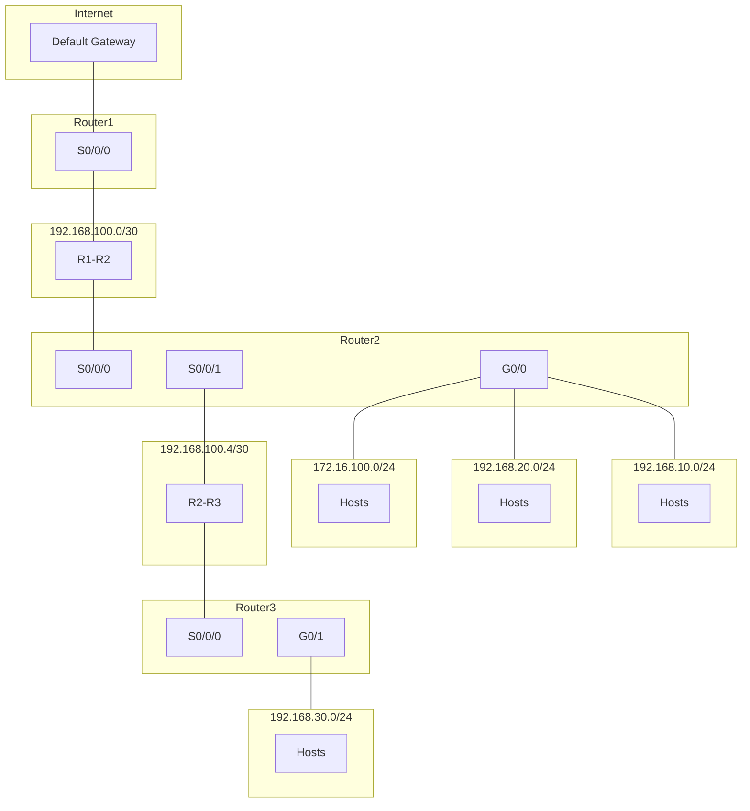

1. **IP de las interfaces:**

| Router | Interfaz | IP | Red / Enlace |
|--------|----------|-----|--------------|
| Router1 | S0/0/0 | 192.168.100.1 | 192.168.100.0/30 (con R2) |
| Router2 | S0/0/0 | 192.168.100.2 | 192.168.100.0/30 (con R1) |
| Router2 | S0/0/1 | 192.168.100.5 | 192.168.100.4/30 (con R3) |
| Router2 | G0/0 | 192.168.10.1, 192.168.20.1 | 192.168.10.0/24, 192.168.20.0/24 |
| Router3 | S0/0/0 | 192.168.100.6 | 192.168.100.4/30 (con R2) |
| Router3 | G0/1 | 192.168.30.1 | 192.168.30.0/24 |

2. **Tabla Router1:**

| Red destino | Máscara | Siguiente salto | Interfaz |
|-------------|---------|-----------------|----------|
| 192.168.100.0 | /30 | directo | S0/0/0 |
| 192.168.10.0 | /24 | 192.168.100.2 | S0/0/0 |
| 192.168.20.0 | /24 | 192.168.100.2 | S0/0/0 |
| 172.16.100.0 | /24 | 192.168.100.2 | S0/0/0 |
| 192.168.30.0 | /24 | 192.168.100.2 | S0/0/0 |
| 0.0.0.0 | /0 | 192.168.100.2 | S0/0/0 |

(Siguiente salto 192.168.100.2 = IP de Router2 en ese enlace; si se usa el criterio "primer host válido para el router" en cada segmento, podría ser 192.168.100.1 según asignación.)

3. **Mismo siguiente salto:** Router1 solo tiene un vecino (Router2). Para llegar a cualquier otra red o a Internet debe pasar siempre por Router2, por eso todas las rutas no directas usan la IP de Router2 en el enlace 192.168.100.0/30.

---

### Actividad 11 – Dos routers

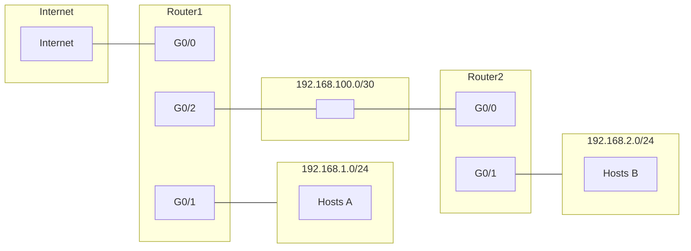

1. **IP de las interfaces:**

| Router | Interfaz | IP | Red / Enlace |
|--------|----------|-----|--------------|
| Router1 | G0/0 | — | Internet |
| Router1 | G0/1 | 192.168.1.1 | 192.168.1.0/24 |
| Router1 | G0/2 | 192.168.100.1 | 192.168.100.0/30 (con R2) |
| Router2 | G0/0 | 192.168.100.2 | 192.168.100.0/30 (con R1) |
| Router2 | G0/1 | 192.168.2.1 | 192.168.2.0/24 |

2. **Tabla Router2:**

| Red destino | Máscara | Siguiente salto | Interfaz |
|-------------|---------|-----------------|----------|
| 192.168.2.0 | /24 | directo | G0/1 |
| 192.168.100.0 | /30 | directo | G0/0 |
| 192.168.1.0 | /24 | 192.168.100.1 | G0/0 |
| 0.0.0.0 | /0 | 192.168.100.1 | G0/0 |

3. **Siguiente salto:** Para 192.168.1.0/24 y para 0.0.0.0/0 Router2 usa **192.168.100.1** (Router1).

---

### Actividad 12 – Tabla del Router3

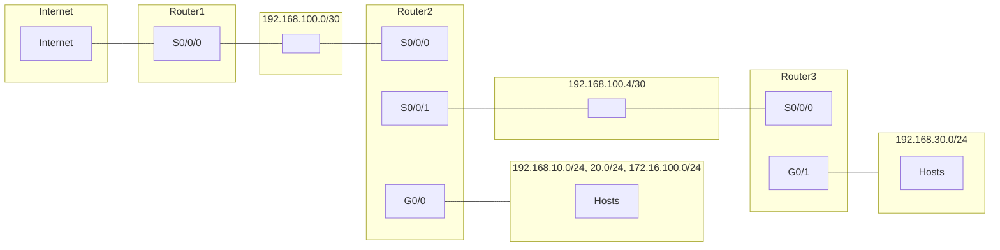

1. **IP interfaces Router3:**

| Router | Interfaz | IP | Red / Enlace |
|--------|----------|-----|--------------|
| Router3 | G0/1 | 192.168.30.1 | 192.168.30.0/24 |
| Router3 | S0/0/0 | 192.168.100.6 | 192.168.100.4/30 (con R2; R2 usa .5) |

2. **Tabla Router3:**

| Red destino | Máscara | Siguiente salto | Interfaz |
|-------------|---------|-----------------|----------|
| 192.168.30.0 | /24 | directo | G0/1 |
| 192.168.100.4 | /30 | directo | S0/0/0 |
| 192.168.100.0 | /30 | 192.168.100.5 | S0/0/0 |
| 172.16.100.0 | /24 | 192.168.100.5 | S0/0/0 |
| 192.168.10.0 | /24 | 192.168.100.5 | S0/0/0 |
| 192.168.20.0 | /24 | 192.168.100.5 | S0/0/0 |
| 0.0.0.0 | /0 | 192.168.100.5 | S0/0/0 |

3. **0.0.0.0/0:** Ruta por defecto; todo el tráfico sin ruta más específica se envía al siguiente salto **192.168.100.5** (Router2), que es quien tiene salida hacia Internet.

---

## VLANs y diseño lógico

### Actividad 13 – Clínica dental

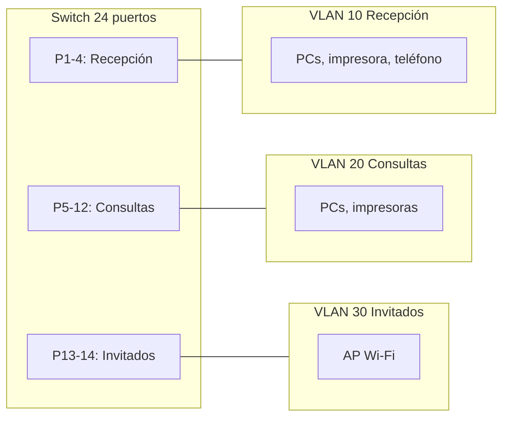

1. **Ejemplo de cuadro:**

| Nombre VLAN | ID | Subred | Puertos |
|-------------|-----|----------------|---------|
| Recepción | 10 | 192.168.1.0/24 | 1–4 |
| Consultas | 20 | 192.168.2.0/24 | 5–12 |
| Invitados | 30 | 192.168.3.0/24 | 13–14 |

2. **Cuestionario:** El Wi‑Fi de invitados no debe compartir VLAN con Recepción por seguridad (aislar tráfico de visitantes del de datos internos). Entre Consultas y Recepción **no** funcionará el ping sin router: están en VLANs distintas y hace falta capa 3 para enrutar entre ellas.
3. **Esquema:** Switch con puertos 1–4 Recepción, 5–12 Consultas, 13–14 Invitados (resto según planificación).

---

### Actividad 14 – Instituto

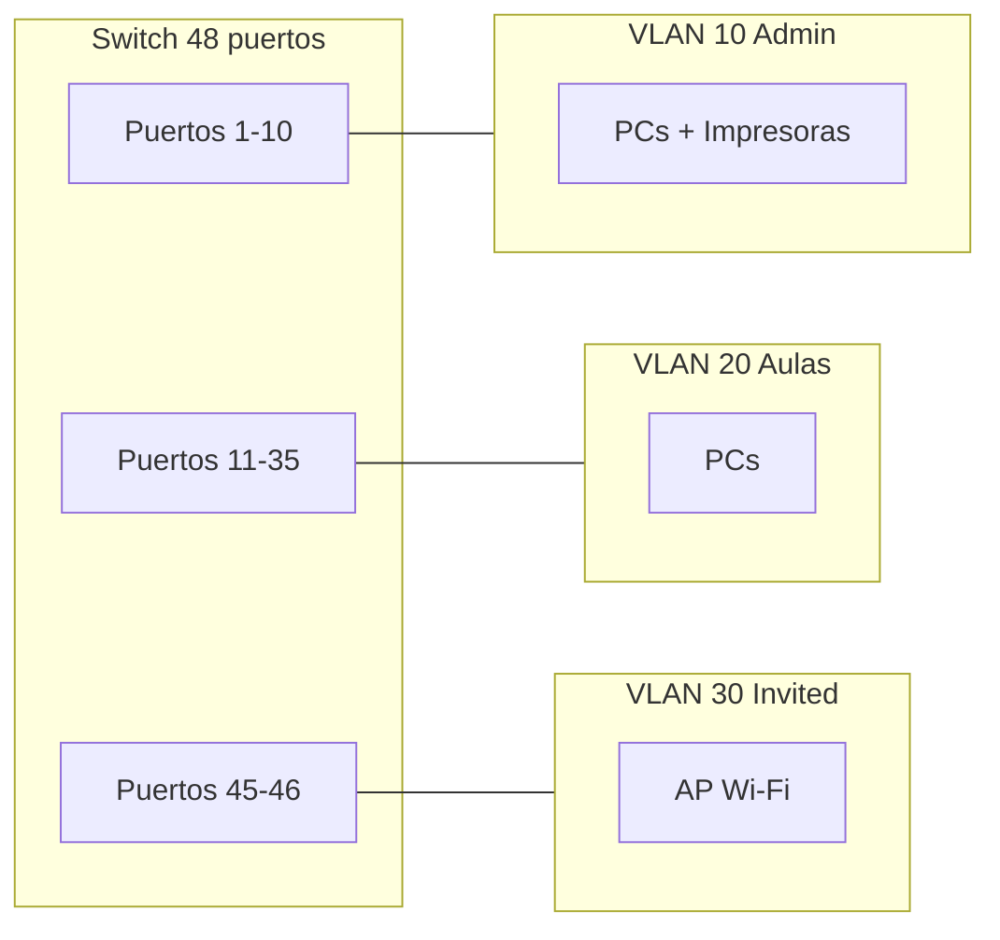

1. **Ejemplo:** VLAN Admin ID 10, subred 192.168.1.0/24, puertos 1–10; VLAN Aulas ID 20, 192.168.2.0/24, puertos 11–35; VLAN Invited ID 30, 192.168.3.0/24, puertos 45–46.
2. **Dispositivo:** Un **router** (o switch capa 3) que enrute entre las subredes/VLANs de Administración y Aulas.
3. Esquema según tabla de puertos por VLAN.

---

### Actividad 15 – Oficina

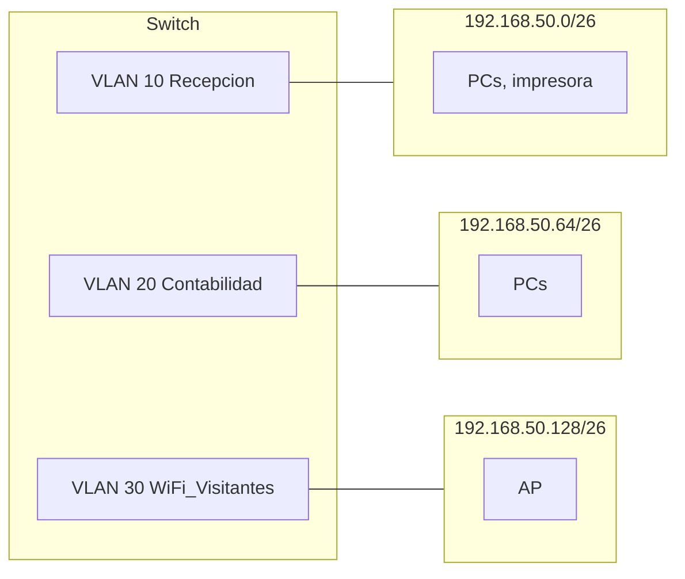

1. **3 subredes:** p. ej. /26. 192.168.50.0/26 (Recepcion), 192.168.50.64/26 (Contabilidad), 192.168.50.128/26 (WiFi_Visitantes). Rangos: .1–.62, .65–.126, .129–.190 (y broadcast .63, .127, .191).
2. **VLAN 10** Recepcion, **20** Contabilidad, **30** WiFi_Visitantes.
3. **Sin router ni L3:** No pueden comunicarse; cada VLAN es un dominio de broadcast distinto y el tráfico entre VLANs requiere enrutamiento (capa 3).

---

## Enlaces troncales (Trunk) y Access

### Actividad 16 – Tres plantas

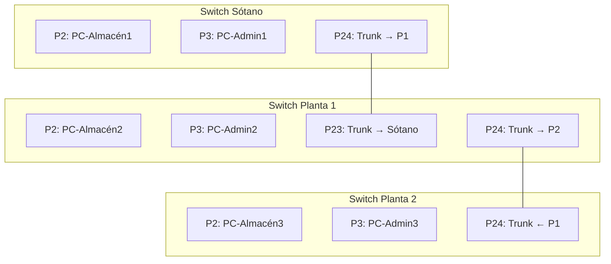

1. **Puertos de PCs (2 y 3 en cada switch):** modo **Access** (cada uno en su VLAN). **Puertos que unen switches (23, 24):** modo **Trunk**.
2. **PC-Almacén1 → PC-Almacén3:** La trama va con etiqueta VLAN en los enlaces **Sótano–Planta 1** (P24–P23) y **Planta 1–Planta 2** (P24–P24). Estándar de etiquetado: **IEEE 802.1Q**.
3. **Si P24 de Planta 1 es Access para VLAN Almacén:** Solo pasaría tráfico de la VLAN de Almacén. Los PCs de Administración (VLAN Admin) de Planta 1 y Planta 2 **no** podrían comunicarse entre sí porque ese enlace no transportaría la VLAN de Administración.

---

### Actividad 17 – Dos switches VLAN 10 y 20

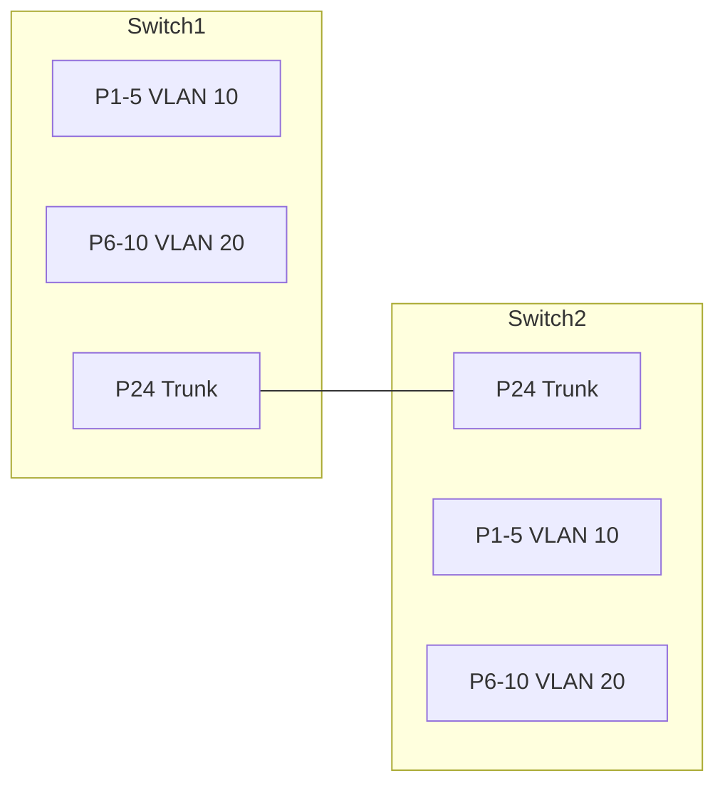

1. **Puerto 24:** Debe ser **Trunk** en ambos switches para transportar VLAN 10 y 20.
2. **Trama VLAN 10 Switch1 → Switch2:** Al salir por P24 del Switch1 la trama lleva **etiqueta 802.1Q** (VLAN 10). Al llegar al Switch2 por P24, el switch lee la etiqueta y la envía a los puertos de VLAN 10; al salir hacia el PC la trama va **sin etiqueta** (puerto Access).
3. **VLAN 10 con VLAN 20 sin router:** **No;** son VLANs distintas y hace falta un router (o L3) para comunicarlas.

---

### Actividad 18 – Trunk mal configurado

Misma topología que la Actividad 16 (tres plantas). El puerto P24 de Planta 1 hacia Planta 2 está **mal**: configurado como Access en lugar de Trunk.

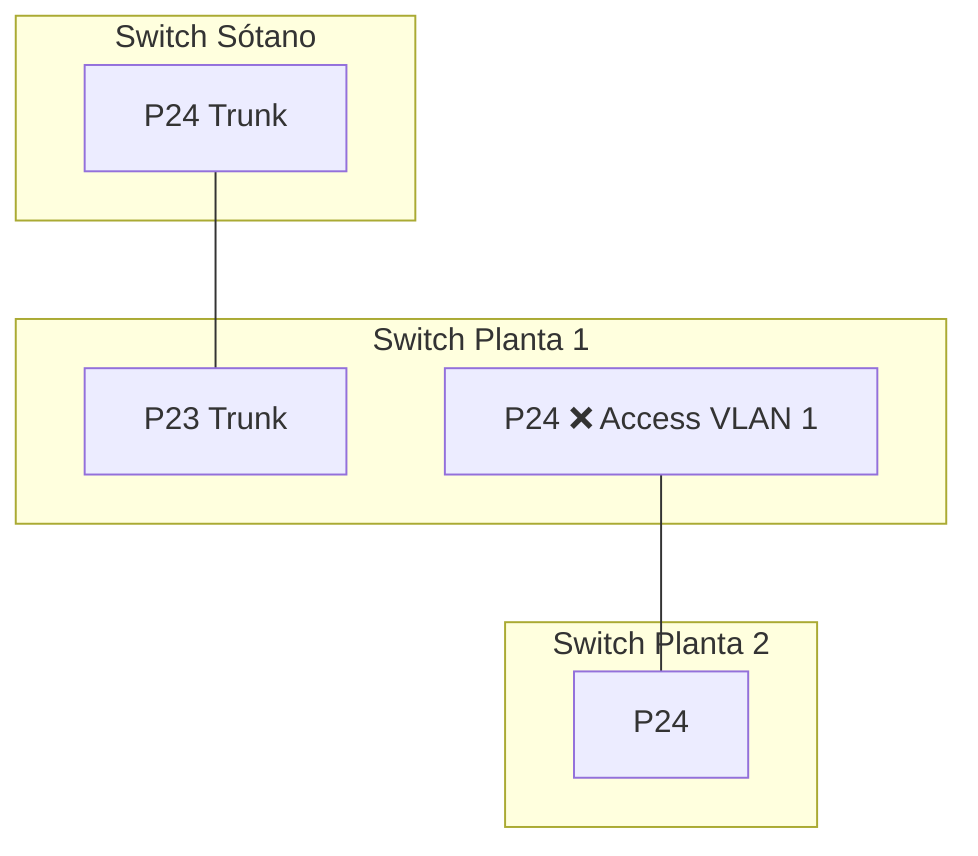

1. **VLANs que llegan a Planta 2:** Solo la **VLAN 1** (o la VLAN nativa si es 1), porque el puerto está en Access y solo deja pasar una VLAN.
2. **Comunicaciones rotas:** La comunicación entre PCs de **Administración** (VLAN 20) de Planta 1 y Planta 2, y cualquier otra VLAN que no sea la 1.
3. **Configuración correcta:** El puerto 24 del Switch Planta 1 (hacia Planta 2) debe estar en modo **Trunk** y permitir las VLANs necesarias (Almacén y Admin).

---

## Mixtas

### Actividad 19 – Subnetting y tabla de rutas

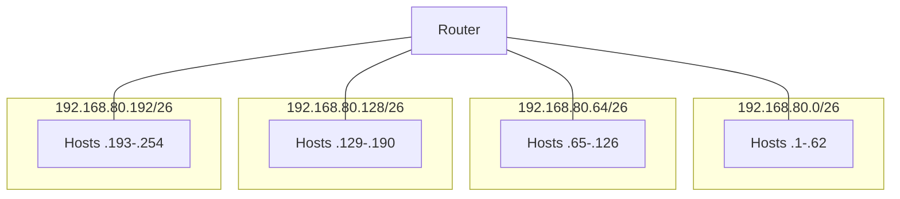

1. **4 subredes:** /26. Redes: 192.168.80.0/26, 192.168.80.64/26, 192.168.80.128/26, 192.168.80.192/26. Rango cada una: .1–.62, .65–.126, .129–.190, .193–.254 (y broadcast .63, .127, .191, .255).
2. **Router:** Una IP por interfaz, p. ej. 192.168.80.1, 192.168.80.65, 192.168.80.129, 192.168.80.193. **Rutas directas:** 192.168.80.0/26, 192.168.80.64/26, 192.168.80.128/26, 192.168.80.192/26, cada una por su interfaz (sin siguiente salto).
3. Esquema: router con 4 enlaces a las 4 subredes indicadas.

---

### Actividad 20 – Diseño completo (dos edificios)

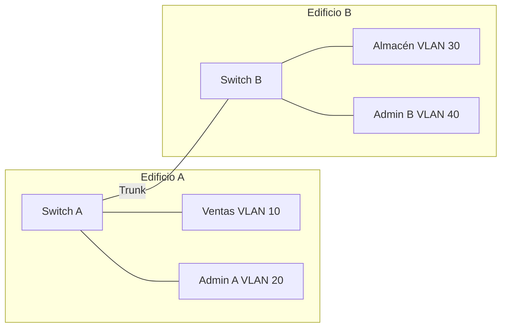

1. **10.20.0.0/22 en 4 subredes /24:** 10.20.0.0/24, 10.20.1.0/24, 10.20.2.0/24, 10.20.3.0/24.
2. **Asignación ejemplo:** Ventas 10.20.0.0/24 VLAN 10; Admin A 10.20.1.0/24 VLAN 20; Almacén 10.20.2.0/24 VLAN 30; Admin B 10.20.3.0/24 VLAN 40.
3. **Enlace entre switches:** Debe ser **Trunk** para transportar las 4 VLANs entre edificios.
4. **Ventas (A) ↔ Admin (B):** Hace falta un **router** (o switch capa 3) que enrute entre las subredes/VLANs 10.20.0.0/24 y 10.20.3.0/24 (y el resto de VLANs si se requiere).

---

*Vuelve a la [ficha de repaso](../ficha_repaso_examen_enrutamiento.md) para seguir practicando.*
