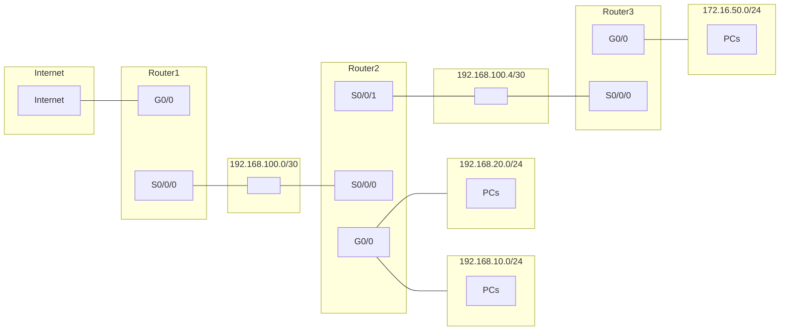
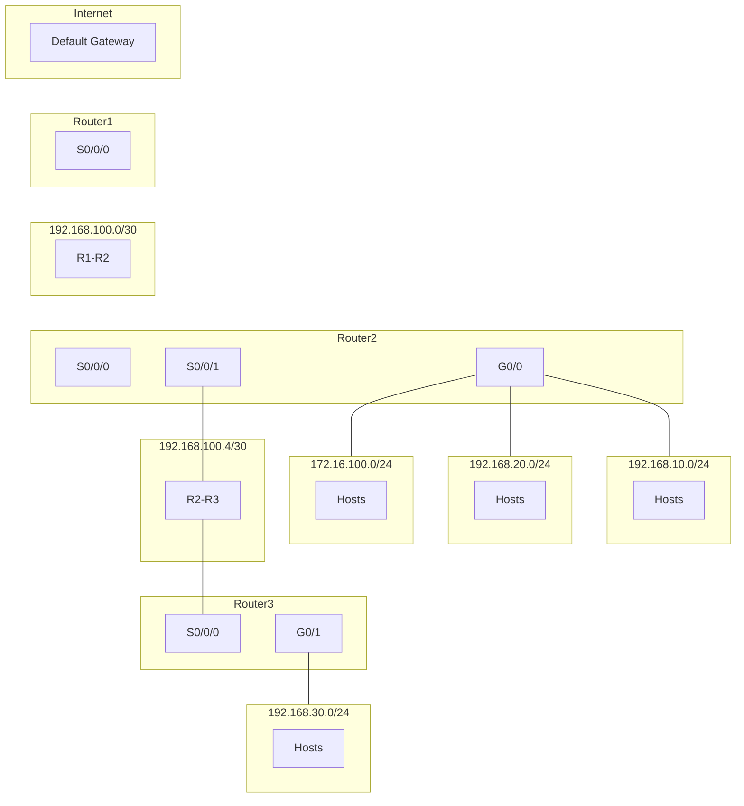
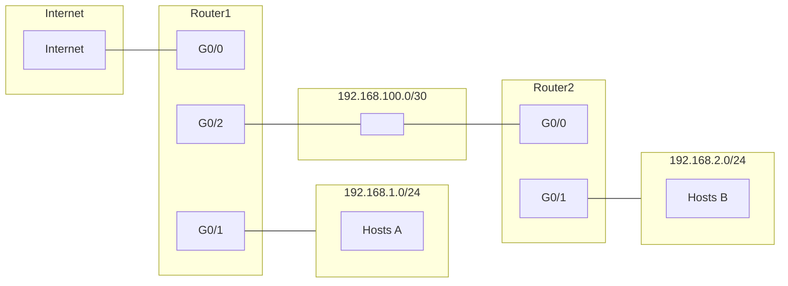
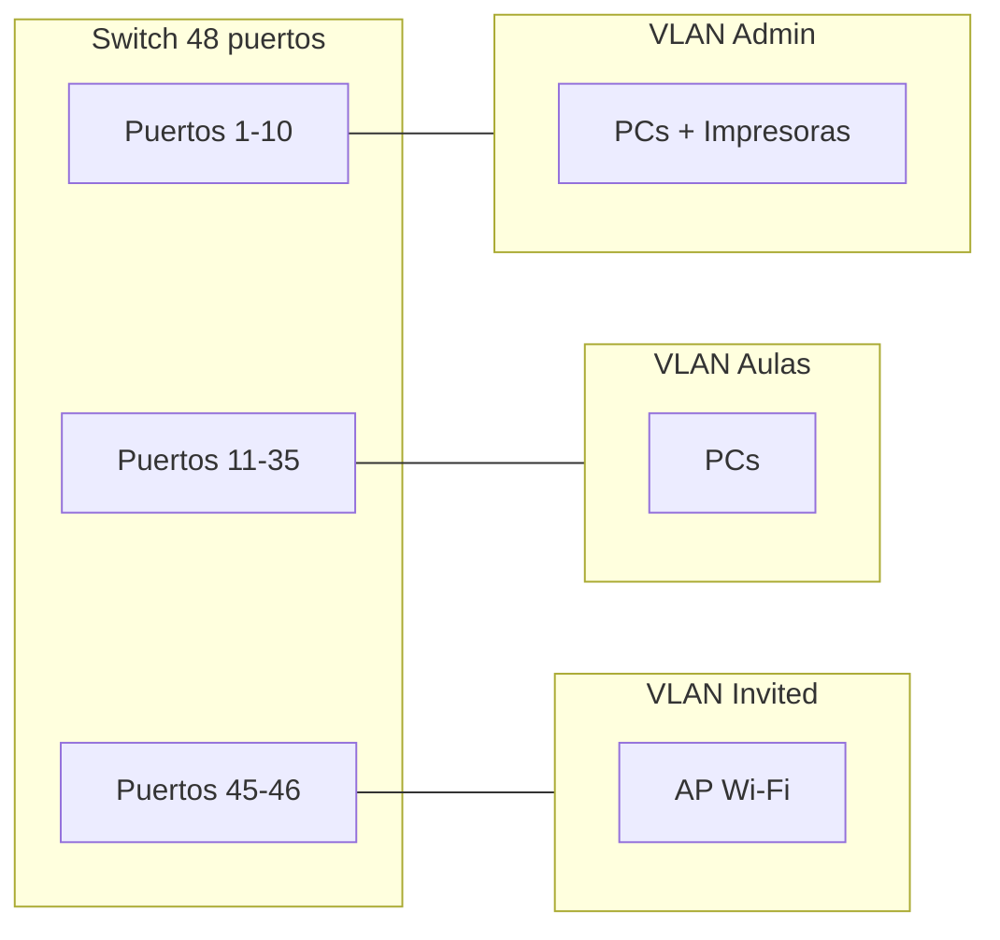
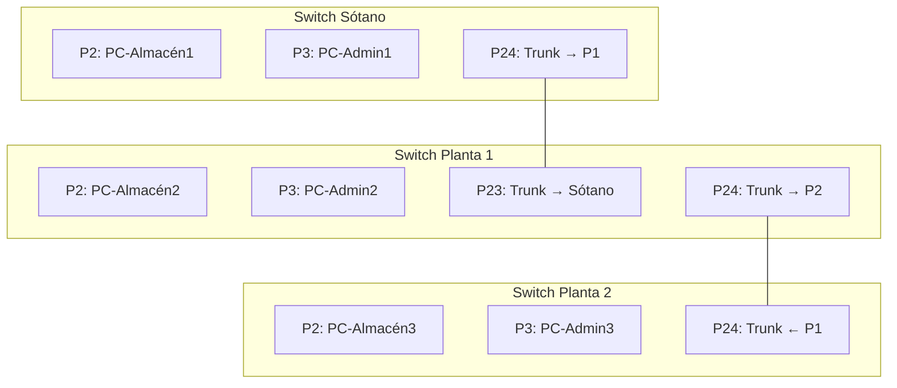
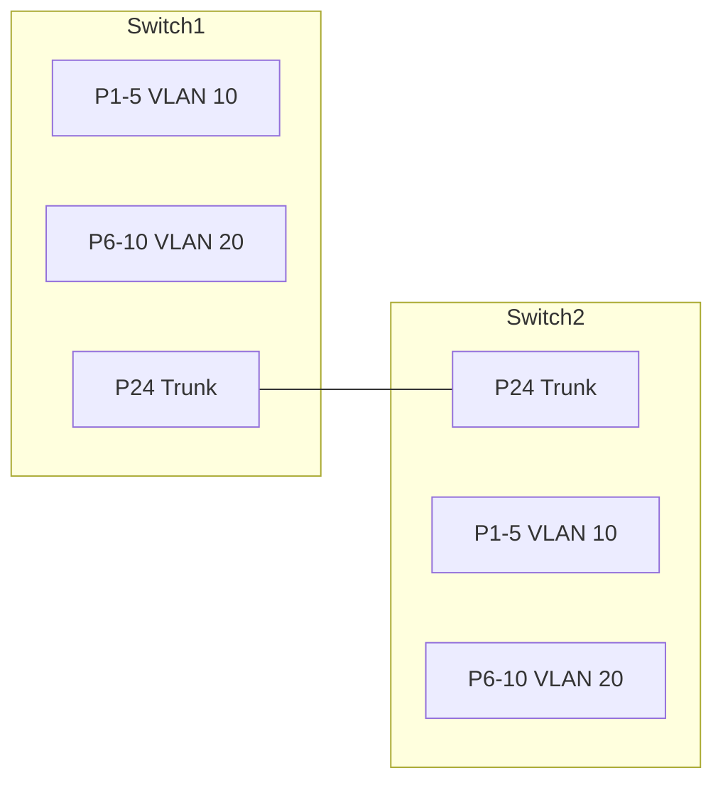
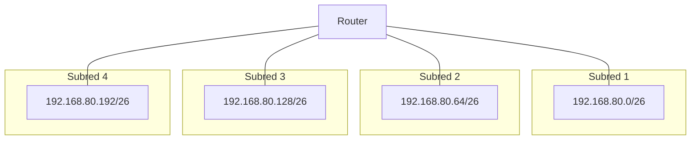
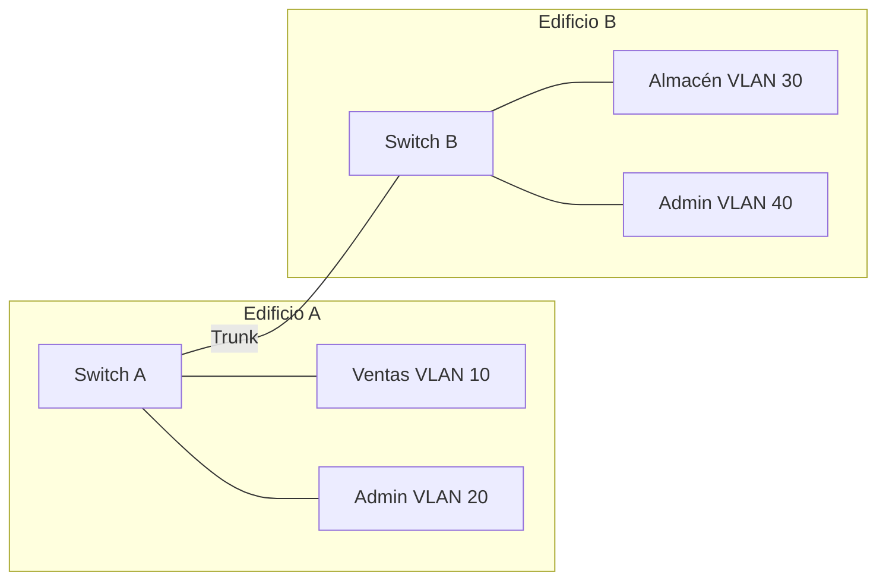

# :material-book-open-variant: Ficha de repaso para el examen

**Tema:** Enrutamiento, Subnetting y VLANs (Unidad 7)  
**Módulo:** Redes de Área Local (RAL)  
**Curso:** Sistemas Microinformáticos y Redes (SMR)

Esta ficha te ayuda a preparar el examen. Incluye: resumen de conceptos, fórmulas de referencia y **actividades de práctica** del mismo tipo que el examen (subnetting, supernetting, tablas de rutas estáticas con esquemas de red, VLANs y enlaces troncales). El examen será íntegramente de actividades prácticas.

[Consulta las **soluciones de las actividades**](extra/soluciones_ficha_repaso_enrutamiento.md) para comprobar tus resultados después de practicar.

---

## PARTE 1: Conceptos y fórmulas de referencia

### Subnetting

- **Subnetting** = dividir una red en subredes tomando **bits prestados** del host → máscara más larga (prefijo mayor).
- **Subredes** = 2^(bits prestados). **Hosts por subred** = 2^(bits de host) − 2. **Incremento** = 2^(bits de host).
- En cada subred no se asignan la **dirección de red** ni la de **broadcast**.

### Supernetting

- **Supernetting** = agrupar redes pequeñas en una superred → máscara más corta (prefijo menor).
- Reglas: redes **contiguas** y **mismo prefijo** (bits iguales por la izquierda en binario).
- Pasos: octeto que varía → binario para cada red → contar bits iguales por la izquierda → nuevo prefijo CIDR.

### Enrutamiento estático

- **Tabla de rutas:** red destino, máscara, siguiente salto, interfaz. **Conexión directa** = sin siguiente salto. **Ruta por defecto** = 0.0.0.0/0.
- Enlaces entre routers: red **/30** (2 hosts utilizables).

### VLANs y trunk

- **Access:** un puerto = una VLAN; tramas sin etiqueta hacia el equipo. **Trunk:** enlace entre switches/router; tramas **etiquetadas** (IEEE 802.1Q) con VLAN ID.
- Entre VLANs hace falta **router** (o switch capa 3).

### Tabla rápida de prefijos (subnetting)

| Prefijo | Hosts por subred |
|---------|-------------------|
| /25 | 126 |
| /26 | 62 |
| /27 | 30 |
| /28 | 14 |
| /29 | 6 |
| /30 | 2 |

### Fórmulas de subnetting (cálculo paso a paso)

#### 1. Número de bits a prestar (para obtener al menos N subredes)

- **Fórmula:** 2^(bits prestados) ≥ N → buscar el menor número de bits tal que 2^b ≥ N.
- **Ejemplo:** Para **30 subredes** → 2⁴ = 16 (no basta), 2⁵ = **32** ≥ 30 → hacen falta **5 bits prestados**.

#### 2. Nueva máscara (prefijo CIDR)

- Si partimos de **/24:** 24 + bits prestados = nuevo prefijo. Ejemplo: 24 + 5 = **/29** (para 32 subredes).
- Si partimos de **/16** (como 172.16.0.0): 16 + bits prestados. Ejemplo: 16 + 5 = **/21** (para 32 subredes).

#### 3. Incremento entre direcciones de red

- **Fórmula:** Incremento = 2^(bits de host restantes). Los “bits de host restantes” son los que quedan en el octeto que varía después de prestar bits.
- Con **/24** y 5 bits prestados: bits de host = 8 − 5 = 3 → incremento = 2³ = **8** (en el último octeto).
- Con **/16** y 5 bits prestados: el octeto que varía es el **tercero**; bits de host en ese octeto = 8 − 5 = 3 → incremento = 2³ = **8** (en el tercer octeto: 172.16.0.0, 172.16.8.0, 172.16.16.0, …).

#### 4. Dirección de red de la subred k

- **Subred 1:** coincide con la red base (ej. 172.16.0.0).
- **Subred k:** Red_k = Red base + (k−1) × Incremento (el incremento se aplica en el octeto que varía: en clase C el último; en 172.16.0.0/21 el tercero).

#### 5. Rango de IP y broadcast de una subred

- **Primera IP válida** = dirección de red + 1 (ej. 172.16.0.1).
- **Última IP válida** = dirección de broadcast − 1.
- **Broadcast** = siguiente dirección de red − 1, o bien: Broadcast = Red + T − 1, donde T = 2^(bits de host) es el tamaño del bloque.

#### 6. ¿A qué subred pertenece una IP?

1. Localizar el **octeto que varía** según la máscara.
2. Con el **incremento I** en ese octeto: valor_red_octeto = (valor del octeto ÷ I) × I (división entera). La dirección de red de la subred es la que tiene ese octeto igual a valor_red_octeto. O bien: aplicar la máscara a la IP y la parte de red resultante es la dirección de red de la subred.

**Ejemplo:** Red 172.16.0.0/21 (incremento 8 en el tercer octeto). ¿A qué subred pertenece la IP **172.16.118.50**?  
- Octeto que varía: el tercero = 118.  
- Valor de red en ese octeto: (118 ÷ 8) × 8 = 14 × 8 = **112** (división entera).  
- La subred es **172.16.112.0/21**. La IP 172.16.118.50 está en el rango 172.16.112.1 – 172.16.119.254.

---

### Ejemplo resuelto (tipo “Empresa con 30 redes”)

**Enunciado:** Red **172.16.0.0**. Necesitamos **al menos 30 subredes**.

1. **Máscara por defecto (sin dividir):** 172.16.0.0 es clase B → **/16** (255.255.0.0).

2. **Máscara subneteada:**  
   - Subredes necesarias: 30. 2⁵ = 32 ≥ 30 → **5 bits prestados**.  
   - Nueva máscara: 16 + 5 = **/21** (255.255.248.0).

3. **Incremento:** El tercer octeto varía. Bits de host en el tercer octeto = 8 − 5 = 3 → **Incremento = 2³ = 8** (en el tercer octeto).

4. **Direcciones de red (1.ª, 2.ª, 15.ª y 30.ª):**  
   - 1.ª: 172.16.**0**.0  
   - 2.ª: 172.16.**8**.0  
   - 15.ª: (15−1)×8 = 112 → 172.16.**112**.0  
   - 30.ª: (30−1)×8 = 232 → 172.16.**232**.0  

5. **Rango de IP válidas de la subred 15:**  
   - Red: 172.16.112.0. Con /21 cada subred tiene 2^(32−21) = 2048 direcciones; en la práctica, por subred usamos un bloque en el tercer octeto de 8 unidades (0–7, 8–15, …, 112–119, …).  
   - Para **subred 15** (red 172.16.112.0): bloque del tercer octeto 112–119.  
   - Primera IP válida: **172.16.112.1**  
   - Última IP válida: **172.16.119.254** (broadcast 172.16.119.255).  

6. **Broadcast de la subred 30:**  
   - Red subred 30: 172.16.232.0. Broadcast = final del bloque: **172.16.239.255**.

*(Con /21, cada “subred” en este esquema tiene el tercer octeto de 8 en 8; el broadcast de la subred 30 es 172.16.239.255.)*

---

### Resumen PARTE 1

| Tema | Fórmulas / pasos clave |
|------|------------------------|
| **Subnetting** | Bits prestados: 2^b ≥ N subredes. Prefijo nuevo = prefijo base + b. Incremento = 2^(bits host restantes). Red_k = Red_base + (k−1)×Incremento. Primera IP = red+1, última = broadcast−1. |
| **Supernetting** | Redes contiguas; octeto que varía → binario; bits iguales por la izquierda → nuevo prefijo (24 − bits que varían si partimos de /24). |
| **Enrutamiento** | Tabla: red, máscara, siguiente salto, interfaz. Directa = sin siguiente salto. Ruta por defecto = 0.0.0.0/0. Enlaces /30 = 2 IP válidas. |
| **VLANs** | Access = 1 VLAN, sin etiqueta. Trunk = varias VLANs, etiqueta 802.1Q. Entre VLANs → router (o L3). |

---

## PARTE 2: Actividades de práctica (tipo examen)

Todas las actividades son prácticas. Resuélvelas en papel como en el examen. Usa los esquemas Mermaid para apoyarte. Cuando termines, puedes comprobar tus respuestas en las [soluciones de la ficha de repaso](extra/soluciones_ficha_repaso_enrutamiento.md).

---

### Subnetting

**Actividad 1 – Red 10.0.50.0**  
Se tiene la red **10.0.50.0** (máscara por defecto /24 en ese bloque).

1. ¿Qué máscara hay que aplicar para obtener **8 subredes**?
2. ¿Cuántos hosts utilizables tendrá cada subred?
3. Escribe las direcciones de red de las 8 subredes.
4. ¿Cuál es la dirección del nodo con identificador 10 en la subred 3?
5. ¿A qué subred pertenece el host 10.0.50.118?

---

**Actividad 2 – Empresa con 30 redes**  
A una empresa se le asigna la red **172.16.0.0**. Necesita **30 subredes**.

1. Máscara de subred por defecto (sin dividir).
2. Máscara subneteada para obtener al menos 30 subredes.
3. Direcciones de red de la 1.ª, 2.ª, 15.ª y 30.ª subred.
4. Rango de IP válidas (primera y última) de la subred 15.
5. Dirección de broadcast de la subred 30.

---

**Actividad 3 – Red 192.168.200.0/26**  
Dada la red **192.168.200.0/26**:

1. Indica dirección de red, broadcast y número de hosts utilizables (sin subdividir).
2. Divídela en **4 subredes** del mismo tamaño. Indica las direcciones de red de las 4 subredes.
3. Para cada una de las 4 subredes: rango de IP válidas (primera y última) y dirección de broadcast.

---

**Actividad 4 – Red 10.10.0.0/22**  
Dada la red **10.10.0.0/22**:

1. Dirección de red, dirección de broadcast y número de hosts utilizables (sin subdividir).
2. Divídela en **4 subredes** iguales (usando máscara /24). Indica las direcciones de red.
3. ¿A qué subred /24 pertenece el host 10.10.2.50?
4. Indica la primera y última IP válida de la subred que contiene 10.10.3.200.

---

**Actividad 5 – Red 192.168.88.0**  
Red **192.168.88.0** (clase C).

1. ¿Qué máscara aplicar para **32 subredes**?
2. ¿Cuántos hosts por subred?
3. Nombra las direcciones de red de las subredes 1, 16 y 32.
4. ¿Cuál es la IP del host 7 en la subred 20?
5. El host 192.168.88.211, ¿a qué subred pertenece?

---

### Supernetting

**Actividad 6 – Cuatro sedes**  
Una empresa tiene 4 sedes: **Sede A** 192.168.12.0/24, **Sede B** 192.168.13.0/24, **Sede C** 192.168.14.0/24, **Sede D** 192.168.15.0/24. Se quiere resumir en una superred.

1. Identifica el octeto que cambia entre las redes.
2. Escribe en binario ese octeto para cada sede.
3. Indica cuántos bits de la izquierda son iguales en los cuatro valores.
4. Calcula la nueva máscara según los bits coincidentes.
5. Escribe la superred resultante (dirección y prefijo CIDR).

---

**Actividad 7 – Ocho departamentos**  
Ocho redes: **192.168.32.0/24**, **192.168.33.0/24**, … **192.168.39.0/24**.

1. Identifica el octeto que varía y escríbelo en binario para cada red (solo el octeto que cambia).
2. Cuenta cuántos bits de la izquierda son iguales en los ocho casos.
3. Calcula la máscara de la superred y el prefijo CIDR.
4. Indica la dirección de la superred resultante y el rango total de IP que abarca.

---

**Actividad 8 – Tres redes contiguas**  
Se agrupan **192.168.100.0/24**, **192.168.101.0/24** y **192.168.102.0/24**.

1. ¿Se pueden agrupar en una superred? Justifica (contigüidad y prefijo).
2. Octeto que varía en binario para las tres redes.
3. Bits coincidentes y nueva máscara.
4. Superred resultante con prefijo CIDR.

---

### Enrutamiento estático

**Actividad 9 – Tabla del Router2 (tres routers en línea)**  
Topología: Router1 ↔ Router2 ↔ Router3. Enlaces entre routers: **192.168.100.0/30** (R1–R2) y **192.168.100.4/30** (R2–R3). Router2 con LANs **192.168.10.0/24** y **192.168.20.0/24**. Router3 con **172.16.50.0/24**. Router1 hacia Internet (ruta por defecto).

1. Asigna IP a las interfaces del **Router2** en cada enlace (primer host válido del segmento para el router).
2. Elabora la **tabla de rutas estáticas del Router2**: red destino, máscara, siguiente salto e interfaz.
3. Justifica qué entradas son conexión directa y cuáles usan siguiente salto.

---

**Actividad 10 – Tabla del Router1 (misma topología del tema)**  
Topología del tema: Router1 ↔ Router2 ↔ Router3. Enlaces **192.168.100.0/30** y **192.168.100.4/30**. Router2 con **172.16.100.0/24**, **192.168.10.0/24** y **192.168.20.0/24**. Router3 con **192.168.30.0/24**. Ruta por defecto a Internet.

1. Indica la **IP de la interfaz** del Router1 en el enlace con Router2.
2. Elabora la **tabla de rutas estáticas del Router1** (red destino, máscara, siguiente salto, interfaz) para alcanzar todas las redes y la ruta por defecto.
3. Explica por qué en este diseño todas las rutas no directas del Router1 usan el mismo siguiente salto.

---

**Actividad 11 – Dos routers**  
Router1: G0/0 hacia Internet, G0/1 con **192.168.1.0/24**, G0/2 enlace a Router2 (**192.168.100.0/30**). Router2: G0/0 enlace a R1, G0/1 con **192.168.2.0/24**.

1. Asigna IP a las interfaces de ambos routers (primer host válido del segmento).
2. Tabla de rutas estáticas del **Router2** para alcanzar 192.168.1.0/24 e Internet (ruta por defecto).
3. ¿Qué siguiente salto usa Router2 para 192.168.1.0/24 y para 0.0.0.0/0?

---

**Actividad 12 – Tabla del Router3 y ruta por defecto**  
Con la **topología del tema** (Router1–Router2–Router3, enlaces /30, 192.168.10.0/24, 192.168.20.0/24, 172.16.100.0/24, 192.168.30.0/24, Internet):

1. Indica las **IP de las interfaces del Router3** en cada enlace.
2. Elabora la **tabla de rutas estáticas del Router3** para que toda la red sea alcanzable.
3. Explica qué significa la entrada 0.0.0.0/0 en la tabla del Router3 y qué dirección usas como siguiente salto.

---

### VLANs y diseño lógico

**Actividad 13 – Clínica dental**  
Una clínica dental tiene un switch de 24 puertos:

- **Recepción:** 2 PCs, 1 impresora, 1 teléfono IP.
- **Consultas:** 6 PCs (uno por gabinete), 2 impresoras.
- **Invitados:** 1 punto de acceso Wi‑Fi para pacientes en sala de espera.

1. **Cuadro de planificación:** tabla con columnas: Nombre VLAN, ID, Rango de IPs (subred), Puertos asignados.
2. **Cuestionario:**  
   - ¿Por qué no es recomendable que el Wi‑Fi de invitados comparta VLAN con los PCs de Recepción?  
   - Si un PC de la VLAN "Consultas" hace ping a un PC de la VLAN "Recepción", ¿funcionará sin un router? Justifica.
3. **Esquema:** dibuja el switch y etiqueta qué puertos pertenecen a cada grupo (por ejemplo, 1–5 para un grupo).

---

**Actividad 14 – Instituto (tres zonas)**  
Un instituto tiene un switch de 48 puertos:

- **Administración:** 4 PCs, 2 impresoras (puertos 1–10).
- **Aulas:** 20 PCs (puertos 11–35).
- **Invited_Guest:** 1 punto de acceso Wi‑Fi para visitas (puertos 45–46).

1. Propón **3 VLANs** con ID, nombre, subred y puertos.
2. ¿Qué dispositivo se necesita para que Administración y Aulas puedan comunicarse? Justifica.
3. Esquema del switch con los puertos asignados a cada VLAN.

---

**Actividad 15 – Oficina (VLANs y subredes)**  
Oficina con **Recepcion** (3 PCs, 1 impresora), **Contabilidad** (4 PCs) y **WiFi_Visitantes** (1 AP). Red base: **192.168.50.0/24**.

1. Divide la red en **3 subredes** (una por VLAN). Indica máscara, direcciones de red y rango de IP válidas de cada una.
2. Asigna a cada VLAN un ID (10, 20, 30) y nombre.
3. ¿Qué ocurre si dos PCs están en VLANs distintas y no hay router ni switch capa 3? Razona.

---

### Enlaces troncales (Trunk) y Access

**Actividad 16 – Tres plantas (trunk entre switches)**  
Empresa con tres plantas. En cada planta hay un switch:

- **Switch Sótano:** PC-Almacén1 (puerto 2), PC-Admin1 (puerto 3). Enlace a Planta 1: puerto 24.
- **Switch Planta 1:** PC-Almacén2 (puerto 2), PC-Admin2 (puerto 3). Puerto 23 hacia Sótano, puerto 24 hacia Planta 2.
- **Switch Planta 2:** PC-Almacén3 (puerto 2), PC-Admin3 (puerto 3). Puerto 24 hacia Planta 1.

1. Indica qué modo (Access o Trunk) debe tener cada puerto que conecta equipos finales y cada puerto que une los switches.
2. Si PC-Almacén1 envía datos a PC-Almacén3, ¿en qué enlaces se transporta la trama con etiqueta VLAN y con qué estándar se etiqueta?
3. Si el puerto 24 del Switch Planta 1 (hacia Planta 2) se configura en modo **Access** para la VLAN de Almacén, ¿podrán comunicarse los PCs de Administración de Planta 1 y Planta 2? Razona.

---

**Actividad 17 – Dos switches con VLAN 10 y 20**  
Dos switches unidos por un cable. Switch1: VLAN 10 (puertos 1–5), VLAN 20 (puertos 6–10). Switch2: VLAN 10 (puertos 1–5), VLAN 20 (puertos 6–10). Enlace entre switches: puerto 24 de ambos.

1. ¿Qué modo debe tener el puerto 24 en ambos switches? Razona.
2. Un PC en VLAN 10 del Switch1 envía una trama a un PC en VLAN 10 del Switch2. ¿La trama lleva etiqueta 802.1Q al salir del Switch1 por el puerto 24? ¿Y al llegar al Switch2?
3. ¿Puede un host en VLAN 10 del Switch1 comunicarse con un host en VLAN 20 del Switch2 sin router? Justifica.

---

**Actividad 18 – Trunk mal configurado**  
Misma topología de tres plantas (Actividad 16). Por error, el puerto troncal entre Planta 1 y Planta 2 se configura como **Access** asignado a la **VLAN 1**.

1. ¿Qué VLANs llegarían a Planta 2 desde Planta 1? Explica.
2. Si en Planta 2 solo existen VLAN 10 (Almacén) y VLAN 20 (Admin), ¿qué comunicaciones entre plantas se rompen?
3. ¿Qué configuración correcta debe tener ese puerto para que todo funcione?

---

### Mixtas (subnetting + VLAN o enrutamiento)

**Actividad 19 – Subnetting y tabla de rutas**  
Red **192.168.80.0/24** dividida en **4 subredes**. Router con 4 interfaces, cada una en una subred distinta (usa la primera IP válida del segmento para el router).

1. Máscara para 4 subredes, direcciones de red y rango de IP válidas de cada una.
2. Asigna a cada interfaz del router una IP y escribe las **4 rutas directas** que tendrá el router (red destino, máscara, interfaz; sin siguiente salto).
3. Esquema con el router y las 4 subredes con sus direcciones de red.

---

**Actividad 20 – Diseño completo (dos edificios)**  
Una empresa tiene **dos edificios**. Edificio A: **Ventas** (6 PCs) y **Admin** (4 PCs). Edificio B: **Almacén** (8 PCs) y **Admin** (4 PCs). Un switch por edificio, unidos por un enlace. Red asignada: **10.20.0.0/22**.

1. Divide **10.20.0.0/22** en **4 subredes** del mismo tamaño (usando máscara /24). Indica las 4 direcciones de red.
2. Asigna una subred a cada grupo (Ventas, Admin edificio A, Almacén, Admin edificio B). Propón IDs de VLAN (10, 20, 30, 40).
3. Diagrama con **dos switches** (Edificio A y B), los grupos (VLANs), el enlace entre switches. Indica si ese enlace debe ser Access o Trunk y por qué.
4. ¿Qué dispositivo se necesita para que Ventas (Edificio A) pueda comunicarse con Admin (Edificio B)? Justifica.

---

## Checklist antes del examen

- [ ] Calcular máscara, subredes, hosts por subred e incremento (subnetting)
- [ ] Obtener direcciones de red, rango de IP válidas y broadcast; saber a qué subred pertenece una IP
- [ ] Supernetting: octeto a binario, bits coincidentes, nuevo prefijo y superred CIDR
- [ ] Asignar IP a interfaces de routers en redes /30
- [ ] Elaborar tabla de rutas estáticas (red, máscara, siguiente salto, interfaz); diferenciar conexión directa y ruta por defecto
- [ ] Planificar VLANs (tabla: nombre, ID, subred, puertos); justificar Wi‑Fi invitados aparte; ping entre VLANs sin router
- [ ] Modo Access (equipos finales) vs Trunk (entre switches); etiquetado 802.1Q; qué pasa si un trunk se configura como Access

---

*Documento de apoyo para preparar el examen. Consulta el tema 7 (Enrutamiento, Subnetting y VLANs) para más detalle. [Soluciones de las actividades](extra/soluciones_ficha_repaso_enrutamiento.md).*
