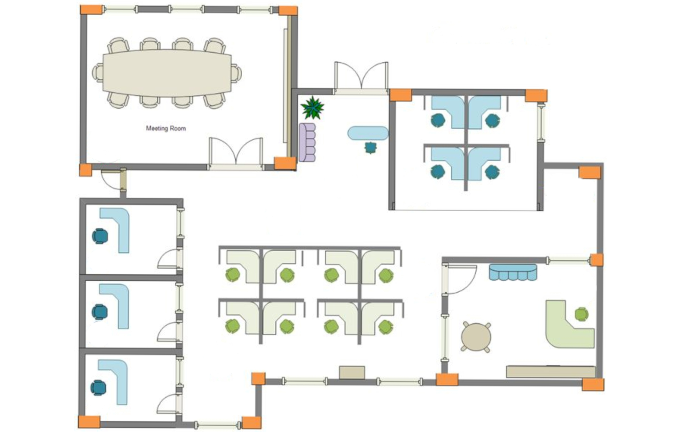

# :material-network: PRÁCTICA 4.1: CABLEADO ESTRUCTURADO EN PACKET TRACER

## 📋 Objetivo

Desplegar el cableado estructurado completo de una oficina bancaria utilizando **Cisco Packet Tracer**, aplicando los conocimientos adquiridos sobre normativa, elementos funcionales y componentes del cableado estructurado.

## 🏢 Contexto del proyecto

Tenemos una empresa de servicios informáticos y nos han contratado para desplegar el cableado estructurado de una oficina bancaria. El plano de dicha oficina se proporciona en esta práctica.

### 📐 Dimensiones de la oficina

- **Ancho**: 160.000 m
- **Alto**: 95.000 m  
- **Altura**: 3.700 m

<figure>
  
  <figcaption>Plano de la oficina bancaria donde se desplegará el cableado estructurado.</figcaption>
</figure>

## 🎯 Tareas a realizar

### Fase 1: Diseño en Packet Tracer

1. **Insertar el plano en la capa física de Cisco Packet Tracer**
   - Importar la imagen del plano de la oficina
   - Ajustar las dimensiones según las medidas reales proporcionadas

2. **Diseñar la infraestructura de cableado**
   - Colocar todos los elementos necesarios para una correcta instalación
   - Asegurar que cada puesto de trabajo tenga un PC con conexión a Internet
   - Incluir todos los componentes del cableado estructurado:
     - Armarios de distribución
     - Paneles de parcheo
     - Switches
     - Routers
     - Puntos de acceso inalámbricos
     - Rosetas (tomas de usuario)
     - Canaletas y sistemas de guiado

3. **Realizar todas las conexiones**
   - Cableado horizontal desde las tomas de usuario hasta los distribuidores
   - Conexiones en los paneles de parcheo
   - Enlaces entre switches y routers
   - Configuración de la conectividad a Internet

### Fase 2: Documentación técnica

Una vez completado el proyecto en Packet Tracer, deberás elaborar un documento que incluya:

#### 1. 📦 Inventario de material

Indica la cantidad de cada tipo de material necesario:

- **Armarios de distribución** (racks)
- **Cables trenzados** (metros totales, categoría)
- **Conectores** (RJ-45, cantidad)
- **Routers** (modelo y cantidad)
- **Switches** (modelo, número de puertos, cantidad)
- **Puntos de acceso inalámbricos** (cantidad y ubicación)
- **Rosetas** (tomas de usuario, cantidad)
- **Canaletas** (metros, tipo)
- **Paneles de parcheo** (número de puertos, cantidad)
- **Cualquier otro material necesario** (latiguillos, pasahilos, guías, etc.)

#### 2. 💰 Presupuesto de materiales

Elabora un presupuesto detallado **solo para material** (sin incluir mano de obra ni herramientas). 

**Fuentes de consulta para precios:**

- [Cablematic](http://www.cablematic.es)
- [Cablecom](http://www.cablecom.es)
- [Senetic](http://www.senetic.es)
- [Hyperline Systems](http://esp.hyperlinesystems.com)
- [Universal Networks](http://www.universalnetworks.co.uk)

El presupuesto debe incluir:

- Tabla con descripción del material, cantidad, precio unitario y precio total
- Suma total del presupuesto
- Referencias de los productos seleccionados

## 🎥 Recursos de apoyo

<figure>
  <video controls style="max-width: 800px; width: 100%;">
    <source src="./imagenes/practica_4_1_video.mp4" type="video/mp4">
    Tu navegador no soporta la reproducción de video.
  </video>
  <figcaption>Video tutorial: Cableado Estructurado de Redes en Packet Tracer (2022)</figcaption>
</figure>

## 📋 Criterios de evaluación

| Criterio | Descripción | Puntos |
|----------|-------------|--------|
| **Diseño en Packet Tracer** | Correcta implementación del plano y elementos de red | 0-4 |
| **Conexiones y funcionalidad** | Todas las conexiones funcionan correctamente | 0-4 |
| **Inventario de material** | Listado completo y detallado de materiales | 0-3 |
| **Presupuesto** | Presupuesto realista con referencias de productos | 0-4 |
| **Documentación** | Claridad y organización del documento entregado | 0-3 |

**Total: 18 puntos**

## 📄 Formato de entrega

- **Archivo Packet Tracer**: Guardar el proyecto con el nombre `PR401_oficina_bancaria.pkt`
- **Documento técnico**: PDF con el nombre `PR401_documentacion.pdf` que incluya:
  - Portada con datos del alumno/a
  - Inventario de material detallado
  - Presupuesto completo con tablas
  - Capturas de pantalla del proyecto en Packet Tracer
  - Conclusiones y justificaciones técnicas

## 💡 Recomendaciones

- Revisa la normativa de cableado estructurado antes de diseñar
- Asegúrate de cumplir con las distancias máximas (90 m horizontal, 100 m total)
- Planifica la ubicación de los armarios de distribución de forma estratégica
- Considera la escalabilidad y mantenimiento futuro
- Documenta todas las decisiones técnicas tomadas

---

!!! tip "Recuerda"
    Esta práctica integra todos los conceptos vistos en la unidad: adaptadores de red, armarios, paneles de parcheo, electrónica de red y normativa. Aplica los estándares ANSI/TIA/EIA-568 y 569 en tu diseño.

