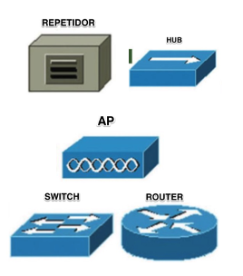
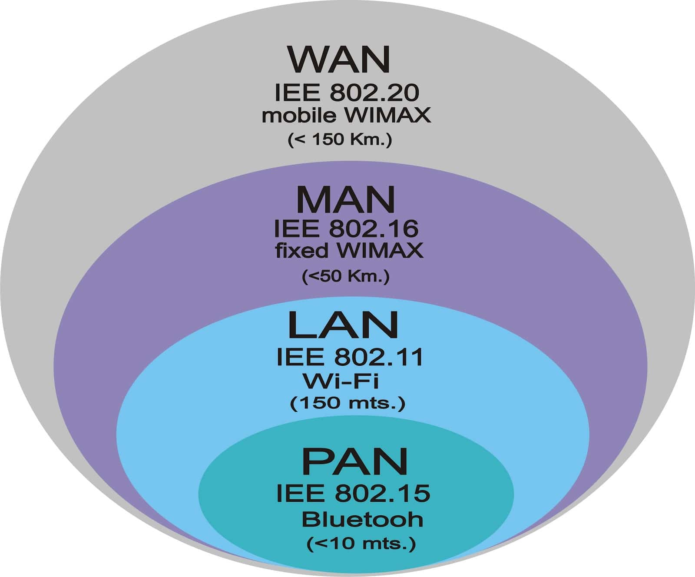
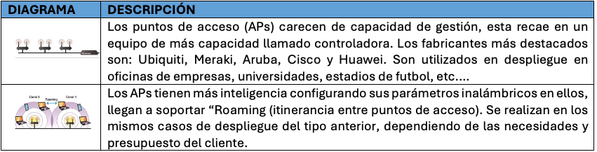
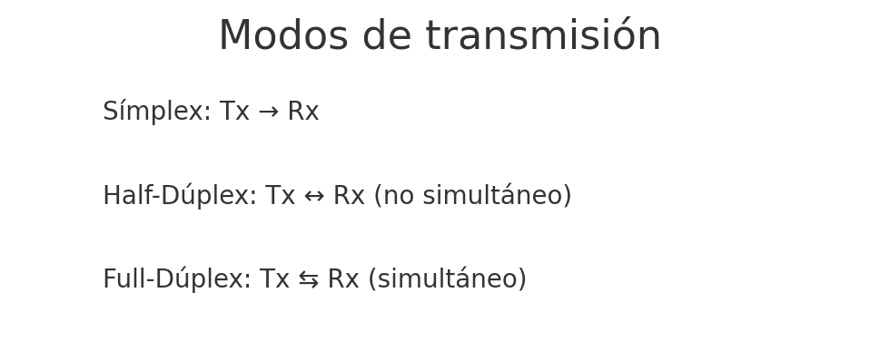
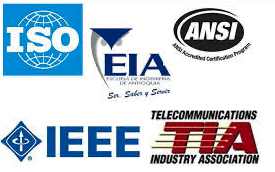
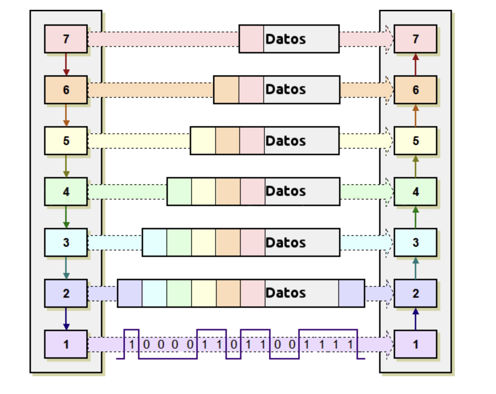
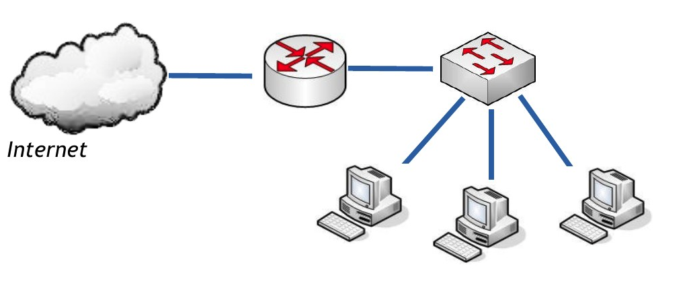
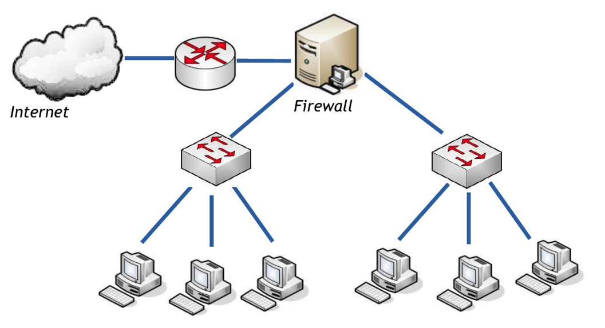
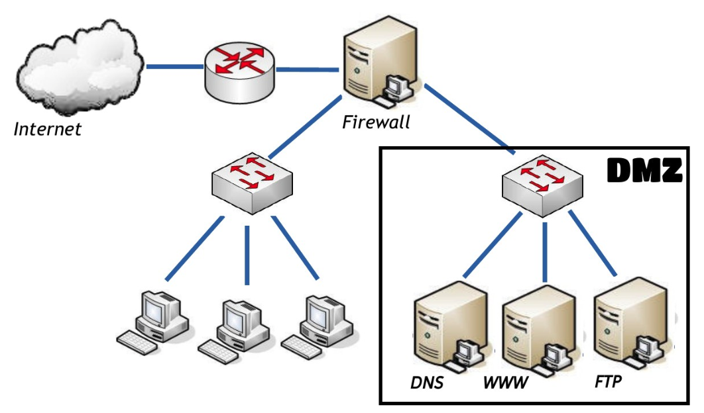

# Tema 1. Introducción. Arquitectura de redes

Este tema fusiona y recorta lo que en el curso 2025-26 eran la **UT1 (Introducción a las redes)** y la **UT2 (Arquitecturas de redes)**. El objetivo es salir de las primeras semanas con un mapa claro de qué es una LAN, qué dispositivos hay y **por qué** se organizan las comunicaciones en capas (OSI / TCP-IP).

!!! tip "Primera clase"
    Empieza por el [cuestionario inicial](#cuestionario-inicial) (preguntas 1–7). No hace falta estudiar el tema completo antes; el cuestionario sirve de diagnóstico.

## Propuesta didáctica

Trabajamos el **RA1** del módulo Redes de área local (0225):

> **RA1.** *Reconoce la estructura de redes locales cableadas analizando las características de entornos de aplicación y describiendo la funcionalidad de sus componentes.*

### Criterios de evaluación (RA1)

* **CE1a**: Se han descrito los principios de funcionamiento de las redes locales.
* **CE1b**: Se han identificado los distintos tipos de redes.
* **CE1c**: Se han descrito los elementos de la red local y su función.
* **CE1d**: Se han identificado y clasificado los medios de transmisión.
* **CE1e**: Se ha reconocido el mapa físico de la red local.
* **CE1f**: Se han reconocido las distintas topologías de red.
* **CE1g**: Se han identificado estructuras alternativas.

### Contenidos

* Sistemas en red: tipos, componentes y topologías.
* Clasificación por extensión (PAN, LAN, MAN, WAN) y por ámbito (pública / privada).
* Medios de transmisión (visión general) y perturbaciones habituales.
* Normalización: estándares y organismos.
* Arquitecturas por capas: modelo OSI y modelo TCP/IP; PDU y encapsulación.
* Esquemas LAN básicos (red simple, zonas, idea de DMZ).

### Programación de aula (orientativa, ~18–20 h)

| Sesiones | Contenidos | Actividades |
| --- | --- | --- |
| 1 | Presentación del módulo + normas del taller + cuestionario inicial | Cuestionario (1–7) |
| 2–3 | Componentes, tipos de redes, topologías | **PR101** (Excalidraw) |
| 4 | Transmisión básica y perturbaciones (nivel SMR) | AC102 |
| 5–7 | Normalización, OSI / TCP-IP, encapsulación | AC103, AC104 |
| 8–9 | Esquemas LAN; repaso | PR102 (Packet Tracer) cuando el grupo esté listo |

---

## Cuestionario inicial

!!! question "Antes de empezar — responde con lo que sepas"
    1. ¿Qué tipos de redes conoces según su extensión?
    2. ¿Qué diferencia hay entre una red pública y una privada?
    3. ¿Qué función tiene un switch en una red local?
    4. ¿Qué ventajas ofrece la fibra óptica frente al par trenzado?
    5. ¿Qué es una topología en estrella? ¿Dónde se suele usar?
    6. ¿Qué relación existe entre los nodos finales e intermedios?
    7. ¿Qué diferencia hay entre transmisión serie y paralela?
    8. ¿Qué es un modelo de red y para qué sirve?
    9. ¿Cuáles son las principales diferencias entre el modelo OSI y el modelo TCP/IP?
    10. ¿Qué diferencias hay entre conmutación y difusión en el uso del medio?
    11. ¿Qué es una DMZ y para qué se utiliza en una red local?

!!! warning "Soluciones"
    Las soluciones del cuestionario **no se publican** en el sitio del alumnado. Se trabajan en clase o se entregan en Aules cuando proceda.

---

## Sistemas en red

Un **sistema de red** es el conjunto de equipos electrónicos y medios de transmisión que permiten la comunicación entre terminales, a menudo situados en puntos remotos. La unión de estos sistemas forma las **redes de comunicaciones**.

<figure markdown="span">
  { width="800" }
  <figcaption>Elementos de un sistema de red</figcaption>
</figure>

### Componentes hardware

#### Nodos finales (DTE)

Dispositivos que **inician o terminan** una comunicación: estaciones de trabajo, servidores, impresoras de red, etc.

#### Nodos intermedios (DCE)

Participan en la comunicación entre nodos finales:

| Dispositivo | Idea clave | Capa OSI habitual |
| --- | --- | --- |
| **Repetidor** | Amplifica / regenera la señal | 1 (física) |
| **Switch** | Conecta equipos en la misma LAN; aprende MAC ↔ puerto | 2 (enlace) |
| **Router** | Conecta **redes distintas**; encaminamiento | 3 (red) |
| **Firewall** | Filtra tráfico según políticas de seguridad | varias |

<figure markdown="span">
  { width="400" }
  <figcaption>Principales nodos intermedios</figcaption>
</figure>

### Adaptador de red (NIC)

Permite conectar el equipo a la red. Se caracteriza por:

- Tipo de interfaz (cableada / inalámbrica).
- Modo de transmisión (**half-dúplex** / **full-dúplex**).
- Velocidad (Mbps / Gbps).

<figure markdown="span">
  { width="600" }
  <figcaption>NIC (Network Interface Card)</figcaption>
</figure>

### Medios de transmisión (visión general)

| Tipo | Ejemplos | Uso típico en LAN |
| --- | --- | --- |
| Guiados | Par trenzado (UTP/FTP), fibra óptica, coaxial | Cableado de edificio; backbone |
| No guiados | Wi‑Fi, radioenlaces | Acceso inalámbrico en aulas / oficinas |

El detalle de categorías de cable, conectores y normativa se desarrolla en los **Temas 2–3**.

### Componentes software

- **NOS / pila de protocolos**: software que gestiona la comunicación.
- **Drivers**: controladores del adaptador de red.

!!! tip "¿Qué es un protocolo?"
    Conjunto de reglas entre emisor y receptor que permiten transmitir datos de forma acordada. Ejemplo: el protocolo **IP** define el direccionamiento lógico.

---

## Clasificación de redes

### Según su extensión

- **PAN**: entorno personal (pocos metros). Ej.: Bluetooth, NFC.
- **LAN**: red local (empresa, aula, vivienda). Si es inalámbrica: **WLAN**.
- **MAN**: varias LAN en ámbito metropolitano.
- **WAN**: interconexión a gran distancia. Internet es un ejemplo de WAN.

<figure markdown="span">
  { width="600" }
  <figcaption>Tipos de redes según su extensión</figcaption>
</figure>

### Según su ámbito (titularidad)

- **Públicas**: servicio a usuarios que contratan (ISP).
- **Privadas**: propiedad de una organización o particular. Una **VPN** permite extender de forma segura una LAN sobre una red no controlada (p. ej. Internet).

<figure markdown="span">
  { width="800" }
  <figcaption>Elementos principales de una VPN</figcaption>
</figure>

---

## Topologías

La **topología** describe la distribución espacial de los elementos conectados.

### Cableadas

Hoy lo habitual en LAN es la **estrella** (y variantes en árbol / jerárquicas). El bus clásico está en desuso.

<figure markdown="span">
  { width="900" }
  <figcaption>Principales topologías cableadas</figcaption>
</figure>

### Inalámbricas

Despliegues basados en **puntos de acceso** Wi‑Fi (estrella inalámbrica, malla, etc.).

<figure markdown="span">
  { width="900" }
  <figcaption>Principales topologías inalámbricas</figcaption>
</figure>

---

## Transmisión y perturbaciones (mínimos SMR)

**Transmisión**: enviar datos de un punto a otro a través de un medio.  
**Perturbación**: interferencia o degradación que puede alterar la señal.

### Ideas que debes manejar

| Criterio | Opciones | Ejemplo |
| --- | --- | --- |
| Naturaleza de la señal | Analógica / digital | Voz telefónica vs Ethernet |
| Cómo viajan los bits | Serie / paralelo | USB (serie) vs buses antiguos |
| Dirección | Símplex / half-dúplex / full-dúplex | TV; walkie-talkie; teléfono |

<figure markdown="span">
  { width="360" }
  { width="360" }
  <figcaption>Señal analógica (izquierda) y digital (derecha)</figcaption>
</figure>

<figure markdown="span">
  { width="360" }
  { width="360" }
  <figcaption>Transmisión en serie y en paralelo</figcaption>
</figure>

<figure markdown="span">
  { width="640" }
  <figcaption>Símplex, half-dúplex y full-dúplex</figcaption>
</figure>

### Perturbaciones habituales

- **Atenuación**: pérdida de potencia con la distancia.
- **Ruido**: señales no deseadas (térmico, impulsivo, diafonía…).
- **Distorsión**: deformación de la forma de la señal.

!!! note "Fuera de alcance en este tema"
    Técnicas de codificación (NRZ, Manchester…) y modulación detallada (AM/FM/PM) **no** se desarrollan aquí; si hace falta, se retomarán como ampliación o en laboratorio.

---

## Normalización

Al principio cada fabricante tenía su red. El problema era la **incompatibilidad**. La solución: **estandarizar**.

<figure markdown="span">
  { width="700" }
  <figcaption>Necesidad de normalización</figcaption>
</figure>

### Organismos (visión general)

Entre otros: **ISO**, **IEEE**, **ITU**, **IETF**. Unos definen modelos de referencia; otros, estándares de cableado, Wi‑Fi, protocolos de Internet, etc.

<figure markdown="span">
  { width="700" }
  <figcaption>Organismos de normalización</figcaption>
</figure>

---

## Arquitecturas por capas

Diseñar una red implica resolver encaminamiento, direccionamiento, acceso al medio, control de errores, etc. La solución práctica es dividir el problema en **capas**.

### Principios

- Cada capa se apoya en los servicios de la inferior.
- Capas homólogas se entienden mediante **protocolos**.
- Se puede cambiar un protocolo de una capa si se mantienen los servicios.

### PDU y encapsulación

**PDU** (*Protocol Data Unit*): unidad de datos de una capa.

| Capa (TCP/IP) | Nombre habitual de la PDU |
| --- | --- |
| Aplicación | Datos |
| Transporte | Segmento (TCP) / datagrama (UDP) |
| Internet (red) | Paquete / datagrama IP |
| Acceso a la red | Trama |
| Física | Bits |

En el **emisor**, cada capa añade su cabecera (**encapsulación**). En el **receptor**, se eliminan en orden inverso.

<figure markdown="span">
  { width="600" }
  <figcaption>Comunicación basada en niveles (modelo OSI)</figcaption>
</figure>

---

## Modelo OSI y modelo TCP/IP

### OSI (7 capas)

1. **Física** — medio y señales.  
2. **Enlace** — tramas, MAC, acceso al medio.  
3. **Red** — encaminamiento (IP…).  
4. **Transporte** — extremo a extremo (TCP/UDP…).  
5. **Sesión** — gestión de la sesión.  
6. **Presentación** — formato, cifrado, compresión.  
7. **Aplicación** — servicios al usuario (HTTP, SMTP…).

### TCP/IP (4 capas)

1. **Acceso a la red** ≈ física + enlace OSI.  
2. **Internet** ≈ red OSI (IP, ARP, ICMP…).  
3. **Transporte** (TCP, UDP).  
4. **Aplicación** ≈ sesión + presentación + aplicación OSI.

| Capa TCP/IP | Capas OSI | Función |
| --- | --- | --- |
| Aplicación | 5–7 | Servicios al usuario |
| Transporte | 4 | Comunicación extremo a extremo |
| Internet | 3 | Encaminamiento y direccionamiento |
| Acceso a la red | 1–2 | Medio físico y tramas |

<figure markdown="span">
  { width="500" }
  <figcaption>Equivalencia entre OSI y TCP/IP</figcaption>
</figure>

---

## Uso del medio y esquemas LAN

### Difusión vs conmutación

- **Difusión (broadcast)**: el medio se comparte; todos pueden “oír” (más colisiones en medios compartidos clásicos).
- **Conmutación**: el tráfico se dirige hacia el destino (switches modernos reducen dominios de colisión).

<figure markdown="span">
  { width="700" }
  <figcaption>Idea de difusión en el medio</figcaption>
</figure>

### Esquemas LAN

- **LAN simple**: PCs + switch (+ router hacia Internet).
- **LAN por zonas**: separar departamentos o servicios.
- **DMZ**: zona intermedia para servicios expuestos, con filtrado hacia la red interna.

<figure markdown="span">
  { width="700" }
  <figcaption>Esquema de LAN simple</figcaption>
</figure>

<figure markdown="span">
  { width="700" }
  <figcaption>Esquema LAN con zonas</figcaption>
</figure>

<figure markdown="span">
  { width="700" }
  <figcaption>Esquema con DMZ</figcaption>
</figure>

---

## Actividades

!!! tip "Formato de entrega"
    Entrega en Aules un PDF con nombre `AC1XX.pdf` o `PR1XX.pdf` (sustituye XX por el número). Respeta la fecha de vencimiento.

### PR101 — Mapa físico y lógico (Excalidraw)

* :simple-neutralinojs: **PR101**. (RA1 // CE1c, CE1e, CE1f // **PR 0–10**). En grupo, diseñad el esquema de la empresa ficticia **TechSolutions**:

  - 3 departamentos (Administración, Ventas, Soporte), cada uno con 5 PCs y 1 impresora.
  - 1 servidor central.
  - Conexión a Internet mediante router.

  **Tareas:** elegir topología; dibujar en [Excalidraw](https://excalidraw.com/); etiquetar medios (UTP, fibra, Wi‑Fi); justificar topología, medios y dispositivos; exposición breve (5 min).

| Criterio | Descripción | Puntos |
| --- | --- | --- |
| Claridad del diagrama | Legible y organizado | 0–2 |
| Dispositivos | Todos los necesarios | 0–2 |
| Conexiones | Etiquetadas (UTP / fibra / Wi‑Fi) | 0–2 |
| Topología adecuada | Coherente con el escenario | 0–2 |
| Justificación técnica | Argumentación clara | 0–2 |
| **Total** | | **/10** |

### AC102 — Transmisión y perturbaciones

* :simple-readdotcv: **AC102**. (RA1 // CE1a, CE1c, CE1d // **AC 0–1**). Busca ejemplos reales de: serie/paralelo, símplex/half/full-dúplex, y al menos dos perturbaciones. Para cada uno: dónde aparece, qué efecto tiene y qué solución se aplica o propondrías.

### AC103 — Organismos de normalización

* :simple-readdotcv: **AC103**. (RA1 // CE1a, CE1c // **AC 0–1**). Tabla comparativa de organismos (ISO, IEEE, ITU, IETF…): función y algún estándar relevante.

### AC104 — OSI vs TCP/IP

* :simple-readdotcv: **AC104**. (RA1 // CE1a, CE1f // **AC 0–1**). Esquema comparativo OSI / TCP-IP: capas, equivalencia, función y un ejemplo de protocolo por capa TCP/IP.

### PR102 — Modelos en Packet Tracer (cuando toque)

* :simple-cisco: **PR102**. (RA1 // CE1a, CE1c // **PR 0–10**). Simulación en Packet Tracer: observar encapsulación HTTP/TCP/IP/Ethernet. El guion completo se facilitará en clase / Aules (legado 25-26 disponible para el profesor en `archivo/2526/`).

---

## Referencias rápidas

- Sitio del módulo: [fjavier-hernandez.github.io/ral](https://fjavier-hernandez.github.io/ral/)
- Herramientas: [Excalidraw](https://excalidraw.com/), [Cisco Packet Tracer](https://www.netacad.com/es/cisco-packet-tracer)
- Normas: [Normas del taller](../00-normas/normas_taller.md)

*[RA]: Resultado de aprendizaje  
*[CE]: Criterio de evaluación  
*[AC]: Actividad de clase  
*[PR]: Práctica  
*[LAN]: Local Area Network  
*[OSI]: Open Systems Interconnection  
*[PDU]: Protocol Data Unit
