# 🌐 Introducción a las Redes

## 📚 Propuesta didáctica

En esta unidad vamos a comenzar a trabajar el **RA1 de RAL**:

> **RA1.** *Reconoce la estructura de redes locales cableadas analizando las características de entornos de aplicación y describiendo la funcionalidad de sus componentes.*

### Criterios de evaluación

#### Criterios de evaluación del RA1

* **CE1a**: Se han descrito los principios de funcionamiento de las redes locales.
* **CE1b**: Se han identificado los distintos tipos de redes.
* **CE1c**: Se han descrito los elementos de la red local y su función.
* **CE1d**: Se han identificado y clasificado los medios de transmisión.
* **CE1e**: Se ha reconocido el mapa físico de la red local.
* **CE1f**: Se han reconocido las distintas topologías de red.
* **CE1g**: Se han identificado estructuras alternativas.
 
### Contenidos

Redes de Comunicaciones:

* Sistemas en red: tipos, componentes y topologías.
* Transmisión de datos: medios, tipos, técnicas y perturbaciones.

Interpretación de conceptos clave:

* Tipos de redes: PAN, LAN, MAN, WAN.
* Componentes hardware y software: nodos, adaptadores, medios.
* Topologías cableadas e inalámbricas.
* Medios guiados e inalámbricos.
* Tipos de transmisión: naturaleza, señales simultáneas, dirección.
* Técnicas de transmisión: digital, analógica.
* Perturbaciones: atenuación, distorsión, ruido.

!!! question "Cuestionario inicial"
    1. ¿Qué tipos de redes conoces según su extensión?
    2. ¿Qué diferencia hay entre una red pública y una privada?
    3. ¿Qué función tiene un switch en una red local?
    4. ¿Qué ventajas ofrece la fibra óptica frente al par trenzado?
    5. ¿Qué es una topología en estrella? ¿Dónde se suele usar?
    6. ¿Qué papel juega el sistema operativo de red (NOS)?
    7. ¿Qué relación existe entre los nodos finales e intermedios?
    8. ¿Qué diferencia hay entre transmisión serie y paralela?
    9. ¿Qué tipos de transmisión existen según la dirección?
    10. ¿Qué ventajas tiene la transmisión digital frente a la analógica?
    11. ¿Qué tipos de ruido afectan a la transmisión de datos?

### Programación de Aula (12h)

Esta unidad se imparte en la primera evaluación, con una duración estimada de 12 sesiones lectivas, durante la última quincena de septiembre:

| Sesión | Contenidos | Actividades | Criterios trabajados |
| --- | --- | --- | --- |
| 1  | Introducción redes: tipos, componentes y topologías | Cuestionario inicial (1-7) | CE6a, CE6b, CE6c y CE6d |
| 2  | Práctica Mapa físico Empresa ficticia | PR101 | CE7a, CE7c, y CE7e |
| 3  | Introducción a la transmisión de datos: analógica y digital | AC102 | CE7a, CE7c, y CE7e |
<!-- | 4  | [Medios de transmisión: guiados e inalámbricos | [AC104](#ACc |
| 5  | [Topologías cableadas estrella, árbol, anillo, malla | [AC105| CE6d |
| 6  | [Topologías inalámbricas](#topologias-inalam  | Tipos de transmisión: naturaleza, señales, dirección | [AC107] CE6e |
| 8  | [Técnicas de transmisión digital]NRZ, Manchester | [AC108] CE6e |
| 9  | [Técnicas de transmisión analógica AM, FM, PM | [AC109](#ACe |
| 10 | Perturbaciones: atenuación, distorsión, ruido | AC110 | CE6e |
| 11 | [Interpretación de esquemas](#interpret6a, CE6b, CE6c |
| 12 | Reto - Diseño de red local | PY112 | CE6a, CE6b, CE6c, CE6d | -->

---

## 🔗 Sistemas en red

Según indica [Tanenbaum, en su libro Redes de Computadoras](https://conalepdalia.wordpress.com/wp-content/uploads/2013/08/redes-de-computadoras-tanenbaum-4ta-edicion-espanol.pdf), **un sistema de red** hace referencia al conjunto de equipos electrónicos y medios de transmisión que realizan el proceso de comunicación entre terminales informáticos, que normalmente están situados en puntos remotos.

<figure style="align: center;">
    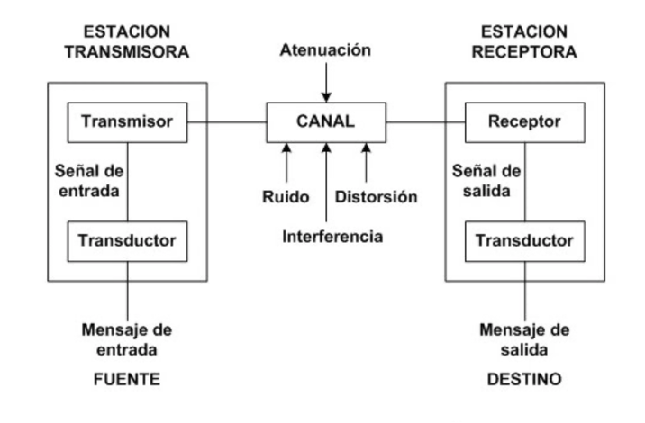
    <figcaption style="text-align: center;">Elementos de un sistema de red</figcaption>
</figure>

La unión de estos sistemas forma las denominadas **Redes de Comunicaciones**, cuya clasificación se explica siguiendo diferentes factores, entre los cuales destacan: alcance geográfico y ámbito de propiedad (público y privado).

---

## ⚙️ Componentes

Un sistema en red se compone de elementos hardware y software.

### Componentes Hardware

#### Nodos en una red

Los nodos son dispositivos encargados de enviar y recibir la información en el proceso de comunicación de sistemas en red, y se dividen en:

##### Nodos finales

Son cualquier dispositivo de red que comienza o termina una comunicación; también se denominan *Data Terminal Equipment* (DTE).  

> Los más habituales son:

- Estaciones de trabajo (*workstations*).
- Servidores.

  <iframe 
    src="https://www.youtube.com/embed/zDAYZU4A3w0" 
    title="Video explicativo sobre Servidores de Google" 
    frameborder="0" 
    allowfullscreen 
    style="width: 100%; height: 100%; display: block;">
  </iframe>
  <figcaption style="text-align: center; font-style: italic; margin-top: 0.5em;">
    Video explicativo sobre Servidores de Google
  </figcaption>

##### Nodos intermedios

También conocidos como *Data Circuit-Terminating Equipment* (DCE), son aquellos dispositivos que participan en la comunicación entre nodos finales.  
Destacan los siguientes DCEs:

- **Repetidores:** Se encargan de amplificar y rectificar la señal. Son dispositivos de capa 1 (física) del modelo OSI (*Open System Interconnection*).
- **Switches:** Conectan equipos en la misma red local. Se caracterizan por su mecanismo de autoaprendizaje que relaciona la dirección MAC de un dispositivo con el puerto/interfaz del switch donde está conectado. Son dispositivos de capa 2 (enlace) del modelo OSI.
- **Routers:** Su principal objetivo es comunicar redes distintas. También destacan características como asignación de IPs dinámicamente (DHCP), balanceo de carga y traducción de IPs (NAT). Operan en la capa 3 (red).
- **Firewalls:** Además de enrutar, tienen funciones en las capas superiores del modelo OSI, como el control de sesiones para analizar paquetes y detectar amenazas de intrusión en los sistemas de red.

<figure style="align: center;">
    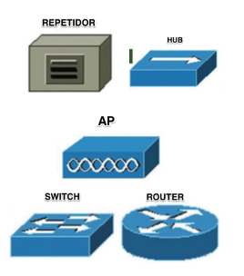
    <figcaption style="text-align: center;">Principales nodos intermedios</figcaption>
</figure>

### Adaptadores de red

El **adaptador de red (NIC)** permite la conexión del equipo a la red. Se clasifica por:

- **Tipo de interfaz:** cableadas (par trenzado, coaxial, fibra óptica) o inalámbricas.
- **Modo de transmisión:** Half-duplex (un sentido), Full-duplex (ambos sentidos simultáneamente).
- **Velocidad de transmisión:** medida en Mbps o Gbps.

<figure style="align: center;">
    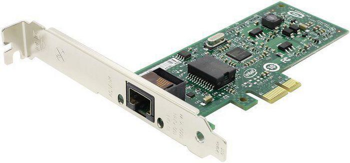
    <figcaption style="text-align: center;">NIC (Network Interface Card)</figcaption>
</figure>

### Medios de transmisión

El **medio de transmisión** es el soporte físico que facilita el transporte de la información; influye directamente en el rendimiento y prestaciones de la red.

> A continuación, se describen los tipos y sus principales características:

| **TIPOS**            | **CLASIFICACIÓN INTERNA** | **CARACTERÍSTICAS PRINCIPALES Y USOS** |
|----------------------|----------------------------|-----------------------------------------|
| **GUIADOS CABLEADOS** | Par trenzado               | Consiste en grupos de hilos de cobre aislados y entrelazados entre sí, para anular las interferencias externas e internas. Se destaca su uso en cableado estructurado en edificios. Tipos: UTP (interiores) y FTP (exteriores). |
|                      | Coaxial                    | Consta de tres capas: núcleo de cobre (vivo), aislante plástico y malla conductora. Usado en TV, CCTV y despliegues de tele-cable locales. |
|                      | Fibra óptica               | Núcleo de vidrio o silicio que transmite luz. Revestido y protegido externamente. Muy extendido en hogares gracias a la tecnología GPON (Gigabit-capable Passive Optical Network). |
| **INALÁMBRICOS**     | Antenas                    | Transmiten señales electromagnéticas entre emisor y receptor. Características clave: potencia y frecuencia. Tipos: radioenlaces (4G), puntos de acceso WiFi para redes locales sin cables. |

### Componentes Software

Todos los dispositivos activos de la red deben ejecutar operaciones informáticas avanzadas para cumplir con los protocolos de red, por lo que deben tener un software de red. Es decir, es el conjunto de programas y ficheros de configuración que permiten la comunicación entre elementos de una red. 

> Los podemos dividir en dos:

- **NOS (Network Operating System):** software que gestiona la comunicación y la pila de protocolos.
- **Drivers:** software específico para gestionar adaptadores de red.

!!! tip "¿Qué es un protocolo?"
    Son un conjunto de reglas que se establecen entre el transmisor y receptor de un proceso de comunicación que permite asegurar la transmisión de datos entre los dos extremos. ****Ejemplo****: protocolo IP (dicta las reglas para las direcciones IP).

---

## 🗂️ Clasificación

### 📏 Tipos según su extensión

Las redes se clasifican según su extensión en los siguientes tipos:

- **PAN (Personal Area Network):** Comprenden el entorno del usuario y los dispositivos con los que interactúa. Se trata de redes inalámbricas cuyo radio de acción es de unos pocos metros. ****Ejemplo**s:** Bluetooth o NFC (pago en datáfono mediante móvil).

- **LAN (Local Area Network, redes de área local):** Son redes pequeñas que proporcionan servicios a usuarios dentro de una estructura común, que suele ser una empresa, una casa o un campus. Es el tipo de red más conocido. ****Ejemplo**:** la red utilizada frecuentemente en nuestras casas mediante WIFI.  
  Cuando la LAN emplea medios inalámbricos se denomina **WLAN**.

- **MAN (Metropolitan Area Network):** Son varias redes LAN interconectadas en distancias cortas (unos pocos kilómetros). ****Ejemplo**:** Las sucursales de una empresa en la misma ciudad o en ciudades próximas.

- **WAN (Wide Area Network, redes de área extensa):** Son varias redes LAN interconectadas a distancias largas (hasta miles de kilómetros). ****Ejemplo**s:** Sucursales de una empresa en varias ciudades. Internet es un **Ejemplo** de red WAN.

<figure style="align: center;">
    
    <figcaption style="text-align: center;">Tipos de redes según su extensión</figcaption>
</figure>

### 🌍 Tipos según su ámbito

#### Clasificación de redes según su titularidad

La titularidad de la red puede servir para clasificar las redes como **públicas** y **privadas**. A continuación, se detallan ambos tipos:

- **Públicas:** Brindan servicios de telecomunicaciones a cualquier usuario que pague una cuota, normalmente contratada a una empresa *Internet Service Provider* (ISP).  
  Podríamos incluir a Internet en este tipo de redes.

- **Privadas:** Son las redes que pertenecen a una propiedad, empresa o particular, y normalmente están adecuadas a sus necesidades.  
  Dentro de este tipo de redes cabe destacar la tecnología **VPN (Virtual Private Network)**, la cual permite una extensión segura de la red de área local (LAN) sobre una red pública o no controlada como Internet, mediante el cifrado de la información con el protocolo **IPsec**.

> En la siguiente figura se muestra un esquema explicativo de esta tecnología.

<figure style="align: center;">
    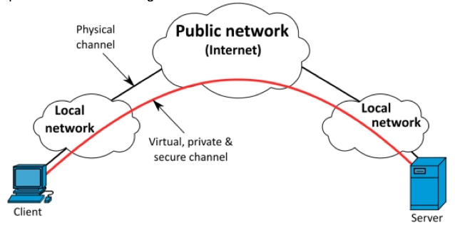
    <figcaption style="text-align: center;">Elementos principales de una VPN</figcaption>
</figure>

- Para completar la clasificación de las redes se recomienda la lectura del profesor Marcos Ruiz: [Clasificación de las redes](https://marcosruiz.github.io/posts/clasificacion-de-redes/)

---

## 📊 Topologías

La **topología de red** es la distribución espacial de los elementos conectados.

### Topologías cableadas

Inicialmente, las topologías cableadas realizadas eran en forma de bus, actualmente en desuso, por presentar altas interferencias entre nodos. 

> Los principales tipos son:

<figure style="align: center;">
    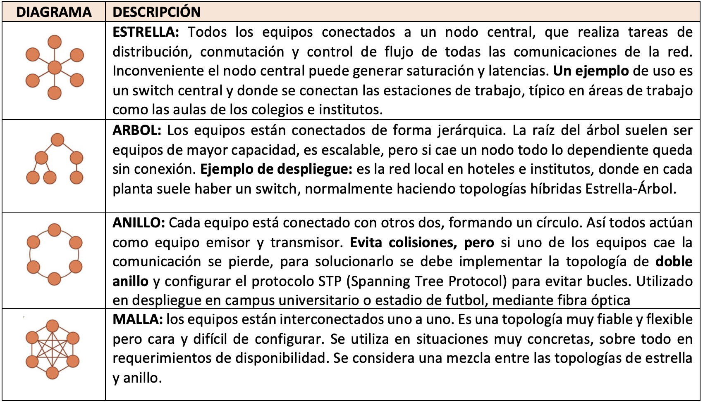
    <figcaption style="text-align: center;">Principales topologías cableadas</figcaption>
</figure>

### Topologías inalámbricas

Son las topologías que están unidas mediante medios de transmisión inalámbricos. Entre estas tecnologías destacan los despliegues realizados de puntos de acceso WIFI. 

> En la siguiente tabla se observa su clasificación:

<figure style="align: center;">
    
    <figcaption style="text-align: center;">Principales topologías inalámbricas</figcaption>
</figure>

- Además, se recomienda la lectura de la parte final de [Clasificación de las redes](https://marcosruiz.github.io/posts/clasificacion-de-redes/)

---

## 📡 Transmisión y perturbaciones

* **Transmisión**: es el proceso de enviar datos de un punto a otro a través de un medio (cable, fibra, ondas de radio, etc.).  
* **Perturbación**: son los problemas o interferencias que pueden afectar a la señal durante su viaje y hacer que llegue distorsionada o con errores.

En este bloque vamos a profundizar en **cómo se transmiten los datos en una red**, qué tipos de transmisión existen, qué técnicas se utilizan y qué problemas pueden aparecer durante la comunicación.

---

### 🔄 Tipos de transmisión

Los **tipos de transmisión** se clasifican en función de distintos criterios: la naturaleza de la señal, el número de señales transmitidas y la dirección de la comunicación.

#### Según la naturaleza de la señal

1. **Transmisión analógica**  
  - Señal continua en el tiempo.  
  - Se caracteriza por su **amplitud**, **frecuencia** y **fase**.  
  - **Ejemplo**: voz en una línea telefónica.  
  - Inconveniente: más sensible al ruido.

> *Onda continua.*

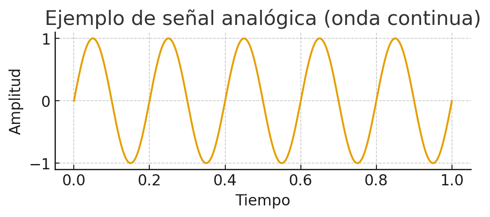  

2. **Transmisión digital**  
  - Señal discreta (0 y 1).  
  - Más robusta frente a interferencias.  
  - **Ejemplo**: datos en Ethernet o WiFi.  
  - Inconveniente: necesita convertir la señal analógica a digital.

> *Onda cuadrada binaria.*

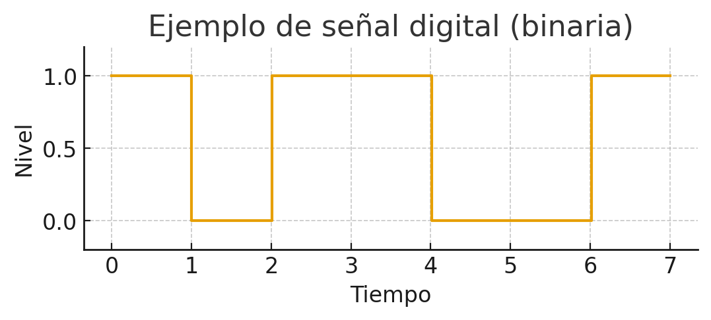  

#### Según el número de señales simultáneas

1. **Serie**  
  - Los bits viajan **uno detrás de otro** por una única línea.  
  - Adecuado para **largas distancias** y simplifica el cableado.  
  - **Ejemplo**: comunicaciones por puerto serial, USB, enlaces Ethernet (a nivel lógico).

> *Transmisión en serie: los bits viajan uno tras otro.*

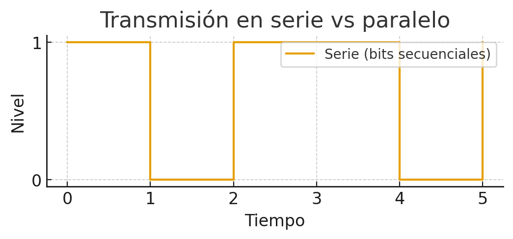        

2. **Paralelo**  
  - Varios bits se transmiten **al mismo tiempo** por diferentes conductores.  
  - Adecuado para **cortas distancias** debido a problemas de sincronización y diafonía.  
  - **Ejemplo**: antiguos buses de impresora, conexiones internas de PC.

> *Transmisión en paralelo: varios bits viajan al mismo tiempo.*  

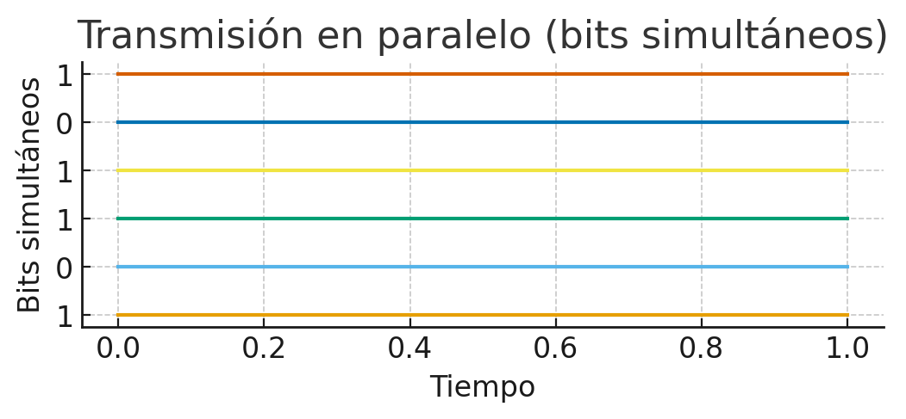  

#### Según la dirección de transmisión

1. **Símplex**  
  - Comunicación en **un solo sentido**: emisor → receptor.  
  - **Ejemplo**: emisión de TV por antena.

2. **Half-Dúplex**  
  - Ambos extremos pueden transmitir, **pero no simultáneamente**.  
  - **Ejemplo**: walkie-talkies; redes que usan un solo canal compartido.

3. **Full-Dúplex**  
  - Transmisión **simultánea** en ambos sentidos.  
  - **Ejemplo**: llamadas por teléfono, enlaces Ethernet modernos.

> *Modos de transmisión: símplex, half-dúplex y full-dúplex.*

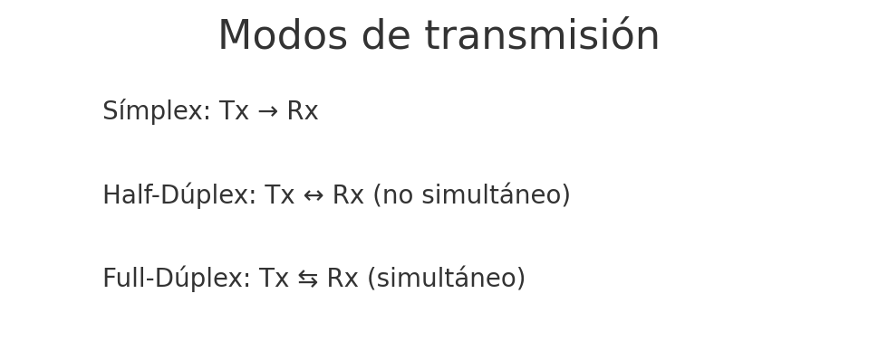  

---

### 🔧 Técnicas de transmisión

Las técnicas de transmisión permiten adaptar los datos al medio físico. Podemos distinguir dos grandes grupos: **digital** y **analógica**.

#### Transmisión digital

Se basa en **codificación de línea** (cómo se representan los 0 y 1 en la forma de la señal).

1. **NRZ (No Return to Zero)**  
  - Representa 1 por un nivel alto y 0 por un nivel bajo, sin retorno al cero entre bits.  
  - Problema: largas secuencias de 0 o de 1 dificultan la sincronización.

> *Codificación NRZ.*

  

2. **Manchester**  
  - Cada bit tiene una transición en la mitad del periodo: garantiza sincronización.  
  - Consume más ancho de banda, pero facilita la detección de bordes.

> *Codificación Manchester.*

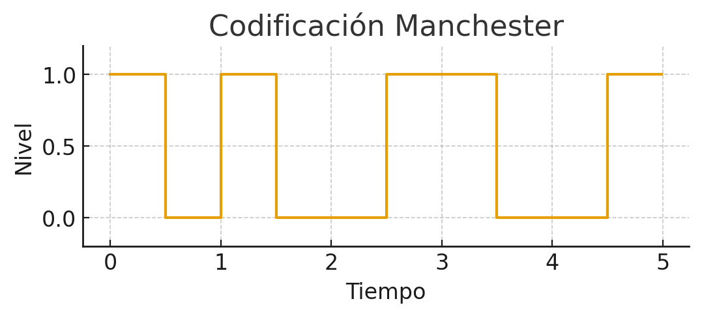  

### Transmisión analógica

Se usa una **onda portadora** (sinusoidal) y se modifica alguna de sus propiedades para transmitir la información.

1. **AM / ASK (Amplitud)** — la amplitud de la portadora varía según la señal. 

> *Modulación en amplitud.*

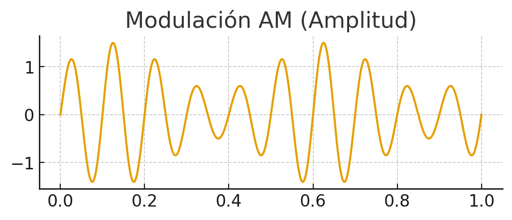  

2. **FM / FSK (Frecuencia)** — la frecuencia de la portadora cambia para representar datos.  

> *Modulación en frecuencia.*

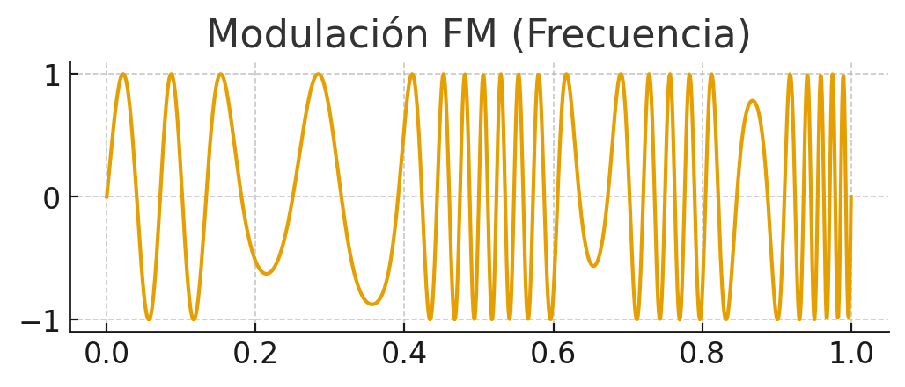  

3. **PM / PSK (Fase)** — se modula la fase de la portadora (muy usada en sistemas digitales sobre portadora analógica).

> *Modulación en fase.*

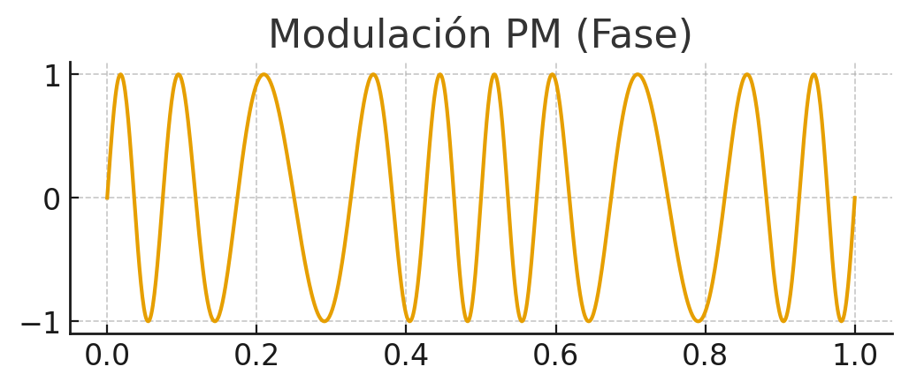  

---

## ⚠️ Perturbaciones en la transmisión

El medio de transmisión **no es perfecto**. La señal puede degradarse y llegar al receptor con errores. Los principales problemas son:

#### Atenuación
- Pérdida de energía de la señal conforme avanza por el medio.  
- Causas: resistencia eléctrica, dispersión en fibras, pérdidas por conectorización mal hecha.  
- Soluciones: **repetidores**, **amplificadores**, uso de medios con menor pérdida (fibra óptica).

#### Distorsión
- La señal se deforma porque diferentes componentes de frecuencia viajan a distintas velocidades (dispersión).  
- Impacto: borrado de los pulsos o superposición entre símbolos (ISI — inter-symbol interference).  
- Soluciones: **ecualización**, uso de codificaciones y filtros adecuados.

#### Ruido
Interferencia aleatoria que se suma a la señal original y puede provocar errores. Tipos frecuentes:

  1. **Ruido térmico**: debido a la agitación térmica de los electrones dentro del conductor. Se distribuye uniformemente por todo el espectro de frecuencias, se le conoce como ruido blanco y no puede eliminarse.  
  2. **Intermodulación**: señales no deseadas con la misma frecuencia que la original compartiendo el mismo medio, provocan una suma o diferencia en esa frecuencia contaminando la señal original.
  3. **Diafonía**: los conductores o líneas de transmisión próximos producen una acoplamiento entre los mismos debido al campo electromagnético que generan. 
  4. **Ruido impulsivo**: ruido no continuo que consiste en pulsos irregulares poca duración (varios segundos), causado por perturbaciones electromagnéticas externas. como picos breves de tensión producidos por motores, relés o descargas atmosféricas.  

> **Soluciones**: apantallamiento, pares trenzados, filtrado, corrección de errores (FEC), aislamiento y buenas prácticas de instalación.

!!! example "**Ejemplo práctico:**" 
    cables de red sin buena separación pueden sufrir diafonía si se colocan paralelos a cables eléctricos; la solución pasa por canalizaciones, separación y/o usar cable apantallado (FTP/STP).

<!--   
*Un **Ejemplo** es cuando acercamos el móvil a altavoces y se oyen ruidos.* -->

---

## 📋 Resumen visual

| Criterio      | Tipos                      | **Ejemplo**                       |
|---------------|----------------------------|-------------------------------|
| Naturaleza    | Analógica / Digital        | Radio FM / Ethernet           |
| Nº señales    | Serie / Paralelo           | USB / Bus impresora           |
| Dirección     | Símplex / Half / Full      | TV / Walkie / Móvil           |
| Digital       | NRZ, Manchester, Dif. Man. | Ethernet                      |
| Analógica     | AM, FM, PM                 | Radio, Módems, WiFi           |
| Perturbación  | Atenuación, Distorsión, Ruido | Pérdidas / Interferencias |

---

## 🛠️ Actividades

!!! tip "Formato de entrega"
    Para la entrega de las actividades, Genera un documento con la práctica descrita a continuación. Deberás crear un archivo PDF con el siguiente formato de nombre: PRXXX.pdf o ACXXX.pdf, donde las X representan el número de la actividad. Una vez finalizada la práctica, sube el archivo a Aules (antes de la fecha de vencimiento) para su calificación.

* :simple-neutralinojs: **PR101**. (RA.7 // CE7a, CE7c, y CE7e // 1-10p). Como futuros técnicos en *Sistemas Microinformáticos y Redes*, el alumnado debe aprender a planificar y documentar redes locales. En esta actividad, debéis diseñar el esquema físico y lógico de una empresa ficticia usando **Excalidraw**, trabajando en equipo para elegir la topología, los dispositivos y los medios adecuados. El objetivo es simular un caso real, fomentando la colaboración y la justificación técnica de cada decisión. Realizar en grupos un documento de presentación y exponerlo en clase. A continuación, se detallan las premisas de la práctica:

> 🏢**Escenario**

  - Empresa ficticia **TechSolutions** con:
    - 3 departamentos: Administración, Ventas y Soporte.
    - Cada uno con 5 PCs y 1 impresora.
    - 1 servidor central.
    - Conexión a Internet mediante router.

> 🧑‍🤝‍🧑**Tareas del grupo**

  1. Elegir una topología adecuada (estrella, árbol, híbrida).
  2. Diseñar el esquema de red en [Excalidraw](https://excalidraw.com/):
     - Añadir iconos de PCs, switches, router, servidor, impresoras.
     - Conectar con flechas y etiquetar enlaces (UTP, fibra, Wi-Fi).
  3. Justificar en el diagrama:
     - ¿Por qué esa topología? Ventajas y desventajas.
     - ¿Por qué esos medios? Ventajas y desventajas.
     - ¿Por qué esos componentes? Ventajas y desventajas.
  5. Exposición breve (5 min).

> 🧰 **Herramientas**

  - [Excalidraw](https://excalidraw.com/)
  - Aules

> **📋Criterios de evaluación**

Cada grupo evaluará el trabajo de otro equipo. Puntúa cada criterio según la escala indicada. **Total: 30 puntos**.

| **Criterio**                        | **Descripción**                                                      | **Puntos** |
|-------------------------------------|----------------------------------------------------------------------|-----------|
| **Claridad del diagrama**          | El esquema es legible, bien organizado y fácil de interpretar.       | 0-6       |
| **Identificación de dispositivos** | Incluye todos los elementos necesarios (PCs, switches, router, etc.)| 0-6       |
| **Representación de conexiones**   | Las conexiones están correctamente etiquetadas (UTP, fibra, Wi-Fi). | 0-4       |
| **Topología adecuada**             | La topología elegida es coherente con el escenario planteado.       | 0-4       |
| **Justificación técnica**          | Explica por qué se eligieron la topología y los medios.             | 0-6       |
| **Creatividad y presentación**     | Uso de iconos, colores y organización visual atractiva.             | 0-4       |

**Total:** /30 puntos

> **🧮Rúbrica de coevaluación**

| **Criterio**                        | **Descripción**                                                      | **Rango de puntos** | **Nivel bajo** (0-2) | **Nivel medio** (3-4) | **Nivel alto** (5-6 / 3-4) |
|-------------------------------------|----------------------------------------------------------------------|---------------------|----------------------|------------------------|-----------------------------|
| **Claridad del diagrama**          | El esquema es legible, bien organizado y fácil de interpretar.       | 0–6                | Confuso o ilegible.   Mala organización. | Aceptable pero mejorable.   Se entiende con esfuerzo. | Muy claro, bien estructurado y fácil de seguir. |
| **Identificación de dispositivos** | Incluye todos los elementos necesarios (PCs, switches, router, etc.)| 0–6                | Faltan varios dispositivos clave. | La mayoría están presentes, pero hay omisiones. | Todos los dispositivos necesarios están correctamente representados. |
| **Representación de conexiones**   | Las conexiones están correctamente etiquetadas (UTP, fibra, Wi-Fi). | 0–4                | Conexiones ausentes o mal representadas. | Algunas conexiones correctas, pero con errores o sin etiquetas. | Todas las conexiones están correctamente representadas y etiquetadas. |
| **Topología adecuada**             | La topología elegida es coherente con el escenario planteado.       | 0–4                | No definida o incoherente. | Tiene errores o no se ajusta bien al escenario. | Coherente y adecuada al planteamiento. |
| **Justificación técnica**          | Explica por qué se eligieron la topología y los medios.             | 0–6                | Sin justificación o incorrecta. | Justificación aceptable pero incompleta. | Justificación clara, coherente y bien argumentada. |
| **Creatividad y presentación**     | Uso de iconos, colores y organización visual atractiva.             | 0–4                | Presentación pobre o sin elementos visuales. | Básica, con poco esfuerzo visual. | Cuidada, con elementos visuales que mejoran la comprensión. |

Puedes apoyarte en esta guía: [GUÍA EXCALIDRAW](guia_excalidraw.md)

* :simple-readdotcv: **AC102**. (RA.1 // CE1a, CE1c y CE1d // 1-3p). Identifica y documenta ejemplos reales de transmisión de datos y perturbaciones en redes locales, aplicando los conceptos vistos en clase.

>  **📝 Instrucciones**

1. **Busca ejemplos reales** de los siguientes conceptos:

   - Tipos de transmisión: analógica, digital, serie, paralelo, simplex, half-dúplex, full-dúplex.
   - Técnicas de transmisión: NRZ, Manchester, AM, FM, PM.
   - Perturbaciones: atenuación, distorsión, ruido térmico, intermodulación, diafonía, ruido impulsivo.

2. **Para cada ejemplo**, indica:

   - **Dónde se encuentra** (entorno doméstico, empresa, centro educativo, etc.).
   - **Qué tipo de transmisión o perturbación representa.**
   - **Cómo afecta al funcionamiento de la red.**
   - **Qué solución se aplica o podría aplicarse.**

3. **Presenta tus resultados** en un documento con los siguientes elementos:

   - Tabla resumen con los ejemplos encontrados.
   - Imágenes o esquemas si es posible.

---

  

* :simple-cisco: **PR103**. (RA.7 // CE7a, CE7c, y CE7e // 1-10p).  
Como futuros técnicos en *Sistemas Microinformáticos y Redes*, el alumnado debe aprender a **planificar y simular redes locales**.  
En esta actividad individual, deberás diseñar y configurar el esquema físico y lógico de una empresa ficticia usando **Cisco Packet Tracer**, aplicando los conceptos de componentes, topologías y medios de transmisión.  

> 🏢 **Escenario** 

- Empresa ficticia **NetSolutions** con:  
  - 3 departamentos: Administración, Ventas y Soporte.  
  - Cada uno con **5 PCs y 1 impresora**.  
  - 1 servidor central conectado a toda la red.  
  - Conexión a Internet mediante un router.  

> 🛠️ **Tareas**

1. Elegir una **topología adecuada** (estrella, árbol, híbrida) y justificarla.  
2. Diseñar la **red en Packet Tracer**:  
   - Añadir PCs, switches, router, servidor e impresoras.  .  
   - Conectar con cables adecuados (UTP, fibra, etc.) y configurar la conectividad.  
3. Justificar en el documento:  
   - La elección de la topología.  
   - Los medios de transmisión utilizados.  
   - Los dispositivos seleccionados.  

> 🧰 **Herramientas**

- [Cisco Packet Tracer](packetracer.md)
- Aules  

---

  

* :simple-cisco: **PR104**. RA.1 // CE1a, CE1d, CE1f // 1–10p**

En esta práctica individual, el alumnado debe **simular una red local** en Cisco Packet Tracer que incluya distintos **medios de transmisión** (UTP, fibra, Wi-Fi) y **analizar cómo afectan las perturbaciones** (atenuación, ruido, interferencias) al rendimiento de la red. Se busca aplicar los conceptos teóricos de transmisión de datos en un entorno práctico.

---

> 🏢 **Escenario**
Empresa ficticia **DataLink S.L.** con:

- 2 plantas: Planta Baja (Administración) y Planta Alta (Desarrollo).
- Cada planta con **4 PCs y 1 impresora**.
- 1 servidor central en la sala de servidores (Planta Baja).
- Conexión a Internet mediante router.
- Conexión entre plantas mediante **fibra óptica**.
- Conexión Wi-Fi para dispositivos móviles en ambas plantas.

> 🛠️ **Tareas**

1. **Diseñar la red en Packet Tracer**:
   - Añadir PCs, impresoras, switches, router, servidor y puntos de acceso Wi-Fi.
   - Conectar con **medios adecuados**: UTP para PCs, fibra entre switches, Wi-Fi para móviles.
2. **Simular tráfico de red** entre dispositivos usando herramientas de diagnóstico (ping, simulación de paquetes).
3. **Introducir perturbaciones**:
   - Simular pérdida de conectividad por interferencias Wi-Fi.
   - Simular degradación por uso de cable UTP largo sin repetidor.
4. **Documentar**:
   - Justificación de los medios de transmisión elegidos.
   - Identificación de las perturbaciones simuladas.
   - Propuesta de soluciones técnicas (uso de repetidores, cambio de canal Wi-Fi, etc.).

---

> 🧰 **Herramientas**

- [Cisco Packet Tracer](packetracer.md)