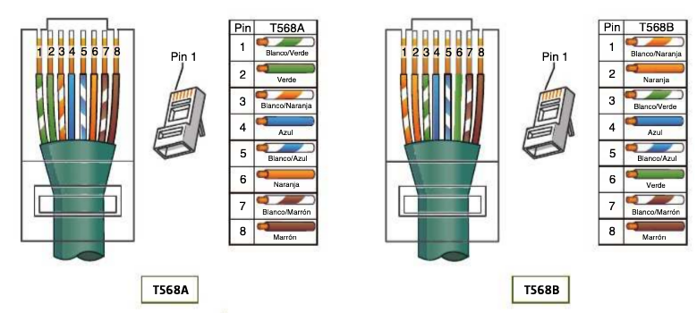
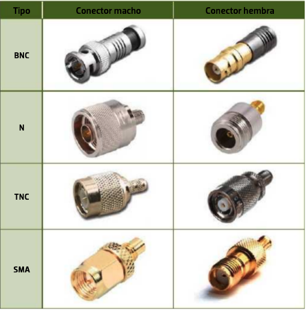
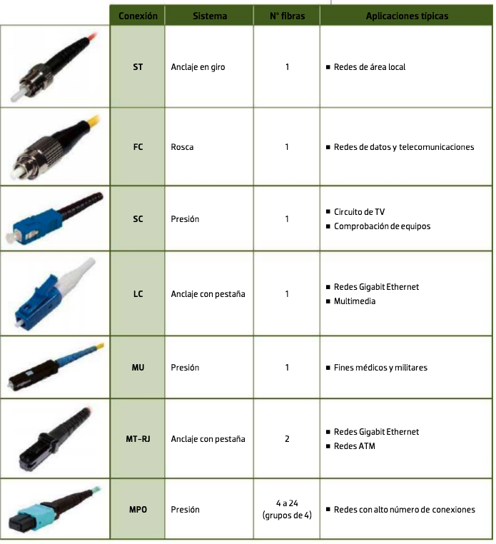
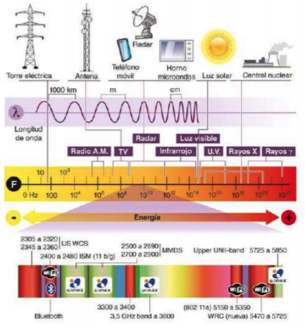

# Tema 2. Medios de transmisión y capa física

En este tema bajamos a la **capa física**: qué medio usamos, qué categoría de cable, cómo se termina un RJ‑45 y cuándo conviene cobre, fibra o radio.

!!! tip "Primera clase"
    Empieza por el [cuestionario inicial](#cuestionario-inicial). No hace falta estudiar el tema completo antes: el cuestionario sirve para ver qué sabes al empezar.

## Propuesta didáctica

Trabajamos los **RA2** y **RA3** del módulo Redes de área local (0225):

> **RA2.** *Despliega el cableado de una red local interpretando especificaciones y aplicando técnicas de montaje.*

> **RA3.** *Interconecta equipos en redes locales cableadas describiendo estándares de cableado y aplicando técnicas de montaje de conectores.*

### Criterios de evaluación (selección)

**RA2**

* **CE2a**: Se han reconocido los principios funcionales de las redes locales.
* **CE2b**: Se han identificado los distintos tipos de redes.
* **CE2c**: Se han diferenciado los medios de transmisión.
* **CE2d**: Se han reconocido los detalles del cableado de la instalación y su despliegue (categoría del cableado, espacios por los que discurre, soporte para las canalizaciones, entre otros).
* **CE2h**: Se han probado las líneas de comunicación entre las tomas de usuario y paneles de parcheo.
* **CE2j**: Se ha trabajado con la calidad y seguridad requeridas.

**RA3**

* **CE3c**: Se han montado conectores sobre cables (cobre y fibra) de red.
* **CE3f**: Se ha verificado la conectividad de la instalación.
* **CE3g**: Se ha trabajado con la calidad requerida.

### Contenidos

* Medios guiados: par trenzado (categorías y blindaje), coaxial y fibra óptica.
* Conectores RJ‑45; terminaciones **T568A** / **T568B**; cable directo y cruzado.
* Medios no guiados: espectro básico y Wi‑Fi (IEEE 802.11).
* Overview de crimpado de latiguillo y prueba de continuidad.

### Programación de aula (orientativa, ~14–16 h)

| Sesiones | Contenidos | Actividades |
| --- | --- | --- |
| 1 | Presentación + cuestionario inicial | Cuestionario |
| 2–3 | Par trenzado: categorías, blindaje, RJ‑45 | **AC201** |
| 4 | Coaxial | AC202 |
| 5–6 | Fibra óptica (tipos, conectores) | AC203 |
| 7–8 | Medios no guiados y Wi‑Fi 802.11 | AC204 |
| 9–11 | Crimpado T568A/B + comprobador + etiquetado | **PR201** |
| 12–14 | Packet Tracer: capa física | **PR202** |
| 15–16 | Repaso / ampliación si hace falta | — |

---

## Cuestionario inicial

!!! question "Antes de empezar — responde con lo que sepas"
    1. ¿Qué categorías de cable de par trenzado conoces y para qué se usan?
    2. ¿Cuándo conviene fibra óptica frente a cobre?
    3. ¿Qué diferencia hay entre medios guiados y no guiados?
    4. ¿Qué es el espectro electromagnético y por qué importa en redes?
    5. ¿Qué estándares IEEE 802.11 conoces (Wi‑Fi)?
    6. ¿Qué conectores se usan con par trenzado en Ethernet?
    7. ¿En qué se diferencian las terminaciones T568A y T568B?
    8. ¿Qué es un cable directo y un cable cruzado?

!!! warning "Soluciones"
    Las soluciones se trabajan en clase o se publican en Aules cuando proceda.

---

## Medios de transmisión

La información viaja como señal eléctrica, óptica o radiofrecuencia. El **medio** es el enlace entre emisor y receptor: de su naturaleza dependen alcance, velocidad, coste y vulnerabilidades.

### Medios guiados y no guiados

| Tipo | Idea | Ejemplos en LAN |
| --- | --- | --- |
| **Guiados** | La señal va por un conductor físico | UTP/FTP, coaxial, fibra |
| **No guiados** | Propagación por el aire (u otro medio sin cable) | Wi‑Fi, radioenlaces |

---

## Par trenzado

El cable de par trenzado lleva **ocho hilos** agrupados en **cuatro pares**, con cubierta exterior (habitualmente PVC). El trenzado reduce interferencias. Colores de pares (norma habitual):

- Par 1: azul / blanco‑azul  
- Par 2: naranja / blanco‑naranja  
- Par 3: verde / blanco‑verde  
- Par 4: marrón / blanco‑marrón  

### Categorías (visión práctica)

| Categoría | Ancho de banda (aprox.) | Uso típico |
| --- | --- | --- |
| Cat. 5e | 100 MHz | Hasta 1 Gbps (instalaciones básicas) |
| Cat. 6 | 250 MHz | 1 Gbps a 100 m; 10 Gbps a distancias cortas |
| Cat. 6a | 500 MHz | 10 Gbps a 100 m |
| Cat. 8 | 2000 MHz | 25/40 Gbps a distancias cortas (centros de datos) |

Las Cat. 3–5 están obsoletas en instalaciones nuevas. En muchos centros educativos y oficinas se trabaja con **Cat. 6** o **6a**.

### Blindaje (nombres habituales)

| Tipo | Idea | Cuándo |
| --- | --- | --- |
| **U/UTP** | Sin pantalla | Oficinas / aulas con poca EMI |
| **F/UTP** (FTP) | Pantalla global de foil | Interferencias moderadas |
| **S/FTP** | Pantalla + pares apantallados | Entornos hostiles |

!!! note "Nomenclatura"
    Verás UTP, FTP, STP… Lo importante es saber si hay **pantalla** y si hay que cuidar la **puesta a tierra** del blindaje.

### Conector RJ‑45

En Ethernet sobre cobre usamos el conector **RJ‑45** (**8P8C**: ocho posiciones, ocho contactos). Puede ser no apantallado o apantallado (carcasa metálica) según el cable.

<figure markdown="span">
  { width="500" }
  <figcaption>Conector RJ‑45 para Ethernet</figcaption>
</figure>

### Terminaciones T568A y T568B

La norma **TIA/EIA‑568** define dos ordenaciones de colores en el conector:

<figure markdown="span">
  { width="700" }
  <figcaption>Terminaciones T568A y T568B en RJ‑45</figcaption>
</figure>

Orden de pines (vista del conector con la pestaña abajo, contactos hacia ti):

| Pin | T568A | T568B |
| --- | --- | --- |
| 1 | Blanco/verde | Blanco/naranja |
| 2 | Verde | Naranja |
| 3 | Blanco/naranja | Blanco/verde |
| 4 | Azul | Azul |
| 5 | Blanco/azul | Blanco/azul |
| 6 | Naranja | Verde |
| 7 | Blanco/marrón | Blanco/marrón |
| 8 | Marrón | Marrón |

!!! tip "Truco"
    Entre T568A y T568B solo se intercambian los pares **naranja** y **verde**. El azul y el marrón no cambian.

!!! important "Qué usar en la práctica"
    En muchas instalaciones reales se usa **T568B** de extremo a extremo (coherencia). Lo crítico: **misma norma en ambos extremos** del tramo horizontal (salvo cable cruzado a propósito).

### Cable directo y cruzado

- **Directo**: misma terminación en ambos extremos (T568B–T568B o T568A–T568A). Es el habitual (PC ↔ switch, TO ↔ panel…).
- **Cruzado**: T568A en un extremo y T568B en el otro. Históricamente unía equipos “iguales” (PC–PC, switch–switch). Hoy muchos puertos son **Auto‑MDIX** y aceptan directo.

<figure markdown="span">
  { width="640" }
  <figcaption>Cable directo: misma terminación en ambos extremos</figcaption>
</figure>

<figure markdown="span">
  { width="640" }
  <figcaption>Cable cruzado: terminaciones distintas (T568A + T568B)</figcaption>
</figure>

---

## Cable coaxial

El **coaxial** tiene conductor central, dieléctrico, malla/pantalla y cubierta. Resiste bien EMI y atenúa menos que el UTP en ciertos escenarios, pero en LAN modernas (Ethernet) está en desuso (topología de bus). Sigue vivo en TV / HFC / radiofrecuencia.

<figure markdown="span">
  { width="700" }
  <figcaption>Conectores coaxiales habituales (BNC, N, TNC, SMA…)</figcaption>
</figure>

**Conectores RF** (macho/hembra): anclaje, rosca o presión. En Ethernet antiguo (10BASE2) se usaba **BNC** y **terminadores** en los extremos del bus.

Tipos que aún verás citados:

| Tipo | Uso típico |
| --- | --- |
| RG‑58 | Ethernet antiguo 10BASE2 (obsoleto en LAN) |
| RG‑59 / RG‑6 | TV / vídeo / HFC |
| RG‑8 | Ethernet grueso histórico (10BASE5) |

---

## Fibra óptica

La **fibra** transporta luz por un núcleo de vidrio o plástico. Ventajas: gran ancho de banda, poca atenuación a larga distancia, inmunidad a EMI y más difícil de interceptar. Coste e instalación más exigentes.

<figure markdown="span">
  { width="600" }
  <figcaption>Estructura típica de un cable de fibra óptica</figcaption>
</figure>

### Multimodo (MM) y monomodo (SM)

| Tipo | Núcleo (orden) | Emisor típico | Uso |
| --- | --- | --- | --- |
| **Multimodo** | ~50–62,5 μm | LED / láser VCSEL | Campus, edificios, cortas–medias distancias |
| **Monomodo** | ~9 μm | Láser | Largas distancias, backbone, operadores |

Clases habituales: **OM1–OM4** (multimodo) y **OS1/OS2** (monomodo). Elegimos según velocidad y metros a cubrir.

| Velocidad (orientativa) | Distancia corta | Distancia media | Larga |
| --- | --- | --- | --- |
| 1 Gbps | OM1 / OM2 | OM3 / OM4 | OS1/OS2 |
| 10 Gbps | OM3 / OM4 | OS1/OS2 | OS1/OS2 |

Estructuras de cable: **loose-tube** (exteriores / tendidos largos, a menudo con gel) y **tight-buffered** (interiores, más fácil de conectar).

### Conectores

ST, SC, LC, MPO… En racks modernos es muy frecuente **LC**.

<figure markdown="span">
  { width="700" }
  <figcaption>Conectores de fibra óptica habituales en redes</figcaption>
</figure>

### Escala global (contexto)

La fibra submarina es la columna vertebral de Internet. Explora el mapa interactivo si te interesa el contexto:

<figure markdown="span">
  { width="800" }
  <figcaption>Red mundial de cables submarinos de fibra óptica</figcaption>
</figure>

[Submarine Cable Map](https://www.submarinecablemap.com)

---

## Medios no guiados y Wi‑Fi básico

Sin cable, la señal se propaga como onda electromagnética. El **espectro** se reparte en bandas (radio, microondas, IR…) para que servicios distintos no se pisen.

<figure markdown="span">
  { width="800" }
  <figcaption>Espectro electromagnético y bandas de interés en comunicaciones</figcaption>
</figure>

Ideas útiles a nivel SMR:

- **ISM 2,4 GHz / 5 GHz (y 6 GHz)**: Wi‑Fi, Bluetooth…
- En España, la atribución oficial se recoge en el **CNAF**.
- Estándares IEEE: **802.11** (WLAN), **802.15** (WPAN: Bluetooth, ZigBee…), etc.

### IEEE 802.11 (resumen)

| Generación | Estándar | Bandas | Idea |
| --- | --- | --- | --- |
| Wi‑Fi 4 | 802.11n | 2,4 / 5 GHz | MIMO; hasta cientos de Mbps |
| Wi‑Fi 5 | 802.11ac | 5 GHz | MU‑MIMO; Gbps |
| Wi‑Fi 6 | 802.11ax | 2,4 / 5 / 6 GHz | Mejor eficiencia en densos |
| Wi‑Fi 7 | 802.11be | 2,4 / 5 / 6 GHz | Mayor capacidad (entornos exigentes) |

El montaje y la configuración de AP se profundiza en el **Tema 3** (y seguridad Wi‑Fi / VLAN en temas posteriores).

---

## Crimpado de latiguillo (overview)

**Materiales y herramientas habituales:** cable UTP de la categoría indicada, dos conectores RJ‑45, pelacables, crimpadora RJ‑45, cutter y comprobador de cable (tester).

En taller fabricamos un **latiguillo** UTP con dos RJ‑45:

1. Cortar a medida y pelar la cubierta (sin dañar los pares; deja ~2–3 cm de hilos).
2. Deshacer el trenzado lo mínimo necesario y ordenar colores según **T568B** (o la norma que indique el profesorado).
3. Cortar hilos a la misma longitud e insertarlos hasta el fondo del conector (el aislamiento de la cubierta debe entrar un poco en el conector).
4. **Crimpar** de un solo golpe con la herramienta adecuada; comprobar que los contactos han bajado.
5. Repetir en el otro extremo (**misma** terminación → cable directo).
6. **Probar** con comprobador de cable / continuidad (y, si hay, tester de cableado o certificación).

!!! tip "Calidad y seguridad"
    Gafas si el taller lo exige; no pellizcar el cable; no dejar hilos fuera del conector; etiquetar el latiguillo. Un crimpado malo falla en producción aunque “parezca” enchufado.

El detalle de paneles, TO y canalizaciones se desarrolla en el **Tema 3**.

---

## Actividades

!!! tip "Formato de entrega"
    Las entregas en **Aules** son **obligatorias en Markdown** (`.md`). No se aceptan PDF.  
    Nombre del archivo: `AC2XX.md` o `PR2XX.md` (sustituye XX por el número). Respeta la fecha de vencimiento.  
    Escribiremos los `.md` con **Visual Studio Code**.

    !!! note "Cómo empezar"
        - Guía de Markdown: [tutorialmarkdown.com/guia](https://tutorialmarkdown.com/guia)
        - Documentación de Visual Studio Code: [code.visualstudio.com/docs](https://code.visualstudio.com/docs)

### AC201 — Categorías UTP

* :simple-readdotcv: **AC201**. (RA2 // CE2c, CE2d // **AC 0–1**). Elabora una tabla comparativa de categorías de par trenzado (al menos 5e, 6, 6a y 8): ancho de banda, velocidades típicas, distancia y usos. Indica cuál elegirías para un aula y por qué.

### AC202 — Coaxial

* :simple-readdotcv: **AC202**. (RA2 // CE2c // **AC 0–1**). Resume estructura del coaxial, tipos/aplicaciones (RG‑58, RG‑6…), conectores (BNC, etc.) y ventajas/desventajas frente a UTP en LAN actuales.

### AC203 — Fibra óptica

* :simple-readdotcv: **AC203**. (RA2 // CE2c // **AC 0–1**). Explica principio de funcionamiento, MM vs SM, clases OM/OS, conectores habituales, ventajas/desventajas y precauciones de manipulación.

### AC204 — Medios no guiados / Wi‑Fi

* :simple-readdotcv: **AC204**. (RA2 // CE2a, CE2b, CE2c // **AC 0–1**). Compara medios no guiados (radio, microondas, IR…) y resume estándares 802.11 (Wi‑Fi 4/5/6): bandas, idea de velocidad y un uso típico cada uno. Relaciónalo con tipos de red (WLAN / LAN mixta).

### PR201 — Crimpado UTP (T568A/B) + comprobador + etiquetado

| Campo | Valor |
| --- | --- |
| **Código** | **PR201** |
| **UP / tema** | T2 — Medios y capa física |
| **RA principal** | **RA3** (montaje de conectores y verificación). Apoyo: **RA2** (prueba de líneas), **RA6** (PRL/EPI) |
| **CE de cobertura** | CE3c, CE3f, CE3g · CE2h, CE2j · CE6b, CE6e |
| **Sesiones estimadas** | **2–3** |
| **Instrumento** | Checklist de taller + rúbrica 0–10 |

* :simple-neutralinojs: **PR201**. En taller, en pareja: fabricad un latiguillo **UTP directo** con terminación **T568B** en ambos extremos (el profesor puede pedir un extremo en **T568A** para contrastar el estándar). Probad con el **comprobador**, **etiquetad** el cable y documentad el proceso.

  **Enunciado (pasos):**

  1. Materiales: UTP de la categoría indicada, 2× RJ‑45, pelacables, crimpadora, cutter, comprobador, etiquetas.
  2. Pelar ~2–2,5 cm; ordenar pares según el esquema (T568B por defecto); cortar a la misma longitud; insertar hasta el tope (la funda entra en el conector).
  3. Crimpar de un solo golpe; repetir el otro extremo.
  4. Probar en el comprobador (continuidad / pares / polaridad). Si falla: abrir, identificar el error y rehacer.
  5. Etiquetar (código que indique el profesor, p. ej. `PR201-Gx-nn`).
  6. Entregar el **cable físico** + evidencias digitales.

  **Errores típicos a evitar / documentar si ocurren:** pares cruzados o invertidos; hilos fuera del conector; funda que no entra; crimpado doble o incompleto; no etiquetar; ignorar EPI (gafas si el taller lo exige).

  **Evidencia:** latiguillo OK al tester + foto de ambos extremos (colores visibles) + foto/captura del comprobador + checklist firmada + `PR201.md`.

  **Entrega:** `PR201.md` + evidencias según Aules.

| Criterio (rúbrica) | Descripción | Puntos |
| --- | --- | --- |
| Procedimiento | Pasos claros, ordenados y seguros | 0–2 |
| Terminación T568A/B | Colores correctos en ambos extremos | 0–2 |
| Prueba | Evidencia de continuidad / OK del tester | 0–2 |
| Calidad + etiquetado | Acabado, sin hilos fuera, etiqueta legible | 0–2 |
| Informe `.md` | Completo, con fotos y errores/correcciones | 0–2 |
| **Total** | | **/10** |

### PR202 — Packet Tracer: capa física

* :simple-cisco: **PR202**. (RA2 // CE2c, CE2d // RA3 // CE3f // **PR 0–10**). Simulación en Packet Tracer: identificar puertos/módulos, elegir el tipo de cable adecuado y verificar conectividad física. El guion completo se facilitará en clase / Aules.

---

## Referencias rápidas

- Sitio del módulo: [fjavier-hernandez.github.io/ral](https://fjavier-hernandez.github.io/ral/)
- Mapa de fibra submarina: [submarinecablemap.com](https://www.submarinecablemap.com)
- Simulación: [Cisco Packet Tracer](https://www.netacad.com/es/cisco-packet-tracer)
- Entregas: [Visual Studio Code](https://code.visualstudio.com/docs) + [Markdown](https://tutorialmarkdown.com/guia)
- Normas: [Normas del taller](../00-normas/normas_taller.md)

*[RA]: Resultado de aprendizaje  
*[CE]: Criterio de evaluación  
*[AC]: Actividad de clase  
*[PR]: Práctica  
*[UTP]: Unshielded Twisted Pair  
*[EMI]: Interferencia electromagnética  
*[LAN]: Local Area Network
