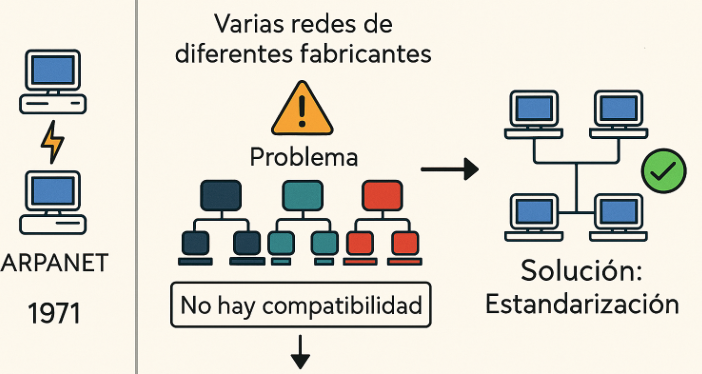
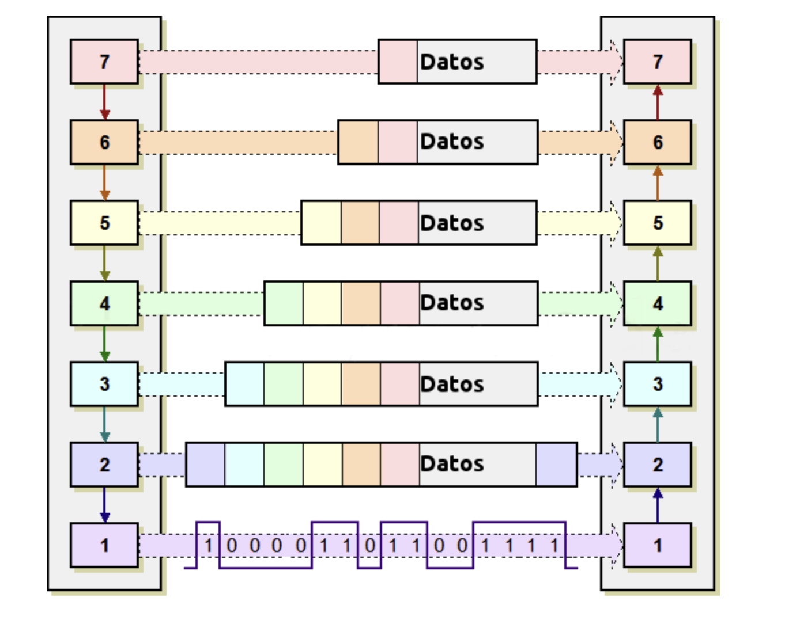
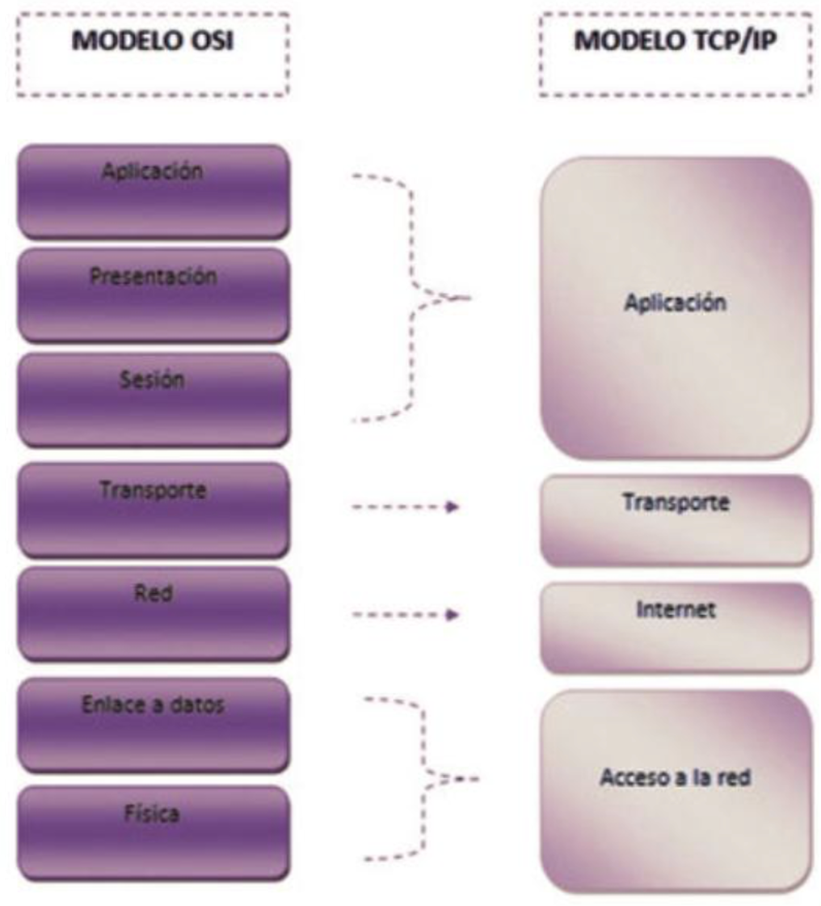
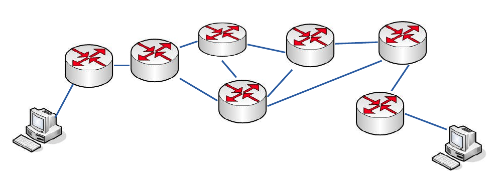
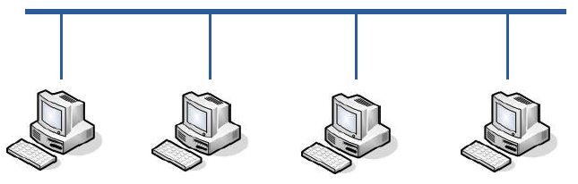
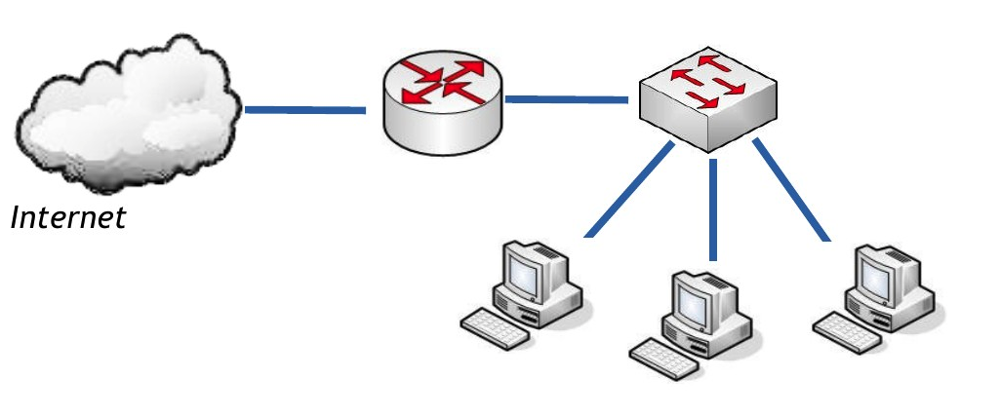
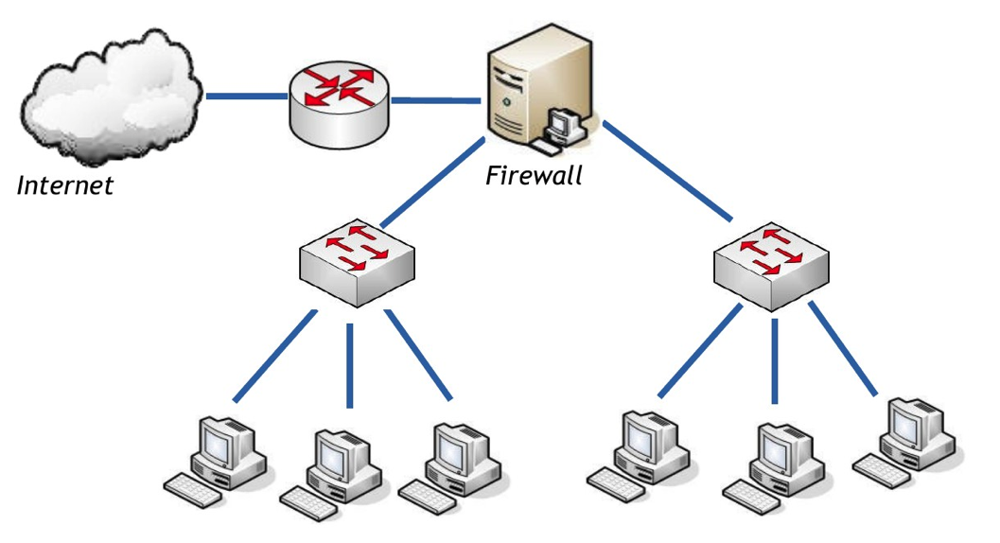
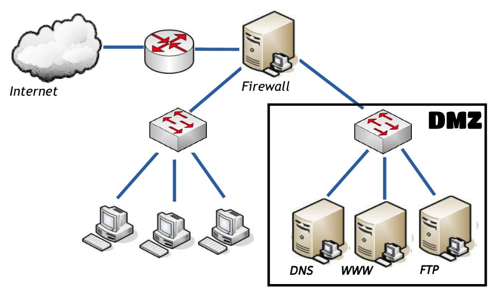

# 🌐 ARQUITECTURAS DE REDES

A finales del siglo XX, Internet revolucionó la forma de trabajar y comunicarnos en nuestro día a día. La base de Internet es la comunicación de ordenadores mediante la conexión de sistemas en red, y en concreto este tema estudia lo modelos y arquitecturas que garantizan la compatibilidad de conexión entre dichos sistemas, permitiendo de este modo el funcionamiento de Internet. 

## 📚 Propuesta didáctica

En esta unidad trabajamos el **RA1 de RAL**:

> **RA1.** *Reconoce la estructura de redes locales cableadas analizando las características de entornos de aplicación y describiendo la funcionalidad de sus componentes.*

###  🎯 Criterios de evaluación

#### Criterios de evaluación del RA1

* **CE1a**: Se han descrito los principios de funcionamiento de las redes locales.
* **CE1b**: Se han identificado los distintos tipos de redes.
* **CE1c**: Se han descrito los elementos de la red local y su función.
* **CE1d**: Se han identificado y clasificado los medios de transmisión.
* **CE1e**: Se ha reconocido el mapa físico de la red local.
* **CE1f**: Se han reconocido las distintas topologías de red.
* **CE1g**: Se han identificado estructuras alternativas.

### Contenidos

* Normalización en redes: estándares, organismos y tipos.
* Arquitecturas de comunicación: capas, protocolos, modelos OSI y TCP/IP.
* Componentes de red: dispositivos terminales e intermedios.
* Uso del medio: conmutación y difusión.
* Esquemas LAN: red simple, zonas, DMZ.

!!! question "Cuestionario inicial"
    1. ¿Qué es un modelo de red y para qué sirve?
    2. ¿Qué diferencias existen entre arquitectura y protocolo en redes?
    3. ¿Por qué es importante la normalización en las redes?
    4. ¿Qué organismos internacionales conoces relacionados con la estandarización de redes?
    5. ¿Qué ventajas aporta el uso de estándares abiertos frente a los propietarios?
    6. ¿Cuáles son las principales diferencias entre el modelo OSI y el modelo TCP/IP?
    7. ¿Qué función cumple cada capa en el modelo OSI?
    8. ¿Qué es una DMZ y para qué se utiliza en una red local?
    9. ¿Qué diferencias hay entre conmutación y difusión en el uso del medio?

## Programación de Aula (12h)

Esta unidad se imparte en la primera evaluación, con una duración estimada de 12 sesiones lectivas, durante la primera quincena de octubre:

| Sesión | Contenidos | Actividades | Criterios trabajados |
|--------|------------|-------------|----------------------|
| 1 | Normalización y estándares, Organismos internacionales | Cuestionario inicial, AC201 | CE1a, CE1b y CE1c |
2 | Arquitecturas de comunicación: modelos OSI y TCP/IP | Actividad AC202 | CE1a, CE1d, CE1f|

---

## 📏 Normalización

Las Redes de comunicaciones han pasado por diferentes fases, El comienzo fue en **1971** cuando se creó la primera red de ordenadores, conocida como **ARPANET**. En la década de los setenta aparecieron varias redes creadas por diferentes fabricantes. 

- **Problema**: no eran compatibles entre si. 
- **Solución:** Estandarizar las redes.

<figure style="align: center;">
    
    <figcaption style="text-align: center;">Esquema explicativo dela necesidad de estandarización</figcaption>
</figure>

### Modelos, arquitecturas y protocolos

Antes de adentrarnos en la estandarización de las redes, es fundamental comprender los conceptos de **modelos**, **arquitecturas** y **protocolos**, ya que constituyen la base sobre la que se construyen los estándares de comunicación.

- **Los Modelos** determinan la manera en la que se tiene que establecer y producir dicha comunicación. Destacan el **modelo OSI** (estándar de derecho, propuestos por organismos internacionales) y el **TCP/IP** (estándar de facto, propuesto por las grandes compañías).
- **La Arquitectura de una red** se define como el conjunto de niveles y protocolos utilizados para implementar las tareas de comunicación entre equipos informáticos. Esta organización debe ser lo suficientemente clara como para que los fabricantes de software y hardware puedan diseñar sus productos compatibles entre sí.
- **Los protocolos** pueden definirse como el conjunto de reglas que gobiernan el intercambio de datos entre dos entidades. La comunicación entre diferentes sistemas resulta demasiado compleja para ser gobernada por un único protocolo, por lo que se diseñaron un conjunto de protocolos llamados **pilas de protocolos**; el ejemplo más destacado es la pila de protocolos del modelo **TCP/IP**, donde destacan protocolos como **DNS, DHCP, TCP, IP, Ethernet**.

---

### Estándares y organismos de normalización

Un **estándar** es una regla técnica que se utiliza para que los dispositivos y sistemas informáticos puedan funcionar correctamente entre sí. **Por ejemplo**, gracias a los estándares, un ordenador puede conectarse a una red, enviar correos o navegar por Internet sin importar la marca o el modelo, el tipo de conector a emplear, las tensiones e intensidades empleadas, el formato de los datos a enviar, etc.

Para definir estos estándares existen los **organismos de normalización**, que son instituciones encargadas de crear y publicar estas reglas. Gracias a estos organismos, los fabricantes y desarrolladores pueden seguir las mismas normas, lo que facilita que los sistemas funcionen bien juntos y se puedan usar en cualquier parte del mundo.

<!-- <strong>Estándar</strong> -->

<!-- !!! abstract "<strong>Estándar</strong>"
    Un <strong>estándar</strong> es un conjunto de normas, acuerdos y recomendaciones técnicas que regulan la transmisión de los sistemas de comunicación. -->

<!-- !!! example "<strong>Ejemplo</strong>"
    <strong>Por ejemplo</strong> el tipo de conector a emplear, las tensiones e intensidades empleadas, el formato de los datos a enviar, etc. -->

---

#### 🌟 Ventajas de estandarizar

En resumen, El empleo de estos estándares presenta las siguientes ventajas:

- ✅ Los productos de diferentes fabricantes que cumplen los estándares son **totalmente compatibles y pueden comunicarse sin necesidad de adaptadores**.
- 📈 El **mercado se amplía**, favoreciendo precios más competitivos y mayor flexibilidad.
- 🔄 **Compatibilidad con productos futuros** empleando la misma tecnología.
- 💰 **Reducción de costes** de los productos.
- 🤝 Se evita que las empresas tengan arquitecturas cerradas, fomentando la **interoperabilidad**.

---

#### 🗂️ Clasificación de los estándares

La clasificación de los estándares puede hacerse desde **dos enfoques diferentes**:

### 📏 Según su origen

| Tipo de estándar | Descripción |
|------------------|-------------|
| **📌 De facto**   | Surgen por la **aceptación del mercado**. No son oficiales, pero se usan ampliamente. Normalmente los definen grupos de empresas u organizaciones. |
| **🏛️ De iure**    | Son estándares **oficiales**, definidos por **organismos de normalización reconocidos** como ISO, IEEE, etc. |

---

### 🔑 Según su propiedad

| Tipo de estándar | Descripción |
|------------------|-------------|
| **🔒 Cerrados (propietarios)** | Son propiedad de una **empresa o corporación**. Su acceso está **restringido**. Se usan para **fidelizar al cliente**. Si se popularizan, pueden convertirse en **de facto** o incluso en **de iure**. |
| **🔓 Abiertos** | Son accesibles para **cualquier persona u organización**. Incluyen tanto los **de facto** como los **de iure**. Algunos pueden tener **distribución restringida** (por ejemplo, cobrar por acceder al documento), pero normalmente **no exigen canon** por su uso. |

---

## 🏛️ Quién define los estándares abiertos

Existen **dos tipos de organizaciones**:

### 🤝 Consorcios de fabricantes
- Grupos de empresas que cooperan para asegurar la **interoperabilidad**.  
- Beneficios → aumentan el mercado y los clientes potenciales.  
- Empresas o personas interesadas pueden unirse y participar en la definición de normas.  
- Ejemplos: **ADSL Forum, ATM Forum, Zigbee Alliance, PLC Forum**.  

### 📜 Organismos oficiales
- Formados por consultores independientes, administraciones públicas y otros miembros.  
- Ejemplos: **ISO, IEEE, ANSI**.  

---

#### 🌍 Organismos reguladores en el ámbito internacional

- **ITU (International Telecommunication Union)**  
  La organización ITU (UIT en castellano, Unión Internacional de Telecomunicaciones) es la organización más importante de las Naciones Unidas en lo que concierne a las tecnologías de la información. Representa un foco global para gobiernos y sector privado en el desarrollo de redes y servicios. Coordina el uso del espectro radioeléctrico, promueve la cooperación internacional para la asignación de órbitas de satélites, mejora infraestructuras de comunicación, establece estándares mundiales para la interconexión de sistemas y afronta problemas como el cambio climático y la ciberseguridad.  

- **ISO (International Organization for Standardization)**  
  Agencia internacional sin ánimo de lucro con sede en Ginebra (Suiza), cuyo objetivo es el desarrollo de normalizaciones en un amplio abanico de materias. Ha definido multitud de estándares, desde el paso de los tornillos hasta arquitecturas de comunicaciones para la interconexión de sistemas abiertos (OSI).  
  Está formada por organismos de estandarización de diversos países (ANSI, DIN, AENOR, etc.) y organizaciones observadoras. Fundada en 1946, reúne a más de 100 países.

- **IEEE (Institute of Electrical and Electronic Engineers)**  
  Mayor asociación profesional para el avance de la innovación y la excelencia tecnológica. Fundada en 1884, desarrolla estándares para las industrias eléctricas y electrónicas. Destacan los trabajos del comité 802, que desarrolla estándares de protocolos de comunicaciones para la interfaz física de las conexiones de redes locales de datos.

- **IETF (Internet Engineering Task Force)**  
  Organización internacional abierta de normalización, creada en EE.UU. en 1986. Regula propuestas y estándares de Internet, conocidos como RFC (Request For Comments). Está compuesta por técnicos y profesionales en el área de redes y se organiza en grupos de trabajo sobre temas concretos.

#### 🇺🇸 Organismos reguladores en Estados Unidos

- **ANSI (American National Standards Institute)**  
  Organización sin ánimo de lucro encargada de supervisar el desarrollo de estándares aplicados en EE.UU.

- **TIA (Telecommunications Industry Association)**  
  Asociación formada por representantes de las industrias más importantes del sector de las telecomunicaciones. Ha desarrollado numerosos estándares a nivel internacional en colaboración con ANSI y la antigua EIA.

#### 🇪🇺 Organismos reguladores en Europa

- **ETSI (European Telecommunications Standards Institute)**  
  Organización independiente sin ánimo de lucro que produce estándares globales para tecnologías de la información y comunicación. Reconocida por la Unión Europea, cuenta con 766 organizaciones miembro de 63 países. Ha estandarizado el sistema de telefonía móvil GSM.  
  Cuerpos dependientes: **3GPP** (redes UMTS), **TISPAN** (redes fijas y convergencia con Internet). Fundada en 1988.

- **CEN (Comité Europeo de Normalización)**  
  Organización no lucrativa privada cuya misión es fomentar la economía europea y el bienestar de los ciudadanos proporcionando una infraestructura eficiente para el desarrollo y distribución de estándares coherentes. Fundada en 1961, sus 29 miembros nacionales desarrollan los estándares europeos (EN).

#### 🇪🇸 Organismos reguladores en España

- **AENOR (Asociación Española de Normalización)**  
  Organismo nacional de normalización encargado de la publicación de las normas UNE y la adopción de normas europeas. Relacionado con CEN, CENELEC y ETSI.

<figure style="align: center;">
    
    <figcaption style="text-align: center;">Logos de los principales organismos de normalización</figcaption>
</figure>

---

 
## :material-layers: Arquitecturas de comunicaciones

Cuando se diseña una red de ordenadores, es necesario resolver muchos problemas:

- ¿Hay que compartir un único medio de transmisión?  
- ¿Cómo distinguimos unos ordenadores de otros?  
- ¿Qué tipo de información se va a transmitir?  
- ¿Se manejará información confidencial?  

La arquitectura de una red viene definida por tres características fundamentales:

- **Topología**: Organización del cableado, define la configuración básica de la interconexión de estaciones y, en algunos casos, el camino de una transmisión de datos sobre el cable.
- **Método de acceso a la red**: En redes con medio compartido, es necesario acordar cómo enviar información para evitar colisiones. En redes sin medio compartido, el acceso es trivial.
- **Protocolos de comunicaciones**: Reglas y procedimientos utilizados para realizar la comunicación, incluyendo corrección de errores, establecimiento de comunicación, etc.

### Problemas comunes en el diseño de redes

- **Encaminamiento**: Elección de la mejor ruta entre origen y destino.
- **Direccionamiento**: Mecanismo para que un proceso especifique con quién quiere comunicarse.
- **Acceso al medio**: Control del orden de transmisión en medios compartidos para evitar colisiones.
- **Saturación del receptor**: Un emisor rápido puede saturar a un receptor lento; se soluciona con mecanismos de control de flujo.
- **Mantenimiento del orden**: Algunos protocolos deben reordenar mensajes que llegan desordenados.
- **Control de errores**: Detección y corrección de errores en la transmisión.
- **Multiplexación**: Compartición de un único medio de transmisión por varias comunicaciones independientes.

---

### :material-server: Niveles de las Arquitecturas.

Como se comentó al inicio del tema, las redes estaban originalmente ligadas al hardware de cada fabricante. Esto obligaba a desarrollar programas muy extensos y complejos para gestionar la comunicación entre equipos, dificultando la interoperabilidad y el mantenimiento.

La solución a esta problemática fue la **reducción de la complejidad** mediante un modelo basado en **niveles o capas**, organizados jerárquicamente y relacionados entre sí. Este enfoque permite una implementación más sencilla, modular y escalable.

#### 📐 Principios del modelo por capas

Este modelo se fundamenta en las siguientes premisas:

- 🔁 **Jerarquía funcional**: Cada nivel se construye sobre los servicios ofrecidos por el nivel inferior, incorporando la funcionalidad propia de su capa.
- 🤝 **Protocolos entre niveles homólogos** (*peer-to-peer protocols*): Permiten optimizar y gestionar cada capa de forma independiente.
- 🔄 **Independencia entre capas**: Un protocolo puede ser sustituido por otro en una misma capa, siempre que se mantengan los servicios ofrecidos.

### 🧱 Elementos clave del modelo

Además de los niveles, es importante conocer los siguientes conceptos:

- **Entidades de datos**: Conjunto de funciones bien definidas que ejecutan las tareas propias de cada nivel, es decir, sus servicios.
- **Interfaz SAP (Service Access Point)**: Puntos de acceso entre capas que permiten la provisión de servicios e intercambio de información. Actúan como interfaz de comunicación entre niveles.
- **Cabecera**: Información añadida por cada capa a los datos originales, que incluye parámetros necesarios para realizar sus funciones. Las cabeceras se agregan en el emisor y se eliminan en el receptor.

### 📦 Unidades de Datos de Protocolo (PDU)

PDU es la abreviatura de **Protocol Data Unit (unidad de datos del protocolo)**. Su función principal es establecer una comunicación de datos entre capas homologas. Esta forma de establecer conexiones recibe el nombre de comunicación par-a-par.

La primera PDU corresponde a los datos que llegan a la capa de aplicación. Aquí se les añade una cabecera y la PDU pasa al nivel siguiente, el de presentación en el modelo OSI, el de transporte en la arquitectura TCP/IP.

A partir de aquí, y en cada uno de los niveles subsiguientes, a la PDU recibida se le añadirá una cabecera y será enviada al nivel inferior, y así sucesivamente hasta llegar al nivel físico, donde los datos serán enviados como bits.

- **PDU**: Unidad de datos del protocolo, utilizada para la comunicación entre capas homólogas (comunicación par-a-par).
- En cada capa, la PDU recibe un nombre específico:
    - Capa de aplicación: **Datos**
    - Capa de transporte: **Segmentos**
    - Capa de red: **Datagramas**
    - Capa de acceso a la red: **Tramas**
    - Capa física: **Flujo de bits**

**Encapsulación:**  
Cada capa añade su propia cabecera a la PDU recibida de la capa superior. En el destino, las cabeceras se eliminan en orden inverso.

### 🔄 Proceso de comunicación entre equipos

La comunicación entre dos dispositivos en red se realiza siguiendo el principio de comunicación entre capas homólogas. Este proceso se basa en un flujo de datos que desciende por las capas del modelo en el emisor y asciende por las capas en el receptor.

#### 📤 En el emisor:

- La capa de aplicación (7) genera los datos que se desean transmitir.
- Cada capa inferior añade su propia cabecera (información de control) a los datos recibidos desde la capa superior.
- Este proceso se repite hasta llegar a la capa física (1), que convierte los datos en señales eléctricas, ópticas o inalámbricas para enviarlos por el medio de transmisión.

#### 📥 En el receptor:

- La capa física (1) recibe las señales y las convierte nuevamente en datos.
- Cada capa elimina su cabecera y procesa la información que le corresponde.
- Los datos ascienden capa por capa hasta llegar a la capa de aplicación (7), donde se entregan al usuario final o a la aplicación correspondiente.

Este flujo garantiza que cada capa se encargue de una función específica (como direccionamiento, control de errores, cifrado, etc.), y que los datos lleguen correctamente al destino.

<figure style="align: center;">
  
  <figcaption style="text-align: center;">Esquema del proceso de comunicación en una arquitectura basada en niveles (Modelo OSI)</figcaption>
</figure>

Finalmente, cabe señalar que las principales arquitecturas de red se basan en este tipo de modelos, y serán descritas en los apartados siguientes.

!!! tip "<strong>CONCLUSIÓN</strong>"
    Los ingenieros de comunicaciones dividieron<strong> el proceso de comunicación en capas</strong>, facilitando el diseño de protocolos y estándares para redes.

---

### 🧱 Modelo de referencia OSI y TCP/IP

A mediados de los años setenta, la ISO elaboró el modelo **OSI (Open Systems Interconnection)**, un modelo arquitectónico de referencia basado en capas. Aunque su implementación resultó compleja, es fundamental para comprender las arquitecturas de red.

En paralelo, [DARPA](https://es.wikipedia.org/wiki/Agencia_de_Proyectos_de_Investigación_Avanzados_de_Defensa) (Agencia de Proyectos de Investigación Avanzada de Defensa) desarrolló la pila de protocolos **TCP/IP**, que por su sencillez y visión práctica se convirtió en el estándar de facto en redes de ordenadores.

#### 📶 Niveles OSI

En **1984** la **ISO (International Organization for Standardization)** creó el modelo de referencia para la interconexión de sistemas abiertos **OSI (Open Systems Interconnection)**.es un marco conceptual que divide la comunicación de redes en siete capas, cada una con una función específica, para estandarizar la forma en que los sistemas diferentes se comunican a través de protocolos. 

##### Capas del Modelo OSI

---

1. :material-power-plug: **Capa Física**  
   Establece las **especificaciones eléctricas, mecánicas y funcionales** de todos los equipos y medios físicos que intervienen en el proceso de comunicación.  
   Hace referencia tanto al **medio físico** como a los **tipos de transmisión** (cable, fibra o inalámbrico) y a las **técnicas de transmisión de datos** (codificación, modulación).

    - **Ejemplo**: RS-232  

---

2. :material-link: **Capa de Enlace**  
   Encapsula los paquetes de la capa de red en **tramas** para transmitirlas del emisor al receptor de forma ordenada, **detectando y corrigiendo errores** en este proceso.  
   Además, gestiona:  

    - **Direccionamiento físico**  
    - **Acceso al medio**  
    - **Control de flujo**  
    - **Ejemplo**: HDLC (*High-Level Data Link Control*)  

---

3. :material-router-network: **Capa de Red**  
   Encapsula en **paquetes** los segmentos de la capa de transporte, con el objetivo de enviarlos por diferentes rutas, **eligiendo la más adecuada** (función principal).  

   - **Protocolos de la capa de red**  
    - ***Enrutables***: diseñados para dirigir los paquetes hasta su destino, incluso entre puntos remotos.  
     - **Ejemplos**: IP, IPX, Appletalk  
    - ***De enrutamiento***: contienen reglas que permiten identificar y reenviar paquetes a lo largo de una ruta de red.  
     - **Ejemplos**: EIGRP, OSPF, RIP, BGP  

   - **Otros objetivos**  
    - Tratamiento de la **congestión**  

   - **Dispositivos de esta capa**  
    - Routers  
    - Switches de nivel 3 (Cisco series 3k, 4k, 6k y Nexus)  
    - Algunos firewall  

---

4. :material-swap-vertical: **Capa de Transporte**  
   Se encarga de **preparar la información** que se va a transmitir encapsulándola en **segmentos**, asegurando que llegan al destino:  

    - En el orden correcto  
    - Con fiabilidad  
    - Con calidad de servicio  

!!! note "<strong>NOTA</strong>"
    Trabaja con<strong> puertos lógicos</strong>para identificar las conexiones, dando lugar a los.<strong> sockets (*IP:Puerto*)</strong>(*IP:Puerto*)<strong> Ejemplos:</strong> TP4 y TP0 de OSI

---

5. :material-account-arrow-right: **Capa de Sesión**  
   Controla, mantiene y establece el **enlace** que se crea en la capa de transporte entre las dos entidades que se comunican. Asegura que, una vez establecida una sesión, ésta podrá realizar las operaciones previstas de principio a fin, pudiendo reanudarse en caso de interrupción.

    - **Ejemplos**: NetBIOS, RPC  

---

6. :material-file-code: **Capa de Presentación**  
   Da **formato a la información** que se transmite para que el receptor la interprete correctamente. Puede incluir:  

    - **Compresión**  
    - **Encriptación**  

    De esta forma, aunque distintos equipos utilicen representaciones internas diferentes de caracteres, los datos llegan de manera reconocible.

      - **Ejemplo**: ASN.1  

---

7. :material-application: **Capa de Aplicación**  
   Proporciona la **interfaz de comunicación** del usuario con las capas inferiores, lo que conocemos como aplicación.  
   Es la capa superior de la jerarquía OSI. Un usuario normalmente no interactúa directamente con el nivel de aplicación, sino con **programas que usan esta capa**, abstrayéndose de la complejidad intrínseca. 

    - **Ejemplos**: POP, SMTP, FTP, gestores de BBDD  

---

#### 🏗️ Arquitectura TCP/IP

El modelo de referencia OSI es un modelo teórico, sin embargo el **modelo TCP/IP** nació del caso práctico; concretamente de la red **ARPANET (1971)**. Su nombre viene por las iniciales de sus dos protocolos primarios. La arquitectura TCP/IP está compuesta por **4 capas**, descritas a continuación:  

##### Capas del Modelo TCP/IP

1. :material-access-point-network: **Acceso a la red**  
   Engloba las funciones de las capas **Física** y **Enlace** del modelo OSI. En el modelo TCP/IP sólo se especifica que esta capa debe ser capaz de **conectar el host a la red** mediante algún protocolo que permita enviar **paquetes IP**.  

---

2. :material-router-network: **Red (IP)**  
   Capa análoga a la de **Red** del modelo OSI. Es la encargada de las tareas de:

    - **Encaminamiento**  
    - **Control de congestión**  

    Su principal protocolo es **IP (Internet Protocol)**:

    - Protocolo **no orientado a conexión**.  
    - No garantiza la entrega de paquetes ni la recuperación de errores.  
    - Se encarga del **direccionamiento** y el **enrutado**.  

    Otros protocolos de esta capa:

    - ARP  
    - ICMP  
    - IGMP  
    - RARP  

---

3. :material-swap-vertical: **Transporte (TCP)**  
   Equivalente al nivel de **Transporte** de OSI.  
   Se encarga de permitir las **comunicaciones extremo a extremo**.  

    Protocolos más importantes:

    **TCP (Transmission Control Protocol)**:

      - Protocolo que ofrece un servicio **fiable**.  
      - Confirma la **recepción de paquetes**.  
        - **Ejemplo de uso**: transmisión de archivos.  

    **UDP (User Datagram Protocol)**:

      - Proporciona un servicio **no fiable**, pero **sin latencias**.  
      - Óptimo para aplicaciones como la **voz sobre IP (VoIP)**.  

---

4. :material-application: **Aplicación**  
   Contiene las funciones de las capas de **Sesión, Presentación y Aplicación** del modelo OSI. Incluye todos los protocolos de alto nivel que se utilizan para ofrecer **servicios a los usuarios**, como:

    - Transferencia de ficheros → FTP  
    - Correo electrónico → SMTP, POP3, IMAP  
    - Servidor de nombres → DNS  
    - Web → HTTP, HTTPS  

---

### :material-layers: Niveles y equivalencia

El modelo OSI describe con detalle las funciones de cada nivel, mientras que TCP/IP agrupa algunas de estas capas para simplificar la arquitectura y adaptarla a la implementación real en redes como ARPANET.

De esta forma:

-	La capa de aplicación de TCP/IP reúne las capas de aplicación, presentación y sesión del modelo OSI.
-	La capa de transporte mantiene una equivalencia directa en ambos modelos.
-	La capa de internet en TCP/IP corresponde con la capa de red en OSI.
-	Finalmente, la capa de acceso a la red engloba las capas física y de enlace de OSI.

Esta equivalencia facilita la comprensión y permite mapear protocolos y servicios entre ambas arquitecturas.

| Capa TCP/IP             | Capas OSI correspondientes             | Función principal |
|-------------------------|---------------------------------------|-----------------|
| **Aplicación**          | Aplicación, Presentación, Sesión      | Proporciona servicios de red al usuario y formatea los datos para la comunicación entre aplicaciones. Incluye protocolos como HTTP, FTP, SMTP, DNS. |
| **Transporte**          | Transporte                             | Gestiona la comunicación extremo a extremo, garantiza fiabilidad, orden y control de flujo. Protocolos: TCP, UDP. |
| **Internet**            | Red                                    | Encaminamiento de paquetes entre redes, control de congestión y direccionamiento. Protocolos: IP, ICMP, ARP. |
| **Acceso a la red**     | Enlace de datos, Física                | Conecta el host a la red física, maneja la transmisión de tramas, control de errores y acceso al medio. Protocolos: Ethernet, Wi-Fi, PPP, HDLC. |

En la siguiente figura se puede observar la correspondencia comentada entre ambos modelos:

<figure style="align: center;">
  
  <figcaption style="text-align: center;">Esquema comparativo entre Modelo OSI y TCP/IP</figcaption>
</figure>

!!! note "<strong>NOTA</strong>"
    
    La arquitectura TCP/IP es de 4 capas:
    <ul>
      <li><strong>Aplicación</strong> → capas 5, 6 y 7 de OSI</li>
      <li><strong>Transporte</strong> → capa 4 de OSI</li>
      <li><strong>Internet</strong> → capa 3 de OSI</li>
      <li><strong>Acceso a la red</strong> → capas 1 y 2 de OSI</li>
    </ul>
    

---

## 🔌 Uso del medio en redes

La interconexión de los distintos nodos que forman una red puede realizarse de dos formas: por **conmutación** o por **difusión**.

#### 🔀 Conmutación

Consisten en un conjunto de nodos interconectados entre sí, a través de medios de transmisión (cables), formando la mayoría de las veces una **topología mallada o estrella**, donde la información se transfiere encaminándola del nodo de origen al nodo destino mediante conmutación entre nodos intermedios.

Es típica de las **WAN**. Existe una línea dedicada para cada dos nodos. La conmutación a su vez puede ser de **circuitos** o de **paquetes**.

##### 📞 Conmutación de circuitos

Funcionamiento:

- Se establece un único camino entre el origen y el destino para toda la comunicación.
- Cuando un emisor quiere enviar un mensaje a un receptor a través de una red de conmutación de circuitos, lo primero que debe hacerse es el **establecimiento del canal**, es decir la conexión entre emisor y receptor, que se hace eligiendo un camino concreto de entre todos los posibles que existen. 
- La ruta que sigue la información se establece al inicio de la comunicación y se mantiene durante todo el proceso que dure la comunicación, aunque existan algunos tramos de esa ruta que se comparten con otras rutas diferentes.  
- Al finalizar la transmisión se produce la liberación del canal. 
- La red telefónica clásica es un ejemplo de conmutación de circuitos.

##### 📦 Conmutación de paquetes

Funcionamiento:

  - Un nodo que quiere enviar un mensaje a otro lo **divide en paquetes**.  
  - Cada paquete se envía por el medio con su **información de cabecera**.  
  - En cada nodo intermedio:
    - El paquete se **detiene el tiempo necesario** para procesarlo.  
    - Se decide el **siguiente nodo** al que enviarlo.  
  - El proceso se repite hasta llegar al destino.  
  - Los paquetes pueden:
    - **Perderse**.  
    - **Llegar en distinto orden**.  
  - Los distintos paquetes de un mismo mensaje pueden **seguir caminos distintos** hasta su destino.  
  - **Ejemplo**: Internet es un caso de conmutación de paquetes.  
  - En una red conmutada:
    - Los **equipos finales** son ordenadores personales.  
    - Los **equipos intermedios** son routers.  

<figure style="align: center;">
  
  <figcaption style="text-align: center;">Ejemplo de red conmutada</figcaption>
</figure>

#### 📡 Difusión

**Funcionamiento:**

  - En un **medio compartido**:
    - El emisor envía la información a **todos los nodos**.
    - El **nodo receptor** reconoce que es para él y la recoge.
    - Los **otros nodos** la dejan pasar.

  - **Topologías** que utilizan este tipo de redes:
    - Bus
    - Anillo
    - Basadas en ondas de radio

**Características de este tipo de redes:**
    
  - **No existen nodos intermedios de conmutación**.
  - Todos los nodos comparten un **medio de transmisión común**.
  - La información transmitida por un nodo es conocida por **todos los demás**.
  - El **destinatario** es quien selecciona y capta la información.
  - Uso típico en:
    - Algunas **intranets**
    - Comunicaciones inalámbricas **omnidireccionales**

  - **Ejemplo de red de difusión**:
    - Equipos finales: **ordenadores personales**
    - Medio: **bus compartido**
    - No existen **nodos de conmutación**

<figure style="align: center;">
  
  <figcaption style="text-align: center;">Ejemplo de red de difusión</figcaption>
</figure>

---

### :material-router: Esquemas LAN
Las redes de área local (LAN) pueden diseñarse con diferentes esquemas, dependiendo de las necesidades y el nivel de seguridad requerido. A continuación, se describen tres esquemas comunes:

#### 💻 Red local simple

Una red local simple conecta todos los dispositivos en una única zona, permitiendo la comunicación directa entre ellos. Este esquema es adecuado para entornos pequeños donde no se requiere una segmentación avanzada ni medidas de seguridad adicionales.

<figure style="align: center;">
  
  <figcaption style="text-align: center;">Ejemplo de red local simple</figcaption>
</figure>

#### 🗂️ Red local organizada en 2 zonas

Una red local organizada en 2 zonas segmenta la red en dos áreas distintas, lo que permite un mejor control del tráfico y una mayor seguridad. Este esquema es útil en entornos donde se requiere separar diferentes tipos de tráfico o grupos de usuarios.

<figure style="align: center;">
  
  <figcaption style="text-align: center;">Ejemplo de red local organizada en 2 zonas</figcaption>
</figure>

#### 🛡️ Red local con zona de usuarios y Zona DesMilitarizada
Una red local con zona de usuarios y Zona DesMilitarizada (DMZ) añade una capa adicional de seguridad al segmentar la red en tres áreas: la zona de usuarios, la DMZ y la red externa (Internet). Este esquema es ideal para organizaciones que necesitan proteger su red interna mientras ofrecen servicios accesibles desde el exterior.

<figure style="align: center;">
  
  <figcaption style="text-align: center;">Ejemplo de red local con zona de usuarios y Zona DesMilitarizada (DMZ)</figcaption>
</figure> 

##### 🎯 Objetivo principal

Permitir conexiones **desde la red interna y externa hacia la DMZ**, pero **restringir las conexiones desde la DMZ hacia la red interna**.

Esto significa que:

- Los **hosts en la DMZ** pueden ofrecer servicios a la red externa.
- Si un intruso compromete un host en la DMZ, **la red interna permanece protegida**.
- Para un atacante externo, la DMZ actúa como un **callejón sin salida**.

##### 🧩 Usos comunes

La DMZ se utiliza para alojar servidores que deben ser accesibles desde el exterior, como:

- Servidores **Web**
- Servidores **de correo electrónico**
- Servidores **DNS**

##### 🔐 Seguridad y control de acceso

Las conexiones desde la red externa hacia la DMZ se gestionan mediante:

- **Firewalls**: Dispositivos que controlan el tráfico entre la red externa y la DMZ, aplicando políticas de seguridad para permitir o bloquear conexiones.
- **Sistemas de detección y prevención de intrusiones (IDS/IPS)**: Monitorean el tráfico en la DMZ para detectar actividades sospechosas y prevenir ataques.    
- **Port Address Translation (PAT)**: Permite que múltiples dispositivos en la DMZ compartan una única dirección IP pública, lo que ayuda a ocultar la estructura interna de la red.

---

## 🛠️ Actividades

<!-- !!! abstract "<strong>Estándar</strong>"
    Un <strong>estándar</strong> es un conjunto de normas, acuerdos y recomendaciones técnicas que regulan la transmisión de los sistemas de comunicación. -->

!!! tip "<strong>Formato de entrega</strong>"
    Para la entrega de las actividades, Genera un documento con la práctica descrita a continuación. Deberás crear un archivo PDF con el siguiente formato de nombre:<strong> PRXXX.pdf o ACXXX.pdf</strong> , donde las X representan el número de la actividad. Una vez finalizada la práctica, sube el archivo a Aules (antes de la fecha de vencimiento) para su calificación.

* :simple-readdotcv: **AC201**. (RA.1 // CE1a, CE1c // 1-3p). Investiga y documenta los principales organismos de normalización en redes (ISO, IEEE, ITU, IETF, etc.). Elabora una tabla comparativa con sus funciones y estándares más relevantes.

* :simple-readdotcv: **AC202**. (RA.1 // CE1a, CE1d, CE1f // 1-3p). Realiza un esquema comparativo entre el modelo OSI y el modelo TCP/IP, indicando:

    - Las capas de cada modelo y su equivalencia.
    - Las funciones principales de cada capa.
    - Ejemplos de protocolos utilizados en cada una.

<!-- 
| Modelo OSI           | Icono | Modelo TCP/IP        |
|-----------------------|-------|----------------------|
| 🔌 Físico             | 🔌    | Acceso al medio      |
| 🖧 Enlace de datos     | 🖧    | Acceso al medio      |
| 🌍 Red                | 🌍    | Internet             |
| 🚚 Transporte         | 🚚    | Transporte           |
| 💬 Sesión             | 💬    | Aplicación           |
| 🎨 Presentación       | 🎨    | Aplicación           |
| 📱 Aplicación         | 📱    | Aplicación           | -->

* :simple-cisco: **PR203**. (RA.1 // CE1a, CE1c // 1-10p).  
Como futuros técnicos en *Sistemas Microinformáticos y Redes*, el alumnado debe aprender a **analizar y comprender los modelos de red TCP/IP y OSI** mediante la simulación práctica.  
En esta actividad individual, deberás utilizar **Cisco Packet Tracer** para examinar el tráfico web HTTP y analizar los elementos de la suite de protocolos TCP/IP, aplicando los conceptos teóricos de arquitecturas de red en un entorno práctico.

> 🏢 **Escenario**

- **Cliente web**: PC con navegador web configurado
- **Servidor web**: Servidor HTTP con página web disponible  
- **Red local**: Conexión directa entre cliente y servidor
- **Protocolos a analizar**: HTTP, TCP, IP, Ethernet, DNS, ARP

> 🛠️ **Tareas**

1. **Configurar el modo de simulación** en Packet Tracer:
   - Cambiar del modo tiempo real al modo simulación
   - Configurar filtros para protocolos específicos (HTTP, DNS, TCP)

2. **Examinar tráfico web HTTP**:
   - Generar solicitud web desde cliente a servidor
   - Analizar el proceso de encapsulamiento en cada capa
   - Identificar PDU (Unidades de Datos de Protocolo) en cada nivel

3. **Analizar suite de protocolos TCP/IP**:
   - Examinar protocolos DNS, TCP, ARP
   - Comparar información entre capas OSI y TCP/IP
   - Identificar correspondencias entre ambos modelos

4. **Documentar resultados**:
   - Responder a 17 preguntas específicas sobre el análisis
   - Capturar pantallas de eventos clave
   - Explicar el proceso de encapsulamiento/desencapsulamiento

> 🧰 **Herramientas**

- [Cisco Packet Tracer](packetracer.md)
- [Ver práctica completa: Investigación de modelos TCP/IP y OSI](practica_investigacion_modelos.md)
- Aules

---