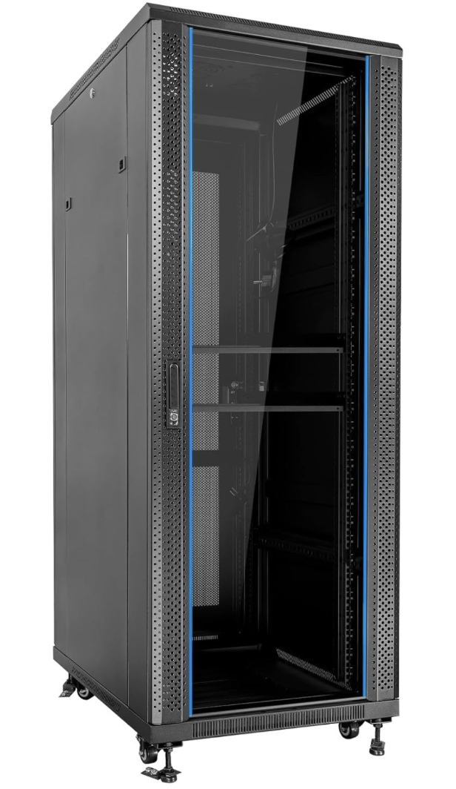
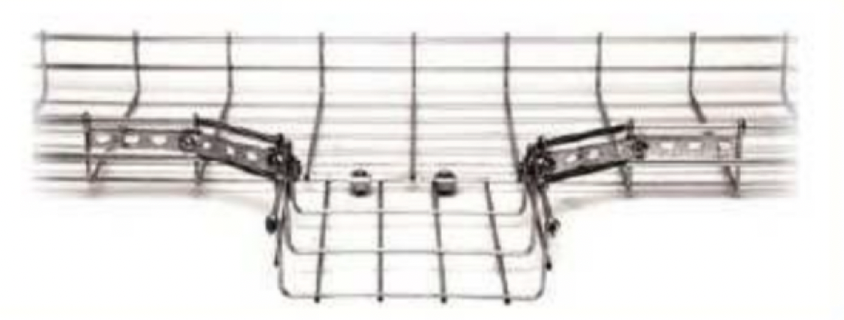
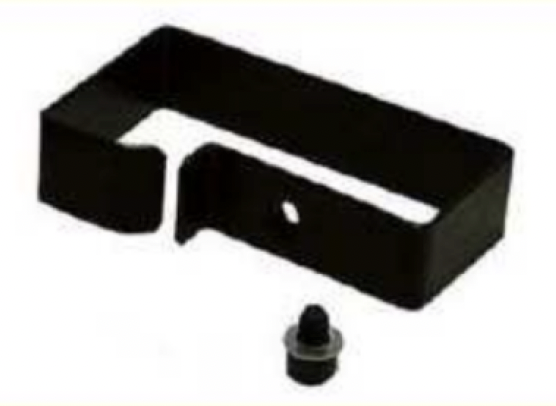
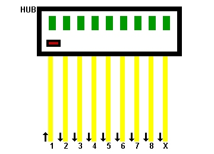

# Tema 3. Cableado estructurado y componentes

En este tema montamos la **infraestructura** de una LAN: desde la **NIC** del PC hasta el **rack**, pasando por tomas, paneles, canalizaciones y la electrónica (switch, router, AP…).

!!! tip "Primera clase"
    Empieza por el [cuestionario inicial](#cuestionario-inicial). No hace falta estudiar el tema completo antes: el cuestionario sirve para ver qué sabes al empezar.

## Propuesta didáctica

Trabajamos los **RA2**, **RA3** y **RA4** del módulo Redes de área local (0225):

> **RA2.** *Despliega el cableado de una red local interpretando especificaciones y aplicando técnicas de montaje.*

> **RA3.** *Interconecta equipos en redes locales cableadas describiendo estándares de cableado y aplicando técnicas de montaje de conectores.*

> **RA4.** *Instala equipos en red, describiendo sus prestaciones y aplicando técnicas de montaje.*

### Criterios de evaluación (selección)

**RA2**

* **CE2d**: Se han reconocido los detalles del cableado de la instalación y su despliegue (categoría del cableado, espacios por los que discurre, soporte para las canalizaciones, entre otros).
* **CE2e**: Se han seleccionado y montado las canalizaciones y tubos.
* **CE2f**: Se han montado los armarios de comunicaciones y sus accesorios.
* **CE2g**: Se han montado y conexionado las tomas de usuario y paneles de parcheo.
* **CE2i**: Se han etiquetado los cables y tomas de usuario.
* **CE2j**: Se ha trabajado con la calidad y seguridad requeridas.

**RA3**

* **CE3a**: Se ha interpretado el plan de montaje lógico de la red.
* **CE3b**: Se han montado los adaptadores de red en los equipos.
* **CE3d**: Se han montado los equipos de conmutación en los armarios de comunicaciones.
* **CE3e**: Se han conectado los equipos de conmutación a los paneles de parcheo.
* **CE3f**: Se ha verificado la conectividad de la instalación.
* **CE3g**: Se ha trabajado con la calidad requerida.

**RA4**

* **CE4a**: Se han identificado las características funcionales de las redes inalámbricas.
* **CE4b**: Se han identificado los modos de funcionamiento de las redes inalámbricas.
* **CE4c**: Se han instalado adaptadores y puntos de acceso inalámbrico.
* **CE4d**: Se han configurado los modos de funcionamiento y los parámetros básicos.

!!! note "VLAN"
    Las **VLAN** (CE4j) se desarrollan en el **Tema 6**. Aquí solo las mencionamos como capacidad de muchos switches gestionables.

### Contenidos

* Adaptador de red (NIC): tipos, MAC, dúplex, velocidades.
* Armario / rack 19″ y unidades **U**; paneles de parcheo; TO y latiguillos.
* Canalizaciones, bandejas, guías y pasahilos.
* Electrónica: hub, switch, router, gateway, punto de acceso.
* Empalme por **fusión** de fibra (fusionadora, protectores, comprobación básica, PRL).
* Visión ISO/TIA: horizontal, backbone y distancias orientativas.

### Programación de aula (orientativa, ~14–17 h)

| Sesiones | Contenidos | Actividades |
| --- | --- | --- |
| 1 | Presentación + cuestionario inicial | Cuestionario |
| 2 | NIC y adaptadores | **AC301** |
| 3–4 | Rack, panel, TO, guiado | AC302, AC304 |
| 5–7 | Electrónica de red + AP | AC303 |
| 8–9 | Normas ISO/TIA; distancias; etiquetado | — |
| 10–11 | Propuesta electrónica (centro educativo) | **AC305** |
| 12–13 | **Taller:** montaje panel / tomas / armario + switch | **PR301** |
| 14 | **Taller:** fusión de fibra / fusionadoras | **PR304** |
| 15–16 | WLAN / NetAcad (AP) | **PR303** |
| 17 | Proyecto aulario (grupo) | **PR302** |

---

## Cuestionario inicial

!!! question "Antes de empezar — responde con lo que sepas"
    1. ¿Qué es un adaptador de red (NIC) y qué características tiene?
    2. ¿Qué elementos hay dentro de un armario de comunicaciones?
    3. ¿Para qué sirve un panel de parcheo?
    4. ¿Qué diferencia hay entre un hub y un switch?
    5. ¿Qué hace un router en una red?
    6. ¿Cómo funciona un punto de acceso Wi‑Fi?
    7. ¿Qué tipos de tomas de usuario conoces?
    8. ¿Qué es PoE y para qué se usa?
    9. ¿Qué distancia máxima suele tener el cableado horizontal?

!!! warning "Soluciones"
    Las soluciones se trabajan en clase o se publican en Aules cuando proceda.

---

## ¿Qué es el cableado estructurado?

Sistema de cableado de telecomunicaciones que unifica voz, datos y otros servicios bajo un mismo diseño (normas **ANSI/TIA/EIA‑568/569**, **ISO/IEC 11801**…). Objetivos:

- **Flexibilidad**: reorganizar puestos sin rehacer todo el tendido.
- **Evolución**: cambiar electrónica sin tirar el cableado pasivo.
- **Centralización**: concentrar servicios en distribuidores (racks / salas TR).

<figure markdown="span">
  { width="800" }
  <figcaption>Arquitectura típica: áreas de trabajo, horizontal, backbone y distribuidores</figcaption>
</figure>

---

## Adaptador de red (NIC)

La **NIC** (*Network Interface Card*) permite conectar el equipo a la red (integrada, PCIe, USB, Wi‑Fi…). Cada interfaz tiene una **dirección MAC** de 48 bits fijada de fábrica.

Características que debes saber leer en una ficha:

| Aspecto | Opciones habituales |
| --- | --- |
| Interfaz | RJ‑45, fibra (SC/LC…), inalámbrica |
| Dúplex | Half / full |
| Velocidad | 10/100/1000 Mbps (y superiores) |
| Extra | Wake‑on‑LAN, PoE (en el lado del switch), etc. |

<figure markdown="span">
  { width="600" }
  <figcaption>NIC (Network Interface Card)</figcaption>
</figure>

---

## Armario de distribución (rack)

El **rack** concentra el cableado de una zona: paneles de parcheo, switches, PDU/UPS, ventilación y accesorios de ordenación.

<figure markdown="span">
  { width="400" }
  <figcaption>Vista frontal de un armario de distribución</figcaption>
</figure>

### Estándar 19″ y unidad U

- Anchura interior estándar: **19 pulgadas** → equipos **rackeables**.
- Altura en **unidades U** (~4,45 cm ≈ 1,75″). Un panel de 24 puertos suele ocupar **1 U**.
- Armarios pequeños (&lt;12 U) a pared; medianos y grandes (&gt;24 U) de suelo, a menudo con ventilación y filtrado.

---

## Panel de parcheo

El **patch panel** organiza las líneas que entran al armario: cada toma del panel se corresponde (y se **etiqueta**) con una TO del área de trabajo.

- Típico: **24** o **48** puertos RJ‑45 en 1–2 U.
- También hay paneles / cajones de **fibra**.
- En la parte trasera: regletas IDC con código de colores.

<figure markdown="span">
  { width="500" }
  <figcaption>Detalle trasero: numeración y código de colores</figcaption>
</figure>

---

## Tomas de usuario, latiguillos y guiado

### Toma de usuario (TO)

Punto de conexión en el puesto: una o más RJ‑45 hembra (datos / voz / reserva). Tipos:

- **Superficie** (canaleta).
- **Empotrable**.
- **Suelo técnico**.

### Latiguillos

Cables cortos con RJ‑45 en ambos extremos:

1. Equipo ↔ TO.  
2. Panel ↔ switch (o panel ↔ panel).

Longitudes comerciales habituales: 0,5 / 1 / 2 m. A partir de Cat. 6, en muchos pliegos se prefieren latiguillos **certificados de fábrica**.

### Soportes de guiado

| Elemento | Función |
| --- | --- |
| **Canalizaciones** | Tubos / canaletas por paredes y suelos |
| **Bandejas** | Mazos en techo o suelo técnico |
| **Guías de cable** | Orden en el rack |
| **Pasahilos** | 1 U para peinar latiguillos |

<figure markdown="span">
  { width="400" }
  <figcaption>Canalizaciones para cableado de red</figcaption>
</figure>

<figure markdown="span">
  { width="400" }
  <figcaption>Bandejas de guiado (horizontal / vertical)</figcaption>
</figure>

<figure markdown="span">
  { width="400" }
  <figcaption>Guías en el rack</figcaption>
</figure>

<figure markdown="span">
  { width="400" }
  <figcaption>Pasahilos (1 U)</figcaption>
</figure>

!!! tip "Etiquetado"
    Sin etiquetas coherentes (TO ↔ panel ↔ puerto de switch), el mantenimiento se convierte en caza del tesoro. Es criterio de calidad (CE2i).

---

## Electrónica de red

Dispositivos que regeneran, concentran, conmutan o encaminan el tráfico. Suelen ir en el rack, pero un AP puede ir en techo/pared.

| Dispositivo | Capa OSI | Idea clave |
| --- | --- | --- |
| **Repetidor** | 1 | Regenera la señal; amplía el dominio de colisión |
| **Hub** | 1 | Replica a todos los puertos (legacy) |
| **Switch** | 2 | Reenvía por MAC; reduce colisiones |
| **Router** | 3 | Une redes distintas (IP) |
| **Gateway** | varias | Frontera / traducción / seguridad |
| **AP** | 2 (+ radio) | Extiende la LAN por Wi‑Fi |

<figure markdown="span">
  { width="480" }
  <figcaption>Hub Ethernet (uso residual / laboratorio)</figcaption>
</figure>

### Switch (lo habitual en LAN)

Aprende MAC ↔ puerto; full‑dúplex; 10/100/1000… Modelos **no gestionables** vs **gestionables** (VLAN, QoS, SNMP…). **PoE** alimenta AP, cámaras IP, etc. por el mismo UTP.

### Router y gateway

- **Router**: tablas de rutas, a menudo NAT/DHCP en el borde LAN–WAN.
- **Gateway**: puerta de enlace; puede integrar firewall, VPN, proxy…

### Punto de acceso (AP)

Enlaza clientes Wi‑Fi con la red cableada. Modos habituales: **AP**, **repetidor**, **bridge**. Interior / exterior; muchos se alimentan por **PoE**.

<figure markdown="span">
  { width="480" }
  <figcaption>Punto de acceso para interiores</figcaption>
</figure>

!!! note "Más adelante"
    Seguridad Wi‑Fi (WPA2/3, SSID…) y **VLAN** se trabajan con más detalle en temas posteriores (**Tema 6** para VLAN).

---

## Normas y distancias (visión rápida)

Familia útil: **TIA‑568** (cableado), **569** (espacios/canalizaciones), **606** (etiquetado), **607** (tierra), equivalente **ISO/IEC 11801**.

### Bloques funcionales

1. **Área de trabajo** — puestos + TO + latiguillo corto.  
2. **Horizontal** — TO ↔ panel del distribuidor de planta (FD).  
3. **Backbone (vertical)** — enlaza distribuidores de planta con el de edificio (BD).  
4. **Campus** — entre edificios (CD), normalmente fibra.

### Distancias orientativas (cobre)

| Tramo | Límite habitual |
| --- | --- |
| Horizontal (TO ↔ panel) | **90 m** de cable permanente |
| Latiguillos (ambos extremos) | hasta ~5 m + ~5 m → **100 m** canal completo |
| Equipo ↔ TO | latiguillo corto (p. ej. ≤ 5 m) |

<figure markdown="span">
  { width="640" }
  <figcaption>Distancia estación de trabajo ↔ TO</figcaption>
</figure>

<figure markdown="span">
  { width="640" }
  <figcaption>Distribución horizontal y sala de telecomunicaciones</figcaption>
</figure>

<figure markdown="span">
  { width="400" }
  <figcaption>Backbone: distancias mayores con fibra</figcaption>
</figure>

Con **fibra** el backbone y el campus cubren distancias mucho mayores (cientos de metros / km según tipo).

## Empalme por fusión (visión de taller)

En instalaciones de fibra, el **empalme por fusión** une dos fibras fundiendo el núcleo con un arco eléctrico controlado (**fusionadora**). En el taller se trabaja con:

- Preparación: pelado, limpieza, corte con **cleaver**.
- Fusión y protectores termorretráctiles.
- Comprobación básica (continuidad / potencia según el equipo disponible).
- **PRL:** gafas, no mirar el haz láser, manipulación cuidadosa de restos de fibra (recipiente específico).

La práctica evaluable es **PR304**.

---

## Actividades

!!! tip "Formato de entrega"
    Las entregas en **Aules** son **obligatorias en Markdown** (`.md`). No se aceptan PDF.  
    Nombre del archivo: `AC3XX.md` o `PR3XX.md` (sustituye XX por el número). Respeta la fecha de vencimiento.  
    Escribiremos los `.md` con **Visual Studio Code**.

    !!! note "Cómo empezar"
        - Guía de Markdown: [tutorialmarkdown.com/guia](https://tutorialmarkdown.com/guia)
        - Documentación de Visual Studio Code: [code.visualstudio.com/docs](https://code.visualstudio.com/docs)

### AC301 — NIC comparativa

* :simple-readdotcv: **AC301**. (RA3 // CE3b // RA4 // CE4a // **AC 0–1**). Tabla comparativa de NIC (cableada / USB / Wi‑Fi): velocidades, dúplex, interfaz y uso típico. Incluye qué es la MAC.

### AC302 — Armario / rack

* :simple-readdotcv: **AC302**. (RA2 // CE2f // **AC 0–1**). Documenta estructura del rack 19″, unidades U, elementos internos (panel, electrónica, PDU, guías) y tipos según tamaño.

### AC303 — Electrónica y capas OSI

* :simple-readdotcv: **AC303**. (RA3 // CE3d // RA4 // CE4a, CE4b // **AC 0–1**). Tabla: hub, switch, router, gateway y AP — capa OSI, función, escenario de uso y una limitación de cada uno.

### AC304 — Tomas, latiguillos y guiado

* :simple-readdotcv: **AC304**. (RA2 // CE2d, CE2e, CE2g, CE2i // **AC 0–1**). Tipos de TO, uso de latiguillos, canalizaciones/bandejas/guías/pasahilos y buenas prácticas de etiquetado.

### AC305 — Propuesta electrónica (centro educativo)

* :simple-readdotcv: **AC305**. (RA3 // CE3a, CE3d // RA4 // CE4c // **AC 0–1**). Propón la electrónica para un centro con **dos edificios**: switches de armario, router de salida, gateway/firewall y AP interiores/exteriores. Diagrama en [Excalidraw](https://excalidraw.com/), [draw.io](https://app.diagrams.net/) o [Dia](https://wiki.gnome.org/Apps/Dia) + breve justificación en el `.md`.

### PR301 — Taller: panel, tomas, armario y switch

| Campo | Valor |
| --- | --- |
| **Código** | **PR301** |
| **UP / tema** | T3 — Cableado estructurado |
| **RA principal** | **RA2** (despliegue) + **RA3** (interconexión). Apoyo **RA4** (instalación de equipo de conmutación) |
| **CE de cobertura** | CE2d, CE2f, CE2g, CE2i, CE2j · CE3a, CE3d, CE3e, CE3f |
| **Sesiones estimadas** | **2–3** |
| **Instrumento** | Checklist de montaje + rúbrica 0–10 |

* :simple-neutralinojs: **PR301**. En el **aula-taller** (no solo simulación): montad y conexionad un tramo didáctico de cableado estructurado.

  **Enunciado (qué hace el alumno):**

  1. Preparar el **armario / rack** didáctico (orden, U libres, guiado, seguridad).
  2. Montar o completar **panel de parcheo** y, si el puesto lo permite, **toma de usuario (TO)** o equivalente didáctico.
  3. Instalar el **switch** en el armario (fijación, alimentación, etiquetado del equipo).
  4. Conexionar **panel ↔ switch** con latiguillos; etiquetar puertos según el plan del profesor.
  5. Verificar **conectividad** básica (enlace / ping entre dos puestos del tramo).
  6. Documentar el montaje (fotos + esquema de puertos).

  **Evidencia:** fotos del rack (antes/después), etiquetado visible, checklist de montaje firmada, prueba de conectividad, `PR301.md`.

  **Entrega:** `PR301.md` + evidencias en Aules. *(Opcional, si hay tiempo: escenario equivalente en Packet Tracer como refuerzo, no sustituye el taller.)*

| Criterio (rúbrica) | Descripción | Puntos |
| --- | --- | --- |
| Rack / panel / TO | Montaje ordenado y conforme al plan | 0–3 |
| Switch + conexionado | Equipo fijado y enlazado a paneles | 0–3 |
| Verificación | Conectividad demostrada | 0–2 |
| Informe `.md` | Fotos, etiquetado, incidencias | 0–2 |
| **Total** | | **/10** |

### PR304 — Taller: fusión de fibra / fusionadoras

| Campo | Valor |
| --- | --- |
| **Código** | **PR304** |
| **UP / tema** | T3 — Cableado estructurado |
| **RA principal** | **RA3** (montaje de conectores/empalmes en fibra). Apoyo **RA2** (medios) y **RA6** (PRL) |
| **CE de cobertura** | CE3c, CE3f, CE3g · CE2c, CE2j · CE6b, CE6e |
| **Sesiones estimadas** | **1–2** |
| **Instrumento** | Checklist de fusión + rúbrica 0–10 |

* :simple-neutralinojs: **PR304**. En taller, bajo supervisión: realizad un **empalme por fusión** (o la secuencia completa de preparación + fusión + protector que permita el material del centro).

  **Enunciado (pasos):**

  1. EPI y normas: gafas; no mirar fuentes ópticas; recoger restos de fibra.
  2. Preparar fibras (pelado, limpieza, corte con cleaver).
  3. Ejecutar la fusión en la **fusionadora**; anotar la atenuación estimada si el equipo la muestra.
  4. Colocar el **protector** termorretráctil y asentar el empalme.
  5. Comprobación básica según el equipo disponible (continuidad / potencia / OK de la fusionadora).
  6. Documentar errores típicos (corte malo, suciedad, protector mal colocado) y cómo se corrigieron.

  **Evidencia:** foto del puesto/fusionadora, captura o lectura de resultado, checklist PRL, `PR304.md`.

  **Entrega:** `PR304.md` + evidencias en Aules.

| Criterio (rúbrica) | Descripción | Puntos |
| --- | --- | --- |
| PRL / EPI | Normas aplicadas y documentadas | 0–2 |
| Preparación y corte | Cleaver / limpieza correctos | 0–2 |
| Fusión + protector | Empalme válido / protector asentado | 0–3 |
| Comprobación + informe | Evidencia de OK + `.md` | 0–3 |
| **Total** | | **/10** |

### PR303 — WLAN / NetAcad (AP y parámetros)

| Campo | Valor |
| --- | --- |
| **Código** | **PR303** |
| **UP / tema** | T3 — Cableado estructurado |
| **RA principal** | **RA4** (instalación/configuración de equipos inalámbricos) |
| **CE de cobertura** | CE4a, CE4b, CE4c, CE4d, CE4e, CE4f, CE4i |
| **Sesiones estimadas** | **2** |
| **Instrumento** | Checklist NetAcad/PT + rúbrica 0–10 |

* :simple-cisco: **PR303**. Itinerario **Cisco NetAcad** + simulación Packet Tracer: instalar/configurar un **punto de acceso** (o router inalámbrico de PT), modos de funcionamiento, SSID, canal/banda, autenticación básica (**WPA2/WPA3**), comprobar conectividad de clientes Wi‑Fi y documentar parámetros. Completa el módulo NetAcad de WLAN que indique el profesor y adjunta evidencias (capturas / checklist) en `PR303.md`. **No sustituye** las prácticas de taller físico (PR301/PR304).

| Criterio (rúbrica) | Descripción | Puntos |
| --- | --- | --- |
| Características y modos | CE4a–CE4b documentados | 0–2 |
| Instalación / PT | AP o equivalente operativo | 0–2 |
| Parámetros y seguridad | SSID, canal, WPA2/3 (CE4d, CE4i) | 0–3 |
| Conectividad + informe | Clientes OK + `.md` / NetAcad | 0–3 |
| **Total** | | **/10** |

### PR302 — Proyecto aulario

| Campo | Valor |
| --- | --- |
| **Código** | **PR302** |
| **UP / tema** | T3 — Cableado estructurado |
| **RA principal** | **RA2** (despliegue). Apoyo **RA3** |
| **CE de cobertura** | CE2d, CE2e, CE2f, CE2g, CE2i, CE2j · CE3a |
| **Sesiones estimadas** | **1–2** |
| **Instrumento** | Rúbrica de diseño 0–10 |

* :simple-neutralinojs: **PR302**. En grupo, diseñad el cableado del **aulario** (dos plantas, aulas, Wi‑Fi, enlace al edificio principal vía campus). El diseño debe ser coherente con lo aprendido en el **taller** (PR301/PR304): rack, paneles, fusión/medios y electrónica.

  - Plano funcional: zonas, FD/BD/CD, horizontal y backbone.
  - Diagrama en Excalidraw / draw.io / Dia.
  - Justificación de medios (cobre/fibra), canalizaciones y electrónica básica.
  - Idea de etiquetado y crecimiento (reserva de puertos/cables).

  **Evidencia / entrega:** `PR302.md` + diagrama (PNG/SVG o archivo del editor, según Aules). Exposición breve (~5 min) si se indica en clase.

| Criterio (rúbrica) | Descripción | Puntos |
| --- | --- | --- |
| Análisis del escenario | Necesidades y condicionantes claros | 0–2 |
| Diseño del cableado | Elementos funcionales y normativa coherentes | 0–2 |
| Justificación técnica | Medios, canalizaciones y equipos argumentados | 0–2 |
| Etiquetado y mantenimiento | Identificación y plan básico de ampliación | 0–2 |
| Documentación `.md` + diagrama | Claridad y completitud | 0–2 |
| **Total** | | **/10** |

---

## Referencias rápidas

- Sitio del módulo: [fjavier-hernandez.github.io/ral](https://fjavier-hernandez.github.io/ral/)
- Diagramas: [Excalidraw](https://excalidraw.com/), [draw.io (diagrams.net)](https://app.diagrams.net/), [Dia](https://wiki.gnome.org/Apps/Dia)
- Simulación: [Cisco Packet Tracer](https://www.netacad.com/es/cisco-packet-tracer)
- Entregas: [Visual Studio Code](https://code.visualstudio.com/docs) + [Markdown](https://tutorialmarkdown.com/guia)
- Normas: [Normas del taller](../00-normas/normas_taller.md)

*[RA]: Resultado de aprendizaje  
*[CE]: Criterio de evaluación  
*[AC]: Actividad de clase  
*[PR]: Práctica  
*[NIC]: Network Interface Card  
*[TO]: Telecommunications Outlet  
*[PoE]: Power over Ethernet  
*[FD]: Floor Distributor  
*[BD]: Building Distributor  
*[CD]: Campus Distributor
