# :material-power-plug: CAPA FÍSICA

En esta unidad estudiaremos la **capa física** de las redes de datos, que constituye la base fundamental sobre la que se construye toda la comunicación de red. Nos enfocaremos en los diferentes medios de transmisión (cables de cobre, fibra óptica y tecnologías inalámbricas), sus características técnicas, estándares de cableado, conectores y técnicas de montaje.

La capa física es responsable de la transmisión de bits a través del medio físico, convirtiendo los datos digitales en señales eléctricas, ópticas o electromagnéticas. Dominar estos conceptos es esencial para diseñar, instalar y mantener redes locales eficientes y confiables.

!!! info "<strong>Objetivos de la unidad</strong>"
    
    • Identificar y clasificar los diferentes medios de transmisión 
    • Comprender los estándares de cableado y terminaciones 
    • Aplicar técnicas de montaje de conectores y equipos 
    • Diseñar sistemas de cableado estructurado 
    • Evaluar la idoneidad de cada medio según el entorno
    

## 🔧 INFRAESTRUCTURA DE RED

La **infraestructura de red** comprende todos los elementos físicos y lógicos necesarios para establecer la conectividad entre dispositivos en una red local. Esta infraestructura incluye los medios de transmisión, los equipos de interconexión, las estructuras de cableado y los estándares que garantizan la interoperabilidad y el rendimiento óptimo del sistema.

En esta unidad analizaremos los componentes fundamentales de la infraestructura:

!!! abstract "<strong>Componentes de la infraestructura</strong>"
    
    **🌐 Medios de transmisión**: Canales físicos que transportan la información 
    **🔌 Conectores y terminaciones**: Interfaces entre medios y equipos 
    **🏗️ Cableado estructurado**: Organización jerárquica del cableado en edificios 
    **📡 Tecnologías inalámbricas**: Comunicación sin medios físicos 
    **⚙️ Equipos de red**: Dispositivos que gestionan el tráfico de datos
    

La correcta planificación e implementación de la infraestructura es crucial para garantizar la escalabilidad, mantenibilidad y rendimiento de la red, cumpliendo con estándares internacionales como ISO/IEC 11801 y TIA/EIA-568.

## 📚 Propuesta didáctica

En esta unidad trabajamos los **RA2, RA3 y RA4 de RAL**:

> **RA2.** *Despliega el cableado de una red local interpretando especificaciones y aplicando técnicas de montaje.*
> 
> **RA3.** *Interconecta equipos en redes locales cableadas describiendo estándares de cableado y aplicando técnicas de montaje de conectores.*
> 
> **RA4.** *Instala equipos en red, describiendo sus prestaciones y aplicando técnicas de montaje.*

### 🎯 Criterios de evaluación

#### Criterios de evaluación del RA2

> **CE2a**: *Interpreta las especificaciones del cableado de una red local analizando los requisitos técnicos y aplicando estándares de cableado estructurado.*
> 
> **CE2b**: *Identifica los componentes del sistema de cableado reconociendo medios de transmisión, conectores y equipos de distribución.*
> 
> **CE2c**: *Aplica técnicas de montaje del cableado siguiendo procedimientos de instalación y cumpliendo normativas de seguridad.*
> 
> **CE2d**: *Verifica el funcionamiento del cableado instalado utilizando herramientas de medición y pruebas de conectividad.*

#### Criterios de evaluación del RA3

> **CE3a**: *Describe los estándares de cableado para redes locales identificando las normas TIA/EIA-568 y categorías de cable.*
> 
> **CE3b**: *Identifica los tipos de conectores y su uso analizando conectores RJ, de fibra óptica y coaxiales.*
> 
> **CE3c**: *Aplica técnicas de montaje de conectores realizando terminaciones T568A/T568B y crimpado de conectores.*
> 
> **CE3d**: *Verifica la conectividad de los equipos interconectados realizando pruebas de continuidad y funcionamiento.*

#### Criterios de evaluación del RA4

> **CE4a**: *Describe las prestaciones de los equipos de red analizando características técnicas de switches, routers y puntos de acceso.*
> 
> **CE4b**: *Identifica los componentes de los equipos de red reconociendo interfaces, fuentes de alimentación y sistemas de ventilación.*
> 
> **CE4c**: *Aplica técnicas de montaje de equipos de red instalando en racks y cumpliendo estándares de cableado.*
> 
> **CE4d**: *Verifica el funcionamiento de los equipos instalados realizando pruebas de conectividad y configuración básica.*

### Contenidos

* Medios de transmisión: guiados y no guiados.
* Cable de par trenzado: categorías, conectores y terminaciones.
* Cable coaxial: tipos y conectores.
* Fibra óptica: tipos, características y conectores.
* Medios inalámbricos: espectro electromagnético y estándares.
* Cableado estructurado en edificios.

!!! question "Cuestionario inicial"
    1. ¿Qué categorías de cable de par trenzado conoces y para qué se utilizan?
    2. ¿Cuándo es recomendable usar fibra óptica en lugar de cable de cobre?
    3. ¿Qué diferencias hay entre los medios guiados y no guiados?
    4. ¿Qué es el espectro electromagnético y por qué es importante en comunicaciones?
    5. ¿Cuáles son los principales estándares inalámbricos IEEE 802.11?
    6. ¿Qué elementos componen un sistema de cableado estructurado?
    7. ¿Cómo se organiza el cableado horizontal y vertical en un edificio?
    8. ¿Qué tipos de conectores se utilizan para cable de par trenzado?
    9. ¿Cómo se realiza la terminación de cables según los estándares T568A y T568B?

## Programación de Aula (15h)

Esta unidad se imparte en la primera evaluación, con una duración estimada de 15 sesiones lectivas:

| Sesión | Contenidos | Actividades | Criterios trabajados |
|--------|------------|-------------|----------------------|
| 1-2 | Medios guiados: par trenzado | Cuestionario inicial, AC301 | CE2a, CE2b, CE3a, CE3b |
| 3-5 | Medios guiados: coaxial y fibra óptica | Actividad AC302, práctica PR303 | CE2a, CE2b, CE3a, CE3b |
| 6-8 | Medios no guiados y estándares inalámbricos | Actividad AC304 | CE4a, CE4b |
| 9-10 | Cableado estructurado en edificios | Actividad AC305 | CE2a, CE2b, CE2c, CE2d |
| 11-12 | Práctica: Armado de latiguillo y montaje de roseta | PR306, PR307 | CE3a, CE3b, CE3c, CE3d |
| 13-15 | Repaso y evaluación | Evaluación práctica | Todos los criterios |

---

## 📡 Medios de transmisión

La información se transmite en las redes mediante señales, que pueden ser de naturaleza eléctrica, óptica o radiofrecuencia, a través de un medio de transmisión.

Este medio es el enlace que existe entre las dos entidades que se comunican y, entre otros factores, el éxito en la comunicación dependerá de su naturaleza y limitaciones. Por ello, es importante conocer las características de los principales medios de transmisión.

### 🔌 Medios guiados

Los medios guiados son los cables que interconectan los equipos. A través de ellos se emite información en forma de señales eléctricas u ópticas. Los principales medios guiados en redes de datos son los que veremos a continuación.

#### 📶 Cable de par trenzado

Este cable tiene una cubierta de PVC y en su interior contiene ocho cables más pequeños, de diferente color. Para aumentar la potencia del cable y reducir las interferencias, los cables se presentan trenzados por pares (de ahí su nombre), con un total de cuatro pares.

La combinación de colores de los cables interiores no es trivial, sino que debe ser la siguiente:

- **Par 1**: Azul – Blanco/Azul
- **Par 2**: Naranja – Blanco/Naranja  
- **Par 3**: Verde – Blanco/Verde
- **Par 4**: Marrón – Blanco/Marrón

Este tipo de cable se encuentra normalizado según el estándar **TIA/EIA-568-B**, que define, entre otros aspectos, las diferentes categorías de este cable en función a sus prestaciones. Las categorías más representativas en redes de datos son las siguientes:

| Categoría | Ancho de banda | Aplicaciones |
|-----------|----------------|--------------|
| **Cat. 3** | 16 MHz | Redes Ethernet de bajas prestaciones (obsoleto) |
| **Cat. 4** | 20 MHz | Redes Token Ring de hasta 16 Mbps (obsoleto) |
| **Cat. 5** | 100 MHz | Redes Ethernet de hasta 100 Mbps (obsoleto) |
| **Cat. 5e** | 100 MHz | Redes Ethernet de hasta 1000 Mbps (1 Gbps) |
| **Cat. 6** | 250 MHz | Redes Ethernet de hasta 1 Gbps a 100m, 10 Gbps a 37m |
| **Cat. 6a** | 500 MHz | Redes Ethernet de hasta 10 Gbps a 100m |
| **Cat. 7** | 600 MHz | Redes Ethernet de hasta 10 Gbps (no estándar TIA/EIA) |
| **Cat. 7a** | 1000 MHz | Redes Ethernet de hasta 10 Gbps (no estándar TIA/EIA) |
| **Cat. 8** | 2000 MHz | Redes Ethernet de hasta 25/40 Gbps a 30m (2016) |

!!! important "Estado actual del cableado (2025)"
    
    En la actualidad, para instalaciones de redes de datos, se utiliza principalmente:
    
    - **Categoría 5e**: Para instalaciones básicas de hasta 1 Gbps
    - **Categoría 6**: Para instalaciones estándar de hasta 1 Gbps con posibilidad de 10 Gbps
    - **Categoría 6a**: Para instalaciones de alto rendimiento con 10 Gbps garantizado
    - **Categoría 8**: Para centros de datos y aplicaciones de muy alto rendimiento (25/40 Gbps)
    
    Las categorías 3, 4 y 5 están prácticamente obsoletas en nuevas instalaciones.

##### 🔧 Tipos de cable según el blindaje

###### 🔌 Cable UTP (Unshielded Twisted Pair)

El **cable UTP** es el tipo más común de cable de par trenzado utilizado en redes locales. Su nombre significa "cable de par trenzado sin apantallar" y presenta las siguientes características:

✅ **Ventajas:**

- **Bajo coste**: Es la opción más económica
- **Fácil instalación**: Flexible y manejable
- **Prestaciones adecuadas**: Suficiente para la mayoría de aplicaciones
- **Compatibilidad**: Ampliamente soportado

⚠️ **Limitaciones:**

- **Interferencias electromagnéticas**: Vulnerable a ruido eléctrico
- **Distancias limitadas**: Restricciones en entornos con mucha actividad electromagnética
- **Sin protección**: No tiene blindaje contra interferencias externas

🏗️ **Estructura:**
Como ya mencionamos, el cable UTP está compuesto por:

- **Cuatro pares de hilos** trenzados entre sí
- **Recubrimiento exterior** de PVC para protección
- **Sin blindaje metálico** (de ahí el nombre "unshielded")

A partir del cable UTP estándar, y en función de qué parte de este se blinde frente a las interferencias, tenemos las siguientes variaciones:

| Tipo de cable | En el par | En el cable | Uso principal |
|---------------|-----------|-------------|---------------|
| **U/UTP** | Sin blindaje | Sin blindaje | Redes domésticas y oficinas pequeñas |
| **U/FTP** | Pantalla de aluminio | Sin blindaje | Entornos con interferencias moderadas |
| **F/UTP** | Sin blindaje | Pantalla de aluminio | Oficinas y edificios comerciales |
| **F/FTP** | Pantalla de aluminio | Pantalla de aluminio | Entornos industriales con alta interferencia |
| **S/UTP** | Sin blindaje | Malla de aluminio | Aplicaciones críticas y centros de datos |
| **S/FTP** | Pantalla de aluminio | Malla de aluminio | Entornos electromagnéticamente hostiles |
| **SF/UTP** | Pantalla de aluminio | Malla + pantalla de aluminio | Aplicaciones militares e industriales |

<figure>
  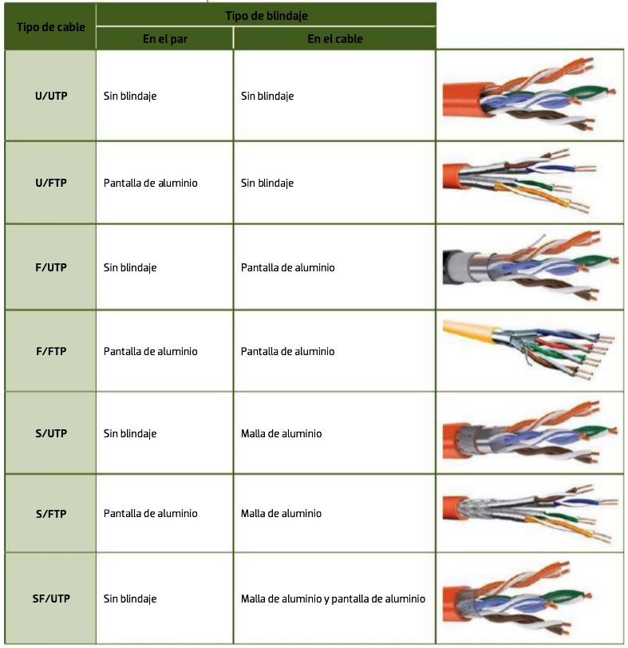
  <figcaption>Tipos de blindaje en cable de par trenzado según estándares</figcaption>
</figure>

🔌 **Conectores para el cable de par trenzado**

El cable de par trenzado utiliza conectores tipo **RJ** (Registered Jack), diseñados específicamente para la conexión de equipos en redes de datos y telefonía.

📋 **Tipos de conectores RJ:**

Los conectores RJ se clasifican según dos parámetros:

- **Posiciones**: Número total de ranuras disponibles
- **Contactos**: Número de conectores metálicos que se utilizan

Los conectores más utilizados en redes de datos son:

**Conector RJ-9:**

- Es el más pequeño de los conectores RJ
- Se utiliza para conectar los auriculares del teléfono
- Es un conector 4P4C

<figure>
  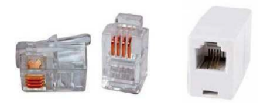
  <figcaption>Conector RJ-9 para auriculares de teléfono (4P4C)</figcaption>
</figure>

**Conector RJ-11:**

- Es un conector dedicado mayoritariamente a la telefonía analógica
- Tiene seis posiciones sobre las que se asientan dos contactos (6P2C)
- Su uso principal es conectar el terminal a la red
- La variante del RJ-11 que emplea un par de contactos más (6P4C) se llama RJ-14

<figure>
  
  <figcaption>Conector RJ-11 para telefonía analógica (6P2C)</figcaption>
</figure>

**Conector RJ-45:**

- Es el conector empleado para cable de par trenzado en redes Ethernet
- Es del tipo 8P8C, lo que significa que utiliza todas sus posiciones para recibir los cuatro pares del cable
- Este conector también soporta el uso de menos pares, dando lugar a las variantes 8P6C, 8P4C y 8P2C, casi todas dedicadas a telefonía o líneas RDSI
- El conector RJ-45 puede ser o no apantallado. Si lo es, por encima de la carcasa plástica tiene un armazón que lo protege de interferencias
- Este tipo de conectores suelen utilizarse con cableado que tenga algún tipo de blindaje

<figure style="align: center;">
    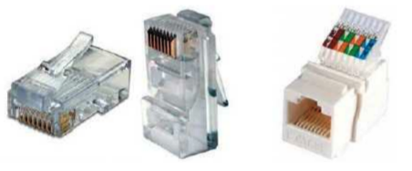
    <figcaption style="text-align: center;">Conector RJ-45 para Ethernet</figcaption>
</figure>

<figure>
  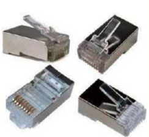
  <figcaption>Tipos de blindaje en cables de red (UTP, FTP, STP, S/FTP, etc.)</figcaption>
</figure>

📋 Terminaciones del cable

La posición de los cables en el conector, llamada de forma técnica **terminación**, está regulada en la norma **TIA/EIA-568-B**. Esta norma define dos terminaciones:

<!-- | Pin | T568A | T568B | Par T568A | Par T568B |
|-----|-------|-------|-----------|-----------|
| 1 | Blanco/Verde | Blanco/Naranja | Par 3 | Par 2 |
| 2 | Verde | Naranja | Par 3 | Par 2 |
| 3 | Blanco/Naranja | Blanco/Verde | Par 2 | Par 3 |
| 4 | Azul | Azul | Par 1 | Par 1 |
| 5 | Blanco/Azul | Blanco/Azul | Par 1 | Par 1 |
| 6 | Naranja | Verde | Par 2 | Par 3 |
| 7 | Blanco/Marrón | Blanco/Marrón | Par 4 | Par 4 |
| 8 | Marrón | Marrón | Par 4 | Par 4 | -->

<figure>
  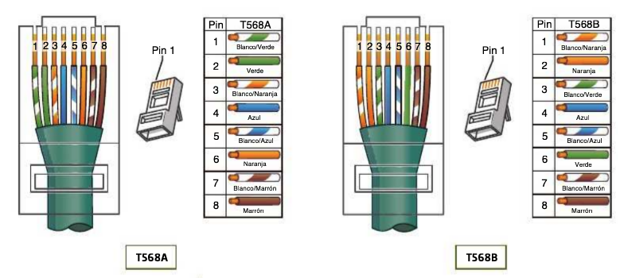
  <figcaption>Esquema de las terminaciones de los pares en un conector RJ-45 (T568A y T568B)</figcaption>
</figure>

!!! important "<strong>NOTA IMPORTANTE</strong>"
    
    Según la norma, la terminación a emplear para la mayor parte del tendido de cableado de la red debería ser **T568A**. Sin embargo, debido a que típicamente se ha usado la terminación **T568B** (definida en normas anteriores), muchas instalaciones de redes siguen empleando dicha terminación en lugar de la T568A.
    

Con estas terminaciones pueden crearse dos tipos de cable:

- **Cable directo**: utiliza la misma terminación en los dos extremos. Este cable es el que se usa para la mayoría de las conexiones en la red.

<figure>
  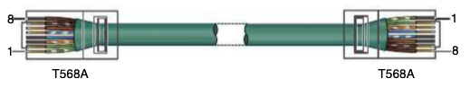
  <figcaption>Ejemplo de cable directo: ambas terminaciones iguales, normalmente T568A-T568A o T568B-T568B</figcaption>
</figure>

- **Cable cruzado**: utiliza diferente terminación en los dos extremos. Este cable se utiliza para conectar directamente dos equipos.

<figure>
  
  <figcaption>Ejemplo de cable cruzado: terminaciones diferentes en cada extremo, normalmente T568A-T568B</figcaption>
</figure>

!!! tip "<strong>CONSEJO</strong>"
    
    Para recordar las diferencias entre T568A y T568B: en T568B, los pares 2 y 3 están intercambiados respecto a T568A.
    

---

#### 📡 Cable coaxial

El **cable coaxial** está compuesto por dos conductores concéntricos que comparten el mismo eje. Su estructura consta de:

- **Conductor central**: Hilo de cobre sólido o hilos trenzados de cobre
- **Dieléctrico**: Capa aislante de material dieléctrico (generalmente polietileno)
- **Pantalla conductora**: Malla de hilos de cobre o aluminio que actúa como conductor exterior
- **Cubierta exterior**: Material aislante protector (habitualmente PVC)

!!! info "<strong>Características del cable coaxial</strong>"
    
    Este tipo de cable es más resistente que el cable de par trenzado a las interferencias electromagnéticas y presenta menor atenuación de señal, lo que lo convierte en una opción eficiente para grandes distancias. Sin embargo, en redes locales modernas su uso se ha reducido significativamente debido a la obsolescencia de las topologías de bus.
    

##### 📊 Ventajas y desventajas

**✅ Ventajas:**

- Mayor resistencia a interferencias electromagnéticas
- Menor atenuación de señal (pérdida mínima)
- Eficiente para transmisiones a grandes distancias
- Mayor ancho de banda disponible

**❌ Desventajas:**

- Mayor coste económico que el cable de par trenzado
- Instalación más compleja y costosa
- Aplicaciones limitadas en redes modernas
- Mayor grosor y menor flexibilidad

##### 📊 Tipos de cable coaxial

De toda la familia de cables coaxiales, los más extendidos en el ámbito de las telecomunicaciones son:

<!-- | Tipo de cable | Núcleo | Dieléctrico | Aplicaciones |
|---------------|--------|-------------|--------------|
| **RG-58/U** | Cobre sólido (diámetro: 0,9 mm) | Polietileno | Redes Ethernet 10BASE2 (obsoleto) |
| **RG-58A/U** | Hilos trenzados (19 hilos de 0,18 mm) | Polietileno | Redes Ethernet 10BASE2 (obsoleto) |
| **RG-59/U** | Cobre sólido (diámetro: 0,60 mm) | Polietileno de baja densidad | Televisión por cable |
| **RG-6/U** | Cobre rojo sólido (diámetro: 0,75 mm) | Polietileno de baja densidad | Televisión por cable, Internet por cable |
| **RG-8** | Cobre rojo sólido (diámetro: 2,18 mm) | Polietileno de baja densidad | Redes Ethernet 10BASE5 (obsoleto) | -->

<figure>
  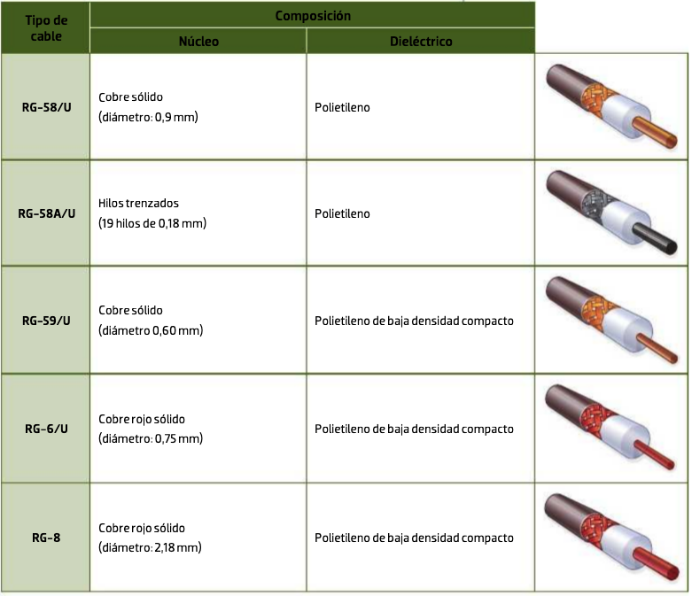
  <figcaption>Tipos de cable coaxial según composición</figcaption>
</figure>

##### 🔌 Conectores para el cable coaxial

La gama de conectores para cable coaxial es muy amplia, ya que este tipo de cable se utiliza mucho en la industria.

- Estos conectores se llaman **RF** y tienen diferentes formas: rectos, en ángulo, en T, etc.
- Los conectores RF pueden ser macho o hembra. Los conectores macho tienen un capuchón en su extremo que se utiliza para enganchar con el conector hembra.

Principalmente hay tres maneras de engancharlos:

- **Anclaje**: es la más común. El capuchón conector del macho se engancha en las ranuras del conector hembra.
- **Rosca**: el conector hembra tiene un paso de roscas sobre el que se enrosca el capuchón del conector macho.
- **Presión**: el capuchón del conector macho se acopla sobre el conector hembra. Típico en la conexión de la antena de TV.

Además de los conectores, en las redes con topología de bus se utiliza un elemento en los extremos del bus llamado **terminador**. Este conector no es más que un tapón con una resistencia en su interior para amortiguar las señales cuando llegan al final del bus, e impedir rebotes que pudieran causar interferencias.

Los principales tipos de conector para cable coaxial son:

- **BNC**: Conectores macho y hembra disponibles - Redes Ethernet 10BASE2 (obsoleto)
- **N**: Conectores macho y hembra disponibles - Aplicaciones de alta frecuencia
- **TNC**: Conectores macho y hembra disponibles - Versión roscada del BNC
- **SMA**: Conectores macho y hembra disponibles - Aplicaciones de microondas

En la siguiente imagen se muestran los diferentes tipos de conectores coaxiales mencionados:

<figure>
  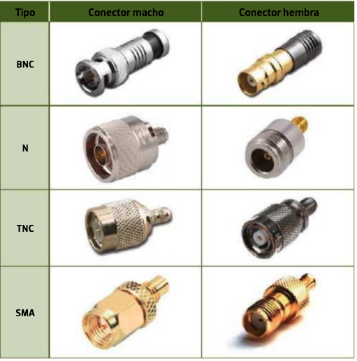
  <figcaption>Tipos de conectores coaxiales: BNC, N, TNC, SMA</figcaption>
</figure>

---

#### 🔬 Fibra óptica

La **fibra óptica** es un medio de transmisión basado en un hilo extremadamente fino (aproximadamente del grosor de un cabello humano) fabricado en vidrio o plástico de alta pureza. Su estructura consta de:

- **Núcleo central**: donde se propaga la luz
- **Revestimiento primario**: sustancia protectora (generalmente acrilato) que recubre directamente la fibra
- **Revestimiento secundario**: capa exterior que proporciona rigidez y protección contra curvaturas excesivas (típicamente nailon o poliéster)

**Principio de funcionamiento:**

La fibra óptica transmite información utilizando luz que se propaga a través del núcleo mediante el fenómeno de reflexión total interna. La luz se inyecta en un extremo del cable y rebota en las paredes del núcleo hasta llegar al extremo opuesto, manteniéndose confinada gracias a la diferencia de índices de refracción entre el núcleo y el revestimiento.

**Características destacadas:**

Este medio presenta pérdidas de señal extremadamente bajas en largas distancias y ofrece una capacidad de transmisión muy elevada, lo que lo convierte en la opción ideal para cubrir grandes distancias. Un ejemplo notable son las redes transoceánicas que conectan continentes mediante extensas redes de cables submarinos de fibra óptica.

###### 🌊 Cable submarino de fibra óptica

Destacando la importancia de este medio como infraestructura fundamental para las comunicaciones internacionales. Estas redes interconectan continentes y permiten la transmisión de grandes volúmenes de datos a alta velocidad y con mínima atenuación, haciendo posible la conectividad mundial moderna.

A continuación, se presenta una **visualización estática** de la red global de cables submarinos de fibra óptica, seguida de un **enlace interactivo** que permite explorar en tiempo real la infraestructura mundial de comunicaciones submarinas:

<figure>
  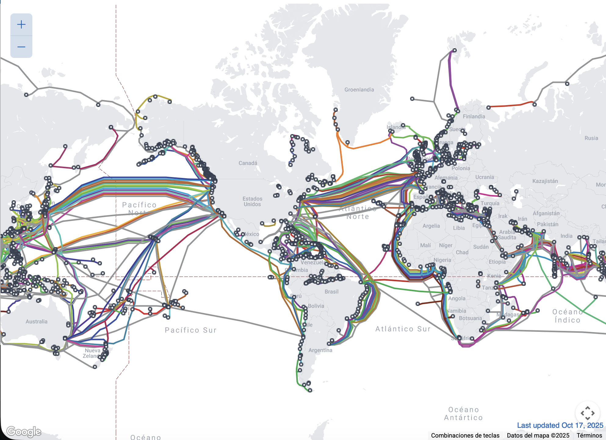
  <figcaption>Red mundial de cables submarinos de fibra óptica para comunicaciones intercontinentales</figcaption>
</figure>

!!! success "<strong>🗺️ MAPA INTERACTIVO</strong>"
    

        <a href="https://www.submarinecablemap.com" target="_blank" style="text-decoration: none;">
            

                <h3 style="color: white; margin: 0 0 15px 0; font-size: 1.5em;">
                    🌐 Submarine Cable Map
                </h3>
                

                    Explora la infraestructura mundial de cables submarinos
                

                

                    
                        🔗 Abrir Mapa Interactivo
                    
                

            

        </a>
    

!!! tip "<strong>💡 Instrucciones de uso:</strong>"
    

    - **Haz clic** en el botón superior para abrir el mapa en una nueva pestaña
    - **Explora** las rutas de cables submarinos haciendo zoom y desplazándote por el mapa
    - **Selecciona** cualquier cable para ver información detallada (longitud, capacidad, empresas propietarias)
    - **Identifica** los puntos de amarre y las rutas que conectan España con otros continentes
    

Estos cables submarinos de fibra óptica constituyen la **columna vertebral de las comunicaciones globales modernas**, formando una red intercontinental que conecta todos los continentes habitados del planeta. 

!!! success "<strong>📊 DATO CLAVE:</strong>"
    
    Recorriendo miles de kilómetros por las profundidades oceánicas, estos cables transportan <strong>más del 99% del tráfico de datos internacional</strong>
    

**Aplicaciones críticas que dependen de esta infraestructura:**

- 📞 **Comunicaciones telefónicas**: Llamadas internacionales y servicios de voz
- 🌐 **Internet global**: Navegación web, streaming y servicios en la nube  
- 💰 **Transacciones financieras**: Operaciones bancarias y mercados internacionales
- 🏛️ **Comunicaciones gubernamentales**: Diplomacia y seguridad nacional
- 📺 **Medios de comunicación**: Distribución de contenido audiovisual global

**Características técnicas destacadas:**

- **Longitud total**: Más de 1.3 millones de kilómetros de cables submarinos en funcionamiento
- **Profundidad**: Instalados a profundidades de hasta 8.000 metros bajo el nivel del mar
- **Capacidad**: Cada cable puede transportar terabits de datos por segundo
- **Durabilidad**: Diseñados para operar durante 25 años en condiciones extremas

**Impacto económico cuantificable:**

- **Valor de mercado**: La industria de cables submarinos mueve más de 15.000 millones de dólares anuales
- **Dependencia crítica**: Más del 99% del tráfico de datos internacional transita por estos cables
- **Interrupción costosa**: Una sola ruptura puede causar pérdidas de millones de dólares por hora
- **Inversión continua**: Se instalan nuevos cables cada año con inversiones multimillonarias

**Ventajas técnicas sobre alternativas:**

| Aspecto | Cables Submarinos | Satélites | Diferencias |
|---------|------------------|-----------|-------------|
| **Latencia** | 50-100 ms | 250-600 ms | 5-12x menor |
| **Capacidad** | Terabits/s | Gigabits/s | 1000x mayor |
| **Costo por bit** | Muy bajo | Alto | 10-100x menor |
| **Durabilidad** | 25 años | 10-15 años | Mayor vida útil |
| **Mantenimiento** | Reparación puntual | Reemplazo completo | Más eficiente |

**Consideraciones de seguridad y geopolítica:**

La **protección física** de estos cables es una prioridad estratégica, ya que representan **puntos únicos de fallo** en las comunicaciones globales. Los gobiernos y empresas implementan:

- **Monitoreo constante**: Sistemas de vigilancia submarina para detectar interferencias
- **Rutas redundantes**: Múltiples cables para evitar dependencia de una sola ruta
- **Zonas de exclusión**: Áreas protegidas alrededor de puntos críticos
- **Respuesta rápida**: Equipos especializados para reparaciones urgentes

<!-- **Futuro de la infraestructura submarina:**

La demanda creciente de conectividad impulsa **innovaciones tecnológicas** como:
- **Cables de mayor capacidad**: Tecnologías de multiplexación avanzada
- **Rutas polares**: Conexiones a través del Ártico para reducir latencia
- **Cables inteligentes**: Sensores integrados para monitoreo en tiempo real
- **Reparación autónoma**: Sistemas robóticos para mantenimiento submarino

Esta infraestructura submarina no solo conecta continentes, sino que **moldea la geografía digital del siglo XXI**, determinando qué regiones tienen acceso privilegiado a la conectividad global y influyendo en el desarrollo económico y tecnológico de naciones enteras. -->

##### 📊 Ventajas y desventajas

**✅ Ventajas:**

- Pérdidas muy bajas a largas distancias
- Alta capacidad de transmisión
- Inmune a interferencias electromagnéticas
- Seguridad en la transmisión (difícil de interceptar)

**❌ Desventajas:**

- Coste elevado
- Instalación compleja
- Fragilidad del cable
- Necesidad de equipos especializados

##### 🔬 Tipos de fibra óptica

Las trayectorias que se emiten sobre la fibra dan lugar a los dos tipos principales de fibra:

  <figure>
    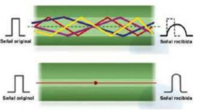
    <figcaption style="font-size: 0.9em; text-align: center;">Comparación entre fibra multimodo y monomodo: dispersión modal</figcaption>
  </figure>

**Multimodo (MM):**

- Se emiten varios haces de luz con diferentes trayectorias
- El emisor que se utiliza para este tipo de fibra es el diodo LED
- El diámetro del núcleo oscila entre 50 y 63 μm
- Más económico pero con limitaciones de distancia

**Monomodo (SM):**

- Se emite un haz de luz en una trayectoria única
- Para conseguir este tipo de emisión se utiliza luz láser
- Se reduce el diámetro del núcleo hasta unos 9 μm
- Mayor coste pero mejor rendimiento a largas distancias

🏗️ **Estructura de los cables de fibra óptica**

Los cables de fibra óptica se clasifican según su diseño estructural en dos tipos principales:

  <figure>
    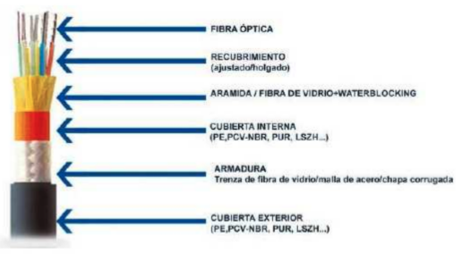
    <figcaption style="font-size: 0.9em; text-align: center;">Estructura de un cable de fibra óptica</figcaption>
  </figure>

###### 📦 **Cable de estructura holgada (Loose-tube)**

**Aplicación:** Interiores y exteriores de edificios

**Características:**

- Compuesto por varios tubos de 2-3 mm de diámetro
- Cada tubo contiene múltiples fibras en su interior
- El interior del tubo puede estar relleno de gel hidrófugo para protección
- El núcleo del cable incorpora un elemento de refuerzo (varilla de acero, hilos de aramida, etc.)
- Mayor flexibilidad y resistencia a la tensión
- Ideal para instalaciones subterráneas y aéreas

###### 🎯 **Cable de estructura ajustada (Tight-buffered)**

**Aplicación:** Principalmente para interiores de edificios

**Características:**

- Compuesto por una o varias fibras individuales
- Cada fibra posee su propio recubrimiento protector
- Integración en un cuerpo dieléctrico central
- Recubrimiento exterior de fibras de aramida
- Protección plástica final
- Mayor facilidad de instalación en espacios reducidos
- Menor resistencia a la tensión que la estructura holgada

<!-- **Comparación general:**

La estructura de un cable de fibra óptica puede representarse mediante esquemas que muestran la disposición de estos componentes según el tipo de diseño empleado. -->

###### 📊 Clasificación según estándares

La fibra óptica se encuentra estandarizada en la norma **TIA/EIA-568-C**, que define los siguientes tipos:

| Tipo de fibra | Descripción | Diámetro del núcleo | Diámetro del revestimiento | Máxima distancia |
|---------------|-------------|-------------------|---------------------------|------------------|
| **OM1** | MM | 62,5 μm | 125 μm | 33 m (1 Gbps), 275 m (100 Mbps) |
| **OM2** | MM | 50 μm | 125 μm | 82 m (1 Gbps), 550 m (100 Mbps) |
| **OM3** | MM optimizada para láser | 50 μm | 125 μm | 300 m (10 Gbps), 1000 m (1 Gbps) |
| **OM4** | MM optimizada para láser | 50 μm | 125 μm | 400 m (10 Gbps), 1000 m (1 Gbps) |
| **OS1** | SM | 9 μm | 125 μm | 10 km+ (1 Gbps), 40 km+ (100 Mbps) |

###### 📏 Distancias y velocidades

En función de la distancia a cubrir y la velocidad de transmisión deseada, se utiliza un tipo de fibra u otro:

| Velocidad | 300 m | 500 m | 1000 m | 2000 m |
|-----------|-------|-------|--------|--------|
| **100 Mbps** | OM1 | OM1 | OM1 | OS1 |
| **1 Gbps** | OM1 | OM2 | OM3/OM4 | OS1 |
| **10 Gbps** | OM3 | OM4 | OS1 | OS1 |

###### 🔌 Conectores para la fibra óptica

Los conectores de fibra óptica también son variados. Sirven para los dos tipos de fibra (SM y MM) y pueden conectarse mediante mecanismos de anclaje, enroscado, presión o el sistema del conector RJ, con pestaña para engancharse al conector hembra.

Los principales tipos de conector para fibra óptica que podemos encontrar en redes son:

<!-- | Conector | Sistema | Nº fibras | Aplicaciones típicas |
|----------|---------|----------|---------------------|
| **ST** | Anclaje en giro | 1 | Redes de área local |
| **FC** | Rosca | 1 | Redes de datos y telecomunicaciones |
| **SC** | Presión | 1 | Circuito de TV, comprobación de equipos |
| **LC** | Anclaje con pestaña | 1 | Redes Gigabit Ethernet, multimedia |
| **MU** | Presión | 1 | Fines médicos y militares |
| **MT-RJ** | Anclaje con pestaña | 2 | Redes Gigabit Ethernet, redes ATM |
| **MPO** | Presión (grupos de 4 a 24) | 4-24 | Redes con alto número de conexiones | -->

<figure>
  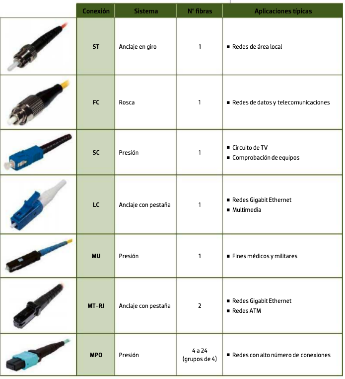
  <figcaption>Diferentes tipos de conectores de fibra óptica utilizados en redes</figcaption>
</figure>

---

### 📡 Medios no guiados

Los medios no guiados transportan ondas electromagnéticas sin el empleo de un conductor físico. Estas ondas se propagan a través del aire, el vacío o el agua, utilizando diferentes frecuencias del espectro electromagnético.

Antes de adentrarnos en las distintas bandas de frecuencia y sus usos en comunicaciones inalámbricas, es importante comprender cómo las ondas electromagnéticas abarcan un amplio espectro que va desde las frecuencias más bajas utilizadas en comunicaciones especiales hasta frecuencias extremadamente elevadas para aplicaciones avanzadas. 

La siguiente imagen ilustra el espectro electromagnético, mostrando cómo cada intervalo de frecuencia se destina a diferentes tecnologías y servicios de comunicación, desde la radio y la televisión hasta la telefonía móvil y los sistemas de radar. Visualizar este espectro nos permite entender la variedad y el alcance de los medios no guiados en las telecomunicaciones modernas.

<figure>
  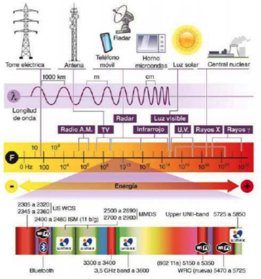
  <figcaption>Espectro electromagnético y bandas de frecuencia para comunicaciones inalámbricas</figcaption>
</figure>

##### 📡 Bandas de frecuencia

El espectro electromagnético está controlado por las autoridades locales en materia de telecomunicaciones. Los dispositivos inalámbricos trabajan en una banda de frecuencia concreta, que lleva asociada un ancho de banda:

| Banda de frecuencia | Frecuencia | Longitud de onda | Aplicaciones |
|-------------------|------------|------------------|--------------|
| **ELF** (Extremely Low Frequency) | < 3 kHz | > 100 km | Comunicaciones submarinas |
| **VLF** (Very Low Frequency) | 3 - 30 kHz | 100 - 10 km | Navegación, radio AM |
| **LF** (Low Frequency) | 30 - 300 kHz | 10 - 1 km | Radio AM de onda larga |
| **MF** (Medium Frequency) | 300 kHz - 3 MHz | 1 km - 100 m | Radio AM de onda media |
| **HF** (High Frequency) | 3 - 30 MHz | 100 - 10 m | Radio AM de onda corta |
| **VHF** (Very High Frequency) | 30 - 300 MHz | 10 - 1 m | Radio FM, TV analógica |
| **UHF** (Ultra High Frequency) | 300 MHz - 3 GHz | 1 m - 10 cm | TV digital, telefonía móvil |
| **SHF** (Super High Frequency) | 3 - 30 GHz | 10 - 1 cm | Satélites, radar |
| **EHF** (Extremely High Frequency) | 30 - 300 GHz | 1 - 0,1 cm | Comunicaciones militares |

!!! info "<strong>REGULACIÓN EN ESPAÑA</strong>"
    
    En España esta regulación la ejerce el Ministerio de Industria, Energía y Turismo, a través de la Secretaría de Estado de Telecomunicaciones, de acuerdo a los tratados de las organizaciones internacionales.
    

## 📡 **¿Por qué es importante conocer las bandas de frecuencia?**

Las **bandas de frecuencia** son como "carriles" en una autopista del espectro electromagnético. Cada banda tiene características específicas que la hacen ideal para ciertos tipos de comunicación.

### **🎯 ¿Cómo funciona la asignación de frecuencias?**

**Analogía práctica:**
Imagina el espectro electromagnético como una **gran autopista de comunicación**. Cada banda de frecuencia es un "carril" específico donde circulan diferentes tipos de señales:

- **🛥️ Carril de baja velocidad (VLF/LF)**: Para comunicaciones submarinas y navegación
- **🚗 Carril medio (MF/HF)**: Para radio AM y comunicaciones de larga distancia  
- **🏎️ Carril rápido (VHF/UHF)**: Para radio FM, TV y comunicaciones locales
- **🚁 Carril ultrarrápido (SHF/EHF)**: Para Wi-Fi, satélites y radar

### **⚖️ ¿Por qué hay regulación?**

**Problema sin regulación:**
Sin una organización clara, sería como tener todos los vehículos circulando por cualquier carril sin orden, causando:
- **Interferencias**: Las señales se mezclarían y se bloquearían entre sí
- **Ineficiencia**: No se aprovecharía bien el espacio disponible
- **Caos**: Imposible usar servicios como radio, TV o móvil

**Solución con regulación:**
- **Asignación específica**: Cada servicio tiene su banda reservada
- **Uso ordenado**: Evita interferencias entre diferentes tecnologías
- **Eficiencia máxima**: Aprovecha todo el espectro disponible

### **📋 Ejemplos prácticos:**

| Servicio | Banda asignada | ¿Por qué esta banda? |
|----------|----------------|----------------------|
| **Radio FM** | VHF (88-108 MHz) | Propagación local estable |
| **Televisión** | UHF (470-862 MHz) | Buena calidad de imagen |
| **Wi-Fi** | 2.4 GHz / 5 GHz | Balance entre alcance y velocidad |
| **Móvil 4G/5G** | 700 MHz - 3.5 GHz | Optimizado para datos |

A continuación se describen las **principales bandas de frecuencia** utilizadas en las comunicaciones inalámbricas:

###### 📻 Radioondas

Las radioondas operan entre las bandas ELF (Extremely Low Frequency) y UHF (Ultra High Frequency), cubriendo un amplio rango del espectro electromagnético. Estas ondas se caracterizan por su capacidad de propagación omnidireccional y su resistencia a las condiciones meteorológicas adversas, lo que las convierte en ideales para comunicaciones de larga distancia.

**Características principales:**

- **Propagación**: Se transmiten en todas las direcciones desde la antena emisora
- **Resistencia**: Apenas son sensibles a las inclemencias meteorológicas
- **Alcance**: Pueden cubrir grandes distancias, especialmente las de baja frecuencia
- **Penetración**: Las frecuencias más bajas pueden atravesar obstáculos naturales

Los ejemplos más representativos de este tipo de ondas son la radio en AM (que utiliza en las bandas bajas) o la radio en FM y la televisión (que utilizan en las bandas altas).

###### 🛰️ Microondas

Las microondas operan entre las bandas UHF (Ultra High Frequency) y EHF (Extremely High Frequency), cubriendo frecuencias desde 300 MHz hasta 300 GHz. Estas ondas electromagnéticas se caracterizan por su naturaleza direccional y su capacidad para transportar grandes cantidades de información.

**Características técnicas:**

- **Direccionalidad**: Requieren alineación precisa entre emisor y receptor
- **Antenas**: Utilizan antenas parabólicas para concentrar y dirigir la señal
- **Ancho de banda**: Permiten transmisiones de alta velocidad de datos
- **Propagación**: Sufren atenuación por obstáculos físicos

**Tipos de comunicación por microondas:**

**1. Microondas terrestres:**

- Comunicación directa punto a punto
- Antenas enfrentadas para distancias relativamente cortas
- Aplicaciones: enlaces entre edificios, comunicaciones corporativas

**2. Microondas por satélite:**

- Comunicación mediante satélites artificiales
- El satélite actúa como repetidor: recibe, amplifica y retransmite
- Permite cobertura global y comunicaciones intercontinentales
- Aplicaciones: televisión por satélite, telefonía internacional, internet satelital

###### 🔴 Infrarrojos

Los infrarrojos constituyen una forma de radiación electromagnética no visible al ojo humano, operando en frecuencias entre 300 GHz y 384 THz (longitudes de onda de 1 mm a 780 nm). Esta tecnología se caracteriza por su naturaleza direccional y su limitado alcance, lo que la hace ideal para comunicaciones de corta distancia.

**Características principales:**

- **Frecuencia**: 300 GHz - 384 THz
- **Longitud de onda**: 1 mm - 780 nm
- **Direccionalidad**: Requiere línea de visión directa entre dispositivos
- **Alcance**: Limitado a unos pocos metros
- **Seguridad**: No atraviesa paredes, proporcionando aislamiento natural

**Tipos de comunicación por infrarrojos:**

**1. Comunicación por haz directo:**

- Requiere línea de visión completamente despejada
- Sin obstáculos entre emisor y receptor
- Máxima eficiencia y velocidad de transmisión
- Ejemplo: mandos a distancia de televisión

**2. Comunicación por haz difuso:**

- Utiliza rebotes en superficies para superar obstáculos menores
- Mayor potencia de emisión para compensar pérdidas por reflexión
- Menor eficiencia pero mayor flexibilidad de posicionamiento
- Aplicaciones: sistemas de control domótico

###### 🌐 Banda ISM (Industrial, Scientific and Medical)

La banda ISM constituye una porción del espectro electromagnético reservada para aplicaciones industriales, científicas y médicas de uso libre, sin necesidad de licencia gubernamental. Estas bandas están diseñadas para permitir el desarrollo de tecnologías de comunicación sin restricciones regulatorias.

**Características principales:**

- **Uso libre**: No requiere licencia para su utilización
- **Segmentación**: Dividida en canales que varían según la normativa nacional
- **Interferencias**: Posibles interferencias entre dispositivos debido al uso compartido
- **Potencia limitada**: Restricciones de potencia para evitar interferencias excesivas

**Bandas ISM principales:**

- **2,4 GHz**: La más utilizada globalmente (Wi-Fi, Bluetooth, ZigBee)
- **5 GHz**: Bandas adicionales para Wi-Fi de alta velocidad
- **868 MHz**: Utilizada en Europa para dispositivos de baja potencia
- **915 MHz**: Utilizada en América para aplicaciones industriales

###### 🌈 Luz visible

La **luz visible** abarca el rango del espectro electromagnético perceptible por el ojo humano, con longitudes de onda entre aproximadamente 380 y 750 nm (frecuencias de ~400 a 790 THz). Aunque rara vez se utiliza para comunicaciones convencionales, existen aplicaciones específicas de la luz visible en transmisión de datos, conocidas como **comunicaciones por luz visible (VLC, por sus siglas en inglés)**.

**Características principales:**

- **Longitud de onda**: 380–750 nm
- **Transporte de información**: Mediante modulación de la intensidad luminosa, imperceptible al ojo humano
- **Direccionalidad**: La luz visible requiere línea de visión entre transmisor y receptor, similar a los infrarrojos
- **Seguridad**: Limitada a zonas iluminadas y sin obstáculos opacos

###### ☢️ Rayos X y Rayos Gamma

Los **rayos X** y **rayos gamma** son formas de radiación electromagnética de muy alta frecuencia y energía (longitudes de onda extremadamente cortas, menores a 10 nm para rayos X y menores a 0,01 nm para rayos gamma).

**Características principales:**

- **Rayos X**: Longitud de onda 0,01–10 nm (~30 PHz–30 EHz); se producen por la desaceleración de electrones en los tubos de rayos X.
- **Rayos gamma**: Longitud de onda <0,01 nm (>30 EHz); emitidos por desintegración nuclear o procesos astrofísicos.
- **Altamente penetrantes** en la materia, con gran capacidad para atravesar materiales densos.
- **Energía ionizante**: pueden modificar la estructura atómica de los materiales que atraviesan.

!!! warning "Nota"
    Dada su peligrosidad y capacidad ionizante, no se emplean habitualmente para comunicaciones de datos convencionales, excepto en contextos científicos muy especializados (como comunicación desde sondas espaciales en ciertas circunstancias).

**Regulación en España:**

La atribución de bandas de frecuencias se recoge en el **Cuadro Nacional de Atribución de Frecuencias (CNAF)**, documento oficial disponible en la [página web del Ministerio de Industria, Energía y Turismo](https://avance.digital.gob.es/espectro/Paginas/cnaf.aspx). Es importante verificar la compatibilidad de dispositivos entre países, ya que las asignaciones pueden variar según la normativa local.

> Las aplicaciones prácticas de las distintas bandas del espectro electromagnético abarcan desde las telecomunicaciones (radio, televisión, telefonía móvil, Wi-Fi o satélites) hasta el control de dispositivos electrónicos y la transmisión de datos mediante tecnologías como los infrarrojos, microondas o la luz visible. A continuación se presentan ejemplos representativos de cada una de estas aplicaciones.

-   :material-radio:{ .lg .middle } **Radioondas**

    ---

    | Banda | Aplicación |
    |-------|------------|
    | VLF | Comunicaciones en navegación y submarinos |
    | LF | Radio AM de onda larga |
    | MF | Radio AM de onda media |
    | HF | Radio AM de onda corta |
    | VHF | Radio FM |
    | UHF | TDT (Televisión Digital Terrestre) |

-   :material-satellite-variant:{ .lg .middle } **Microondas**

    ---

    | Banda | Aplicación |
    |-------|------------|
    | SHF | Bluetooth y ZigBee (redes WPAN) |
    | | Comunicaciones con radares |
    | | Redes WLAN y WiMAX |
    | | TV por satélite |
    | | Transmisión telefónica |

-   :material-remote:{ .lg .middle } **Infrarrojos**

    ---

    | Banda | Aplicación |
    |-------|------------|
    | IR | Mandos a distancia |
    | | Sistemas de control domótico |
    | | Comunicación entre dispositivos |

-   :material-wifi:{ .lg .middle } **Banda ISM**

    ---

    | Banda | Aplicación |
    |-------|------------|
    | 2,4 GHz | Wi-Fi, Bluetooth |
    | 5 GHz | Wi-Fi de alta velocidad |
    | 868 MHz | Dispositivos IoT (Europa) |
    | 915 MHz | Aplicaciones industriales (América) |

-   :material-lightbulb:{ .lg .middle } **Luz Visible**

    ---

    | Banda | Aplicación |
    |-------|------------|
    | 400-700 nm | Comunicaciones ópticas |
    | | Fibra óptica |
    | | Láser de comunicación |
    | | Sistemas Li-Fi |
    | | Comunicación submarina |

-   :material-atom:{ .lg .middle } **Rayos X/Gamma**

    ---

    | Banda | Aplicación |
    |-------|------------|
    | 10⁻¹⁰ - 10⁻¹² m | Comunicaciones espaciales |
    | | Telescopios espaciales |
    | | Comunicación interplanetaria |
    | | Investigación astronómica |
    | | Sistemas de navegación espacial |

#### 🌐 Estándares inalámbricos

La gran mayoría de los estándares inalámbricos están desarrollados por el grupo de trabajo **IEEE 802** del Instituto de Ingenieros Eléctricos y Electrónicos. Estos estándares definen las especificaciones técnicas para diferentes tipos de redes inalámbricas, garantizando la interoperabilidad entre dispositivos de diferentes fabricantes.

Los estándares IEEE 802 se organizan según el tipo de red y su alcance:

- **802.11**: Redes de área local inalámbricas (WLAN)
- **802.15**: Redes de área personal inalámbricas (WPAN)
- **802.16**: Redes de área metropolitana inalámbricas (WMAN)
- **802.20**: Redes de área amplia inalámbricas (WWAN)

##### 📱 Estándar para redes WPAN (IEEE 802.15)

El estándar **IEEE 802.15** define las especificaciones para redes de área personal inalámbricas (WPAN), diseñadas para comunicaciones de corta distancia entre dispositivos personales. Se divide en varios grupos especializados:

**Grupos principales:**

-   **🔵 IEEE 802.15.1**

    ---

    **Bluetooth**
    
    Tecnología más extendida para comunicaciones de corta distancia entre dispositivos personales.

-   **⚡ IEEE 802.15.3**

    ---

    **Ultra Wideband (UWB)**
    
    Tecnología de alta velocidad para transmisión de datos de gran ancho de banda.

-   **🕸️ IEEE 802.15.4**

    ---

    **ZigBee**
    
    Protocolo para redes de sensores de baja potencia y dispositivos IoT.

###### 🔵 Bluetooth (IEEE 802.15.1)

**Bluetooth** es la tecnología WPAN más utilizada, diseñada para reemplazar cables en comunicaciones de corta distancia. **Destacamos esta tecnología** porque ha logrado una integración universal en dispositivos móviles, ordenadores y accesorios, permitiendo la transmisión inalámbrica de voz, datos y audio de manera eficiente, sencilla y con bajo consumo energético. Además, utiliza una arquitectura de red específica llamada **piconet**.

**Arquitectura de red:**

- **Piconet**: Red de hasta 8 dispositivos (1 maestro + 7 esclavos)
- **Maestro**: Coordina la comunicación y gestiona los tiempos
- **Esclavos**: Dispositivos que responden a las solicitudes del maestro
- **Scatternet**: Red formada por múltiples piconets interconectadas

**Características técnicas:**

- **Frecuencia**: 2,4 GHz (banda ISM)
- **Ancho de banda**: 79 canales de 1 MHz cada uno
- **Modulación**: FHSS (Frequency Hopping Spread Spectrum)
- **Potencia**: Variable según la clase del dispositivo

**Clases de potencia Bluetooth:**

| Clase | Potencia máxima | Rango típico | Aplicaciones |
|-------|-----------------|--------------|--------------|
| **Clase 1** | 100 mW (20 dBm) | ~100 m | Dispositivos industriales, puntos de acceso |
| **Clase 2** | 2,5 mW (4 dBm) | ~10 m | Teléfonos móviles, auriculares |
| **Clase 3** | 1 mW (0 dBm) | ~1 m | Dispositivos de muy corta distancia |

**Versiones principales:**

-   **📱 Bluetooth 1.x**

    ---

    **Versión Básica**
    
    | Característica | Especificación |
    |----------------|----------------|
    | **Velocidad** | 1 Mbps |
    | **Año** | 1999-2001 |
    | **Aplicación** | Datos básicos |
    | **Limitación** | Velocidad baja |

-   **⚡ Bluetooth 2.0 + EDR**

    ---

    **Enhanced Data Rate**
    
    | Característica | Especificación |
    |----------------|----------------|
    | **Velocidad** | 3 Mbps |
    | **Año** | 2004 |
    | **Mejora** | Triple velocidad |
    | **Uso** | Audio, datos |

-   **🚀 Bluetooth 3.0 + HS**

    ---

    **High Speed**
    
    | Característica | Especificación |
    |----------------|----------------|
    | **Velocidad** | 24 Mbps |
    | **Año** | 2009 |
    | **Tecnología** | Wi-Fi asistido |
    | **Aplicación** | Transferencias grandes |

-   **🔋 Bluetooth 4.0**

    ---

    **Low Energy (BLE)**
    
    | Característica | Especificación |
    |----------------|----------------|
    | **Enfoque** | Baja energía |
    | **Año** | 2010 |
    | **Aplicación** | IoT, wearables |
    | **Ventaja** | Batería extendida |

-   **🔥 Bluetooth 5.0**

    ---

    **Mayor Alcance y Velocidad**
    
    | Característica | Especificación |
    |----------------|----------------|
    | **Alcance** | 4x mayor |
    | **Velocidad** | 2x mayor |
    | **Año** | 2016 |
    | **Aplicación** | IoT avanzado |

-   **📊 Evolución**

    ---

    **Progresión Tecnológica**
    
    | Aspecto | Progresión |
    |---------|------------|
    | **Velocidad** | 1 → 3 → 24 Mbps |
    | **Energía** | Alta → Baja |
    | **Alcance** | Corto → Extendido |
    | **Uso** | Datos → IoT |

##### 📶 Estándar para redes WLAN (IEEE 802.11)

El estándar **IEEE 802.11** es la base fundamental para las redes de área local inalámbricas (Wi-Fi), representando la referencia principal en conectividad inalámbrica tanto en hogares como en empresas de todo el mundo. 

Su importancia radica en que ha permitido la universalización del acceso inalámbrico a Internet y redes, transformando la forma en que nos comunicamos y trabajamos. 

Gracias a sus continuas actualizaciones desde 1997, ha impulsado avances tecnológicos significativos en velocidad, capacidad y eficiencia, consolidándose como pilar imprescindible de la sociedad conectada actual.

**Evolución de los estándares Wi-Fi:**

<!-- | Estándar | Año | Frecuencia | Velocidad teórica | Características principales |
|----------|-----|------------|-------------------|----------------------------|
| **802.11** | 1997 | 2,4 GHz | 2 Mbps | Estándar original |
| **802.11a** | 1999 | 5 GHz | 54 Mbps | Primer estándar de alta velocidad |
| **802.11b** | 1999 | 2,4 GHz | 11 Mbps | Más extendido inicialmente |
| **802.11g** | 2003 | 2,4 GHz | 54 Mbps | Compatible con 802.11b |
| **802.11n** | 2009 | 2,4/5 GHz | 600 Mbps | MIMO, doble banda |
| **802.11ac** | 2013 | 5 GHz | 6,77 Gbps | MU-MIMO, canales amplios |
| **802.11ax** | 2019 | 2,4/5/6 GHz | 9,6 Gbps | Wi-Fi 6, OFDMA |
| **802.11be** | 2024 | 2,4/5/6 GHz | 46 Gbps | Wi-Fi 7, canales 320 MHz | -->

<!-- **Estándares principales detallados:** -->

-   **📱 IEEE 802.11a**

    ---

    **Wi-Fi 2 (1999)**
    
    | Característica | Especificación |
    |----------------|----------------|
    | **Bandas** | Solo 5 GHz |
    | **Velocidad** | Hasta 54 Mbps |
    | **Tecnología** | OFDM, 12 canales |
    | **Ventaja** | Menos interferencias |

-   **📶 IEEE 802.11g**

    ---

    **Wi-Fi 3 (2003)**
    
    | Característica | Especificación |
    |----------------|----------------|
    | **Bandas** | Solo 2,4 GHz |
    | **Velocidad** | Hasta 54 Mbps |
    | **Tecnología** | OFDM |
    | **Compatibilidad** | Con 802.11b |

-   **📡 IEEE 802.11n**

    ---

    **Wi-Fi 4 (2009)**
    
    | Característica | Especificación |
    |----------------|----------------|
    | **Bandas** | 2,4 GHz y 5 GHz |
    | **Velocidad** | Hasta 600 Mbps |
    | **Tecnología** | MIMO, canales 40 MHz |
    | **Compatibilidad** | Retrocompatible |

-   **🚀 IEEE 802.11ac**

    ---

    **Wi-Fi 5 (2013)**
    
    | Característica | Especificación |
    |----------------|----------------|
    | **Bandas** | Solo 5 GHz |
    | **Velocidad** | Hasta 6,77 Gbps |
    | **Tecnología** | MU-MIMO, 160 MHz |
    | **Modulación** | 256-QAM |

-   **⚡ IEEE 802.11ax**

    ---

    **Wi-Fi 6 (2019)**
    
    | Característica | Especificación |
    |----------------|----------------|
    | **Bandas** | 2,4/5/6 GHz |
    | **Velocidad** | Hasta 9,6 Gbps |
    | **Tecnología** | OFDMA, TWT |
    | **Optimización** | IoT, interferencias |

-   **🔥 IEEE 802.11be**

    ---

    **Wi-Fi 7 (2024)**
    
    | Característica | Especificación |
    |----------------|----------------|
    | **Bandas** | 2,4/5/6 GHz |
    | **Velocidad** | Hasta 46 Gbps |
    | **Tecnología** | Multi-Link, 320 MHz |
    | **Modulación** | 4096-QAM |

<!-- ##### 🔄 Tecnología MIMO (Multiple Input, Multiple Output)

La tecnología **MIMO** (Multiple Input, Multiple Output) es una técnica de comunicación inalámbrica que utiliza múltiples antenas tanto en el transmisor como en el receptor para mejorar significativamente el rendimiento de la comunicación.

**Principios fundamentales:**

**1. Diversidad espacial:**

- Utiliza múltiples antenas para crear diferentes caminos de señal
- Reduce los efectos de desvanecimiento y interferencias
- Mejora la confiabilidad de la comunicación

**2. Multiplexación espacial:**

- Transmite múltiples flujos de datos simultáneamente
- Aumenta la capacidad total del canal
- Permite velocidades de transmisión más altas

**3. Formación de haz (Beamforming):**

- Dirige la señal hacia el receptor específico
- Reduce interferencias hacia otros dispositivos
- Mejora la eficiencia energética

**Configuraciones MIMO comunes:**

| Configuración | Antenas TX | Antenas RX | Vías de comunicación | Aplicación típica |
|---------------|------------|------------|---------------------|-------------------|
| **1×1** | 1 | 1 | 1 | Dispositivos básicos |
| **2×2** | 2 | 2 | 4 | Smartphones, tablets |
| **3×3** | 3 | 3 | 9 | Laptops, routers domésticos |
| **4×4** | 4 | 4 | 16 | Routers empresariales |
| **8×8** | 8 | 8 | 64 | Puntos de acceso profesionales |

**Ventajas de MIMO:**

- **Mayor velocidad**: Transmisión paralela de datos
- **Mejor alcance**: Compensación de pérdidas de señal
- **Reducción de errores**: Diversidad espacial
- **Eficiencia espectral**: Mejor uso del espectro disponible
- **Robustez**: Resistencia a interferencias y obstáculos

**Tipos de MIMO:**

**MIMO SU (Single User):**

- Un usuario utiliza todas las antenas
- Máximo rendimiento para un dispositivo
- Ideal para aplicaciones de alta velocidad

**MIMO MU (Multi User):**

- Múltiples usuarios comparten las antenas
- Eficiencia mejorada en entornos densos
- Introducido en IEEE 802.11ac

**Limitaciones y consideraciones:**

- **Complejidad**: Mayor costo y consumo energético
- **Espacio**: Requiere más espacio físico para antenas
- **Procesamiento**: Mayor complejidad computacional
- **Compatibilidad**: Dispositivos deben soportar la misma configuración -->

##### 🌐 Estándar para redes WMAN (IEEE 802.16)

El estándar **IEEE 802.16** define las especificaciones para redes de área metropolitana inalámbricas (WMAN), conocidas comercialmente como **WiMAX** (Worldwide Interoperability for Microwave Access). Esta tecnología fue diseñada para proporcionar conectividad de banda ancha inalámbrica de larga distancia.

**Características técnicas principales:**

**Frecuencias de operación:**

- **Bandas licenciadas**: 2,3 - 2,7 GHz, 3,3 - 3,8 GHz
- **Bandas no licenciadas**: 5,8 GHz (limitado)
- **Flexibilidad**: Adaptable a diferentes bandas según región

**Capacidades de cobertura:**

- **Alcance típico**: 10-50 km (dependiendo de condiciones)
- **Cobertura urbana**: 1-5 km con alta densidad
- **Cobertura rural**: Hasta 50 km en condiciones óptimas
- **Movilidad**: Soporte para dispositivos en movimiento

**Rendimiento:**

- **Velocidad máxima**: Hasta 75 Mbps (802.16m)
- **Latencia**: 5-20 ms típica
- **Eficiencia espectral**: Mejorada con MIMO y OFDMA

###### **Arquitectura de red:**

**Componentes principales:**

- **Base Station (BS)**: Estación base que proporciona cobertura
- **Subscriber Station (SS)**: Dispositivo del usuario final
- **Backhaul**: Conexión de la estación base a la red troncal
- **Gateway**: Punto de acceso a Internet y servicios

**Tipos de despliegue:**

**WiMAX Fijo (802.16d):**
- Instalación permanente en edificios
- Antenas direccionales de alta ganancia
- Mayor alcance y estabilidad
- Ideal para acceso residencial y empresarial

**WiMAX Móvil (802.16e):**
- Dispositivos portátiles y móviles
- Handover entre estaciones base
- Menor alcance pero mayor movilidad
- Competencia directa con tecnologías celulares

**Ventajas de WiMAX:**

- **Cobertura amplia**: Ideal para zonas rurales y remotas
- **Despliegue rápido**: Menor infraestructura que fibra
- **Flexibilidad**: Adaptable a diferentes necesidades
- **Calidad de servicio**: Soporte para aplicaciones críticas
- **Escalabilidad**: Fácil expansión de cobertura

**Limitaciones y desafíos:**

- **Competencia**: Presión de LTE y 5G
- **Costos**: Inversión inicial significativa
- **Interferencias**: Sensible a obstáculos físicos
- **Adopción**: Menor penetración que tecnologías celulares
- **Espectro**: Dependencia de asignaciones regulatorias

**Aplicaciones actuales:**

- **Acceso rural**: Conectividad en zonas sin fibra
- **Backhaul**: Conexión de estaciones base celulares
- **Emergencias**: Comunicaciones de emergencia y seguridad
- **IoT**: Conectividad para dispositivos industriales
- **Backup**: Red de respaldo para empresas críticas

**Evolución de los estándares WiMAX:**

-   **📡 IEEE 802.16**

    ---

    **Estándar Original (2001)**
    
    | Característica | Especificación |
    |----------------|----------------|
    | **Visión** | Línea de visión requerida |
    | **Aplicación** | Backhaul fijo |
    | **Tecnología** | Base para WiMAX |
    | **Limitación** | Solo entornos despejados |

-   **🏠 IEEE 802.16a**

    ---

    **Sin Línea de Visión (2003)**
    
    | Característica | Especificación |
    |----------------|----------------|
    | **Visión** | Sin línea de visión (NLOS) |
    | **Aplicación** | Acceso residencial |
    | **Ventaja** | Mayor flexibilidad |
    | **Uso** | Entornos urbanos |

-   **🔧 IEEE 802.16d**

    ---

    **WiMAX Fijo (2004)**
    
    | Característica | Especificación |
    |----------------|----------------|
    | **Tipo** | Fijo, estabilización |
    | **Aplicación** | WiMAX fijo |
    | **Estabilidad** | Alta confiabilidad |
    | **Instalación** | Permanente |

-   **📱 IEEE 802.16e**

    ---

    **WiMAX Móvil (2005)**
    
    | Característica | Especificación |
    |----------------|----------------|
    | **Movilidad** | Limitada |
    | **Aplicación** | WiMAX móvil |
    | **Handover** | Entre estaciones |
    | **Competencia** | Tecnologías celulares |

-   **🚀 IEEE 802.16m**

    ---

    **4G WiMAX (2011)**
    
    | Característica | Especificación |
    |----------------|----------------|
    | **Generación** | 4G |
    | **Velocidad** | Alta velocidad |
    | **Aplicación** | Competencia LTE |
    | **Tecnología** | Avanzada |

-   **📊 Comparativa**

    ---

    **Resumen Evolutivo**
    
    | Aspecto | Progresión |
    |---------|------------|
    | **Visión** | LOS → NLOS |
    | **Movilidad** | Fijo → Móvil |
    | **Velocidad** | Básica → 4G |
    | **Aplicación** | Backhaul → Consumo |

##### 📱 Estándar para redes WWAN

Las redes **WWAN** (Wide Area Wireless Network) constituyen la infraestructura fundamental de las telecomunicaciones móviles modernas, basadas en tecnologías celulares que han evolucionado significativamente desde sus inicios. Estas redes abarcan desde las primeras implementaciones analógicas (**1G**) hasta las tecnologías digitales avanzadas actuales (**4G LTE**) y las emergentes redes de quinta generación (**5G**).

La **tecnología 5G** representa un salto cuántico en las comunicaciones móviles, prometiendo velocidades hasta **100 veces superiores** a 4G LTE, latencias inferiores a 1 milisegundo, y capacidad para conectar millones de dispositivos por kilómetro cuadrado. Esta evolución no solo mejora la experiencia del usuario, sino que habilita nuevas aplicaciones como vehículos autónomos, cirugía remota, y ciudades inteligentes.

-   **📞 1G**

    ---

    **Primera Generación (1980s)**
    
    | Característica | Especificación |
    |----------------|----------------|
    | **Velocidad** | 2,4 Kb/s |
    | **Tipo** | Analógico |
    | **Aplicación** | Solo voz |
    | **Limitación** | Sin datos |

-   **📱 2G**

    ---

    **Segunda Generación (1990s)**
    
    | Característica | Especificación |
    |----------------|----------------|
    | **Velocidad** | 64 Kb/s |
    | **Tipo** | Digital |
    | **Estándares** | GSM, CDMA |
    | **Novedad** | SMS |

-   **🌐 3G**

    ---

    **Tercera Generación (2003)**
    
    | Característica | Especificación |
    |----------------|----------------|
    | **Velocidad** | 2 Mb/s |
    | **Aplicación** | Voz + datos |
    | **Novedad** | Internet móvil |
    | **Uso** | Navegación web |

-   **🚀 4G**

    ---

    **Cuarta Generación (2009)**
    
    | Característica | Especificación |
    |----------------|----------------|
    | **Velocidad** | 100 Mb/s |
    | **Tecnología** | LTE |
    | **Protocolo** | IP |
    | **Aplicación** | Banda ancha móvil |

-   **⚡ 5G**

    ---

    **Quinta Generación (2020s)**
    
    | Característica | Especificación |
    |----------------|----------------|
    | **Velocidad** | 1+ Gb/s |
    | **Latencia** | <1 ms |
    | **IoT** | Millones dispositivos |
    | **Aplicación** | Vehículos autónomos |

-   **📊 Comparativa**

    ---

    **Evolución Tecnológica**
    
    | Aspecto | Progresión |
    |---------|------------|
    | **Velocidad** | Kb/s → Gb/s |
    | **Tipo** | Analógico → Digital |
    | **Uso** | Voz → IoT |
    | **Aplicación** | Básico → Avanzado |

<!-- > El siguiente esquema resume claramente el avance tecnológico de las diferentes generaciones de redes móviles, desde los sistemas analógicos iniciales hasta las actuales capacidades del 5G. Gracias a esta evolución, las comunicaciones móviles han pasado de ofrecer únicamente servicios de voz a permitir conexiones de alta velocidad, baja latencia y soporte masivo para dispositivos IoT, impulsando el desarrollo de nuevas aplicaciones y transformando la sociedad digital.

<figure>
  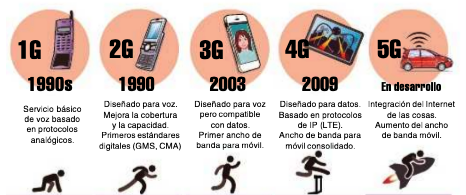
  <figcaption>Evolución de las generaciones de redes móviles de 1G a 5G</figcaption>
</figure> -->

<!-- 
## ⚙️ Electrónica de red

Se entiende por **electrónica de red** cualquier dispositivo de la red que cumple una función específica, y que habitualmente puede configurarse para que esta función varíe.

Es común que la electrónica de red se concentre en los armarios de distribución, pero no siempre es así. En unos casos por motivos de infraestructura y en otros por propia operatividad de los dispositivos, los elementos de electrónica de red pueden encontrarse en cualquier punto de la red.

A continuación detallamos algunos de los principales elementos de electrónica de red.

### 📡 Repetidor

El **repetidor** es uno de los elementos de electrónica de red más simples. Su función es captar una señal y enviarla, sin darle ningún tratamiento más allá de la amplificación. Por este motivo, el repetidor trabaja en la **capa 1** del modelo OSI.

En una red utilizaremos repetidores cuando, por el motivo que sea, haya zonas de la red donde la señal no llegue con suficiente potencia. De esta manera se puede ampliar muy fácilmente el radio de acción de una red.

Es extraño encontrar repetidores rackeables. De hecho, cuando se colocan en el armario de distribución es en combinación con otros elementos de electrónica de red.

#### 📶 Aplicación en redes inalámbricas

La aplicación más conocida de los repetidores es amplificar la cobertura en redes inalámbricas. En este caso, el repetidor se ubica en un punto estratégico de la red que garantice que los equipos a los que se pretende dar cobertura reciban adecuadamente la señal.

Hay que evitar que en la red haya zonas de sombra y puntos muertos, donde la señal no llegue o llegue con deficiencia. El repetidor suele colocarse pues en zonas céntricas y bien comunicadas con los equipos a los que se va a dar servicio, así como con el dispositivo emisor de la señal a replicar.

El repetidor inalámbrico dispone de al menos una antena y una conexión de entrada RJ-45. Se puede utilizar de dos formas:

- **Con vínculo inalámbrico**: en cuyo caso la red que se quiere ampliar debe disponer de un elemento emisor al que se enlace el repetidor para amplificar la señal.
- **Con extensión cableada**: siendo el repetidor un dispositivo que está en el extremo de la red que se quiere ampliar.

<figure>
  
  <figcaption>Repetidor WiFi con alimentación PoE</figcaption>
</figure>

<figure>
  
  <figcaption>Modos de uso del repetidor: inalámbrico y cableado</figcaption>
</figure>

### 🔗 Concentrador (Hub)

El **concentrador** (o hub) es un dispositivo empleado para vincular tramos de red, favoreciendo la ampliación de redes.

Existe tanto en formato rackeable (ocupa 1 U) como independiente, aunque en ambos casos está en desuso.

El modelo más típico para redes es, como sucedía con los paneles de parcheo, de conexiones RJ-45. Sin embargo, hay hubs de muchos tipos de conexiones: coaxial, USB, HDMI, etc.

<figure>
  
  <figcaption>Concentrador o hub para interconexión de equipos</figcaption>
</figure>

El hub Ethernet tiene entre 4 y 48 tomas RJ-45. Los modelos rackeables tienen al menos 16 tomas RJ-45, con una toma especial en uno de los extremos, marcada como **Up-Link**.

En algunos modelos de concentrador, la toma Up-Link se comparte con una toma convencional; en este caso, se dispone también de un botón en el dispositivo que permite conmutar el estado de la toma entre los modos convencional y Up-Link.

<figure>
  
  <figcaption>Detalle de la toma Up-Link mediante botón conmutador</figcaption>
</figure>

La finalidad de la toma Up-Link es vincular dos hubs para poder extender la red. A esta operación se la denomina poner los hub en cascada y puede hacerse de dos maneras:

- **Con cable directo**: utilizando la toma Up-Link
- **Con cable cruzado**: utilizando tomas convencionales

<figure>
  
  <figcaption>Conexión en cascada de hubs con cable directo</figcaption>
</figure>

<figure>
  
  <figcaption>Conexión en cascada de hubs con cable cruzado</figcaption>
</figure>

Un hub, que trabaja en la **capa 1** del modelo OSI, funciona de forma parecida al repetidor: toda la información que llega a él proveniente de un equipo se replica a todas las tomas con cable, llegando así a todos los equipos conectados, de forma directa o indirecta, a la red.

El hecho de que no funcione en redes por encima de Fast-Ethernet (100 Mbps), unido al alto tráfico que produce en la red, con los consiguientes problemas de seguridad, hicieron que se reemplazase por el conmutador o switch, que estudiaremos a continuación.

### 🔄 Conmutador (Switch)

El **conmutador** (o switch) es un dispositivo cuya función es interconectar varios segmentos de red.

Al contrario que el hub, el switch opera en la **capa 2** del modelo OSI, y tiene la capacidad de interpretar la dirección de destino de los paquetes de información que llegan a él, y remitirlos al segmento que les corresponda.

<figure>
  
  <figcaption>Funcionamiento de un switch mostrando la conmutación de paquetes</figcaption>
</figure>

El switch integra un mecanismo de autoaprendizaje que le permite construir tablas con las direcciones MAC de los equipos presentes en cada segmento de red.

Cuando se envía un paquete de un segmento a otro, el switch lo detecta y lo deriva al segmento correspondiente. Cuando el equipo de destino está en el mismo segmento, el dispositivo lo detecta e impide que pase a otros segmentos. De esta manera se reduce considerablemente el tráfico en la red.

Este dispositivo se aplica típicamente a redes con topología de estrella y de árbol.

#### 🔌 Características del switch

Podemos encontrar conmutadores de cable coaxial o incluso de fibra óptica, pero los más comunes son los de cable de par trenzado, con grupos de 4 tomas RJ-45.

<figure>
  
  <figcaption>Switch de 8 puertos RJ-45 para pequeñas redes</figcaption>
</figure>

<figure>
  
  <figcaption>Switch rackeable de 48 puertos RJ-45 para redes empresariales</figcaption>
</figure>

El switch puede ser independiente o rackeable. Los switches rackeables, como sucedía con los concentradores, tienen más puertos y, frecuentemente, también más prestaciones. El switch rackeable ocupa de 2 U a 8 U, según el número de tomas y las prestaciones que tenga. Los más habituales tienen 24, 32 o 48 tomas.

<figure>
  
  <figcaption>Switch rackeable de 24 puertos con conexiones mixtas</figcaption>
</figure>

<figure>
  
  <figcaption>Switch rackeable de 48 puertos para centros de datos</figcaption>
</figure>

<figure>
  
  <figcaption>Detalle de cuatro puertos Gigabit-Ethernet: dos RJ-45 y dos de fibra óptica</figcaption>
</figure>

Otra característica interesante del switch es que puede trabajar a varias velocidades. Las más comunes son 10/100 (Ethernet/Fast-Ethernet), pero algunos ofrecen tomas especiales para Gigabit-Ethernet.

Algunos modelos de switch disponen de una o dos tomas de fibra óptica. Estos dispositivos pueden enlazar segmentos de red construidos en cable de par trenzado con segmentos de fibra óptica, o también vincular tramos de red utilizando fibra óptica como medio de conexión, lo cual puede ser muy útil en algunas instalaciones.

#### 🔗 Interconexión de switches

Dos o más switches pueden vincularse para formar un grupo de concentradores utilizando una de las siguientes opciones:

##### 🔗 Conexionado tradicional

Utilizando latiguillos de cable de par trenzado o fibra, según las características del switch. Esta técnica puede aplicarse a cualquier modelo de switch, siempre que tenga tomas suficientes para ello.

En este caso, la vinculación entre switches puede seguir la topología de estrella (se utiliza un switch como principal, donde se conectan los demás) o de árbol. Sin embargo, lo más habitual es una topología híbrida, donde algunos switches pueden llegar a formar anillos.

<figure>
  
  <figcaption>Switches conectados en topología de estrella</figcaption>
</figure>

<figure>
  
  <figcaption>Switches conectados en cadena</figcaption>
</figure>

##### ⚡ Conexionado de alta velocidad (Stack)

Utilizando los módulos de alta velocidad que algunos modelos tienen en su parte trasera. En este caso, el grupo de switches se denomina **stack** (pila). Para interconectar estos switches se utiliza un cable específico, y puede hacerse de dos formas: en cadena o en anillo (una cadena donde el último switch se vincula con el primero).

<figure>
  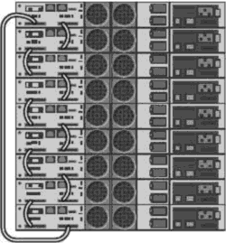
  <figcaption>Switches conectados en stack con topología de anillo</figcaption>
</figure>

<figure>
  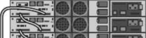
  <figcaption>Switches conectados en stack con topología de cadena</figcaption>
</figure>

<figure>
  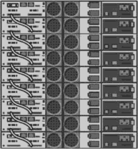
  <figcaption>Cable para conexionado de alta velocidad entre switches</figcaption>
</figure>

#### 🎛️ Switch gestionable

El switch tiene la capacidad de ofrecer prestaciones que no corresponden a la capa 2 del modelo OSI. En este caso hablamos de lo que se conoce como **switch gestionable** (managed switch).

Un switch gestionable incorpora características como la gestión de la red, seguridad, fiabilidad, control del rendimiento, etc. Cuando un switch gestionable tiene, por ejemplo, prestaciones propias de capa 3, se dice que es un **switch de capa 3** (o de nivel 3). Esto se podría aplicar a otras capas de la misma manera.

<figure>
  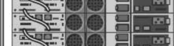
  <figcaption>Switch gestionable con funciones avanzadas de capa 3</figcaption>
</figure>

### 🌉 Puente de red (Bridge)

El **puente de red** (o bridge) es un dispositivo empleado para interconectar varios segmentos de red.

En esencia, un bridge es como un switch. La diferencia esencial es que el bridge tiene muchos menos puertos, no se puede gestionar ni configurar y no existe en formato rackeable.

Dado que el switch ofrece mejores prestaciones, y es más adecuado para redes medias y grandes, el bridge se reserva para casos muy concretos. Como veremos más adelante, la función del bridge se integra en electrónica de red inalámbrica.

Un bridge puede ser de dos tipos:

- **Transparente**: hace que equipos de diferentes segmentos de la red actúen como si perteneciesen a una única red local, sin necesidad de configuración previa.
- **Encaminado en el origen**: el equipo que envía la información tiene capacidad para distinguir si el destinatario está dentro o fuera del segmento de red.

Si el bridge interconecta directamente segmentos de redes LAN se dice que es un **puente local**. Otra opción es que el bridge vincule dos redes LAN a través de una conexión WAN (por ejemplo, una línea dedicada). En este caso se dice que es un **puente remoto**.

### 🌐 Enrutador (Router)

El **enrutador** (o router) es un elemento de electrónica de red cuya función es interconectar diferentes redes, ya sean LAN o WAN. Trabaja, por tanto, en el **nivel 3** del modelo OSI.

Recordemos que tanto el hub, como el switch y el bridge son dispositivos que conectan equipos que forman parte de la misma red. Gracias al router podemos extender las redes, interconectándolas entre sí.

#### 🏠 Router SoHo

El router independiente también es conocido como **router SoHo** (Small Office Home Office, pequeña oficina y oficina en casa). Se trata de un router con características orientadas a la pequeña empresa y también a algunos entornos domésticos. Además del enrutamiento integra otros servicios como pueden ser el DHCP, filtrado de conexiones por MAC, etc.

<figure>
  
  <figcaption>Router SoHo para pequeñas oficinas y hogares</figcaption>
</figure>

El ejemplo más característico de router independiente es la conexión a Internet. En realidad se trata de una conexión de la red local (de la casa, edificio, tienda, centro, etc.) con la red Internet a través del proveedor de servicios de Internet (ISP, Internet Services Provider).

Citando el router integra la función de módem para conexión ADSL, se dice que es un **router ADSL** (o también módem-router).

Cuando el router no integra módem, se denomina **router neutro**.

#### 🏢 Router rackeable

El router rackeable ofrece conexiones de diferente tipo y velocidades, desde conexiones COM (puerto Serie) hasta conexiones de fibra óptica, pasando por conexiones de par trenzado a 10/100/1000 y otras conexiones específicas como pueden ser ATM, puertos de voz, etc.

<figure>
  
  <figcaption>Router rackeable con múltiples tipos de conexión</figcaption>
</figure>

<figure>
  
  <figcaption>Router rackeable con puertos RJ-45, coaxial y fibra óptica</figcaption>
</figure>

De hecho, algunos modelos ofrecen slots de conexión en la parte delantera para instalar tarjetas con las conexiones que se necesiten, según las circunstancias particulares de la red (dónde se conecta, el medio de conexión que emplea, si se necesita transmitir voz o datos, etc.).

<figure>
  
  <figcaption>Detalle de slots de un router empresarial</figcaption>
</figure>

<figure>
  
  <figcaption>Tarjeta de expansión WIC para un router</figcaption>
</figure>

<figure>
  
  <figcaption>Uno de los múltiples tipos de cable para la conexión de routers rackeables</figcaption>
</figure>

El router integra su propio sistema operativo, llamado **IOS**, y también su propia memoria (RAM y flash). Todos estos elementos (IOS, y memorias) pueden modificarse según las necesidades.

El IOS del router integra funciones de capas inferiores a la 3, de modo que es capaz de operar como un switch o un bridge, pero también de ofrecer características propias de la capa 3 o incluso superiores, en el caso de routers con servicios integrados de alto nivel.

Una característica interesante del router rackeable es la posibilidad de incorporar una toma de corriente redundante, que entraría en funcionamiento en caso de que el suministro principal fallase.

#### 🔗 Conexión de routers

La conexión de routers entre sí puede ser:

- **Routers SoHo**: como solo suelen disponer de conexiones RJ-45, la conexión es a través de estas tomas. Para vincularlos se utiliza un latiguillo de cable cruzado.
- **Routers rackeables**: la interconexión de este tipo de routers se suele hacer a través de cable de serie.

### 🚪 Pasarela (Gateway)

La **pasarela** (o gateway), también llamada puerta de enlace, es un dispositivo de red empleado para la conexión de redes, con independencia de la arquitectura y protocolos que empleen.

Son equipos que se ubican en los extremos de la red, duplicando la pila de protocolos de cada una de las redes para hacer la traducción entre ambos. Este proceso es el motivo por el que la transmisión de información se ralentiza al usar estos dispositivos.

<figure>
  
  <figcaption>Gateway independiente para conexión de redes heterogéneas</figcaption>
</figure>

La función original del gateway es propia del **nivel 4** del modelo OSI. Sin embargo, este dispositivo puede realizar otras funciones especiales, propias de capas superiores (5, 6 y 7), como pueden ser estas:

#### 🔥 Cortafuegos (Firewall)

Es un elemento de seguridad cuya misión es controlar el tráfico de datos entrante y saliente de la red. El nivel de seguridad se consigue aplicando una serie de criterios, llamados reglas, que establecen qué se puede y qué no se puede admitir. El cortafuegos opera en las 7 capas del modelo OSI.

#### 🔒 Proxy

Es un elemento de seguridad que actúa como intermediario en la comunicación de dos equipos. Su funcionamiento es muy parecido al cortafuegos, en el sentido de que se le asignan una serie de reglas que determinan qué tráfico se permite y qué tráfico debe bloquearse. El proxy trabaja en la **capa 7** del modelo OSI.

#### 🔐 VPN (Virtual Private Network)

Se trata de una funcionalidad que permite conectarse de forma segura a una LAN privada desde una red pública (típicamente Internet). La apariencia es que el equipo está conectado directamente a la red privada; de ahí su nombre. Un ejemplo típico es el teletrabajo: podemos conectarnos desde nuestro equipo de casa a la red corporativa de la empresa, teniendo acceso a prácticamente los mismos recursos que desde nuestro equipo corporativo.

<figure>
  
  <figcaption>Gateway rackeable con módulos de extensión instalados</figcaption>
</figure>

Asimismo, el gateway puede realizar funciones de capas inferiores, comportándose como un router (capa 3) o incluso como un switch (capa 2).

El gateway puede ser independiente o rackeable. Los modelos más simples ofrecen dos tomas RJ-45, una para la LAN y otra para la WAN, aparte de las conexiones para configuración, que pueden ser de distinto tipo: RJ-45, serie, USB, etc. Otros modelos, por ejemplo, ofrecen muchas más tomas (como si se tratara de un switch) o permiten la integración de módulos para ampliar sus prestaciones (como sucede con los routers).

### 📶 Punto de acceso

El **punto de acceso** (access point, o AP) es un elemento inalámbrico de la red que se usa para extender la red cableada, ofreciendo conexión a la misma a través de medio inalámbrico.

El punto de acceso, como sucedía con el repetidor, se ubica en un lugar estratégico de la red, para dar cobertura a los equipos inalámbricos o a las zonas de trabajo establecidas. Estos dispositivos integran la tecnología **PoE**, por lo que la ubicación en lugares que no tienen suministro eléctrico no supone un problema.

<figure>
  
  <figcaption>Diferentes modos de funcionamiento de puntos de acceso</figcaption>
</figure>

Como ya vimos, la aplicación de los puntos de acceso para extender el radio de acción de la red es muy habitual en las infraestructuras que siguen una topología distribuida. En el caso de que se quiera cubrir una zona más amplia, se pueden colocar varios puntos de acceso, pudiendo solaparse las celdas de estos.

<figure>
  
  <figcaption>Punto de acceso funcionando como repetidor</figcaption>
</figure>

Además, el punto de acceso puede actuar como repetidor o bridge. Para ello, es necesario que integre la tecnología **WDS** (Wireless Distribution System, sistema de distribución inalámbrico), que permite la interconexión de este tipo de dispositivos entre sí.

Hay modelos de punto de acceso diseñados para ser colocados a la intemperie. Se trata de dispositivos con una carcasa capaz de soportar inclemencias meteorológicas, y que disponen de una o más antenas con mayor potencia. Este tipo de puntos de acceso son habituales en campus o redes multiedificio, donde es necesario extender la red sin instalar cableado adicional.

<figure>
  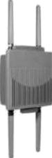
  <figcaption>Punto de acceso para instalaciones interiores</figcaption>
</figure>

<figure>
  
  <figcaption>Punto de acceso para exteriores con carcasa resistente</figcaption>
</figure>

<figure>
  
  <figcaption>Punto de acceso para exteriores. A la derecha, detalle de la vista superior e inferior</figcaption>
</figure> -->

## 🛠️ Actividades

!!! tip "<strong>Formato de entrega</strong>"
    Para la entrega de las actividades, genera un documento con la práctica descrita a continuación. Deberás crear un archivo PDF con el siguiente formato de nombre: <strong>ACXXX.pdf o PRXXX.pdf</strong>, donde las X representan el número de la actividad. Una vez finalizada la práctica, sube el archivo a Aules (antes de la fecha de vencimiento) para su calificación.

* :simple-readdotcv: **AC301**. (RA2 // CE2a, CE2b // 1-3p). Investiga y documenta las diferentes categorías de cable de par trenzado. Elabora una tabla comparativa con sus características, velocidades máximas y aplicaciones típicas.

* :simple-readdotcv: **AC302**. (RA2 // CE2a, CE2b // 1-3p). Investiga y documenta las características del cable coaxial utilizado en redes locales. Elabora un informe que incluya:
    - Estructura y composición del cable coaxial
    - Tipos principales de cable coaxial (RG-59, RG-58, RG-6, etc.) y sus aplicaciones
    - Ventajas y desventajas frente a otros medios de transmisión
    - Ejemplos de uso en redes de datos actuales y obsoletas

* 🎯 Reto Grupal **RG303**: Crimpado de Cables de Par Trenzado (RA3 // CE3a, CE3b, CE3c, CE3d). Aplica las técnicas de crimpado de conectores RJ-45 en cables de par trenzado, siguiendo los estándares **T568A** y **T568B**, y demuestra la calidad del trabajo mediante pruebas de conectividad y presentación de resultados ante el resto de grupos.

📋 **[Ver detalles completos del reto →](reto_crimpado_cables.md)**

<!-- !!! tip "<strong>CONCLUSIÓN</strong>"
    La infraestructura de red es fundamental para el funcionamiento de cualquier sistema de comunicaciones. Conocer los diferentes medios de transmisión, estándares de cableado y técnicas de montaje nos permite diseñar e implementar redes locales eficientes y adaptadas a las necesidades específicas de cada entorno. -->

* :simple-readdotcv: **AC304**. (RA2 // CE2a, CE2b // 1-3p). Realiza una investigación sobre la **fibra óptica** como medio de transmisión guiado. Elabora un resumen que incluya:
* 
    - Principio de funcionamiento de la fibra óptica
    - Estructura y tipos principales de fibra óptica (monomodo y multimodo)
    - Aplicaciones típicas en redes locales y de área amplia
    - Ventajas y desventajas frente a otros medios (cobre, inalámbricos)
    - Medidas de seguridad y precauciones en su manipulación

* :simple-readdotcv: **AC305**. (RA2 // CE2a, CE2b // 1-3p). Investiga y documenta los **medios de transmisión no guiados** utilizados en redes de comunicación. Elabora un informe que incluya:
* 
    - Definición y ejemplos de medios no guiados (radiofrecuencia, microondas, infrarrojos, satélite, etc.)
    - Cuadro comparativo con sus características (alcance, bandas de frecuencia, velocidad, aplicaciones)
    - Ventajas y limitaciones de los principales tipos
    - Ejemplos reales de uso en redes tanto en interiores como exteriores

* :simple-readdotcv: **AC306**. (RA2 // CE2a, CE2b // 1-3p). Investiga y elabora una infografía o esquema visual que resuma los **medios de transmisión no guiados** utilizados en redes de comunicación, centrándote en los siguientes aspectos:

    - Clasificación de los medios no guiados (radiofrecuencia, microondas, infrarrojos, luz visible, etc.)
    - Ejemplos representativos de cada tipo y sus aplicaciones (Wi-Fi, Bluetooth, LTE/5G, satélite, ZigBee, WiMAX, infrarrojos, etc.)
    - Principales **estándares técnicos** asociados a cada medio (por ejemplo: IEEE 802.11 para Wi-Fi, IEEE 802.15 para Bluetooth/ZigBee, IEEE 802.16 para WiMAX, ITU y 3GPP para tecnologías móviles, etc.)
    - Ámbitos de aplicación: redes personales, locales, metropolitanas, de área amplia, etc.
    - Puedes complementar con imágenes, iconos y descripciones breves.

* :simple-readdotcv: **AC307**. (RA2 // CE2a, CE2b // 1-3p). Explora la infraestructura mundial de cables submarinos utilizando la herramienta interactiva [Submarine Cable Map](https://www.submarinecablemap.com) y elabora un informe detallado que incluya:

    - **Análisis geográfico**: Identifica y documenta las principales rutas de cables submarinos que conectan España con otros continentes
    - **Características técnicas**: Selecciona 3 cables submarinos específicos y documenta sus características técnicas (longitud, capacidad, año de instalación, empresas propietarias)
    - **Puntos de amarre**: Localiza y describe los principales puntos de amarre en territorio español y su importancia estratégica
    - **Análisis comparativo**: Compara las rutas del Atlántico Norte, Mediterráneo y otras regiones en términos de densidad de cables y capacidad
    - **Impacto económico**: Investiga cómo estos cables afectan a la economía digital española y europea
    - **Conclusiones**: Reflexiona sobre la importancia estratégica de esta infraestructura para las comunicaciones globales

    **Formato de entrega**: Documento PDF con capturas de pantalla de la herramienta interactiva, mapas anotados y análisis detallado de cada punto requerido.

