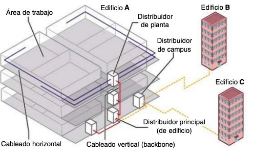

# :material-power-plug: CAPA FÍSICA

En esta unidad estudiaremos la **capa física** de las redes de datos, que constituye la base fundamental sobre la que se construye toda la comunicación de red. Nos enfocaremos en los diferentes medios de transmisión (cables de cobre, fibra óptica y tecnologías inalámbricas), sus características técnicas, estándares de cableado, conectores y técnicas de montaje.

La capa física es responsable de la transmisión de bits a través del medio físico, convirtiendo los datos digitales en señales eléctricas, ópticas o electromagnéticas. Dominar estos conceptos es esencial para diseñar, instalar y mantener redes locales eficientes y confiables.

!!! info "<strong>Objetivos de la unidad</strong>"
    
    • Identificar y clasificar los diferentes medios de transmisión 
    • Comprender los estándares de cableado y terminaciones 
    • Aplicar técnicas de montaje de conectores y equipos 
    • Diseñar sistemas de cableado estructurado 
    • Evaluar la idoneidad de cada medio según el entorno
    

## 🔧 INFRAESTRUCTURA DE RED

La **infraestructura de red** comprende todos los elementos físicos y lógicos necesarios para establecer la conectividad entre dispositivos en una red local. Esta infraestructura incluye los medios de transmisión, los equipos de interconexión, las estructuras de cableado y los estándares que garantizan la interoperabilidad y el rendimiento óptimo del sistema.

En esta unidad analizaremos los componentes fundamentales de la infraestructura:

!!! abstract "<strong>Componentes de la infraestructura</strong>"
    
    **🌐 Medios de transmisión**: Canales físicos que transportan la información 
    **🔌 Conectores y terminaciones**: Interfaces entre medios y equipos 
    **🏗️ Cableado estructurado**: Organización jerárquica del cableado en edificios 
    **📡 Tecnologías inalámbricas**: Comunicación sin medios físicos 
    **⚙️ Equipos de red**: Dispositivos que gestionan el tráfico de datos
    

La correcta planificación e implementación de la infraestructura es crucial para garantizar la escalabilidad, mantenibilidad y rendimiento de la red, cumpliendo con estándares internacionales como ISO/IEC 11801 y TIA/EIA-568.

## 📚 Propuesta didáctica

En esta unidad trabajamos los **RA2, RA3 y RA4 de RAL**:

> **RA2.** *Despliega el cableado de una red local interpretando especificaciones y aplicando técnicas de montaje.*
> 
> **RA3.** *Interconecta equipos en redes locales cableadas describiendo estándares de cableado y aplicando técnicas de montaje de conectores.*
> 
> **RA4.** *Instala equipos en red, describiendo sus prestaciones y aplicando técnicas de montaje.*

### 🎯 Criterios de evaluación

#### Criterios de evaluación del RA2

> **CE2a**: *Interpreta las especificaciones del cableado de una red local analizando los requisitos técnicos y aplicando estándares de cableado estructurado.*
> 
> **CE2b**: *Identifica los componentes del sistema de cableado reconociendo medios de transmisión, conectores y equipos de distribución.*
> 
> **CE2c**: *Aplica técnicas de montaje del cableado siguiendo procedimientos de instalación y cumpliendo normativas de seguridad.*
> 
> **CE2d**: *Verifica el funcionamiento del cableado instalado utilizando herramientas de medición y pruebas de conectividad.*

#### Criterios de evaluación del RA3

> **CE3a**: *Describe los estándares de cableado para redes locales identificando las normas TIA/EIA-568 y categorías de cable.*
> 
> **CE3b**: *Identifica los tipos de conectores y su uso analizando conectores RJ, de fibra óptica y coaxiales.*
> 
> **CE3c**: *Aplica técnicas de montaje de conectores realizando terminaciones T568A/T568B y crimpado de conectores.*
> 
> **CE3d**: *Verifica la conectividad de los equipos interconectados realizando pruebas de continuidad y funcionamiento.*

#### Criterios de evaluación del RA4

> **CE4a**: *Describe las prestaciones de los equipos de red analizando características técnicas de switches, routers y puntos de acceso.*
> 
> **CE4b**: *Identifica los componentes de los equipos de red reconociendo interfaces, fuentes de alimentación y sistemas de ventilación.*
> 
> **CE4c**: *Aplica técnicas de montaje de equipos de red instalando en racks y cumpliendo estándares de cableado.*
> 
> **CE4d**: *Verifica el funcionamiento de los equipos instalados realizando pruebas de conectividad y configuración básica.*

### Contenidos

* Medios de transmisión: guiados y no guiados.
* Cable de par trenzado: categorías, conectores y terminaciones.
* Cable coaxial: tipos y conectores.
* Fibra óptica: tipos, características y conectores.
* Medios inalámbricos: espectro electromagnético y estándares.
* Cableado estructurado en edificios.

!!! question "Cuestionario inicial"
    1. ¿Qué categorías de cable de par trenzado conoces y para qué se utilizan?
    2. ¿Cuándo es recomendable usar fibra óptica en lugar de cable de cobre?
    3. ¿Qué diferencias hay entre los medios guiados y no guiados?
    4. ¿Qué es el espectro electromagnético y por qué es importante en comunicaciones?
    5. ¿Cuáles son los principales estándares inalámbricos IEEE 802.11?
    6. ¿Qué elementos componen un sistema de cableado estructurado?
    7. ¿Cómo se organiza el cableado horizontal y vertical en un edificio?
    8. ¿Qué tipos de conectores se utilizan para cable de par trenzado?
    9. ¿Cómo se realiza la terminación de cables según los estándares T568A y T568B?

## Programación de Aula (15h)

Esta unidad se imparte en la primera evaluación, con una duración estimada de 15 sesiones lectivas:

| Sesión | Contenidos | Actividades | Criterios trabajados |
|--------|------------|-------------|----------------------|
| 1-2 | Medios guiados: par trenzado | Cuestionario inicial, AC301 | CE2a, CE2b, CE3a, CE3b |
| 3-5 | Medios guiados: coaxial y fibra óptica | Actividad AC302, práctica PR303 | CE2a, CE2b, CE3a, CE3b |
| 6-8 | Medios no guiados y estándares inalámbricos | Actividad AC304 | CE2a, CE2b, CE4a, CE4b |
| 9-10 | Cableado estructurado en edificios | Actividad AC305 | CE2a, CE2b, CE2c, CE2d |
| 11-12 | Práctica: Armado de latiguillo y montaje de roseta | PR306, PR307 | CE3a, CE3b, CE3c, CE3d |
| 13-15 | Repaso y evaluación | Evaluación práctica | Todos los criterios |

---

## 📡 Medios de transmisión

La información se transmite en las redes mediante señales, que pueden ser de naturaleza eléctrica, óptica o radiofrecuencia, a través de un medio de transmisión.

Este medio es el enlace que existe entre las dos entidades que se comunican y, entre otros factores, el éxito en la comunicación dependerá de su naturaleza y limitaciones. Por ello, es importante conocer las características de los principales medios de transmisión.

### Medios guiados

Los medios guiados son los cables que interconectan los equipos. A través de ellos se emite información en forma de señales eléctricas u ópticas. Los principales medios guiados en redes de datos son los que veremos a continuación.

#### Cable de par trenzado

Este cable tiene una cubierta de PVC y en su interior contiene ocho cables más pequeños, de diferente color. Para aumentar la potencia del cable y reducir las interferencias, los cables se presentan trenzados por pares (de ahí su nombre), con un total de cuatro pares.

La combinación de colores de los cables interiores no es trivial, sino que debe ser la siguiente:

- **Par 1**: Azul – Blanco/Azul
- **Par 2**: Naranja – Blanco/Naranja  
- **Par 3**: Verde – Blanco/Verde
- **Par 4**: Marrón – Blanco/Marrón

Este tipo de cable se encuentra normalizado según el estándar **TIA/EIA-568-B**, que define, entre otros aspectos, las diferentes categorías de este cable en función a sus prestaciones. Las categorías más representativas en redes de datos son las siguientes:

| Categoría | Ancho de banda | Aplicaciones |
|-----------|----------------|--------------|
| **Cat. 3** | 16 MHz | Redes Ethernet de bajas prestaciones |
| **Cat. 4** | 20 MHz | Redes Token Ring de hasta 16 Mbps |
| **Cat. 5** | 100 MHz | Redes Ethernet de hasta 100 Mbps |
| **Cat. 5e** | 100 MHz | Redes Ethernet de hasta 100 Mbps |
| **Cat. 6** | 250 MHz | Redes Ethernet de hasta 1 Gbps |
| **Cat. 6a** | 250 MHz | En desarrollo (se espera usar en redes Ethernet de hasta 10 Gbps) |
| **Cat. 7** | 600 MHz | En desarrollo |
| **Cat. 7a** | 1000 MHz | Telefonía, TV por cable y Gigabit Ethernet en el mismo cable |

En la actualidad, para instalaciones de redes de datos, se utiliza principalmente cable de categoría **5e** y **6**, siendo la categoría 5 prácticamente obsoleta.

##### 🔧 Tipos de cable según el blindaje

El cable de par trenzado estándar recibe el nombre de **cable UTP** (unshielded twisted pair), cable de par trenzado sin apantallar. Es el más utilizado por su bajo coste y prestaciones aceptables, pero tiene limitaciones para determinados entornos como, por ejemplo, donde haya actividad electromagnética.

Como ya dijimos, está compuesto por cuatro pares trenzados, recubiertos por una carcasa de PVC.

A partir del cable UTP estándar, y en función de qué parte de este se blinde frente a las interferencias, tenemos las siguientes variaciones:

| Tipo de cable | Tipo de blindaje | Descripción |
|---------------|------------------|-------------|
| **U/UTP** | Sin blindaje | Sin blindaje |
| **U/FTP** | Pantalla de aluminio | En el par |
| **F/UTP** | Pantalla de aluminio | En el cable |
| **F/FTP** | Pantalla de aluminio | En par y cable |
| **S/UTP** | Malla de aluminio | En el cable |
| **S/FTP** | Malla + pantalla | En el cable |
| **SF/UTP** | Malla + pantalla | Malla de aluminio y pantalla de aluminio |

<figure>
  
  <figcaption>Tipos de blindaje en cable de par trenzado según estándares</figcaption>
</figure>

##### 🔌 Conectores para el cable de par trenzado

El cable de par trenzado utiliza un conector tipo **RJ**, diseñado para la conexión de equipos en redes de datos y voz. El conector RJ hembra recibe el nombre de **roseta**.

- Los conectores RJ se denotan a partir del número de posiciones de que disponen, y del número de contactos que emplean en dichas posiciones. De todos los modelos, destacamos los siguientes:

**Conector RJ-9:**

- Es el más pequeño de los conectores RJ
- Se utiliza para conectar los auriculares del teléfono
- Es un conector 4P4C

<figure>
  
  <figcaption>Conector RJ-9 para auriculares de teléfono (4P4C)</figcaption>
</figure>

**Conector RJ-11:**

- Es un conector dedicado mayoritariamente a la telefonía analógica
- Tiene seis posiciones sobre las que se asientan dos contactos (6P2C)
- Su uso principal es conectar el terminal a la red
- La variante del RJ-11 que emplea un par de contactos más (6P4C) se llama RJ-14

<figure>
  
  <figcaption>Conector RJ-11 para telefonía analógica (6P2C)</figcaption>
</figure>

**Conector RJ-45:**

- Es el conector empleado para cable de par trenzado en redes Ethernet
- Es del tipo 8P8C, lo que significa que utiliza todas sus posiciones para recibir los cuatro pares del cable
- Este conector también soporta el uso de menos pares, dando lugar a las variantes 8P6C, 8P4C y 8P2C, casi todas dedicadas a telefonía o líneas RDSI
- El conector RJ-45 puede ser o no apantallado. Si lo es, por encima de la carcasa plástica tiene un armazón que lo protege de interferencias
- Este tipo de conectores suelen utilizarse con cableado que tenga algún tipo de blindaje

<figure style="align: center;">
    
    <figcaption style="text-align: center;">Conector RJ-45 para Ethernet</figcaption>
</figure>

<figure>
  
  <figcaption>Tipos de blindaje en cables de red (UTP, FTP, STP, S/FTP, etc.)</figcaption>
</figure>

##### 📋 Terminaciones del cable

La posición de los cables en el conector, llamada de forma técnica **terminación**, está regulada en la norma **TIA/EIA-568-B**. Esta norma define dos terminaciones:

| Pin | T568A | T568B | Par T568A | Par T568B |
|-----|-------|-------|-----------|-----------|
| 1 | Blanco/Verde | Blanco/Naranja | Par 3 | Par 2 |
| 2 | Verde | Naranja | Par 3 | Par 2 |
| 3 | Blanco/Naranja | Blanco/Verde | Par 2 | Par 3 |
| 4 | Azul | Azul | Par 1 | Par 1 |
| 5 | Blanco/Azul | Blanco/Azul | Par 1 | Par 1 |
| 6 | Naranja | Verde | Par 2 | Par 3 |
| 7 | Blanco/Marrón | Blanco/Marrón | Par 4 | Par 4 |
| 8 | Marrón | Marrón | Par 4 | Par 4 |

<figure>
  
  <figcaption>Esquema de las terminaciones de los pares en un conector RJ-45 (T568A y T568B)</figcaption>
</figure>

!!! important "<strong>NOTA IMPORTANTE</strong>"
    
    Según la norma, la terminación a emplear para la mayor parte del tendido de cableado de la red debería ser **T568A**. Sin embargo, debido a que típicamente se ha usado la terminación **T568B** (definida en normas anteriores), muchas instalaciones de redes siguen empleando dicha terminación en lugar de la T568A.
    

Con estas terminaciones pueden crearse dos tipos de cable:

- **Cable directo**: utiliza la misma terminación en los dos extremos. Este cable es el que se usa para la mayoría de las conexiones en la red.

<figure>
  
  <figcaption>Ejemplo de cable directo: ambas terminaciones iguales, normalmente T568A-T568A o T568B-T568B</figcaption>
</figure>

- **Cable cruzado**: utiliza diferente terminación en los dos extremos. Este cable se utiliza para conectar directamente dos equipos.

<figure>
  
  <figcaption>Ejemplo de cable cruzado: terminaciones diferentes en cada extremo, normalmente T568A-T568B</figcaption>
</figure>

!!! tip "<strong>CONSEJO</strong>"
    
    Para recordar las diferencias entre T568A y T568B: en T568B, los pares 2 y 3 están intercambiados respecto a T568A.
    

#### Cable coaxial

El **cable coaxial** está compuesto por dos conductores concéntricos que comparten el mismo eje. Su estructura consta de:

- **Conductor central**: Hilo de cobre sólido o hilos trenzados de cobre
- **Dieléctrico**: Capa aislante de material dieléctrico (generalmente polietileno)
- **Pantalla conductora**: Malla de hilos de cobre o aluminio que actúa como conductor exterior
- **Cubierta exterior**: Material aislante protector (habitualmente PVC)

!!! info "<strong>Características del cable coaxial</strong>"
    
    Este tipo de cable es más resistente que el cable de par trenzado a las interferencias electromagnéticas y presenta menor atenuación de señal, lo que lo convierte en una opción eficiente para grandes distancias. Sin embargo, en redes locales modernas su uso se ha reducido significativamente debido a la obsolescencia de las topologías de bus.
    

##### 📊 Ventajas y desventajas

**✅ Ventajas:**

- Mayor resistencia a interferencias electromagnéticas
- Menor atenuación de señal (pérdida mínima)
- Eficiente para transmisiones a grandes distancias
- Mayor ancho de banda disponible

**❌ Desventajas:**

- Mayor coste económico que el cable de par trenzado
- Instalación más compleja y costosa
- Aplicaciones limitadas en redes modernas
- Mayor grosor y menor flexibilidad

##### 📊 Tipos de cable coaxial

De toda la familia de cables coaxiales, los más extendidos en el ámbito de las telecomunicaciones son:

| Tipo de cable | Núcleo | Dieléctrico | Aplicaciones |
|---------------|--------|-------------|--------------|
| **RG-58/U** | Cobre sólido (diámetro: 0,9 mm) | Polietileno | Redes Ethernet 10BASE2 (obsoleto) |
| **RG-58A/U** | Hilos trenzados (19 hilos de 0,18 mm) | Polietileno | Redes Ethernet 10BASE2 (obsoleto) |
| **RG-59/U** | Cobre sólido (diámetro: 0,60 mm) | Polietileno de baja densidad | Televisión por cable |
| **RG-6/U** | Cobre rojo sólido (diámetro: 0,75 mm) | Polietileno de baja densidad | Televisión por cable, Internet por cable |
| **RG-8** | Cobre rojo sólido (diámetro: 2,18 mm) | Polietileno de baja densidad | Redes Ethernet 10BASE5 (obsoleto) |

<figure>
  
  <figcaption>Tipos de cable coaxial según composición</figcaption>
</figure>

##### 🔌 Conectores para el cable coaxial

La gama de conectores para cable coaxial es muy amplia, ya que este tipo de cable se utiliza mucho en la industria.

- Estos conectores se llaman **RF** y tienen diferentes formas: rectos, en ángulo, en T, etc.
- Los conectores RF pueden ser macho o hembra. Los conectores macho tienen un capuchón en su extremo que se utiliza para enganchar con el conector hembra.

Principalmente hay tres maneras de engancharlos:

- **Anclaje**: es la más común. El capuchón conector del macho se engancha en las ranuras del conector hembra.
- **Rosca**: el conector hembra tiene un paso de roscas sobre el que se enrosca el capuchón del conector macho.
- **Presión**: el capuchón del conector macho se acopla sobre el conector hembra. Típico en la conexión de la antena de TV.

Además de los conectores, en las redes con topología de bus se utiliza un elemento en los extremos del bus llamado **terminador**. Este conector no es más que un tapón con una resistencia en su interior para amortiguar las señales cuando llegan al final del bus, e impedir rebotes que pudieran causar interferencias.

Los principales tipos de conector para cable coaxial son:

| Tipo | Conector macho | Conector hembra | Aplicaciones |
|------|----------------|-----------------|--------------|
| **BNC** | ✅ | ✅ | Redes Ethernet 10BASE2 (obsoleto) |
| **N** | ✅ | ✅ | Aplicaciones de alta frecuencia |
| **TNC** | ✅ | ✅ | Versión roscada del BNC |
| **SMA** | ✅ | ✅ | Aplicaciones de microondas |

<figure>
  
  <figcaption>Tipos de conectores coaxiales: BNC, N, TNC, SMA</figcaption>
</figure>

#### Fibra óptica

La **fibra óptica** se basa en un hilo muy fino (del grosor de un cabello) de vidrio o de plástico, revestido por una sustancia que protege directamente la fibra (generalmente acrilato), y un segundo revestimiento que le confiere rigidez para protegerlo del exceso de curvatura (típicamente nailon o poliéster).

<figure>
  
  <figcaption>Red mundial de cables submarinos de fibra óptica para comunicaciones intercontinentales</figcaption>
</figure>

Este medio tiene pérdidas muy bajas a largas distancias y una alta capacidad de transmisión, por lo que es la opción ideal para cubrir grandes distancias. Por ejemplo, las redes transoceánicas, que comunican continentes, hacen uso de enormes mazas de cables de fibra óptica.

La fibra óptica utiliza la luz para transmitir información, que se inyecta por el hilo de fibra y va rebotando por sus paredes de un extremo del cable al otro.

##### 📊 Ventajas y desventajas

**✅ Ventajas:**
- Pérdidas muy bajas a largas distancias
- Alta capacidad de transmisión
- Inmune a interferencias electromagnéticas
- Seguridad en la transmisión (difícil de interceptar)

**❌ Desventajas:**
- Coste elevado
- Instalación compleja
- Fragilidad del cable
- Necesidad de equipos especializados

<figure>
  
  <figcaption>Estructura interna de cables de fibra óptica: holgada vs ajustada</figcaption>
</figure>

<figure>
  
  <figcaption>Componentes de un cable de fibra óptica: núcleo, recubrimiento, aramida, cubiertas y armadura</figcaption>
</figure>

##### 🔬 Tipos de fibra óptica

Las trayectorias que se emiten sobre la fibra dan lugar a los dos tipos principales de fibra:

**Multimodo (MM):**
- Se emiten varios haces de luz con diferentes trayectorias
- El emisor que se utiliza para este tipo de fibra es el diodo LED
- El diámetro del núcleo oscila entre 50 y 63 μm
- Más económico pero con limitaciones de distancia

**Monomodo (SM):**
- Se emite un haz de luz en una trayectoria única
- Para conseguir este tipo de emisión se utiliza luz láser
- Se reduce el diámetro del núcleo hasta unos 9 μm
- Mayor coste pero mejor rendimiento a largas distancias

<figure>
  
  <figcaption>Comparación entre fibra multimodo y monomodo: dispersión modal</figcaption>
</figure>

##### 📊 Clasificación según estándares

La fibra óptica se encuentra estandarizada en la norma **TIA/EIA-568-C**, que define los siguientes tipos:

| Tipo de fibra | Descripción | Diámetro del núcleo | Diámetro del revestimiento |
|---------------|-------------|-------------------|---------------------------|
| **OM1** | MM | 62,5 μm | 125 μm |
| **OM2** | MM | 50 μm | 125 μm |
| **OM3** | MM optimizada para láser | 50 μm | 125 μm |
| **OM4** | MM optimizada para láser | 50 μm | 125 μm |
| **OS1** | SM | 9 μm | 125 μm |

##### 📏 Distancias y velocidades

En función de la distancia a cubrir y la velocidad de transmisión deseada, se utiliza un tipo de fibra u otro:

| Velocidad | 300 m | 500 m | 2000 m |
|-----------|-------|-------|--------|
| **100 Mbps** | OM1 | OM1 | OM1 |
| **1 Gbps** | OM1 | OM2 | OS1 |
| **10 Gbps** | OM3 | OS1 | OS1 |

##### 🔌 Conectores para la fibra óptica

Los conectores de fibra óptica también son variados. Sirven para los dos tipos de fibra (SM y MM) y pueden conectarse mediante mecanismos de anclaje, enroscado, presión o el sistema del conector RJ, con pestaña para engancharse al conector hembra.

Los principales tipos de conector para fibra óptica que podemos encontrar en redes son:

| Conector | Sistema | Nº fibras | Aplicaciones típicas |
|----------|---------|----------|---------------------|
| **ST** | Anclaje en giro | 1 | Redes de área local |
| **FC** | Rosca | 1 | Redes de datos y telecomunicaciones |
| **SC** | Presión | 1 | Circuito de TV, comprobación de equipos |
| **LC** | Anclaje con pestaña | 1 | Redes Gigabit Ethernet, multimedia |
| **MU** | Presión | 1 | Fines médicos y militares |
| **MT-RJ** | Anclaje con pestaña | 2 | Redes Gigabit Ethernet, redes ATM |
| **MPO** | Presión (grupos de 4 a 24) | 4-24 | Redes con alto número de conexiones |

### Medios no guiados

Los medios no guiados transportan ondas electromagnéticas sin el empleo de un conductor físico. Estas ondas se propagan a través del aire, el vacío o el agua, utilizando diferentes frecuencias del espectro electromagnético.

##### 📡 Bandas de frecuencia

| Banda de frecuencia | Frecuencia | Longitud de onda | Aplicaciones |
|-------------------|------------|------------------|--------------|
| **ELF** (Extremely Low Frequency) | < 3 kHz | > 100 km | Comunicaciones submarinas |
| **VLF** (Very Low Frequency) | 3 - 30 kHz | 100 - 10 km | Navegación, radio AM |
| **LF** (Low Frequency) | 30 - 300 kHz | 10 - 1 km | Radio AM de onda larga |
| **MF** (Medium Frequency) | 300 kHz - 3 MHz | 1 km - 100 m | Radio AM de onda media |
| **HF** (High Frequency) | 3 - 30 MHz | 100 - 10 m | Radio AM de onda corta |
| **VHF** (Very High Frequency) | 30 - 300 MHz | 10 - 1 m | Radio FM, TV analógica |
| **UHF** (Ultra High Frequency) | 300 MHz - 3 GHz | 1 m - 10 cm | TV digital, telefonía móvil |
| **SHF** (Super High Frequency) | 3 - 30 GHz | 10 - 1 cm | Satélites, radar |
| **EHF** (Extremely High Frequency) | 30 - 300 GHz | 1 - 0,1 cm | Comunicaciones militares |

<figure>
  
  <figcaption>Espectro electromagnético y bandas de frecuencia para comunicaciones inalámbricas</figcaption>
</figure>

!!! info "<strong>REGULACIÓN EN ESPAÑA</strong>"
    
    En España esta regulación la ejerce el Ministerio de Industria, Energía y Turismo, a través de la Secretaría de Estado de Telecomunicaciones, de acuerdo a los tratados de las organizaciones internacionales.
    

##### 📻 Radioondas

Operan entre las bandas ELF y UHF. Son ondas que se transmiten en todas las direcciones y apenas son sensibles a las inclemencias meteorológicas.

Los ejemplos más representativos de este tipo de ondas son la radio en AM (que utiliza en las bandas bajas) o la radio en FM y la televisión (que utilizan en las bandas altas).

##### 🛰️ Microondas

Las microondas operan entre las bandas UHF y EHF. Emplean antenas parabólicas para la emisión y recepción de la señal, ya que tanto el emisor como el receptor deben estar alineados.

Cuando la distancia no es muy elevada se utiliza una comunicación directa, enfrentando las antenas de emisor y receptor. Es el caso de las llamadas microondas terrestres.

Cuando la distancia aumenta, la comunicación se hace mediante microondas por satélite. En este caso, el emisor transmite una señal a un satélite, que la recibe, la amplifica y la transmite en otra banda a la estación receptora.

##### 🔴 Infrarrojos

Se trata de una luz no visible al ojo humano. Utiliza en frecuencias que están entre los 300 GHz y los 384 THz. Al igual que ocurre con las microondas, los dispositivos deben estar alineados para comunicarse.

Un ejemplo muy característico de este medio de comunicación es el mando a distancia de las televisiones.

La comunicación por infrarrojos puede ser:

- **Por haz directo**: es necesario que no haya obstáculos entre emisor y receptor que impidan su completa visualización.
- **Por haz difuso**: la emisión se realiza con potencia suficiente como para que se puedan salvar obstáculos entre emisor y receptor por medio de rebotes de la señal en ellos.

##### 🌐 Banda ISM

Hay una parte del espectro electromagnético que se utiliza para fines no comerciales, llamada **banda ISM**. Estas bandas son de uso libre y no es necesario disponer de licencia para utilizarlas. Cada banda se segmenta en canales, que pueden variar de un país a otro. Se usa sobre todo en redes WLAN y WPAN, pero también en teléfonos inalámbricos, microondas, etc.

La banda ISM suele ocupar el arco de los 2,4 GHz a los 5 GHz, pero varía de unos países a otros, por lo que dispositivos comprados en unos países pueden no funcionar en otros al operar en bandas disponibles en un país pero vetadas en otro.

Además, de ese arco de 2,4-5 GHz, hay rangos que pueden utilizarse para fines concretos, por ejemplo, militares.
En España la atribución de bandas de frecuencias se recoge en un documento oficial llamado **Cuadro Nacional de Atribución de Frecuencias (CNAF)**, disponible en la página web del Ministerio de Industria, Energía y Turismo.

!!! note "<strong>APLICACIONES PRÁCTICAS</strong>"
    
    <strong>Aplicaciones de radioondas:</strong> 
    • VLF → Comunicaciones en navegación y submarinos 
    • LF → Radio AM de onda larga 
    • MF → Radio AM de onda media 
    • HF → Radio AM de onda corta 
    • VHF → Radio FM 
    • UHF → TDT  
    
    <strong>Aplicaciones de microondas:</strong> 
    • Bluetooth o ZigBee para comunicación de dispositivos en redes WPAN 
    • Comunicaciones con radares (velocidad, presencia, etc.) 
    • Redes WLAN y WiMAX 
    • TV por satélite 
    • Transmisión telefónica
    

#### Estándares inalámbricos

La gran mayoría de los estándares inalámbricos están desarrollados por el grupo de trabajo **IEEE 802**. Así, en función del tipo de red, existen los estándares derivados que veremos a continuación.

##### 📱 Estándar para redes WPAN

Utiliza el estándar **IEEE 802.15**, que se divide en cinco grupos, cada uno de los cuales trata un área concreta.

El más representativo es el estándar **IEEE 802.15.1**, que define las redes de Bluetooth. Estas redes emplean una estructura propia llamada **piconet**.

Una piconet es una red de dos a siete dispositivos, uno de los cuales se denomina maestro. El maestro se encarga de establecer las conexiones y gestionar su red.

Las piconets pueden comunicarse entre sí, vinculando equipos que formen parte de su red, formando una red más extensa que recibe el nombre de **scatternet**.

Los dispositivos Bluetooth trabajan en la banda de 2,4 GHz, ocupando un ancho de 79 MHz. Pueden ser de tres clases, en función de la potencia que tengan y de su campo de acción:

| Clase | Potencia máxima | Rango |
|-------|-----------------|-------|
| **1** | 100 mW | 100 m |
| **2** | 2,5 mW | 20 m |
| **3** | 1 mW | 1 m |

##### 📶 Estándar para redes WLAN

Emplea el estándar **IEEE 802.11**. Es el más difundido por tratarse de las redes de área local. Existen diferentes revisiones de esta norma, de las cuales la más actual es la 802.11ac.

De los estándares surgidos de las distintas revisiones, destacamos los siguientes:

**IEEE 802.11a:**
- Es el estándar más antiguo
- Opera en la banda de 5 GHz y utiliza 12 canales
- Velocidad teórica máxima de 54 Mbps

**IEEE 802.11b:**
- Revisión del estándar original
- Trabaja en la banda de 2,4 GHz a una velocidad máxima de 11 Mbps

**IEEE 802.11g:**
- Evolución del estándar 802.11b
- Utiliza su misma banda, pero alcanzando una velocidad similar al 802.11a
- Hay una variante llamada 802.11g+ que permite tasas de transferencia de hasta 108 Mbps
- Es el estándar más extendido entre los usuarios domésticos

**IEEE 802.11n:**
- Hace uso simultáneo de las bandas de 2,4 GHz y 5 GHz
- Es compatible con los estándares anteriores
- Tasa de transferencia teórica de 300 Mbps
- Utiliza tecnología MIMO

**IEEE 802.11ac:**
- Es la última norma aprobada de este estándar
- Opera en la banda de 5 GHz ampliando el ancho hasta 160 MHz
- Mejora la tasa de transferencia llegando hasta 1 Gbps

##### 🔄 Tecnología MIMO

Los estándares multibanda (a partir de 802.11n) utilizan una tecnología llamada **MIMO**, que permite que en un dispositivo funcione como emisor/receptor múltiple.

Esto se consigue mediante la disposición de varias antenas, cada una de las cuales trabaja en un canal de 20 MHz o 40 MHz, pudiendo funcionar en las bandas de 2,4 GHz y 5 GHz.

En la tecnología MIMO interesa saber el número de antenas emisoras y el número de antenas receptoras. El producto de ambas nos indica el número de vías de comunicación diferentes que pueden darse entre los dos dispositivos.

Así, por ejemplo, en una conexión 3×3 existen tres antenas para emitir y tres para recibir, teniendo un total de 9 vías de comunicación.

No es necesario que coincida el número de canales de emisión con el de recepción, aunque suele ser lo más habitual.

##### 🌐 Estándar para redes WMAN

Utiliza el estándar **IEEE 802.16**, que define las redes **WiMAX**. Esta norma ha tenido varias revisiones, siendo la última la **802.16m**.

Las redes WiMAX se caracterizan por:

- Operar en el rango de **2,3 a 3,5 GHz**
- Recibir los datos por microondas y transmitirlos por radioondas
- Tener una cobertura que ronda los **50 km**

La tecnología WiMAX permite que Internet llegue a lugares donde el ADSL o la fibra no alcanzan, como por ejemplo zonas rurales o de difícil acceso.

Hay operadores especializados en este tipo de solución. Cuando se contrata este servicio se instala una antena en el exterior, que se conecta a un tipo de router en el interior del inmueble para recibir y tratar la señal.

##### 📱 Estándar para redes WWAN

Las redes WWAN están basadas en la tecnología aplicada a la telefonía móvil. Estas redes van desde la más simple (**GSM**, o **2G**) hasta las redes de última generación (**LTE** o **4G**). Está en estudio el desarrollo de la red **5G**, que se prevé hasta **250 veces más rápida** que su antecesora, 4G.

| Generación | Años | Velocidad | Características principales |
|------------|------|-----------|----------------------------|
| **1G** | 1980s | 2,4 Kb/s | Servicio básico de voz basado en protocolos analógicos |
| **2G** | 1990s | 64 Kb/s | Diseñado para voz. Mejora la cobertura y capacidad. Primeros estándares digitales (GSM, CDMA) |
| **3G** | 2003 | 2 Mb/s | Diseñado para voz pero compatible con datos. Primer ancho de banda para móvil |
| **4G** | 2009 | 100 Mb/s | Diseñado para datos. Basado en protocolos de IP (LTE). Ancho de banda para móvil consolidado |
| **5G** | En desarrollo | ¿1 Gb/s? | Integración del Internet de las cosas. Aumento del ancho de banda móvil |

<figure>
  
  <figcaption>Evolución de las generaciones de redes móviles de 1G a 5G</figcaption>
</figure>

## 🏢 Cableado estructurado en edificios

La **topología en estrella** es la más empleada para montar una red de datos y telecomunicaciones, donde hay un núcleo por donde pasan todas las entidades para comunicarse. Este nodo central suele corresponderse con un centro de cableado, más o menos complejo, compuesto por uno o más armarios de distribución.

La topología de estrella es adecuada para edificios de pequeña envergadura, donde las distancias entre los equipos de trabajo y el centro de cableado no superan los **100 m**. Para edificios que no cumplen este requisito, la red se diseña como una composición en forma de estrella, en la que cada centro de cableado se comunica a través de una línea troncal.

En edificios de varias plantas se tiende a forzar la topología de estrella extendida, haciendo que cada planta tenga un centro de distribución, llamado **distribuidor de planta**. Cada uno de estos centros se comunicará posteriormente con un **distribuidor de edificio**, creando una estrella entre todos estos núcleos.

##### 📏 Componentes del cableado estructurado

- **Cableado horizontal**: Las líneas de cada planta que enlazan los equipos de trabajo con el distribuidor de planta
- **Cableado vertical o backbone**: Las líneas que comunican el distribuidor principal con cada uno de los distribuidores de planta

En redes más complejas, con más de un edificio, la topología se extiende interconectando los diferentes distribuidores de edificio mediante un núcleo llamado **distribuidor de campus**, que suele situarse en el edificio que mejor situación presente respecto al resto.

El medio de transmisión para conectar estos distribuidores puede variar, aunque las dos selecciones más frecuentes son la **fibra óptica** si el medio es guiado y **antenas WiFi** si se opta por un medio inalámbrico.

---

## 🛠️ Actividades

!!! tip "<strong>Formato de entrega</strong>"
    Para la entrega de las actividades, genera un documento con la práctica descrita a continuación. Deberás crear un archivo PDF con el siguiente formato de nombre: <strong>ACXXX.pdf o PRXXX.pdf</strong>, donde las X representan el número de la actividad. Una vez finalizada la práctica, sube el archivo a Aules (antes de la fecha de vencimiento) para su calificación.

* :simple-readdotcv: **AC301**. (RA2 // CE2a, CE2b // 1-3p). Investiga y documenta las diferentes categorías de cable de par trenzado. Elabora una tabla comparativa con sus características, velocidades máximas y aplicaciones típicas.

* :simple-readdotcv: **AC302**. (RA2 // CE2a, CE2b // 1-3p). Investiga y documenta las características del cable coaxial utilizado en redes locales. Elabora un informe que incluya:
    - Estructura y composición del cable coaxial
    - Tipos principales de cable coaxial (RG-59, RG-58, RG-6, etc.) y sus aplicaciones
    - Ventajas y desventajas frente a otros medios de transmisión
    - Ejemplos de uso en redes de datos actuales y obsoletas

!!! tip "<strong>CONCLUSIÓN</strong>"
    La infraestructura de red es fundamental para el funcionamiento de cualquier sistema de comunicaciones. Conocer los diferentes medios de transmisión, estándares de cableado y técnicas de montaje nos permite diseñar e implementar redes locales eficientes y adaptadas a las necesidades específicas de cada entorno.
