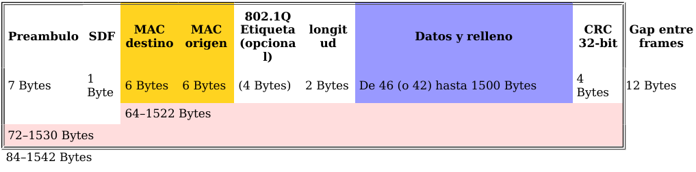
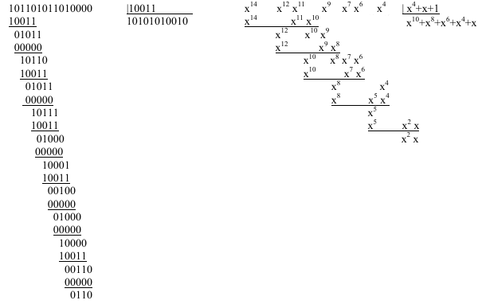
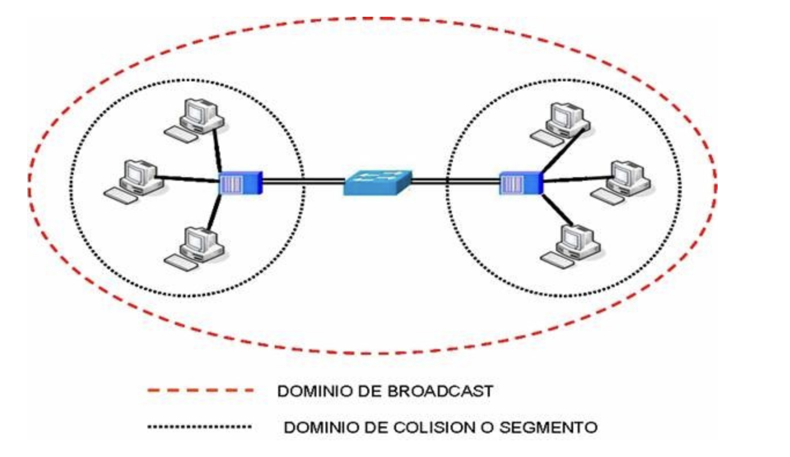
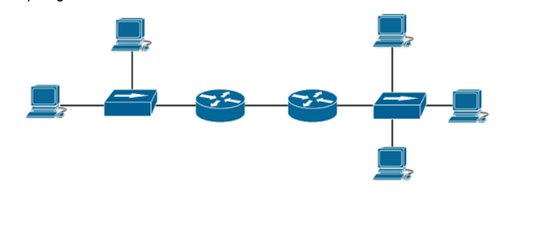

# Tema 4. Capa de enlace

En este tema bajamos a la **capa 2**: cómo se forman las **tramas**, cómo se usa la **MAC**, cómo el **switch** decide a qué puerto enviar y qué son los **dominios de colisión y difusión**.

!!! tip "Primera clase"
    Empieza por el [cuestionario inicial](#cuestionario-inicial). No hace falta estudiar el tema completo antes: el cuestionario sirve para ver qué sabes al empezar.

## Propuesta didáctica

Trabajamos los **RA1** y **RA4** del módulo Redes de área local (0225):

> **RA1.** *Reconoce la estructura de redes locales cableadas analizando las características de entornos de aplicación y describiendo la funcionalidad de sus componentes.*

> **RA4.** *Instala equipos en red, describiendo sus prestaciones y aplicando técnicas de montaje.*

### Criterios de evaluación (selección)

**RA1**

* **CE1a**: Se han descrito los principios de funcionamiento de las redes locales.
* **CE1c**: Se han descrito los elementos de la red local y su función.

**RA4**

* **CE4a**: Se han identificado las características funcionales de las redes inalámbricas.
* **CE4g**: Se han identificado los protocolos.
* **CE4h**: Se han configurado los parámetros básicos.

!!! note "VLAN"
    Las **VLAN** (CE4j) se desarrollan en el **Tema 6**. Aquí solo una mención breve: el switch puede segmentar lógicamente; el detalle (access/trunk, 802.1Q) va más adelante.

### Contenidos

* Subcapas LLC y MAC; funciones de la capa de enlace.
* Trama Ethernet IEEE 802.3; CRC / FCS.
* Acceso al medio: idea de CSMA/CD (y mención CSMA/CA en Wi‑Fi).
* Switch: aprendizaje MAC; dominios de colisión y difusión.
* STP y EtherChannel (visión breve).
* Protocolos 802.3 / 802.11 (mención).

### Programación de aula (orientativa, ~14–16 h)

| Sesiones | Contenidos | Actividades |
| --- | --- | --- |
| 1 | Presentación + cuestionario inicial | Cuestionario |
| 2–3 | LLC/MAC; trama Ethernet; CRC | **AC401** |
| 4 | Segmentación y agrupación | AC402 |
| 5–7 | Acceso al medio; switch y MAC learning | AC403 |
| 8–9 | Dominios colisión / difusión | **PR401** |
| 10–11 | STP (y EtherChannel breve) | AC404 |
| 12–14 | Packet Tracer: STP | **PR402** |
| 15–16 | Repaso | — |

---

## Cuestionario inicial

!!! question "Antes de empezar — responde con lo que sepas"
    1. ¿Qué función cumple la capa de enlace en el modelo OSI?
    2. ¿Qué son las subcapas LLC y MAC?
    3. ¿Qué campos principales tiene una trama Ethernet?
    4. ¿Para qué sirve el CRC?
    5. ¿Qué diferencia hay entre un hub y un switch?
    6. ¿Qué es una dirección MAC y cómo la usa el switch?
    7. ¿Qué son un dominio de colisión y un dominio de difusión?
    8. ¿Para qué sirve el protocolo STP?
    9. ¿Qué es una VLAN? (solo idea; el detalle es Tema 6)

!!! warning "Soluciones"
    Las soluciones se trabajan en clase o se publican en Aules cuando proceda.

---

## La capa de enlace

La **capa de enlace** (nivel 2 OSI) organiza los bits de la capa física en **tramas**, añade direccionamiento de enlace (**MAC**), detecta errores y gestiona el acceso al medio cuando varios equipos lo comparten.

<figure markdown="span">
  { width="600" }
  <figcaption>La capa de enlace de datos en el modelo OSI</figcaption>
</figure>

Funciones habituales:

- Formación y delimitación de tramas.
- Direccionamiento MAC.
- Detección de errores (CRC).
- Control de flujo (idea básica).
- Control de acceso al medio (CSMA/CD, etc.).

### Subcapas LLC y MAC

En Ethernet (familia IEEE 802) la capa de enlace se divide en:

| Subcapa | Norma / idea | Qué hace |
| --- | --- | --- |
| **LLC** (*Logical Link Control*) | IEEE 802.2 | Interfaz uniforme hacia la capa de red; independiente del medio |
| **MAC** (*Medium Access Control*) | específica del medio | Acceso al medio, direcciones MAC, empaquetado de tramas |

<figure markdown="span">
  { width="600" }
  <figcaption>División de la capa de enlace en LLC y MAC</figcaption>
</figure>

---

## Trama Ethernet (IEEE 802.3)

La **trama** es la PDU de la capa de enlace. En Ethernet cableada usamos el formato **IEEE 802.3**.

<figure markdown="span">
  { width="800" }
  <figcaption>Estructura de una trama Ethernet IEEE 802.3</figcaption>
</figure>

### Campos (visión SMR)

| Campo | Tamaño (aprox.) | Función |
| --- | --- | --- |
| Preámbulo + SDF | 8 bytes | Sincronización y comienzo de trama |
| MAC destino / origen | 6 + 6 bytes | Quién recibe / quién envía |
| Longitud / Tipo | 2 bytes | Longitud o tipo de protocolo superior (p. ej. IPv4) |
| Datos (+ relleno) | 46–1500 bytes | Carga útil; mínimo 64 bytes de trama |
| **FCS** | 4 bytes | **CRC-32** para detectar errores |

**Dirección MAC** (48 bits): se escribe en hex (`F2:3E:C1:8A:B1:01`). Los primeros 3 bytes suelen ser el **OUI** del fabricante; los últimos identifican la tarjeta. `FF:FF:FF:FF:FF:FF` es **broadcast** (todos en el dominio de difusión).

!!! note "Etiqueta VLAN"
    En un enlace troncal puede aparecer una etiqueta **802.1Q** (4 bytes). Lo detallamos en el **Tema 6**.

### CRC (detección de errores)

1. El emisor calcula un valor CRC y lo pone en el **FCS**.
2. El receptor recalcula el CRC.
3. Si no coincide → trama errónea → **se descarta** (el CRC no corrige; la retransmisión la pide la capa superior si hace falta).

Ventajas: implementación sencilla en hardware y buena detección de errores por ruido. Limitación: **detecta**, no corrige.

<figure markdown="span">
  { width="500" }
  <figcaption>Idea de comprobación por CRC</figcaption>
</figure>

---

## Segmentación y agrupación

- **Segmentación**: si los datos son demasiado grandes, se parten en tramas (límite práctico ~1500 bytes de datos en Ethernet).
- **Agrupación**: varios mensajes cortos pueden ir en una sola trama para reducir overhead de cabeceras.

---

## Acceso al medio

Cuando el medio se **comparte**, hacen falta reglas para no pisarse. Familias habituales:

| Familia | Idea | Ejemplo |
| --- | --- | --- |
| Particionado de canal | Reparto fijo (tiempo / frecuencia) | TDM, FDM |
| Toma de turnos | Solo transmite quien tiene permiso / testigo | Polling, Token Ring |
| Acceso aleatorio | Compiten cuando necesitan | ALOHA, CSMA/CD, CSMA/CA |

### CSMA/CD (idea Ethernet clásico)

1. **Carrier Sense**: escuchar antes de transmitir.
2. **Multiple Access**: si está libre, transmitir.
3. **Collision Detection**: si hay colisión, parar, esperar un tiempo aleatorio (**backoff**) y reintentar.

En redes modernas con **switches full-dúplex** las colisiones prácticamente desaparecen: cada puerto es un dominio de colisión propio.

### CSMA/CA (mención Wi‑Fi)

En inalámbrico (**IEEE 802.11**) se usa **CSMA/CA** (evitar colisiones), porque detectarlas en el aire es más difícil que en cable.

!!! tip "Diferencia clave"
    **CSMA/CD** detecta colisiones después (Ethernet cableado clásico). **CSMA/CA** intenta evitarlas antes (Wi‑Fi).

---

## Switches y aprendizaje MAC

Un **switch** reenvía tramas según la **tabla MAC** (MAC ↔ puerto):

1. Lee la MAC **origen** y la asocia al puerto de llegada.
2. Si conoce la MAC **destino**, envía solo a ese puerto.
3. Si no la conoce (o es broadcast), **inunda** (todos los puertos excepto el de origen).

Ventajas frente al hub: menos colisiones, mejor rendimiento, full-dúplex y menos tráfico visible en todos los puertos. Las entradas de la tabla MAC suelen caducar si no se renuevan (aging).

---

## Dominios de colisión y de difusión

| Concepto | Qué es | Hub | Switch | Router |
| --- | --- | --- | --- | --- |
| **Dominio de colisión** | Equipos cuyas tramas pueden colisionar | Extiende (1 por hub) | 1 por puerto | Separa por interfaz |
| **Dominio de difusión** | Quién recibe broadcast | Extiende | Extiende (mismo switch) | **Limita** (cada interfaz = otro dominio) |

<figure markdown="span">
  { width="700" }
  <figcaption>Dominios de colisión con hubs, switches y router</figcaption>
</figure>

<figure markdown="span">
  { width="700" }
  <figcaption>Dominios de difusión: el router los separa</figcaption>
</figure>

<figure markdown="span">
  { width="700" }
  <figcaption>Ejemplo de topología para contar dominios</figcaption>
</figure>

!!! tip "Regla práctica"
    Contar dominios: cada puerto de switch (y cada interfaz de router) ≈ un dominio de colisión; cada interfaz de router ≈ un dominio de difusión. Un switch solo no “rompe” el broadcast.

---

## STP (Spanning Tree) — breve

Si varios switches forman un **bucle** físico (redundancia), aparecen problemas graves:

- Bucles de tráfico e inundación de **broadcast**.
- Saturación del ancho de banda.
- Tablas MAC inestables.

**STP** convierte la malla física en un **árbol lógico** sin bucles:

1. Los switches intercambian **BPDU**.
2. Se elige un **switch raíz** (*root bridge*).
3. Se calculan las mejores rutas hacia la raíz.
4. Se **bloquean** los puertos que cerrarían bucles.
5. Si falla un enlace activo, se reactiva uno bloqueado.

Variantes: **RSTP** (convergencia más rápida), **MSTP** (varios árboles / VLANs).

---

## EtherChannel — breve

**EtherChannel** (agregación de enlaces) une varios cables físicos en un **enlace lógico** de más ancho de banda y con cierta redundancia. Negociación: **LACP** (estándar IEEE) o **PAgP** (Cisco); también modo manual (ON). Se usa entre switches o entre switch y servidor.

---

## Protocolos de enlace (mención)

| Ámbito | Estándares / idea |
| --- | --- |
| Cableado | **IEEE 802.3** (Ethernet, Fast, Gigabit…) |
| Inalámbrico | **IEEE 802.11** (Wi‑Fi); CSMA/CA |
| Otros (contexto) | Token Ring, FDDI (históricos) |

Dispositivos típicos de capa 2: **bridges**, **switches**, **puntos de acceso**.

!!! tip "VLAN (adelanto)"
    Una **VLAN** crea redes lógicas dentro del mismo switch físico y reduce dominios de difusión. Diseño y configuración (access/trunk, 802.1Q) → **Tema 6**.

---

## Actividades

!!! tip "Formato de entrega"
    Las entregas en **Aules** son **obligatorias en Markdown** (`.md`). No se aceptan PDF.  
    Nombre del archivo: `AC4XX.md` o `PR4XX.md` (sustituye XX por el número). Respeta la fecha de vencimiento.  
    Escribiremos los `.md` con **Visual Studio Code**.

    !!! note "Cómo empezar"
        - Guía de Markdown: [tutorialmarkdown.com/guia](https://tutorialmarkdown.com/guia)
        - Documentación de Visual Studio Code: [code.visualstudio.com/docs](https://code.visualstudio.com/docs)

### AC401 — Trama Ethernet

* :simple-readdotcv: **AC401**. (RA1 // CE1a, CE1c // **AC 0–1**). Esquema de la trama IEEE 802.3: campos, tamaño aproximado y función. Incluye un ejemplo con valores hexadecimales inventados (MAC origen/destino, tipo 0x0800) y explica el papel del FCS/CRC.

### AC402 — Segmentación vs agrupación

* :simple-readdotcv: **AC402**. (RA1 // CE1a // **AC 0–1**). Explica con un ejemplo cuándo conviene **segmentar** y cuándo **agrupar** en la capa de enlace. Relaciónalo con el tamaño máximo de trama Ethernet y con la eficiencia.

### AC403 — Dominios de colisión y difusión

* :simple-readdotcv: **AC403**. (RA1 // CE1a, CE1c // **AC 0–1**). Tabla hub / switch / router: efecto sobre dominios de colisión y de difusión. Dos frases de impacto en el rendimiento.

### AC404 — STP

* :simple-readdotcv: **AC404**. (RA1 // CE1a // RA4 // CE4g // **AC 0–1**). Problema que resuelve STP; idea de switch raíz y puerto bloqueado; diferencia breve STP vs RSTP.

### PR401 — Dominios en esquemas

* :simple-neutralinojs: **PR401**. (RA1 // CE1a, CE1c // **PR 0–10**). Identificación de dominios de colisión y difusión.

  **Recuerda:** hub → un dominio de colisión compartido; switch → un dominio de colisión por puerto y un dominio de difusión; router → separa colisión y difusión por interfaz.

  Responde en el `.md` (marca la opción correcta; en las de varias respuestas, todas las válidas):

  1. ¿En qué caso PC3 está en el **mismo dominio de colisión** que PC1?  
     a) Mismo switch · b) Separados por switch · c) Mismo hub · d) Interfaces distintas del mismo router  

  2. ¿Qué situaciones ponen a PC3 en **otro dominio de broadcast** que PC1? (elige las correctas)  
     a) Separados por hub · b) Mismo switch · c) Separados por bridge · d) Otra red lógica · e) Separados por switch · f) Separados por router  

  3. Sobre la figura de este tema (`dominio_colision_difusion.png`): ¿cuántos dominios de broadcast y de colisión hay? Justifica el conteo en 3–5 líneas.  
     a) 3 BD / 3 CD · b) 2 BD / 3 CD · c) 1 BD / 2 CD · d) 3 BD / 8 CD · e) 8 BD / 3 CD · f) Ninguna  

  4. Afirmaciones ciertas (elige las correctas):  
     a) Los switches disminuyen el nº de dominios de colisión · b) Los routers disminuyen el nº de dominios de colisión · c) Los routers aumentan el nº de dominios de colisión · d) Los switches aumentan el nº de dominios de colisión · e/f) Bridges disminuyen / aumentan dominios de colisión  

  5. ¿Qué afirmación es **incorrecta**?  
     a) Los hubs aumentan el nº de dominios de broadcast · b) Los routers aumentan el nº de dominios de colisión · c) Los routers aumentan el nº de dominios de broadcast · d) Cada interfaz del router es un dominio de broadcast y de colisión · e) Los switches aumentan el nº de dominios de colisión  

| Criterio | Descripción | Puntos |
| --- | --- | --- |
| Preguntas 1–2 | Respuestas coherentes | 0–2 |
| Pregunta 3 (diagrama) | Conteo justificado | 0–3 |
| Preguntas 4–5 | Teoría hub/switch/router | 0–3 |
| Claridad del `.md` | Orden y legibilidad | 0–2 |
| **Total** | | **/10** |

### PR402 — Packet Tracer: STP

* :simple-cisco: **PR402**. (RA1 // CE1a, CE1c // RA4 // CE4g, CE4h // **PR 0–10**). Simulación en Packet Tracer: 3 switches en bucle, PCs y un servidor; observar tabla MAC, puertos bloqueados/forwarding por STP y reconvergencia al cortar un enlace. El guion completo se facilitará en clase / Aules.

---

## Referencias rápidas

- Sitio del módulo: [fjavier-hernandez.github.io/ral](https://fjavier-hernandez.github.io/ral/)
- Simulación: [Cisco Packet Tracer](https://www.netacad.com/es/cisco-packet-tracer)
- Entregas: [Visual Studio Code](https://code.visualstudio.com/docs) + [Markdown](https://tutorialmarkdown.com/guia)
- Normas: [Normas del taller](../00-normas/normas_taller.md)

*[RA]: Resultado de aprendizaje  
*[CE]: Criterio de evaluación  
*[AC]: Actividad de clase  
*[PR]: Práctica  
*[MAC]: Media Access Control  
*[LLC]: Logical Link Control  
*[STP]: Spanning Tree Protocol  
*[CRC]: Cyclic Redundancy Check
