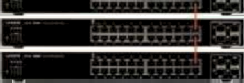
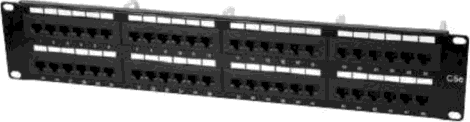

# :material-network: ELEMENTOS DE UNA RED DE DATOS Y TELECOMUNICACIONES

En esta unidad estudiaremos los **elementos fundamentales** que componen una red de datos y telecomunicaciones, desde los adaptadores de red hasta los equipos de electrónica más avanzados. Nos enfocaremos en la funcionalidad, características técnicas y aplicaciones de cada componente, así como en su integración dentro del sistema de cableado estructurado.

Los elementos de red son los componentes físicos y lógicos que permiten establecer la conectividad, gestionar el tráfico de datos y proporcionar los servicios necesarios para el funcionamiento eficiente de la red. Dominar estos conceptos es esencial para diseñar, implementar y mantener redes locales robustas y escalables.

!!! info "<strong>Objetivos de la unidad</strong>"
    
    • Identificar y clasificar los diferentes elementos de red 
    • Comprender las funciones y características de cada componente 
    • Aplicar técnicas de instalación y configuración 
    • Diseñar sistemas de distribución eficientes 
    • Evaluar la idoneidad de cada elemento según el entorno
    

## 🔧 ELEMENTOS FUNDAMENTALES DE RED

La **infraestructura de red** comprende todos los elementos físicos y lógicos necesarios para establecer la conectividad entre dispositivos en una red local. Esta infraestructura incluye los adaptadores de red, equipos de distribución, elementos de conexión y la electrónica que gestiona el tráfico de datos.

En esta unidad analizaremos los componentes fundamentales:

!!! abstract "<strong>Componentes principales</strong>"
    
    **🖥️ Adaptadores de red**: Interfaces de conexión entre equipos y red 
    **🏢 Armarios de distribución**: Centros de cableado y equipamiento 
    **🔌 Paneles de parcheo**: Organización y conexión del cableado 
    **📡 Electrónica de red**: Dispositivos de gestión y conmutación 
    **🌐 Elementos inalámbricos**: Puntos de acceso y repetidores
    

La correcta selección e implementación de estos elementos es crucial para garantizar la escalabilidad, mantenibilidad y rendimiento de la red, cumpliendo con estándares internacionales y mejores prácticas de la industria.

## 📚 Propuesta didáctica

En esta unidad trabajamos los **RA2, RA3 y RA4 de RAL**:

> **RA2.** *Despliega el cableado de una red local interpretando especificaciones y aplicando técnicas de montaje.*
> 
> **RA3.** *Interconecta equipos en redes locales cableadas describiendo estándares de cableado y aplicando técnicas de montaje de conectores.*
> 
> **RA4.** *Instala equipos en red, describiendo sus prestaciones y aplicando técnicas de montaje.*

### 🎯 Criterios de evaluación

#### Criterios de evaluación del RA2

> **CE2a**: *Interpreta las especificaciones del cableado de una red local analizando los requisitos técnicos y aplicando estándares de cableado estructurado.*
> 
> **CE2b**: *Identifica los componentes del sistema de cableado reconociendo medios de transmisión, conectores y equipos de distribución.*
> 
> **CE2c**: *Aplica técnicas de montaje del cableado siguiendo procedimientos de instalación y cumpliendo normativas de seguridad.*
> 
> **CE2d**: *Verifica el funcionamiento del cableado instalado utilizando herramientas de medición y pruebas de conectividad.*

#### Criterios de evaluación del RA3

> **CE3a**: *Describe los estándares de cableado para redes locales identificando las normas TIA/EIA-568 y categorías de cable.*
> 
> **CE3b**: *Identifica los tipos de conectores y su uso analizando conectores RJ, de fibra óptica y coaxiales.*
> 
> **CE3c**: *Aplica técnicas de montaje de conectores realizando terminaciones T568A/T568B y crimpado de conectores.*
> 
> **CE3d**: *Verifica la conectividad de los equipos interconectados realizando pruebas de continuidad y funcionamiento.*

#### Criterios de evaluación del RA4

> **CE4a**: *Describe las prestaciones de los equipos de red analizando características técnicas de switches, routers y puntos de acceso.*
> 
> **CE4b**: *Identifica los componentes de los equipos de red reconociendo interfaces, fuentes de alimentación y sistemas de ventilación.*
> 
> **CE4c**: *Aplica técnicas de montaje de equipos de red instalando en racks y cumpliendo estándares de cableado.*
> 
> **CE4d**: *Verifica el funcionamiento de los equipos instalados realizando pruebas de conectividad y configuración básica.*

### Contenidos

* Adaptadores de red: tipos, características y funcionalidades.
* Armarios de distribución: estructura, componentes y organización.
* Paneles de parcheo: tipos, conexiones y codificación.
* Elementos de conexión: tomas de usuario, latiguillos y soportes.
* Electrónica de red: repetidores, hubs, switches, routers y gateways.
* Puntos de acceso inalámbricos y repetidores.
* Dominios de colisión y difusión.

!!! question "Cuestionario inicial"
    1. ¿Qué es un adaptador de red y cuáles son sus características principales?
    2. ¿Qué elementos se encuentran en el interior de un armario de distribución?
    3. ¿Para qué sirve un panel de parcheo y cómo se organiza?
    4. ¿Cuáles son las diferencias entre un hub y un switch?
    5. ¿Qué funciones realiza un router en una red?
    6. ¿Cómo funciona un punto de acceso inalámbrico?
    7. ¿Qué son los dominios de colisión y difusión?
    8. ¿Cuáles son los tipos de tomas de usuario disponibles?
    9. ¿Qué es la tecnología PoE y para qué se utiliza?

## Programación de Aula (15h)

Esta unidad se imparte en la primera evaluación, con una duración estimada de 15 sesiones lectivas:

| Sesión | Contenidos | Actividades | Criterios trabajados |
|--------|------------|-------------|----------------------|
| 1-2 | Adaptadores de red y NICs | Cuestionario inicial, AC401 | CE4a, CE4b |
| 3-5 | Armarios y paneles de distribución | Actividad AC402, práctica PR403 | CE2a, CE2b, CE4c |
| 6-8 | Electrónica de red básica | Actividad AC404 | CE4a, CE4b, CE4c |
| 9-10 | Routers y gateways | Actividad AC405 | CE4a, CE4b, CE4d |
| 11-12 | Práctica: Instalación de equipos | PR406, PR407 | CE4c, CE4d |
| 13-15 | Repaso y evaluación | Evaluación práctica | Todos los criterios |

---

## 🖥️ Adaptadores de red

El **adaptador de red** (o tarjeta de red) es el elemento que debe tener un equipo para estar conectado a una red. La forma habitual de presentación de este elemento es, precisamente, una tarjeta que se acopla al equipo a través de un slot PCI.

Sin embargo, los adaptadores de red pueden ir conectados al equipo a través de otro tipo de puertos: USB, PCMCIA, etc.

### 🔌 Características del adaptador de red

El modelo típico de adaptador de red suele identificarse por las siglas **NIC** (Network Interface Card, tarjeta de interfaz de red).

Los NIC permiten que los equipos puedan conectarse en diferentes topologías. Los puertos más comunes son para cable de par trenzado (por conexión RJ-45) y para cable coaxial, pero también es posible disponer de tarjetas de red con puerto para fibra óptica, concretamente con conexiones SC, ST o MT-RJ.

Cada NIC tiene su propia identificación, llamada **dirección física** o **dirección MAC**. Es un código de 48 bits que se fija en el momento de la fabricación (similar al número de bastidor de un coche).

Los equipos pueden identificarse en la red por su IP o también por su MAC, lo cual ofrece más seguridad.

### ⚙️ Características técnicas del NIC

Además del tipo de puertos de que disponga, el NIC se caracteriza por:

#### 📡 Modo de transmisión

- **Half-duplex**: el canal de comunicación no se puede utilizar de forma simultánea para emitir y recibir información.
- **Full-duplex**: el canal de comunicación permite la emisión y transmisión de forma simultánea.

#### 🌐 Protocolo de enlace de datos

La gran mayoría de las tarjetas de red utilizan el protocolo **Ethernet** para las comunicaciones, en sus diversas variantes: Ethernet, Fast Ethernet, Gigabit Ethernet y, próximamente, 10-Gigabit Ethernet.

#### ⚡ Velocidad de transmisión

Depende del medio utilizado para la transmisión, el modo y el protocolo empleado. Casi todas las tarjetas de red actuales admiten varias velocidades (10 Mbps, 100 Mbps, 1000 Mbps), que suelen indicarse con su denominación.

Así, una tarjeta 10/100 puede funcionar a dos velocidades y una tarjeta 10/100/1000 (la más típica) a tres.

#### 🔋 Capacidad Wake On LAN

Consiste en la capacidad de la tarjeta de red de encender un equipo de forma remota. Este tipo de tarjetas disponen de unas conexiones que se adaptan a la placa base para que, a través de la tarjeta, puedan transmitirse los impulsos de encendido o de suspensión del equipo.

Esta propiedad es muy apreciada en entornos de red donde se necesita poder acceder a determinados equipos en momentos muy concretos sin que tengan que estar encendidos de forma permanente.

<figure>
  
  <figcaption>Elementos de un adaptador de red inalámbrico</figcaption>
</figure>

### 🔗 Tipos de conexiones del adaptador

El número y tipo de conexiones del adaptador es variable. Lo habitual es encontrar una única conexión pero hay variantes en las que se dispone de varias conexiones, como se ve en las imágenes siguientes:

<figure>
  
  <figcaption>Adaptador de red inalámbrico con conexión a placa base, luces testigo y conexión RJ-45</figcaption>
</figure>

<figure>
  
  <figcaption>Adaptador de red con dos salidas RJ-45</figcaption>
</figure>

<figure>
  
  <figcaption>Adaptador de red con una salida RJ-45 y otra salida coaxial</figcaption>
</figure>

<figure>
  
  <figcaption>Adaptador de red con dos salidas de fibra óptica</figcaption>
</figure>

<figure>
  
  <figcaption>Adaptador de red inalámbrico con tres antenas</figcaption>
</figure>

### 💡 Luces testigo

Las luces de testigo varían de un modelo a otro. Cuando hay una, si está fija significa que hay conexión con otro equipo, y si parpadea indica actividad de comunicación.

Cuando hay varias, se destinan a diversos fines: indicar la velocidad de transmisión, el modo de transmisión, etc.

---

## 🏢 Armario de distribución

Como ya hemos comentado, el cableado de una red se centraliza en puntos de distribución a diferente nivel. Estos puntos están constituidos por uno o más armarios de distribución, también llamados **racks**.

El rack recibe todo el cableado de la zona. En el interior del armario, se ubican:

- **Los paneles de parcheo**, donde se conecta el cableado que entra y sale del armario.
- **La electrónica de red**, que se utiliza para aplicar una configuración lógica a los equipos que a ella se conectan.
- **Elementos de suministro eléctrico**, que se encargan de proporcionar electricidad a la electrónica de red y al sistema de ventilación del armario.
- **Accesorios varios**, como pueden ser elementos para ordenar los cables, bandejas para colocar equipamiento portátil, etc.

### 🏗️ Estructura del armario

El armario de distribución, por lo general, tiene esta apariencia:

<figure>
  
  <figcaption>Vista frontal de un armario de distribución</figcaption>
</figure>

<figure>
  
  <figcaption>Despiece de un armario de distribución mostrando sus componentes</figcaption>
</figure>

La parte delantera es una puerta, habitualmente de cristal o un material transparente, que permita visualizar el contenido del armario sin necesidad de abrirlo.

Tanto las paredes como la puerta y el techo son desmontables, lo que significa que pueden colocarse o no, según las circunstancias. Así, por ejemplo, si quieren colocarse dos armarios juntos, puede obviarse la pared común a ambos para comunicarlos.

Por otro lado, el suelo y el techo pueden tener una abertura para pasar por ella el cableado.

### 📏 Estándar de 19 pulgadas

El interior del armario tiene cuatro bastidores que forman un armazón de exactamente **19 pulgadas** de anchura. Esta medida es estándar y universal, de forma que todos los accesorios y la electrónica diseñados para armarios tienen esta anchura. Este tipo de productos se dice que son **rackeables**.

Los bastidores tienen agujeros practicados cada **5 cm**. Esta distancia se denomina **unidad U**, de manera que la altura de un armario se mide en unidades U: un armario de 40 U, por ejemplo, tendría 41 agujeros en cada bastidor con una longitud útil de 40 x 5 cm.

Los elementos que son rackeables también se miden en unidades U. Por ejemplo, un switch de 2 U o un panel de parcheo de 4 U.

El armazón de bastidores tiene un cable de conexión a tierra para eliminar la carga electrostática que pudiera generarse.

### 📊 Clasificación por tamaño

#### Racks menores de 12 U

Se utilizan en instalaciones de pequeñas redes o como distribuidores en habitáculos donde hay pocos equipos.

Por sus dimensiones, suelen fijarse a la pared, aunque en la mayoría pueden instalarse unas ruedas para colocarlos en el suelo y poder desplazarlos.

#### Racks entre 12 U y 25 U

Se usan para redes de tamaño medio. Ideales para distribuidores principales o de planta.

Pueden fijarse a la pared, o colocarse en el suelo con unas ruedas por si fuera necesario desplazarlos.

#### Racks de más de 24 U

Se emplean en redes de tamaño medio o grande como distribuidores de planta o principales.

Suelen incorporar sistema de ventilación, alimentación, filtros de aire, etc. Por sus dimensiones, son armarios de suelo.

<figure>
  
  <figcaption>Diferentes tipos de racks según su tamaño y aplicación</figcaption>
</figure>

<figure>
  
  <figcaption>Rack pequeño para instalaciones domésticas o pequeñas oficinas</figcaption>
</figure>

<figure>
  
  <figcaption>Rack mediano para redes de tamaño medio</figcaption>
</figure>

<figure>
  
  <figcaption>Rack grande para centros de datos y redes empresariales</figcaption>
</figure>

---

## 🔌 Panel de parcheo

El **panel de parcheo** (patch panel) es uno de los elementos que se colocan en el rack donde se conectan los cables de par trenzado, que entran y salen del mismo.

La finalidad del panel de parcheo es organizar las líneas de entrada y de salida que confluyen en el armario.

### 📋 Características del panel

El panel de parcheo típicamente ocupa **1 U** y dispone de **24 tomas** que pueden venir incorporadas en el mismo o en módulos, que pueden ser individuales o estar divididos en grupos de 4.

<figure>
  
  <figcaption>Panel de parcheo de 24 tomas RJ-45</figcaption>
</figure>

También hay paneles de parcheo compuestos, que tienen dos o más filas de tomas, pudiendo tener 48, 72 o 96 tomas.

<figure>
  
  <figcaption>Panel de parcheo de 96 tomas para grandes instalaciones</figcaption>
</figure>

<figure>
  
  <figcaption>Panel de parcheo de 48 tomas</figcaption>
</figure>

### 🏷️ Sistema de codificación

Como ya veremos más adelante, las tomas del panel de parcheo se identifican mediante una codificación (números, letras, colores, etc.), que se corresponderá con la toma que hay al otro lado del cable que está conectado a él. De esta manera, por ejemplo, visualizando los paneles de parcheo se pueden identificar claramente todas las tomas de red de una zona, una planta o incluso un edificio completo.

<figure>
  
  <figcaption>Sistema de codificación en panel de parcheo</figcaption>
</figure>

<figure>
  
  <figcaption>Detalle de numeración en panel de parcheo</figcaption>
</figure>

<figure>
  
  <figcaption>Código de colores en tomas de panel</figcaption>
</figure>

### 🔧 Tipos de conexiones

Las conexiones más simples de un panel de parcheo son rosetas, con un adaptador especial para el panel.

Cuando las conexiones vienen en formato modular, que es lo más habitual, en lugar de rosetas se utilizan unas regletas modulares con un sistema de código de colores similar al de las rosetas.

Los paneles de parcheo también pueden ser de fibra óptica. Van montados en cajones rackeables, en cuyo interior los cables multifibra distribuyen los diferentes hilos a las correspondientes tomas del panel.

<figure>
  
  <figcaption>Panel de parcheo de fibra óptica con distribución interna</figcaption>
</figure>

Detalle de la parte trasera del panel de parcheo, donde se aprecia la numeración y código de colores de cada conexión.

---

## 🔗 Elementos de conexión y guiado

Ya hemos comentado que los puestos de usuario de una red son el punto desde el que parte la conexión hacia el armario de distribución. Estos puestos de usuario disponen de un punto de conexión llamado **toma de usuario**, **toma de telecomunicaciones** o, de forma común, **roseta** (por contener una conexión de este tipo en su interior).

### 📍 Toma de usuario (TO)

Las tomas de usuario, abreviadas con las siglas **TO**, pueden ofrecer al usuario una o más conexiones a la red. Las más simples constan de una única conexión (de datos) pero cada vez es más habitual que cada usuario tenga al menos dos tomas: una para voz y otra para datos.

Una toma de usuario consta de una o más conexiones RJ-45 hembra en su interior, junto con una carátula donde se soportan.

<figure>
  
  <figcaption>Detalle de la instalación de una conexión hembra RJ-45 en una toma de usuario</figcaption>
</figure>

### 🏠 Tipos de tomas de usuario

Las tomas de usuario pueden ser de tres tipos:

#### 🖼️ De superficie

- La caja se fija a la pared mediante tirafondos.
- El cableado llega mediante canaleta y se recibe a través de cualquiera de las paredes laterales, que tienen orificios pretroquelados.
- Se utiliza en redes con canalización externa.

#### 🔲 Empotrables

- La caja va encastrada en un agujero que se hace en la pared.
- El cableado llega mediante canaladura interna de la pared y se recibe a través de cualquiera de las paredes laterales, que tienen orificios pretroquelados.

#### 🏢 De suelo

- Similar a la caja empotrable, pero ubicada en suelo técnico.
- El cableado llega a través de bandejas subterráneas o canaladuras.
- Muy utilizado en lugares donde se necesita ubicar tomas de red pero no hay paredes cerca.

<figure>
  
  <figcaption>Diferentes tipos de tomas de usuario según su instalación</figcaption>
</figure>

<figure>
  
  <figcaption>Toma de usuario de superficie con fijación a pared</figcaption>
</figure>

<figure>
  
  <figcaption>Toma de usuario empotrable en pared</figcaption>
</figure>

<figure>
  
  <figcaption>Toma de usuario para suelo técnico</figcaption>
</figure>

<figure>
  
  <figcaption>Toma de usuario doble para voz y datos</figcaption>
</figure>

### 🔌 Latiguillos

Para conectar las líneas que unen las TO con los armarios se utilizan unos cables llamados **latiguillos**.

Salvo que se especifique lo contrario, entenderemos que el latiguillo es de cable de par trenzado, con conectores RJ-45 en ambos extremos. Sin embargo, también hay latiguillos de otro tipo de cable, como coaxial o fibra óptica.

Se utilizan latiguillos en dos situaciones:

- Para conectar el equipo a la toma de usuario.
- Para derivar la conexión desde un panel de parcheo a otro lugar que, o bien es otro panel de parcheo, o electrónica de red.

<figure>
  
  <figcaption>Latiguillo de cable UTP con conectores RJ-45</figcaption>
</figure>

Los latiguillos pueden fabricarse manualmente o comprarse ya hechos, de medidas concretas. Los de fabricación casera se utilizan cuando se necesitan cables de longitudes que no se ajustan a las de los comercializados. Las medidas más habituales de estos son 0,5 m, 1 m y 2 m.

A partir del cable de par trenzado de categoría 6, por norma, no se permite la fabricación casera de latiguillos, sean de la longitud que sean.

### 🛤️ Soportes de guiado

Todo el cableado de la red, tanto los latiguillos como los cables que van de TO a armario, las líneas que conectan los armarios de un edificio, o incluso de varios, se conduce a través de soportes de guiado.

Estos soportes pueden ser muy diversos, en función del tipo de medio por el que deban atravesar los cables, las vulnerabilidades a las que se sometan, etc. De forma general, los soportes de guiado son:

#### 📦 Canalizaciones

Que pueden ser internas o externas, mediante tubo, canaleta u otro material. Se emplean para dirigir grupos pequeños de cable por paredes y suelos.

#### 🏗️ Bandejas de guiado

Se colocan en techos o suelos técnicos. Actúan como carreteras sobre las que van grupos de cables provenientes de diferentes canalizaciones. Se emplean como troncales en plantas de edificios y para guiar el cableado vertical del edificio.

#### 🔗 Guías de cables

Se ubican en los bastidores del armario de distribución, e incluso en la parte trasera de algunos modelos de paneles de parcheo. Ayudan a organizar los mazos de cables que entran y salen del armario.

#### 📋 Pasahilos

Es un elemento rackeable (ocupa 1U) que se utiliza de forma conjunta con el resto de elementos del armario para organizar los grupos de cables de los paneles de parcheo y de la electrónica de red.

<figure>
  
  <figcaption>Canalizaciones internas y externas para cableado de red</figcaption>
</figure>

<figure>
  
  <figcaption>Bandejas de guiado para cableado horizontal y vertical</figcaption>
</figure>

### ⚡ Tecnología PoE (Power Over Ethernet)

Es una tecnología que permite la alimentación eléctrica de dispositivos de red a través del cable de par trenzado, sin importar su categoría.

Las características de PoE están fijadas en el estándar **802.3af** que determina, entre otras cosas, que el voltaje a suministrar es de **48 V**. Sin embargo, muchos dispositivos utilizan esta tecnología sin regirse por este estándar porque necesitan un voltaje diferente.

PoE es una tecnología empleada, sobre todo, por dispositivos inalámbricos.

<figure>
  
  <figcaption>Repetidor WiFi con alimentación PoE</figcaption>
</figure>

<figure>
  
  <figcaption>Icono representativo de la tecnología PoE</figcaption>
</figure>

Modos de uso del repetidor: con vínculo inalámbrico (arriba) y con extensión cableada (abajo).

## 🌐 Dominios de colisión y de difusión

El flujo de comunicaciones entre los equipos se hará a través de la infraestructura de la red. Una actividad elevada en las transmisiones aumentaría el riesgo de colisiones de los paquetes que circulan por la red.

Para que la pérdida de la información sea mínima, hay que plantear la red de forma que las transmisiones sean eficientes: esto se consigue obligando a que circule la menor cantidad de tráfico posible. Aquí entran en juego dos conceptos muy importantes:

### 💥 Dominio de colisión

Es un segmento de la red que comparte las comunicaciones con todos los equipos conectados a ella. Cuando un equipo transmite, lo hace para todos los dispositivos del segmento de red, con independencia de con cuál de ellos quiera comunicarse.

- **Toda la electrónica de red que opera por debajo de la capa 2** del modelo OSI extiende dominios de colisión. Es decir, todos los equipos unidos a un hub o a un repetidor forman un dominio de colisión.

- **Los dispositivos de capa 2 y superiores limitan los dominios de colisión**: en este sentido, cada toma de un switch supone un dominio de colisión diferente, lo que da lugar a tantos dominios de colisión como tomas tenga conectadas.

### 📡 Dominio de difusión

Es una parte de la red en la que un equipo puede transmitir a otro sin necesidad de un dispositivo de enrutamiento, ya que pertenecen a la misma red lógica.

- **Los elementos de electrónica de red por debajo de la capa 3** extienden los dominios de difusión. Es decir, todos los equipos y dispositivos unidos a un hub, un repetidor, un switch o un bridge forman un dominio de difusión.

- **Los dispositivos de capa 3 y superiores** (típicamente el router o los switches de capa 3) se utilizan para dividir dominios de difusión.

La red se vuelve más eficiente cuanto más pequeños sean los dominios de colisión y de difusión.

<figure>
  
  <figcaption>Ejemplo de identificación de dominios de difusión y dominios de colisión en una infraestructura de red</figcaption>
</figure>

---

## 🛠️ Actividades

!!! tip "<strong>Formato de entrega</strong>"
    Para la entrega de las actividades, genera un documento con la práctica descrita a continuación. Deberás crear un archivo PDF con el siguiente formato de nombre: <strong>ACXXX.pdf o PRXXX.pdf</strong>, donde las X representan el número de la actividad. Una vez finalizada la práctica, sube el archivo a Aules (antes de la fecha de vencimiento) para su calificación.

* :simple-readdotcv: **AC401**. (RA4 // CE4a, CE4b // 1-3p). Investiga y documenta las características de los adaptadores de red. Elabora una tabla comparativa con diferentes tipos de NIC, sus velocidades, modos de transmisión y aplicaciones típicas.

* :simple-readdotcv: **AC402**. (RA2 // CE2a, CE2b // 1-3p). Investiga y documenta los componentes de un armario de distribución. Elabora un informe que incluya:
    - Estructura y dimensiones del armario
    - Componentes internos y su función
    - Sistema de unidades U y estándar 19 pulgadas
    - Tipos de racks según tamaño y aplicación

* :simple-readdotcv: **AC403**. (RA4 // CE4a, CE4b // 1-3p). Compara las características de diferentes elementos de electrónica de red. Elabora una tabla que incluya:
    - Repetidores, hubs, switches, routers y gateways
    - Capa del modelo OSI en la que operan
    - Funciones principales y aplicaciones
    - Ventajas y desventajas de cada uno

* :simple-readdotcv: **AC404**. (RA4 // CE4a, CE4b // 1-3p). Investiga la tecnología PoE y sus aplicaciones. Documenta:
    - Estándares PoE y sus características técnicas
    - Dispositivos que utilizan PoE
    - Ventajas y limitaciones de la tecnología
    - Casos de uso prácticos en redes

* :simple-readdotcv: **AC405**. (RA4 // CE4a, CE4b // 1-3p). Analiza los dominios de colisión y difusión en redes. Elabora un informe que incluya:
    - Definición y características de cada dominio
    - Dispositivos que extienden o limitan cada dominio
    - Impacto en el rendimiento de la red
    - Estrategias para optimizar el tráfico de red

!!! tip "<strong>CONCLUSIÓN</strong>"
    Los elementos de red son fundamentales para el funcionamiento eficiente de cualquier sistema de comunicaciones. Conocer las características, funciones y aplicaciones de cada componente nos permite diseñar e implementar redes locales robustas, escalables y adaptadas a las necesidades específicas de cada entorno. La correcta selección e instalación de estos elementos garantiza el rendimiento óptimo y la facilidad de mantenimiento del sistema.