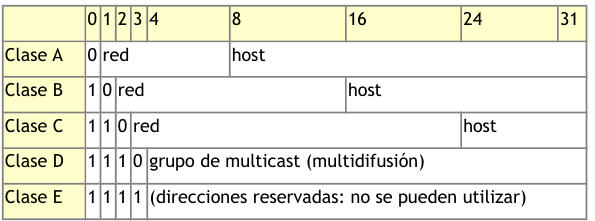
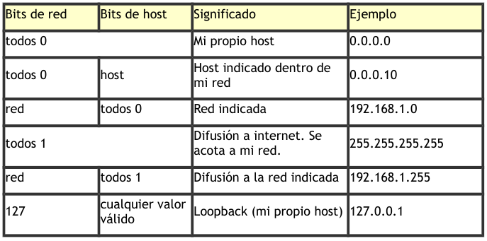
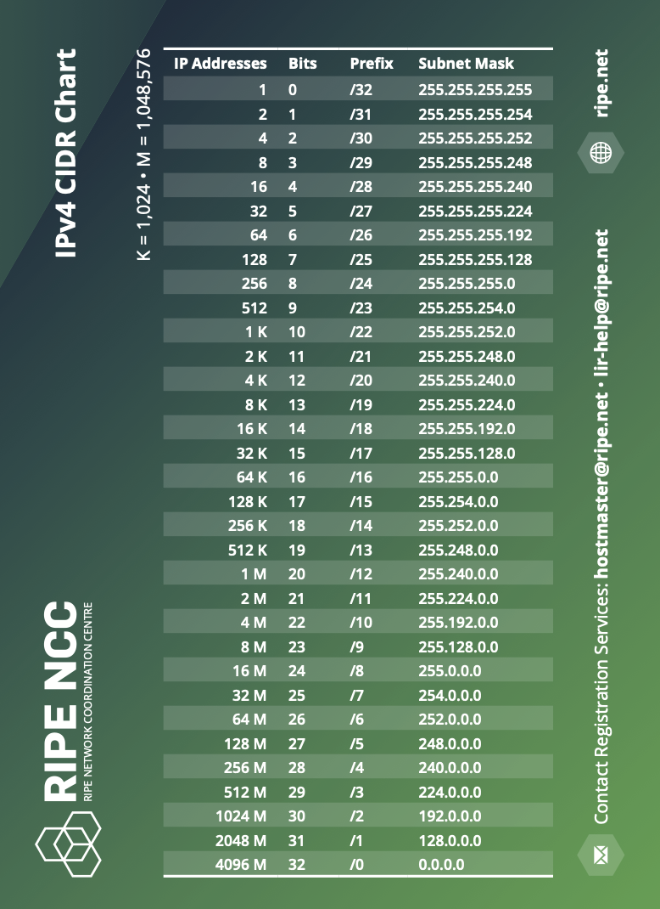
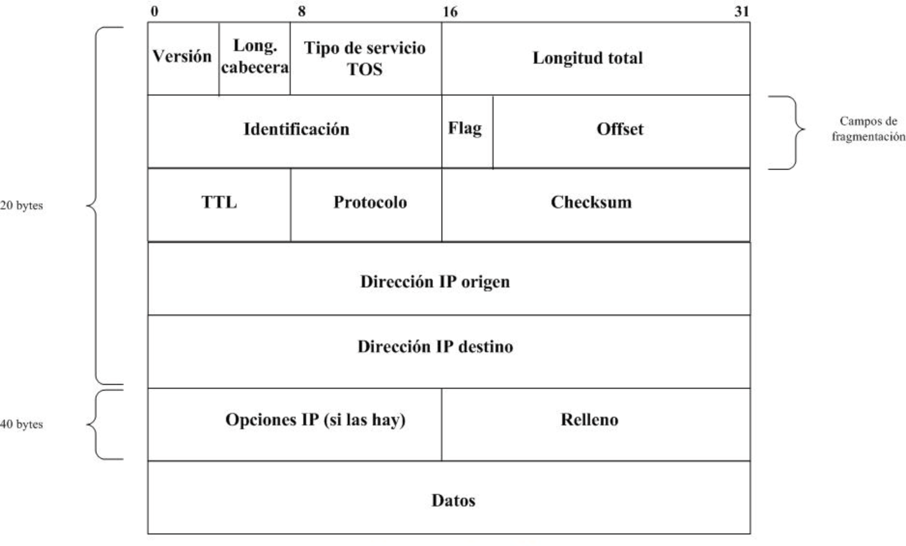

# Tema 5. Capa de red

En este tema pasamos a la **capa 3**: **direcciones IP**, **máscaras**, **CIDR**, el **datagrama IP** y protocolos de apoyo (**ARP**, **ICMP**). También vemos el papel del **router** y cómo configura un cliente (DHCP vs estático).

!!! tip "Primera clase"
    Empieza por el [cuestionario inicial](#cuestionario-inicial). No hace falta estudiar el tema completo antes: el cuestionario sirve para ver qué sabes al empezar.

## Propuesta didáctica

Trabajamos los **RA1** y **RA4** del módulo Redes de área local (0225):

> **RA1.** *Reconoce la estructura de redes locales cableadas analizando las características de entornos de aplicación y describiendo la funcionalidad de sus componentes.*

> **RA4.** *Instala equipos en red, describiendo sus prestaciones y aplicando técnicas de montaje.*

### Criterios de evaluación (selección)

**RA1**

* **CE1a**: Se han descrito los principios de funcionamiento de las redes locales.
* **CE1c**: Se han descrito los elementos de la red local y su función.

**RA4**

* **CE4g**: Se han identificado los protocolos.
* **CE4h**: Se han configurado los parámetros básicos.

!!! note "Subnetting y VLAN"
    El **diseño de subredes** (subnetting) y las **VLAN** se desarrollan en el **Tema 6**. Aquí calculamos red / broadcast / hosts con prefijos habituales (/8, /16, /24…) y usamos CIDR como notación.

### Contenidos

* Funciones de la capa de red; idea TCP/IP en la capa Internet.
* IPv4: formato, clases (contexto) y rangos privados RFC 1918.
* Máscara de red; notación CIDR y tabla de referencia.
* Cálculo de red, broadcast y hosts (ejemplos /24 y similares).
* Datagrama IP (visión breve); ARP; ICMP / ping / traceroute.
* Roles del router; DHCP vs configuración estática en el cliente.

### Programación de aula (orientativa, ~14–16 h)

| Sesiones | Contenidos | Actividades |
| --- | --- | --- |
| 1 | Presentación + cuestionario | Cuestionario |
| 2–3 | Funciones capa red; IPv4 y clases | AC503, AC504 |
| 4–5 | Privadas RFC1918; APIPA | **AC505** |
| 6–8 | Máscara, CIDR, cálculo /24 | **AC501**, AC502 |
| 9–10 | Datagrama IP; ARP | **AC506** |
| 11 | ICMP y comprobaciones | — |
| 12–14 | Packet Tracer: dos LAN + router + ARP | **PR501** |
| 15–16 | Repaso | — |

---

## Cuestionario inicial

!!! question "Antes de empezar — responde con lo que sepas"
    1. ¿Qué función cumple la capa de red?
    2. ¿Qué es una dirección IP y cómo se escribe?
    3. ¿Qué diferencia hay entre IP pública y privada?
    4. ¿Qué es una máscara de red?
    5. ¿Qué significa la notación `/24`?
    6. ¿Para qué sirve ARP?
    7. ¿Qué es un router?
    8. ¿Qué parámetros necesita un PC para salir a Internet?

!!! warning "Soluciones"
    Las soluciones se trabajan en clase o se publican en Aules cuando proceda.

---

## Funciones de la capa de red

La capa de red (**nivel 3 OSI** / capa **Internet** en TCP/IP) se ocupa del **encaminamiento** entre redes distintas y del **direccionamiento lógico** (IP).

Principales ideas:

- Elegir la ruta (routing) para que el paquete llegue al destino.
- Identificar cada host con una **IP** única en su ámbito visible.
- Fragmentar mensajes en **datagramas** que viajan de forma independiente.

Protocolos de esta capa (familia TCP/IP): **IP**, **ARP**, **ICMP** (e IGMP en multicast).

!!! tip "Red lógica ≠ cableado"
    Dos PCs en el mismo switch **no** se comunican a nivel IP si están en redes lógicas distintas. Para cruzar redes hace falta un **router**.

---

## Direccionamiento IPv4

Una dirección **IPv4** tiene **32 bits** (4 octetos). Se escribe en decimal: `a.b.c.d` (cada octeto 0–255).

| Representación | Ejemplo |
| --- | --- |
| Decimal | `128.10.2.30` |
| Binario | `10000000.00001010.00000010.00011110` |

### Públicas vs privadas

- **Pública**: visible en Internet (única en el espacio global).
- **Privada** (RFC 1918): solo dentro de la organización; a Internet se sale vía NAT en el router/firewall.

| Rango privado | Prefijo típico |
| --- | --- |
| `10.0.0.0` – `10.255.255.255` | `/8` |
| `172.16.0.0` – `172.31.255.255` | `/12` |
| `192.168.0.0` – `192.168.255.255` | `/16` |

### Estáticas vs dinámicas

- **Estática**: fija (servidores, impresoras, gateway).
- **Dinámica**: asignada por **DHCP** (clientes habituales).

### Clases (contexto histórico)

Hoy se usa **CIDR**, pero conviene conocer las clases:

| Clase | Rango (aprox.) | Máscara por defecto |
| --- | --- | --- |
| A | 1–126 | `/8` |
| B | 128–191 | `/16` |
| C | 192–223 | `/24` |
| D | 224–239 | Multicast |
| E | 240–255 | Experimental |

<figure markdown="span">
  { width="800" }
  <figcaption>Clases de direcciones IPv4 (visión general)</figcaption>
</figure>

<figure markdown="span">
  { width="800" }
  <figcaption>Otro gráfico de clases IPv4</figcaption>
</figure>

### Direcciones especiales

| Dirección | Uso |
| --- | --- |
| `127.0.0.1` (/8 loopback) | Localhost |
| `0.0.0.0` | No especificada / ruta por defecto (contexto) |
| `255.255.255.255` | Broadcast limitado |
| `169.254.0.0/16` | **APIPA** (autoasignación si falla DHCP) |

Organismos: **IANA**, **ICANN**, RIR (**RIPE NCC** en Europa…).

---

## Máscara de red y CIDR

La **máscara** marca qué bits son de **red** (1) y cuáles de **host** (0).

Ejemplo: `192.168.1.100` con máscara `255.255.255.0` → red `192.168.1.0`, host `.100`.

### Notación CIDR

Formato: `dirección/prefijo` (bits de red).

<figure markdown="span">
  { width="500" }
  <figcaption>Ejemplo: 192.168.1.0/26 (26 bits de red, 6 de host)</figcaption>
</figure>

| Prefijo | Máscara | Direcciones totales |
| --- | --- | --- |
| `/8` | 255.0.0.0 | 16.777.216 |
| `/16` | 255.255.0.0 | 65.536 |
| `/24` | 255.255.255.0 | 256 |
| `/26` | 255.255.255.192 | 64 |
| `/30` | 255.255.255.252 | 4 |

<figure markdown="span">
  { width="700" }
  <figcaption>Tabla de referencia CIDR (RIPE NCC)</figcaption>
</figure>

Hosts utilizables ≈ \(2^{bits\ host} - 2\) (se restan red y broadcast), salvo casos especiales (/31, /32).

---

## Cálculo de red, broadcast y hosts

### Método /24 (clase C habitual)

IP `192.168.1.100`, máscara `/24`:

| Concepto | Valor |
| --- | --- |
| Red | `192.168.1.0` |
| Broadcast | `192.168.1.255` |
| Primera IP válida | `192.168.1.1` |
| Última IP válida | `192.168.1.254` |
| Hosts | \(2^8 - 2 = 254\) |

### Errores frecuentes

- No asignar la IP de **red** ni la de **broadcast** a un host.
- Olvidar restar 2 al calcular hosts.
- Confundir máscara decimal y prefijo CIDR.

!!! tip "Tema 6"
    Dividir una red en varias subredes (tomar bits “prestados”) y agrupar redes (supernetting) → **Tema 6**.

---

## Datagrama IP (breve)

IP es **no orientado a conexión** y de **mejor esfuerzo**: no garantiza entrega ni orden.

Campos útiles a recordar: **TTL**, **protocolo** (TCP/UDP/ICMP…), **IP origen/destino**, flags de fragmentación.

<figure markdown="span">
  { width="800" }
  <figcaption>Formato del datagrama IPv4</figcaption>
</figure>

Si el paquete supera el **MTU** del enlace (Ethernet ≈ 1500 bytes), puede **fragmentarse**; solo el destino reensambla.

---

## ARP

**ARP** resuelve **IP → MAC** dentro de la misma red local (mismo dominio de broadcast).

1. **ARP Request** (broadcast): «¿Quién tiene la IP X?»
2. **ARP Reply** (unicast): «Yo; mi MAC es …»
3. Se guarda en la **caché ARP**.

<figure markdown="span">
  { width="700" }
  <figcaption>Solicitud y respuesta ARP</figcaption>
</figure>

Si el destino está en **otra red**, se usa ARP para obtener la MAC de la **puerta de enlace** (router), no la del host remoto.

!!! warning "ARP spoofing"
    Mensajes ARP falsos pueden asociar una MAC incorrecta a una IP. En redes sensibles se mitiga (inspección ARP, entradas estáticas…).

---

## ICMP, ping y traceroute

**ICMP** lleva mensajes de control y error (capa de red).

| Uso | Idea |
| --- | --- |
| `ping` | Echo Request / Reply |
| `traceroute` / `tracert` | Descubre saltos (TTL / Time Exceeded) |
| Destination Unreachable | No se puede entregar |

<figure markdown="span">
  { width="700" }
  <figcaption>Diagnóstico básico con ICMP</figcaption>
</figure>

Orden típico de comprobación: localhost → IP local → gateway → IP externa → nombre DNS.

---

## Router: roles

Un **router** interconecta **redes IP** distintas: una IP por interfaz (LAN/WAN). Encamina según la **tabla de rutas**.

Interfaces habituales: **LAN** (hacia la red local), **WAN** (hacia el proveedor), puertos de **gestión** (consola).

<figure markdown="span">
  { width="600" }
  <figcaption>Visión de componentes de almacenamiento en un router (contexto)</figcaption>
</figure>

La configuración detallada de rutas estáticas y el diseño de subredes → **Tema 6**.

---

## Cliente: DHCP vs estático

Parámetros mínimos de un cliente:

1. Dirección IP  
2. Máscara  
3. Puerta de enlace (gateway)  
4. DNS  

| Modo | Quién asigna | Uso típico |
| --- | --- | --- |
| **DHCP** | Servidor / router | PCs de usuario |
| **Estático** | Administrador | Servidores, impresoras, gateway |

Comprobaciones: `ping 127.0.0.1`, `ping` a la IP local, `ping` al gateway, `ping 8.8.8.8`, `ping` a un nombre.

---

## Actividades

!!! tip "Formato de entrega"
    Las entregas en **Aules** son **obligatorias en Markdown** (`.md`). No se aceptan PDF.  
    Nombre del archivo: `AC5XX.md` o `PR5XX.md` (sustituye XX por el número). Respeta la fecha de vencimiento.  
    Escribiremos los `.md` con **Visual Studio Code**.

    !!! note "Cómo empezar"
        - Guía de Markdown: [tutorialmarkdown.com/guia](https://tutorialmarkdown.com/guia)
        - Documentación de Visual Studio Code: [code.visualstudio.com/docs](https://code.visualstudio.com/docs)

### AC501 — Cálculo /24

* :simple-readdotcv: **AC501**. (RA1 // CE1a, CE1c // **AC 0–1**). Para `192.168.10.45/24` indica: red, broadcast, nº de hosts y rango de IPs válidas. Repite el cálculo con **otras dos** direcciones `/24` distintas. Explica los pasos.

### AC502 — Bloques CIDR

* :simple-readdotcv: **AC502**. (RA1 // CE1a // **AC 0–1**). Para prefijos `/24`, `/16` y `/8`: total de direcciones, hosts utilizables, ejemplo de red y de broadcast. Ventajas de CIDR frente a clases fijas (3–5 líneas).

### AC503 — Validar IPs

* :simple-readdotcv: **AC503**. (RA1 // CE1a // **AC 0–1**). Indica cuáles son inválidas y por qué:  
  `1.1.1.1` · `2.2.2.200` · `200.260.0.3` · `4.4.4.4.4` · `5.0.0.300` · `256.244.244.4` · `700.1000.100` · `0.0.0.0` · `255.255.255.255`.  
  Resume las reglas de un octeto IPv4.

### AC504 — Direcciones especiales

* :simple-readdotcv: **AC504**. (RA1 // CE1a // **AC 0–1**). Significado de: `127.0.0.1`, `0.0.0.0`, `255.255.255.255`, `10.255.255.255`, `192.168.1.255`, `172.16.255.255`, `10.0.0.0`, `172.16.0.0`, `192.168.0.0`. Clasifica (loopback / broadcast / red / otra).

### AC505 — Privadas y APIPA

* :simple-readdotcv: **AC505**. (RA1 // CE1a // **AC 0–1**). Para cada IP indica máscara por defecto (clase) y si es privada RFC1918 / pública / APIPA / loopback:  
  `127.0.0.1`, `8.8.8.8`, `10.2.2.2`, `169.254.254.254`, `192.168.1.254`, `172.16.55.55`, `198.164.2.3`, `1.0.0.1`.  
  Explica cuándo aparece APIPA.

### AC506 — Proceso ARP

* :simple-readdotcv: **AC506**. (RA1 // CE1a // RA4 // CE4g // **AC 0–1**). Con 4 hosts inventados (IP + MAC), describe Request/Reply la primera vez que A habla con B en la misma LAN, y qué cambia si B está detrás del router (gateway).

### PR501 — Packet Tracer: dos LAN + router + ARP

* :simple-cisco: **PR501**. (RA1 // CE1a, CE1c // RA4 // CE4g, CE4h // **PR 0–10**). Simulación en Packet Tracer:

  - LAN1: 2 PCs + switch (`192.168.1.0/24`)
  - Router intermedio
  - LAN2: 2 PCs + switch (`192.168.2.0/24`)

  Configura IPs estáticas y gateways; verifica conectividad entre redes; observa tablas ARP y el papel del gateway. El guion completo se facilitará en clase / Aules.

| Criterio | Descripción | Puntos |
| --- | --- | --- |
| Topología e IPs | Direcciones coherentes | 0–2 |
| Conectividad | Ping intra e inter-LAN | 0–3 |
| ARP | Evidencia de tablas / mensajes | 0–3 |
| Informe `.md` | Capturas y explicación | 0–2 |
| **Total** | | **/10** |

---

## Referencias rápidas

- Sitio del módulo: [fjavier-hernandez.github.io/ral](https://fjavier-hernandez.github.io/ral/)
- CIDR (RFC 4632): [datatracker.ietf.org/doc/html/rfc4632](https://datatracker.ietf.org/doc/html/rfc4632)
- Simulación: [Cisco Packet Tracer](https://www.netacad.com/es/cisco-packet-tracer)
- Entregas: [Visual Studio Code](https://code.visualstudio.com/docs) + [Markdown](https://tutorialmarkdown.com/guia)
- Normas: [Normas del taller](../00-normas/normas_taller.md)

*[RA]: Resultado de aprendizaje  
*[CE]: Criterio de evaluación  
*[AC]: Actividad de clase  
*[PR]: Práctica  
*[CIDR]: Classless Inter-Domain Routing  
*[ARP]: Address Resolution Protocol  
*[ICMP]: Internet Control Message Protocol  
*[DHCP]: Dynamic Host Configuration Protocol  
*[TTL]: Time To Live
