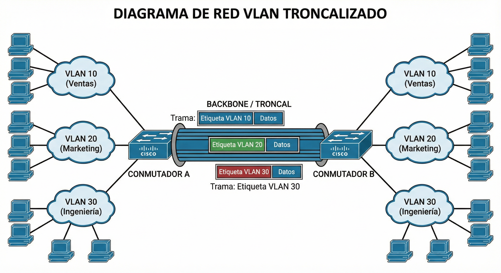

# Tema 6. Enrutamiento, subnetting y VLANs

En este tema **diseñamos** la red lógica: dividimos en **subredes**, resumimos rutas (**supernetting**), configuramos **enrutamiento** (sobre todo estático) y segmentamos con **VLANs** (access, trunk, 802.1Q).

!!! tip "Primera clase"
    Empieza por el [cuestionario inicial](#cuestionario-inicial). No hace falta estudiar el tema completo antes: el cuestionario sirve para ver qué sabes al empezar.

## Propuesta didáctica

Trabajamos los **RA3** y **RA4** del módulo Redes de área local (0225):

> **RA3.** *Interconecta equipos en redes locales cableadas describiendo estándares de cableado y aplicando técnicas de montaje de conectores.*

> **RA4.** *Instala equipos en red, describiendo sus prestaciones y aplicando técnicas de montaje.*

### Criterios de evaluación (selección)

**RA3**

* **CE3a**: Se ha interpretado el plan de montaje lógico de la red.
* **CE3f**: Se ha verificado la conectividad de la instalación.

**RA4**

* **CE4g**: Se han identificado los protocolos.
* **CE4h**: Se han configurado los parámetros básicos.
* **CE4j**: Se han creado y configurado VLANS.

### Contenidos

* Subnetting paso a paso (bits prestados, incremento, rangos).
* Supernetting / agregación CIDR.
* Enrutamiento estático y dinámico (visión); tabla de rutas; ruta por defecto.
* VLANs: access / trunk, etiquetado **802.1Q**, idea de comunicación inter-VLAN.

### Programación de aula (orientativa, ~16–18 h)

| Sesiones | Contenidos | Actividades |
| --- | --- | --- |
| 1 | Presentación + cuestionario | Cuestionario |
| 2–5 | Subnetting | **AC601–AC604** |
| 6–7 | Supernetting | AC605, AC606 |
| 8–10 | Rutas estáticas y default | **AC607**, **PR601** |
| 11–13 | VLANs, access/trunk, 802.1Q | AC608, AC609 |
| 14–15 | Packet Tracer VLANs | **PR602** |
| 16–17 | **Taller / mixto:** VLANs en switch del taller | **PR604** |
| 18 | NetAcad: enrutamiento / VLAN (prep. certificación) | **PR603** |

---

<a id="cuestionario-inicial"></a>

## Cuestionario inicial

!!! question "Antes de empezar — responde con lo que sepas"
    1. ¿Qué es el subnetting y para qué sirve?
    2. ¿Qué es una superred?
    3. ¿Qué diferencia hay entre enrutamiento estático y dinámico?
    4. ¿Qué información tiene una tabla de rutas?
    5. ¿Qué es una VLAN?
    6. ¿Qué es un puerto troncal (trunk)?
    7. ¿Para qué sirve el etiquetado 802.1Q?

!!! warning "Soluciones"
    Las soluciones se trabajan en clase o se publican en Aules cuando proceda.

---

## Subnetting

**Subnetting** = dividir una red en subredes más pequeñas **tomando bits prestados** de la parte de host. El prefijo CIDR **aumenta** (máscara más larga).

Motivos: reducir dominios de broadcast, organizar por departamentos, aplicar políticas y seguridad, planificar crecimiento.

### Ejemplo: 8 subredes desde `/24`

Red base `192.168.0.0/24` → 3 bits prestados → **`/27`**.

- Subredes: \(2^3 = 8\)
- Tamaño de bloque: \(2^5 = 32\) → **30 hosts** por subred
- Incremento en el último octeto: **32**

| Subred | Red | Hosts válidos | Broadcast |
| --- | --- | --- | --- |
| 1 | 192.168.0.0 | .1 – .30 | .31 |
| 2 | 192.168.0.32 | .33 – .62 | .63 |
| 3 | 192.168.0.64 | .65 – .94 | .95 |
| 4 | 192.168.0.96 | .97 – .126 | .127 |
| 5 | 192.168.0.128 | .129 – .158 | .159 |
| 6 | 192.168.0.160 | .161 – .190 | .191 |
| 7 | 192.168.0.192 | .193 – .222 | .223 |
| 8 | 192.168.0.224 | .225 – .254 | .255 |

### Pasos sistemáticos

1. **Bits a prestar** \(b\): menor \(b\) con \(2^b \ge N\) subredes pedidas.  
   *Ej.:* 30 subredes → \(2^5 = 32\) → **5 bits**.
2. **Nuevo prefijo** = prefijo base + \(b\) (p. ej. `/24` + 5 → `/29`).
3. **Incremento** = \(2^{(\text{bits de host restantes})}\) en el octeto que varía.
4. **Red de la subred \(k\)** = base + \((k-1) \times\) incremento.
5. **Broadcast** = siguiente red − 1; hosts = red+1 … broadcast−1.
6. **¿A qué subred pertenece una IP?** en el octeto que varía: \((\text{valor} \div I) \times I\) (división entera).  
   *Ej.:* `172.16.0.0/21`, incremento 8; IP `172.16.118.50` → subred `172.16.112.0/21`.

Fórmulas: subredes = \(2^{bits\ prestados}\); hosts/subred = \(2^{bits\ host} - 2\).

En **cada** subred no se asignan la dirección de red ni la de broadcast. Hoy suele usarse todo el rango de subredes (la restricción antigua de RFC 950 está en desuso).

!!! tip "Ventajas y coste"
    Subnetting mejora administración y seguridad, pero **consume** dos IPs por subred (red + broadcast). Planifica el tamaño según hosts reales + margen.

---

## Supernetting

**Supernetting** = agrupar redes contiguas en una sola entrada CIDR (prefijo **menor**). Sirve para **agregar rutas** y aligerar tablas (menos CPU/RAM y menos “flapping” anunciado).

Reglas: redes **consecutivas** y mismos bits de mayor peso.

Ejemplo paso a paso: `192.168.0.0/24` … `192.168.3.0/24`

1. Octeto que cambia (3.º): 0, 1, 2, 3 → en binario varían los **2** bits bajos.
2. Bits comunes a la izquierda: 6 de ese octeto.
3. Nueva máscara: \(24 - 2 = 22\) → **`192.168.0.0/22`**.

| | Subnetting | Supernetting |
| --- | --- | --- |
| Acción | Dividir | Agrupar |
| Prefijo | Aumenta (/24→/27) | Disminuye (/24→/22) |
| Uso típico | LAN / empresa | Resumen de rutas / ISP |

---

## Enrutamiento IPv4

El **enrutamiento** elige por qué camino enviar el paquete hacia el destino.

### Estático vs dinámico

| Tipo | Cómo se aprende | Cuándo |
| --- | --- | --- |
| **Estático** | Manual | Redes pequeñas / estables |
| **Dinámico** | Protocolos (RIP, OSPF, EIGRP, BGP…) | Topologías que cambian |

| Protocolo | Principio | Ámbito |
| --- | --- | --- |
| **RIP** | Saltos | IGP, redes pequeñas |
| **OSPF** | Coste / estado de enlace | IGP, medianas–grandes |
| **EIGRP** | Híbrido (Cisco) | IGP Cisco |
| **BGP** | Entre sistemas autónomos | EGP / Internet |

IGP = dentro del AS; EGP = entre AS (**BGP**). En el aula priorizamos **rutas estáticas** y la lectura de la tabla.

### Tabla de rutas

Cada entrada suele incluir: red destino + máscara, **siguiente salto**, interfaz, métrica.

| Red destino | Máscara | Siguiente salto | Interfaz | Idea |
| --- | --- | --- | --- | --- |
| 192.168.1.0 | /24 | — (directa) | eth0 | Conectada al router |
| 192.168.2.0 | /24 | 192.168.1.2 | eth0 | Vía otro router |
| 0.0.0.0 | /0 | 192.168.1.254 | eth0 | Default |

Proceso: el router mira el destino, elige la ruta **más específica** (prefijo más largo) y reenvía.

### Ruta por defecto

`0.0.0.0/0` (“cualquier destino”) hacia el gateway de salida (p. ej. el ISP).

```bash
ip route show
ip route add 192.168.2.0/24 via 192.168.1.1
ip route add default via 192.168.1.1
```

### Ejemplo de topología

<figure markdown="span">
  { width="800" }
  <figcaption>Topología de ejemplo con redes y enlaces /30 entre routers</figcaption>
</figure>

En el ejemplo, Router3 tiene conexión directa a su LAN y al enlace hacia Router2; el resto de redes se alcanzan vía el siguiente salto en ese enlace, más una **ruta por defecto**. Los enlaces entre routers usan a menudo **/30** (2 hosts utilizables) para ahorrar direcciones.

---

## VLANs

Una **VLAN** (*Virtual LAN*) es una **red lógica** independiente dentro de la misma infraestructura física. Varias VLANs pueden coexistir en un switch.

<figure markdown="span">
  { width="800" }
  <figcaption>Segmentación tradicional frente a segmentación con VLANs</figcaption>
</figure>

### ¿Para qué?

- Reducir el **dominio de difusión**.
- Mejorar la **seguridad** aislando tráfico (p. ej. invitados vs datos clínicos).
- Organizar por función o departamento sin recablear.
- Flexibilidad: hosts del mismo switch en VLANs distintas; hosts de distintos switches en la misma VLAN.

Cada VLAN ≈ un **dominio de difusión**. La comunicación **entre VLANs** necesita capa 3 (router o switch L3): idea de **inter-VLAN routing**.

### Access y trunk

| Modo | Tráfico | Uso |
| --- | --- | --- |
| **Access** | Una VLAN; tramas **sin** etiqueta hacia el PC | Equipos finales |
| **Trunk** | Varias VLANs; tramas **etiquetadas** | Switch–switch / switch–router |

<figure markdown="span">
  { width="800" }
  <figcaption>Enlace troncal entre switches transportando varias VLANs</figcaption>
</figure>

En el backbone, las tramas se etiquetan al entrar en el troncal y se destiquetán al salir hacia el puerto de acceso del destino.

### IEEE 802.1Q

Estándar de etiquetado: se insertan **4 bytes** con el **VLAN ID**; el switch recalcula el FCS. Compatible entre fabricantes.

**VLAN nativa**: en un trunk, las tramas **sin** etiqueta se asocian a la VLAN nativa (ambos extremos deben coincidir; a menudo VLAN 1 por defecto).

### Idea inter-VLAN

PCs de VLANs distintas **no** se ven a nivel 2. Para que Consultas hable con Recepción hace falta un **router** (o switch L3) que enrute entre las subredes asociadas a cada VLAN. Eso cierra el círculo con el subnetting de este tema: una VLAN ↔ una subred IP.

!!! tip "Plan lógico (CE3a)"
    Antes de configurar: decide VLANs, IDs, subredes y puertos access/trunk. Ese plan es el que interpreta el técnico al montar e interconectar.

---

## Actividades

!!! tip "Formato de entrega"
    Las entregas en **Aules** son **obligatorias en Markdown** (`.md`). No se aceptan PDF.  
    Nombre del archivo: `AC6XX.md` o `PR6XX.md` (sustituye XX por el número). Respeta la fecha de vencimiento.  
    Escribiremos los `.md` con **Visual Studio Code**.

    !!! note "Cómo empezar"
        - Guía de Markdown: [tutorialmarkdown.com/guia](https://tutorialmarkdown.com/guia)
        - Documentación de Visual Studio Code: [code.visualstudio.com/docs](https://code.visualstudio.com/docs)

### AC601 — Subredes: 194.168.100.0

* :simple-readdotcv: **AC601**. (RA3 // CE3a // **AC 0–1**). Red tipo C **194.168.100.0**:
  1. Máscara para **16** subredes totales.
  2. Nodos por subred.
  3. Direcciones de red de las subredes.
  4. IP del nodo con id **4** en cada subred.
  5. ¿A qué subred pertenece `194.168.100.107`?

### AC602 — Empresa: 25 redes

* :simple-readdotcv: **AC602**. (RA3 // CE3a // **AC 0–1**). Proveedor da `192.168.9.0`. Necesitas **≥ 25** subredes: máscara por defecto, máscara subneteada, ejemplo de 1.ª–4.ª subred (primera/última IP válida) y IP del router en cada una.

### AC603 — Red /22

* :simple-readdotcv: **AC603**. (RA3 // CE3a // **AC 0–1**). Red **192.168.0.0/22**: red, broadcast y hosts sin dividir. Divídela en **4** subredes `/24`: red, rango de hosts y broadcast de cada una.

### AC604 — Red /23

* :simple-readdotcv: **AC604**. (RA3 // CE3a // **AC 0–1**). Red **192.168.4.0/23**: red, broadcast, hosts. Dos subredes `/24` (red + rango). ¿A qué `/24` pertenece `192.168.5.100`?

### AC605 — Supernetting departamentos

* :simple-readdotcv: **AC605**. (RA3 // CE3a // **AC 0–1**). Resume: Ventas `172.16.16.0/24`, RRHH `172.16.17.0/24`, Sistemas `172.16.18.0/24`, Dirección `172.16.19.0/24`. Octeto que cambia → binario → bits comunes → superred CIDR.

### AC606 — Supernetting plantas

* :simple-readdotcv: **AC606**. (RA3 // CE3a // **AC 0–1**). Plantas: `192.168.4.0/24` … `192.168.7.0/24`. Mismo método que AC605: indica la superred resultante.

### AC607 — Rutas estáticas

* :simple-readdotcv: **AC607**. (RA3 // CE3a // RA4 // CE4g, CE4h // **AC 0–1**). Con la topología de la figura de este tema (Router1 ↔ Router2 ↔ Router3):
  1. Tabla de rutas **estáticas del Router2** (destino, máscara, next-hop, interfaz).
  2. Tabla de rutas **del Router1**.
  3. Justifica conexiones directas vs siguiente salto y la ruta por defecto.

### AC608 — Diseño VLAN clínica

* :simple-readdotcv: **AC608**. (RA3 // CE3a // RA4 // CE4j // **AC 0–1**). Clínica dental, switch 24 puertos:
  - Recepción: 2 PCs, 1 impresora, 1 teléfono IP.
  - Consultas: 6 PCs, 2 impresoras.
  - Invitados: 1 AP Wi‑Fi.

  Tabla: Nombre VLAN | ID | Subred IP | Puertos. ¿Por qué no mezclar invitados con Recepción? ¿Puede un PC de Consultas hacer ping a Recepción **sin** router? Esquema del switch etiquetado.

### AC609 — Trunk / tagged

* :simple-readdotcv: **AC609**. (RA4 // CE4j, CE4g // **AC 0–1**). Tres plantas, VLANs Almacén y Administración. Indica Access/Trunk en cada puerto relevante; camino etiquetado de Almacén1 → Almacén3 (estándar); qué falla si el enlace Planta1–Planta2 queda en Access solo de Almacén.

### PR601 — Packet Tracer: subredes + rutas estáticas

* :simple-cisco: **PR601**. (RA3 // CE3a, CE3f // RA4 // CE4g, CE4h // **PR 0–10**). Simulación: varias subredes, interfaces de router y **rutas estáticas** (incluida default) hasta alcanzar todas las redes. El guion completo se facilitará en clase / Aules.

| Criterio | Descripción | Puntos |
| --- | --- | --- |
| Plan de direccionamiento | Subredes coherentes | 0–3 |
| Rutas | Tabla correcta / pings | 0–4 |
| Informe `.md` | Evidencias y explicación | 0–3 |
| **Total** | | **/10** |

### PR602 — Packet Tracer: VLANs access/trunk

* :simple-cisco: **PR602**. (RA3 // CE3a, CE3f // RA4 // CE4j, CE4g, CE4h // **PR 0–10**). Simulación: crear VLANs, asignar puertos **access**, configurar **trunk** 802.1Q entre switches y comprobar aislamiento / conectividad según el diseño. Cubre **CE4j**. El guion completo se facilitará en clase / Aules.

| Criterio | Descripción | Puntos |
| --- | --- | --- |
| VLANs y access | Asignación correcta | 0–3 |
| Trunk 802.1Q | Enlace entre switches | 0–3 |
| Verificación | Comportamiento esperado | 0–2 |
| Informe `.md` | Capturas y conclusión | 0–2 |
| **Total** | | **/10** |

### PR603 — NetAcad: enrutamiento, VLAN y preparación CCNA

| Campo | Valor |
| --- | --- |
| **Código** | **PR603** |
| **UP / tema** | T6 — Enrutamiento, subnetting y VLANs |
| **RA principal** | **RA4** (configuración). Apoyo **RA3** |
| **CE de cobertura** | CE4g, CE4h, CE4j · CE3a, CE3f |
| **Sesiones estimadas** | **1–2** |
| **Instrumento** | Checklist NetAcad/PT + rúbrica 0–10 |

* :simple-cisco: **PR603**. Itinerario **Cisco NetAcad** (módulos de switching/VLAN y routing básico que indique el profesor) + práctica Packet Tracer de consolidación (VLANs + rutas estáticas o default). Entrega `PR603.md` con: checklist de módulos completados, capturas de laboratorios NetAcad/PT y breve autoevaluación de cara a la certificación. **Complementa** (no sustituye) la práctica de taller **PR604**.

| Criterio (rúbrica) | Descripción | Puntos |
| --- | --- | --- |
| Progreso NetAcad | Módulos / labs indicados | 0–3 |
| PT consolidación | VLAN + enrutamiento verificados | 0–4 |
| Informe `.md` | Evidencias y autoevaluación | 0–3 |
| **Total** | | **/10** |

### PR604 — Taller: VLANs en switch físico + verificación

| Campo | Valor |
| --- | --- |
| **Código** | **PR604** |
| **UP / tema** | T6 — Enrutamiento, subnetting y VLANs |
| **RA principal** | **RA4** (crear/configurar VLANs e instalar/configurar equipos). Apoyo **RA3** (plan lógico / verificación) |
| **CE de cobertura** | CE4j, CE4h, CE4g · CE3a, CE3f |
| **Sesiones estimadas** | **2** |
| **Instrumento** | Checklist de configuración + rúbrica 0–10 |

* :simple-neutralinojs: **PR604**. Práctica **física o mixta** en el aula-taller: configurad **VLANs** en el **switch del taller** (no solo Packet Tracer) y verificad conectividad.

  **Enunciado (qué hace el alumno):**

  1. Partir del plan lógico (IDs VLAN, puertos access, trunk si aplica, subredes asociadas) que indique el profesor.
  2. Crear las VLANs en el switch gestionable del taller; asignar puertos **access**; configurar **trunk** 802.1Q si hay dos switches o enlace a router L3.
  3. Conectar PCs (o interfaces) a puertos de VLANs distintas; asignar IP coherentes.
  4. Verificar: mismo VLAN → ping OK; VLANs distintas → **no** hay L2 (salvo que exista inter-VLAN y esté autorizado en el guion).
  5. Documentar comandos/capturas, tabla puerto↔VLAN y resultado de pruebas.

  **Evidencia:** capturas de `show vlan` / equivalente, tabla de puertos, pruebas ping, `PR604.md`. Si el material físico no está disponible un día, el profesor autorizará evidencia mixta (config en equipo real parcial + PT), sin eliminar el objetivo de configuración real.

  **Entrega:** `PR604.md` + evidencias en Aules.

| Criterio (rúbrica) | Descripción | Puntos |
| --- | --- | --- |
| Plan lógico | VLANs / puertos / IPs coherentes | 0–2 |
| Configuración en switch | VLANs + access (+ trunk si aplica) | 0–4 |
| Verificación | Conectividad / aislamiento demostrados | 0–2 |
| Informe `.md` | Capturas y tabla puerto↔VLAN | 0–2 |
| **Total** | | **/10** |

---

## Referencias rápidas

- Sitio del módulo: [fjavier-hernandez.github.io/ral](https://fjavier-hernandez.github.io/ral/)
- Diagramas: [Excalidraw](https://excalidraw.com/), [draw.io (diagrams.net)](https://app.diagrams.net/), [Dia](https://wiki.gnome.org/Apps/Dia)
- Simulación: [Cisco Packet Tracer](https://www.netacad.com/es/cisco-packet-tracer)
- NetAcad (itinerario del curso): módulos que indique el profesor; ver **PR603**
- Taller VLAN físico: ver **PR604**
- Entregas: [Visual Studio Code](https://code.visualstudio.com/docs) + [Markdown](https://tutorialmarkdown.com/guia)
- Normas: [Normas del taller](../00-normas/normas_taller.md)

*[RA]: Resultado de aprendizaje  
*[CE]: Criterio de evaluación  
*[AC]: Actividad de clase  
*[PR]: Práctica  
*[VLAN]: Virtual Local Area Network  
*[CIDR]: Classless Inter-Domain Routing  
*[IGP]: Interior Gateway Protocol  
*[EGP]: Exterior Gateway Protocol
