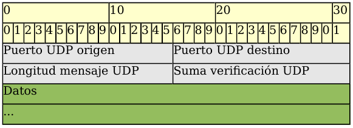
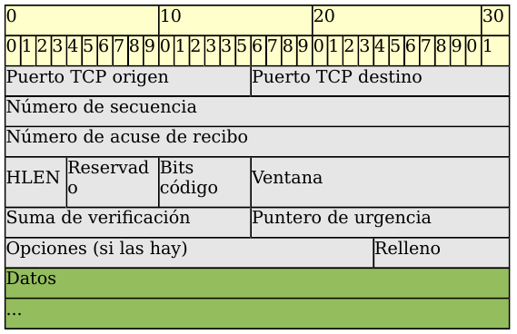

# Tema 7. Capa de transporte

En este tema bajamos a la capa que **conecta las aplicaciones con la red**: **puertos**, **sockets**, **UDP** y **TCP**. También practicamos con **`netstat`** y **`nmap`**, y vemos de forma breve cortafuegos, proxy, balanceo y VPN. El **NAT completo** se desarrolla en el [Tema 8](../08-nat-ipv6/tema8.md).

!!! tip "Primera clase"
    Empieza por el [cuestionario inicial](#cuestionario-inicial). No hace falta estudiar el tema completo antes: el cuestionario sirve para ver qué sabes al empezar.

## Propuesta didáctica

Trabajamos los **RA4** y **RA5** del módulo Redes de área local (0225), con apoyo de **RA1** cuando haga falta:

> **RA4.** *Instala equipos en red, describiendo sus prestaciones y aplicando técnicas de montaje.*

> **RA5.** *Mantiene una red local interpretando recomendaciones de los fabricantes de hardware o software y estableciendo la relación entre disfunciones y sus causas.*

> **RA1.** *Reconoce la estructura de redes locales cableadas analizando las características de entornos de aplicación y describiendo la funcionalidad de sus componentes.*

### Criterios de evaluación (selección)

**RA4**

* **CE4g**: Se han identificado los protocolos.
* **CE4h**: Se han configurado los parámetros básicos.

**RA5**

* **CE5a**: Se han identificado incidencias y comportamientos anómalos.
* **CE5b**: Se ha identificado si la disfunción es debida al hardware o al software.
* **CE5d**: Se han verificado los protocolos de comunicaciones.
* **CE5e**: Se ha localizado la causa de la disfunción.
* **CE5h**: Se ha elaborado un informe de incidencias.

**RA1** (apoyo)

* **CE1a**: Se han descrito los principios de funcionamiento de las redes locales.
* **CE1c**: Se han descrito los elementos de la red local y su función.

!!! note "VLAN y Wi‑Fi"
    Las **VLAN** (CE4j) no se desarrollan aquí. Lo inalámbrico (CE4c–e) solo aparece si hace falta como contexto de servicios; el foco es **transporte** y **herramientas**.

### Contenidos

* Capa de transporte en TCP/IP y OSI: segmentación, multiplexación, puertos.
* Sockets (IP:puerto); well-known / registered / ephemeral.
* UDP y TCP: cabeceras, handshake, ventana; comparación y casos de uso.
* `netstat` y `nmap` (solo en red autorizada).
* Cortafuegos (políticas); proxy, balanceo y VPN (visión breve).
* NAT: puntero al Tema 8 (sin duplicar el capítulo).

### Programación de aula (orientativa, ~14–16 h)

| Sesiones | Contenidos | Actividades |
| --- | --- | --- |
| 1 | Presentación + cuestionario | Cuestionario |
| 2–3 | Transporte, sockets, tipos de puertos | **AC701**, **AC702** |
| 4–5 | UDP, TCP, handshake, comparación | **AC703** |
| 6–7 | Laboratorio `netstat` + `nmap` + informe | **AC704**, **AC705**, **PR701** |
| 8–9 | Firewall, proxy / balanceo / VPN | **AC706**, **AC707** |
| 10–11 | Repaso; captura TCP/UDP en PT (si toca) | **PR702** (cuando toque) |

---

<a id="cuestionario-inicial"></a>

## Cuestionario inicial

!!! question "Antes de empezar — responde con lo que sepas"
    1. ¿Para qué sirve la capa de transporte en una red TCP/IP?
    2. ¿Qué diferencia hay entre una **dirección IP** y un **puerto**?
    3. ¿Qué es un **socket**? Pon un ejemplo.
    4. ¿En qué se diferencian UDP y TCP?
    5. ¿Por qué usamos TCP para descargar archivos y, a menudo, UDP para voz?
    6. ¿Qué función cumple un cortafuegos en una red?
    7. ¿Has oído hablar de `netstat` o `nmap`? ¿Para qué crees que sirven?

!!! warning "Soluciones"
    Las soluciones se trabajan en clase o se publican en Aules cuando proceda.

---

## La capa de transporte

Los programas de aplicación (navegador, correo, juego…) generan datos que deben ir de un **host origen** a un **host destino**. La **capa de transporte** se ocupa de la comunicación **lógica entre aplicaciones** en distintos equipos.

<figure markdown="span">
  { width="800" }
  <figcaption>La capa de transporte enlaza las aplicaciones con la red</figcaption>
</figure>

Responsabilidades habituales:

- **Multiplexar** varias conversaciones a la vez.
- **Identificar aplicaciones** con **puertos**.
- **Segmentar** y **reensamblar** datos.
- Entregar a la capa de red (IP) segmentos (TCP) o datagramas (UDP).

Los dos protocolos clave: **UDP** y **TCP**.

---

## Puertos y sockets

No basta con la IP: en cada equipo hay muchas aplicaciones. Un **puerto** es un número **0–65535** en la cabecera de transporte que identifica el servicio o proceso.

Un **socket** es la pareja **IP:puerto**. Ejemplo: `192.168.1.10:80`. Una conexión queda identificada por dos sockets:

> `IP_origen:puerto_origen  ↔  IP_destino:puerto_destino`

---

## Tipos de puertos

| Tipo | Rango | Uso principal |
| --- | ---: | --- |
| **Well-known** | 0–1023 | Servicios estándar (HTTP, HTTPS, SSH, DNS…) |
| **Registered** | 1024–49151 | Aplicaciones y servicios de usuario |
| **Ephemeral** | 49152–65535 | Puertos temporales del cliente (asignados por el SO) |

### Ejemplos well-known

| Puerto | Servicio |
| --- | --- |
| 22/tcp | SSH |
| 53/tcp·udp | DNS |
| 67/68/udp | DHCP |
| 80/tcp | HTTP |
| 443/tcp | HTTPS |
| 25/tcp | SMTP |
| 110/tcp · 143/tcp | POP3 · IMAP |

Conocerlos ayuda a leer salidas de `netstat` y reglas de cortafuegos.

---

## Protocolo UDP

**UDP** es **no orientado a conexión** y de **mejor esfuerzo**: los datagramas pueden perderse, duplicarse o llegar desordenados. La cabecera es pequeña (4 campos / 8 bytes).

<figure markdown="span">
  { width="800" }
  <figcaption>Formato de un mensaje UDP</figcaption>
</figure>

Campos: puerto origen, puerto destino, longitud, suma de verificación.

**Cuándo usarlo:** baja latencia y tolerancia a pérdidas (streaming en vivo, VoIP, juegos; también DNS/TFTP en muchos casos).

---

## Protocolo TCP

**TCP** es **orientado a conexión** y **fiable**: entrega sin errores, sin duplicados y en orden (retransmisión, ACK, secuencia).

<figure markdown="span">
  { width="800" }
  <figcaption>Formato de un segmento TCP</figcaption>
</figure>

Campos clave: puertos, número de secuencia, ACK, flags (**SYN**, **ACK**, **FIN**, RST/PSH/URG), **ventana** (control de flujo), checksum.

### Three-way handshake y cierre

1. Cliente → **SYN**.  
2. Servidor → **SYN+ACK**.  
3. Cliente → **ACK**. Luego van los datos.

Para cerrar: **FIN** / **ACK** en ambos sentidos (cuatro segmentos en el cierre ordenado típico).

La **ventana deslizante** permite enviar varios segmentos sin esperar un ACK por cada uno.

---

## TCP frente a UDP

| Característica | TCP | UDP |
| --- | --- | --- |
| Conexión | Orientado a conexión | Sin conexión previa |
| Fiabilidad | Confirma, reordena, retransmite | Mejor esfuerzo |
| Control de flujo | Sí (ventana) | No |
| Cabecera | Más grande | Muy pequeña |
| Usos típicos | Web, correo, FTP, SSH | Streaming, VoIP, juegos, DNS |

---

## Herramientas: `netstat` y `nmap`

### `netstat` — puertos en tu equipo

Opciones habituales: `-a` (todas), `-n` (números), `-p` (proceso), `-t`/`-u` (TCP/UDP en Linux), `-l` (escucha).

```bash
# Windows
netstat -na

# Linux
netstat -punta
```

### `nmap` — escaneo (solo con permiso)

```bash
nmap 192.168.1.1
```

!!! danger "Uso autorizado"
    Escanea **solo** equipos y redes donde tengas **permiso explícito** (aula, lab, tu propio host). En contextos reales, el escaneo no autorizado puede ser ilegal o sancionable.

Estas herramientas ayudan a **verificar protocolos** (CE5d) y a distinguir si un fallo parece de **servicio/software** o de **conectividad/hardware** (CE5b).

---

## NAT (puntero al Tema 8)

**NAT** permite que muchos hosts con IP **privadas** salgan a Internet con **pocas IP públicas**. Con **PAT**, además se traducen **puertos**.

<figure markdown="span">
  { width="700" }
  <figcaption>Idea básica: LAN privada saliendo a Internet mediante NAT</figcaption>
</figure>

!!! tip "Profundidad en el Tema 8"
    Tipos (estático, dinámico, PAT), terminología local/global e IPv6 → [Tema 8 — NAT e IPv6](../08-nat-ipv6/tema8.md). Aquí no duplicamos ese capítulo.

---

## Cortafuegos

Un **firewall** filtra tráfico según una **política**, permitiendo lo autorizado y bloqueando el resto.

<figure markdown="span">
  { width="800" }
  <figcaption>Cortafuegos de red con zona desmilitarizada (DMZ)</figcaption>
</figure>

- **Personal** (en el PC) vs **de red** (borde / perímetro).
- **Restrictiva**: denegar por defecto; solo lo explícitamente permitido.
- **Permisiva**: permitir por defecto; denegar lo listado.

La restrictiva suele ser más segura. En Linux: `iptables` / `nftables`, UFW.

---

## Proxy, balanceo y VPN (visión breve)

### Proxy

Intermediario que hace peticiones en nombre de los clientes. Puede **cachear**, ahorrar ancho de banda y **filtrar** contenido. Un **proxy transparente** intercepta (con ayuda del firewall) sin configurar el navegador.

### Balanceador de carga

Reparte peticiones entre varios servidores (o enlaces) para **rendimiento** y **disponibilidad**. A menudo actúa como **proxy inverso**.

### VPN

Extiende de forma **segura** una red privada sobre Internet mediante un **túnel cifrado** (acceso remoto o sede–sede). Tecnologías habituales: IPsec, SSL/TLS, OpenVPN.

---

## Actividades

!!! tip "Formato de entrega"
    Las entregas en **Aules** son **obligatorias en Markdown** (`.md`). No se aceptan PDF.  
    Nombre del archivo: `AC7XX.md` o `PR7XX.md` (sustituye XX por el número). Respeta la fecha de vencimiento.  
    Escribiremos los `.md` con **Visual Studio Code**.

    !!! note "Cómo empezar"
        - Guía de Markdown: [tutorialmarkdown.com/guia](https://tutorialmarkdown.com/guia)
        - Documentación de Visual Studio Code: [code.visualstudio.com/docs](https://code.visualstudio.com/docs)

### AC701 — Sockets y puertos

* :simple-readdotcv: **AC701**. (RA1 // CE1a, CE1c // RA4 // CE4g // **AC 0–1**). Tras estudiar sockets/puertos: define **socket** con un ejemplo; explica cómo distinguirías dos servidores web en el mismo host; indica si cada pestaña del navegador usa necesariamente un puerto distinto y por qué.

### AC702 — Tipos de puertos

* :simple-readdotcv: **AC702**. (RA4 // CE4g // **AC 0–1**). Tabla: tipo, rango y ejemplos (≥5 well-known, ≥3 registered, ≥2 usos ephemeral). Explica por qué los well-known suelen exigir privilegios de administrador.

### AC703 — TCP frente a UDP (casos)

* :simple-readdotcv: **AC703**. (RA4 // CE4g // **AC 0–1**). Para cada caso, elige TCP o UDP y justifica: (1) descarga de ISO, (2) videollamada, (3) consulta DNS, (4) juego FPS online, (5) SSH.

### AC704 — Práctica con `netstat`

* :simple-readdotcv: **AC704**. (RA5 // CE5b, CE5d // **AC 0–1**). Abre el navegador (varias webs), ejecuta `netstat -na` (Windows) o `netstat -punta` (Linux), localiza ≥3 conexiones a 80/443 y clasifica los puertos locales (well-known / registered / ephemeral).

### AC705 — `nmap` autorizado

* :simple-readdotcv: **AC705**. (RA5 // CE5a, CE5d // **AC 0–1**). En red de aula o lab **con permiso**: `nmap IP_DESTINO`; anota ≥5 puertos abiertos/filtrados y el servicio; explica por qué hay que pedir autorización antes de escanear.

### AC706 — Política de firewall del centro

* :simple-readdotcv: **AC706**. (RA4 // CE4h // RA5 // CE5a // **AC 0–1**). Propón una **política restrictiva** para un instituto: tráfico saliente permitido, entrante permitido (p. ej. web pública) y ≥3 denegaciones con justificación.

### AC707 — Proxy, balanceo o VPN

* :simple-readdotcv: **AC707**. (RA1 // CE1c // RA4 // CE4g // **AC 0–1**). Elige **dos** de estos tres (o unifica en un texto breve): (a) ventaja de un proxy transparente en un centro; (b) por qué un balanceador delante de varios servidores web; (c) recorrido y ventajas de una VPN de teletrabajo.

### PR701 — Laboratorio de puertos (`netstat` + `nmap`)

* :simple-neutralinojs: **PR701**. (RA5 // CE5b, CE5d, CE5e, CE5h // RA4 // CE4g // **PR 0–10**). Laboratorio individual o en pareja:

  1. Inventario con `netstat`: conexiones establecidas y puertos en escucha; captura/texto en el informe.
  2. Escaneo `nmap` **autorizado** a un host de práctica; lista de puertos/servicios.
  3. Relaciona al menos un hallazgo con un posible problema (servicio caído, puerto inesperado, filtrado).
  4. Conclusión: ¿el síntoma apunta más a hardware o a software/configuración?

  **Entrega:** `PR701.md` (obligatorio) con capturas o salidas relevantes.

| Criterio | Descripción | Puntos |
| --- | --- | --- |
| Procedimiento `netstat` | Salidas claras y bien interpretadas | 0–2 |
| Escaneo `nmap` autorizado | Método y resultados correctos | 0–2 |
| Clasificación de puertos | Well-known / registered / ephemeral | 0–2 |
| Diagnóstico CE5b/CE5d | Hardware vs software; protocolos | 0–2 |
| Informe `.md` | Claridad, estructura, conclusiones | 0–2 |
| **Total** | | **/10** |

### PR702 — Captura TCP/UDP en Packet Tracer (cuando toque)

* :simple-cisco: **PR702**. (RA4 // CE4g // RA5 // CE5d // **PR 0–10**). Simulación en Packet Tracer: observar handshake TCP y tráfico UDP (DNS u otro). El guion completo se facilitará en clase / Aules.

---

## Referencias rápidas

- Sitio del módulo: [fjavier-hernandez.github.io/ral](https://fjavier-hernandez.github.io/ral/)
- Continuación NAT/IPv6: [Tema 8](../08-nat-ipv6/tema8.md)
- Simulación: [Cisco Packet Tracer](https://www.netacad.com/es/cisco-packet-tracer)
- Entregas: [Visual Studio Code](https://code.visualstudio.com/docs) + [Markdown](https://tutorialmarkdown.com/guia)
- Normas: [Normas del taller](../00-normas/normas_taller.md)

*[RA]: Resultado de aprendizaje  
*[CE]: Criterio de evaluación  
*[AC]: Actividad de clase  
*[PR]: Práctica  
*[TCP]: Transmission Control Protocol  
*[UDP]: User Datagram Protocol  
*[NAT]: Network Address Translation  
*[PAT]: Port Address Translation  
*[VPN]: Virtual Private Network  
*[DMZ]: Demilitarized Zone
