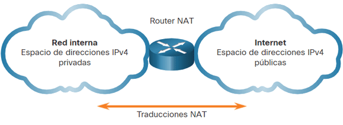
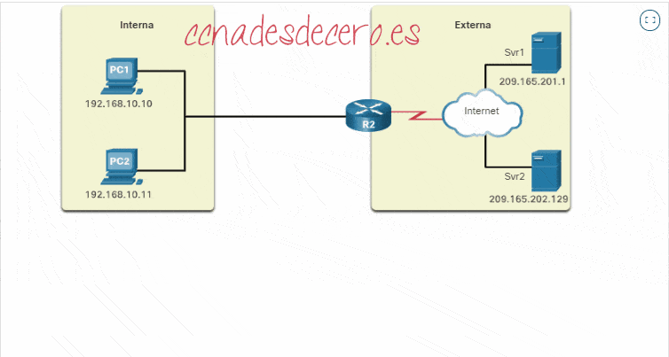
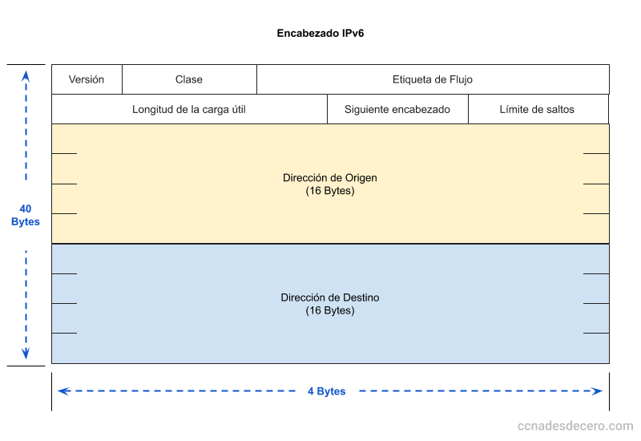
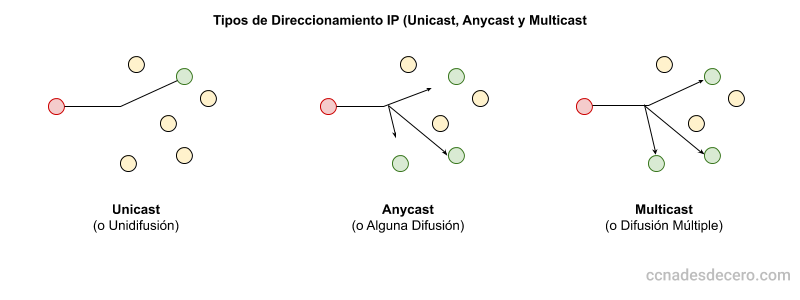
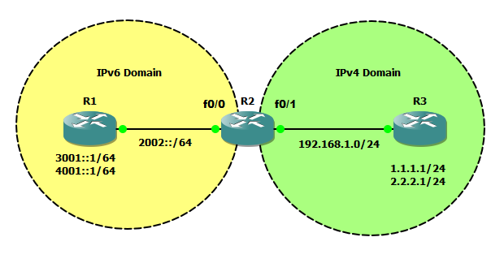

# Tema 8. NAT e IPv6

En el [Tema 7](../07-capa-transporte/tema7.md) vimos un **puntero** a NAT. Aquí profundizamos: **RFC 1918**, **NAT/PAT** completo y la transición a **IPv6** (formato, tipos de dirección y coexistencia con IPv4).

!!! tip "Primera clase"
    Empieza por el [cuestionario inicial](#cuestionario-inicial). No hace falta estudiar el tema completo antes: el cuestionario sirve para ver qué sabes al empezar.

## Propuesta didáctica

Trabajamos los **RA4** y **RA5** del módulo Redes de área local (0225), con apoyo de **RA1**:

> **RA4.** *Instala equipos en red, describiendo sus prestaciones y aplicando técnicas de montaje.*

> **RA5.** *Mantiene una red local interpretando recomendaciones de los fabricantes de hardware o software y estableciendo la relación entre disfunciones y sus causas.*

> **RA1.** *Reconoce la estructura de redes locales cableadas analizando las características de entornos de aplicación y describiendo la funcionalidad de sus componentes.*

### Criterios de evaluación (selección)

**RA4**

* **CE4g**: Se han identificado los protocolos.
* **CE4h**: Se han configurado los parámetros básicos.

**RA5**

* **CE5a**: Se han identificado incidencias y comportamientos anómalos.
* **CE5b**: Se ha identificado si la disfunción es debida al hardware o al software.
* **CE5d**: Se han verificado los protocolos de comunicaciones.
* **CE5e**: Se ha localizado la causa de la disfunción.
* **CE5h**: Se ha elaborado un informe de incidencias.

**RA1** (apoyo)

* **CE1a**: Se han descrito los principios de funcionamiento de las redes locales.
* **CE1c**: Se han descrito los elementos de la red local y su función.

!!! note "VLAN"
    Las **VLAN** (CE4j) no se desarrollan en este tema.

### Contenidos

* Direcciones IPv4 privadas (RFC 1918) y necesidad del NAT.
* NAT: concepto, enmascaramiento; terminología local/global e interna/externa.
* NAT estático, dinámico y PAT (puertos y tabla de traducción).
* Límites del NAT y relación con IPv6.
* IPv6: 128 bits, abreviatura, prefijos (`/64`, `/48`…).
* Unicast, anycast, multicast; direcciones especiales.
* Coexistencia: pila dual, túneles, traducción (NAT-PT y afines).

### Programación de aula (orientativa, ~14–16 h)

| Sesiones | Contenidos | Actividades |
| --- | --- | --- |
| 1 | Presentación + cuestionario | Cuestionario |
| 2–3 | RFC 1918, idea de NAT, terminología | **AC801**, **AC802** |
| 4–5 | Estático, dinámico, PAT | **AC803**, **AC804** |
| 6–8 | Laboratorio Packet Tracer NAT/PAT | **PR801** |
| 9–11 | IPv6 formato, prefijos, tipos | **AC805**, **AC806**, **AC807** |
| 12–13 | Coexistencia IPv4/IPv6; repaso | **AC808** |

---

## Cuestionario inicial

!!! question "Antes de empezar — responde con lo que sepas"
    1. ¿Por qué no basta con dar una IP pública a cada dispositivo del planeta?
    2. ¿Qué diferencia hay entre **IP privada** e **IP pública**?
    3. ¿Qué hace un router con NAT cuando un PC de la LAN visita una web?
    4. ¿Crees que sin NAT el agotamiento de IPv4 habría llegado antes?
    5. ¿Cuántos bits tiene una dirección IPv4 y cuántos una IPv6?
    6. ¿Para qué sirve la notación `::` en una dirección IPv6?

!!! warning "Soluciones"
    Las soluciones se trabajan en clase o se publican en Aules cuando proceda.

---

## Direcciones privadas y NAT

No hay suficientes **IPv4 públicas** para todos los dispositivos. Las LAN usan **privadas** (RFC 1918):

| Clase | Rango | Prefijo |
| --- | --- | --- |
| A | 10.0.0.0 – 10.255.255.255 | 10.0.0.0/8 |
| B | 172.16.0.0 – 172.31.255.255 | 172.16.0.0/12 |
| C | 192.168.0.0 – 192.168.255.255 | 192.168.0.0/16 |

Las privadas **no se enrutan en Internet** tal cual: al salir hace falta **traducir** a una IP pública. Eso es **NAT** (*Network Address Translation*).

<figure markdown="span">
  { width="800" }
  <figcaption>Traducción de direcciones privadas a públicas con NAT</figcaption>
</figure>

NAT **ahorra** IPv4 públicas y **oculta** las IP internas hacia fuera (no sustituye a un cortafuegos bien configurado). La solución a largo plazo al límite de IPv4 es **IPv6**.

---

## Cómo funciona el NAT

Dentro: IP **privadas**. Hacia Internet: una o varias **públicas** del *pool* NAT. El dispositivo que traduce (casi siempre el **router**) reescribe direcciones en **ambos sentidos**.

<figure markdown="span">
  { width="700" }
  <figcaption>LAN privada saliendo a Internet mediante NAT</figcaption>
</figure>

### Terminología (local / global, interna / externa)

| Tipo | Idea sencilla |
| --- | --- |
| **Local interna** | IP privada del host **dentro** de la LAN |
| **Global interna** | IP pública que el router muestra **hacia fuera** por ese host |
| **Local externa** | Cómo el host interno **ve** al destino |
| **Global externa** | IP pública real del destino en Internet |

- **Interna** → el equipo **traducido** (origen típico en salidas).
- **Externa** → el destino (u otro no traducido por este NAT).
- **Local** → vista en el lado privado.
- **Global** → vista en el lado público.

Ejemplo: PC `192.168.10.10` (local interna) sale como `209.165.200.226` (global interna) hacia un servidor web público.

<figure markdown="span">
  { width="800" }
  <figcaption>Terminología NAT: local/global e interna/externa</figcaption>
</figure>

---

## Tipos de NAT

1. **NAT estático** — mapeo fijo 1:1.  
2. **NAT dinámico** — pool de públicas según demanda.  
3. **PAT** (*Port Address Translation*) o NAT con sobrecarga — muchas privadas, pocas/una pública + **puertos**.

### NAT estático

Correspondencia fija privada ↔ pública. Útil para **servidores** alcanzables siempre con la misma pública (web en DMZ, SSH a una máquina…). Hace falta **tantas públicas** como mapeos 1:1 activos.

<figure markdown="span">
  { width="800" }
  <figcaption>NAT estático: asignaciones uno a uno</figcaption>
</figure>

### NAT dinámico

Un **pool** de públicas: al salir, el router asigna una libre. También limita cuántos hosts pueden salir a la vez según el tamaño del pool.

<figure markdown="span">
  { width="800" }
  <figcaption>NAT dinámico con pool de direcciones públicas</figcaption>
</figure>

### PAT (NAT con sobrecarga)

Traduce **IP y puertos**. Muchos hosts comparten **una** (o pocas) IP públicas; cada sesión se distingue por **IP pública + puerto**. Es lo habitual en el router de casa.

<figure markdown="span">
  { width="800" }
  <figcaption>Proceso de PAT paso a paso</figcaption>
</figure>

| | NAT estático/dinámico “puro” | PAT |
| --- | --- | --- |
| Mapeo | 1 IP privada ↔ 1 pública (por host activo) | Muchos hosts ↔ 1 (o pocas) públicas |
| Traducción | Solo IPv4 | IPv4 **y** puertos TCP/UDP |
| Uso típico | Servicios fijos; varias públicas | Hogar, aulas, salida típica a Internet |

!!! note "NAT y capa de transporte"
    Con PAT el router mira **puertos** (y estado) para devolver el tráfico a la sesión correcta. No lo convierte en un “switch de capa 4”, pero sí en algo más que un simple reenvío solo por IP.

### Límites del NAT

- Complica aplicaciones que esperan IP pública extremo a extremo (algunos juegos, VoIP, P2P).
- Las conexiones **iniciadas desde Internet hacia dentro** suelen fallar sin mapeos/port forwarding.
- Añade estado y complejidad al borde.
- **IPv6** reduce la necesidad del NAT “de masas” al ofrecer espacio de direcciones enorme.

---

## Protocolo IPv6

**IPv6** sustituye progresivamente a IPv4: direcciones de **128 bits** frente a 32.

| Característica | IPv4 | IPv6 |
| --- | --- | --- |
| Tamaño | 32 bits | **128 bits** |
| Notación | Decimal punteada | Hexadecimal, 8 grupos de 16 bits |
| Direcciones ≈ | 2³² | 2¹²⁸ |

<figure markdown="span">
  { width="800" }
  <figcaption>Esquema del encabezado IPv6</figcaption>
</figure>

### Formato y abreviatura

Ejemplo completo: `2001:0db8:3c4d:0015:0000:0000:1a2f:1a2b`

1. Quitar **ceros a la izquierda** en cada grupo.  
2. Sustituir **una** secuencia de grupos `0` consecutivos por **`::`** (solo un `::` por dirección).

Ejemplos: `FE00:0:0:1:0:0:0:56` → `FE00:0:0:1::56`.  
Inválidas: `FE00::1::56` (dos `::`), `hhhh::1` (no hex).

### Prefijos

Como CIDR: `dirección/n`. El **`/64`** es el tamaño típico de un enlace LAN.

| Prefijo | Uso típico |
| --- | --- |
| `/128` | Una interfaz |
| `/64` | Enlace / subred habitual |
| `/56` | Bloque residencial frecuente |
| `/48` | Bloque empresarial habitual |
| `/32` | Asignación a ISP |

Estructura habitual: **prefijo global** + **subred** + **ID de interfaz** (64 bits).

---

## Tipos de dirección IPv6

- **Unicast:** un destino.  
- **Anycast:** misma dirección en varias interfaces; llega al “más cercano”.  
- **Multicast:** un grupo de receptores.

<figure markdown="span">
  { width="800" }
  <figcaption>Unicast, anycast y multicast en IPv6</figcaption>
</figure>

Las **global unicast** son las IPv6 “públicas” en Internet. Existen **ULA** (`fc00::/7`) con uso parecido a las privadas IPv4.

### Especiales

- **Loopback:** `::1` (como `127.0.0.1`).  
- **Indefinida:** `::/128`.  
- **Link-local:** suelen empezar por `fe80:`.

---

## Coexistencia IPv4 / IPv6

### Pila dual (*dual stack*)

El nodo habla **IPv4 e IPv6** a la vez. Extendido y relativamente sencillo; duplica gestión.

<figure markdown="span">
  { width="700" }
  <figcaption>Pila dual IPv4 e IPv6</figcaption>
</figure>

### Túneles

Encapsulan IPv6 sobre infraestructura IPv4 (u otros diseños) para atravesar redes que aún no enrutan IPv6 nativo.

<figure markdown="span">
  { width="700" }
  <figcaption>Túnel: IPv6 sobre infraestructura IPv4</figcaption>
</figure>

### Traducción

Si un extremo solo IPv4 debe hablar con otro solo IPv6, hace falta un traductor. Ejemplo conceptual: **NAT-PT** (hay otras técnicas y relays).

<figure markdown="span">
  { width="700" }
  <figcaption>Esquema NAT-PT entre IPv4 e IPv6</figcaption>
</figure>

La transición es **lenta**: durante años convivirán ambas familias.

---

## Actividades

!!! tip "Formato de entrega"
    Las entregas en **Aules** son **obligatorias en Markdown** (`.md`). No se aceptan PDF.  
    Nombre del archivo: `AC8XX.md` o `PR8XX.md` (sustituye XX por el número). Respeta la fecha de vencimiento.  
    Escribiremos los `.md` con **Visual Studio Code**.

    !!! note "Cómo empezar"
        - Guía de Markdown: [tutorialmarkdown.com/guia](https://tutorialmarkdown.com/guia)
        - Documentación de Visual Studio Code: [code.visualstudio.com/docs](https://code.visualstudio.com/docs)

### AC801 — IP privada frente a pública

* :simple-readdotcv: **AC801**. (RA1 // CE1a, CE1c // **AC 0–1**). Indica la IP de tu PC (aula/casa), máscara o prefijo y si es privada o pública. Si es privada, sitúala en RFC 1918. Explica por qué esas direcciones no se enrutan en Internet tal cual.

### AC802 — Terminología NAT

* :simple-readdotcv: **AC802**. (RA4 // CE4g // **AC 0–1**). Con PC `192.168.1.20`, router público `203.0.113.50` y servidor `93.184.216.34`, completa la tabla local interna / global interna / local externa / global externa. Identifica el “dispositivo traducido”.

### AC803 — Tipos de NAT

* :simple-readdotcv: **AC803**. (RA4 // CE4g, CE4h // **AC 0–1**). Tabla: tipo (estático / dinámico / PAT), cuándo se usa y limitación principal (sobre todo, cuántas públicas hacen falta). Un ejemplo de aula o real por tipo.

### AC804 — PAT y puertos

* :simple-readdotcv: **AC804**. (RA4 // CE4g // RA5 // CE5d // **AC 0–1**). Tres PCs en `192.168.0.0/24` abren HTTP a la vez hacia el mismo servidor con el mismo puerto origen 49152. ¿Por qué no basta traducir solo la IP? ¿Qué añade el router a la tabla NAT?

### AC805 — Abreviar IPv6

* :simple-readdotcv: **AC805**. (RA4 // CE4g // **AC 0–1**). Forma abreviada de: (1) `2001:0db8:00aa:0000:0000:0000:00cd:00ef`; (2) `fe80:0000:0000:0000:0202:b3ff:fe1e:8329`; (3) `fc00:0000:0000:0000:0000:0000:0000:0001`. ¿Es válida `2001:db8::1::2`? ¿Por qué?

### AC806 — Prefijo /64

* :simple-readdotcv: **AC806**. (RA4 // CE4h // **AC 0–1**). Dada `2001:db8:acad:1::100/64`, escribe el prefijo de red en notación corta y la primera y última dirección del bloque en forma desarrollada.

### AC807 — Unicast, anycast y multicast

* :simple-readdotcv: **AC807**. (RA1 // CE1a // RA4 // CE4g // **AC 0–1**). Define los tres tipos. Propón un caso de uso para multicast y uno para anycast.

### AC808 — Pila dual frente a túnel

* :simple-readdotcv: **AC808**. (RA4 // CE4g // RA5 // CE5b // **AC 0–1**). Ventajas e inconvenientes de **pila dual** frente a un **túnel** IPv6-in-IPv4 en una sede con tránsito IPv4 hacia el ISP.

### PR801 — Packet Tracer: NAT estático, dinámico y PAT

* :simple-cisco: **PR801**. (RA4 // CE4g, CE4h // RA5 // CE5b, CE5d, CE5h // RA1 // CE1a, CE1c // **PR 0–10**). Configura en Packet Tracer tres modos de NAT y verifica el resultado.

**Escenario (resumen):**

- Router **R1** (LAN inside / WAN outside).
- LAN `192.168.10.0/24`: `PC-Admin`, `PC-Aula1`, `PC-Aula2`, `SRV-Interno`.
- WAN de laboratorio (p. ej. `209.165.200.224/27`) con **Server-Web** externo.
- Fases: **A** NAT estático → **B** NAT dinámico → **C** PAT.

**Tareas:**

1. Direccionamiento y conectividad base (`ping`).
2. **Fase A:** publica `SRV-Interno` con pública fija; verifica con `show ip nat translations` / `show ip nat statistics`.
3. **Fase B:** ACL + pool dinámico; comprueba cuántos hosts salen según el tamaño del pool.
4. **Fase C:** PAT (overload) en la interfaz de salida; tráfico simultáneo desde los tres PCs; comprueba distinción por puerto.
5. Captura en el informe: `show run | section nat`, `show access-lists`, traducciones y estadísticas. Usa `clear ip nat translation *` entre fases si procede.
6. Conclusión: diferencia práctica de los tres modos; qué usarías para (a) publicar un servidor interno y (b) salida de aula con una sola pública.

El guion detallado y archivos `.pkt` se facilitarán en clase / Aules.

**Entrega:** `PR801.md` (+ capturas o salidas de verificación).

| Criterio | Descripción | Puntos |
| --- | --- | --- |
| Conectividad base | Direccionamiento y `ping` correctos | 0–2 |
| NAT estático | Publicación y verificación | 0–2 |
| NAT dinámico | Pool, ACL y prueba | 0–2 |
| PAT | Sesiones distinguibles por puerto | 0–2 |
| Informe `.md` | Claridad, comandos y conclusiones | 0–2 |
| **Total** | | **/10** |

---

## Referencias rápidas

- Sitio del módulo: [fjavier-hernandez.github.io/ral](https://fjavier-hernandez.github.io/ral/)
- Tema previo (transporte): [Tema 7](../07-capa-transporte/tema7.md)
- Simulación: [Cisco Packet Tracer](https://www.netacad.com/es/cisco-packet-tracer)
- Entregas: [Visual Studio Code](https://code.visualstudio.com/docs) + [Markdown](https://tutorialmarkdown.com/guia)
- Normas: [Normas del taller](../00-normas/normas_taller.md)
- RFC 1918 (direccionamiento privado IPv4)

*[RA]: Resultado de aprendizaje  
*[CE]: Criterio de evaluación  
*[AC]: Actividad de clase  
*[PR]: Práctica  
*[NAT]: Network Address Translation  
*[PAT]: Port Address Translation  
*[ULA]: Unique Local Address  
*[ISP]: Internet Service Provider
