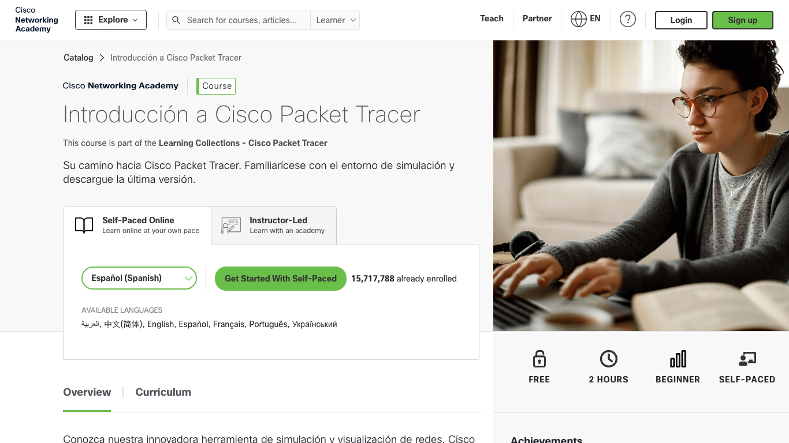
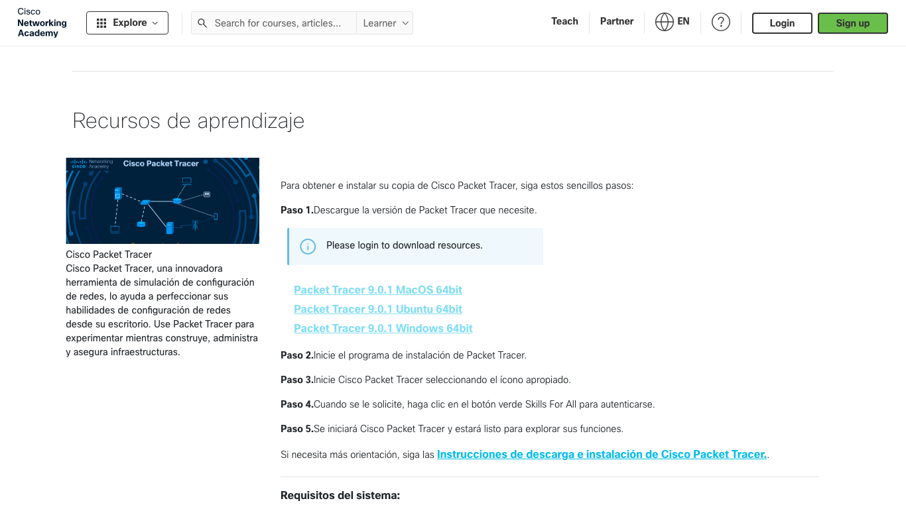

# Cisco Packet Tracer — guía inicial

## 0. Qué es Packet Tracer y qué vas a necesitar

**Packet Tracer** es el simulador de redes de Cisco: montas topologías, configuras equipos y observas el tráfico sin cablear un rack. Es gratuito, pero para descargarlo y para abrirlo hace falta una cuenta en **Cisco Networking Academy (NetAcad)**.

**Requisitos del equipo**

- Windows 11, macOS 12 o posterior, o Ubuntu 22.04 / 24.04.
- Procesador de 64 bits (amd64), unos **4 GB de RAM** libres y **1,4 GB** de disco.
- No existe versión para móvil ni tableta.

**Tu correo:** el de la identidad digital GVA, con dominio **`@alu.edu.gva.es`**. Con ese correo creas la cuenta NetAcad y entras en Packet Tracer.

---

## 1. Crear tu cuenta NetAcad

Entra en [netacad.com](https://www.netacad.com) y crea la cuenta **tú mismo** con tu correo `@alu.edu.gva.es`. El alta es libre: no necesitas código ni acceso previo del centro. Usa siempre ese correo; no uses Gmail ni otro correo personal.

<figure markdown="span">
  { width="700" }
  <figcaption>https://www.netacad.com/es — captura 2026-09-25. Courtesy of Cisco Systems, Inc. Unauthorized use not permitted.</figcaption>
</figure>

Pulsa **Inscríbase** (o *Sign up*), confirma el correo si te lo pide y guarda usuario y contraseña en un sitio seguro.

---

## 2. Matricularte en «Getting Started with Cisco Packet Tracer»

El curso gratuito **Getting Started with Cisco Packet Tracer** (unas 2 horas) es el camino oficial para acceder a la descarga. Ábrelo aquí:

[https://www.netacad.com/courses/getting-started-cisco-packet-tracer](https://www.netacad.com/courses/getting-started-cisco-packet-tracer)

En español verás el título **Introducción a Cisco Packet Tracer**. Elige el idioma y pulsa el botón para empezar (por ejemplo *Get Started With Self-Paced*).

<figure markdown="span">
  { width="700" }
  <figcaption>https://www.netacad.com/courses/getting-started-cisco-packet-tracer?courseLang=es-XL — captura 2026-09-25. Courtesy of Cisco Systems, Inc. Unauthorized use not permitted.</figcaption>
</figure>

En el taller no hace falta terminar el curso entero para abrir Packet Tracer si ya está instalado; en casa sí necesitas esta matrícula (y la sesión iniciada) para poder descargar el instalador.

---

## 3. Descargar Packet Tracer

Ve al Resource Hub de descargas:

[https://www.netacad.com/resources/lab-downloads](https://www.netacad.com/resources/lab-downloads)

**Sin sesión iniciada** aparece el aviso *Please login to download resources* (o similar en español) y no puedes descargar. Inicia sesión en NetAcad y vuelve a esta página. Elige la versión de tu sistema (Windows, Ubuntu o macOS). La versión que veas hoy puede cambiar; descarga la que ofrezca NetAcad en ese momento.

<figure markdown="span">
  { width="700" }
  <figcaption>https://www.netacad.com/resources/lab-downloads?courseLang=es-XL — captura 2026-09-25. Courtesy of Cisco Systems, Inc. Unauthorized use not permitted.</figcaption>
</figure>

Los pasos 2 y 3 solo hacen falta para instalar Packet Tracer en **tu ordenador de casa**. En el aula ya está instalado: pasa al apartado 5.

---

## 4. Instalar

=== "Ordenadores del aula"

    En los ordenadores del taller **Packet Tracer ya está instalado**. No hace falta descargar ni instalar nada: abre el programa e inicia sesión (apartado 5).

=== "Windows"

    1. Ejecuta el instalador que has descargado.
    2. Acepta la licencia y pulsa *Siguiente* hasta terminar.
    3. Deja marcada la opción de abrir Packet Tracer al acabar, si aparece.
    4. Si Windows muestra el aviso del cortafuegos, **permite el acceso en redes privadas**.

=== "Linux (Ubuntu)"

    En la carpeta de descargas:

    ```bash
    sudo apt install ./CiscoPacketTracer_XXX_Ubuntu_64bit.deb
    ```

    Sustituye `XXX` por la versión del archivo que hayas bajado. Acepta la licencia. Ábrelo desde el menú de aplicaciones o con el comando `packettracer`.

---

## 5. Primer inicio de sesión dentro de Packet Tracer

Al abrir Packet Tracer aparece la ventana de inicio de sesión. Pulsa el botón de login (según la versión pone **Login** o **Skills For All**): se abre el navegador.

- Si ya tenías la sesión de NetAcad abierta, verás un mensaje del tipo *You have successfully logged in to Cisco Packet Tracer*: cierra esa pestaña y vuelve al programa.
- Si no, entra con tu cuenta GVA (`@alu.edu.gva.es`).

Marca **Keep me logged in** solo en **tu** ordenador personal. En el del aula, no: son equipos compartidos.

---

## 6. Abrir, guardar y entregar un `.pkt`

- **Abrir:** *Archivo > Abrir* (*File > Open*) o doble clic en un `.pkt` descargado de Aules.
- **Guardar:** *Archivo > Guardar como* (*File > Save As*) con el nombre que pida la práctica (por ejemplo `PR1XX.pkt`).

**`.pkt`** es una red normal que montas o modificas. **`.pka`** es una actividad con ventana de instrucciones y porcentaje de completado.

Cuando la práctica lo pida, sube a Aules el `.pkt` **junto** al informe en Markdown (`.md`).

---

## 7. Problemas frecuentes

| Síntoma | Qué hacer |
| --- | --- |
| No veo los botones o enlaces de descarga | No has iniciado sesión en [netacad.com](https://www.netacad.com). Entra y recarga la página de descargas. |
| El login de Packet Tracer se queda cargando | Entra antes en NetAcad desde el navegador y vuelve a intentarlo. Prueba con Chrome o borra la caché de los sitios de Cisco. |
| No me llega el correo de confirmación de NetAcad | Mira en **correo no deseado** de tu cuenta GVA. |
| Un `.pkt` no abre o avisa de la versión | Se guardó con una versión más nueva; actualiza Packet Tracer desde el Resource Hub. |
| Aviso del cortafuegos de Windows | Permitir el acceso en **redes privadas**. |
| Quiero instalarlo en el móvil o en la tableta | No existe esa versión. |

---

## 8. Vídeo de apoyo

Pablo Hidalgo enseña en 7 minutos cómo crear la cuenta, descargar Packet Tracer, instalarlo e iniciar sesión. Cuando propone entrar con Google, **tú usa tu cuenta `@alu.edu.gva.es`**.

<div style="position: relative; padding-bottom: 56.25%; height: 0; overflow: hidden;">
  <iframe src="https://www.youtube-nocookie.com/embed/OanaO6EF5S4"
          style="position: absolute; top: 0; left: 0; width: 100%; height: 100%;"
          frameborder="0"
          allow="accelerometer; autoplay; clipboard-write; encrypted-media; gyroscope; picture-in-picture"
          allowfullscreen
          title="Cisco Packet Tracer — cuenta, descarga e inicio (Pablo Hidalgo)"></iframe>
</div>

---

## 9. Comprobación

- [ ] Cuenta GVA (`@alu.edu.gva.es`) creada en NetAcad
- [ ] Sesión iniciada dentro de Packet Tracer
- [ ] Un `.pkt` guardado con el nombre de la práctica
- [ ] En casa (opcional): matrícula en *Getting Started* y Packet Tracer instalado

Cuando termines, vuelve a las [actividades del Tema 1](../01-introduccion-arquitectura/tema1.md#actividades).
