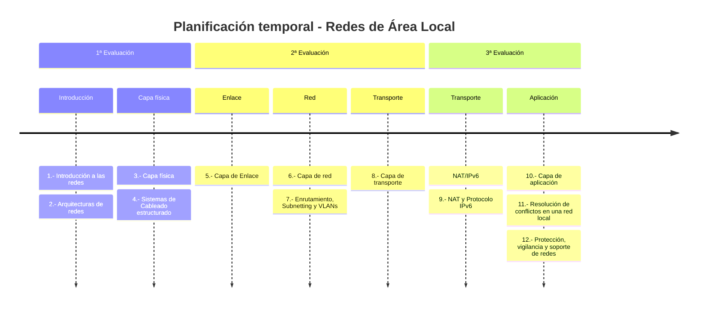

# Redes de área local

Aquí puedes encontrar los apuntes y actividades del módulo  0225 de ***Redes de área local*** del CFGM de *Sistemas Microinformáticos y Redes* (SMR), cuyo currículo viene fijado por el [Real Decreto 1691/2007](https://www.boe.es/diario_boe/txt.php?id=BOE-A-2008-819), impartido en el [IES Macià Abela](https://portal.edu.gva.es/iesmaciaabela/) de Crevillente.

## Competencias profesionales

Las ^^Competencias profesionales^^ asociadas al módulo Redes de área local:

* (d) Replantear el cableado y la electrónica de redes locales en pequeños entornos y su conexión con redes de área extensa canalizando a un nivel superior los supuestos que así lo requieran.
* (e) Instalar y configurar redes locales cableadas, inalámbricas o mixtas y su conexión a redes públicas, asegurando su funcionamiento en condiciones de calidad y seguridad.
* (f) Instalar, configurar y mantener servicios multiusuario, aplicaciones y dispositivos compartidos en un entorno de red local, atendiendo a las necesidades y requerimientos especificados.
* (g) Realizar las pruebas funcionales en sistemas microinformáticos y redes locales, localizando y diagnosticando disfunciones, para comprobar y ajustar su funcionamiento.
* (h) Mantener sistemas microinformáticos y redes locales, sustituyendo, actualizando y ajustando sus componentes, para asegurar el rendimiento del sistema en condiciones de calidad y seguridad.

## Objetivos generales

Los ^^objetivos generales^^ correspondientes son:

Objetivos generales vinculados al módulo Redes de área local (0225):

* (d) Representar la posición de los equipos, líneas de transmisión y demás elementos de una red local, analizando la morfología, condiciones y características del despliegue, para replantear el cableado y la electrónica de la red.
* (e) Ubicar y fijar equipos, líneas, canalizaciones y demás elementos de una red local cableada, inalámbrica o mixta, aplicando procedimientos de montaje y protocolos de calidad y seguridad, para instalar y configurar redes locales.
* (f) Interconectar equipos informáticos, dispositivos de red local y de conexión con redes de área extensa, ejecutando los procedimientos para instalar y configurar redes locales.
* (g) Localizar y reparar averías y disfunciones en los componentes físicos y lógicos para mantener sistemas microinformáticos y redes locales.
* (h) Sustituir y ajustar componentes físicos y lógicos para mantener sistemas microinformáticos y redes locales.

## Resultados de aprendizaje

Los ^^Resultados de Aprendizaje^^ del módulo **Redes de área local (0225)** son:

| Código | Descripción | Peso (%) |
| ------ | ----------- | -------- |
| RA1 | Reconoce la estructura de redes locales cableadas analizando las características de entornos de aplicación y describiendo la funcionalidad de sus componentes. | 15 |
| RA2 | Despliega el cableado de una red local interpretando especificaciones y aplicando técnicas de montaje. | 15 |
| RA3 | Interconecta equipos en redes locales cableadas describiendo estándares de cableado y aplicando técnicas de montaje de conectores. | 20 |
| RA4 | Instala equipos en red, describiendo sus prestaciones y aplicando técnicas de montaje. | 20 |
| RA5 | Mantiene una red local interpretando recomendaciones de los fabricantes de hardware o software y estableciendo la relación entre disfunciones y sus causas. | 15 |
| RA6 | Cumple las normas de prevención de riesgos laborales y de protección ambiental, identificando los riesgos asociados, las medidas y equipos para prevenirlos. | 15 |

## Unidades de Trabajo

A partir de los RA, hemos definido 7 unidades de trabajo (UT).

El módulo de *Redes de área local* viene fijado con una carga lectiva de **233 h**, repartidas en **7 sesiones semanales**, a lo largo de 32 semanas. Este curso se ha planificado sobre un total de 28 semanas, dejando las últimas 10 semanas para el desarrollo, por parte del alumnado, del programa formativo dual en la empresa. Estas 28 semanas hacen un total de 196 horas lectivas.

A continuación, en la siguiente tabla y a modo de mapa general, se muestran las diferentes UT y los RA que cubren, indicando la carga horaria empleada durante el presente curso en cada una de ellas:

| Unidades de Trabajo   | RA1 | RA2 | RA3 | RA4 | RA5 | RA6 |
|-----------------------|:---:|:---:|:---:|:---:|:---:|:---:|
| [1. Introducción a las redes]()                     | X   |     |     |     |     |     |
| [2. Arquitecturas de redes]()                       | X   |     |     |     |     |     |
| [3. Capa física]()                                  |     | X   | X   | X   |     |    |
| [4. Sistemas de Cableado estructurado]()            | X   | X   | X   |     |     |    |
| [5. Capa de Enlace]()                               | X   |     | X   | X   |     |    |
| [6. Capa de red]()                                  | X   |     | X   | X   |     |     |
| [7. Enrutamiento, Subnetting y VLANs]()                                 |     |     | X   | X   |     |     |
| [8. Capa de transporte]()                           |     |     |     | X   | X   |     |
| [9. NAT y Protocolo IPv6]()                         |     |     |     | X   | X   |     |
| [10. Capa de aplicación]()                          |     |     |     | X   | X   |     |
| [11. Resolución de conflictos en una red local]()   |     |     |     |     | X   | X   |
| [12. Protección, vigilancia y soporte de redes]()   |     |     |     |     | X   | X   |
| **Total - 233 h**   **Porcentaje**                          | X 15% | X 15%  | X 20% | X 20% | X 15%  | X 15% | X 15%  | 

## Evaluación

Para la evaluación del módulo de *Redes de área local* se ponderarán los resultados de aprendizaje respecto a los porcentajes indicados en el apartado anterior.

Para la evaluación de cada RA, emplearemos diferentes Instrumentos de Evaluación (IE), como pueden ser:

* **Actividades de enseñanza/aprendizaje**, normalmente realizadas en el aula, acompañadas de una rúbrica. Distinguiremos las **actividades de clase** (:simple-readdotcv: AC), las cuales se calificarán normalmente sobre una escala de 3 puntos, de las **actividades de refuerzo** (:material-head-question-outline: AR), también sobre 3 puntos para consolidar uno o varios CE no conseguidos, así como **actividades de profundización** (:material-shovel: AP) que aportarán puntos extra al RA.
* **Prácticas** (:simple-neutralinojs: PR) o **trabajo de investigación** (:material-test-tube: TI), con una carga temporal variable, entre una semana o toda una unidad didáctica. Normalmente calificados sobre 10 puntos.
* **Proyectos** (:material-calendar: PY), bien de desarrollo individual o en parejas, sobre un determinado RA. Normalmente calificados sobre 30 puntos.
* **Pruebas objetivas** (:material-pen: PO). En algunos RA, y no de forma generalizada, se realizará una prueba objetiva (ya sea escrita o en ordenador). Normalmente calificados sobre 30 puntos.

Para calcular la calificación de cada resultado de aprendizaje, se realizará la media ponderada simple de los diferentes instrumentos de evaluación empleados en dicho RA, para comprobar que se han cubierto todos los criterios de evaluación.

<!-- , puedes consultar la página de [validación](validacion.md) -->

Todas las calificaciones, tanto de los instrumentos de evaluación como de los propios RA, se podrán consultar en todo momento en la plataforma *Aules* del curso.

## Materiales

A lo largo del curso, iremos trabajando diferentes materiales disponibles en este espacio web.

Cada una de las UT comenzará con un resumen de la **Propuesta Didáctica** que se plantea, los elementos que va a cubrir, tanto el RA a trabajar como sus criterios de evaluación (CE) asociados, así como un cuestionario inicial para reflexionar sobre nuestro conocimiento previo.

En la parte final de cada sesión, además de diferentes recursos de **Referencia** para ampliar conocimientos, se plantean una serie de **Actividades** que iremos trabajando en su mayor medida en el aula. Cada una de las actividades indica el RA que cubre, los CE que trabaja, así como su calificación, la cual luego se verá reflejada en la rúbrica de la entrega de dicha tarea en Aules. Además, las actividades están codificadas con el prefijo del tipo de instrumento de evaluación, así como la unidad que cubren (por ejemplo, la actividad AC207 será la 7ª actividad de clase de la unidad 2).

Respecto a los recursos tecnológicos, aunque inicialmente trabajaremos con papel y lápiz, luego pasaremos a utilizar el programa [excalidraw](https://excalidraw.com) para diseño de escenarios de redes, y simuladores como [packetracer](https://www.netacad.com/es/cisco-packet-tracer) y [GNS3](https://www.gns3.com).

*[CFGM]: Ciclo Formativo de Grado Medio  
*[SMR]: Sistemas Microinformáticos en Red   
*[RA]: Resultado de aprendizaje  
*[UT]: Unidad de trabajo  
*[IE]: Instrumento de evaluación  
*[CE]: Criterio de evaluación